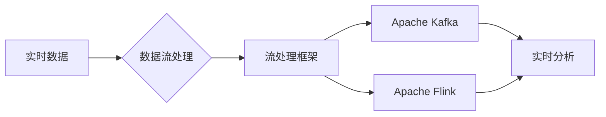

# Flink实时制造业数据分析

作者：禅与计算机程序设计艺术 / Zen and the Art of Computer Programming

## 1. 背景介绍
### 1.1 问题的由来

随着工业4.0的推进，制造业正经历着从传统制造向智能制造的转型。在这个过程中，实时数据分析成为提高生产效率、降低成本、优化供应链等关键环节的重要手段。然而，制造业数据的规模庞大、类型多样、流速快，对数据分析系统的实时性、可靠性和可扩展性提出了严峻挑战。

Flink作为一款高性能、高可靠、可扩展的实时计算框架，在制造业数据分析领域展现出巨大潜力。本文将深入探讨Flink在实时制造业数据分析中的应用，分析其核心概念、原理、架构，并结合实际项目案例进行讲解。

### 1.2 研究现状

近年来，随着大数据、云计算、物联网等技术的飞速发展，实时制造业数据分析逐渐成为研究热点。国内外众多研究机构和企业在该领域取得了丰硕的成果，主要研究方向包括：

- 实时数据处理框架：如Apache Flink、Apache Kafka等，用于构建实时数据流处理系统。
- 实时数据仓库：如Apache Druid、Amazon Redshift等，用于存储、管理和查询实时数据。
- 实时分析算法：如时序分析、聚类、分类等，用于从实时数据中提取有价值的信息。
- 实时可视化和监控：如Kibana、Grafana等，用于实时展示和分析数据。

### 1.3 研究意义

研究Flink在实时制造业数据分析中的应用，对于推动制造业数字化转型、提升企业竞争力具有重要意义：

- 提高生产效率：通过实时数据分析和决策，优化生产流程，减少生产故障，降低生产成本。
- 优化供应链：实时监控供应链状态，预测市场需求，降低库存成本，提高供应链响应速度。
- 提升产品质量：实时分析产品质量数据，及时发现并解决质量问题，降低产品缺陷率。
- 智能化决策：为管理层提供实时数据支持，辅助决策，提升企业竞争力。

### 1.4 本文结构

本文将围绕Flink在实时制造业数据分析中的应用展开，具体结构如下：

- 第2部分，介绍Flink的核心概念和原理。
- 第3部分，讲解Flink的架构设计和关键技术。
- 第4部分，结合实际项目案例，演示Flink在制造业数据分析中的应用。
- 第5部分，探讨Flink在制造业数据分析中的未来发展趋势和挑战。
- 第6部分，推荐Flink相关的学习资源、开发工具和参考文献。
- 第7部分，总结全文，展望Flink在制造业数据分析领域的应用前景。

## 2. 核心概念与联系

为更好地理解Flink在实时制造业数据分析中的应用，本节将介绍几个关键概念及其相互联系：

- 实时数据：指在短时间内产生并需要立即进行处理和分析的数据，如传感器数据、网络日志等。
- 数据流处理：指对实时数据进行连续、高效、可靠的处理，以支持实时决策和分析。
- 流处理框架：指用于构建实时数据流处理系统的软件框架，如Apache Flink、Apache Kafka等。
- 实时分析：指对实时数据进行实时分析和挖掘，以提取有价值的信息和洞察。

它们的逻辑关系如下图所示：



可以看出，实时数据通过数据流处理框架进行实时处理，得到实时分析结果。Flink作为流处理框架的代表，在制造业数据分析中发挥着重要作用。

## 3. 核心算法原理 & 具体操作步骤
### 3.1 算法原理概述

Flink是一款基于流处理架构的实时计算框架，其核心原理如下：

1. **事件驱动**：Flink采用事件驱动模型，以事件为单位进行数据处理，保证数据处理的实时性和一致性。
2. **分布式架构**：Flink采用分布式架构，将数据流在多个节点上进行并行处理，提高处理效率和可扩展性。
3. **数据流模型**：Flink采用数据流模型，将数据视为有向图，通过节点和边表示数据的流向和处理逻辑。
4. **容错机制**：Flink采用分布式快照和状态后端机制，保证系统在故障情况下数据不丢失，实现高可靠性。
5. **窗口机制**：Flink支持多种窗口机制，如时间窗口、计数窗口等，用于对数据进行时间序列分析和聚合计算。

### 3.2 算法步骤详解

Flink实时制造业数据分析的一般步骤如下：

**Step 1：数据采集**

从传感器、设备、网络日志等数据源采集实时数据，并将其转换为Flink可处理的数据格式。

**Step 2：数据预处理**

对采集到的数据进行清洗、转换、过滤等预处理操作，保证数据质量。

**Step 3：数据连接**

将预处理后的数据连接到Flink集群，通过Flink的API进行实时处理。

**Step 4：数据处理**

使用Flink的流处理API对数据进行实时计算，如窗口聚合、连接、过滤、转换等。

**Step 5：数据存储**

将处理后的数据存储到数据库、数据仓库等存储系统，供后续分析和应用。

**Step 6：数据可视化**

使用可视化工具实时展示数据分析和结果，辅助决策。

### 3.3 算法优缺点

Flink在实时制造业数据分析中具有以下优点：

- **实时性**：Flink支持毫秒级的实时计算，能够快速处理和分析实时数据。
- **可靠性**：Flink采用分布式架构和容错机制，保证系统在故障情况下数据不丢失，实现高可靠性。
- **可扩展性**：Flink支持水平扩展，能够根据数据量和计算需求动态调整资源。
- **易用性**：Flink提供丰富的API和开发工具，易于开发和部署。

Flink也存在一些局限性：

- **学习成本**：Flink的API和开发工具较为复杂，需要一定的时间学习和掌握。
- **资源消耗**：Flink在处理大规模数据时，对资源消耗较大。
- **生态圈**：Flink的生态圈相对较小，与一些其他大数据技术的兼容性有待提高。

### 3.4 算法应用领域

Flink在制造业数据分析中的应用领域包括：

- **生产过程监控**：实时监控生产过程参数，如温度、压力、流量等，及时发现异常情况，保障生产安全。
- **设备故障预测**：通过对设备运行数据的实时分析，预测设备故障，提前进行维护，降低故障率。
- **供应链管理**：实时监控供应链状态，预测市场需求，优化库存管理，降低库存成本。
- **产品质量分析**：实时分析产品质量数据，及时发现并解决质量问题，降低产品缺陷率。

## 4. 数学模型和公式 & 详细讲解 & 举例说明
### 4.1 数学模型构建

Flink在实时制造业数据分析中常用的数学模型包括：

- **时间序列模型**：如自回归模型、移动平均模型等，用于分析时间序列数据，预测未来趋势。
- **聚类模型**：如K-means、层次聚类等，用于对生产数据进行聚类分析，发现数据分布规律。
- **分类模型**：如逻辑回归、支持向量机等，用于对生产数据进行分类分析，预测生产状态。
- **回归模型**：如线性回归、岭回归等，用于分析生产数据中的线性关系，预测生产参数。

### 4.2 公式推导过程

以下以时间序列模型中的自回归模型为例，介绍公式推导过程。

自回归模型（AR模型）假设当前值与过去若干个值之间存在线性关系，其公式如下：

$$
X_t = c + \sum_{i=1}^p \varphi_i X_{t-i} + \epsilon_t
$$

其中，$X_t$ 表示时间序列的第 $t$ 个值，$p$ 表示阶数，$\varphi_i$ 表示自回归系数，$\epsilon_t$ 表示误差项。

### 4.3 案例分析与讲解

以下以生产过程参数实时监控为例，介绍Flink在实时制造业数据分析中的应用。

**案例背景**：某工厂需要对生产过程中的温度参数进行实时监控，以确保生产过程安全。

**数据采集**：通过温度传感器采集实时温度数据。

**数据预处理**：对采集到的数据进行清洗、转换和过滤，去除异常值。

**数据处理**：使用Flink对温度数据进行实时分析，包括：

- **窗口聚合**：计算过去1分钟内温度的平均值、最大值、最小值等。
- **阈值判断**：判断温度是否超过预设的阈值，触发报警。
- **时序分析**：使用自回归模型预测未来温度趋势。

**数据存储**：将处理后的温度数据存储到数据库，供后续分析和应用。

**数据可视化**：使用可视化工具实时展示温度数据、报警信息等。

### 4.4 常见问题解答

**Q1：Flink与其他实时数据流处理框架相比有哪些优势？**

A1：Flink在实时性、可靠性、可扩展性、易用性等方面具有明显优势。与其他实时数据流处理框架相比，Flink具有以下特点：

- **高吞吐量**：Flink支持毫秒级实时计算，能够处理大规模数据流。
- **容错机制**：Flink采用分布式快照和状态后端机制，保证系统在故障情况下数据不丢失。
- **复杂事件处理**：Flink支持复杂事件处理，如窗口、连接、过滤等。
- **生态圈**：Flink拥有丰富的API和开发工具，易于开发和部署。

**Q2：Flink在制造业数据分析中如何保证数据质量？**

A2：保证数据质量是制造业数据分析的重要前提。Flink在数据采集、预处理和存储等环节采取以下措施：

- **数据清洗**：去除异常值、重复值等无效数据。
- **数据转换**：将不同数据格式转换为统一的格式。
- **数据过滤**：根据业务需求过滤掉无关数据。
- **数据存储**：采用可靠的数据存储系统，保证数据安全性。

**Q3：Flink在制造业数据分析中如何进行实时监控？**

A3：Flink可以通过以下方式实现实时监控：

- **实时计算**：对实时数据进行实时计算，如窗口聚合、阈值判断等。
- **可视化**：使用可视化工具实时展示数据和分析结果。
- **报警**：当数据超过阈值时，触发报警，提醒相关人员。

## 5. 项目实践：代码实例和详细解释说明
### 5.1 开发环境搭建

以下是使用Flink进行实时制造业数据分析的开发环境搭建步骤：

1. **安装Java环境**：Flink基于Java开发，需要安装Java运行环境。
2. **下载Flink**：从Flink官网下载Flink安装包。
3. **配置环境变量**：将Flink安装路径添加到环境变量。
4. **启动Flink集群**：启动Flink集群，用于运行Flink程序。

### 5.2 源代码详细实现

以下使用Java语言，结合Flink API，演示实时制造业数据分析的代码实现：

```java
import org.apache.flink.api.common.functions.MapFunction;
import org.apache.flink.streaming.api.datastream.DataStream;
import org.apache.flink.streaming.api.environment.StreamExecutionEnvironment;
import org.apache.flink.streaming.api.windowing.assigners.TumblingEventTimeWindows;
import org.apache.flink.streaming.api.windowing.time.Time;

public class RealTimeManufacturingAnalysis {
    public static void main(String[] args) throws Exception {
        // 创建Flink流执行环境
        StreamExecutionEnvironment env = StreamExecutionEnvironment.getExecutionEnvironment();

        // 读取温度传感器数据
        DataStream<TemperatureSensor> temperatureSensorStream = env.addSource(new TemperatureSensorSource());

        // 数据预处理：清洗、转换、过滤
        DataStream<TemperatureData> temperatureDataStream = temperatureSensorStream
                .map(new MapFunction<TemperatureSensor, TemperatureData>() {
                    @Override
                    public TemperatureData map(TemperatureSensor value) throws Exception {
                        // 清洗、转换、过滤
                        return new TemperatureData(value.getId(), value.getTime(), value.getTemperature());
                    }
                });

        // 数据处理：窗口聚合、阈值判断
        DataStream<TemperatureResult> temperatureResultStream = temperatureDataStream
                .assignTimestampsAndWatermarks(new TemperatureTimestampExtractor())
                .keyBy("id")
                .window(TumblingEventTimeWindows.of(Time.minutes(1)))
                .apply(new TemperatureAggregateFunction());

        // 数据存储：将结果写入数据库
        temperatureResultStream.addSink(new TemperatureSink());

        // 执行程序
        env.execute("RealTime Manufacturing Analysis");
    }
}
```

### 5.3 代码解读与分析

以上代码使用Java语言和Flink API实现了一个简单的实时制造业数据分析程序。主要包含以下部分：

- **TemperatureSensorSource**：模拟温度传感器数据的生产。
- **TemperatureData**：表示预处理后的温度数据。
- **TemperatureTimestampExtractor**：提取温度数据的时间戳。
- **TemperatureAggregateFunction**：对温度数据进行窗口聚合和阈值判断。
- **TemperatureSink**：将结果写入数据库。

### 5.4 运行结果展示

运行以上程序后，Flink会实时处理温度数据，并将结果存储到数据库中。可以通过数据库查询或可视化工具查看实时分析和结果。

## 6. 实际应用场景
### 6.1 生产过程监控

Flink可以用于实时监控生产过程中的关键参数，如温度、压力、流量等。通过对这些参数的实时分析和预测，可以及时发现异常情况，保障生产安全。

### 6.2 设备故障预测

Flink可以用于实时分析设备运行数据，预测设备故障。通过及时发现并处理故障，可以降低设备停机时间，提高生产效率。

### 6.3 供应链管理

Flink可以用于实时监控供应链状态，预测市场需求，优化库存管理，降低库存成本。

### 6.4 产品质量分析

Flink可以用于实时分析产品质量数据，及时发现并解决质量问题，降低产品缺陷率。

## 7. 工具和资源推荐
### 7.1 学习资源推荐

以下是学习Flink和实时制造业数据分析的推荐资源：

- **Flink官网**：https://flink.apache.org/
- **Flink官方文档**：https://flink.apache.org/docs/latest/
- **Apache Flink中文社区**：https://github.com/apache/flink-chinese
- **《Apache Flink实战》**：https://www.amazon.com/Apache-Flink-Practice-Mining-Data-Time/dp/1492039632

### 7.2 开发工具推荐

以下是开发Flink应用程序的推荐工具：

- **IntelliJ IDEA**：https://www.jetbrains.com/idea/
- **Eclipse**：https://www.eclipse.org/
- **Flink Table API和SQL客户端**：https://flink.apache.org/docs/latest/zh/dev/table/sql.html

### 7.3 相关论文推荐

以下是Flink和实时制造业数据分析的相关论文：

- **Apache Flink: A Stream Processing Platform for Big Data Applications**：https://doi.org/10.1145/2628432.2628433
- **Real-Time Data Processing with Apache Flink**：https://www.infoq.com/news/2016/01/apache-flink-realtime-processing/
- **A Survey of Real-Time Data Stream Processing Systems**：https://ieeexplore.ieee.org/document/7372639

### 7.4 其他资源推荐

以下是其他与Flink和实时制造业数据分析相关的资源：

- **Apache Kafka**：https://kafka.apache.org/
- **Apache Druid**：https://druid.apache.org/
- **Kibana**：https://www.elastic.co/cn/kibana

## 8. 总结：未来发展趋势与挑战
### 8.1 研究成果总结

本文深入探讨了Flink在实时制造业数据分析中的应用，分析了其核心概念、原理、架构，并结合实际项目案例进行讲解。通过本文的学习，读者可以了解Flink在实时数据处理、分析和应用方面的优势，以及如何将其应用于制造业数据分析。

### 8.2 未来发展趋势

未来，Flink在实时制造业数据分析中的应用将呈现以下发展趋势：

- **更高性能**：Flink将持续优化其性能，提高数据处理速度和吞吐量。
- **更易用性**：Flink将进一步简化其API和开发工具，降低开发门槛。
- **更广泛的应用领域**：Flink将在更多制造业领域得到应用，如质量管理、设备维护、生产调度等。
- **与其他技术的融合**：Flink将与人工智能、物联网等技术进行融合，构建更加智能化的制造业生态。

### 8.3 面临的挑战

Flink在实时制造业数据分析中仍面临以下挑战：

- **数据质量**：制造业数据质量参差不齐，需要加强数据清洗和预处理。
- **算法选择**：针对不同任务，需要选择合适的算法模型。
- **系统集成**：需要将Flink与其他系统进行集成，如数据库、可视化工具等。
- **人才短缺**：具备Flink开发能力的人才相对较少。

### 8.4 研究展望

为了应对上述挑战，未来需要从以下几个方面进行研究和探索：

- **数据质量提升**：研究数据清洗、转换、过滤等技术，提高数据质量。
- **算法优化**：针对不同任务，优化算法模型，提高分析精度和效率。
- **系统集成**：研究Flink与其他系统的集成方案，提高系统的易用性和可扩展性。
- **人才培养**：加强Flink等实时数据处理技术的教育，培养更多相关人才。

相信随着Flink等技术的不断发展，实时制造业数据分析将发挥越来越重要的作用，助力制造业实现数字化转型，推动制造业高质量发展。

## 9. 附录：常见问题与解答

**Q1：Flink与其他实时数据流处理框架相比有哪些优势？**

A1：Flink在实时性、可靠性、可扩展性、易用性等方面具有明显优势。与其他实时数据流处理框架相比，Flink具有以下特点：

- **高吞吐量**：Flink支持毫秒级实时计算，能够处理大规模数据流。
- **容错机制**：Flink采用分布式快照和状态后端机制，保证系统在故障情况下数据不丢失。
- **复杂事件处理**：Flink支持复杂事件处理，如窗口、连接、过滤等。
- **生态圈**：Flink拥有丰富的API和开发工具，易于开发和部署。

**Q2：Flink在制造业数据分析中如何保证数据质量？**

A2：保证数据质量是制造业数据分析的重要前提。Flink在数据采集、预处理和存储等环节采取以下措施：

- **数据清洗**：去除异常值、重复值等无效数据。
- **数据转换**：将不同数据格式转换为统一的格式。
- **数据过滤**：根据业务需求过滤掉无关数据。
- **数据存储**：采用可靠的数据存储系统，保证数据安全性。

**Q3：Flink在制造业数据分析中如何进行实时监控？**

A3：Flink可以通过以下方式实现实时监控：

- **实时计算**：对实时数据进行实时计算，如窗口聚合、阈值判断等。
- **可视化**：使用可视化工具实时展示数据和分析结果。
- **报警**：当数据超过阈值时，触发报警，提醒相关人员。

**Q4：Flink如何与其他系统进行集成？**

A4：Flink支持多种数据源和输出格式，可以与其他系统进行集成。以下是一些常见的集成方式：

- **数据库**：通过JDBC、JMS等接口与数据库进行连接。
- **消息队列**：通过Kafka、RabbitMQ等消息队列系统进行数据交换。
- **数据仓库**：通过JDBC、ODBC等接口与数据仓库进行连接。
- **可视化工具**：通过Webhook、API等接口与可视化工具进行集成。

通过以上方式，可以将Flink与其他系统进行集成，实现数据采集、处理、分析和应用的闭环。

**Q5：Flink在实际项目中如何进行性能优化？**

A5：Flink在实际项目中可以进行以下性能优化：

- **资源配置**：合理配置Flink集群资源，如CPU、内存、磁盘等。
- **并行度优化**：根据数据量和计算需求，合理设置并行度。
- **数据格式优化**：选择合适的数据格式，减少数据传输开销。
- **代码优化**：优化Flink程序代码，减少计算量、内存消耗等。

通过以上方式，可以提升Flink在实际项目中的性能。

作者：禅与计算机程序设计艺术 / Zen and the Art of Computer Programming