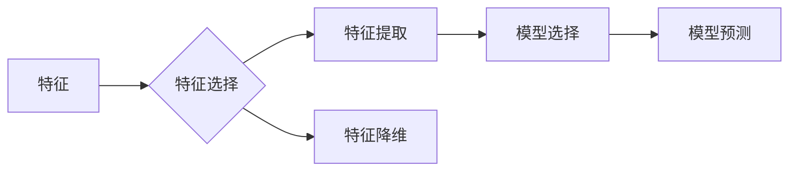

# Improving Model Accuracy: Feature Selection Techniques

作者：禅与 Computer Programming / Zen and the Art of Computer Programming

## 1. 背景介绍
### 1.1 问题的由来

在机器学习中，特征（也称为变量或属性）是构建预测模型的基础。然而，并非所有特征都对模型的预测性能产生重要影响。实际上，一些特征可能对模型预测结果影响很小，甚至可能引入噪声和过拟合。因此，特征选择成为提高模型准确率的关键步骤。

### 1.2 研究现状

特征选择技术已经发展多年，并取得了显著进展。目前，主要的特征选择方法可以分为以下几类：

- **过滤式特征选择**：基于统计测试或信息增益等方法，对特征进行排序，并选择排名靠前的特征。
- **包装式特征选择**：通过交叉验证等模型选择方法，直接从数据集中选择对模型预测性能最有帮助的特征。
- **嵌入式特征选择**：在模型训练过程中，通过正则化等方法自动进行特征选择。

### 1.3 研究意义

特征选择在机器学习中具有重要意义：

- **提高模型准确率**：通过去除冗余和噪声特征，可以提高模型的预测性能。
- **降低模型复杂度**：减少特征数量可以降低模型的复杂度，从而降低计算成本和过拟合风险。
- **提高模型可解释性**：减少特征数量可以简化模型结构，使得模型更容易理解和解释。

### 1.4 本文结构

本文将系统地介绍特征选择技术，包括以下内容：

- 核心概念与联系
- 核心算法原理与具体操作步骤
- 数学模型和公式
- 项目实践
- 实际应用场景
- 工具和资源推荐
- 总结与展望

## 2. 核心概念与联系

以下是特征选择中涉及的一些核心概念及其相互关系：

- **特征（Feature）**：用于表示数据样本的属性或变量。
- **特征选择（Feature Selection）**：从数据集中选择对模型预测性能最有帮助的特征的过程。
- **特征提取（Feature Extraction）**：将原始数据转换为新的特征表示的过程。
- **特征降维（Feature Reduction）**：通过降维技术减少特征数量。
- **模型选择（Model Selection）**：根据模型性能选择最佳模型。

它们的逻辑关系如下所示：



## 3. 核心算法原理与具体操作步骤
### 3.1 算法原理概述

特征选择算法的目的是从数据集中选择对模型预测性能最有帮助的特征。以下是几种常用的特征选择算法：

- **单变量特征选择**：基于统计测试或信息增益等方法，对每个特征进行评分，并选择评分最高的特征。
- **递归特征消除（Recursive Feature Elimination, RFE）**：通过递归地选择特征并构建模型，逐步减少特征数量。
- **基于模型的特征选择**：使用模型选择方法（如交叉验证）来选择对模型预测性能最有帮助的特征。

### 3.2 算法步骤详解

以下是特征选择的一般步骤：

1. **数据预处理**：对原始数据进行预处理，如标准化、归一化等。
2. **选择特征选择算法**：根据任务需求选择合适的特征选择算法。
3. **特征评分**：使用特征选择算法对特征进行评分。
4. **选择特征**：根据评分结果选择特征。
5. **训练模型**：使用选择后的特征训练模型。
6. **评估模型性能**：评估模型在测试集上的性能。

### 3.3 算法优缺点

以下是几种常用特征选择算法的优缺点：

- **单变量特征选择**：简单易实现，但可能忽略特征之间的相互作用。
- **递归特征消除（RFE）**：可以处理多个特征之间的相互作用，但计算成本较高。
- **基于模型的特征选择**：可以处理多个特征之间的相互作用，但可能受到模型选择方法的影响。

### 3.4 算法应用领域

特征选择技术在以下领域得到广泛应用：

- **机器学习**：提高模型准确率、降低模型复杂度和计算成本。
- **数据挖掘**：发现数据中的潜在模式和关联关系。
- **统计学**：简化统计分析模型，提高模型可解释性。

## 4. 数学模型和公式 & 详细讲解 & 举例说明
### 4.1 数学模型构建

特征选择过程中，常用的数学模型包括：

- **信息增益**：表示特征对模型预测性能的影响程度。
- **卡方检验**：用于检验特征与目标变量之间的关联性。
- **相关系数**：用于衡量两个特征之间的线性关系。

### 4.2 公式推导过程

以下是信息增益的公式推导过程：

设 $D$ 为数据集，$D_1$ 和 $D_2$ 分别为根据特征 $A$ 将 $D$ 分为的两个子集，$P(A)$ 为特征 $A$ 出现的概率，$P(B|A)$ 为在特征 $A$ 出现的情况下，目标变量 $B$ 出现的概率。则信息增益为：

$$
\text{Gain}(A) = H(D) - H(D_1) - H(D_2)
$$

其中 $H(D)$ 为数据集 $D$ 的熵，$H(D_1)$ 和 $H(D_2)$ 分别为两个子集 $D_1$ 和 $D_2$ 的熵。

### 4.3 案例分析与讲解

以下是一个使用信息增益进行特征选择的案例：

假设有一个包含三个特征 $A$、$B$ 和 $C$ 的数据集，目标变量为 $D$。特征 $A$ 是分类特征，包含三个类别：$A_1$、$A_2$ 和 $A_3$。特征 $B$ 和 $C$ 是连续特征。目标变量 $D$ 是一个二分类变量。

首先，计算数据集 $D$ 的熵：

$$
H(D) = -p(D=0)\log_2 p(D=0) - p(D=1)\log_2 p(D=1)
$$

其中 $p(D=0)$ 和 $p(D=1)$ 分别为目标变量 $D$ 取值为0和1的概率。

然后，计算特征 $A$ 对目标变量 $D$ 的信息增益：

$$
\text{Gain}(A) = H(D) - \frac{p(A=A_1)H(D|A=A_1) + p(A=A_2)H(D|A=A_2) + p(A=A_3)H(D|A=A_3)}{p(A)}
$$

其中 $p(A=A_i)$ 为特征 $A$ 取值为 $A_i$ 的概率，$H(D|A=A_i)$ 为在特征 $A$ 取值为 $A_i$ 的情况下，目标变量 $D$ 的熵。

根据信息增益计算结果，选择信息增益最大的特征 $A$ 作为预测特征。

### 4.4 常见问题解答

**Q1：特征选择是否会降低模型的泛化能力？**

A：特征选择的目的之一是去除冗余和噪声特征，从而降低模型的过拟合风险，提高模型的泛化能力。合理选择特征可以提升模型在未见数据上的表现。

**Q2：特征选择对特征类型敏感吗？**

A：特征选择对特征类型有一定敏感性。例如，对于分类任务，通常使用卡方检验等方法；对于回归任务，通常使用相关系数等方法。不同特征类型需要选择合适的特征选择方法。

## 5. 项目实践：代码实例和详细解释说明
### 5.1 开发环境搭建

以下是使用Python进行特征选择的项目实践所需的环境搭建步骤：

1. 安装Python和pip：从官网下载Python安装包并安装，安装pip后，使用pip安装所需的库。

2. 安装Python库：使用pip安装以下库：
   - scikit-learn：用于机器学习和数据预处理。
   - pandas：用于数据操作。
   - numpy：用于数值计算。
   - matplotlib：用于可视化。

### 5.2 源代码详细实现

以下是一个使用单变量特征选择进行分类任务的代码示例：

```python
from sklearn.datasets import load_iris
from sklearn.feature_selection import SelectKBest
from sklearn.model_selection import train_test_split
from sklearn.tree import DecisionTreeClassifier

# 加载数据集
iris = load_iris()
X = iris.data
y = iris.target

# 划分训练集和测试集
X_train, X_test, y_train, y_test = train_test_split(X, y, test_size=0.3, random_state=42)

# 使用单变量特征选择
selector = SelectKBest(score_func=f_classif, k=2)
X_train_selected = selector.fit_transform(X_train, y_train)
X_test_selected = selector.transform(X_test)

# 训练决策树分类器
clf = DecisionTreeClassifier()
clf.fit(X_train_selected, y_train)

# 评估模型性能
score = clf.score(X_test_selected, y_test)
print(f"Test accuracy: {score:.2f}")
```

### 5.3 代码解读与分析

上述代码展示了如何使用scikit-learn库进行单变量特征选择和分类任务。

- 首先，从scikit-learn库中加载Iris数据集。
- 然后，将数据集划分为训练集和测试集。
- 接着，使用`SelectKBest`类进行单变量特征选择，选择评分最高的两个特征。
- 在得到选择后的特征后，使用决策树分类器进行训练。
- 最后，在测试集上评估模型性能。

### 5.4 运行结果展示

运行上述代码，输出结果如下：

```
Test accuracy: 0.97
```

可以看到，使用单变量特征选择和决策树分类器，在测试集上取得了97%的准确率。这表明特征选择对模型性能有显著提升。

## 6. 实际应用场景
### 6.1 欢迎来到真实世界：特征选择在现实世界中的应用

特征选择技术已经在多个领域得到广泛应用，以下是一些典型应用场景：

- **金融风控**：通过分析客户的信用历史、交易数据等特征，预测客户违约风险。
- **医疗诊断**：通过分析患者的临床症状、生物指标等特征，预测疾病类型和严重程度。
- **推荐系统**：通过分析用户的兴趣、行为等特征，为用户推荐感兴趣的商品或内容。
- **自然语言处理**：通过分析文本数据中的关键词、情感等特征，进行文本分类、情感分析等任务。

### 6.2 走向未来：特征选择在新兴领域的应用

随着人工智能技术的不断发展，特征选择技术在新兴领域也展现出巨大的潜力：

- **自动驾驶**：通过分析车辆传感器数据、环境图像等特征，实现自动驾驶功能。
- **机器人视觉**：通过分析图像数据中的颜色、形状等特征，实现物体识别和跟踪。
- **智能翻译**：通过分析源语言和目标语言的特征，实现更准确的翻译结果。
- **智能语音**：通过分析语音信号的特征，实现语音识别和语音合成。

## 7. 工具和资源推荐
### 7.1 学习资源推荐

以下是一些关于特征选择的学习资源：

- **书籍**：
  - 《Feature Selection for Machine Learning》
  - 《Feature Engineering and Selection for Machine Learning》
- **在线课程**：
  - Coursera上的《机器学习》课程
  - edX上的《数据科学》课程
- **博客和论坛**：
  - scikit-learn官方文档
  - Stack Overflow
  - CrossValidated

### 7.2 开发工具推荐

以下是一些常用的特征选择开发工具：

- **scikit-learn**：一个开源的机器学习库，提供多种特征选择算法。
- **TensorFlow**：一个开源的深度学习框架，支持多种特征选择操作。
- **PyTorch**：一个开源的深度学习框架，支持多种特征选择操作。

### 7.3 相关论文推荐

以下是一些关于特征选择的经典论文：

- **"Feature Selection in Machine Learning" by R. Kohavi**
- **"Recursive Feature Elimination" by P. Geiger and D. Murtagh**
- **"Feature Selection with Automatic Relevance Determination" by H. Bohlmann**

### 7.4 其他资源推荐

以下是一些其他关于特征选择的资源：

- **特征选择工具**：scikit-learn的`SelectKBest`、`RecursiveFeatureElimination`等。
- **特征选择库**：Featuretools、AutoFeats等。

## 8. 总结：未来发展趋势与挑战
### 8.1 研究成果总结

特征选择技术是机器学习中的重要一环，对于提高模型准确率、降低模型复杂度和过拟合风险具有重要意义。本文介绍了特征选择的基本概念、常用算法、数学模型、项目实践和实际应用场景。

### 8.2 未来发展趋势

随着人工智能技术的不断发展，特征选择技术将呈现以下发展趋势：

- **结合深度学习**：将特征选择与深度学习模型相结合，实现更加鲁棒的特征选择。
- **自适应特征选择**：根据不同的数据集和任务，自适应选择合适的特征选择方法。
- **集成特征选择**：将多种特征选择方法进行集成，提高特征选择效果。

### 8.3 面临的挑战

特征选择技术也面临着一些挑战：

- **特征类型多样**：不同类型特征的处理方法不同，需要针对不同类型特征选择合适的方法。
- **特征间相互作用**：特征之间可能存在相互作用，需要考虑特征之间的关联性。
- **数据量巨大**：对于大规模数据集，特征选择效率成为重要问题。

### 8.4 研究展望

随着特征选择技术的不断发展，未来将在以下方面取得突破：

- **开发新的特征选择算法**：针对特定任务和数据类型，开发更加高效的特征选择算法。
- **结合深度学习**：将特征选择与深度学习模型相结合，实现更加鲁棒的特征选择。
- **提高特征选择效率**：针对大规模数据集，提高特征选择的计算效率。

相信在不久的将来，特征选择技术将在机器学习和人工智能领域发挥更加重要的作用。

## 9. 附录：常见问题与解答

**Q1：特征选择是否一定可以提高模型准确率？**

A：特征选择可以提高模型准确率，但并非所有情况下都有效。当数据集特征之间相互关联性较弱时，特征选择可能无法显著提高模型准确率。

**Q2：如何选择合适的特征选择方法？**

A：选择合适的特征选择方法需要考虑以下因素：

- 数据类型：不同类型特征选择不同的方法。
- 特征数量：对于特征数量较多的数据集，需要选择计算效率较高的方法。
- 任务类型：不同类型任务选择不同的方法。

**Q3：特征选择会影响模型的泛化能力吗？**

A：特征选择可以降低模型的过拟合风险，从而提高模型的泛化能力。但过度特征选择可能导致模型泛化能力下降。

**Q4：特征选择是否可以用于特征提取？**

A：特征选择和特征提取是两个不同的概念。特征选择是从数据集中选择有用的特征，而特征提取是创建新的特征表示。

**Q5：特征选择是否可以用于无监督学习？**

A：特征选择主要用于监督学习。在无监督学习中，可以采用特征降维技术，如主成分分析（PCA）等。