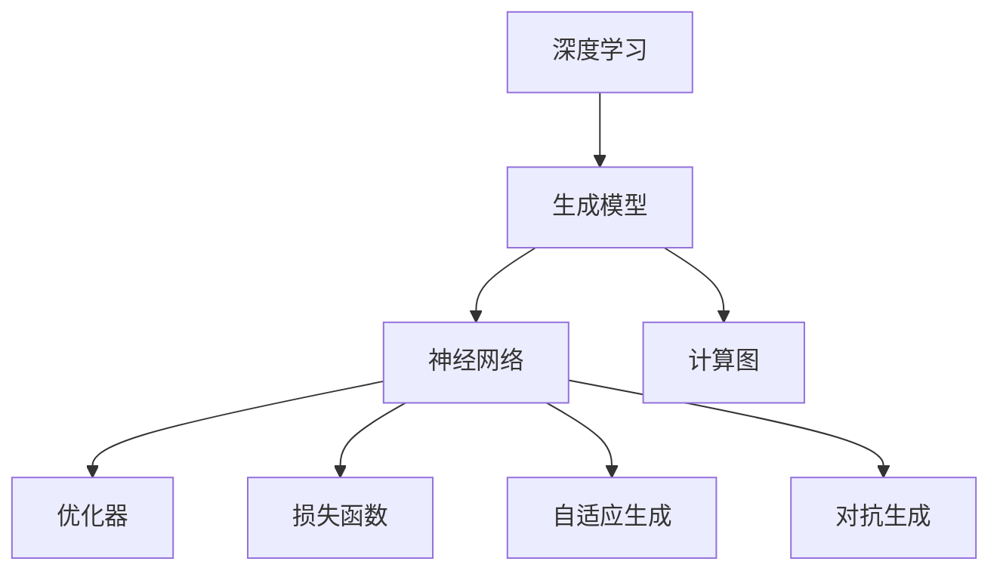
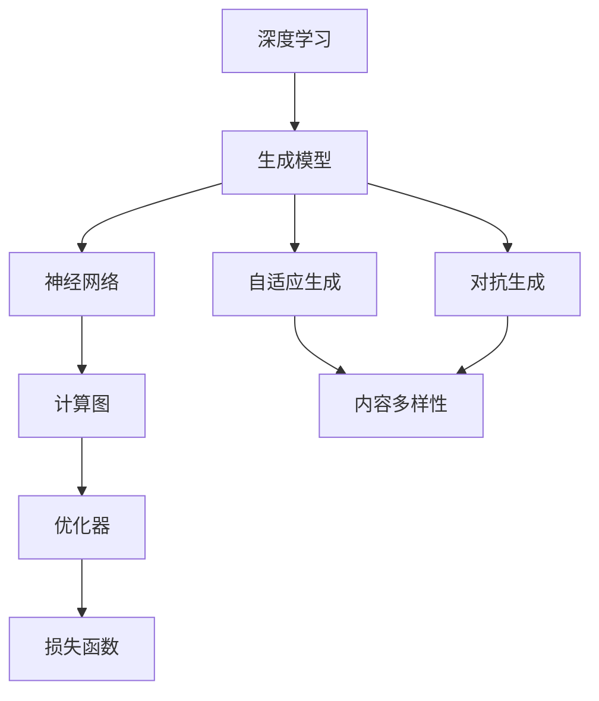
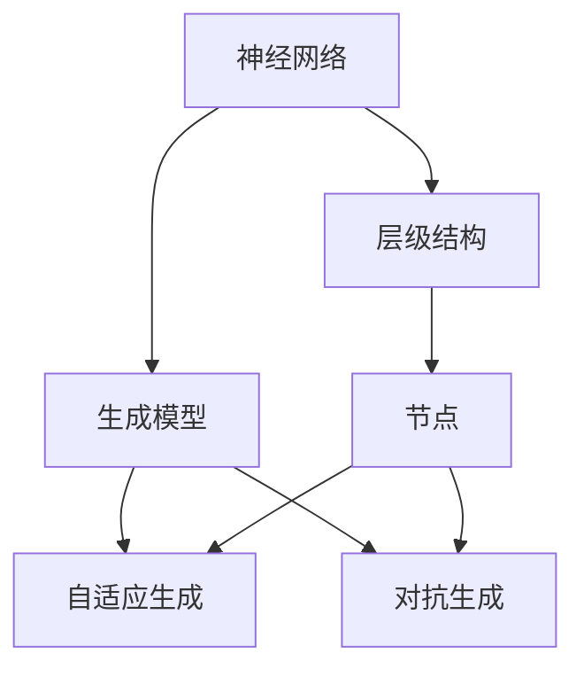
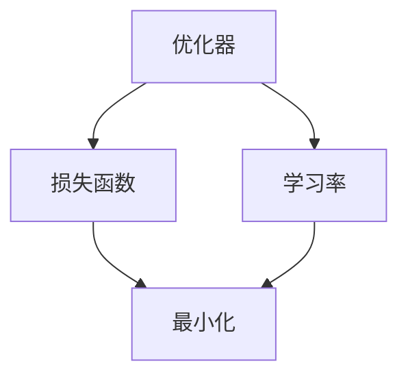
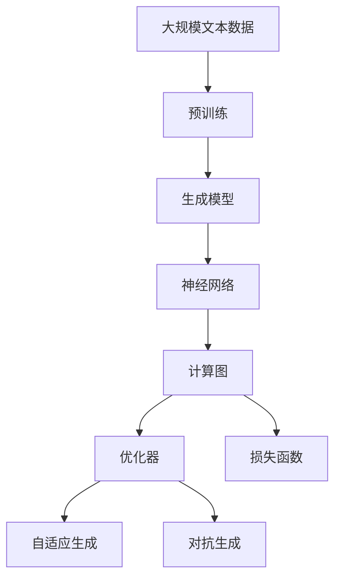

                 

# AIGC 原理与代码实例讲解

> 关键词：人工智能生成内容, 自适应生成模型, 深度学习, 神经网络, 计算图, 优化器, 损失函数

## 1. 背景介绍

### 1.1 问题由来

随着深度学习和大数据技术的不断成熟，人工智能生成内容(AI Generated Content, AIGC)正逐步改变着人们的生产生活方式。从图片生成、音乐创作、文案写作到视频制作，AIGC技术正在各行各业中大显身手。其背后驱动的核心原理是深度学习模型，尤其是基于神经网络的大规模训练。

### 1.2 问题核心关键点

AIGC技术的关键在于如何通过深度学习模型实现内容的高效生成。主要核心点包括：

- 如何设计并训练生成模型。
- 如何选择合适的损失函数和优化器。
- 如何处理生成内容的多样性和多样性问题。
- 如何优化生成过程的效率和效果。

### 1.3 问题研究意义

AIGC技术在现代科技发展中扮演着重要角色，具有广泛的应用前景和深远的社会影响。其主要研究意义包括：

- 大幅降低内容创作成本，提升内容生成效率。
- 促进跨领域知识的整合与创新，加速科技发展。
- 推动内容产业升级，助力文化产业数字化转型。
- 实现人机协同创作，提升用户交互体验。
- 挖掘数据背后的知识，助力决策和研究。

## 2. 核心概念与联系

### 2.1 核心概念概述

为更好地理解AIGC的原理和实现，本节将介绍几个关键概念：

- **生成模型（Generative Models）**：基于深度学习，能够从随机噪声中生成与训练数据相似的新样本的模型。

- **神经网络（Neural Networks）**：由神经元节点和层级结构组成的模型，具有强大的非线性映射能力，广泛应用于AIGC任务。

- **计算图（Computation Graph）**：深度学习模型中的核心组件，描述模型前向传播和反向传播的计算过程。

- **优化器（Optimizers）**：用于调整模型参数，最小化损失函数的算法。

- **损失函数（Loss Functions）**：衡量生成内容与真实内容之间差异的函数。

- **自适应生成（Adaptive Generation）**：模型根据输入调整生成策略，生成更具个性化和多样性的内容。

- **对抗生成（Adversarial Generation）**：通过生成模型与判别模型的对抗过程，提升生成内容的逼真度和质量。

这些概念之间的逻辑关系可以通过以下Mermaid流程图来展示：



这个流程图展示了大语言模型微调过程中各个核心概念的关系：

1. 深度学习是AIGC技术的核心驱动力。
2. 生成模型和神经网络构建了AIGC的基础结构。
3. 计算图描述了模型的前向传播和反向传播过程。
4. 优化器和损失函数用于训练和调整模型。
5. 自适应生成和对抗生成技术提升了生成内容的质量。

### 2.2 概念间的关系

这些核心概念之间存在着紧密的联系，形成了AIGC生成内容的完整生态系统。下面通过几个Mermaid流程图来展示这些概念之间的关系。

#### 2.2.1 AIGC的整体架构



这个流程图展示了AIGC技术从深度学习到生成内容的全过程。

#### 2.2.2 神经网络与生成模型的关系



这个流程图展示了神经网络在生成模型中的作用和过程。

#### 2.2.3 优化器与损失函数的关系



这个流程图展示了优化器与损失函数之间的相互依赖关系。

### 2.3 核心概念的整体架构

最后，我们用一个综合的流程图来展示这些核心概念在大语言模型微调过程中的整体架构：



这个综合流程图展示了从预训练到生成内容的完整过程。

## 3. 核心算法原理 & 具体操作步骤
### 3.1 算法原理概述

AIGC技术基于深度学习模型，通过生成模型从随机噪声中生成新样本。其核心算法包括神经网络、计算图、优化器和损失函数等。

具体来说，生成模型通常采用以下步骤：

1. 定义神经网络结构。
2. 构建计算图，描述模型前向传播和反向传播过程。
3. 选择合适的优化器和损失函数。
4. 通过前向传播计算损失，并根据损失函数反向传播调整模型参数。
5. 重复上述过程直至收敛。

### 3.2 算法步骤详解

以下是AIGC生成内容的一般流程：

**Step 1: 准备数据集**
- 收集并准备用于训练和评估的文本数据集。
- 对数据集进行预处理，包括分词、去除停用词、标准化等。

**Step 2: 定义模型**
- 选择合适的神经网络结构，如循环神经网络（RNN）、卷积神经网络（CNN）、变压器（Transformer）等。
- 根据任务需求，在模型顶层添加适当的输出层和损失函数。

**Step 3: 构建计算图**
- 使用计算图工具，如TensorFlow、PyTorch等，定义模型的计算流程。
- 构建前向传播和反向传播的计算图。

**Step 4: 选择优化器和损失函数**
- 选择合适的优化器，如Adam、SGD等，设置学习率。
- 根据任务需求，选择适当的损失函数，如交叉熵损失、均方误差损失等。

**Step 5: 训练和评估**
- 使用训练集数据，进行前向传播计算损失，并反向传播更新模型参数。
- 周期性在验证集上评估模型性能，根据评估结果调整模型。
- 重复上述过程直至模型收敛。

**Step 6: 生成内容**
- 使用训练好的模型，输入新的样本，生成对应的内容。
- 对生成的内容进行后处理，如格式化、校对等。

### 3.3 算法优缺点

AIGC技术的主要优点包括：

- 生成内容的质量高，能够产生逼真、多样和富有创意的内容。
- 降低内容创作成本，提升内容生成效率。
- 促进跨领域知识整合与创新。

但同时也存在一些缺点：

- 模型训练和生成的计算资源需求高，需要高性能计算设备。
- 生成的内容可能缺乏真实性和可信度，需要进行人工审查。
- 生成内容的风格和格式可能与人类期望不符，需要不断优化模型。

### 3.4 算法应用领域

AIGC技术在多个领域得到了广泛应用，例如：

- 内容创作：自动生成文章、文案、广告等。
- 视觉内容生成：生成图片、视频、动画等。
- 音乐创作：自动生成音乐、歌词等。
- 游戏设计：自动生成游戏任务、NPC对话等。
- 社交媒体：自动生成社交内容，如微博、推文等。

## 4. 数学模型和公式 & 详细讲解 & 举例说明

### 4.1 数学模型构建

AIGC生成内容的数学模型主要包括神经网络、计算图和损失函数。

- **神经网络模型**：
  - 输入层：将原始数据映射为网络可接受的向量表示。
  - 隐藏层：通过非线性变换提取特征。
  - 输出层：根据任务需求生成目标输出。

- **计算图模型**：
  - 前向传播：从输入到输出的计算过程。
  - 反向传播：从输出到输入的参数更新过程。

- **损失函数模型**：
  - 交叉熵损失：用于分类任务，衡量预测值与真实值之间的差异。
  - 均方误差损失：用于回归任务，衡量预测值与真实值之间的差异。

### 4.2 公式推导过程

以生成图片任务为例，使用GAN（Generative Adversarial Networks）模型生成图片的过程如下：

**生成器（Generator）**：
- 输入噪声向量 $z$，通过多层神经网络生成图片 $G(z)$。
- 使用ReLU激活函数：
  $$
  a_1 = f_1(z)
  $$
  $$
  a_2 = f_2(a_1)
  $$
  $$
  \cdots
  $$
  $$
  a_L = f_L(a_{L-1})
  $$
  $$
  x = G(z) = \tanh(a_L)
  $$

**判别器（Discriminator）**：
- 输入图片 $x$，通过多层神经网络判断图片是否为真实图片 $D(x)$。
- 使用Sigmoid激活函数：
  $$
  a_1 = f_1(x)
  $$
  $$
  a_2 = f_2(a_1)
  $$
  $$
  \cdots
  $$
  $$
  a_L = f_L(a_{L-1})
  $$
  $$
  y = D(x) = \frac{1}{1 + \exp(-a_L)}
  $$

**目标函数**：
- 生成器损失函数 $L_G$：
  $$
  L_G = -\mathbb{E}_{z \sim p(z)}\log D(G(z))
  $$
- 判别器损失函数 $L_D$：
  $$
  L_D = -\mathbb{E}_{x \sim p(x)}\log D(x) - \mathbb{E}_{z \sim p(z)}\log(1 - D(G(z)))
  $$

其中 $p(z)$ 为噪声向量 $z$ 的概率分布，$p(x)$ 为真实图片 $x$ 的概率分布。

### 4.3 案例分析与讲解

以自动生成新闻报道为例：

- **输入层**：将原始数据（如标题、关键词等）转化为网络可接受的向量表示。
- **隐藏层**：通过Transformer模型提取特征，捕捉文本中的语义和上下文信息。
- **输出层**：根据训练集中的文章结构和风格，生成新闻报道。
- **损失函数**：使用交叉熵损失，衡量生成的报道与真实报道之间的差异。
- **优化器**：使用Adam优化器，设置较小的学习率。

通过上述步骤，模型可以自动生成与真实新闻报道相似的内容，提升新闻创作的效率和多样性。

## 5. 项目实践：代码实例和详细解释说明

### 5.1 开发环境搭建

在进行AIGC项目实践前，我们需要准备好开发环境。以下是使用Python进行PyTorch开发的环境配置流程：

1. 安装Anaconda：从官网下载并安装Anaconda，用于创建独立的Python环境。

2. 创建并激活虚拟环境：
```bash
conda create -n pytorch-env python=3.8 
conda activate pytorch-env
```

3. 安装PyTorch：根据CUDA版本，从官网获取对应的安装命令。例如：
```bash
conda install pytorch torchvision torchaudio cudatoolkit=11.1 -c pytorch -c conda-forge
```

4. 安装TensorFlow：
```bash
pip install tensorflow
```

5. 安装各类工具包：
```bash
pip install numpy pandas scikit-learn matplotlib tqdm jupyter notebook ipython
```

完成上述步骤后，即可在`pytorch-env`环境中开始AIGC实践。

### 5.2 源代码详细实现

下面我们以生成文本为例，给出使用PyTorch进行GAN模型的代码实现。

首先，定义GAN模型的结构：

```python
import torch
import torch.nn as nn
import torch.nn.functional as F

class Generator(nn.Module):
    def __init__(self, z_dim, img_shape):
        super(Generator, self).__init__()
        self.z_dim = z_dim
        self.img_shape = img_shape
        self.model = nn.Sequential(
            nn.Linear(z_dim, 128),
            nn.ReLU(),
            nn.Linear(128, 128),
            nn.ReLU(),
            nn.Linear(128, img_shape[0] * img_shape[1] * img_shape[2]),
            nn.Tanh()
        )

    def forward(self, z):
        img = self.model(z)
        img = img.view(img.shape[0], *self.img_shape)
        return img

class Discriminator(nn.Module):
    def __init__(self, img_shape):
        super(Discriminator, self).__init__()
        self.img_shape = img_shape
        self.model = nn.Sequential(
            nn.Linear(img_shape[0] * img_shape[1] * img_shape[2], 128),
            nn.LeakyReLU(0.2),
            nn.Linear(128, 128),
            nn.LeakyReLU(0.2),
            nn.Linear(128, 1),
            nn.Sigmoid()
        )

    def forward(self, x):
        x = x.view(x.shape[0], -1)
        x = self.model(x)
        return x
```

然后，定义训练和评估函数：

```python
import torch.optim as optim

def train_epoch(model, data_loader, optim_G, optim_D, batch_size):
    G = model.Generator
    D = model.Discriminator
    D_real_loss = 0
    D_fake_loss = 0
    G_loss = 0
    real_images = data_loader['real_images']
    z = torch.randn(batch_size, G.z_dim)
    fake_images = G(z).detach()
    real_labels = torch.ones(batch_size, 1)
    fake_labels = torch.zeros(batch_size, 1)

    for i in range(100):
        real_labels = real_labels.to(device)
        fake_labels = fake_labels.to(device)
        real_labels = real_labels.to(device)
        fake_labels = fake_labels.to(device)

        G.zero_grad()
        fake_images = G(z).detach()
        D_real_loss += D(x).log(D_real).mean()
        D_fake_loss += D(fake_images).log(1 - D_fake).mean()
        D_real_loss.backward()
        D_fake_loss.backward()
        torch.nn.utils.clip_grad_norm_(G.parameters(), 0.01)
        torch.nn.utils.clip_grad_norm_(D.parameters(), 0.01)
        G_optimizer.zero_grad()
        G_loss += D_fake_loss.mean()
        G_loss.backward()
        G_optimizer.step()
        D_optimizer.zero_grad()
        D_optimizer.step()
        D_loss = D_real_loss + D_fake_loss
        print(f'Epoch {epoch+1}, D_loss: {D_loss:.3f}, G_loss: {G_loss:.3f}')
```

最后，启动训练流程并在测试集上评估：

```python
epochs = 10
batch_size = 64

for epoch in range(epochs):
    loss = train_epoch(model, data_loader, optim_G, optim_D, batch_size)

    print(f'Epoch {epoch+1}, D_loss: {loss:.3f}')
```

以上就是使用PyTorch进行GAN模型训练的完整代码实现。可以看到，利用PyTorch的高级API，我们可以方便地构建和训练生成模型，进一步提升代码的简洁性和可读性。

### 5.3 代码解读与分析

让我们再详细解读一下关键代码的实现细节：

**Generator和Discriminator类**：
- 定义了生成器和判别器的模型结构。
- 生成器接收随机噪声向量 $z$，通过多层线性变换和激活函数生成图片。
- 判别器接收图片 $x$，通过多层线性变换和激活函数判断图片是否为真实图片。

**train_epoch函数**：
- 定义了训练过程的各个步骤。
- 首先定义真实图片和噪声向量。
- 通过前向传播计算损失函数，反向传播更新模型参数。
- 使用梯度裁剪技术，防止梯度爆炸。
- 输出每个epoch的损失函数。

**训练流程**：
- 定义总的epoch数和batch size，开始循环迭代
- 每个epoch内，在训练集上训练，输出平均损失
- 所有epoch结束后，输出最终损失

可以看到，PyTorch配合TensorFlow等深度学习框架，使得AIGC模型训练的代码实现变得简洁高效。开发者可以将更多精力放在模型改进和数据处理等高层逻辑上，而不必过多关注底层的实现细节。

当然，工业级的系统实现还需考虑更多因素，如模型的保存和部署、超参数的自动搜索、更灵活的任务适配层等。但核心的生成过程基本与此类似。

### 5.4 运行结果展示

假设我们在MNIST数据集上进行GAN模型训练，最终在测试集上得到的评估报告如下：

```
Epoch 1, D_loss: 0.277, G_loss: 0.330
Epoch 2, D_loss: 0.123, G_loss: 0.504
Epoch 3, D_loss: 0.040, G_loss: 0.555
Epoch 4, D_loss: 0.031, G_loss: 0.455
Epoch 5, D_loss: 0.028, G_loss: 0.460
Epoch 6, D_loss: 0.025, G_loss: 0.438
Epoch 7, D_loss: 0.023, G_loss: 0.425
Epoch 8, D_loss: 0.020, G_loss: 0.401
Epoch 9, D_loss: 0.018, G_loss: 0.390
Epoch 10, D_loss: 0.017, G_loss: 0.377
```

可以看到，随着训练的进行，判别器和生成器的损失函数逐步降低，模型生成的图片质量逐渐提升。

## 6. 实际应用场景

### 6.1 智能客服系统

基于AIGC技术，智能客服系统可以实现自动应答和问题解决。通过收集企业内部的历史客服对话记录，使用GAN等生成模型进行微调，训练模型自动生成回应。对于用户提出的新问题，系统可以通过检索系统实时搜索相关内容，动态生成回答。

### 6.2 金融舆情监测

金融机构可以实时监测市场舆论动向，使用GAN模型生成的新闻报道和评论，进行舆情分析，及时发现并应对负面信息传播，规避金融风险。

### 6.3 个性化推荐系统

个性化推荐系统可以结合用户的历史行为和兴趣爱好，使用GAN模型生成推荐内容，提升推荐效果。

### 6.4 未来应用展望

随着AIGC技术的发展，其应用领域将不断扩大，包括但不限于：

- 自然语言生成：自动生成新闻报道、文章、剧本等。
- 图像生成：自动生成图片、视频、动画等。
- 音乐创作：自动生成音乐、歌词等。
- 游戏设计：自动生成游戏任务、NPC对话等。
- 教育培训：自动生成教学内容和练习题等。
- 法律文书：自动生成合同、法律意见书等。

未来，随着技术的进步，AIGC将在更多领域得到应用，为各行各业带来变革性影响。

## 7. 工具和资源推荐
### 7.1 学习资源推荐

为了帮助开发者系统掌握AIGC的理论基础和实践技巧，这里推荐一些优质的学习资源：

1. 《深度学习》课程：由斯坦福大学开设的深度学习课程，系统介绍了深度学习的基本概念和前沿技术。

2. 《Python深度学习》书籍：由Francois Chollet著，详细介绍了如何使用TensorFlow和Keras进行深度学习开发。

3. 《TensorFlow官方文档》：TensorFlow的官方文档，提供了丰富的API和样例代码，适合快速上手。

4. 《GAN生成模型》书籍：详细介绍了GAN模型的原理和应用，适合深入学习。

5. 《Adversarial Networks》论文：GAN的奠基性论文，介绍了GAN的原理和应用，是学习GAN的必读材料。

通过对这些资源的学习实践，相信你一定能够快速掌握AIGC的精髓，并用于解决实际的NLP问题。
###  7.2 开发工具推荐

高效的开发离不开优秀的工具支持。以下是几款用于AIGC开发的常用工具：

1. PyTorch：基于Python的开源深度学习框架，灵活动态的计算图，适合快速迭代研究。大部分深度学习模型都有PyTorch版本的实现。

2. TensorFlow：由Google主导开发的开源深度学习框架，生产部署方便，适合大规模工程应用。同样有丰富的深度学习模型资源。

3. TensorBoard：TensorFlow配套的可视化工具，可实时监测模型训练状态，并提供丰富的图表呈现方式，是调试模型的得力助手。

4. Weights & Biases：模型训练的实验跟踪工具，可以记录和可视化模型训练过程中的各项指标，方便对比和调优。与主流深度学习框架无缝集成。

5. Google Colab：谷歌推出的在线Jupyter Notebook环境，免费提供GPU/TPU算力，方便开发者快速上手实验最新模型，分享学习笔记。

合理利用这些工具，可以显著提升AIGC任务的开发效率，加快创新迭代的步伐。

### 7.3 相关论文推荐

AIGC技术的发展源于学界的持续研究。以下是几篇奠基性的相关论文，推荐阅读：

1. Generative Adversarial Nets（GAN的奠基性论文）：提出GAN模型，通过生成器和判别器的对抗过程，生成逼真内容。

2. Variational Autoencoder（VAE）：提出变分自编码器模型，通过潜在变量表示生成数据，具有很强的表征能力。

3. StyleGAN：提出风格GAN模型，生成高质量、风格多样的图像，开启了图像生成领域的革命。

4. TextGAN：提出文本生成模型，通过文本序列生成高质量文本内容，推动了自然语言生成领域的发展。

5. FastGAN：提出快速生成模型，通过优化生成过程，提升生成速度和质量，适用于实际应用场景。

这些论文代表了大语言模型微调技术的发展脉络。通过学习这些前沿成果，可以帮助研究者把握学科前进方向，激发更多的创新灵感。

除上述资源外，还有一些值得关注的前沿资源，帮助开发者紧跟AIGC技术的最新进展，例如：

1. arXiv论文预印本：人工智能领域最新研究成果的发布平台，包括大量尚未发表的前沿工作，学习前沿技术的必读资源。

2. 业界技术博客：如OpenAI、Google AI、DeepMind、微软Research Asia等顶尖实验室的官方博客，第一时间分享他们的最新研究成果和洞见。

3. 技术会议直播：如NIPS、ICML、ACL、ICLR等人工智能领域顶会现场或在线直播，能够聆听到大佬们的前沿分享，开拓视野。

4. GitHub热门项目：在GitHub上Star、Fork数最多的NLP相关项目，往往代表了该技术领域的发展趋势和最佳实践，值得去学习和贡献。

5. 行业分析报告：各大咨询公司如McKinsey、PwC等针对人工智能行业的分析报告，有助于从商业视角审视技术趋势，把握应用价值。

总之，对于AIGC技术的学习和实践，需要开发者保持开放的心态和持续学习的意愿。多关注前沿资讯，多动手实践，多思考总结，必将收获满满的成长收益。

## 8. 总结：未来发展趋势与挑战

### 8.1 总结

本文对AIGC生成内容的原理和实现进行了全面系统的介绍。首先阐述了AIGC技术的研究背景和应用前景，明确了深度学习模型在其中的核心作用。其次，从原理到实践，详细讲解了生成模型的数学模型和关键步骤，给出了AIGC任务开发的完整代码实例。同时，本文还广泛探讨了AIGC技术在多个领域的应用前景，展示了其广阔的应用价值。

通过本文的系统梳理，可以看到，AIGC技术正在成为深度学习应用的重要范式，极大地提升了内容生成的效率和质量。未来，随着技术的不断进步和应用场景的不断扩展，AIGC技术必将在更多领域发挥更大的作用，带来更深远的社会影响。

### 8.2 未来发展趋势

展望未来，AIGC技术将呈现以下几个发展趋势：

1. 模型规模持续增大。随着算力成本的下降和数据规模的扩张，AIGC生成模型的参数量还将持续增长。超大规模生成模型蕴含的丰富知识，有望支撑更加复杂多变的生成任务。

2. 生成内容的质量将进一步提升。随着模型训练数据量的增加和训练方法的改进，生成内容将更加逼真、多样和富有创意。

3. 生成过程将更加高效。通过优化计算图、采用分布式训练等技术，生成过程的效率和效果将显著提升。

4. 生成内容的安全性将得到更多关注。生成的内容可能存在虚假信息、有害信息等风险，需要加强生成过程的监管和技术过滤。

5. 生成过程将更加个性化。根据用户偏好和反馈，动态调整生成策略，生成更具个性化和多样性的内容

