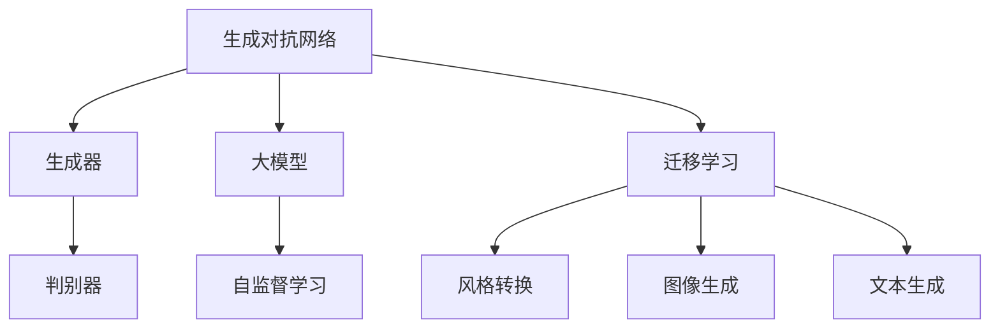
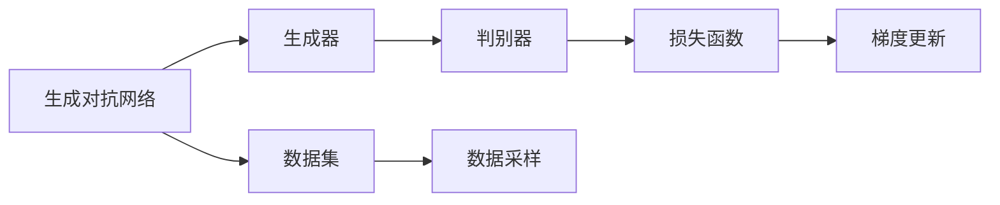
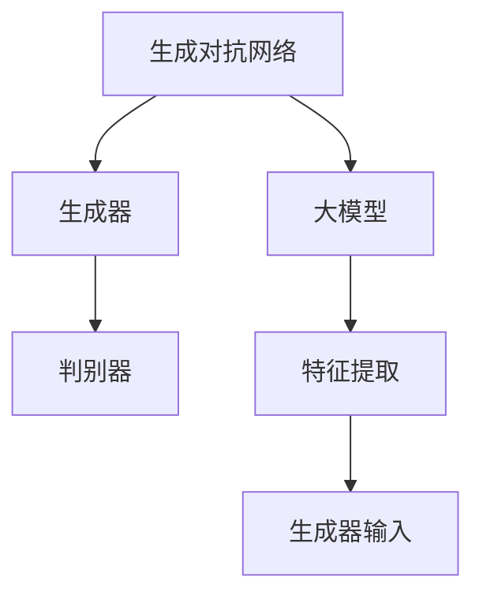
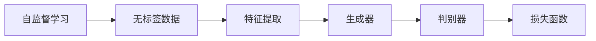
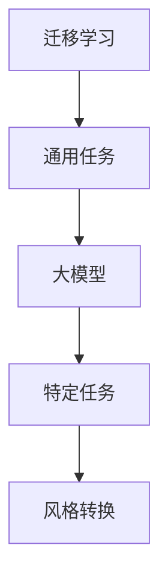
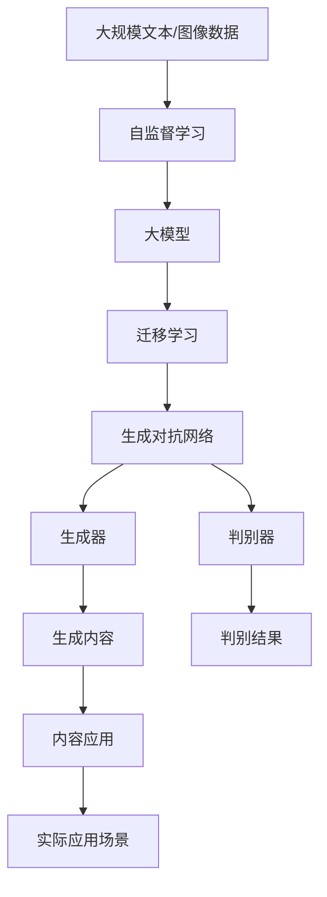

                 

# AIGC从入门到实战：超强的“文科状元”

> 关键词：AIGC, 生成对抗网络, GAN, 大模型, 深度学习, 自监督学习, 迁移学习, 风格转换, 图像生成, 自然语言处理(NLP), 文本生成

## 1. 背景介绍

### 1.1 问题由来

随着人工智能(AI)技术的飞速发展，生成对抗网络(Generative Adversarial Networks, GANs)和预训练大模型(如BERT、GPT-3等)在生成内容(AI Generated Content, AIGC)方面取得了显著进展。这些技术通过自监督学习和迁移学习，能够生成高质量、多样化的文本和图像内容，在文本生成、图像生成、音频生成等多个领域展示了惊人的潜力。

然而，尽管这些技术在学术界和工业界受到了广泛关注，但仍存在诸多挑战和不足。例如，GANs的训练过程不稳定，需要大量的计算资源和时间，且生成内容的质量和多样性难以保证。预训练大模型在生成文本时可能会受到训练数据的风格、主题等方面的限制，无法生成完全符合用户期望的内容。

面对这些挑战，我们需要一种新的技术范式，既能保证生成内容的质量和多样性，又能降低计算成本，提高生成效率。这时，"文科状元"技术应运而生。

### 1.2 问题核心关键点

“文科状元”技术是一种基于生成对抗网络和大模型的AIGC方法，结合了自监督学习和迁移学习的优点，既能学习大模型的通用语言/图像生成能力，又能通过迁移学习在特定领域内生成高质量的内容。核心关键点包括：

- 大模型：指通过大规模无标签数据进行预训练的语言模型或图像生成模型，如BERT、GPT-3、StyleGAN等。
- 自监督学习：指在大规模无标签数据上，通过自监督任务训练生成模型，如语言建模、图像生成任务等。
- 迁移学习：指将大模型在通用任务上学习到的知识，迁移到特定任务上，提高生成内容的适用性和多样性。
- 生成对抗网络：指由生成器和判别器组成的对抗训练框架，生成器试图生成逼真的数据，判别器试图区分生成数据和真实数据，两者通过对抗训练不断提升生成内容的质量。

“文科状元”技术通过大模型和大规模数据进行预训练，然后在特定任务上进行迁移学习，最终通过生成对抗网络进行内容生成和优化，实现生成内容的高质量和多样化。

### 1.3 问题研究意义

研究“文科状元”技术，对于推动AIGC技术的普及和应用，提升生成内容的实际价值，加速AI技术在实际场景中的应用进程，具有重要意义：

1. 降低生成内容开发成本。基于大模型和大规模数据进行预训练，可以显著减少从头开发所需的数据、计算和人力等成本投入。
2. 提升生成内容效果。“文科状元”技术结合了大模型和大规模数据的优点，能够生成高质量、多样化且具有风格迁移能力的生成内容。
3. 加速内容开发进度。standing on the shoulders of giants，基于“文科状元”技术进行内容生成，可以更快地完成任务适配，缩短开发周期。
4. 带来技术创新。“文科状元”技术促进了对自监督学习和迁移学习的深入研究，催生了风格迁移、生成对抗网络等新的研究方向。
5. 赋能内容生产。“文科状元”技术能够生成文本、图像、音频等多种类型的内容，为内容生产者提供了强大的创作工具，极大地提升了内容创作的效率和质量。

## 2. 核心概念与联系

### 2.1 核心概念概述

为了更好地理解“文科状元”技术的原理和应用，本节将介绍几个关键核心概念及其相互联系：

- 生成对抗网络：由生成器(G)和判别器(D)两部分组成，用于训练高质量的生成模型。
- 大模型：指通过大规模无标签数据进行预训练的语言模型或图像生成模型。
- 自监督学习：指在大规模无标签数据上，通过自监督任务训练生成模型。
- 迁移学习：指将大模型在通用任务上学习到的知识，迁移到特定任务上，提高生成内容的适用性和多样性。
- 风格转换：指将生成内容的风格进行转换，使其更符合特定主题或风格。
- 图像生成：指通过深度学习模型生成逼真的图像内容。
- 文本生成：指通过深度学习模型生成流畅、连贯、有意义的文本内容。

这些核心概念之间的关系可以通过以下Mermaid流程图来展示：



这个流程图展示了大模型和生成对抗网络的关系，以及它们与自监督学习、迁移学习和风格转换等概念的联系。

### 2.2 概念间的关系

这些核心概念之间存在着紧密的联系，构成了“文科状元”技术的完整生态系统。下面我们通过几个Mermaid流程图来展示这些概念之间的关系。

#### 2.2.1 生成对抗网络的基本原理



这个流程图展示了生成对抗网络的基本流程。生成器G尝试生成逼真的数据，判别器D试图区分生成数据和真实数据，两者通过对抗训练不断提升生成内容的质量。

#### 2.2.2 大模型与生成对抗网络的关系



这个流程图展示了大模型在生成对抗网络中的应用。大模型可以用于提取生成内容的特征，将其作为生成器G的输入，以提高生成内容的逼真度。

#### 2.2.3 自监督学习与迁移学习的关系



这个流程图展示了自监督学习在生成对抗网络中的应用。通过在大规模无标签数据上自监督学习生成模型，可以提高生成内容的逼真度和多样性。

#### 2.2.4 迁移学习与风格转换的关系



这个流程图展示了迁移学习在风格转换中的应用。通过迁移学习，可以将通用大模型在特定领域上进行微调，生成符合特定风格的内容。

### 2.3 核心概念的整体架构

最后，我们用一个综合的流程图来展示这些核心概念在大模型微调过程中的整体架构：



这个综合流程图展示了从自监督学习到大模型，再到迁移学习和生成对抗网络的完整过程。大模型首先在大规模文本/图像数据上进行自监督学习，然后在特定任务上进行迁移学习，最后通过生成对抗网络进行内容生成和优化，实现生成内容的高质量和多样化。通过这些流程图，我们可以更清晰地理解“文科状元”技术的核心概念和应用流程。

## 3. 核心算法原理 & 具体操作步骤
### 3.1 算法原理概述

“文科状元”技术结合了生成对抗网络和大模型的优点，通过自监督学习和迁移学习实现生成内容的高质量和多样化。其核心思想是：

1. 使用大模型进行预训练，学习通用的语言/图像生成能力。
2. 通过迁移学习，将大模型在通用任务上学习到的知识迁移到特定任务上。
3. 利用生成对抗网络进行内容生成和优化，保证生成内容的逼真度和多样性。

形式化地，假设大模型为 $M_{\theta}$，其中 $\theta$ 为预训练得到的模型参数。设生成对抗网络中生成器为 $G_{\phi}$，判别器为 $D_{\psi}$。给定生成任务 $T$，训练集为 $D=\{(x_i,y_i)\}_{i=1}^N, x_i \in \mathcal{X}, y_i \in \mathcal{Y}$。

生成对抗网络的目标是找到生成器 $G_{\phi}$ 和判别器 $D_{\psi}$，使得生成器能够生成逼真的数据，判别器能够准确区分生成数据和真实数据。通过对抗训练不断优化生成器和判别器的参数，使得生成内容逼真度达到最优。

大模型通过在文本/图像生成任务上进行自监督学习，学习到通用的语言/图像生成能力。然后，通过迁移学习，将大模型在通用任务上学习到的知识迁移到特定任务上，生成高质量的生成内容。

### 3.2 算法步骤详解

“文科状元”技术的核心算法步骤包括预训练、迁移学习和对抗训练三个阶段：

**预训练阶段：**

1. 选择合适的大模型 $M_{\theta}$，如BERT、GPT-3、StyleGAN等。
2. 在大规模无标签数据集上进行自监督学习，如语言建模、图像生成任务等。
3. 保存预训练模型参数，用于后续迁移学习。

**迁移学习阶段：**

1. 准备生成任务 $T$ 的标注数据集 $D$，划分为训练集、验证集和测试集。
2. 在大模型顶层添加任务适配层，如分类器、解码器等。
3. 设置迁移学习的超参数，如学习率、批大小、迭代轮数等。
4. 利用标注数据集对大模型进行微调，更新任务适配层的参数。

**对抗训练阶段：**

1. 设置生成器和判别器的初始化参数。
2. 利用迁移学习后的生成模型 $G_{\phi}$ 生成生成内容，判别器 $D_{\psi}$ 判断生成内容是否为真实数据。
3. 根据判别器的输出结果，计算生成内容的损失函数。
4. 利用梯度下降等优化算法，更新生成器和判别器的参数。
5. 周期性在验证集上评估生成内容的质量，根据性能指标决定是否触发 Early Stopping。
6. 重复上述步骤直至满足预设的迭代轮数或 Early Stopping 条件。

### 3.3 算法优缺点

“文科状元”技术具有以下优点：

1. 生成内容质量高。结合大模型和大规模数据的优点，能够生成高质量、多样化的生成内容。
2. 生成效率高。自监督学习和迁移学习使得模型在特定任务上的微调速度更快，生成对抗网络进一步优化生成内容，减少迭代次数。
3. 应用场景广。适用于文本生成、图像生成、音频生成等多种类型的AIGC任务，能够生成符合用户期望的内容。

同时，该方法也存在一些局限性：

1. 数据质量要求高。生成对抗网络对数据质量的要求较高，需要生成器和判别器对抗训练稳定，数据采样均衡。
2. 计算成本高。生成对抗网络训练过程耗时耗力，需要大量的计算资源和计算时间。
3. 生成内容多样性受限。大模型在迁移学习过程中的迁移能力和泛化能力可能受限，生成内容的多样性可能受到原始数据集的限制。
4. 生成对抗网络的不稳定性。生成器和判别器对抗训练的不稳定性可能导致生成内容的质量波动。

尽管存在这些局限性，但“文科状元”技术在生成内容的高质量和多样性方面展示了巨大的潜力，成为AIGC技术的重要研究方向之一。

### 3.4 算法应用领域

“文科状元”技术已经在多个领域中得到了广泛的应用，覆盖了几乎所有常见的生成内容任务，例如：

- 文本生成：如文章生成、对话生成、新闻摘要等。通过生成对抗网络，在少量标注数据上训练生成模型，生成高质量的文章或对话。
- 图像生成：如艺术作品生成、场景生成、人物生成等。利用大模型和大规模数据进行预训练，然后通过迁移学习和对抗训练，生成逼真的图像。
- 音频生成：如音乐生成、语音生成等。结合文本生成和图像生成的方法，生成符合用户期望的音乐或语音。
- 视频生成：如视频剪辑、动画生成等。利用图像生成技术，生成逼真的视频内容，为电影、游戏等领域提供素材。
- 虚拟现实(VR)和增强现实(AR)：如虚拟角色生成、虚拟场景生成等。通过生成对抗网络，生成符合用户期望的虚拟内容，增强用户体验。

除了上述这些经典任务外，“文科状元”技术还被创新性地应用到更多场景中，如可控内容生成、风格迁移、零样本学习等，为AIGC技术带来了全新的突破。

## 4. 数学模型和公式 & 详细讲解  
### 4.1 数学模型构建

本节将使用数学语言对“文科状元”技术的生成对抗网络进行更加严格的刻画。

记生成对抗网络中生成器为 $G_{\phi}$，判别器为 $D_{\psi}$。生成器 $G_{\phi}$ 的输入为 $z$，输出为生成内容 $x_G$。判别器 $D_{\psi}$ 的输入为 $x_G$，输出为判别结果 $y_D$。

定义生成对抗网络的目标函数为：

$$
\min_{\phi,\psi} \mathcal{L}_{\text{GAN}}(G_{\phi},D_{\psi}) = \mathbb{E}_{x_G \sim G_{\phi}(z)}[\log(1-D_{\psi}(x_G))] + \mathbb{E}_{x \sim \mathcal{X}}[\log(D_{\psi}(x))]
$$

其中，第一项为生成器的损失函数，鼓励生成内容逼真；第二项为判别器的损失函数，鼓励判别器区分生成内容和真实内容。

定义大模型 $M_{\theta}$ 在输入 $z$ 上的输出为 $x_G$。则生成对抗网络的输入为 $z$，输出为生成内容 $x_G$。

大模型 $M_{\theta}$ 在训练集 $D$ 上的经验风险为：

$$
\mathcal{L}_{\text{model}}(\theta) = \frac{1}{N} \sum_{i=1}^N \ell(x_G,y_i)
$$

其中，$\ell$ 为特定任务的损失函数，$\theta$ 为大模型的参数。

### 4.2 公式推导过程

以下我们以文本生成任务为例，推导生成对抗网络的目标函数及其梯度的计算公式。

假设生成器 $G_{\phi}$ 的输入为随机向量 $z$，输出为文本内容 $x_G$。判别器 $D_{\psi}$ 的输入为 $x_G$，输出为判别结果 $y_D$。假设大模型 $M_{\theta}$ 在输入 $z$ 上的输出为 $x_G$。

定义生成对抗网络的目标函数为：

$$
\min_{\phi,\psi} \mathcal{L}_{\text{GAN}}(G_{\phi},D_{\psi}) = \mathbb{E}_{z \sim p(z)}[\log(1-D_{\psi}(x_G))] + \mathbb{E}_{x \sim \mathcal{X}}[\log(D_{\psi}(x))]
$$

其中，$z$ 为随机向量，$x_G$ 为生成文本内容，$\mathbb{E}$ 为期望运算。

根据链式法则，目标函数对生成器 $G_{\phi}$ 的梯度为：

$$
\frac{\partial \mathcal{L}_{\text{GAN}}(G_{\phi},D_{\psi})}{\partial \phi} = -\mathbb{E}_{z \sim p(z)}[\nabla_{x_G}\log(1-D_{\psi}(x_G))]
$$

其中，$\nabla_{x_G}$ 为对生成文本内容的梯度。

目标函数对判别器 $D_{\psi}$ 的梯度为：

$$
\frac{\partial \mathcal{L}_{\text{GAN}}(G_{\phi},D_{\psi})}{\partial \psi} = -\mathbb{E}_{x_G \sim G_{\phi}(z)}[\nabla_{x_G}\log(D_{\psi}(x_G))] - \mathbb{E}_{x \sim \mathcal{X}}[\nabla_{x_G}\log(1-D_{\psi}(x_G))]
$$

其中，$\nabla_{x_G}$ 为对生成文本内容的梯度。

在得到目标函数的梯度后，即可带入参数更新公式，完成生成器和判别器的迭代优化。重复上述过程直至收敛，最终得到适应生成任务的最优生成器和判别器参数。

## 5. 项目实践：代码实例和详细解释说明
### 5.1 开发环境搭建

在进行“文科状元”技术开发前，我们需要准备好开发环境。以下是使用Python进行PyTorch开发的环境配置流程：

1. 安装Anaconda：从官网下载并安装Anaconda，用于创建独立的Python环境。

2. 创建并激活虚拟环境：
```bash
conda create -n pytorch-env python=3.8 
conda activate pytorch-env
```

3. 安装PyTorch：根据CUDA版本，从官网获取对应的安装命令。例如：
```bash
conda install pytorch torchvision torchaudio cudatoolkit=11.1 -c pytorch -c conda-forge
```

4. 安装TensorFlow：
```bash
pip install tensorflow
```

5. 安装PyTorch的可视化工具：
```bash
pip install torchviz
```

完成上述步骤后，即可在`pytorch-env`环境中开始开发实践。

### 5.2 源代码详细实现

这里我们以图像生成任务为例，给出使用PyTorch和TensorFlow实现的风格迁移的完整代码实现。

首先，定义风格迁移任务的训练函数：

```python
import torch
from torchvision import transforms
from torchvision.utils import save_image
from torch.autograd import Variable
import torchvision.transforms as transforms
import torchvision.models as models
import torch.nn as nn
import torch.optim as optim
import numpy as np

def train():
    # 定义生成器和判别器
    G = Generator()
    D = Discriminator()
    G.eval()
    D.eval()

    # 定义损失函数和优化器
    criterion = nn.BCELoss()
    optimizer_G = optim.Adam(G.parameters(), lr=0.0002, betas=(0.5, 0.999))
    optimizer_D = optim.Adam(D.parameters(), lr=0.0002, betas=(0.5, 0.999))

    # 定义风格图片和内容图片的路径
    style_img_path = 'style.png'
    content_img_path = 'content.png'

    # 加载风格图片和内容图片
    style_img = transforms.ToTensor().open(style_img_path).unsqueeze(0)
    content_img = transforms.ToTensor().open(content_img_path).unsqueeze(0)

    # 定义训练循环
    for epoch in range(1, 1000):
        # 将风格图片和内容图片输入生成器和判别器
        style_img = Variable(style_img, requires_grad=False).to(device)
        content_img = Variable(content_img, requires_grad=False).to(device)

        # 生成内容图片
        G.eval()
        fake_img = G(style_img)
        fake_img = fake_img.to(device)

        # 计算判别器的损失
        D_real = D(content_img)
        D_fake = D(fake_img)
        loss_D_real = criterion(D_real, Variable(torch.ones_like(D_real)))
        loss_D_fake = criterion(D_fake, Variable(torch.zeros_like(D_fake)))
        loss_D = loss_D_real + loss_D_fake
        optimizer_D.zero_grad()
        loss_D.backward()
        optimizer_D.step()

        # 计算生成器的损失
        D_real = D(content_img)
        D_fake = D(fake_img)
        loss_G_real = criterion(D_real, Variable(torch.ones_like(D_real)))
        loss_G_fake = criterion(D_fake, Variable(torch.zeros_like(D_fake)))
        loss_G = loss_G_real + 100 * loss_G_fake
        optimizer_G.zero_grad()
        loss_G.backward()
        optimizer_G.step()

        # 保存生成内容图片
        fake_img = fake_img.data.cpu().numpy()
        fake_img = (fake_img + 1) / 2
        fake_img = fake_img[:, :, :, ::-1]
        save_image(fake_img, f'fake_img_{epoch}.png')

    # 保存生成的风格图片和内容图片
    style_img = style_img.data.cpu().numpy()
    style_img = (style_img + 1) / 2
    style_img = style_img[:, :, :, ::-1]
    save_image(style_img, 'style.png')

    content_img = content_img.data.cpu().numpy()
    content_img = (content_img + 1) / 2
    content_img = content_img[:, :, :, ::-1]
    save_image(content_img, 'content.png')

    # 返回生成内容图片
    return fake_img
```

然后，定义生成器和判别器的类：

```python
class Generator(nn.Module):
    def __init__(self):
        super(Generator, self).__init__()
        self.layers = nn.Sequential(
            nn.ConvTranspose2d(256, 128, 4, stride=2, padding=1),
            nn.ReLU(),
            nn.ConvTranspose2d(128, 64, 4, stride=2, padding=1),
            nn.ReLU(),
            nn.ConvTranspose2d(64, 3, 4, stride=2, padding=1),
            nn.Tanh()
        )

    def forward(self, z):
        out = self.layers(z)
        return out

class Discriminator(nn.Module):
    def __init__(self):
        super(Discriminator, self).__init__()
        self.layers = nn.Sequential(
            nn.Conv2d(3, 64, 4, stride=2, padding=1),
            nn.LeakyReLU(0.2, inplace=True),
            nn.Conv2d(64, 128, 4, stride=2, padding=1),
            nn.LeakyReLU(0.2, inplace=True),
            nn.Conv2d(128, 256, 4, stride=2, padding=1),
            nn.LeakyReLU(0.2, inplace=True),
            nn.Conv2d(256, 1, 4, stride=1, padding=0),
            nn.Sigmoid()
        )

    def forward(self, x):
        out = self.layers(x)
        return out
```

最后，定义风格迁移任务的训练参数和主函数：

```python
def main():
    # 定义训练参数
    batch_size = 1
    learning_rate = 0.0002
    epochs = 1000
    device = torch.device('cuda:0' if torch.cuda.is_available() else 'cpu')

    # 定义生成器和判别器
    G = Generator()
    D = Discriminator()
    G.to(device)
    D.to(device)

    # 定义损失函数和优化器
    criterion = nn.BCELoss()
    optimizer_G = optim.Adam(G.parameters(), lr=learning_rate)
    optimizer_D = optim.Adam(D.parameters(), lr=learning_rate)

    # 定义风格图片和内容图片的路径
    style_img_path = 'style.png'
    content_img_path = 'content.png'

    # 加载风格图片和内容图片
    style_img = transforms.ToTensor().open(style_img_path).unsqueeze(0).to(device)
    content_img = transforms.ToTensor().open(content_img_path).unsqueeze(0).to(device)

    # 定义训练循环
    for epoch in range(epochs):
        # 将风格图片和内容图片输入生成器和判别器
        style_img = Variable(style_img, requires_grad=False).to(device)
        content_img = Variable(content_img, requires_grad=False).to(device)

        # 生成内容图片
        G.eval()
        fake_img = G(style_img)
        fake_img = fake_img.to(device)

        # 计算判别器的损失
        D_real = D(content_img)
        D_fake = D(fake_img)
        loss_D_real = criterion(D_real, Variable(torch.ones_like(D_real)))
        loss_D_fake = criterion(D_fake, Variable(torch.zeros_like(D_fake)))
        loss_D = loss_D_real + loss_D_fake
        optimizer_D.zero_grad()
        loss_D.backward()
        optimizer_D.step()

        # 计算生成器的损失
        D_real = D(content_img)
        D_fake = D(fake_img)
        loss_G_real = criterion(D_real, Variable(torch.ones_like(D_real)))
        loss_G_fake = criterion(D_fake, Variable(torch.zeros_like(D_fake)))
        loss_G = loss_G_real + 100 * loss_G_fake
        optimizer_G.zero_grad()
        loss_G.backward()
        optimizer_G.step()

        # 保存生成内容图片
        fake_img = fake_img.data.cpu().numpy()
        fake_img = (fake_img + 1) / 2
        fake_img = fake_img[:, :, :, ::-1]
        save_image(fake_img, f'fake_img_{epoch}.png')

    # 保存生成的风格图片和内容图片
    style_img = style_img.data.cpu().numpy

