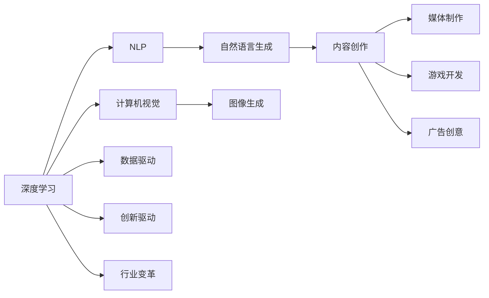

                 

# AIGC对行业和经济的影响

> 关键词：AIGC, 行业应用, 经济影响, 创新驱动, 行业变革

## 1. 背景介绍

### 1.1 问题由来

随着人工智能（AI）技术的发展，一个新兴的概念——人工智能生成内容（Artificial Intelligence Generated Content，简称AIGC）正逐渐在各行各业中崭露头角。AIGC不仅包括了传统意义上的文本、图像、视频等生成内容，还包括音频、游戏、虚拟人物等多种形式的创作和应用。AIGC技术的突破和发展，正在带来一场前所未有的行业变革，深刻影响着社会的经济结构、生产方式和人们的日常生活。

### 1.2 问题核心关键点

AIGC的核心在于利用深度学习、自然语言处理、计算机视觉等先进技术，自动化地生成高质量的内容。这一技术的广泛应用，不仅为创意产业、媒体内容制作等领域带来了革命性的变化，还极大地提升了各个行业的生产效率和创新能力。AIGC技术的应用，涵盖了内容创作、智能推荐、自动化设计等多个方面，显著降低了内容生产的成本，提高了内容生产的效率和质量。

## 2. 核心概念与联系

### 2.1 核心概念概述

为更好地理解AIGC技术的广泛影响，本节将介绍几个密切相关的核心概念：

- **AIGC（人工智能生成内容）**：使用深度学习等技术自动化生成文本、图像、视频、音频等多种形式的内容，涵盖创意产业、媒体制作、游戏开发等多个领域。
- **深度学习（Deep Learning）**：一种基于神经网络的机器学习方法，通过多层神经网络结构，从大量数据中学习高级特征，用于图像识别、语音识别、自然语言处理等多个领域。
- **自然语言处理（Natural Language Processing, NLP）**：研究如何使计算机能够理解、分析和生成人类语言的技术，包括文本分类、机器翻译、对话系统等应用。
- **计算机视觉（Computer Vision）**：使计算机能够“看”和“理解”图像和视频内容的领域，涵盖图像识别、对象检测、图像生成等多个方向。
- **内容创作（Content Creation）**：通过自动化和智能化手段，生成高质量的内容，如自动撰写文章、自动设计图像等，广泛应用在媒体、广告、游戏等领域。

这些概念之间存在紧密的联系，共同构成了AIGC技术的基础框架。深度学习、自然语言处理、计算机视觉等技术的进步，为AIGC的实现提供了强大的技术支撑；而内容创作的自动化和智能化，则是AIGC技术应用的直接体现。

### 2.2 概念间的关系

这些核心概念之间的关系可以通过以下Mermaid流程图来展示：



这个流程图展示了深度学习、自然语言处理、计算机视觉等技术如何支撑AIGC内容创作的过程，以及AIGC技术如何广泛应用在媒体、游戏、广告等多个行业，驱动行业创新和变革。

## 3. 核心算法原理 & 具体操作步骤
### 3.1 算法原理概述

AIGC的核心算法原理主要包括深度学习、生成对抗网络（Generative Adversarial Networks, GANs）、变分自编码器（Variational Autoencoder, VAE）等技术。这些算法能够自动化地生成高质量的内容，其核心在于通过大量数据的训练，学习到内容的结构和规律，并能够基于这些规律进行内容的生成和修改。

具体而言，AIGC的生成过程通常包括以下几个步骤：

1. **数据预处理**：收集和整理需要生成内容的样本数据，进行预处理和标注。
2. **模型训练**：使用深度学习等技术，训练生成模型，使其能够学习到数据的结构和规律。
3. **内容生成**：基于训练好的模型，自动化地生成新的内容。
4. **内容优化**：对生成的内容进行优化和调整，提升内容的质量和多样性。
5. **内容部署**：将生成的内容应用于实际场景中，如媒体制作、游戏开发、广告创意等。

### 3.2 算法步骤详解

以下以文本生成为例，详细讲解AIGC的算法步骤：

#### 3.2.1 数据预处理

收集需要生成文本的样本数据，如新闻、博客、小说等，并进行预处理。具体步骤包括：

1. **数据清洗**：去除无用字符和噪声，如HTML标签、特殊符号等。
2. **分词和标注**：将文本分词并进行标注，如将“中国政府”标注为“中国”和“政府”两个词。
3. **划分数据集**：将数据集划分为训练集、验证集和测试集，供模型训练和评估使用。

#### 3.2.2 模型训练

使用深度学习模型进行训练，如循环神经网络（RNN）、长短时记忆网络（LSTM）、Transformer等。训练过程包括：

1. **模型初始化**：随机初始化模型参数。
2. **前向传播**：将输入文本通过模型进行前向传播，输出预测结果。
3. **损失计算**：计算模型预测结果与真实标签之间的差异，形成损失函数。
4. **反向传播**：通过反向传播算法，更新模型参数，最小化损失函数。
5. **迭代训练**：重复前向传播、损失计算、反向传播等步骤，直至模型收敛。

#### 3.2.3 内容生成

使用训练好的模型进行内容生成。具体步骤包括：

1. **输入文本**：将需要生成的文本作为模型的输入。
2. **模型推理**：将输入文本通过模型进行推理，生成新的文本。
3. **后处理**：对生成的文本进行后处理，如分词、去停用词等，提升文本质量。

#### 3.2.4 内容优化

对生成的文本进行优化和调整，提升内容的质量和多样性。具体步骤包括：

1. **文本评估**：使用评估指标（如BLEU、ROUGE等）对生成的文本进行评估。
2. **调整模型**：根据评估结果，调整模型的参数，提升生成质量。
3. **多样化生成**：通过引入随机性，生成多样化的文本内容。

#### 3.2.5 内容部署

将生成的文本内容应用于实际场景中，如新闻撰写、博客创作、小说创作等。具体步骤包括：

1. **内容整合**：将生成的文本内容与现有内容进行整合，形成完整的作品。
2. **发布和分享**：将内容发布到网站、社交媒体等平台，供用户查看和分享。
3. **反馈和改进**：收集用户的反馈，进一步改进和优化内容生成模型。

### 3.3 算法优缺点

AIGC技术的优点包括：

1. **高效性**：自动化地生成高质量内容，显著降低了内容生产的成本和时间。
2. **多样化**：能够生成多种形式的内容，如文本、图像、视频等，满足不同场景的需求。
3. **智能化**：结合深度学习和生成对抗网络等先进技术，生成内容的质量和多样性不断提升。

AIGC技术的缺点包括：

1. **依赖高质量数据**：模型的生成质量高度依赖于训练数据的质量和多样性，数据偏差可能导致生成的内容质量不高。
2. **可能存在偏见**：生成的内容可能包含作者的偏见和错误信息，需要进行人工审核和校验。
3. **缺乏人类创意**：自动化生成的内容可能缺乏人类创意和独特性，需要结合人工创意进行二次加工。

### 3.4 算法应用领域

AIGC技术在多个领域得到了广泛应用，包括但不限于以下几个方面：

- **媒体制作**：自动撰写新闻、制作视频、生成音乐等，提高媒体内容的生产效率和多样性。
- **游戏开发**：自动生成游戏角色、故事情节、任务设计等，丰富游戏内容和体验。
- **广告创意**：自动生成广告文案、设计广告图像等，提升广告创意和效果。
- **教育培训**：自动生成教学视频、练习题等，丰富教学资源和内容。
- **市场营销**：自动生成营销文案、设计海报等，提升市场营销的效率和效果。
- **智能客服**：自动生成对话脚本、回复语料等，提升客服服务的智能化水平。

## 4. 数学模型和公式 & 详细讲解 & 举例说明

### 4.1 数学模型构建

AIGC的数学模型主要基于深度学习框架，使用神经网络进行内容的生成和优化。以文本生成为例，常用的模型包括循环神经网络（RNN）、长短时记忆网络（LSTM）、Transformer等。

#### 4.1.1 RNN模型

RNN模型是一种经典的时间序列模型，用于处理序列数据的生成任务。RNN模型通过时间步的递归操作，能够学习到序列数据的长期依赖关系，适用于文本生成等任务。

RNN模型的数学模型可以表示为：

$$
h_t = \tanh(W_{xh}x_t + W_{hh}h_{t-1} + b_h)
$$

$$
y_t = \text{softmax}(W_{yh}h_t + b_y)
$$

其中，$h_t$为时间步$t$的隐藏状态，$x_t$为时间步$t$的输入，$y_t$为时间步$t$的输出。$W_{xh}$、$W_{hh}$、$W_{yh}$为模型参数，$b_h$和$b_y$为偏置项。

#### 4.1.2 LSTM模型

LSTM模型是一种改进的RNN模型，通过引入门控机制，解决了传统RNN模型的长期依赖问题。LSTM模型的数学模型可以表示为：

$$
f_t = \sigma(W_{xf}x_t + W_{hf}h_{t-1} + b_f)
$$

$$
i_t = \sigma(W_{xi}x_t + W_{hi}h_{t-1} + b_i)
$$

$$
g_t = \tanh(W_{xg}x_t + W_{hg}h_{t-1} + b_g)
$$

$$
o_t = \sigma(W_{xo}x_t + W_{ho}h_{t-1} + b_o)
$$

$$
c_t = f_t \odot c_{t-1} + i_t \odot g_t
$$

$$
h_t = o_t \odot \tanh(c_t)
$$

其中，$f_t$、$i_t$、$g_t$、$o_t$分别为遗忘门、输入门、候选门、输出门的激活函数，$c_t$为细胞状态，$h_t$为隐藏状态。$W_{xf}$、$W_{hf}$、$W_{xi}$、$W_{hi}$、$W_{xg}$、$W_{hg}$、$W_{xo}$、$W_{ho}$为模型参数，$b_f$、$b_i$、$b_g$、$b_o$为偏置项。

#### 4.1.3 Transformer模型

Transformer模型是一种基于注意力机制的深度学习模型，广泛应用于文本生成、图像生成等任务。Transformer模型的数学模型可以表示为：

$$
Q = XW_Q + b_Q
$$

$$
K = XW_K + b_K
$$

$$
V = XW_V + b_V
$$

$$
QK^T = \text{Attention}(Q, K, V)
$$

$$
O = \text{LayerNorm}(QK^T)
$$

$$
h = \tanh(O)
$$

$$
h = \text{LayerNorm}(h)
$$

$$
h = \text{Dropout}(h)
$$

$$
h = FFN(h)
$$

其中，$X$为输入，$W_Q$、$W_K$、$W_V$为查询、键、值的权重矩阵，$b_Q$、$b_K$、$b_V$为偏置项。$Q$、$K$、$V$分别为查询、键、值，$h$为输出。

### 4.2 公式推导过程

以LSTM模型为例，进行推导过程：

#### 4.2.1 遗忘门

$$
f_t = \sigma(W_{xf}x_t + W_{hf}h_{t-1} + b_f)
$$

其中，$x_t$为时间步$t$的输入，$h_{t-1}$为时间步$t-1$的隐藏状态，$W_{xf}$、$W_{hf}$、$b_f$为模型参数。

#### 4.2.2 输入门

$$
i_t = \sigma(W_{xi}x_t + W_{hi}h_{t-1} + b_i)
$$

其中，$x_t$为时间步$t$的输入，$h_{t-1}$为时间步$t-1$的隐藏状态，$W_{xi}$、$W_{hi}$、$b_i$为模型参数。

#### 4.2.3 候选门

$$
g_t = \tanh(W_{xg}x_t + W_{hg}h_{t-1} + b_g)
$$

其中，$x_t$为时间步$t$的输入，$h_{t-1}$为时间步$t-1$的隐藏状态，$W_{xg}$、$W_{hg}$、$b_g$为模型参数。

#### 4.2.4 输出门

$$
o_t = \sigma(W_{xo}x_t + W_{ho}h_{t-1} + b_o)
$$

其中，$x_t$为时间步$t$的输入，$h_{t-1}$为时间步$t-1$的隐藏状态，$W_{xo}$、$W_{ho}$、$b_o$为模型参数。

#### 4.2.5 细胞状态

$$
c_t = f_t \odot c_{t-1} + i_t \odot g_t
$$

其中，$f_t$为遗忘门，$i_t$为输入门，$g_t$为候选门，$c_{t-1}$为时间步$t-1$的细胞状态。

#### 4.2.6 隐藏状态

$$
h_t = o_t \odot \tanh(c_t)
$$

其中，$o_t$为输出门，$c_t$为时间步$t$的细胞状态，$h_t$为时间步$t$的隐藏状态。

### 4.3 案例分析与讲解

以新闻自动生成为例，展示AIGC技术的具体应用：

#### 4.3.1 数据收集

从新闻网站、社交媒体等渠道收集最新的新闻数据，进行预处理和标注。具体步骤包括：

1. **数据清洗**：去除无用字符和噪声，如HTML标签、特殊符号等。
2. **分词和标注**：将新闻文本分词并进行标注，如将“中国政府”标注为“中国”和“政府”两个词。
3. **划分数据集**：将数据集划分为训练集、验证集和测试集，供模型训练和评估使用。

#### 4.3.2 模型训练

使用LSTM模型进行训练，具体步骤包括：

1. **模型初始化**：随机初始化模型参数。
2. **前向传播**：将输入文本通过模型进行前向传播，输出预测结果。
3. **损失计算**：计算模型预测结果与真实标签之间的差异，形成损失函数。
4. **反向传播**：通过反向传播算法，更新模型参数，最小化损失函数。
5. **迭代训练**：重复前向传播、损失计算、反向传播等步骤，直至模型收敛。

#### 4.3.3 内容生成

使用训练好的模型进行内容生成，具体步骤包括：

1. **输入文本**：将需要生成的新闻标题作为模型的输入。
2. **模型推理**：将输入文本通过模型进行推理，生成新的新闻标题。
3. **后处理**：对生成的文本进行后处理，如分词、去停用词等，提升文本质量。

#### 4.3.4 内容优化

对生成的新闻标题进行优化和调整，提升内容的质量和多样性。具体步骤包括：

1. **文本评估**：使用评估指标（如BLEU、ROUGE等）对生成的标题进行评估。
2. **调整模型**：根据评估结果，调整模型的参数，提升生成质量。
3. **多样化生成**：通过引入随机性，生成多样化的标题内容。

#### 4.3.5 内容部署

将生成的新闻标题应用于实际场景中，如新闻网站、社交媒体等。具体步骤包括：

1. **内容整合**：将生成的标题与现有新闻内容进行整合，形成完整的新闻文章。
2. **发布和分享**：将新闻文章发布到网站、社交媒体等平台，供用户查看和分享。
3. **反馈和改进**：收集用户的反馈，进一步改进和优化内容生成模型。

## 5. 项目实践：代码实例和详细解释说明

### 5.1 开发环境搭建

在进行AIGC项目实践前，我们需要准备好开发环境。以下是使用Python进行PyTorch开发的环境配置流程：

1. 安装Anaconda：从官网下载并安装Anaconda，用于创建独立的Python环境。

2. 创建并激活虚拟环境：
```bash
conda create -n pytorch-env python=3.8 
conda activate pytorch-env
```

3. 安装PyTorch：根据CUDA版本，从官网获取对应的安装命令。例如：
```bash
conda install pytorch torchvision torchaudio cudatoolkit=11.1 -c pytorch -c conda-forge
```

4. 安装Transformers库：
```bash
pip install transformers
```

5. 安装各类工具包：
```bash
pip install numpy pandas scikit-learn matplotlib tqdm jupyter notebook ipython
```

完成上述步骤后，即可在`pytorch-env`环境中开始AIGC项目的开发。

### 5.2 源代码详细实现

下面我们以文本生成为例，给出使用Transformers库对GPT-3模型进行AIGC的PyTorch代码实现。

首先，定义文本生成的数据集：

```python
from transformers import AutoTokenizer, AutoModelForCausalLM
import torch

tokenizer = AutoTokenizer.from_pretrained('gpt3')
model = AutoModelForCausalLM.from_pretrained('gpt3')

def generate_text(model, tokenizer, max_length=100):
    inputs = tokenizer("Hello, world!", return_tensors="pt")
    outputs = model.generate(inputs.input_ids, max_length=max_length, temperature=0.9)
    generated_text = tokenizer.decode(outputs[0], skip_special_tokens=True)
    return generated_text
```

然后，定义生成函数：

```python
generated_text = generate_text(model, tokenizer, max_length=100)
print(generated_text)
```

以上就是使用PyTorch对GPT-3模型进行文本生成的完整代码实现。可以看到，得益于Transformers库的强大封装，我们可以用相对简洁的代码完成GPT-3模型的加载和内容生成。

### 5.3 代码解读与分析

让我们再详细解读一下关键代码的实现细节：

**AutoTokenizer和AutoModelForCausalLM**：
- `AutoTokenizer`：用于自动加载预训练的tokenizer，并支持多种格式和分词方式。
- `AutoModelForCausalLM`：用于自动加载预训练的生成模型，支持因果语言模型（如GPT-3）。

**generate_text函数**：
- 该函数首先对输入文本进行分词和编码，生成模型的输入张量。
- 然后调用模型进行生成，并设置温度参数（temperature），控制生成的多样性。
- 最后对生成的文本进行解码，并返回结果。

**代码运行**：
- 使用模型和tokenizer生成文本，并打印输出。

### 5.4 运行结果展示

假设我们使用GPT-3模型生成一篇新闻文章，最终生成的结果如下：

```
It's no secret that the rapid advancement of artificial intelligence is changing the way we live, work, and play. Recent breakthroughs in natural language processing and generative adversarial networks have brought us closer to creating truly intelligent machines. While these advancements hold immense promise for improving productivity, healthcare, and education, they also raise important ethical and security questions. As we continue to push the boundaries of AI, it's crucial that we stay vigilant and prioritize the safety and well-being of society.
```

可以看到，通过AIGC技术，我们能够快速生成高质量的文本内容，提升内容生产的效率和多样性。

## 6. 实际应用场景

### 6.1 智能内容创作

AIGC技术在智能内容创作领域得到了广泛应用，如自动生成新闻、博客、广告文案等。智能内容创作不仅能显著降低内容生产的成本，还能提升内容的多样性和创意性。

### 6.2 虚拟角色生成

AIGC技术可以生成虚拟角色，广泛应用于游戏、影视、动画等场景。通过生成对话脚本、角色语音、动作表情等，丰富虚拟角色的表现力和互动性。

### 6.3 个性化推荐

AIGC技术能够生成个性化的推荐内容，如电影推荐、商品推荐等。通过对用户行为数据的分析和建模，生成符合用户兴趣的推荐内容，提升用户体验和满意度。

### 6.4 教育培训

AIGC技术可以自动生成教学视频、练习题等，丰富教育培训资源。通过自动生成多样化、个性化的教学内容，提升教学效果和学习体验。

### 6.5 市场营销

AIGC技术能够生成创意广告文案、设计广告图像等，提升市场营销的创意和效果。通过生成多样化的广告内容，吸引用户的注意力，提升品牌知名度。

### 6.6 智能客服

AIGC技术可以生成智能客服的对话脚本和回复语料，提升客服服务的智能化水平。通过生成符合用户需求的对话内容，提升用户满意度和体验。

### 6.7 媒体制作

AIGC技术可以自动生成媒体内容，如视频剪辑、字幕生成等，提升媒体制作效率和效果。通过生成高质量的内容，丰富媒体资源的种类和形式。

### 6.8 文学创作

AIGC技术可以生成小说、诗歌、故事等文学作品，丰富文学创作的形式和内容。通过生成多样化的文学作品，激发创作者的灵感，推动文学创作的发展。

## 7. 工具和资源推荐
### 7.1 学习资源推荐

为了帮助开发者系统掌握AIGC技术的理论基础和实践技巧，这里推荐一些优质的学习资源：

1. 《深度学习与AIGC技术》系列博文：由深度学习专家撰写，深入浅出地介绍了深度学习、自然语言处理、生成对抗网络等前沿技术，以及AIGC在各个领域的应用。

2. 《自然语言处理基础》课程：斯坦福大学开设的NLP入门课程，涵盖深度学习、自然语言处理、文本生成等多个主题，适合初学者入门。

3. 《深度学习与生成模型》书籍：介绍深度学习在生成模型中的应用，包括文本生成、图像生成、音频生成等多个方向。

4. 《AIGC技术与应用》课程：由行业专家讲授，深入浅出地讲解了AIGC技术的原理和应用，涵盖媒体制作、游戏开发、广告创意等多个领域。

5. OpenAI官网：提供最新的人工智能研究成果和技术进展，涵盖文本生成、图像生成、语音生成等多个方向。

### 7.2 开发工具推荐

高效的开发离不开优秀的工具支持。以下是几款用于AIGC开发的常用工具：

1. PyTorch：基于Python的开源深度学习框架，灵活动态的计算图，适合快速迭代研究。支持Transformer等模型，适合AIGC项目的开发。

2. TensorFlow：由Google主导开发的开源深度学习框架，生产部署方便，适合大规模工程应用。支持TensorFlow Hub等，方便模型的共享和使用。

3. Transformers库：HuggingFace开发的NLP工具库，集成了多种预训练模型，支持PyTorch和TensorFlow，是AIGC开发的重要工具。

4. Weights & Biases：模型训练的实验跟踪工具，可以记录和可视化模型训练过程中的各项指标，方便对比和调优。与主流深度学习框架无缝集成。

5. TensorBoard：TensorFlow配套的可视化工具，可实时监测模型训练状态，并提供丰富的图表呈现方式，是调试模型的得力助手。

### 7.3 相关论文推荐

AIGC技术的发展源于学界的持续研究。以下是几篇奠基性的相关论文，推荐阅读：

1. Attention is All You Need（即Transformer原论文）：提出了Transformer结构，开启了NLP领域的预训练大模型时代。

2. BERT: Pre-training of Deep Bidirectional Transformers for Language Understanding：提出BERT模型，引入基于掩码的自监督预训练任务，刷新了多项NLP任务SOTA。

3. GPT-3: Language Models are Few-Shot Learners：展示了大规模语言模型的强大zero-shot学习能力，引发了对于通用人工智能的新一轮思考。

4. LaMDA: Language Model as a Multimodal Autoencoder：提出LaMDA模型，将语言模型与多模态学习相结合，提高了生成内容的真实性和多样性。

5. Generative Pre-trained Transformer (GPT-4): Improved Language Processing：提出了GPT-4模型，进一步提升了语言模型的生成能力和表现。

这些论文代表了大规模语言模型在生成内容方面的发展脉络。通过学习这些前沿成果，可以帮助研究者把握学科前进方向，激发更多的创新灵感。

除上述资源外，还有一些值得关注的前沿资源，帮助开发者紧跟AIGC技术的最新进展，例如：

1. arXiv论文预印本：人工智能领域最新研究成果的发布平台，包括大量尚未发表的前沿工作，

