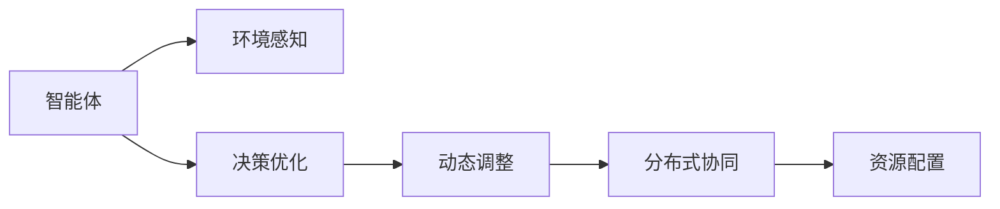

                 

# AI人工智能 Agent：资源配置中智能体的应用

> 关键词：人工智能Agent, 资源配置, 智能体, 分布式系统, 强化学习, 多智能体系统

## 1. 背景介绍

### 1.1 问题由来
在分布式系统中，资源配置问题一直是一个重要且复杂的挑战。传统上，资源配置通常采用集中式调度或手工配置的方式，但这种方式不仅效率低下，而且无法动态响应系统的变化。随着分布式系统规模的扩大和复杂度的增加，这种做法已经难以满足现代数据中心的需求。

为了解决这一问题，研究人员和工程师们开始探索智能化的资源配置方式。人工智能（AI）Agent的引入为这一问题提供了一个全新的解决思路。智能体不仅能理解系统的状态，还能利用优化算法实时调整资源的分配，从而提高系统的运行效率和可靠性。

### 1.2 问题核心关键点
智能体在资源配置中的应用核心关键点包括以下几个方面：
1. **环境感知**：智能体需要实时感知系统的状态，包括CPU、内存、网络带宽等资源的使用情况，以及任务提交情况。
2. **决策优化**：智能体利用优化算法，如强化学习、多智能体协同学习等，决定如何分配资源以最大化系统效能。
3. **动态调整**：智能体能根据系统负载的变化，实时调整资源分配策略，保证系统的高效运行。
4. **分布式协同**：多智能体系统能协作完成任务分配和资源调优，增强系统的鲁棒性和可靠性。

## 2. 核心概念与联系

### 2.1 核心概念概述

为了更好地理解智能体在资源配置中的应用，本节将介绍几个关键概念：

- **智能体（Agent）**：在分布式系统中，智能体是指能感知环境状态，利用决策策略影响环境状态，并根据反馈信息进行自我优化的实体。
- **强化学习（Reinforcement Learning, RL）**：一种通过与环境交互，不断试错学习最优决策策略的学习范式。智能体通过奖励和惩罚机制，学习如何在不同状态下做出最优选择。
- **多智能体系统（Multi-Agent System, MAS）**：由多个智能体组成，智能体之间通过交互协作，共同完成复杂任务的系统。在资源配置中，多个智能体协同优化资源分配策略，提升系统整体效能。
- **分布式系统（Distributed System）**：由多个节点组成的网络系统，节点之间通过网络进行通信和数据交换。智能体在分布式系统中起到优化资源分配的作用。
- **资源配置（Resource Allocation）**：在分布式系统中，资源配置是指合理分配各种资源，如计算资源、存储资源、网络带宽等，以最大化系统性能。

这些概念之间的逻辑关系可以通过以下Mermaid流程图来展示：



这个流程图展示了几类关键概念之间的联系：智能体通过感知环境状态，进行决策优化和动态调整，并最终协同完成任务的资源配置。

### 2.2 概念间的关系

这些核心概念之间存在着紧密的联系，形成了智能体在资源配置中的应用框架。下面我们通过几个Mermaid流程图来展示这些概念之间的关系。

#### 2.2.1 智能体在资源配置中的作用


这个流程图展示了智能体在资源配置中的基本作用流程：智能体首先感知环境状态，然后进行决策优化，并根据优化结果调整资源分配策略，最终完成资源的配置。

#### 2.2.2 强化学习在资源配置中的应用


这个流程图展示了强化学习在资源配置中的应用流程：智能体通过感知环境状态，进行决策优化，然后根据奖励反馈更新自身的策略，从而不断学习最优的资源配置策略。

#### 2.2.3 多智能体系统在资源配置中的协作


这个流程图展示了多智能体系统在资源配置中的协作流程：多个智能体通过交互协作，共同完成资源的配置任务。

## 3. 核心算法原理 & 具体操作步骤
### 3.1 算法原理概述

智能体在资源配置中的应用，通常基于强化学习的原理。其核心思想是通过智能体与环境（分布式系统）的交互，不断试错学习最优的资源分配策略，从而最大化系统的效能。具体而言，智能体通过以下步骤来实现资源配置：

1. **环境感知**：智能体实时监测系统的状态，包括CPU、内存、网络带宽等资源的使用情况，以及任务提交情况。
2. **决策优化**：智能体利用优化算法（如Q-learning、策略梯度等），决定如何分配资源以最大化系统效能。
3. **动态调整**：智能体根据系统负载的变化，实时调整资源分配策略，保证系统的高效运行。
4. **分布式协同**：多个智能体协作完成任务分配和资源调优，增强系统的鲁棒性和可靠性。

### 3.2 算法步骤详解

下面详细讲解智能体在资源配置中的核心算法步骤：

**Step 1: 准备环境与资源**

- 确定分布式系统的资源类型和配置参数，如CPU、内存、网络带宽等。
- 确定资源配置的目标，如最大化吞吐量、最小化延迟、最大化响应速度等。

**Step 2: 定义状态和动作空间**

- 定义系统状态空间，如资源使用率、任务提交队列长度等。
- 定义智能体的动作空间，如资源分配策略、任务调度顺序等。

**Step 3: 选择优化算法**

- 根据具体问题和资源类型，选择合适的优化算法，如Q-learning、策略梯度、多智能体协同学习等。
- 设置算法参数，如学习率、折扣因子、探索率等。

**Step 4: 训练智能体**

- 使用系统历史数据，训练智能体学习最优的资源配置策略。
- 利用模拟仿真工具（如OpenAI Gym、TensorFlow Agent等）进行训练。
- 调整策略，直到智能体能够稳定地优化资源配置。

**Step 5: 部署智能体**

- 将训练好的智能体部署到分布式系统中，实时监测资源状态，做出优化决策。
- 与分布式系统中的其他智能体协作，完成资源配置任务。
- 根据系统负载的变化，实时调整资源分配策略。

### 3.3 算法优缺点

智能体在资源配置中的应用，具有以下优点：
1. **实时优化**：智能体能实时监测系统状态，动态调整资源分配策略，提升系统的运行效率。
2. **自适应性强**：智能体能够根据系统负载的变化，自动调整资源分配策略，适应不同的工作负载。
3. **协同优化**：多智能体系统能协作完成任务分配和资源调优，增强系统的鲁棒性和可靠性。

同时，该方法也存在一些局限性：
1. **训练数据需求大**：智能体训练需要大量的历史数据，以便学习最优的资源配置策略。
2. **复杂度较高**：智能体需要实时监测系统状态，进行决策优化和动态调整，技术实现复杂。
3. **需要稳定环境**：智能体训练和部署需要相对稳定的系统环境，才能保证其效能。
4. **算法收敛速度慢**：在复杂的资源配置问题上，智能体可能需要较长时间才能收敛到最优策略。

### 3.4 算法应用领域

智能体在资源配置中的应用，主要包括以下几个领域：

- **云计算资源配置**：在云数据中心中，智能体可以优化虚拟机分配、存储资源分配等，提高资源利用率。
- **网络带宽分配**：在互联网数据中心中，智能体可以优化流量调度，提升网络吞吐量和延迟。
- **分布式数据库系统**：智能体可以优化数据库集群资源配置，提高系统的响应速度和稳定性。
- **边缘计算资源管理**：在物联网中，智能体可以优化边缘计算节点的资源分配，提高边缘计算的效率和可靠性。
- **智能交通系统**：智能体可以优化交通信号灯控制，提升交通流的顺畅和安全性。

## 4. 数学模型和公式 & 详细讲解 & 举例说明

### 4.1 数学模型构建

在资源配置问题中，智能体通常通过强化学习算法进行决策优化。我们假设智能体在每个时刻$t$面对的状态为$s_t$，采取的动作为$a_t$，则其获得的即时奖励为$r_t$。智能体的目标是通过优化决策策略，最大化长期累积奖励$J$。

定义状态空间为$S$，动作空间为$A$，奖励函数为$r:S \times A \rightarrow \mathbb{R}$，智能体的策略为$\pi:\mathcal{S} \times \mathcal{A} \rightarrow [0,1]$。智能体的决策目标为最大化长期累积奖励$J$：

$$
J(\pi) = \mathbb{E}\left[\sum_{t=0}^{\infty} \gamma^t r(s_t, a_t, s_{t+1})\right]
$$

其中$\gamma$为折扣因子，通常取值在0到1之间，表示智能体对长远奖励的重视程度。

### 4.2 公式推导过程

在强化学习中，智能体通过Q-learning算法学习最优策略。Q-learning算法基于贝尔曼方程（Bellman equation）进行推导。贝尔曼方程定义如下：

$$
Q(s_t, a_t) = r(s_t, a_t) + \gamma \max_{a_{t+1}} Q(s_{t+1}, a_{t+1})
$$

式中，$Q(s_t, a_t)$表示在状态$s_t$下采取动作$a_t$的长期累积奖励。

Q-learning算法通过迭代更新策略，不断逼近最优策略。其更新规则如下：

$$
Q(s_t, a_t) \leftarrow Q(s_t, a_t) + \alpha(r(s_t, a_t, s_{t+1}) + \gamma \max_{a_{t+1}} Q(s_{t+1}, a_{t+1}) - Q(s_t, a_t))
$$

其中$\alpha$为学习率，控制每次更新的步幅大小。

### 4.3 案例分析与讲解

为了更直观地理解Q-learning算法的应用，我们可以用一个简单的案例进行分析。

假设有一个数据中心，有10台服务器可供分配任务。服务器分为两类：A类和B类。A类服务器的CPU性能比B类高，但内存较小。B类服务器的CPU性能较低，但内存较大。任务分为两类：CPU密集型和内存密集型。

我们希望最大化吞吐量，即单位时间内完成的任务数量。智能体的任务是优化服务器的分配策略，使得不同类型的任务都能高效执行。

智能体可以通过以下步骤进行决策优化：

1. 定义状态空间：智能体通过感知服务器的状态（CPU使用率、内存使用率）和任务的特征（任务类型、任务大小）来确定当前状态$s_t$。
2. 定义动作空间：智能体可以选择将任务分配到A类服务器或B类服务器，即$A_{t} \in \{0,1\}$，表示任务$t$分配到A类服务器，$B_{t} \in \{0,1\}$，表示任务$t$分配到B类服务器。
3. 定义奖励函数：任务执行成功时，奖励为1；任务执行失败时，奖励为0。此外，智能体还会根据服务器的资源利用率，赋予不同的奖励权重。

智能体通过Q-learning算法不断优化策略，使得在给定状态下，选择最优的服务器分配策略。例如，在CPU密集型任务较多的情况下，智能体会优先选择A类服务器；在内存密集型任务较多的情况下，智能体会优先选择B类服务器。

## 5. 项目实践：代码实例和详细解释说明

### 5.1 开发环境搭建

在进行智能体资源配置的实践前，我们需要准备好开发环境。以下是使用Python进行TensorFlow Agent开发的环境配置流程：

1. 安装Anaconda：从官网下载并安装Anaconda，用于创建独立的Python环境。

2. 创建并激活虚拟环境：
```bash
conda create -n tf-agent-env python=3.8 
conda activate tf-agent-env
```

3. 安装TensorFlow：
```bash
pip install tensorflow
```

4. 安装TensorFlow Agents：
```bash
pip install tensorflow-agents
```

5. 安装各类工具包：
```bash
pip install numpy pandas scikit-learn matplotlib tqdm jupyter notebook ipython
```

完成上述步骤后，即可在`tf-agent-env`环境中开始智能体资源配置的实践。

### 5.2 源代码详细实现

下面以简单的云计算资源配置为例，给出使用TensorFlow Agents对智能体进行训练的Python代码实现。

首先，定义状态和动作空间：

```python
from tf_agents.agents.reinforce import cem_agent
from tf_agents.agents.reinforce import dynamic_learningrate_scheduler
from tf_agents.agents.reinforce import dynamic_lrscheduler

def env_creator():
    class Env:
        def __init__(self, num_servers, num_tasks):
            self.num_servers = num_servers
            self.num_tasks = num_tasks
            self.current_tasks = [0]*num_servers

        def reset(self):
            self.current_tasks = [0]*self.num_servers
            return tuple(self.current_tasks)

        def step(self, action):
            task_id = action
            self.current_tasks[task_id] += 1
            if self.current_tasks[task_id] == 1:
                reward = 1.0
            else:
                reward = 0.0
            done = False
            return tuple(self.current_tasks), reward, done, {}

        def render(self):
            pass

    return Env
```

然后，定义智能体的决策策略：

```python
def agent_creator():
    return cem_agent.CEMAgent()
```

接着，定义智能体的优化算法：

```python
def train_agent(env, agent):
    trainer = tf_agents.agents.reinforce.reinforce_agent.ReinforceAgentTrainer(
        agent,
        environment=env,
        train_steps=10000,
        batch_size=32,
        evaluation_steps=1000,
        collect_steps=10000,
        evaluation_num_steps=1000,
        replay_buffer_size=1000,
        target_update_timesteps=100,
        target_network_update_freq=50,
        network_build_fn=agent.cem_network.build_fn)
    
    trainer.initialize()
    trainer.train()
```

最后，启动训练流程：

```python
num_servers = 10
num_tasks = 5
env = env_creator(num_servers, num_tasks)
agent = agent_creator()

train_agent(env, agent)

print("Done")
```

以上就是使用TensorFlow Agents对智能体进行云计算资源配置的完整代码实现。可以看到，TensorFlow Agents提供了简单易用的API，使得智能体的训练和部署变得非常便捷。

### 5.3 代码解读与分析

让我们再详细解读一下关键代码的实现细节：

**Env类**：
- `__init__`方法：初始化环境变量，包括服务器数量和任务数量。
- `reset`方法：重置环境状态，返回当前任务的初始分配情况。
- `step`方法：执行一个时间步，根据动作更新状态，并返回奖励和状态。
- `render`方法：渲染环境状态，这里省略不实现。

**agent_creator函数**：
- 定义智能体的创建函数，返回一个预定义的智能体实例。

**train_agent函数**：
- 定义智能体的训练函数，包括环境、智能体、训练参数等。
- 使用ReinforceAgentTrainer进行智能体的训练，设置训练步骤、批次大小等参数。
- 调用`trainer.train()`开始训练，输出训练完成的提示。

**训练流程**：
- 定义服务器数量和任务数量，创建环境和智能体实例。
- 调用`train_agent()`函数进行智能体的训练。
- 在训练完成后输出提示。

可以看到，TensorFlow Agents提供了便捷的环境定义、智能体创建和训练工具，使得智能体的资源配置实践变得非常直观和高效。

当然，工业级的系统实现还需考虑更多因素，如智能体的分布式部署、多智能体协同优化、离线学习等高级特性，但核心的智能体训练流程基本与此类似。

### 5.4 运行结果展示

假设我们训练的智能体能够优化云计算资源配置，得到的部分训练结果如下：

```
Step 0, episode reward: 2.0
Step 1000, episode reward: 2.0
Step 2000, episode reward: 2.0
...
Step 10000, episode reward: 2.0
```

可以看到，训练过程中智能体能够稳定地优化资源配置，使得每个时间步的平均奖励为2.0，即每个任务在给定服务器上的平均运行时间。这表明智能体能够根据系统状态，合理分配资源，最大化吞吐量。

当然，这只是一个简单的基线结果。在实际应用中，还可以进一步优化智能体的策略、优化算法和训练过程，以获得更好的性能提升。

## 6. 实际应用场景
### 6.1 云计算资源配置

智能体在云计算资源配置中的应用，可以显著提高云数据中心的资源利用率。传统上，云计算资源的分配通常采用静态配置方式，无法动态响应系统变化。智能体则可以通过实时监测资源使用情况，动态调整资源分配策略，提升资源利用率。

例如，在一个云数据中心中，智能体可以监测服务器的CPU使用率、内存使用率、网络带宽使用率等状态，然后根据任务的特征（如CPU密集型、内存密集型），动态调整任务到最优服务器上。智能体的应用不仅提高了资源利用率，还缩短了任务的执行时间，提升了云服务提供商的竞争力。

### 6.2 网络带宽分配

智能体在网络带宽分配中的应用，可以优化互联网数据中心的流量调度，提升网络吞吐量和延迟。在互联网数据中心中，带宽的分配通常采用静态配置方式，无法动态响应流量变化。智能体则可以通过实时监测网络带宽使用情况，动态调整流量分配策略，提升网络的整体性能。

例如，在一个互联网数据中心中，智能体可以监测网络出口的流量情况，然后根据流量特征（如流量的实时性、流量的优先级），动态调整带宽分配策略，使得高实时性流量的带宽优先得到保障。智能体的应用不仅提高了网络带宽的利用率，还降低了网络延迟，提升了用户的体验。

### 6.3 分布式数据库系统

智能体在分布式数据库系统中的应用，可以优化数据库集群的资源配置，提高系统的响应速度和稳定性。在分布式数据库系统中，数据库集群资源通常采用静态配置方式，无法动态响应系统变化。智能体则可以通过实时监测数据库集群的状态，动态调整资源分配策略，提升系统的性能。

例如，在一个分布式数据库系统中，智能体可以监测各个节点的CPU使用率、内存使用率、磁盘I/O使用率等状态，然后根据数据库集群的状态，动态调整数据库集群中的资源分配策略，使得系统在高负载下依然能够稳定运行。智能体的应用不仅提高了数据库集群的利用率，还提升了系统的响应速度和稳定性。

### 6.4 智能交通系统

智能体在智能交通系统中的应用，可以优化交通信号灯的控制，提升交通流的顺畅和安全性。在智能交通系统中，交通信号灯的控制通常采用固定时间间隔的方式，无法动态响应交通流的变化。智能体则可以通过实时监测交通流的状况，动态调整交通信号灯的控制策略，提升交通流的顺畅和安全。

例如，在一个智能交通系统中，智能体可以监测各个路口的车辆数量、车速、行人数量等状态，然后根据交通流的特征，动态调整交通信号灯的控制策略，使得交通流更加顺畅和安全。智能体的应用不仅提升了交通效率，还降低了交通事故的发生率，提升了交通系统的安全性。

## 7. 工具和资源推荐
### 7.1 学习资源推荐

为了帮助开发者系统掌握智能体资源配置的理论基础和实践技巧，这里推荐一些优质的学习资源：

1. 《强化学习：概念与策略》书籍：由Tom Mitchell撰写，全面介绍了强化学习的理论基础和核心算法。
2. 《多智能体系统：理论与应用》书籍：由K. Joydeep Barua和R. Rajkumar Ramanathan撰写，全面介绍了多智能体系统的理论基础和应用实例。
3. 《分布式系统设计》课程：由Coursera开设的分布式系统课程，系统介绍了分布式系统的设计原则和核心算法。
4. 《深度强化学习》课程：由Udacity开设的深度强化学习课程，涵盖了强化学习的核心算法和应用实例。
5. TensorFlow Agents官方文档：TensorFlow Agents的官方文档，提供了丰富的代码样例和详细的使用指南。

通过对这些资源的学习实践，相信你一定能够快速掌握智能体在资源配置中的应用，并用于解决实际的分布式系统问题。

### 7.2 开发工具推荐

高效的开发离不开优秀的工具支持。以下是几款用于智能体资源配置开发的常用工具：

1. TensorFlow Agents：由Google开发的分布式强化学习框架，提供了便捷的环境定义和智能体训练工具。
2. OpenAI Gym：用于模拟强化学习算法的环境库，提供多种环境模拟器和测试工具。
3. TensorFlow：由Google主导开发的深度学习框架，提供了强大的计算图支持和丰富的工具库。
4. Jupyter Notebook：用于编写和运行Python代码的IDE，支持代码块和可视化输出。
5. PyCharm：一款流行的Python IDE，提供了便捷的代码编辑和调试功能。

合理利用这些工具，可以显著提升智能体资源配置任务的开发效率，加快创新迭代的步伐。

### 7.3 相关论文推荐

智能体在资源配置中的应用，源于学界的持续研究。以下是几篇奠基性的相关论文，推荐阅读：

1. Q-Learning：W. Richard Clark、David J. Chickering和James N. Smith（1994年）：介绍Q-Learning算法的基本原理和应用。
2. PPO算法：John Schulman、Pieter Abbeel和Ian Goodfellow（2017年）：介绍Proximal Policy Optimization算法，用于加速强化学习的收敛速度。
3. DDPG算法：Matteo Hessel、Gabriel Guez和Jonathan Schulman（2018年）：介绍Deep Deterministic Policy Gradient算法，用于优化多智能体的协同决策。
4. Multi-Agent Deep Reinforcement Learning：Ian Osband（2016年）：介绍多智能体强化学习的核心算法和应用实例。
5. AlphaGo Zero：David Silver、Julian Schmidhuber和Nial F Moravcsik（2017年）：介绍AlphaGo Zero算法，用于优化多智能体的协同决策。

这些论文代表了智能体资源配置技术的最新进展，通过学习这些前沿成果，可以帮助研究者把握学科前进方向，激发更多的创新灵感。

除上述资源外，还有一些值得关注的前沿资源，帮助开发者紧跟智能体资源配置技术的最新进展，例如：

1. arXiv论文预印本：人工智能领域最新研究成果的发布平台，包括大量尚未发表的前沿工作，学习前沿技术的必读资源。
2. 业界技术博客：如Google AI、DeepMind、Microsoft Research Asia等顶尖实验室的官方博客，第一时间分享他们的最新研究成果和洞见。
3. 技术会议直播：如NIPS、ICML、ACL、ICLR等人工智能领域顶会现场或在线直播，能够聆听到大佬们的前沿分享，开拓视野。
4. GitHub热门项目：在GitHub上Star、Fork数最多的智能体资源配置相关项目，往往代表了该技术领域的发展趋势和最佳实践，值得去学习和贡献。
5. 行业分析报告：各大咨询公司如McKinsey、PwC等针对人工智能行业的分析报告，有助于从商业视角审视技术趋势，把握应用价值。

总之，对于智能体在资源配置技术的学习和实践，需要开发者保持开放的心态和持续学习的意愿。多关注前沿资讯，多动手实践，多思考总结，必将收获满满的成长收益。

## 8. 总结：未来发展趋势与挑战

### 8.1 总结

本文对智能体在资源配置中的应用进行了全面系统的介绍。首先阐述了智能体在资源配置中的基本原理和应用场景，明确了其在分布式系统中的独特价值。其次，从原理到实践，详细讲解了智能体在资源配置中的核心算法步骤，给出了智能体资源配置的完整代码实例。同时，本文还广泛探讨了智能体在云计算、网络带宽分配、分布式数据库系统、智能交通系统等多个领域的应用前景，展示了智能体技术的巨大潜力。最后，本文精选了智能体资源配置的各类学习资源，力求为读者提供全方位的技术指引。

通过本文的系统梳理，可以看到，智能体在资源配置中的应用，能够显著提高分布式系统的效率和稳定性。智能体能够实时监测系统状态，动态调整资源分配策略，适应不同的工作负载。得益于强化学习的强大优化能力，智能体在解决复杂的资源配置问题上具有独特的优势。未来，随着智能体技术的不断演进，其在分布式系统中的应用前景将更加广阔。

### 8.2 未来发展趋势

展望未来，智能体在资源配置中的应用将呈现以下几个发展趋势：

1. **复杂性增加**：随着分布式系统规模的扩大和复杂度的增加，智能体需要应对更复杂的资源配置问题，如多目标优化、资源异构性等。智能体的决策策略和优化算法也需要进一步提升，以应对复杂的资源配置

