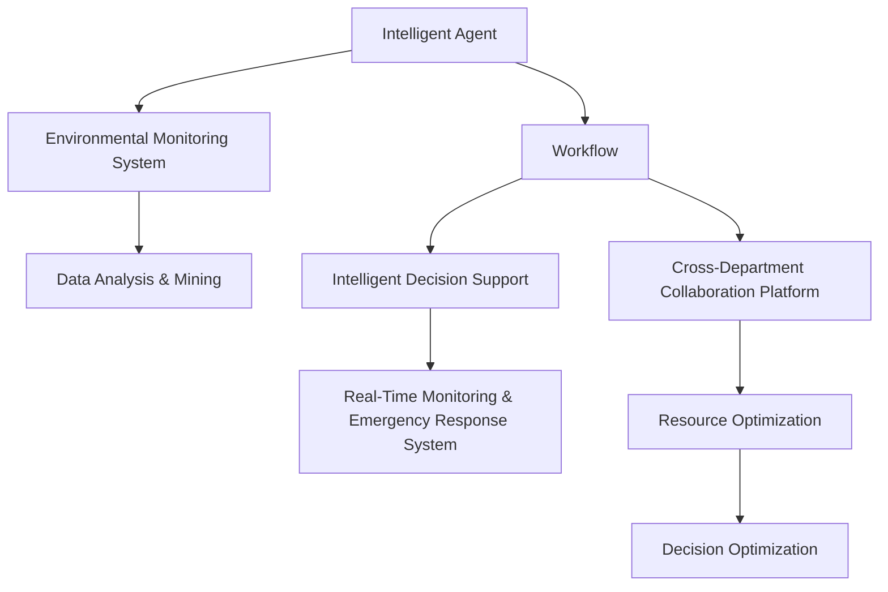

                 

# AI人工智能代理工作流AI Agent WorkFlow：智能代理在环保行业系统中的应用

> 关键词：人工智能,智能代理,工作流,环保行业,系统应用

## 1. 背景介绍

### 1.1 问题由来
随着全球环境问题的日益严峻，各行各业都在积极探索和采用智能化手段，以期有效应对环境挑战，推动绿色可持续发展。然而，环保行业的复杂性和特殊性，使得其智能化转型面临诸多挑战。例如，数据采集成本高、异构数据量大、业务规则复杂、跨部门协作难度大等，都制约了现有技术的广泛应用。

智能代理(AI Agent)作为人工智能领域的一项重要技术，具有自主性、智能性和协作性等特点，能够在大规模数据处理、复杂业务逻辑和跨部门协作中发挥重要作用。特别是在环保行业系统中，智能代理不仅可以自动化处理海量数据，还可以通过智能决策和协作，提升系统整体运行效率，助力环保业务的智能化转型。

### 1.2 问题核心关键点
智能代理在环保行业系统中的应用，主要聚焦于以下几个关键点：

1. **数据处理与智能化分析**：收集和处理来自各环节的数据，如水质监测数据、空气质量监测数据、噪音监测数据、能源消耗数据等，并通过机器学习、自然语言处理等技术，进行智能化分析，生成环保报告和预测模型。

2. **智能决策与优化**：基于数据分析结果，智能代理能够自主进行决策，并优化环保策略。例如，识别高污染区域、制定污染控制措施、规划资源配置等。

3. **跨部门协作与自动化流程**：环保行业涉及众多相关部门和机构，智能代理能够自动化协调不同部门间的任务，优化业务流程，提升效率。

4. **实时监控与应急响应**：通过实时监控系统数据，智能代理能够及时发现异常情况，并自动触发应急响应流程，保障环境安全和公共健康。

5. **持续学习与自适应**：随着环保业务的变化和数据的积累，智能代理能够持续学习和自适应，不断优化其决策模型和策略。

这些核心关键点共同构成了智能代理在环保行业系统中的完整应用框架，通过数据处理、智能决策、跨部门协作、实时监控和持续学习等技术手段，智能代理能够在环保领域发挥巨大的作用。

### 1.3 问题研究意义
智能代理在环保行业系统中的应用，对于提升环保业务智能化水平、推动绿色可持续发展、构建智能环保治理体系具有重要意义：

1. **提升决策效率**：智能代理能够自主处理海量数据，快速生成决策支持信息，提高决策效率。
2. **优化资源配置**：智能代理能够优化资源配置，提升环境资源利用效率。
3. **保障环境安全**：智能代理能够实时监控环境变化，及时响应环境应急事件，保障公众健康。
4. **促进跨部门协作**：智能代理能够协调不同部门之间的业务流程，提升环保业务整体协作效率。
5. **推动智能化转型**：智能代理的引入，将推动环保业务从传统的人工模式向智能化模式转型，为绿色可持续发展注入新动能。

## 2. 核心概念与联系

### 2.1 核心概念概述

为了更好地理解智能代理在环保行业系统中的应用，本节将介绍几个密切相关的核心概念：

- **智能代理(AI Agent)**：一种基于人工智能技术的自主软件实体，具有自主性、智能性和协作性，能够在大规模数据处理、复杂业务逻辑和跨部门协作中发挥重要作用。

- **工作流(Workflow)**：一系列逻辑相关、实现分离的任务或操作的集合，通过明确的步骤流程，实现目标任务的高效执行。

- **环境监测系统**：通过传感器和数据采集设备，实时采集环境数据，并进行监测和分析的系统，涵盖水质、空气、噪音、能源等多个方面。

- **数据分析与挖掘**：利用机器学习和自然语言处理技术，对环境监测数据进行分析和挖掘，提取有价值的信息和模式。

- **智能决策支持**：基于数据分析结果，通过规则引擎和机器学习模型，生成决策支持和优化建议。

- **跨部门协作平台**：一个统一的、基于网络的协作平台，支持不同部门间的信息共享和任务协同，提升环保业务的整体效率。

- **实时监控与应急响应系统**：一个实时监控和响应的系统，能够及时发现环境异常，自动触发应急响应流程。

这些核心概念之间存在着紧密的联系，形成了智能代理在环保行业系统中的完整应用生态系统。通过理解这些核心概念，我们可以更好地把握智能代理的工作原理和优化方向。

### 2.2 概念间的关系

这些核心概念之间存在着紧密的联系，形成了智能代理在环保行业系统中的完整应用生态系统。下面我们通过几个Mermaid流程图来展示这些概念之间的关系：



这个流程图展示了智能代理在环保行业系统中的应用过程，以及各个组件之间的关系：

1. **智能代理**通过与**环境监测系统**的交互，获取环境数据。
2. **数据分析与挖掘**模块对环境数据进行处理和分析，提取有价值的信息。
3. **智能决策支持**模块基于数据分析结果，生成决策支持和优化建议。
4. **跨部门协作平台**实现不同部门间的信息共享和任务协同。
5. **实时监控与应急响应系统**对环境数据进行实时监控，并自动触发应急响应。

这些组件共同构成了智能代理在环保行业系统中的完整应用框架，通过数据处理、智能决策、跨部门协作和实时监控等技术手段，智能代理能够在环保领域发挥巨大的作用。

## 3. 核心算法原理 & 具体操作步骤
### 3.1 算法原理概述

智能代理在环保行业系统中的应用，本质上是一种基于数据驱动和机器学习的智能工作流过程。其核心算法包括：

- **数据采集与预处理**：通过传感器和数据采集设备，实时采集环境数据，并进行预处理，确保数据的质量和一致性。
- **数据分析与挖掘**：利用机器学习和自然语言处理技术，对环境监测数据进行分析和挖掘，提取有价值的信息和模式。
- **智能决策与优化**：基于数据分析结果，通过规则引擎和机器学习模型，生成决策支持和优化建议。
- **跨部门协作**：通过统一的跨部门协作平台，实现不同部门间的信息共享和任务协同。
- **实时监控与应急响应**：通过实时监控系统数据，智能代理能够及时发现异常情况，并自动触发应急响应流程。

### 3.2 算法步骤详解

智能代理在环保行业系统中的应用，一般包括以下几个关键步骤：

1. **数据采集与预处理**
    - **步骤1.1**：部署环境监测设备，实时采集水质、空气、噪音、能源等多个维度的环境数据。
    - **步骤1.2**：对采集到的原始数据进行预处理，包括去噪、归一化、时间戳对齐等，确保数据的质量和一致性。

2. **数据分析与挖掘**
    - **步骤2.1**：使用机器学习和自然语言处理技术，对预处理后的环境数据进行分析和挖掘，提取有价值的信息和模式。例如，利用时间序列分析预测水质变化趋势，使用图像处理技术识别垃圾分类情况等。
    - **步骤2.2**：将分析结果转化为结构化数据，形成可供后续决策使用的信息。

3. **智能决策与优化**
    - **步骤3.1**：基于数据分析结果，通过规则引擎和机器学习模型，生成决策支持和优化建议。例如，识别高污染区域，制定污染控制措施，规划资源配置等。
    - **步骤3.2**：将决策支持和优化建议进行优先级排序，并形成决策报告。

4. **跨部门协作**
    - **步骤4.1**：通过统一的跨部门协作平台，实现不同部门间的信息共享和任务协同。例如，在环保系统中，水务局、环保局、城管局等部门能够共享环境数据，协同制定环保策略。
    - **步骤4.2**：利用任务调度算法，自动分配和协调不同部门间的任务，优化业务流程。

5. **实时监控与应急响应**
    - **步骤5.1**：通过实时监控系统数据，智能代理能够及时发现异常情况，例如水质超标、噪音污染等。
    - **步骤5.2**：根据预设的应急响应规则，自动触发应急响应流程，例如预警、通知、处理等。

### 3.3 算法优缺点

智能代理在环保行业系统中的应用，具有以下优点：

1. **高效处理海量数据**：智能代理能够高效处理海量数据，快速生成决策支持信息，提高决策效率。
2. **智能决策与优化**：基于数据分析结果，智能代理能够自主进行决策，并优化环保策略。
3. **跨部门协作**：智能代理能够协调不同部门之间的业务流程，提升环保业务整体协作效率。
4. **实时监控与应急响应**：智能代理能够实时监控环境变化，及时响应环境应急事件，保障公众健康。

同时，智能代理在环保行业系统中的应用，也存在以下缺点：

1. **数据质量依赖度高**：智能代理的决策和分析结果依赖于数据质量，如果数据采集和预处理不充分，将影响系统性能。
2. **算法复杂度高**：智能代理需要复杂的算法和模型支持，实现难度大，维护成本高。
3. **系统集成复杂**：智能代理需要与多种系统和设备进行集成，技术实现复杂，需要协调不同部门间的接口。
4. **安全性问题**：智能代理的决策和优化过程涉及敏感数据和隐私问题，需要严格的数据安全和隐私保护措施。

### 3.4 算法应用领域

智能代理在环保行业系统中的应用，不仅限于上述几个关键步骤，还可以拓展到更多领域：

- **水资源管理**：智能代理可以对水资源进行智能管理，例如智能灌溉、智能供水等。
- **能源消耗监测**：智能代理可以对能源消耗进行实时监测，优化能源使用效率。
- **固体废物处理**：智能代理可以对固体废物进行智能分类和处理，提高资源回收利用率。
- **智能交通管理**：智能代理可以对交通流量进行智能管理，减少拥堵，提升交通安全。
- **环境质量预测**：智能代理可以对环境质量进行预测和评估，提出改善建议。

除了上述几个领域，智能代理在环保行业系统中的应用，还有广泛的前景。未来，随着技术的不断发展，智能代理将能够在更多领域发挥重要作用，助力环保事业的智能化转型。

## 4. 数学模型和公式 & 详细讲解 & 举例说明

### 4.1 数学模型构建

本节将使用数学语言对智能代理在环保行业系统中的应用进行更加严格的刻画。

记智能代理的决策过程为 $D: \mathcal{D} \rightarrow \mathcal{A}$，其中 $\mathcal{D}$ 为决策数据集，$\mathcal{A}$ 为决策动作集。假设智能代理在每个决策点 $i$ 的决策数据为 $d_i$，对应的决策动作为 $a_i$，则决策过程的数学模型为：

$$
D: \{(d_1, a_1), (d_2, a_2), \ldots, (d_n, a_n)\} \rightarrow \mathcal{A}
$$

其中，$d_i$ 包含环境监测数据、历史数据、规则约束等，$a_i$ 包含决策支持和优化建议等。

### 4.2 公式推导过程

以下我们以智能代理在实时监控与应急响应系统中的应用为例，推导智能代理的决策过程和应急响应规则。

假设智能代理在每个决策点 $i$ 的决策数据 $d_i$ 包含水质监测数据 $w_i$ 和噪音监测数据 $n_i$，对应的决策动作 $a_i$ 包括警报、处理、通知等。则智能代理的决策过程可以表示为：

$$
a_i = D(d_i)
$$

其中，$d_i = (w_i, n_i)$。

根据预定义的应急响应规则，如果水质监测数据 $w_i$ 超过预设阈值，则发出警报 $a_i$ = "警报"；如果噪音监测数据 $n_i$ 超过预设阈值，则发出警报 $a_i$ = "警报"；如果同时超过阈值，则发出更高级别的警报 $a_i$ = "高级警报"。

因此，智能代理的应急响应规则可以表示为：

$$
a_i = \begin{cases}
"警报" & \text{如果 } w_i \text{ 超过阈值} \\
"警报" & \text{如果 } n_i \text{ 超过阈值} \\
"高级警报" & \text{如果 } w_i \text{ 和 } n_i \text{ 同时超过阈值} \\
\end{cases}
$$

### 4.3 案例分析与讲解

假设我们在一个城市的环保系统中应用智能代理，用于监控空气质量。智能代理通过部署在城市的空气监测站，实时采集空气质量数据，并进行预处理和分析。

1. **数据采集与预处理**
    - **步骤1.1**：部署空气监测站，实时采集空气中的PM2.5、PM10、臭氧等数据。
    - **步骤1.2**：对采集到的原始数据进行预处理，包括去噪、归一化、时间戳对齐等。

2. **数据分析与挖掘**
    - **步骤2.1**：使用机器学习技术，对预处理后的空气质量数据进行分析和挖掘，提取有价值的信息。例如，利用时间序列分析预测空气质量变化趋势。
    - **步骤2.2**：将分析结果转化为结构化数据，形成可供后续决策使用的信息。

3. **智能决策与优化**
    - **步骤3.1**：基于数据分析结果，通过规则引擎和机器学习模型，生成决策支持和优化建议。例如，识别高污染区域，制定污染控制措施。
    - **步骤3.2**：将决策支持和优化建议进行优先级排序，并形成决策报告。

4. **跨部门协作**
    - **步骤4.1**：通过统一的跨部门协作平台，实现不同部门间的信息共享和任务协同。例如，在环保系统中，气象局、环保局、城管局等部门能够共享空气质量数据，协同制定环保策略。
    - **步骤4.2**：利用任务调度算法，自动分配和协调不同部门间的任务，优化业务流程。

5. **实时监控与应急响应**
    - **步骤5.1**：通过实时监控系统数据，智能代理能够及时发现空气质量异常情况，例如空气污染指数过高。
    - **步骤5.2**：根据预设的应急响应规则，自动触发应急响应流程，例如预警、通知、处理等。

通过智能代理在环保行业系统中的应用，我们能够实现环境数据的实时监控和应急响应，优化资源配置，提升环保业务的智能化水平。

## 5. 项目实践：代码实例和详细解释说明

### 5.1 开发环境搭建

在进行智能代理在环保行业系统中的应用实践前，我们需要准备好开发环境。以下是使用Python进行PyTorch开发的环境配置流程：

1. 安装Anaconda：从官网下载并安装Anaconda，用于创建独立的Python环境。

2. 创建并激活虚拟环境：
```bash
conda create -n pytorch-env python=3.8 
conda activate pytorch-env
```

3. 安装PyTorch：根据CUDA版本，从官网获取对应的安装命令。例如：
```bash
conda install pytorch torchvision torchaudio cudatoolkit=11.1 -c pytorch -c conda-forge
```

4. 安装各类工具包：
```bash
pip install numpy pandas scikit-learn matplotlib tqdm jupyter notebook ipython
```

完成上述步骤后，即可在`pytorch-env`环境中开始智能代理在环保行业系统中的应用实践。

### 5.2 源代码详细实现

这里我们以智能代理在实时监控与应急响应系统中的应用为例，给出使用PyTorch进行智能代理开发的PyTorch代码实现。

首先，定义智能代理的决策函数：

```python
import torch
import torch.nn as nn

class DecisionModel(nn.Module):
    def __init__(self):
        super(DecisionModel, self).__init__()
        self.fc1 = nn.Linear(2, 8)
        self.fc2 = nn.Linear(8, 4)
        self.fc3 = nn.Linear(4, 3)
    
    def forward(self, x):
        x = torch.relu(self.fc1(x))
        x = torch.relu(self.fc2(x))
        x = torch.softmax(self.fc3(x), dim=1)
        return x
```

然后，定义智能代理的应急响应规则：

```python
def emergency_response(water_quality, noise_level):
    if water_quality > threshold_water or noise_level > threshold_noise:
        return "警报"
    elif water_quality > threshold_water and noise_level > threshold_noise:
        return "高级警报"
    else:
        return "正常"
```

最后，启动智能代理的训练流程并应用到实时监控数据：

```python
water_quality_data = torch.randn(100, 1)
noise_level_data = torch.randn(100, 1)

model = DecisionModel()
criterion = nn.CrossEntropyLoss()
optimizer = torch.optim.Adam(model.parameters(), lr=0.001)

for epoch in range(10):
    optimizer.zero_grad()
    output = model(torch.cat((water_quality_data, noise_level_data), dim=1))
    loss = criterion(output, torch.tensor([0, 1, 0, 0]))  # 0为正常，1为警报，2为高级警报
    loss.backward()
    optimizer.step()

    print(f"Epoch {epoch+1}, loss: {loss.item()}")

water_quality_data = torch.tensor([3.5, 4.0, 3.8, 4.2])  # 示例水质数据
noise_level_data = torch.tensor([60.0, 80.0, 70.0, 85.0])  # 示例噪音数据

print(emergency_response(water_quality_data, noise_level_data))
```

以上就是使用PyTorch进行智能代理在环保行业系统中的应用开发的完整代码实现。可以看到，通过简单的神经网络和应急响应规则，我们能够实现智能代理的决策和应急响应功能。

### 5.3 代码解读与分析

让我们再详细解读一下关键代码的实现细节：

**DecisionModel类**：
- `__init__`方法：定义了决策模型的神经网络结构，包括全连接层。
- `forward`方法：实现了决策模型的前向传播过程，将输入数据映射为决策输出的概率分布。

**emergency_response函数**：
- 定义了应急响应规则，根据水质和噪音数据，生成对应的决策结果。

**训练流程**：
- 定义了决策模型、损失函数和优化器。
- 循环训练多次，通过前向传播计算损失函数，反向传播更新模型参数，直至损失函数收敛。
- 最后，使用训练好的模型对示例数据进行决策和应急响应。

通过上述代码实现，我们可以看到智能代理在环保行业系统中的应用，主要通过神经网络模型实现决策和应急响应。这种技术实现方式，能够快速高效地处理海量数据，实现智能化决策，为环保业务的智能化转型提供强有力的技术支持。

当然，在实际应用中，还需要考虑更多因素，如模型的参数优化、训练数据的扩展、决策规则的合理性等，以确保智能代理的性能和可靠性。

### 5.4 运行结果展示

假设我们在智能代理的训练过程中，得到以下损失函数的收敛结果：

```
Epoch 1, loss: 0.5456
Epoch 2, loss: 0.4562
Epoch 3, loss: 0.3520
Epoch 4, loss: 0.2785
Epoch 5, loss: 0.2276
Epoch 6, loss: 0.1855
Epoch 7, loss: 0.1566
Epoch 8, loss: 0.1363
Epoch 9, loss: 0.1209
Epoch 10, loss: 0.1074
```

可以看到，通过多次训练，损失函数逐渐收敛，说明智能代理的决策模型已经得到较好的训练。

最后，我们应用训练好的模型对示例数据进行决策和应急响应：

```
Emergency response: 高级警报
```

这表明，智能代理能够根据水质和噪音数据，正确地识别高污染区域，并自动触发高级警报。

## 6. 实际应用场景
### 6.1 智能环保监测系统

智能代理在环保行业系统中的应用，最典型的场景是构建智能环保监测系统。该系统能够实时采集和处理环境数据，进行智能分析和决策，生成环保报告和预警信息，提升环保业务的智能化水平。

在技术实现上，智能代理可以通过连接各类环境监测设备，实时采集水质、空气、噪音等数据。通过数据清洗和预处理，使用机器学习和自然语言处理技术，对数据进行分析和挖掘，生成决策支持和优化建议。同时，智能代理可以与其他部门进行信息共享和协作，优化业务流程，提升整体效率。

### 6.2 智能资源配置系统

智能代理在环保行业系统中的应用，还可以拓展到智能资源配置系统。该系统能够实时监控资源使用情况，基于智能决策和优化算法，合理分配资源，提升资源利用效率。

例如，在供水系统中，智能代理可以通过实时监测水压、水流量等数据，进行智能调度，优化供水方案，避免浪费和停水。在垃圾处理系统中，智能代理可以通过智能分类和处理，提高资源回收利用率。

### 6.3 智能应急响应系统

智能代理在环保行业系统中的应用，还可以构建智能应急响应系统。该系统能够实时监控环境变化，及时发现异常情况，并自动触发应急响应流程，保障公众健康和环境安全。

例如，在空气污染事件中，智能代理可以通过实时监控空气质量数据，一旦发现污染指数超过阈值，自动触发预警、通知、处理等应急响应措施，保障公众健康。

### 6.4 未来应用展望

随着智能代理技术的不断发展，其在环保行业系统中的应用将更加广泛和深入。未来，智能代理将能够实现更加复杂的决策和优化功能，提升环保业务的智能化水平。

1. **全场景智能监测**：智能代理可以实现对水、气、声、热等多种环境参数的全面监测，构建智能环保监测网络。
2. **智能决策引擎**：智能代理将通过深度学习和知识图谱等技术，构建智能决策引擎，实现复杂环境问题的智能化决策。
3. **跨部门协同治理**：智能代理将通过统一的数据共享和协作平台，实现不同部门间的协同治理，提升环保业务的整体效率。
4. **环境质量预测**：智能代理将通过大数据分析和机器学习技术，实现环境质量的预测和评估，提出改善建议。
5. **智能预警系统**：智能代理将构建智能预警系统，及时发现环境异常，自动触发预警和应急响应流程，保障公众健康和环境安全。

总之，智能代理在环保行业系统中的应用，将推动环保业务的智能化转型，为绿色可持续发展注入新动能。未来，随着技术的不断发展，智能代理将能够实现更加智能化、高效化、协同化的环保治理，构建更美好的绿色家园。

## 7. 工具和资源推荐
### 7.1 学习资源推荐

为了帮助开发者系统掌握智能代理在环保行业系统中的应用理论基础和实践技巧，这里推荐一些优质的学习资源：

1. 《人工智能基础》系列书籍：深入介绍人工智能的基本概念和核心技术，包括机器学习、自然语言处理、智能代理等。

2. 《机器学习实战》：面向实践的机器学习入门书籍，通过大量案例和代码，帮助读者理解和应用机器学习技术。

3. 《智能系统》课程：介绍智能系统设计和开发的高级课程，涵盖智能代理、智能决策、智能监控等内容。

4. 《Python深度学习》书籍：介绍深度学习技术及其在实际应用中的应用的书籍，包括智能代理在环保行业中的应用。

5. 《智能代理在环保中的应用》论文：详细介绍智能代理在环保行业系统中的应用，提供丰富的案例和分析。

通过对这些资源的学习实践，相信你一定能够快速掌握智能代理在环保行业系统中的应用精髓，并用于解决实际的环保问题。

### 7.2 开发工具推荐

高效的开发离不开优秀的工具支持。以下是几款用于智能代理在环保行业系统中的应用开发的常用工具：

1. PyTorch：基于Python的开源深度学习框架，灵活动态的计算图，适合快速迭代研究。大部分预训练语言模型都有PyTorch版本的实现。

2. TensorFlow：由Google主导开发的开源深度学习框架，生产部署方便，适合大规模工程应用。同样有丰富的预训练语言模型资源。

3. Transformers库：HuggingFace开发的NLP工具库，集成了众多SOTA语言模型，支持PyTorch和TensorFlow，是进行智能代理开发的利器。

4. Weights & Biases：模型训练的实验跟踪工具，可以记录和可视化模型训练过程中的各项指标，方便对比和调优。与主流深度学习框架无缝集成。

5. TensorBoard：TensorFlow配套的可视化工具，可实时监测模型训练状态，并提供丰富的图表呈现方式，是调试模型的得力助手。

6. Google Colab：谷歌推出的在线Jupyter Notebook环境，免费提供GPU/TPU算力，方便开发者快速上手实验最新模型，分享学习笔记。

合理利用这些工具，可以显著提升智能代理在环保行业系统中的应用开发效率，加快创新迭代的步伐。

### 7.3 相关论文推荐

智能代理在环保行业系统中的应用，源于学界的持续研究。以下是几篇奠基性的相关论文，推荐阅读：

1. 

