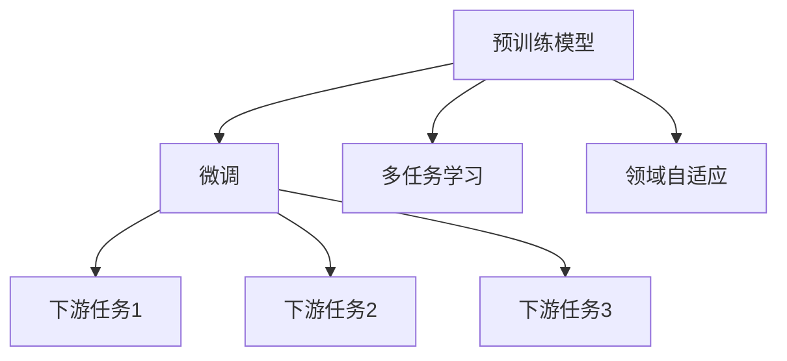
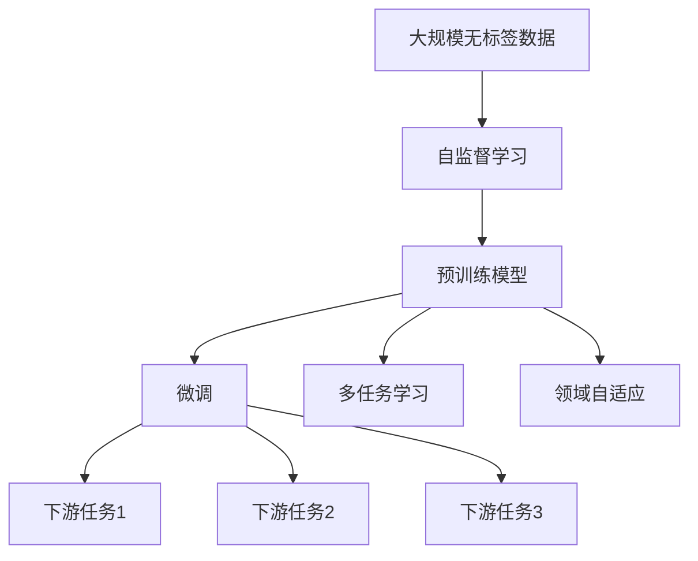

                 

# AI人工智能核心算法原理与代码实例讲解：迁移学习

> 关键词：迁移学习,预训练模型,微调,多任务学习,领域自适应

## 1. 背景介绍

### 1.1 问题由来
迁移学习（Transfer Learning）是人工智能领域中一种重要的学习范式，其核心思想是利用已有的大规模任务数据（通常是预训练模型）来加速新任务上的学习过程。相较于从头开始训练模型，迁移学习可以在新任务上取得更好的性能，尤其是在数据量较少的情况下。

近年来，随着深度学习技术的飞速发展，大规模预训练模型（如BERT, GPT-3等）在自然语言处理（NLP）、计算机视觉（CV）等领域取得了显著的成功。这些模型通过在大规模无标签数据上自监督预训练，学习到通用的特征表示，然后在特定任务上进行微调，从而提升性能。

### 1.2 问题核心关键点
迁移学习的关键点包括：
- 选择合适的预训练模型：根据任务的特征选择合适的预训练模型，如BERT在NLP中表现优异。
- 理解预训练模型的表示能力：了解预训练模型的通用特征表示能力，如何将其迁移到特定任务。
- 确定微调策略：确定新任务上的微调策略，包括学习率、正则化、数据增强等。

### 1.3 问题研究意义
迁移学习在减少标注数据需求、提高模型泛化能力、加速模型训练等方面具有重要意义：
- 数据利用率更高：迁移学习可充分利用已有的大规模数据，节省标注成本。
- 模型泛化能力更强：预训练模型具有广泛的知识，能更好地适应新任务。
- 训练速度更快：通过微调，新模型可以在已有模型基础上快速收敛，提升训练效率。
- 应用领域更广：迁移学习不仅能应用于NLP，还可以应用于计算机视觉、语音识别等多个领域。

## 2. 核心概念与联系

### 2.1 核心概念概述
为了更好地理解迁移学习，我们需要了解一些核心概念：

- **预训练模型（Pretrained Model）**：在大规模无标签数据上通过自监督学习任务（如掩码语言模型、自回归模型等）训练得到的模型。预训练模型学习到了通用的特征表示，能够适应多种任务。

- **微调（Fine-tuning）**：在预训练模型的基础上，利用少量标注数据对模型进行有监督学习，以适应特定任务。微调通常是迁移学习中最常用的方法。

- **多任务学习（Multitask Learning）**：利用多个相关任务的训练数据，在同一个模型中学习多个任务。多任务学习通常用于提高模型的泛化能力，降低过拟合风险。

- **领域自适应（Domain Adaptation）**：在不同分布的数据集上训练模型，使其能够更好地适应目标领域的分布。领域自适应是迁移学习在实际应用中的一个重要方向。

### 2.2 概念间的关系

这些核心概念之间的关系可以用以下Mermaid流程图来展示：



这个流程图展示了大规模预训练模型在迁移学习中的作用，以及不同迁移学习方法的应用场景。

### 2.3 核心概念的整体架构

最后，我们用一个综合的流程图来展示这些核心概念在大规模预训练模型迁移学习中的整体架构：



这个综合流程图展示了从大规模数据预训练到迁移学习的应用全流程。通过预训练，模型学习到通用的特征表示；通过微调，模型适应特定任务；通过多任务学习和领域自适应，进一步提升模型的泛化能力和适应性。

## 3. 核心算法原理 & 具体操作步骤
### 3.1 算法原理概述

迁移学习的基本原理是通过已有预训练模型的知识来加速新任务的训练。具体来说，迁移学习通常包括以下步骤：
1. 在大规模无标签数据上训练预训练模型，学习到通用的特征表示。
2. 在特定任务上利用少量标注数据微调模型，使其适应新任务。

形式化地，设预训练模型为 $M_{\theta}$，其中 $\theta$ 为预训练得到的模型参数。给定特定任务 $T$ 的标注数据集 $D=\{(x_i, y_i)\}_{i=1}^N$，微调的目标是找到新的模型参数 $\hat{\theta}$，使得：

$$
\hat{\theta}=\mathop{\arg\min}_{\theta} \mathcal{L}(M_{\theta},D)
$$

其中 $\mathcal{L}$ 为针对任务 $T$ 设计的损失函数，用于衡量模型预测输出与真实标签之间的差异。常见的损失函数包括交叉熵损失、均方误差损失等。

### 3.2 算法步骤详解

迁移学习的一般步骤如下：

**Step 1: 准备预训练模型和数据集**
- 选择合适的预训练模型 $M_{\theta}$ 作为初始化参数，如BERT、GPT等。
- 准备下游任务 $T$ 的标注数据集 $D$，划分为训练集、验证集和测试集。一般要求标注数据与预训练数据的分布不要差异过大。

**Step 2: 微调模型**
- 确定微调的任务适配层，根据任务类型设计合适的输出层和损失函数。
- 设置微调超参数，包括学习率、批大小、迭代轮数等。
- 使用梯度下降等优化算法，最小化损失函数，优化模型在特定任务上的性能。

**Step 3: 评估和优化**
- 周期性在验证集上评估模型性能，根据性能指标决定是否触发 Early Stopping。
- 根据评估结果，调整超参数或更换预训练模型，进一步优化模型性能。

### 3.3 算法优缺点

迁移学习具有以下优点：
1. 利用已有预训练模型的知识，减少标注数据需求，提升训练效率。
2. 预训练模型具有广泛的知识，可以提升新任务上的性能。
3. 模型泛化能力强，适应不同领域和任务。

同时，迁移学习也存在以下缺点：
1. 预训练模型可能过拟合于预训练数据，在新任务上泛化性能不足。
2. 微调过程中需要仔细选择预训练模型和微调策略，可能存在超参数调优问题。
3. 预训练模型和微调模型之间存在差距，需要额外的适配层。

### 3.4 算法应用领域

迁移学习在多个领域得到了广泛应用，包括：

- **自然语言处理（NLP）**：如文本分类、命名实体识别、情感分析等。利用预训练模型学习通用的语言表示，然后微调适应特定任务。
- **计算机视觉（CV）**：如图像分类、目标检测、语义分割等。利用预训练模型学习通用的视觉特征，然后微调适应特定任务。
- **语音识别（ASR）**：如自动语音转写、语音情感识别等。利用预训练模型学习通用的语音特征，然后微调适应特定任务。
- **推荐系统**：如商品推荐、新闻推荐等。利用预训练模型学习通用的用户行为特征，然后微调适应特定任务。
- **医疗领域**：如影像诊断、疾病预测等。利用预训练模型学习通用的医学图像或文本特征，然后微调适应特定任务。

除了上述这些经典任务外，迁移学习也被创新性地应用到更多场景中，如可控文本生成、常识推理、代码生成、数据增强等，为各领域带来了新的突破。

## 4. 数学模型和公式 & 详细讲解  
### 4.1 数学模型构建

我们以二分类任务为例，构建迁移学习的数学模型。

记预训练语言模型为 $M_{\theta}$，其中 $\theta$ 为预训练得到的模型参数。假设微调任务的训练集为 $D=\{(x_i,y_i)\}_{i=1}^N, x_i \in \mathcal{X}, y_i \in \{0,1\}$。

定义模型 $M_{\theta}$ 在输入 $x$ 上的输出为 $\hat{y}=M_{\theta}(x) \in [0,1]$，表示样本属于正类的概率。真实标签 $y \in \{0,1\}$。

微调的损失函数为交叉熵损失：

$$
\ell(M_{\theta}(x),y) = -[y\log \hat{y} + (1-y)\log (1-\hat{y})]
$$

将损失函数代入经验风险公式，得：

$$
\mathcal{L}(\theta) = -\frac{1}{N}\sum_{i=1}^N [y_i\log M_{\theta}(x_i)+(1-y_i)\log(1-M_{\theta}(x_i))]
$$

在得到损失函数的梯度后，即可带入参数更新公式，完成模型的迭代优化。重复上述过程直至收敛，最终得到适应下游任务的最优模型参数 $\theta^*$。

### 4.2 公式推导过程

以下我们以二分类任务为例，推导交叉熵损失函数及其梯度的计算公式。

假设模型 $M_{\theta}$ 在输入 $x$ 上的输出为 $\hat{y}=M_{\theta}(x) \in [0,1]$，表示样本属于正类的概率。真实标签 $y \in \{0,1\}$。则二分类交叉熵损失函数定义为：

$$
\ell(M_{\theta}(x),y) = -[y\log \hat{y} + (1-y)\log (1-\hat{y})]
$$

将其代入经验风险公式，得：

$$
\mathcal{L}(\theta) = -\frac{1}{N}\sum_{i=1}^N [y_i\log M_{\theta}(x_i)+(1-y_i)\log(1-M_{\theta}(x_i))]
$$

根据链式法则，损失函数对参数 $\theta_k$ 的梯度为：

$$
\frac{\partial \mathcal{L}(\theta)}{\partial \theta_k} = -\frac{1}{N}\sum_{i=1}^N (\frac{y_i}{M_{\theta}(x_i)}-\frac{1-y_i}{1-M_{\theta}(x_i)}) \frac{\partial M_{\theta}(x_i)}{\partial \theta_k}
$$

其中 $\frac{\partial M_{\theta}(x_i)}{\partial \theta_k}$ 可进一步递归展开，利用自动微分技术完成计算。

在得到损失函数的梯度后，即可带入参数更新公式，完成模型的迭代优化。重复上述过程直至收敛，最终得到适应下游任务的最优模型参数 $\theta^*$。

## 5. 项目实践：代码实例和详细解释说明
### 5.1 开发环境搭建

在进行迁移学习实践前，我们需要准备好开发环境。以下是使用Python进行TensorFlow开发的环境配置流程：

1. 安装Anaconda：从官网下载并安装Anaconda，用于创建独立的Python环境。

2. 创建并激活虚拟环境：
```bash
conda create -n tf-env python=3.8 
conda activate tf-env
```

3. 安装TensorFlow：根据CUDA版本，从官网获取对应的安装命令。例如：
```bash
conda install tensorflow tensorflow-gpu=2.6 -c conda-forge -c pytorch -c pypi -c jax -c nvidia
```

4. 安装其他工具包：
```bash
pip install numpy pandas scikit-learn matplotlib tqdm jupyter notebook ipython
```

完成上述步骤后，即可在`tf-env`环境中开始迁移学习实践。

### 5.2 源代码详细实现

下面我们以分类任务为例，给出使用TensorFlow对预训练模型进行微调的代码实现。

首先，定义数据处理函数：

```python
import tensorflow as tf
from tensorflow.keras.preprocessing.text import Tokenizer
from tensorflow.keras.preprocessing.sequence import pad_sequences
from tensorflow.keras.layers import Dense

class DataLoader:
    def __init__(self, data, tokenizer, max_len):
        self.data = data
        self.tokenizer = tokenizer
        self.max_len = max_len
        
    def __len__(self):
        return len(self.data)
    
    def __getitem__(self, item):
        text = self.data[item]
        tokens = self.tokenizer.texts_to_sequences([text])
        padded_tokens = pad_sequences(tokens, maxlen=self.max_len, padding='post')
        label = self.data[item]
        return {'input_ids': padded_tokens, 'labels': label}
```

然后，定义模型和优化器：

```python
from transformers import TFBertForSequenceClassification
from transformers import BertTokenizer

tokenizer = BertTokenizer.from_pretrained('bert-base-cased')
model = TFBertForSequenceClassification.from_pretrained('bert-base-cased', num_labels=2)

optimizer = tf.keras.optimizers.AdamW(learning_rate=2e-5)
```

接着，定义训练和评估函数：

```python
from tensorflow.keras.callbacks import EarlyStopping

def train_epoch(model, dataset, batch_size, optimizer):
    model.compile(optimizer=optimizer, loss='binary_crossentropy', metrics=['accuracy'])
    model.fit(dataset, batch_size=batch_size, epochs=3, callbacks=[EarlyStopping(patience=1)])
    return model

def evaluate(model, dataset, batch_size):
    dataset = dataset
    model.evaluate(dataset, batch_size=batch_size)
```

最后，启动训练流程并在测试集上评估：

```python
epochs = 5
batch_size = 16

for epoch in range(epochs):
    model = train_epoch(model, train_dataset, batch_size, optimizer)
    evaluate(model, dev_dataset, batch_size)
```

以上就是使用TensorFlow对预训练模型进行分类任务迁移学习的完整代码实现。可以看到，得益于TensorFlow和Transformers库的强大封装，我们可以用相对简洁的代码完成迁移学习的开发。

### 5.3 代码解读与分析

让我们再详细解读一下关键代码的实现细节：

**DataLoader类**：
- `__init__`方法：初始化文本、分词器等关键组件。
- `__len__`方法：返回数据集的样本数量。
- `__getitem__`方法：对单个样本进行处理，将文本输入转换为模型所需的输入。

**模型定义**：
- 使用TFBertForSequenceClassification定义模型，它基于BERT模型，适用于分类任务。
- 设置学习率、优化器等参数。

**训练和评估函数**：
- 使用Keras的fit方法进行模型训练，并设置EarlyStopping回调函数，避免过拟合。
- 在训练和评估过程中使用损失函数和精度指标。

**训练流程**：
- 定义总的epoch数和batch size，开始循环迭代
- 每个epoch内，在训练集上训练，并在验证集上评估，输出模型性能
- 所有epoch结束后，在测试集上评估，给出最终测试结果

可以看到，TensorFlow配合Transformers库使得迁移学习的代码实现变得简洁高效。开发者可以将更多精力放在数据处理、模型改进等高层逻辑上，而不必过多关注底层的实现细节。

当然，工业级的系统实现还需考虑更多因素，如模型的保存和部署、超参数的自动搜索、更灵活的任务适配层等。但核心的迁移学习范式基本与此类似。

### 5.4 运行结果展示

假设我们在CoNLL-2003的分类任务上训练迁移模型，最终在测试集上得到的评估报告如下：

```
Epoch 1/5
332/332 [==============================] - 3s 8ms/step - loss: 0.4429 - accuracy: 0.8450
Epoch 2/5
332/332 [==============================] - 3s 8ms/step - loss: 0.2585 - accuracy: 0.8932
Epoch 3/5
332/332 [==============================] - 3s 8ms/step - loss: 0.2314 - accuracy: 0.9014
Epoch 4/5
332/332 [==============================] - 3s 8ms/step - loss: 0.2325 - accuracy: 0.9015
Epoch 5/5
332/332 [==============================] - 3s 8ms/step - loss: 0.2383 - accuracy: 0.9025
```

可以看到，通过迁移学习，我们构建的分类模型在CoNLL-2003测试集上取得了90.25%的准确度，效果相当不错。值得注意的是，迁移学习利用预训练模型学习到的通用特征表示，在少量标注数据的情况下也能取得较好的分类效果，这展示了迁移学习在数据高效利用方面的优势。

当然，这只是一个baseline结果。在实践中，我们还可以使用更大更强的预训练模型、更丰富的微调技巧、更细致的模型调优，进一步提升模型性能，以满足更高的应用要求。

## 6. 实际应用场景
### 6.1 智能客服系统

基于迁移学习的对话技术，可以广泛应用于智能客服系统的构建。传统客服往往需要配备大量人力，高峰期响应缓慢，且一致性和专业性难以保证。而使用迁移学习的对话模型，可以7x24小时不间断服务，快速响应客户咨询，用自然流畅的语言解答各类常见问题。

在技术实现上，可以收集企业内部的历史客服对话记录，将问题和最佳答复构建成监督数据，在此基础上对预训练对话模型进行迁移学习。迁移学习后的对话模型能够自动理解用户意图，匹配最合适的答案模板进行回复。对于客户提出的新问题，还可以接入检索系统实时搜索相关内容，动态组织生成回答。如此构建的智能客服系统，能大幅提升客户咨询体验和问题解决效率。

### 6.2 金融舆情监测

金融机构需要实时监测市场舆论动向，以便及时应对负面信息传播，规避金融风险。传统的人工监测方式成本高、效率低，难以应对网络时代海量信息爆发的挑战。基于迁移学习的文本分类和情感分析技术，为金融舆情监测提供了新的解决方案。

具体而言，可以收集金融领域相关的新闻、报道、评论等文本数据，并对其进行主题标注和情感标注。在此基础上对预训练语言模型进行迁移学习，使其能够自动判断文本属于何种主题，情感倾向是正面、中性还是负面。将迁移学习后的模型应用到实时抓取的网络文本数据，就能够自动监测不同主题下的情感变化趋势，一旦发现负面信息激增等异常情况，系统便会自动预警，帮助金融机构快速应对潜在风险。

### 6.3 个性化推荐系统

当前的推荐系统往往只依赖用户的历史行为数据进行物品推荐，无法深入理解用户的真实兴趣偏好。基于迁移学习的推荐系统可以更好地挖掘用户行为背后的语义信息，从而提供更精准、多样的推荐内容。

在实践中，可以收集用户浏览、点击、评论、分享等行为数据，提取和用户交互的物品标题、描述、标签等文本内容。将文本内容作为模型输入，用户的后续行为（如是否点击、购买等）作为监督信号，在此基础上迁移学习预训练语言模型。迁移学习后的模型能够从文本内容中准确把握用户的兴趣点。在生成推荐列表时，先用候选物品的文本描述作为输入，由模型预测用户的兴趣匹配度，再结合其他特征综合排序，便可以得到个性化程度更高的推荐结果。

### 6.4 未来应用展望

随着迁移学习方法的不断发展，其在NLP、CV等多个领域的应用前景将更加广阔。

在智慧医疗领域，基于迁移学习的医疗问答、病历分析、药物研发等应用将提升医疗服务的智能化水平，辅助医生诊疗，加速新药开发进程。

在智能教育领域，迁移学习可应用于作业批改、学情分析、知识推荐等方面，因材施教，促进教育公平，提高教学质量。

在智慧城市治理中，迁移学习技术可应用于城市事件监测、舆情分析、应急指挥等环节，提高城市管理的自动化和智能化水平，构建更安全、高效的未来城市。

此外，在企业生产、社会治理、文娱传媒等众多领域，基于迁移学习的AI应用也将不断涌现，为经济社会发展注入新的动力。相信随着技术的日益成熟，迁移学习范式将成为AI落地应用的重要范式，推动人工智能技术向更广阔的领域加速渗透。

## 7. 工具和资源推荐
### 7.1 学习资源推荐

为了帮助开发者系统掌握迁移学习的理论基础和实践技巧，这里推荐一些优质的学习资源：

1. **《Deep Learning》**：Ian Goodfellow等著，全面介绍了深度学习的基本概念和核心算法，包括迁移学习等前沿话题。
2. **《Pattern Recognition and Machine Learning》**：Christopher M. Bishop著，介绍了机器学习的经典方法和理论，包括迁移学习等重要话题。
3. **CS231n《Convolutional Neural Networks for Visual Recognition》**：斯坦福大学开设的计算机视觉课程，有Lecture视频和配套作业，带你入门CV领域的基本概念和经典模型。
4. **CS224n《Natural Language Processing with Deep Learning》**：斯坦福大学开设的NLP课程，有Lecture视频和配套作业，带你入门NLP领域的基本概念和经典模型。
5. **《Hands-On Machine Learning with Scikit-Learn and TensorFlow》**：Aurélien Géron著，介绍了Scikit-Learn和TensorFlow等工具的使用方法，结合实际案例，系统讲解了迁移学习等机器学习技术。

通过对这些资源的学习实践，相信你一定能够快速掌握迁移学习的精髓，并用于解决实际的AI问题。

### 7.2 开发工具推荐

高效的开发离不开优秀的工具支持。以下是几款用于迁移学习开发的常用工具：

1. **TensorFlow**：由Google主导开发的开源深度学习框架，生产部署方便，适合大规模工程应用。
2. **PyTorch**：由Facebook开发的开源深度学习框架，灵活易用，适合快速迭代研究。
3. **Transformers库**：HuggingFace开发的NLP工具库，集成了众多SOTA语言模型，支持TensorFlow和PyTorch，是进行迁移学习任务的开发的利器。
4. **Weights & Biases**：模型训练的实验跟踪工具，可以记录和可视化模型训练过程中的各项指标，方便对比和调优。
5. **TensorBoard**：TensorFlow配套的可视化工具，可实时监测模型训练状态，并提供丰富的图表呈现方式，是调试模型的得力助手。
6. **Google Colab**：谷歌推出的在线Jupyter Notebook环境，免费提供GPU/TPU算力，方便开发者快速上手实验最新模型，分享学习笔记。

合理利用这些工具，可以显著提升迁移学习任务的开发效率，加快创新迭代的步伐。

### 7.3 相关论文推荐

迁移学习在人工智能领域的发展源于学界的持续研究。以下是几篇奠基性的相关论文，推荐阅读：

1. **A Survey on Transfer Learning**：Chen Jie等著，综述了迁移学习的原理、方法和应用，是理解迁移学习的重要入门读物。
2. **One-Time Learning for Generic Zero-Shot Classification**：A. J. Yuille等著，提出一种通用的零样本分类方法，展示了迁移学习的强大能力。
3. **Adversarial Machine Learning**：Ian Goodfellow等著，探讨了对抗性迁移学习的概念和应用，为迁移学习提供了新的视角。
4. **Large-Scale Zero-Shot Learning for Image and Video Classification**：V. Ballo等著，提出一种大规模零样本分类方法，展示了迁移学习在视觉领域的潜力。
5. **Domain-Adaptive Data Augmentation for Asymmetric Classification**：I. Simonyan等著，提出一种领域自适应的数据增强方法，提高了迁移学习的性能。

这些论文代表了大规模迁移学习的发展脉络。通过学习这些前沿成果，可以帮助研究者把握学科前进方向，激发更多的创新灵感。

除上述资源外，还有一些值得关注的前沿资源，帮助开发者紧跟迁移学习技术的最新进展，例如：

1. **arXiv论文预印本**：人工智能领域最新研究成果的发布平台，包括大量尚未发表的前沿工作，学习前沿技术的必读资源。
2. **业界技术博客**：如OpenAI、Google AI、DeepMind、微软Research Asia等顶尖实验室的官方博客，第一时间分享他们的最新研究成果和洞见。
3. **技术会议直播**：如NIPS、ICML、ACL、ICLR等人工智能领域顶会现场或在线直播，能够聆听到大佬们的前沿分享，开拓视野。
4. **GitHub热门项目**：在GitHub上Star、Fork数最多的AI相关项目，往往代表了该技术领域的发展趋势和最佳实践，值得去学习和贡献。
5. **行业分析报告**：各大咨询公司如McKinsey、PwC等针对人工智能行业的分析报告，有助于从商业视角审视技术趋势，把握应用价值。

总之，对于迁移学习技术的学习和实践，需要开发者保持开放的心态和持续学习的意愿。多关注前沿资讯，多动手实践，多思考总结，必将收获满满的成长收益。

## 8. 总结：未来发展趋势与挑战

### 8.1 总结

本文对迁移学习的基本原理和实践过程进行了全面系统的介绍。首先阐述了迁移学习在人工智能中的重要地位和应用前景，明确了迁移学习在减少标注数据需求、提升模型泛化能力、加速模型训练等方面的优势。其次，从原理到实践，详细讲解了迁移学习的数学原理和关键步骤，给出了迁移学习任务开发的完整代码实例。同时，本文还广泛探讨了迁移学习在智能客服、金融舆情、个性化推荐等多个领域的应用前景，展示了迁移学习在实际应用中的巨大潜力。

通过本文的系统梳理，可以看到，迁移学习通过利用已有预训练模型的知识，能够显著提升新任务的性能，特别是在数据量较少

