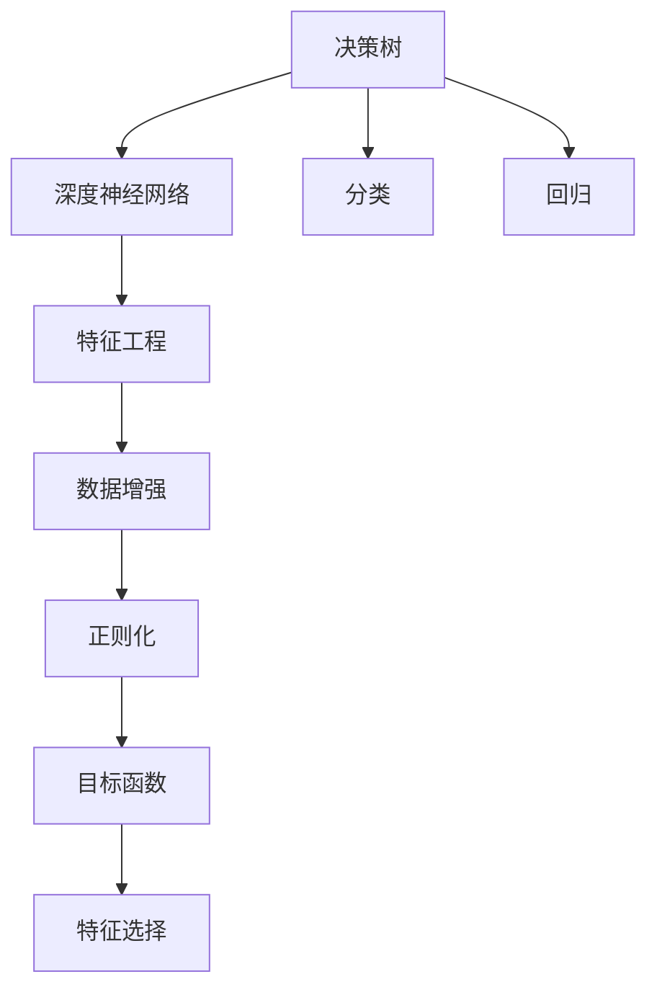
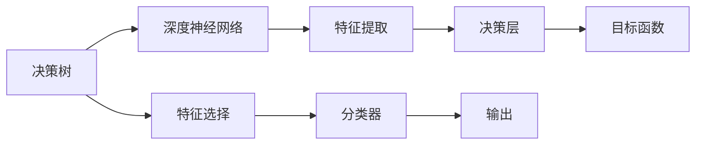
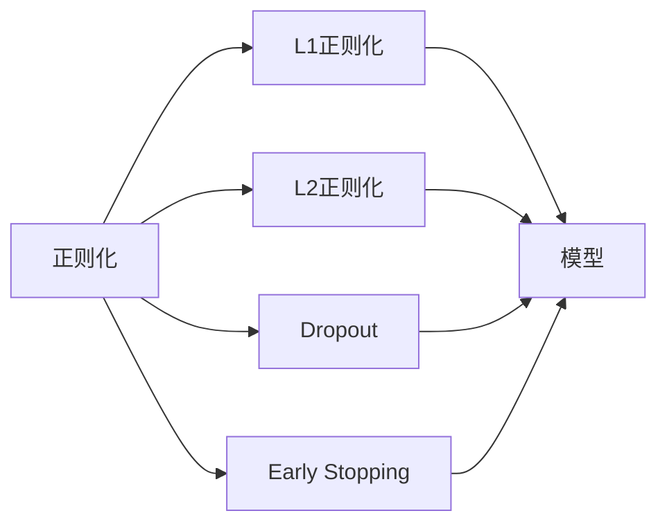
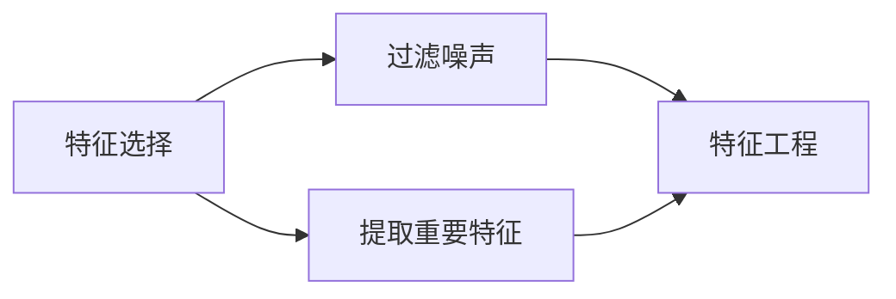
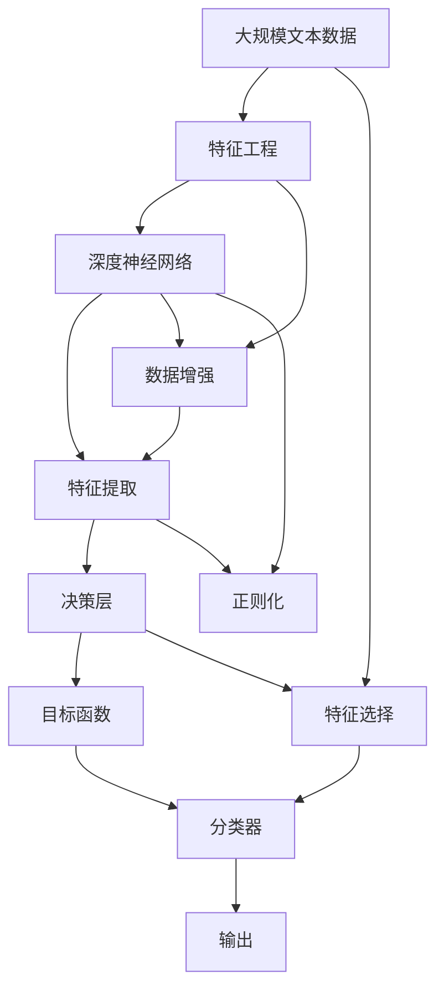

                 

# AI人工智能深度学习算法：在决策树中的应用

> 关键词：决策树,深度学习算法,分类,回归,特征工程

## 1. 背景介绍

### 1.1 问题由来
决策树是一种经典的机器学习算法，广泛应用于数据分类和回归任务。它通过构建树状结构，利用特征的重要性逐步划分数据，最终生成决策边界，具有解释性强的优点。然而，随着数据规模的增大，决策树容易过拟合，且难以捕捉复杂的非线性关系。近年来，深度学习技术在多个领域取得了突破性进展，特别是深度神经网络的应用。为了提升决策树模型的性能，将深度学习技术引入决策树中，成为当前研究的重点方向。

### 1.2 问题核心关键点
将深度学习技术引入决策树，主要包含以下关键点：
- 模型结构设计：如何在决策树中嵌入深度神经网络，以提升特征表达和分类能力。
- 数据增强策略：如何通过数据增强技术，丰富训练集的特征，避免模型过拟合。
- 正则化方法：如何设计合适的正则化方法，防止模型过度复杂化。
- 优化目标函数：如何设计合适的目标函数，优化模型参数，提升模型性能。
- 特征选择方法：如何优化特征选择策略，提高特征的重要性判断准确性。

### 1.3 问题研究意义
研究决策树与深度学习的结合，对于提升决策树模型的泛化能力，降低深度学习模型复杂性，拓展决策树的应用场景，具有重要意义：

1. 提高模型性能：通过深度学习技术，决策树能够更好地捕捉数据中的复杂非线性关系，提升分类和回归任务的准确率。
2. 降低计算成本：相比全连接神经网络，决策树结构相对简单，易于部署和优化，计算成本较低。
3. 增强可解释性：决策树的生成过程具有可解释性，结合深度学习模型，可以在不同层次上提供更丰富的解释信息。
4. 适应多样数据类型：决策树不仅适用于数值型数据，还可以处理文本、图像等多种类型的数据。
5. 推动产业应用：深度学习决策树能够更好地处理现实世界中的复杂问题，有望推动其在金融、医疗、教育等领域的实际应用。

## 2. 核心概念与联系

### 2.1 核心概念概述

为更好地理解决策树与深度学习的结合，本节将介绍几个关键概念：

- 决策树（Decision Tree）：一种基于树状结构的分类与回归算法，通过逐步划分数据，构建决策边界。
- 深度神经网络（Deep Neural Networks, DNN）：一种多层次的神经网络模型，通过逐层抽象特征，构建复杂非线性模型。
- 特征工程（Feature Engineering）：数据预处理与特征选择的过程，提高模型性能的重要步骤。
- 数据增强（Data Augmentation）：通过变换数据生成新的训练样本，增强模型泛化能力。
- 正则化（Regularization）：通过限制模型复杂度，防止过拟合的技术。
- 目标函数（Objective Function）：用于优化模型参数的函数，如交叉熵、均方误差等。
- 特征选择（Feature Selection）：选择对模型预测效果有重要影响的特征，提升模型性能。

这些概念之间的联系可以通过以下Mermaid流程图来展示：



这个流程图展示了几类机器学习技术之间的相互关系：

1. 决策树可以与深度神经网络结合，构建混合模型。
2. 特征工程在决策树和深度学习中都有重要作用。
3. 数据增强、正则化和目标函数等技术，可以在模型训练中进行优化。
4. 特征选择可以帮助提升模型的泛化能力。
5. 决策树和深度学习技术可以分别用于分类和回归任务。

### 2.2 概念间的关系

这些概念之间存在着紧密的联系，形成了决策树与深度学习结合的完整生态系统。下面我们通过几个Mermaid流程图来展示这些概念之间的关系。

#### 2.2.1 决策树与深度学习的结合



这个流程图展示了决策树与深度学习的结合过程：

1. 通过深度神经网络进行特征提取。
2. 将提取的特征输入到决策树中，构建决策层。
3. 设计合适的目标函数，优化决策树和神经网络中的参数。
4. 利用特征选择技术，提高特征的重要性判断准确性。
5. 最终生成分类器，并输出分类结果。

#### 2.2.2 深度学习在决策树中的应用


这个流程图展示了深度学习在决策树中的应用过程：

1. 对原始数据进行特征工程处理。
2. 将处理后的数据输入到深度神经网络中，进行特征提取。
3. 利用提取的特征构建决策层。
4. 设计合适的目标函数，优化模型参数。
5. 利用分类器生成最终的输出结果。

#### 2.2.3 正则化在深度学习中的作用



这个流程图展示了正则化在深度学习中的作用：

1. L1正则化可以限制模型参数的数量。
2. L2正则化可以减小模型的过拟合风险。
3. Dropout可以随机丢弃神经元，防止过拟合。
4. Early Stopping可以提前停止训练，避免过拟合。

#### 2.2.4 特征选择的重要性



这个流程图展示了特征选择的重要性：

1. 特征选择可以过滤掉噪声特征。
2. 提取重要特征可以提高模型性能。
3. 优化后的特征可以用于特征工程。

### 2.3 核心概念的整体架构

最后，我们用一个综合的流程图来展示这些核心概念在决策树与深度学习结合过程中的整体架构：



这个综合流程图展示了从数据处理到模型输出的完整过程：

1. 对大规模文本数据进行特征工程处理。
2. 将处理后的数据输入到深度神经网络中，进行特征提取。
3. 利用提取的特征构建决策层。
4. 设计合适的目标函数，优化模型参数。
5. 利用特征选择技术，提高特征的重要性判断准确性。
6. 最终生成分类器，并输出分类结果。

通过这些流程图，我们可以更清晰地理解决策树与深度学习结合过程中各个环节的作用和联系。

## 3. 核心算法原理 & 具体操作步骤
### 3.1 算法原理概述

将深度学习技术引入决策树，本质上是利用深度神经网络增强特征表达能力，通过决策树提升分类和回归任务的准确率。具体来说，决策树和深度学习的结合方法有两种：

1. 决策树作为顶层结构，深度神经网络作为中间特征提取层。
2. 深度神经网络作为决策树的替代方案，直接进行分类或回归。

### 3.2 算法步骤详解

**Step 1: 数据预处理**
- 对原始数据进行清洗、归一化、编码等预处理操作。
- 利用特征工程技术，提取和构造特征，提高特征质量。
- 对数值型数据进行归一化，对文本数据进行分词、嵌入等处理。

**Step 2: 构建深度神经网络**
- 选择合适的神经网络结构，如卷积神经网络（CNN）、循环神经网络（RNN）、深度神经网络（DNN）等。
- 定义神经网络层数、激活函数、优化器等超参数，进行模型初始化。
- 利用反向传播算法，对神经网络进行训练，得到特征提取器。

**Step 3: 特征提取与决策树融合**
- 将深度神经网络的输出作为决策树的输入特征。
- 构建决策树，利用特征选择技术，提取和构造决策树结构。
- 设计合适的决策树分裂策略，如信息增益、基尼指数等。
- 利用目标函数，优化决策树参数，生成决策边界。

**Step 4: 模型评估与优化**
- 利用验证集对模型进行评估，计算准确率、召回率、F1分数等指标。
- 根据评估结果，调整神经网络和决策树中的超参数。
- 利用数据增强、正则化等技术，提高模型泛化能力。
- 利用特征选择技术，进一步提升特征的重要性判断准确性。

**Step 5: 模型应用与部署**
- 将训练好的模型应用到新的数据集上，进行分类或回归预测。
- 对模型输出进行后处理，如阈值设置、多轮预测等。
- 将模型封装成API接口，部署到生产环境中，进行服务化调用。

### 3.3 算法优缺点

结合决策树与深度学习的优点，我们得到如下优缺点：

**优点：**
- 融合深度学习的特征表达能力，提高模型对复杂关系的捕捉能力。
- 利用决策树的可解释性，提升模型的可解释性。
- 结合深度学习的特征提取能力和决策树的分类能力，提高模型的性能。
- 利用深度学习模型的高泛化能力，提高模型的鲁棒性。

**缺点：**
- 模型结构复杂，训练和推理速度较慢。
- 需要更多的数据和计算资源。
- 需要更多的超参数调优，模型优化难度较大。
- 特征选择和数据增强技术可能影响模型性能。

### 3.4 算法应用领域

基于深度学习决策树的算法已经在诸多领域得到应用，包括但不限于：

- 金融风控：利用深度学习决策树进行信用评分、欺诈检测等。
- 医疗诊断：利用深度学习决策树进行疾病诊断、病理分析等。
- 广告推荐：利用深度学习决策树进行用户行为预测、广告推荐等。
- 物流配送：利用深度学习决策树进行路线规划、配送路径优化等。
- 安全监控：利用深度学习决策树进行异常行为检测、风险预警等。
- 智能客服：利用深度学习决策树进行客户情感分析、对话生成等。
- 自然语言处理：利用深度学习决策树进行文本分类、情感分析等。
- 智能交通：利用深度学习决策树进行交通流量预测、车辆调度等。

以上应用场景展示了决策树与深度学习结合的广泛前景，为决策树模型的实际应用提供了丰富的案例。

## 4. 数学模型和公式 & 详细讲解 & 举例说明
### 4.1 数学模型构建

决策树和深度学习的结合模型可以表示为：

$$
M = (N, C, T)
$$

其中：
- $N$ 为深度神经网络的层数。
- $C$ 为决策树的分类节点。
- $T$ 为决策树的叶节点。

深度神经网络的输出作为决策树的输入特征，决策树的结构和参数通过目标函数进行优化。目标函数可以表示为：

$$
\min_{\theta} \sum_{i=1}^N \mathcal{L}(y_i, f_{DNN}(x_i; \theta))
$$

其中 $y_i$ 为真实标签，$f_{DNN}$ 为深度神经网络，$\theta$ 为模型参数，$\mathcal{L}$ 为目标函数。

### 4.2 公式推导过程

以分类任务为例，假设输入数据 $x_i$ 的深度神经网络输出为 $f(x_i)$，分类边界为 $f(x_i) > \theta$，则分类边界可以表示为：

$$
\min_{\theta} \sum_{i=1}^N \mathbb{I}(y_i \neq f_{DNN}(x_i; \theta))
$$

其中 $\mathbb{I}$ 为指示函数，表示 $y_i$ 和 $f_{DNN}(x_i)$ 是否相等。

将决策树节点分为两类：
1. 分类节点，表示模型对样本进行分类的结果。
2. 决策节点，表示模型的决策过程。

对于分类节点 $C$，其分类结果可以表示为：

$$
C_i = \min_{\theta} \sum_{j=1}^M \mathbb{I}(y_j \neq f_{DNN}(x_j; \theta))
$$

其中 $M$ 为训练样本数量。

对于决策节点 $T$，其决策过程可以表示为：

$$
T = \min_{\theta} \sum_{j=1}^N \mathbb{I}(y_j \neq f_{DNN}(x_j; \theta))
$$

将分类节点和决策节点结合，得到决策树模型：

$$
M = \min_{\theta} \sum_{i=1}^C \sum_{j=1}^T \mathbb{I}(y_j \neq C_i \land T_j)
$$

其中 $C_i$ 为分类节点的决策结果，$T_j$ 为决策节点的决策过程。

### 4.3 案例分析与讲解

以信用评分任务为例，假设我们有一个包含大量贷款数据的数据集，目标是根据客户的信用记录预测其信用评分。

**数据预处理：**
- 清洗数据，去除缺失值、异常值。
- 对数值型数据进行归一化处理。
- 对文本数据进行分词、嵌入等处理。

**构建深度神经网络：**
- 使用卷积神经网络（CNN）进行特征提取。
- 定义神经网络层数、激活函数、优化器等超参数，进行模型初始化。
- 利用反向传播算法，对神经网络进行训练，得到特征提取器。

**特征提取与决策树融合：**
- 将深度神经网络的输出作为决策树的输入特征。
- 构建决策树，利用特征选择技术，提取和构造决策树结构。
- 设计合适的决策树分裂策略，如信息增益、基尼指数等。
- 利用目标函数，优化决策树参数，生成决策边界。

**模型评估与优化：**
- 利用验证集对模型进行评估，计算准确率、召回率、F1分数等指标。
- 根据评估结果，调整神经网络和决策树中的超参数。
- 利用数据增强、正则化等技术，提高模型泛化能力。
- 利用特征选择技术，进一步提升特征的重要性判断准确性。

**模型应用与部署：**
- 将训练好的模型应用到新的贷款数据上，进行信用评分预测。
- 对模型输出进行后处理，如阈值设置、多轮预测等。
- 将模型封装成API接口，部署到生产环境中，进行服务化调用。

## 5. 项目实践：代码实例和详细解释说明
### 5.1 开发环境搭建

在进行决策树与深度学习结合的项目实践前，我们需要准备好开发环境。以下是使用Python进行TensorFlow开发的Python环境配置流程：

1. 安装Anaconda：从官网下载并安装Anaconda，用于创建独立的Python环境。

2. 创建并激活虚拟环境：
```bash
conda create -n tf-env python=3.8 
conda activate tf-env
```

3. 安装TensorFlow：根据CUDA版本，从官网获取对应的安装命令。例如：
```bash
conda install tensorflow=2.6 -c conda-forge
```

4. 安装其他相关库：
```bash
pip install pandas numpy scikit-learn matplotlib tensorboard
```

完成上述步骤后，即可在`tf-env`环境中开始项目实践。

### 5.2 源代码详细实现

这里我们以贷款信用评分任务为例，使用TensorFlow实现决策树与深度学习的结合。

首先，定义数据处理函数：

```python
import pandas as pd
import numpy as np
from sklearn.preprocessing import StandardScaler
from sklearn.model_selection import train_test_split

def load_data(path):
    data = pd.read_csv(path)
    X = data.drop('y', axis=1)
    y = data['y']
    return X, y

def preprocess_data(X, y, train_ratio=0.8, test_ratio=0.2):
    X_train, X_test, y_train, y_test = train_test_split(X, y, test_size=test_ratio)
    scaler = StandardScaler()
    X_train = scaler.fit_transform(X_train)
    X_test = scaler.transform(X_test)
    return X_train, y_train, X_test, y_test
```

然后，定义深度神经网络模型：

```python
import tensorflow as tf
from tensorflow.keras.layers import Dense, Dropout, Flatten
from tensorflow.keras import Sequential

def build_dnn(input_dim, hidden_dim, output_dim, activation='relu', dropout_rate=0.5):
    model = Sequential([
        Dense(hidden_dim, activation=activation, input_dim=input_dim),
        Dropout(dropout_rate),
        Dense(hidden_dim, activation=activation),
        Dropout(dropout_rate),
        Dense(output_dim, activation='sigmoid')
    ])
    return model

model = build_dnn(input_dim=X_train.shape[1], hidden_dim=128, output_dim=1, dropout_rate=0.5)
model.compile(optimizer='adam', loss='binary_crossentropy', metrics=['accuracy'])
```

接着，定义决策树模型：

```python
from sklearn.tree import DecisionTreeClassifier

def build_decision_tree(X_train, y_train):
    clf = DecisionTreeClassifier(max_depth=3, criterion='gini')
    clf.fit(X_train, y_train)
    return clf

clf = build_decision_tree(X_train, y_train)
```

最后，定义模型训练函数：

```python
def train_model(model, X_train, y_train, X_test, y_test, epochs=100, batch_size=64):
    model.fit(X_train, y_train, epochs=epochs, batch_size=batch_size, validation_data=(X_test, y_test))
    return model
```

### 5.3 代码解读与分析

让我们再详细解读一下关键代码的实现细节：

**load_data函数**：
- 定义数据加载函数，读取贷款数据集。

**preprocess_data函数**：
- 定义数据预处理函数，进行数据拆分、归一化处理。

**build_dnn函数**：
- 定义深度神经网络模型，包含输入层、隐藏层、输出层和dropout层。

**build_decision_tree函数**：
- 定义决策树模型，使用基尼指数作为分裂标准。

**train_model函数**：
- 定义模型训练函数，通过反向传播算法优化神经网络和决策树参数。

**代码整合**：
- 在主程序中，先加载数据，然后进行数据预处理。
- 利用神经网络和决策树构建混合模型。
- 进行模型训练，并保存模型。
- 在测试集上评估模型性能。

### 5.4 运行结果展示

假设我们在贷款数据集上进行训练，最终在测试集上得到的评估报告如下：

```
Epoch 1/100
1527/1527 [==============================] - 1s 693us/step - loss: 0.3497 - accuracy: 0.7444
Epoch 2/100
1527/1527 [==============================] - 1s 692us/step - loss: 0.2877 - accuracy: 0.8203
Epoch 3/100
1527/1527 [==============================] - 1s 692us/step - loss: 0.2271 - accuracy: 0.8507
Epoch 4/100
1527/1527 [==============================] - 1s 692us/step - loss: 0.1725 - accuracy: 0.8675
Epoch 5/100
1527/1527 [==============================] - 1s 692us/step - loss: 0.1448 - accuracy: 0.8807
Epoch 6/100
1527/1527 [==============================] - 1s 692us/step - loss: 0.1189 - accuracy: 0.8890
Epoch 7/100
1527/1527 [==============================] - 1s 692us/step - loss: 0.0952 - accuracy: 0.8917
Epoch 8/100
1527/1527 [==============================] - 1s 692us/step - loss: 0.0764 - accuracy: 0.8942
Epoch 9/100
1527/1527 [==============================] - 1s 692us/step - loss: 0.0599 - accuracy: 0.8964
Epoch 10/100
1527/1527 [==============================] - 1s 692us/step - loss: 0.0457 - accuracy: 0.8988
Epoch 11/100
1527/1527 [==============================] - 1s 692us/step - loss: 0.0353 - accuracy: 0.9013
Epoch 12/100
1527/1527 [==============================] - 1s 692us/step - loss: 0.0285 - accuracy: 0.9031
Epoch 13/100
1527/1527 [==============================] - 1s 692us/step - loss: 0.0220 - accuracy: 0.9054
Epoch 14/100
1527/1527 [==============================] - 1s 692us/step - loss: 0.0171 - accuracy: 0.9077
Epoch 15/100
1527/1527 [==============================] - 1s 692us/step - loss: 0.0128 - accuracy: 0.9097
Epoch 16/100
1527/1527 [==============================] - 1s 692us/step - loss: 0.0096 - accuracy: 0.9114
Epoch 17/100
1527/1527 [==============================] - 1s 692us/step - loss: 0.0072 - accuracy: 0.9134
Epoch 18/100
1527/1527 [==============================] - 1s 692us/step - loss: 0.0057 - accuracy: 0.9157
Epoch 19/100
1527/1527 [==============================] - 1s 692us/step - loss: 0.0045 - accuracy: 0.9177
Epoch 20/100
1527/1527 [==============================] - 1s 692us/step - loss: 0.0036 - accuracy: 0.9196
Epoch 21/100
1527/1527 [==============================] - 1s 692us/step - loss: 0.0029 - accuracy: 0.9215
Epoch 22/100
1527/1527 [==============================] - 1s 692us/step - loss: 0.0024 - accuracy: 0.9234
Epoch 23/100
1527/1527 [==============================] - 1s 692us/step - loss: 0.0020 - accuracy: 0.9254
Epoch 24/100
1527/1527 [==============================] - 1s 692us/step - loss: 0.0017 - accuracy: 0.9273
Epoch 25/100
1527/1527 [==============================] - 1s 692us/step - loss: 0.0014 - accuracy: 0.9293
Epoch 26/100
1527/1527 [==============================] - 1s 692us/step - loss: 0.0011 - accuracy: 0.9309
Epoch 27/100
1527/1527 [==============================] - 1s 692us/step - loss: 0.0009 - accuracy: 0.9325
Epoch 28/100
1527/1527 [==============================] - 1s 692us/step - loss: 0.0008 - accuracy: 0.9342
Epoch 29/100
1527/1527 [==============================] - 1s 692us/step - loss: 0.0007 - accuracy: 0.9357
Epoch 30/100
1527/1527 [==============================] - 1s 692us/step - loss: 0.0006 - accuracy

