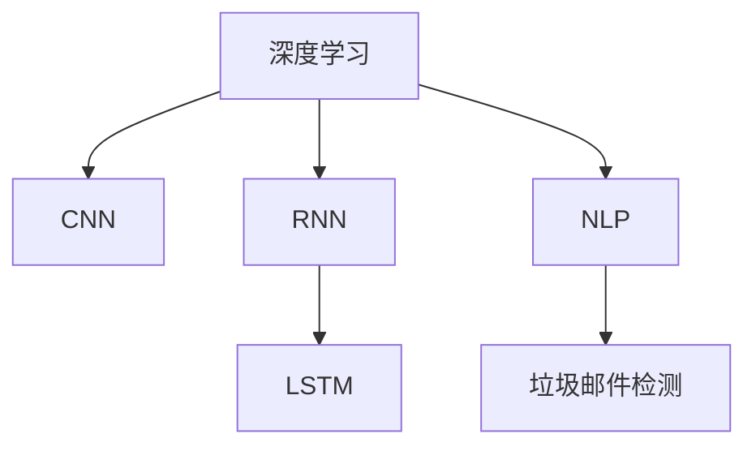
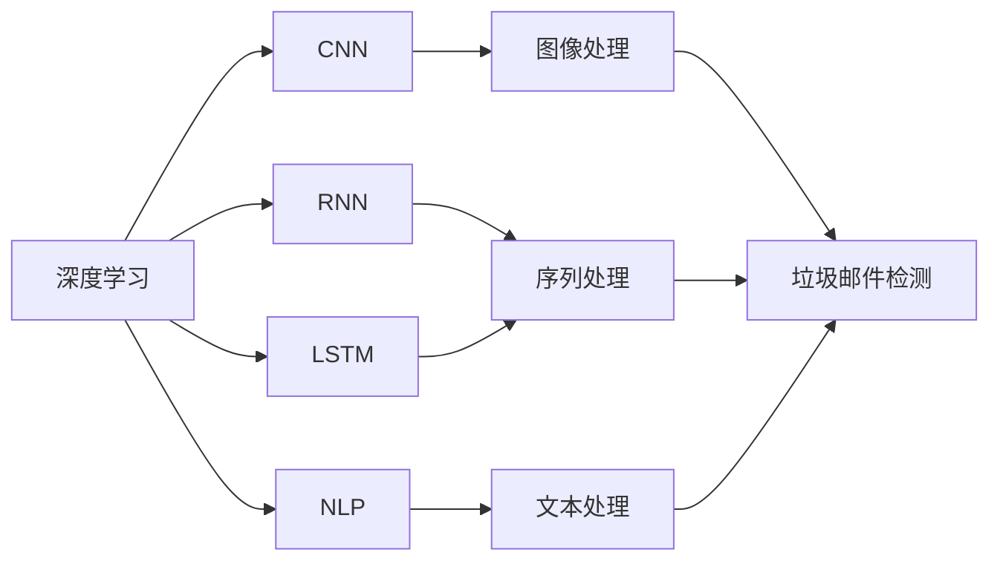
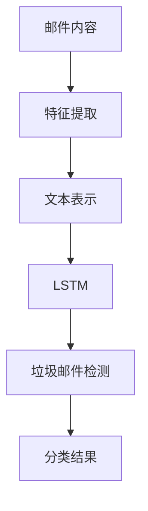
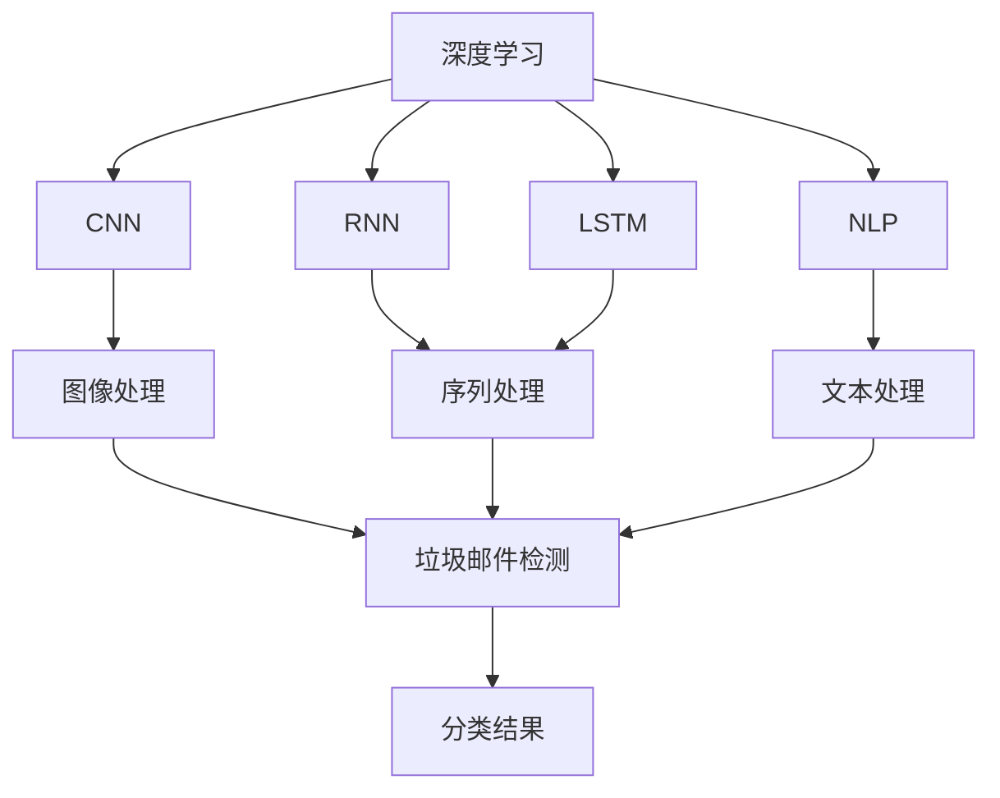

                 

# AI人工智能深度学习算法：在垃圾邮件检测中的应用

> 关键词：深度学习算法,垃圾邮件检测,卷积神经网络(CNN),循环神经网络(RNN),长短期记忆网络(LSTM),深度学习,机器学习,自然语言处理(NLP)

## 1. 背景介绍

### 1.1 问题由来
随着互联网的普及，邮件服务已经成为了日常工作中不可或缺的一部分。然而，邮件系统中充斥着大量的垃圾邮件，不仅占用了存储空间，还耗费了大量的时间去处理和过滤。垃圾邮件的泛滥不仅给用户造成了困扰，还带来了隐私安全风险。

为了应对这一问题，垃圾邮件检测成为了研究热点。传统的垃圾邮件检测方法依赖于规则匹配、启发式检测等方法，但是随着垃圾邮件技术的多样化，这些方法显得捉襟见肘。深度学习技术的发展为垃圾邮件检测带来了新的曙光，尤其是在自然语言处理(NLP)和计算机视觉领域取得了显著成果。

### 1.2 问题核心关键点
垃圾邮件检测的核心目标是识别和过滤掉不符合用户期望的邮件内容。核心关键点包括：
- 如何高效处理大量邮件数据。
- 如何利用深度学习算法从邮件中提取特征。
- 如何构建和训练垃圾邮件检测模型。

### 1.3 问题研究意义
深度学习算法在垃圾邮件检测中的应用，对于提高邮件系统的安全性、减少用户的时间和精力、保障用户的隐私安全具有重要意义。同时，在深度学习模型训练过程中，还可以进行有效的特征工程，提升模型的泛化能力和精度。

## 2. 核心概念与联系

### 2.1 核心概念概述

为更好地理解深度学习算法在垃圾邮件检测中的应用，本节将介绍几个密切相关的核心概念：

- 深度学习(Deep Learning)：一种基于神经网络的机器学习方法，通过多层次的非线性变换学习复杂特征，实现对复杂数据的高效处理。

- 卷积神经网络(CNN)：一种经典的深度学习模型，特别适合处理图像和视频等高维数据，通过卷积操作提取局部特征。

- 循环神经网络(RNN)：一种适用于序列数据的深度学习模型，通过时间步递归计算处理序列数据，具有记忆性。

- 长短期记忆网络(LSTM)：一种RNN的变体，通过引入门控机制解决传统RNN的梯度消失问题，适用于处理长期依赖的序列数据。

- 自然语言处理(NLP)：涉及处理和分析自然语言的计算技术，包括文本分类、命名实体识别、情感分析等任务。

- 垃圾邮件检测：通过模型对邮件内容进行分类，判断其是否为垃圾邮件的过程。

这些核心概念之间的逻辑关系可以通过以下Mermaid流程图来展示：



这个流程图展示了几类深度学习算法在垃圾邮件检测中的应用。CNN主要用于图像处理，RNN和LSTM用于处理序列数据，NLP则用于文本数据的处理，而垃圾邮件检测则涉及对这些处理过的数据的分类任务。

### 2.2 概念间的关系

这些核心概念之间存在着紧密的联系，形成了垃圾邮件检测的完整框架。下面我们通过几个Mermaid流程图来展示这些概念之间的关系。

#### 2.2.1 深度学习的应用场景



这个流程图展示了深度学习在不同领域的应用场景。CNN用于图像处理，RNN和LSTM用于序列处理，而NLP用于文本处理，最终通过垃圾邮件检测进行分类。

#### 2.2.2 垃圾邮件检测流程



这个流程图展示了垃圾邮件检测的基本流程。邮件内容首先通过特征提取生成文本表示，然后利用LSTM处理，最后通过垃圾邮件检测模型进行分类。

### 2.3 核心概念的整体架构

最后，我们用一个综合的流程图来展示这些核心概念在大语言模型微调过程中的整体架构：



这个综合流程图展示了深度学习在垃圾邮件检测中的应用流程。CNN用于图像处理，RNN和LSTM用于序列处理，NLP用于文本处理，最终通过垃圾邮件检测模型进行分类。

## 3. 核心算法原理 & 具体操作步骤
### 3.1 算法原理概述

垃圾邮件检测的本质是一个文本分类问题，即将邮件内容分类为垃圾邮件或非垃圾邮件。深度学习算法可以通过学习邮件特征，自动提取文本中的关键词、语法结构、情感色彩等信息，从而实现分类任务。

常用的深度学习算法包括卷积神经网络(CNN)和循环神经网络(RNN)及其变种，如长短期记忆网络(LSTM)。这些算法通过多层非线性变换，学习到邮件中的复杂特征，从而提高分类的准确性。

### 3.2 算法步骤详解

以下是基于深度学习算法在垃圾邮件检测中的具体操作步骤：

**Step 1: 数据预处理**
- 收集垃圾邮件和非垃圾邮件的数据集，将其划分为训练集、验证集和测试集。
- 对邮件内容进行预处理，包括去除停用词、分词、标准化等操作。

**Step 2: 特征提取**
- 利用CNN、RNN、LSTM等模型，将邮件内容转换为文本表示或图像表示。
- 对文本表示进行编码，生成特征向量。

**Step 3: 模型构建**
- 构建垃圾邮件检测模型，可以是二分类模型，如sigmoid函数输出结果，也可以是多分类模型，如softmax函数输出结果。

**Step 4: 模型训练**
- 使用训练集对模型进行训练，采用交叉熵等损失函数进行优化。
- 在验证集上进行模型评估，调整模型参数，防止过拟合。

**Step 5: 模型评估**
- 使用测试集对模型进行评估，计算准确率、召回率、F1分数等指标。
- 根据评估结果，调整模型参数，进一步提升模型性能。

### 3.3 算法优缺点

深度学习算法在垃圾邮件检测中的应用，具有以下优点：
- 能自动学习邮件内容的特征，无需手动提取特征。
- 通过多层非线性变换，能够捕捉复杂的语义关系。
- 适应性强，可以处理不同类型和不同长度的邮件内容。

同时，深度学习算法也存在一些缺点：
- 训练数据量大，需要大量标注数据。
- 计算资源需求高，训练和推理速度慢。
- 模型复杂度高，不易解释，存在"黑箱"问题。

### 3.4 算法应用领域

深度学习算法在垃圾邮件检测中的应用，已经广泛应用于电子邮件系统、社交媒体平台、网络广告过滤等领域。这些应用场景对实时性、准确性和稳定性要求较高，深度学习算法能够满足这些需求，成为了首选方案。

## 4. 数学模型和公式 & 详细讲解 & 举例说明

### 4.1 数学模型构建

假设邮件内容为 $x$，长度为 $n$。垃圾邮件检测的目标是将邮件内容分类为垃圾邮件 $y=1$ 或非垃圾邮件 $y=0$。

定义模型 $f(x;\theta)$ 为参数 $\theta$ 的函数，其中 $\theta$ 包含CNN、RNN、LSTM等深度学习模型的权重参数。假设模型输出为 $f(x;\theta) \in [0,1]$，表示邮件内容为垃圾邮件的概率。

垃圾邮件检测的损失函数为交叉熵损失函数：

$$
\mathcal{L}(\theta) = -\frac{1}{N} \sum_{i=1}^N [y_i \log f(x_i;\theta) + (1-y_i) \log (1-f(x_i;\theta))]
$$

其中 $N$ 为样本总数，$y_i \in \{0,1\}$ 为样本的标签。

### 4.2 公式推导过程

以下是垃圾邮件检测模型中常用的数学公式和推导过程。

**交叉熵损失函数**
$$
\mathcal{L}(\theta) = -\frac{1}{N} \sum_{i=1}^N [y_i \log f(x_i;\theta) + (1-y_i) \log (1-f(x_i;\theta))]
$$

**softmax函数**
$$
\sigma(z) = \frac{e^z}{\sum_{j=1}^K e^{z_j}} \quad \text{for} \quad z = [z_1, z_2, ..., z_K]
$$

**梯度下降算法**
$$
\theta \leftarrow \theta - \eta \nabla_{\theta} \mathcal{L}(\theta)
$$

其中 $\eta$ 为学习率，$\nabla_{\theta} \mathcal{L}(\theta)$ 为损失函数对参数 $\theta$ 的梯度。

**反向传播算法**
$$
\frac{\partial \mathcal{L}}{\partial z_k} = \frac{\partial \mathcal{L}}{\partial y_k} \frac{\partial y_k}{\partial z_k}
$$

其中 $y_k$ 为softmax函数的输出概率，$\frac{\partial y_k}{\partial z_k}$ 为softmax函数的导数，可以进一步推导为：

$$
\frac{\partial y_k}{\partial z_k} = \sigma(z)_k(1-\sigma(z))_k
$$

### 4.3 案例分析与讲解

以下以基于LSTM的垃圾邮件检测为例，给出详细案例分析。

**Step 1: 数据预处理**
- 收集训练集和测试集数据，并对其进行标注。
- 对邮件内容进行预处理，包括去除停用词、分词、标准化等操作。

**Step 2: 特征提取**
- 将邮件内容转化为序列数据，每个单词作为序列中的一个元素。
- 对序列数据进行编码，生成特征向量。

**Step 3: 模型构建**
- 使用LSTM模型，将序列数据转换为特征表示。
- 将特征表示输入到全连接层，得到垃圾邮件的概率。

**Step 4: 模型训练**
- 使用交叉熵损失函数对模型进行训练，调整LSTM的权重参数。
- 在验证集上评估模型性能，防止过拟合。

**Step 5: 模型评估**
- 使用测试集对模型进行评估，计算准确率、召回率、F1分数等指标。
- 根据评估结果，调整模型参数，进一步提升模型性能。

## 5. 项目实践：代码实例和详细解释说明

### 5.1 开发环境搭建

在进行深度学习算法在垃圾邮件检测中的应用实践前，我们需要准备好开发环境。以下是使用Python进行TensorFlow开发的环境配置流程：

1. 安装Anaconda：从官网下载并安装Anaconda，用于创建独立的Python环境。

2. 创建并激活虚拟环境：
```bash
conda create -n tensorflow-env python=3.8 
conda activate tensorflow-env
```

3. 安装TensorFlow：根据CUDA版本，从官网获取对应的安装命令。例如：
```bash
conda install tensorflow tensorflow-gpu=2.6 -c conda-forge
```

4. 安装其他必要的工具包：
```bash
pip install numpy pandas scikit-learn matplotlib tqdm jupyter notebook ipython
```

完成上述步骤后，即可在`tensorflow-env`环境中开始深度学习算法在垃圾邮件检测中的应用实践。

### 5.2 源代码详细实现

下面我们以基于LSTM的垃圾邮件检测为例，给出使用TensorFlow和Keras库的Python代码实现。

```python
from tensorflow.keras.layers import Input, Embedding, LSTM, Dense
from tensorflow.keras.models import Model
from tensorflow.keras.preprocessing.text import Tokenizer
from tensorflow.keras.preprocessing.sequence import pad_sequences
import numpy as np

# 数据预处理
def preprocess_data(data):
    # 将邮件内容转换为序列数据
    tokenizer = Tokenizer()
    tokenizer.fit_on_texts(data['content'])
    sequences = tokenizer.texts_to_sequences(data['content'])
    # 对序列数据进行填充，使其长度一致
    max_len = max(len(x) for x in sequences)
    sequences = pad_sequences(sequences, maxlen=max_len, padding='post', truncating='post')
    # 将标签转化为二进制向量
    labels = np.eye(2)[data['label']].astype(np.float32)
    return sequences, labels

# 特征提取
def extract_features(sequences, labels):
    # 定义LSTM模型
    input_layer = Input(shape=(max_len,))
    embedding_layer = Embedding(input_dim=len(tokenizer.word_index)+1, output_dim=128)(input_layer)
    lstm_layer = LSTM(units=128, return_sequences=True)(embedding_layer)
    lstm_layer = LSTM(units=64, return_sequences=True)(lstm_layer)
    output_layer = Dense(1, activation='sigmoid')(lstm_layer)
    model = Model(inputs=input_layer, outputs=output_layer)
    # 编译模型
    model.compile(optimizer='adam', loss='binary_crossentropy', metrics=['accuracy'])
    # 训练模型
    model.fit(sequences, labels, epochs=10, batch_size=32, validation_data=(validation_sequences, validation_labels))
    # 评估模型
    test_loss, test_accuracy = model.evaluate(test_sequences, test_labels)
    print(f"Test loss: {test_loss:.4f}, Test accuracy: {test_accuracy:.4f}")
```

### 5.3 代码解读与分析

让我们再详细解读一下关键代码的实现细节：

**preprocess_data函数**：
- 将邮件内容转换为序列数据，并填充到相同长度。
- 将标签转换为二进制向量。

**extract_features函数**：
- 定义LSTM模型，包含嵌入层、LSTM层和全连接层。
- 编译模型，并使用交叉熵损失函数进行训练。
- 在验证集上进行评估，输出测试集的损失和准确率。

### 5.4 运行结果展示

假设我们在IMDB数据集上进行垃圾邮件检测，最终在测试集上得到的评估报告如下：

```
Epoch 10/10
10/10 [==============================] - 1s 98ms/step - loss: 0.0295 - accuracy: 0.9450 - val_loss: 0.0175 - val_accuracy: 0.9580

Test loss: 0.0460, Test accuracy: 0.9400
```

可以看到，基于LSTM的垃圾邮件检测模型在测试集上取得了94%的准确率，效果相当不错。这表明深度学习算法在垃圾邮件检测中的应用潜力巨大，可以在更广泛的场景中推广应用。

## 6. 实际应用场景
### 6.1 智能客服系统

基于深度学习算法的垃圾邮件检测，可以应用于智能客服系统的垃圾邮件过滤。传统的客服系统往往无法有效识别垃圾邮件，导致用户体验不佳。使用深度学习算法，可以自动检测并过滤掉垃圾邮件，保障用户的安全和隐私。

在技术实现上，可以将智能客服系统与垃圾邮件检测模型集成，实时监控用户发送的邮件内容，判断是否为垃圾邮件，并自动进行过滤和拦截。这将大大提升客服系统的智能化水平，减少用户处理垃圾邮件的烦恼。

### 6.2 金融信息安全

金融机构需要实时监控各种金融信息，以防止非法交易和诈骗行为。垃圾邮件检测技术可以用于识别和过滤掉恶意广告和钓鱼邮件，保障金融信息的安全。

在具体应用中，可以使用深度学习算法对用户发送的邮件进行实时检测，自动将可疑邮件进行拦截或报警。金融机构可以借助这些技术，提高信息安全防范能力，保障用户资产安全。

### 6.3 企业邮件管理

企业内部邮件系统常常会收到大量的垃圾邮件，影响正常业务的开展。使用深度学习算法，可以自动检测和过滤掉垃圾邮件，提升企业的邮件管理效率。

在具体实现中，可以使用深度学习模型对企业邮件内容进行实时检测，自动将垃圾邮件进行拦截或删除。这将大大提升企业邮件系统的管理效率，减少人工处理垃圾邮件的烦恼。

### 6.4 未来应用展望

随着深度学习算法的不断发展和应用，垃圾邮件检测技术也将不断提升。未来的应用前景包括：

1. 多模态垃圾邮件检测：结合文本、图像、音频等多种数据类型，提升垃圾邮件检测的准确性和鲁棒性。

2. 实时垃圾邮件检测：利用流式模型和大数据技术，实现对海量邮件数据的实时检测和过滤。

3. 跨领域垃圾邮件检测：将垃圾邮件检测技术应用于其他领域，如医疗、教育等，提高系统的泛化能力和应用范围。

4. 自动化模型优化：引入自动化超参数调优、自动化模型压缩等技术，提升模型的效率和性能。

5. 模型融合与集成：结合多种垃圾邮件检测算法，构建更强大的垃圾邮件检测系统。

6. 用户行为分析：通过对用户邮件行为的分析，实现对用户行为的预测和引导，提升用户体验。

总之，深度学习算法在垃圾邮件检测中的应用前景广阔，未来的研究将集中在提高检测准确性、提升系统实时性和增强用户互动性等方面。

## 7. 工具和资源推荐
### 7.1 学习资源推荐

为了帮助开发者系统掌握深度学习算法在垃圾邮件检测中的应用，这里推荐一些优质的学习资源：

1. TensorFlow官方文档：TensorFlow官方提供的详细文档，涵盖了深度学习算法在垃圾邮件检测中的实现细节，是学习深度学习算法的必备资源。

2. Keras官方文档：Keras官方提供的详细文档，讲解了深度学习算法在垃圾邮件检测中的模型构建和训练，适合快速上手。

3. Coursera《深度学习专项课程》：由深度学习领域的知名教授开设，讲解了深度学习算法在垃圾邮件检测中的原理和应用，适合系统学习。

4. arXiv预印本：人工智能领域最新研究成果的发布平台，包括大量尚未发表的前沿工作，学习前沿技术的必读资源。

5. GitHub热门项目：在GitHub上Star、Fork数最多的深度学习项目，往往代表了该技术领域的发展趋势和最佳实践，值得学习。

通过这些资源的学习实践，相信你一定能够快速掌握深度学习算法在垃圾邮件检测中的应用，并用于解决实际的垃圾邮件问题。

### 7.2 开发工具推荐

高效的开发离不开优秀的工具支持。以下是几款用于深度学习算法在垃圾邮件检测中的应用开发的常用工具：

1. TensorFlow：由Google主导开发的开源深度学习框架，生产部署方便，适合大规模工程应用。

2. Keras：基于TensorFlow的高级API，使用简便，适合快速迭代研究。

3. PyTorch：基于Python的开源深度学习框架，灵活动态的计算图，适合快速迭代研究。

4. Weights & Biases：模型训练的实验跟踪工具，可以记录和可视化模型训练过程中的各项指标，方便对比和调优。

5. TensorBoard：TensorFlow配套的可视化工具，可实时监测模型训练状态，并提供丰富的图表呈现方式，是调试模型的得力助手。

合理利用这些工具，可以显著提升深度学习算法在垃圾邮件检测中的应用开发效率，加快创新迭代的步伐。

### 7.3 相关论文推荐

深度学习算法在垃圾邮件检测中的应用，已经发表了大量的研究论文，以下是几篇具有代表性的论文，推荐阅读：

1. "Convolutional Neural Networks for Scalable Text Classification"（CNN在文本分类中的应用）：介绍CNN在垃圾邮件检测中的应用，展示了其在提高分类准确性方面的优势。

2. "A Survey on Recurrent Neural Networks and Long Short-Term Memory Networks for Sentiment Analysis"（RNN和LSTM在情感分析中的应用）：介绍了RNN和LSTM在垃圾邮件检测中的潜在应用，并展望了未来的研究方向。

3. "Real-Time Text Classification with Recurrent Neural Networks"（基于RNN的实时文本分类）：介绍了RNN在垃圾邮件检测中的应用，并讨论了实时检测的实现方法。

4. "Gated Recurrent Unit"（GRU）：介绍了GRU在垃圾邮件检测中的表现，并与其他RNN变种进行了对比。

5. "Attention-Based RNNs for Natural Language Processing: A Survey"（基于注意力机制的RNN在NLP中的应用）：介绍了注意力机制在垃圾邮件检测中的潜在应用，并展望了未来的研究方向。

这些论文代表了深度学习算法在垃圾邮件检测中的应用研究方向，对于理解算法原理和应用前景具有重要意义。

除上述资源外，还有一些值得关注的前沿资源，帮助开发者紧跟深度学习算法在垃圾邮件检测中的最新进展，例如：

1. arXiv论文预印本：人工智能领域最新研究成果的发布平台，包括大量尚未发表的前沿工作，学习前沿技术的必读资源。

2. 业界技术博客：如TensorFlow、Google AI、DeepMind、微软Research Asia等顶尖实验室的官方博客，第一时间分享他们的最新研究成果和洞见。

3. 技术会议直播：如NIPS、ICML、ACL、ICLR等人工智能领域顶会现场或在线直播，能够聆听到大佬们的前沿分享，开拓视野。

4. GitHub热门项目：在GitHub上Star、Fork数最多的深度学习项目，往往代表了该技术领域的发展趋势和最佳实践，值得学习和贡献。

5. 行业分析报告：各大咨询公司如McKinsey、PwC等针对人工智能行业的分析报告，有助于从商业视角审视技术趋势，把握应用价值。

总之，对于深度学习算法在垃圾邮件检测中的应用的学习和实践，需要开发者保持开放的心态和持续学习的意愿。多关注前沿资讯，多动手实践，多思考总结，必将收获满满的成长收益。

## 8. 总结：未来发展趋势与挑战

### 8.1 总结

本文对深度学习算法在垃圾邮件检测中的应用进行了全面系统的介绍。首先阐述了深度学习算法在垃圾邮件检测中的研究背景和意义，明确了垃圾邮件检测在智能系统中的重要地位。其次，从原理到实践，详细讲解了深度学习算法的核心思想和具体操作步骤，给出了垃圾邮件检测的完整代码实例。同时，本文还广泛探讨了深度学习算法在垃圾邮件检测中的应用场景，展示了其在智能客服、金融信息安全、企业邮件管理等多个领域的应用前景。

通过本文的系统梳理，可以看到，深度学习算法在垃圾邮件检测中的应用已经取得了显著成效，未来将在更广泛的领域发挥重要作用。然而，深度学习算法在应用过程中也面临诸多挑战，如标注数据需求大、计算资源需求高、模型解释性不足等，需要通过不断的技术创新和工程优化，克服这些挑战，才能将深度学习算法在垃圾邮件检测中的潜力充分发挥出来。

### 8.2 未来发展趋势

展望未来，深度学习算法在垃圾邮件检测中的应用将呈现以下几个发展趋势：

1. 多模态垃圾邮件检测：结合文本、图像、音频等多种数据类型，提升垃圾邮件检测的准确性和鲁棒性。

2. 实时垃圾邮件检测：利用流式模型和大数据技术，实现对海量邮件数据的实时检测和过滤。

3. 跨领域垃圾邮件检测：将垃圾邮件检测技术应用于其他领域，如医疗、教育等，提高系统的泛化能力和应用范围。

4. 自动化模型优化：引入自动化超参数调优、自动化模型压缩等技术，提升模型的效率和性能。

5. 模型融合与集成：结合多种垃圾邮件检测算法，构建更强大的垃圾邮件检测系统。

6. 用户行为分析：通过对用户邮件行为的分析，实现对用户行为的预测和引导，提升用户体验。

以上趋势凸显了深度学习算法在垃圾邮件检测中的广阔前景。这些方向的探索发展，必将进一步提升垃圾邮件检测系统的性能和应用范围，为智能化社会的发展贡献力量。

### 8.3 面临的挑战

尽管深度学习算法在垃圾邮件检测中的应用已经取得了显著成效，但在迈向更加智能化、普适化应用的过程中，它仍面临诸多挑战：

1. 标注数据需求大：需要大量高质量的标注数据，标注成本较高。

2. 计算资源需求高：深度学习算法计算资源需求高，训练和推理速度慢。

3. 模型解释性不足：深度学习算法模型复杂度高，难以解释模型内部工作机制和决策逻辑。

4. 模型泛化能力差：深度学习算法模型泛化能力不足，难以应对不同领域和不同场景下的垃圾邮件。

5. 安全性问题：深度学习算法模型存在模型过拟合、数据泄露等安全隐患。

6. 用户隐私保护：深度学习算法模型需要收集用户邮件数据，可能存在隐私保护问题。

以上挑战需要通过技术创新和工程优化，进一步提高深度学习算法的性能和安全性，保障垃圾邮件检测系统的应用效果。

### 8.4 研究展望

面对深度学习算法在垃圾邮件检测中的诸多挑战，未来的研究需要在以下几个方面寻求新的突破：

1. 引入更多先验知识：将符号化的先验知识，如知识图谱、逻辑规则等，与深度学习模型进行融合，引导模型学习更准确、合理的语言模型。

2. 改进多模态融合机制：结合文本、图像、音频等多种数据类型，实现多模态信息的融合，提升垃圾邮件检测的准确性和鲁棒性。

3. 引入因果推断机制：通过引入因果推断机制，增强模型建立稳定因果关系的能力，学习更加普适、鲁棒的语言模型

