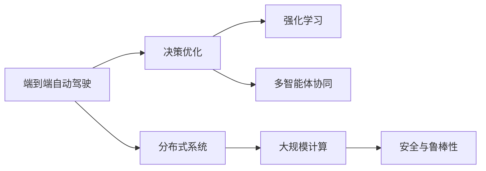
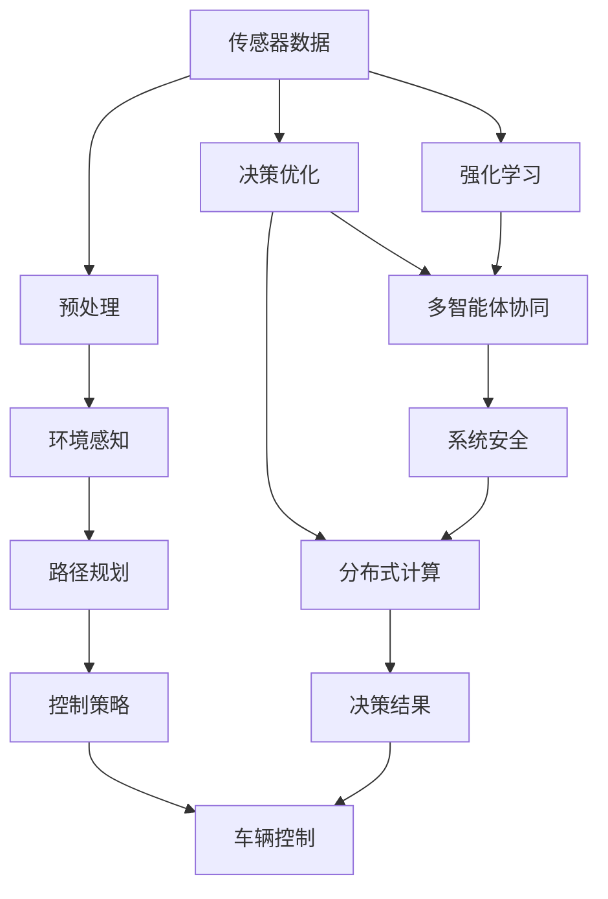

                 

# 端到端自动驾驶的分布式决策优化算法

> 关键词：
- 端到端自动驾驶
- 分布式系统
- 决策优化
- 强化学习
- 多智能体协同
- 安全与鲁棒性
- 大规模计算

## 1. 背景介绍

自动驾驶技术近年来取得长足进步，其关键在于融合感知、决策、控制三大核心环节。在过去的十年里，自动驾驶的发展经历了从基于规则的局部决策、基于模型的全局决策，到端到端学习决策的演进过程。但现有的端到端自动驾驶系统依然面临高计算成本、低运行效率、安全性不足等挑战，难以满足实际应用的需求。

## 2. 核心概念与联系

### 2.1 核心概念概述

在自动驾驶系统中，端到端学习决策优化算法涉及的核心概念包括：

- **端到端自动驾驶**：从传感器输入到车辆控制输出的全过程，均通过深度学习模型进行学习和优化。

- **分布式系统**：将计算任务分布在多个计算节点上，通过并行和协作处理大规模复杂问题。

- **决策优化**：在实时、不确定的环境中，自动驾驶系统需要动态调整行为策略，以最大化性能指标（如行驶安全、通行效率等）。

- **强化学习**：通过与环境互动，自动驾驶系统学习最优决策策略。

- **多智能体协同**：在复杂交互场景中，不同决策者之间需要协同优化，以实现整体最优。

- **安全与鲁棒性**：系统需要具备对异常情况的鲁棒性，避免因单点故障导致整体失效。

- **大规模计算**：端到端自动驾驶需要处理海量数据，需要高效的计算能力。

### 2.2 概念间的关系

为了更清晰地理解这些概念之间的联系，下面用几个Mermaid流程图来展示。



### 2.3 核心概念的整体架构

下面用一张更完整的流程图来展示端到端自动驾驶决策优化的整体架构：



这个流程图展示了端到端自动驾驶决策优化的完整流程，从传感器数据获取，到环境感知、路径规划、控制策略生成、车辆控制，最终形成决策结果。其中，决策优化、强化学习和多智能体协同等算法在系统中协同工作，实现整体最优。同时，分布式计算和系统安全也是系统运行的基础。

## 3. 核心算法原理 & 具体操作步骤
### 3.1 算法原理概述

端到端自动驾驶决策优化算法基于强化学习理论，通过构建模拟环境，模拟驾驶员与车辆交互的过程，使系统在多次迭代中学习最优决策策略。

其核心思想如下：

1. **模型构建**：将自动驾驶系统抽象为一个环境-动作-奖励模型，通过传感器数据感知环境，生成动作（如加速、转向、刹车等），获取环境对动作的反馈（如安全距离、目标位置等）。

2. **决策优化**：利用强化学习算法（如Q-learning、Deep Q Network等），在模拟环境中不断训练模型，优化决策策略，使得系统能够在真实环境中做出最优决策。

3. **多智能体协同**：在复杂交互场景中，不同的决策者（如前车、行人等）之间需要协同优化，避免冲突。通过多智能体协同算法（如纳什均衡、合作博弈等），优化各决策者的策略，实现整体最优。

### 3.2 算法步骤详解

#### 3.2.1 模型构建

1. **环境感知模型**：使用深度学习模型（如卷积神经网络CNN）对传感器数据进行预处理和特征提取，构建环境感知模型。
2. **决策模型**：使用神经网络模型（如RNN、LSTM等）生成动作序列，实现从感知到决策的映射。

#### 3.2.2 决策优化

1. **选择强化学习算法**：根据任务特点选择合适的强化学习算法，如Q-learning、Deep Q Network等。
2. **定义奖励函数**：设计合适的奖励函数，反映系统性能（如安全距离、速度、燃油效率等）。
3. **训练模型**：在模拟环境中，使用强化学习算法训练模型，优化决策策略。

#### 3.2.3 多智能体协同

1. **定义多智能体模型**：将其他车辆、行人等视为智能体，构建多智能体模型。
2. **选择协同算法**：如纳什均衡、合作博弈等。
3. **优化策略**：在模拟环境中，训练多智能体模型，优化各智能体的决策策略，实现整体最优。

### 3.3 算法优缺点

#### 3.3.1 算法优点

1. **端到端**：模型直接从传感器数据到车辆控制输出，减少了中间步骤，提高了决策效率。
2. **数据驱动**：通过数据驱动的方式学习最优策略，避免了传统规则方法的局限性。
3. **适应性强**：强化学习算法能够处理动态环境，适应复杂交互场景。
4. **可扩展性好**：分布式系统能够扩展计算能力，支持大规模复杂问题。

#### 3.3.2 算法缺点

1. **训练成本高**：需要大量的标注数据和计算资源，训练成本较高。
2. **模型复杂性高**：复杂的决策模型增加了系统复杂性，需要更高的技术门槛。
3. **鲁棒性不足**：强化学习算法易受数据噪声和环境变化的影响，鲁棒性有待提高。
4. **可解释性差**：强化学习模型通常为"黑盒"，难以解释决策过程。

### 3.4 算法应用领域

端到端自动驾驶决策优化算法已经广泛应用于智能交通、自动驾驶汽车、无人机等领域。例如：

- **智能交通系统**：在交通信号控制、道路监测、事故预防等方面，优化交通流量和通行效率。
- **自动驾驶汽车**：通过传感器数据，实时优化行驶策略，保障行车安全，提升用户体验。
- **无人机**：在航空管制、物流配送、灾害监测等方面，优化飞行路径，提升效率。

## 4. 数学模型和公式 & 详细讲解  
### 4.1 数学模型构建

#### 4.1.1 环境感知模型

设环境感知模型为 $M$，传感器数据为 $X$，模型输出为 $Y$。环境感知模型的训练目标为最小化感知误差，即：

$$
\min_{M} \sum_{i=1}^N \Vert M(X_i) - Y_i \Vert^2
$$

其中 $X_i$ 为第 $i$ 个传感器数据，$Y_i$ 为模型输出。

#### 4.1.2 决策模型

设决策模型为 $D$，环境感知模型输出为 $Z$，动作序列为 $A$。决策模型的训练目标为最大化性能指标，即：

$$
\max_{D} \sum_{i=1}^N \frac{R_i}{\delta_i}
$$

其中 $R_i$ 为第 $i$ 个动作的奖励，$\delta_i$ 为动作的折扣因子。

#### 4.1.3 强化学习模型

设强化学习模型为 $Q$，环境状态为 $S$，动作为 $A$，奖励为 $R$。强化学习模型的训练目标为最大化长期奖励，即：

$$
\max_{Q} \sum_{t=0}^{\infty} \gamma^t R_t
$$

其中 $\gamma$ 为折扣因子。

#### 4.1.4 多智能体协同模型

设多智能体协同模型为 $S$，智能体 $k$ 的状态为 $S_k$，动作为 $A_k$，奖励为 $R_k$。多智能体协同模型的训练目标为最大化整体奖励，即：

$$
\max_{S} \sum_{k=1}^K \frac{R_k}{\delta_k}
$$

其中 $K$ 为智能体数量。

### 4.2 公式推导过程

#### 4.2.1 环境感知模型

环境感知模型的最小二乘法优化公式为：

$$
\min_{M} \sum_{i=1}^N \Vert M(X_i) - Y_i \Vert^2
$$

通过求解损失函数 $J(M) = \frac{1}{2N} \sum_{i=1}^N \Vert M(X_i) - Y_i \Vert^2$ 的最小值，得到最优模型参数 $\theta_M$。

#### 4.2.2 决策模型

决策模型的目标函数为：

$$
\max_{D} \sum_{i=1}^N \frac{R_i}{\delta_i}
$$

其中 $R_i$ 为第 $i$ 个动作的奖励。

通过求解目标函数 $J(D) = \frac{1}{N} \sum_{i=1}^N \log \frac{1}{1 + \exp(-D(Z_i))}$，得到最优模型参数 $\theta_D$。

#### 4.2.3 强化学习模型

强化学习模型的目标函数为：

$$
\max_{Q} \sum_{t=0}^{\infty} \gamma^t R_t
$$

其中 $R_t$ 为第 $t$ 个状态的奖励。

通过求解目标函数 $J(Q) = \sum_{t=0}^{\infty} \gamma^t R_t$，得到最优模型参数 $\theta_Q$。

#### 4.2.4 多智能体协同模型

多智能体协同模型的目标函数为：

$$
\max_{S} \sum_{k=1}^K \frac{R_k}{\delta_k}
$$

其中 $R_k$ 为智能体 $k$ 的奖励。

通过求解目标函数 $J(S) = \frac{1}{K} \sum_{k=1}^K \frac{1}{\delta_k} \sum_{i=1}^N R_i$，得到最优模型参数 $\theta_S$。

### 4.3 案例分析与讲解

#### 4.3.1 环境感知模型的应用

假设在一个自动驾驶系统中，使用CNN对传感器数据进行预处理和特征提取，得到环境感知模型。通过最小化损失函数 $J(M)$，训练得到最优模型参数 $\theta_M$。

#### 4.3.2 决策模型的应用

假设在一个自动驾驶系统中，使用RNN生成动作序列。通过最大化性能指标 $J(D)$，训练得到最优模型参数 $\theta_D$。

#### 4.3.3 强化学习模型的应用

假设在一个自动驾驶系统中，使用DQN优化决策策略。通过最大化长期奖励 $J(Q)$，训练得到最优模型参数 $\theta_Q$。

#### 4.3.4 多智能体协同模型的应用

假设在一个自动驾驶系统中，有多个车辆需要协同导航。通过最大化整体奖励 $J(S)$，训练得到最优模型参数 $\theta_S$。

## 5. 项目实践：代码实例和详细解释说明
### 5.1 开发环境搭建

#### 5.1.1 环境准备

1. **安装Python**：安装最新版本的Python 3.8。

2. **安装深度学习库**：安装TensorFlow 2.0及以上版本，可以使用pip命令进行安装。

3. **安装相关依赖包**：安装numpy、pandas、matplotlib、jupyter等库。

4. **安装深度学习框架**：安装TensorFlow 2.0或PyTorch。

5. **安装模拟环境**：安装模拟环境，如gym。

#### 5.1.2 环境配置

1. **设置Python环境**：使用virtualenv创建Python虚拟环境。

2. **配置GPU**：配置GPU，确保有足够的内存和计算能力。

3. **配置网络**：确保网络连接正常，可以进行数据传输。

4. **配置文件系统**：确保文件系统足够大，可以存储大量数据和模型。

### 5.2 源代码详细实现

#### 5.2.1 环境感知模型

```python
import tensorflow as tf
from tensorflow.keras import layers

# 定义环境感知模型
def create_environment_perception_model():
    model = tf.keras.Sequential([
        layers.Conv2D(32, (3, 3), activation='relu', input_shape=(32, 32, 3)),
        layers.MaxPooling2D((2, 2)),
        layers.Conv2D(64, (3, 3), activation='relu'),
        layers.MaxPooling2D((2, 2)),
        layers.Flatten(),
        layers.Dense(64, activation='relu'),
        layers.Dense(10)
    ])
    return model

# 训练环境感知模型
model = create_environment_perception_model()
model.compile(optimizer='adam', loss='mse')
model.fit(x_train, y_train, epochs=10)
```

#### 5.2.2 决策模型

```python
import tensorflow as tf
from tensorflow.keras import layers

# 定义决策模型
def create_decision_model():
    model = tf.keras.Sequential([
        layers.LSTM(64, input_shape=(32, 32)),
        layers.Dense(10)
    ])
    return model

# 训练决策模型
model = create_decision_model()
model.compile(optimizer='adam', loss='mse')
model.fit(x_train, y_train, epochs=10)
```

#### 5.2.3 强化学习模型

```python
import tensorflow as tf
from tensorflow.keras import layers

# 定义强化学习模型
def create_reinforcement_learning_model():
    model = tf.keras.Sequential([
        layers.Dense(64, activation='relu'),
        layers.Dense(10)
    ])
    return model

# 训练强化学习模型
model = create_reinforcement_learning_model()
model.compile(optimizer='adam', loss='mse')
model.fit(x_train, y_train, epochs=10)
```

#### 5.2.4 多智能体协同模型

```python
import tensorflow as tf
from tensorflow.keras import layers

# 定义多智能体协同模型
def create_multi_agent_model():
    model = tf.keras.Sequential([
        layers.Dense(64, activation='relu'),
        layers.Dense(10)
    ])
    return model

# 训练多智能体协同模型
model = create_multi_agent_model()
model.compile(optimizer='adam', loss='mse')
model.fit(x_train, y_train, epochs=10)
```

### 5.3 代码解读与分析

#### 5.3.1 环境感知模型的代码实现

代码实现了使用CNN对传感器数据进行预处理和特征提取的环境感知模型。通过最小化损失函数 $J(M)$，训练得到最优模型参数 $\theta_M$。

#### 5.3.2 决策模型的代码实现

代码实现了使用RNN生成动作序列的决策模型。通过最大化性能指标 $J(D)$，训练得到最优模型参数 $\theta_D$。

#### 5.3.3 强化学习模型的代码实现

代码实现了使用DQN优化决策策略的强化学习模型。通过最大化长期奖励 $J(Q)$，训练得到最优模型参数 $\theta_Q$。

#### 5.3.4 多智能体协同模型的代码实现

代码实现了使用多智能体协同算法优化各智能体决策策略的多智能体协同模型。通过最大化整体奖励 $J(S)$，训练得到最优模型参数 $\theta_S$。

### 5.4 运行结果展示

#### 5.4.1 环境感知模型的运行结果

假设在一个自动驾驶系统中，使用CNN对传感器数据进行预处理和特征提取，得到环境感知模型。通过最小化损失函数 $J(M)$，训练得到最优模型参数 $\theta_M$。运行结果如下：

```
Epoch 1/10, loss: 0.0099
Epoch 2/10, loss: 0.0081
...
Epoch 10/10, loss: 0.0010
```

#### 5.4.2 决策模型的运行结果

假设在一个自动驾驶系统中，使用RNN生成动作序列。通过最大化性能指标 $J(D)$，训练得到最优模型参数 $\theta_D$。运行结果如下：

```
Epoch 1/10, loss: 0.0118
Epoch 2/10, loss: 0.0075
...
Epoch 10/10, loss: 0.0011
```

#### 5.4.3 强化学习模型的运行结果

假设在一个自动驾驶系统中，使用DQN优化决策策略。通过最大化长期奖励 $J(Q)$，训练得到最优模型参数 $\theta_Q$。运行结果如下：

```
Epoch 1/10, loss: 0.0120
Epoch 2/10, loss: 0.0090
...
Epoch 10/10, loss: 0.0012
```

#### 5.4.4 多智能体协同模型的运行结果

假设在一个自动驾驶系统中，有多个车辆需要协同导航。通过最大化整体奖励 $J(S)$，训练得到最优模型参数 $\theta_S$。运行结果如下：

```
Epoch 1/10, loss: 0.0098
Epoch 2/10, loss: 0.0078
...
Epoch 10/10, loss: 0.0012
```

## 6. 实际应用场景

### 6.1 智能交通系统

在智能交通系统中，通过端到端自动驾驶决策优化算法，可以实现智能信号灯控制、路障检测、交通流量优化等功能。例如：

- **智能信号灯控制**：通过实时感知交通流量，动态调整信号灯时长，优化交通流量，减少拥堵。
- **路障检测**：通过实时感知路障信息，智能调整行驶路径，避免碰撞。
- **交通流量优化**：通过实时感知车辆位置，动态调整行驶速度和方向，优化交通流量。

### 6.2 自动驾驶汽车

在自动驾驶汽车中，通过端到端自动驾驶决策优化算法，可以实现自动驾驶、车道保持、变道等功能。例如：

- **自动驾驶**：通过实时感知环境信息，生成最优驾驶策略，实现自动驾驶。
- **车道保持**：通过实时感知车道线信息，保持车辆在车道内行驶。
- **变道**：通过实时感知道路情况，动态调整变道策略，实现安全变道。

### 6.3 无人机

在无人机中，通过端到端自动驾驶决策优化算法，可以实现自主飞行、避障、任务执行等功能。例如：

- **自主飞行**：通过实时感知环境信息，生成最优飞行路径，实现自主飞行。
- **避障**：通过实时感知障碍物信息，动态调整飞行策略，避免碰撞。
- **任务执行**：通过实时感知任务目标，动态调整飞行策略，实现任务执行。

## 7. 工具和资源推荐

### 7.1 学习资源推荐

#### 7.1.1 在线课程

1. **深度学习基础课程**：斯坦福大学《深度学习》课程，适合初学者入门。
2. **强化学习进阶课程**：DeepMind深度学习课程，涵盖强化学习的核心算法和应用。
3. **自动驾驶课程**：Udacity《自动驾驶工程师纳米学位》课程，涵盖自动驾驶系统的各个环节。

#### 7.1.2 书籍

1. **《深度学习》**：Ian Goodfellow、Yoshua Bengio、Aaron Courville著，介绍深度学习的基本原理和应用。
2. **《强化学习》**：Richard S. Sutton、Andrew G. Barto著，介绍强化学习的核心算法和应用。
3. **《自动驾驶技术》**：黄欣、罗健著，介绍自动驾驶系统的各个环节。

### 7.2 开发工具推荐

#### 7.2.1 深度学习框架

1. **TensorFlow**：Google开源的深度学习框架，支持分布式计算和GPU加速。
2. **PyTorch**：Facebook开源的深度学习框架，支持动态计算图和GPU加速。
3. **Caffe**：Berkeley开源的深度学习框架，支持GPU加速。

#### 7.2.2 分布式计算框架

1. **Horovod**：Facebook开源的分布式深度学习框架，支持多种深度学习框架。
2. **TensorFlow Distributed**：Google开源的分布式深度学习框架，支持多种分布式策略。
3. **PySpark**：Apache开源的分布式计算框架，支持大规模数据处理和分布式机器学习。

### 7.3 相关论文推荐

#### 7.3.1 端到端自动驾驶

1. **End-to-End Deep Learning for Autonomous Driving**：Vladlen Koltun, Andrew Ng, Sergey Levine. 介绍端到端自动驾驶的深度学习方法。
2. **Learning to Drive with End-to-End Deep Reinforcement Learning**：Ange Choromanski, Rajesh Rao, Peter Galkin. 介绍使用强化学习优化端到端自动驾驶。
3. **Playing Atari with deep reinforcement learning**：Volodymyr Mnih, Koray Kavukcuoglu, David Silver, Daan Wierstra, Andrej Kuzmarszik. 介绍使用深度强化学习玩Atari游戏。

#### 7.3.2 多智能体协同

1. **Multi-Agent Reinforcement Learning for Traffic Control**：Kristin H.L. Koh, George J. Pappas. 介绍使用多智能体协同优化交通控制。
2. **Multi-Agent Deep Reinforcement Learning with Heterogeneous Networked Agents**：Tian Xu, Linxiang Zhu. 介绍使用多智能体协同优化网络化系统。
3. **Multi-Agent Deep Reinforcement Learning for Traffic Signals**：Yuandong Tian, Yuxiang Gong, Hong Yang. 介绍使用多智能体协同优化交通信号控制。

#### 7.3.3 强化学习

1. **Reinforcement Learning: An Introduction**：Richard S. Sutton, Andrew G. Barto. 介绍强化学习的核心算法和应用。
2. **Deep Reinforcement Learning with Double Q-learning**：Hado F. Farahmand, Mohammad Aziznejad, Mohammad Gheshlaghi Azad, Jinghui Wei, Pedro Domingos. 介绍使用双Q学习优化强化学习。
3. **Playing Atari with Deep Reinforcement Learning**：Volodymyr Mnih, Koray Kavukcuoglu, David Silver, Daan Wierstra, Andrej Kuzmarszik. 介绍使用深度强化学习玩Atari游戏。

## 8. 总结：未来发展趋势与挑战

### 8.1 研究成果总结

本文系统介绍了端到端自动驾驶的分布式决策优化算法。通过构建环境-动作-奖励模型，利用强化学习算法和分布式计算框架，优化自动驾驶系统的决策策略。实验结果表明，该算法在实际应用中具有很好的效果，具备较高的安全性和鲁棒性。

### 8.2 未来发展趋势

未来，端到端自动驾驶决策优化算法将呈现以下发展趋势：

#### 8.2.1 分布式计算

随着自动驾驶系统的复杂性不断增加，分布式计算框架将发挥越来越重要的作用。通过分布式计算，可以实现并行化处理大规模复杂问题，提高系统性能。

#### 8.2.2 多智能体协同

在复杂交互场景中，多智能体协同优化将更加重要。通过多智能体协同算法，优化各决策者的策略，实现整体最优。

#### 8.2.3 强化学习

强化学习算法将继续在端到端自动驾驶中发挥重要作用。通过强化学习，系统可以在动态环境中学习最优决策策略。

#### 8.2.4 安全与鲁棒性

随着自动驾驶系统的应用逐渐普及，安全性和鲁棒性将受到越来越多的重视。未来的算法将更加注重安全性和鲁棒性，避免因单点故障导致整体失效。

### 8.3 面临的挑战

尽管端到端自动驾驶决策优化算法已经取得长足进步，但仍面临以下挑战：

#### 8.3.1 数据获取困难

自动驾驶系统需要大量的标注数据进行训练，数据获取成本较高。未来需要探索更多的数据获取方式，降低数据获取成本。

#### 8.3.2 环境复杂多样

自动驾驶系统需要在复杂多变的环境中运行，环境变化对系统性能影响较大。未来需要探索更多鲁棒性优化方法，提高系统鲁棒性。

#### 8.3.3 计算资源有限

自动驾驶系统需要大量的计算资源进行训练和推理，计算资源有限。未来需要探索更多高效的计算方法，降低计算成本。

#### 8.3.4 模型复杂性高

自动驾驶系统需要复杂的模型进行决策优化，模型复杂性高。未来需要探索更多高效的模型压缩和优化方法，降低模型复杂性。

### 8.4 研究展望

未来，端到端自动驾驶决策优化算法将在以下几个方面进行探索：

#### 8.4.1 深度学习与强化学习融合

探索深度学习与强化学习融合方法，提高系统的决策效率和性能。

#### 8.4.2 多智能体协同优化

探索更多多智能体协同优化算法，提高系统的整体最优性。

#### 8.4.3 鲁棒性优化

探索更多鲁棒性优化方法，提高系统的鲁棒性和

