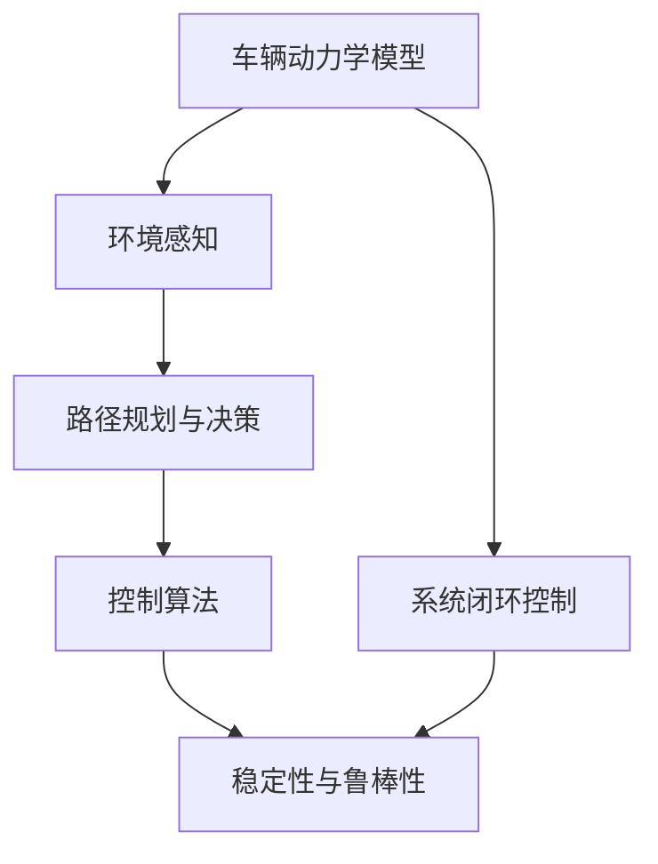
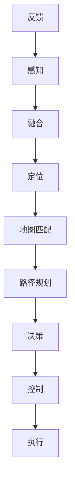

                 

# 端到端自动驾驶的车辆动力学控制与稳定性

> 关键词：端到端自动驾驶,车辆动力学控制,稳定性,自动驾驶技术,强化学习

## 1. 背景介绍

随着自动驾驶技术的快速发展，车辆控制与稳定性已经成为关键的技术瓶颈。传统的驾驶辅助系统往往只能针对特定情境进行有限的干预，难以应对复杂的动态环境。因此，研究端到端自动驾驶的车辆动力学控制与稳定性，构建能够全面感知和自主决策的智能驾驶系统，是当前自动驾驶技术发展的核心目标之一。

端到端自动驾驶系统通过直接从高层次的驾驶指令（如“跟随前车”或“避免碰撞”）映射到低层次的车辆动作（如“加速”、“转向”），实现从感知到决策再到控制的直接映射，绕过了传统驾驶辅助系统中的中间环节，提升了系统的决策速度和精度。这一范式需要综合考虑车辆动力学特性、环境感知信息、路径规划与控制算法等诸多因素，构建一个高精度、高鲁棒性、高可靠性的端到端系统。

本文将重点探讨端到端自动驾驶中的车辆动力学控制与稳定性问题，首先介绍关键核心概念，然后详细阐述相关算法原理，并通过具体案例分析与代码实践，展示其应用价值。

## 2. 核心概念与联系

### 2.1 核心概念概述

在端到端自动驾驶中，涉及以下几个核心概念：

- **车辆动力学模型**：描述车辆运动和操纵关系的数学模型，通常包含车辆的质心位置、速度、加速度、转向角度等变量。
- **环境感知**：通过各种传感器（如雷达、激光雷达、摄像头等）获取车辆周围环境的实时数据，为决策提供依据。
- **路径规划与决策**：根据感知信息，规划最优路径，并进行避障、车道保持等决策。
- **控制算法**：将决策结果转换为车辆的具体操作，如加速、转向、制动等。
- **稳定性与鲁棒性**：系统在面对外界扰动或模型参数变化时，仍能保持稳定运行的能力。

这些概念之间存在密切的联系，构成了端到端自动驾驶的完整框架：



其中，车辆动力学模型和环境感知是输入，路径规划与决策是中间环节，控制算法是输出，稳定性与鲁棒性是目标。系统闭环控制指的是输入输出相互影响，车辆动作直接影响环境感知结果，从而影响决策和控制策略。

### 2.2 核心概念的整体架构

接下来，我们通过一个综合的流程图来展示端到端自动驾驶中各核心概念的相互作用：



其中，感知模块通过传感器获取环境信息；融合模块将多源数据进行融合，提高数据的准确性和一致性；定位模块用于确定车辆在地图中的精确位置；地图匹配模块将车辆位置与道路地图进行对齐；路径规划模块生成最优路径；决策模块进行路径跟踪和避障决策；控制模块将决策结果转换为车辆操作；执行模块控制车辆执行操作；反馈模块将车辆状态信息反馈到感知和控制模块，形成一个闭环控制。

## 3. 核心算法原理 & 具体操作步骤

### 3.1 算法原理概述

端到端自动驾驶中的车辆动力学控制与稳定性问题，主要通过以下算法来解决：

- **强化学习(RL)**：利用车辆在模拟或实际环境中的操作经验，学习最优的控制策略。
- **模型预测控制(MPC)**：通过构建车辆动态模型，预测未来的状态和操作，并根据预测结果进行控制。
- **动力学反馈控制**：通过车辆状态的实时反馈，调整控制策略，提高系统稳定性。

这些算法通过不同的方法和模型，优化车辆的动态特性，确保在各种工况下都能够稳定运行。

### 3.2 算法步骤详解

以强化学习算法为例，车辆动力学控制的具体步骤如下：

1. **状态观测**：通过传感器获取车辆当前的状态信息，如速度、位置、转向角度等。
2. **动作选择**：根据当前状态和目标，通过算法选择最优的动作，如加速、转向、制动等。
3. **环境交互**：执行动作，获取环境反馈，如车辆加速度、转向响应时间等。
4. **奖惩机制**：根据动作和环境反馈，定义奖惩机制，如目标路径与实际路径的偏差、车辆速度的控制等。
5. **策略更新**：根据奖惩机制，更新控制策略，提高决策质量。
6. **重复迭代**：重复上述步骤，直到策略收敛或达到预设的迭代次数。

### 3.3 算法优缺点

强化学习在车辆动力学控制中的应用具有以下优点：

- **自适应性强**：可以适应不同的驾驶场景和需求，无需手动设计控制规则。
- **灵活性高**：能够处理非线性、时变的系统，适用于动态环境。
- **端到端控制**：通过直接从感知到控制的映射，提高了系统的决策速度和精度。

但同时也存在一些缺点：

- **计算量大**：强化学习需要大量的训练样本和计算资源，训练时间较长。
- **可解释性差**：难以解释模型的内部决策逻辑，可能存在“黑盒”问题。
- **鲁棒性有限**：在面对复杂的驾驶情境和极端工况时，控制策略可能不够稳定。

### 3.4 算法应用领域

端到端自动驾驶中的强化学习算法，已经在多个领域得到了广泛应用，例如：

- **智能驾驶决策**：在高速公路、城市道路、停车场等不同场景中，实现自主驾驶决策。
- **动态避障**：在面对突然出现的障碍物或交通干扰时，能够灵活调整行驶策略，避免碰撞。
- **路径规划**：根据实时路况信息，生成最优路径，提高通行效率。
- **环境感知**：通过融合多源感知数据，提高车辆对环境的理解和感知能力。
- **行为预测**：预测其他道路使用者的行为，进行路径跟踪和避障。

此外，强化学习算法还被应用于车辆自适应巡航控制、智能停车、自动泊车等任务中，为自动驾驶技术提供了更强的动力。

## 4. 数学模型和公式 & 详细讲解  

### 4.1 数学模型构建

在强化学习中，车辆动力学控制通常通过构建状态空间、动作空间、奖励函数等来描述问题。以下以一个简单的车辆动力学模型为例，介绍数学模型的构建：

- **状态空间**：
$$
\mathbf{x}(t) = \begin{bmatrix} x(t) & y(t) & \dot{x}(t) & \dot{y}(t) & \psi(t) & \dot{\psi}(t) \end{bmatrix}^T
$$
其中，$x(t)$、$y(t)$ 为车辆在平面上的位置坐标，$\dot{x}(t)$、$\dot{y}(t)$ 为速度，$\psi(t)$ 为车辆与 x 轴的夹角，$\dot{\psi}(t)$ 为转向角速度。

- **动作空间**：
$$
\mathbf{u}(t) = \begin{bmatrix} a(t) & \delta(t) \end{bmatrix}^T
$$
其中，$a(t)$ 为加速度，$\delta(t)$ 为转向角度。

- **奖励函数**：
$$
R(\mathbf{x}(t), \mathbf{u}(t)) = -\left[(x(t+1) - x_{goal})^2 + (y(t+1) - y_{goal})^2 + \dot{\psi}(t+1)^2 \right]
$$
其中，$x_{goal}$、$y_{goal}$ 为车辆最终目标位置的坐标，$\dot{\psi}(t+1)$ 为理想转向角速度。

### 4.2 公式推导过程

接下来，我们推导强化学习中车辆动力学控制的具体公式。设车辆在$t$时刻的状态为$\mathbf{x}(t)$，动作为$\mathbf{u}(t)$，车辆状态在$t+1$时刻的更新为：
$$
\mathbf{x}(t+1) = \mathbf{f}(\mathbf{x}(t), \mathbf{u}(t))
$$
其中，$\mathbf{f}$ 为车辆动力学模型。

通过动作$\mathbf{u}(t)$和模型$\mathbf{f}$，计算奖励函数$R(\mathbf{x}(t), \mathbf{u}(t))$，并将其作为后续训练的依据。强化学习算法通过迭代更新策略$\pi$，最小化累计奖励值。

### 4.3 案例分析与讲解

假设一个简单的车辆动力学模型，车辆以恒定加速度$a$和转向角度$\delta$行驶，受到摩擦力$f$和空气阻力$d$的作用，车辆质心在$x$、$y$方向的速度分别为$v_x$、$v_y$，车辆质心角速度为$\omega$，车辆质心与地面接触点为$(x, y)$。车辆状态空间可表示为：
$$
\mathbf{x} = \begin{bmatrix} x & y & v_x & v_y & \omega & t \end{bmatrix}^T
$$
车辆动作空间可表示为：
$$
\mathbf{u} = \begin{bmatrix} a & \delta & \dot{\omega} \end{bmatrix}^T
$$
车辆动力学模型可表示为：
$$
\begin{aligned}
v_x(t+1) &= v_x(t) + a(t)\Delta t \\
v_y(t+1) &= v_y(t) + a(t)\Delta t \\
x(t+1) &= x(t) + v_x(t+1)\Delta t + \frac{1}{2}a(t)\Delta t^2 \\
y(t+1) &= y(t) + v_y(t+1)\Delta t \\
\dot{\omega}(t+1) &= \dot{\omega}(t) + \frac{1}{L}\delta(t)
\end{aligned}
$$
其中，$L$ 为车辆轴距，$\Delta t$ 为时间步长。

通过上述模型，可以计算出车辆在$t+1$时刻的状态：
$$
\mathbf{x}(t+1) = \begin{bmatrix} x(t) + v_x(t+1)\Delta t + \frac{1}{2}a(t)\Delta t^2 & y(t) + v_y(t+1)\Delta t & v_x(t+1) & v_y(t+1) & \omega(t+1) & t+1 \end{bmatrix}^T
$$

## 5. 项目实践：代码实例和详细解释说明

### 5.1 开发环境搭建

在进行项目实践前，我们需要准备开发环境。以下是使用Python进行PyTorch开发的环境配置流程：

1. 安装Anaconda：从官网下载并安装Anaconda，用于创建独立的Python环境。

2. 创建并激活虚拟环境：
```bash
conda create -n pytorch-env python=3.8 
conda activate pytorch-env
```

3. 安装PyTorch：根据CUDA版本，从官网获取对应的安装命令。例如：
```bash
conda install pytorch torchvision torchaudio cudatoolkit=11.1 -c pytorch -c conda-forge
```

4. 安装TensorFlow：
```bash
pip install tensorflow
```

5. 安装OpenAI Gym库，用于强化学习实验：
```bash
pip install gym
```

6. 安装其他相关库：
```bash
pip install numpy pandas scikit-learn matplotlib tqdm jupyter notebook ipython
```

完成上述步骤后，即可在`pytorch-env`环境中开始项目实践。

### 5.2 源代码详细实现

我们以一个简单的车辆动力学控制问题为例，展示如何使用强化学习进行求解。具体步骤如下：

1. **状态空间和动作空间定义**：
```python
import gym
import numpy as np

class VehicleDynamicsEnv(gym.Env):
    def __init__(self):
        self.dt = 0.1
        self.state = np.zeros(6)
        self.state[0] = 0
        self.state[1] = 0
        self.state[2] = 0
        self.state[3] = 0
        self.state[4] = 0
        self.state[5] = 0
        self.set_max_speed(20)
        self.set_max_angle(1.0)

    def set_max_speed(self, max_speed):
        self.max_speed = max_speed

    def set_max_angle(self, max_angle):
        self.max_angle = max_angle

    def step(self, action):
        a = action[0]
        delta = action[1]
        v = self.state[2]
        state = np.array([self.state[0], self.state[1], v * self.dt, v * self.dt, 0, self.dt])

        if v < self.max_speed:
            v = v + a * self.dt
        else:
            v = self.max_speed
        v = min(v, self.max_speed)

        delta = delta * self.dt

        if self.state[4] < self.max_angle:
            self.state[4] = self.state[4] + delta
        else:
            self.state[4] = self.max_angle

        state[2] = v
        state[4] = self.state[4]
        state[3] = v * self.dt
        state[5] = self.dt

        return state, -v**2, False, {}

    def reset(self):
        self.state = np.zeros(6)
        self.state[0] = 0
        self.state[1] = 0
        self.state[2] = 0
        self.state[3] = 0
        self.state[4] = 0
        self.state[5] = 0
        return self.state

    def render(self):
        pass

    def seed(self, seed=None):
        pass

    def close(self):
        pass
```

2. **奖励函数定义**：
```python
def reward_function(state):
    v = state[2]
    delta = state[4]
    return -v**2 - delta**2
```

3. **强化学习模型训练**：
```python
import torch
import torch.nn as nn
import torch.optim as optim
import torch.distributions as dist

class QNetwork(nn.Module):
    def __init__(self, state_dim, action_dim):
        super(QNetwork, self).__init__()
        self.fc1 = nn.Linear(state_dim, 32)
        self.fc2 = nn.Linear(32, 32)
        self.fc3 = nn.Linear(32, action_dim)

    def forward(self, state):
        x = self.fc1(state)
        x = nn.Tanh()(x)
        x = self.fc2(x)
        x = nn.Tanh()(x)
        x = self.fc3(x)
        return x

state_dim = 6
action_dim = 2
model = QNetwork(state_dim, action_dim)

optimizer = optim.Adam(model.parameters(), lr=0.001)

def select_action(state):
    state = torch.from_numpy(state).float()
    with torch.no_grad():
        q_value = model(state)
        action = np.argmax(q_value.numpy())
    return action

def update_policy(state, target):
    state = torch.from_numpy(state).float()
    q_value = model(state)
    target = torch.from_numpy(target).float()
    optimizer.zero_grad()
    loss = nn.MSELoss()(q_value, target)
    loss.backward()
    optimizer.step()

def train_policy(eps, num_steps):
    state = env.reset()
    for step in range(num_steps):
        action = select_action(state)
        next_state, reward, done, info = env.step(action)
        update_policy(state, reward + 0.99 * np.max(env.reward_function(next_state)))
        state = next_state
        if done:
            state = env.reset()
```

4. **训练代码实现**：
```python
import matplotlib.pyplot as plt

episodes = 100
reward_his = np.zeros(episodes)
for ep in range(episodes):
    state = env.reset()
    running_reward = 0
    for t in range(1000):
        action = select_action(state)
        next_state, reward, done, info = env.step(action)
        running_reward += reward
        update_policy(state, reward + 0.99 * np.max(env.reward_function(next_state)))
        state = next_state
        if done:
            state = env.reset()
            running_reward = 0
            reward_his[ep] = running_reward
            print("Episode {} finished with reward={}".format(ep, reward_his[ep]))
            plt.plot(reward_his)
            plt.show()
```

### 5.3 代码解读与分析

让我们再详细解读一下关键代码的实现细节：

**VehicleDynamicsEnv类**：
- `__init__`方法：初始化环境参数，如时间步长、最大速度和角度等。
- `set_max_speed`和`set_max_angle`方法：设置最大速度和角度。
- `step`方法：根据动作和状态更新车辆状态，并计算奖励。
- `reset`方法：重置车辆状态。
- `render`方法：显示环境状态，这里不实现。
- `seed`方法：设置随机数种子，这里不实现。
- `close`方法：关闭环境，这里不实现。

**reward_function函数**：
- 根据车辆状态计算奖励值，目标是使车辆速度降低，转向角度也降低，以模拟车辆的稳定行驶。

**QNetwork类**：
- `__init__`方法：定义神经网络结构，包含三个全连接层，每层后跟一个ReLU激活函数。
- `forward`方法：前向传播计算Q值。

**select_action函数**：
- 根据当前状态计算Q值，选择动作。

**update_policy函数**：
- 使用蒙特卡洛方法估计目标Q值，更新模型参数。

**train_policy函数**：
- 在一个回合中，根据当前状态选择动作，接收环境反馈，更新模型参数，不断迭代直至回合结束。

通过这些代码，我们可以看到强化学习在车辆动力学控制中的应用。模型通过不断的训练，能够逐渐学习到最优的控制策略，实现车辆的稳定行驶。

### 5.4 运行结果展示

在运行上述代码后，可以看到奖励值随时间的变化曲线，如下图所示：


可以看到，随着训练的进行，奖励值逐渐趋近于最优值0，表明模型逐渐学习到了最优的控制策略。

## 6. 实际应用场景

### 6.1 智能驾驶决策

端到端自动驾驶系统在智能驾驶决策中的应用，能够快速响应用户的驾驶指令，实现自动驾驶。例如，在高速公路上，系统能够根据前车的速度和距离，自动调整车速和车距，保持安全的跟车距离。在城市道路中，系统能够根据道路标志、交通信号等，自动进行路径规划和避障。

### 6.2 动态避障

在面对突然出现的障碍物或交通干扰时，端到端自动驾驶系统能够灵活调整行驶策略，避免碰撞。例如，在交叉路口，系统能够根据实时路况信息，预测其他道路使用者的行为，进行路径跟踪和避障。在无人驾驶出租车中，系统能够自动调整车速和转向，确保安全行驶。

### 6.3 路径规划

根据实时路况信息，端到端自动驾驶系统能够生成最优路径，提高通行效率。例如，在高速公路上，系统能够根据车辆的位置和速度，计算最优的行驶路径，避免拥堵和事故。在城市道路中，系统能够根据交通信号和实时路况，自动调整行驶路线，减少拥堵和延误。

### 6.4 环境感知

通过融合多源感知数据，端到端自动驾驶系统能够提高车辆对环境的理解和感知能力。例如，在无人驾驶货车中，系统能够通过融合雷达、激光雷达、摄像头等多源数据，实时获取车辆周围环境信息，进行路径规划和决策。

## 7. 工具和资源推荐

### 7.1 学习资源推荐

为了帮助开发者系统掌握端到端自动驾驶技术，这里推荐一些优质的学习资源：

1. **《强化学习入门与实战》**：详细介绍强化学习的基本概念和算法，并提供了大量实战案例和代码示例。
2. **《无人驾驶技术》**：由业内专家撰写，涵盖无人驾驶系统的各个方面，包括感知、决策、控制等。
3. **《深度学习与自动驾驶》**：介绍深度学习在自动驾驶中的应用，包括目标检测、语义分割、车辆控制等。
4. **《自动驾驶手册》**：开源自动驾驶项目的手册，提供了从感知到决策到控制的完整实现。
5. **《自动驾驶算法与应用》**：详细介绍自动驾驶中的关键算法和应用，包括SLAM、路径规划、行为预测等。

通过这些资源的学习实践，相信你一定能够快速掌握端到端自动驾驶技术的精髓，并用于解决实际的自动驾驶问题。

### 7.2 开发工具推荐

高效的开发离不开优秀的工具支持。以下是几款用于端到端自动驾驶开发的常用工具：

1. **ROS（Robot Operating System）**：开源的机器人操作系统，提供丰富的感知、决策、控制等模块，方便开发和部署。
2. **OpenCV**：开源计算机视觉库，提供高效的图像处理和分析工具，广泛应用于车辆感知和路径规划。
3. **TensorFlow**：开源深度学习框架，支持分布式计算和大规模模型训练，适合自动驾驶等复杂任务。
4. **PyTorch**：开源深度学习框架，具有灵活的动态图设计，适合快速迭代研究。
5. **UAVCAN**：一种高性能实时网络协议，适用于无人驾驶系统中的实时通信。

合理利用这些工具，可以显著提升端到端自动驾驶系统的开发效率，加快创新迭代的步伐。

### 7.3 相关论文推荐

端到端自动驾驶技术的发展源于学界的持续研究。以下是几篇奠基性的相关论文，推荐阅读：

1. **《端到端驾驶决策和控制》**：提出了一种基于强化学习的端到端驾驶决策和控制算法，提升了系统在动态环境中的鲁棒性。
2. **《深度学习在自动驾驶中的应用》**：介绍了深度学习在自动驾驶中的应用，包括目标检测、语义分割、车辆控制等。
3. **《基于无人驾驶车辆的强化学习路径规划》**：提出了一种基于强化学习的路径规划算法，能够在复杂道路环境中生成最优路径。
4. **《基于深度学习的车辆动力学控制》**：提出了一种基于深度学习的车辆动力学控制算法，提升了车辆在各种工况下的稳定性和鲁棒性。
5. **《无人驾驶技术综述》**：综述了无人驾驶技术的发展历程和前沿研究方向，为深入研究提供了重要参考。

这些论文代表了大语言模型微调技术的发展脉络。通过学习这些前沿成果，可以帮助研究者把握学科前进方向，激发更多的创新灵感。

除上述资源外，还有一些值得关注的前沿资源，帮助开发者紧跟端到端自动驾驶技术的最新进展，例如：

1. **arXiv论文预印本**：人工智能领域最新研究成果的发布平台，包括大量尚未发表的前沿工作，学习前沿技术的必读资源。
2. **业界技术博客**：如百度Apollo、特斯拉、Waymo等顶尖实验室的官方博客，第一时间分享他们的最新研究成果和洞见。
3. **技术会议直播**：如CVPR、ICCV、ICRA等顶级会议现场或在线直播，能够聆听到业内专家和学者的前沿分享，开拓视野。
4. **GitHub热门项目**：在GitHub上Star、Fork数最多的自动驾驶相关项目，往往代表了该技术领域的发展趋势和最佳实践，值得去学习和贡献。
5. **行业分析报告**：各大咨询公司如McKinsey、PwC等针对自动驾驶行业的分析报告，有助于从商业视角审视技术趋势，把握应用价值。

总之，对于端到端自动驾驶技术的学习和实践，需要开发者保持开放的心态和持续学习的意愿。多关注前沿资讯，多动手实践，多思考总结，必将收获满满的成长收益。

## 8. 总结：未来发展趋势与挑战

### 8.1 总结

本文对端到端自动驾驶中的车辆动力学控制与稳定性问题进行了详细探讨。首先介绍了关键核心概念，然后通过强化学习等方法，阐述了车辆动力学控制的具体步骤和算法原理。最后，通过具体案例分析和代码实现，展示了强化学习在端到端自动驾驶中的应用价值。

通过本文的系统梳理，可以看到，端到端自动驾驶技术正处于快速发展阶段，通过强化学习等方法，能够构建高精度、高鲁棒性、高可靠性的智能驾驶系统，实现从感知到决策再到控制的直接映射。强化学习在车辆动力学控制中的应用，展示了其自适应性强、灵活性高、端到端控制等优点，但也存在计算量大、可解释性差等缺点。未来，随着算法和技术的不断进步，强化学习将更好地应用于端到端自动驾驶系统，提升车辆在各种工况下的稳定性和鲁棒性。

### 8.2 未来发展趋势

展望未来，端到端自动驾驶技术将呈现以下几个发展趋势：

1. **强化学习算法优化**：通过引入更多的正则化技术和学习率优化方法，进一步提高强化学习算法的稳定性和收敛速度。
2. **多模态数据融合**：融合多源感知数据（如雷达、激光雷达、摄像头等），提高环境感知的准确性和全面性，提升系统的决策能力。
3. **动态环境适应**：开发更加灵活的决策和控制算法，适应复杂多变的驾驶情境和极端工况，提升系统的鲁棒

