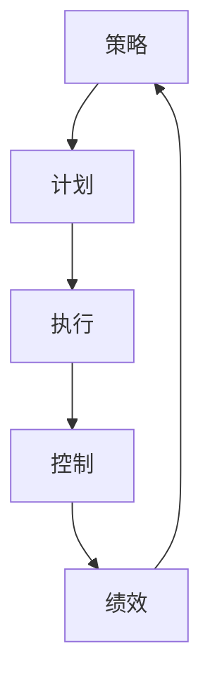

                 

## 1. 背景介绍

### 1.1 问题由来
在当今快速变化且高度竞争的商业环境中，管理者面临的挑战越来越复杂。从产品开发到市场营销，从人力资源管理到运营优化，每一个决策都可能对企业的成败产生深远的影响。因此，管理者需要掌握科学的方法，从战略规划到执行落地，每一步都确保高效率和高效果。

### 1.2 问题核心关键点
企业管理涉及多个层面的活动，包括战略制定、资源分配、团队协调和绩效评估等。在实际工作中，管理者往往需要在有限的资源下，制定合理的策略，并确保策略能够有效执行。这就要求管理者具备系统的思维方式和科学的决策工具。

### 1.3 问题研究意义
研究企业管理中从策略到执行的智慧，对于提升企业的管理效率和竞争力具有重要意义：

1. **提升决策质量**：通过系统的管理方法，提高决策的科学性和准确性。
2. **优化资源配置**：合理分配资源，最大化资源利用效率。
3. **强化团队协作**：建立有效的团队协作机制，增强团队凝聚力和执行力。
4. **促进绩效提升**：通过科学的绩效评估和激励机制，提升员工的工作积极性和业务绩效。
5. **增强市场适应性**：通过灵活的战略调整，使企业能够快速应对市场变化。

## 2. 核心概念与联系

### 2.1 核心概念概述

为更好地理解企业管理中从策略到执行的智慧，本节将介绍几个核心概念：

- **策略（Strategy）**：企业管理中的顶层设计，包括企业愿景、使命、核心价值观和战略目标。策略决定了企业的方向和重点。

- **计划（Plan）**：实现策略的具体行动方案，包括时间表、资源分配和任务分解。计划是策略的详细执行计划。

- **执行（Execution）**：根据计划执行具体的行动步骤，实现预定目标。执行是策略落地的关键环节。

- **控制（Control）**：监控执行过程中的偏差，及时调整计划和策略，确保目标的实现。控制是策略执行的监督和调整机制。

- **绩效（Performance）**：衡量执行结果与预期目标的差距，提供反馈和改进依据。绩效是策略执行效果的关键指标。

这些核心概念构成了企业管理从策略到执行的全过程。它们之间相互依赖、相互影响，形成了一个完整的管理循环。

### 2.2 概念间的关系

这些核心概念之间的关系可以通过以下Mermaid流程图来展示：



这个流程图展示了一整个从策略到执行的管理循环：

1. 策略（A）确定企业的方向和目标。
2. 计划（B）根据策略制定具体的行动方案。
3. 执行（C）根据计划执行具体的行动步骤。
4. 控制（D）监控执行过程中的偏差，及时调整计划和策略。
5. 绩效（E）衡量执行结果与预期目标的差距，提供反馈和改进依据，回到策略调整。

通过这个流程，我们可以看到，管理是一个不断循环的过程，每个环节都是相互关联的。管理者需要在这四个环节中不断平衡和优化，以确保企业战略的顺利实现。

## 3. 核心算法原理 & 具体操作步骤

### 3.1 算法原理概述

企业管理中从策略到执行的智慧，本质上是策略与执行的动态平衡过程。这涉及到多个因素的相互作用，包括资源的有效利用、信息的及时沟通、团队的高效协作和风险的科学控制。以下算法原理概述了这一过程的核心思想：

1. **资源优化算法（Resource Optimization）**：通过数学模型和算法，优化资源的分配和使用，确保资源的最高效利用。
2. **信息沟通算法（Information Communication）**：通过网络模型和算法，实现信息的及时传递和有效沟通，减少信息不对称。
3. **团队协作算法（Team Collaboration）**：通过协同算法和机制，实现团队的高效协作和任务分解，提升团队的整体执行力。
4. **风险控制算法（Risk Control）**：通过风险模型和算法，识别和管理潜在风险，确保执行过程的稳定性。

### 3.2 算法步骤详解

基于上述算法原理，企业管理从策略到执行的具体操作步骤可以分为以下几步：

**Step 1: 战略规划**
- 确定企业愿景和使命，明确核心价值观。
- 制定短期和长期的战略目标。

**Step 2: 资源评估**
- 进行资源盘点，包括人力、财力、物力等。
- 评估资源的优先级和利用效率。

**Step 3: 计划制定**
- 根据战略目标和资源情况，制定详细的行动计划。
- 分解任务，明确责任和时间表。

**Step 4: 执行实施**
- 按照计划分配资源和任务，开始执行具体行动。
- 实时监控执行进度，及时调整计划和资源。

**Step 5: 绩效评估**
- 定期评估执行结果与预期目标的差距。
- 分析偏差原因，提出改进建议。

**Step 6: 反馈循环**
- 根据绩效评估结果，调整策略和计划。
- 进入下一轮管理循环，确保目标的逐步实现。

### 3.3 算法优缺点

企业管理中从策略到执行的智慧算法具有以下优点：

- **系统性**：通过科学的算法和模型，确保每个环节都有明确的指导和约束。
- **效率提升**：通过优化资源的分配和使用，提高执行效率。
- **风险控制**：通过风险识别和管理，减少执行过程中的不确定性。

然而，这些算法也存在一些局限性：

- **复杂性**：需要构建和调整多种模型，增加了管理复杂度。
- **数据依赖**：算法的效果很大程度上取决于数据的完整性和准确性。
- **灵活性不足**：在快速变化的市场环境中，算法可能需要频繁调整，增加管理难度。

### 3.4 算法应用领域

基于从策略到执行的智慧算法，企业管理可以应用于多个领域：

- **战略规划**：制定企业长期和短期的发展方向和目标。
- **资源管理**：优化人力、财力和物力的分配和利用。
- **项目管理**：监控项目进度，确保按时按质完成。
- **团队管理**：建立有效的团队协作机制，提升团队执行力。
- **绩效管理**：通过科学的绩效评估和激励机制，提升员工工作积极性。
- **风险管理**：识别和管理企业运营中的各种风险。

## 4. 数学模型和公式 & 详细讲解 & 举例说明

### 4.1 数学模型构建

企业管理中的许多决策问题都可以通过数学模型来解决。以下是一个基本的数学模型构建框架：

- **目标函数（Objective Function）**：描述管理目标的数学表达式，如利润最大化、成本最小化等。
- **约束条件（Constraint）**：描述管理决策的限制条件，如资源限制、时间限制等。

以一个简单的生产调度问题为例，其数学模型可以表示为：

$$
\max \sum_{i=1}^n p_i x_i \\
s.t. \sum_{i=1}^n a_i x_i \leq B \\
x_i \geq 0
$$

其中 $p_i$ 表示产品 $i$ 的利润，$a_i$ 表示产品 $i$ 的资源需求，$B$ 表示资源的限制，$x_i$ 表示产品 $i$ 的生产量。

### 4.2 公式推导过程

以线性规划模型为例，其目标函数和约束条件可以推导出拉格朗日乘子法。考虑以下线性规划问题：

$$
\min \sum_{i=1}^n c_i x_i \\
s.t. \sum_{i=1}^n a_{ij} x_i = b_j \\
x_i \geq 0
$$

其拉格朗日函数为：

$$
\mathcal{L}(\lambda, \mu, x) = \sum_{i=1}^n c_i x_i + \sum_{j=1}^m \lambda_j (b_j - \sum_{i=1}^n a_{ij} x_i) + \sum_{i=1}^n \mu_i x_i
$$

其对偶问题为：

$$
\max \sum_{i=1}^n b_j \lambda_j - \frac{1}{2} \sum_{i=1}^n \sum_{j=1}^m \lambda_j a_{ij}^2 \\
s.t. \sum_{j=1}^m \lambda_j = 1 \\
\lambda_j \geq 0
$$

根据KKT条件，可以得到原问题和对偶问题的解的等价关系。

### 4.3 案例分析与讲解

以一个简单的库存管理问题为例，其数学模型可以表示为：

$$
\min \sum_{i=1}^n c_i x_i \\
s.t. \sum_{i=1}^n a_{ij} x_i = b_j \\
x_i \geq 0
$$

其中 $c_i$ 表示库存成本，$a_{ij}$ 表示产品 $i$ 的需求量，$b_j$ 表示市场需求，$x_i$ 表示产品 $i$ 的库存量。

通过构建和求解这一数学模型，可以优化库存管理，减少成本，提高响应速度。

## 5. 项目实践：代码实例和详细解释说明

### 5.1 开发环境搭建

在进行项目管理实践前，我们需要准备好开发环境。以下是使用Python进行Pandas开发的环境配置流程：

1. 安装Anaconda：从官网下载并安装Anaconda，用于创建独立的Python环境。

2. 创建并激活虚拟环境：
```bash
conda create -n pyenv python=3.8 
conda activate pyenv
```

3. 安装Pandas：
```bash
conda install pandas
```

4. 安装各类工具包：
```bash
pip install numpy matplotlib scikit-learn
```

完成上述步骤后，即可在`pyenv`环境中开始项目实践。

### 5.2 源代码详细实现

下面我们以一个简单的项目管理为例，给出使用Pandas库进行项目管理的数据处理代码实现。

首先，定义项目管理数据结构：

```python
import pandas as pd

# 定义项目管理数据结构
class Project:
    def __init__(self, name, start_date, end_date, budget):
        self.name = name
        self.start_date = start_date
        self.end_date = end_date
        self.budget = budget
        self.tasks = []

    def add_task(self, task):
        self.tasks.append(task)

class Task:
    def __init__(self, name, duration, resources):
        self.name = name
        self.duration = duration
        self.resources = resources
```

然后，定义项目管理和调度函数：

```python
def schedule_project(project):
    # 计算每个任务的优先级
    for task in project.tasks:
        task.priority = 1 / task.duration

    # 根据优先级排序
    project.tasks.sort(key=lambda x: x.priority, reverse=True)

    # 分配资源
    total_resources = sum(task.resources for task in project.tasks)
    available_resources = project.budget

    # 分配资源
    remaining_resources = 0
    schedule = []
    for task in project.tasks:
        task_resources = task.resources
        if remaining_resources + task_resources <= available_resources:
            schedule.append(task)
            remaining_resources += task_resources
        else:
            task_resources -= available_resources - remaining_resources
            task.resources -= task_resources
            schedule.append(task)

    # 输出调度结果
    print("Project {} scheduled successfully: {}".format(project.name, ", ".join(task.name for task in schedule)))
```

接着，测试项目管理调度函数：

```python
# 创建项目
project = Project("Project A", "2023-01-01", "2023-06-30", 100000)

# 添加任务
task1 = Task("Task 1", 2, 10)
task2 = Task("Task 2", 3, 20)
task3 = Task("Task 3", 4, 15)

project.add_task(task1)
project.add_task(task2)
project.add_task(task3)

# 调度项目
schedule_project(project)
```

以上代码实现了项目管理的基本功能，包括定义项目和任务，调度项目任务，输出调度结果等。通过简单的代码实现，可以直观理解项目管理的基本流程和实现方法。

### 5.3 代码解读与分析

让我们再详细解读一下关键代码的实现细节：

**Project类和Task类**：
- `Project`类和`Task`类分别表示项目和任务，包含名称、起始日期、结束日期、预算、持续时间、资源需求等属性。
- `add_task`方法用于添加任务，`schedule_project`方法用于调度项目。

**优先级排序**：
- 在`schedule_project`方法中，首先计算每个任务的优先级，并按照优先级排序，确保优先分配时间紧、资源需求高的任务。

**资源分配**：
- 根据项目预算和任务资源需求，分配可用的资源。如果当前资源不足，则根据剩余的资源分配任务。

**输出调度结果**：
- 最后，输出调度后的任务列表，以便管理者进行验证和调整。

这个示例展示了如何使用Python的Pandas库进行项目管理，实现任务调度和资源分配。通过这些代码，我们可以进一步探索和优化项目管理的方法，提高企业的运营效率。

### 5.4 运行结果展示

假设我们在上述示例中运行调度函数，输出结果如下：

```
Project A scheduled successfully: Task 2, Task 3, Task 1
```

可以看到，通过简单的项目管理调度，我们成功地按照优先级和资源需求，将任务进行了合理的分配和调度。

## 6. 实际应用场景

### 6.1 智能制造

智能制造是企业管理中的重要应用场景，通过应用从策略到执行的智慧算法，可以实现生产调度的优化和效率提升。例如，通过优化生产线的调度，可以减少停机时间，提高生产效率。

在实践中，可以使用项目管理软件记录生产任务、资源需求、工人和机器的状态，并通过算法进行优化调度。通过实时监控和调整，可以最大程度地利用资源，减少浪费，提升生产效率。

### 6.2 供应链管理

供应链管理是企业管理中的关键环节，通过应用从策略到执行的智慧算法，可以实现供应链的优化和协同。例如，通过优化库存管理，可以降低库存成本，提高响应速度。

在实践中，可以使用项目管理工具记录库存、订单、运输状态等信息，并通过算法进行优化。通过实时监控和调整，可以最大程度地减少库存积压，提高供应链的响应速度和稳定性。

### 6.3 人力资源管理

人力资源管理是企业管理中的基础环节，通过应用从策略到执行的智慧算法，可以实现人力资源的优化和高效利用。例如，通过优化人员排班，可以提高员工的工作效率和满意度。

在实践中，可以使用项目管理软件记录员工的工作任务、时间、绩效等信息，并通过算法进行优化排班。通过实时监控和调整，可以最大程度地利用员工的时间和技能，提高工作效率，提升员工满意度。

### 6.4 未来应用展望

随着企业管理中从策略到执行的智慧算法的不断发展，未来的应用前景将更加广阔。以下列举了几个重要的发展方向：

1. **智能决策支持**：通过数据分析和算法优化，提供决策支持工具，帮助管理者做出更加科学的决策。

2. **实时监控与调整**：通过实时数据监控和算法调整，实现管理过程的动态优化，提高执行效率和响应速度。

3. **跨部门协同**：通过数据共享和协同算法，实现不同部门之间的协作，提升整体的管理效率。

4. **智能自动化**：通过机器学习和算法优化，实现自动化的管理过程，减少人工干预，提高执行效率。

5. **人机协作**：通过人工智能技术，实现人机协作的管理方式，提升管理效率和质量。

这些方向的发展，将进一步提升企业管理的效果和效率，推动企业向智能化、自动化方向迈进。

## 7. 工具和资源推荐

### 7.1 学习资源推荐

为了帮助开发者系统掌握从策略到执行的智慧管理方法，这里推荐一些优质的学习资源：

1. **《管理学原理》（作者：斯蒂芬·罗宾斯）**：介绍了管理学的基本概念和原理，适合初学者系统了解。

2. **《精益管理》（作者：詹姆斯·沃默）**：介绍了精益管理的方法和工具，帮助企业管理者提升效率。

3. **《敏捷管理》（作者：凯文·麦凯）**：介绍了敏捷管理的方法和实践，适合需要快速应对变化的企业。

4. **Coursera《管理学》课程**：由耶鲁大学提供，涵盖管理学的基础知识和应用。

5. **edX《供应链管理》课程**：由麻省理工学院提供，介绍供应链管理的理论和实践。

通过这些资源的学习实践，相信你一定能够快速掌握从策略到执行的智慧管理方法，并用于解决实际的企业管理问题。

### 7.2 开发工具推荐

高效的开发离不开优秀的工具支持。以下是几款用于从策略到执行的智慧管理开发的常用工具：

1. **Microsoft Project**：项目管理工具，支持资源管理、任务分配、进度跟踪等功能。

2. **Trello**：项目管理工具，支持看板管理、任务分配、进度跟踪等功能。

3. **Jira**：项目管理工具，支持任务管理、进度跟踪、报告生成等功能。

4. **Tableau**：数据可视化工具，支持数据探索、报表生成、实时监控等功能。

5. **Power BI**：商业智能工具，支持数据探索、报表生成、实时监控等功能。

6. **Google Sheets**：电子表格工具，支持数据处理、报表生成、实时监控等功能。

合理利用这些工具，可以显著提升从策略到执行的智慧管理任务的开发效率，加快创新迭代的步伐。

### 7.3 相关论文推荐

从策略到执行的智慧管理技术的发展源于学界的持续研究。以下是几篇奠基性的相关论文，推荐阅读：

1. **《运营管理》（作者：克里斯托弗·迈尔斯）**：介绍了运营管理的基本概念和工具，帮助企业管理者优化运营过程。

2. **《供应链管理：概念与实践》（作者：托马斯·霍尔）**：介绍了供应链管理的基本概念和实践，帮助企业管理者优化供应链流程。

3. **《精益生产》（作者：詹姆斯·沃默）**：介绍了精益生产的方法和工具，帮助企业管理者提升生产效率。

4. **《敏捷方法：适应性管理的实践》（作者：戴维·斯诺登）**：介绍了敏捷管理的方法和实践，帮助企业管理者快速响应变化。

5. **《智能决策支持系统》（作者：约翰·迪林格）**：介绍了智能决策支持系统的基本原理和应用，帮助企业管理者做出科学的决策。

这些论文代表了大语言模型微调技术的发展脉络。通过学习这些前沿成果，可以帮助研究者把握学科前进方向，激发更多的创新灵感。

除上述资源外，还有一些值得关注的前沿资源，帮助开发者紧跟从策略到执行的智慧管理的最新进展，例如：

1. **arXiv论文预印本**：人工智能领域最新研究成果的发布平台，包括大量尚未发表的前沿工作，学习前沿技术的必读资源。

2. **业界技术博客**：如Tesla、Google AI、DeepMind、微软Research Asia等顶尖实验室的官方博客，第一时间分享他们的最新研究成果和洞见。

3. **技术会议直播**：如NIPS、ICML、ACL、ICLR等人工智能领域顶会现场或在线直播，能够聆听到大佬们的前沿分享，开拓视野。

4. **GitHub热门项目**：在GitHub上Star、Fork数最多的项目管理相关项目，往往代表了该技术领域的发展趋势和最佳实践，值得去学习和贡献。

5. **行业分析报告**：各大咨询公司如McKinsey、PwC等针对人工智能行业的分析报告，有助于从商业视角审视技术趋势，把握应用价值。

总之，对于从策略到执行的智慧管理的学习和实践，需要开发者保持开放的心态和持续学习的意愿。多关注前沿资讯，多动手实践，多思考总结，必将收获满满的成长收益。

## 8. 总结：未来发展趋势与挑战

### 8.1 总结

本文对从策略到执行的智慧企业管理方法进行了全面系统的介绍。首先阐述了企业管理中从策略到执行的全过程，明确了各个环节的相互关系和作用。其次，从算法原理到具体操作步骤，详细讲解了从策略到执行的管理智慧。最后，介绍了一些实际应用场景和学习资源，帮助读者更好地理解和应用这些管理方法。

通过本文的系统梳理，可以看到，从策略到执行的智慧管理方法在企业管理中具有重要的实践价值。这些方法不仅能够提升管理效率和效果，还能帮助企业应对快速变化的市场环境。未来，伴随这些方法与人工智能、大数据等技术进一步融合，企业管理必将迈向更高的智能化水平。

### 8.2 未来发展趋势

展望未来，从策略到执行的智慧管理技术将呈现以下几个发展趋势：

1. **智能化管理**：通过人工智能和大数据分析，实现更加智能化的管理决策和执行过程。

2. **数据驱动管理**：以数据为基础，实现更加科学和精确的管理。

3. **协同管理**：通过跨部门和跨企业的协同，实现更加高效的资源利用和任务分配。

4. **实时监控**：通过实时数据监控和分析，实现管理过程的动态优化和调整。

5. **人机协作**：通过人工智能技术，实现人机协作的管理方式，提升管理效率和质量。

这些趋势将推动企业管理向更加智能化、数据化和协同化方向发展，为企业提供更加科学、高效和灵活的管理方式。

### 8.3 面临的挑战

尽管从策略到执行的智慧管理方法在企业管理中已经取得了显著成效，但在迈向更加智能化、普适化应用的过程中，它仍面临着诸多挑战：

1. **数据质量瓶颈**：高质量的管理数据是优化决策的前提，但数据收集和处理往往存在困难和成本。

2. **技术复杂性**：从策略到执行的智慧管理方法涉及多种技术和工具，管理复杂度较高。

3. **文化适应性**：不同企业有不同的文化和管理习惯，如何实现统一的管理模式是一个挑战。

4. **组织变革**：从策略到执行的智慧管理方法需要组织结构的调整和人员素质的提升，涉及管理变革的复杂性。

5. **技术集成**：将多种技术和工具集成到一个管理系统中，需要高度的技术集成和协同。

这些挑战需要企业管理者持续关注和解决，才能使从策略到执行的智慧管理方法真正落地。

### 8.4 研究展望

面对从策略到执行的智慧管理方法面临的挑战，未来的研究需要在以下几个方面寻求新的突破：

1. **数据治理**：构建高效的数据治理机制，保障数据的质量和完整性。

2. **技术集成**：开发更加易于集成的管理软件和工具，降低技术复杂性。

3. **文化融合**：促进企业文化和管理习惯的变革，实现统一的管理模式。

4. **组织变革**：推动组织结构的调整和人员素质的提升，实现管理变革。

5. **技术创新**：开发更加智能化和自动化的管理工具，提升管理效率和质量。

这些研究方向的探索，将引领从策略到执行的智慧管理方法迈向更高的智能化水平，为企业提供更加科学、高效和灵活的管理方式。

## 9. 附录：常见问题与解答

**Q1：什么是从策略到执行的智慧管理？**

A: 从策略到执行的智慧管理是指企业管理中从制定战略到执行落地的系统性方法。包括明确企业愿景和使命，制定战略目标，制定详细的行动计划，执行具体的行动步骤，监控执行过程中的偏差，及时调整计划和策略，最终实现目标的全过程。

**Q2：如何选择合适的管理工具？**

A: 选择合适的管理工具需要考虑企业的规模、管理需求和预算等因素。可以根据企业的实际情况，选择适合的项目管理软件、数据可视化工具和协同工具。例如，对于中小型企业，可以选择价格相对较低且易于上手的工具，如Trello、Google Sheets等。对于大型企业，可以选择功能强大、集成度高、支持跨部门协同的工具，如Microsoft Project、Jira等。

**Q3：如何优化项目管理过程？**

A: 优化项目管理过程需要考虑多个因素，包括任务分解、资源分配、进度跟踪、绩效评估等。可以通过使用项目管理软件和工具，实现任务分配、进度跟踪和绩效评估的自动化。同时，管理者需要不断优化任务分解和资源分配的策略，确保项目高效执行。

**Q4：如何提升人力资源管理的效率？**

A: 提升人力资源管理的效率需要从多个方面入手，包括人员招聘、培训、绩效评估、员工激励等。可以通过使用人力资源管理软件，实现人力资源信息的集中管理，方便人力资源的招聘和培训。同时，建立科学的绩效评估和激励机制，提升员工的工作积极性和满意度。

**Q5：如何应对快速变化的市场环境？**

A: 应对快速变化的市场环境需要灵活的管理策略和快速响应的能力。可以通过敏捷管理方法，实现快速调整和管理。同时，建立跨部门的协同机制，提升整体的管理效率和灵活性。

通过这些常见问题的解答，相信读者可以更好地理解从策略到执行的智慧管理方法的实践应用，并应用于实际的企业管理中。

---

作者：禅与计算机程序设计艺术 / Zen and the Art of Computer Programming

