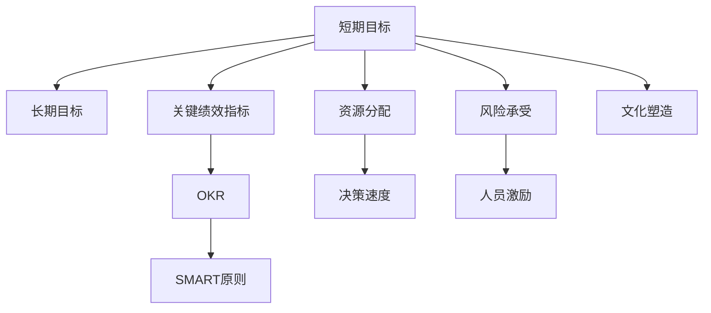
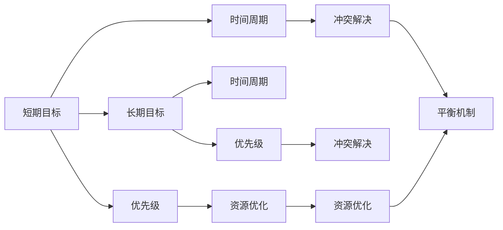
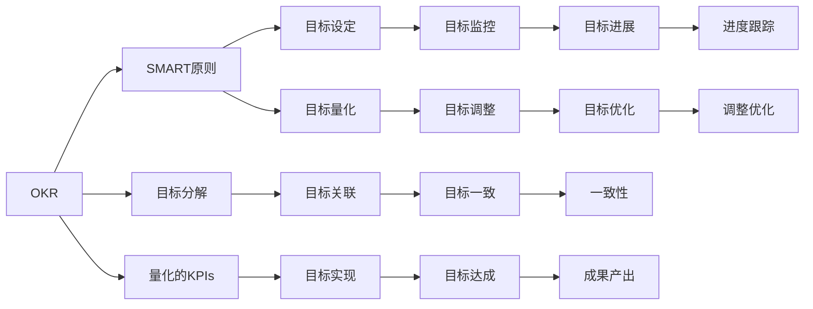
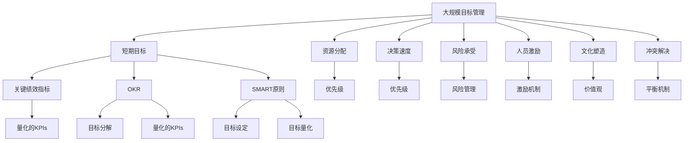

                 

# 管理短期目标与长期目标的意识机制

## 1. 背景介绍

### 1.1 问题由来
在快节奏的现代商业环境中，管理短期目标与长期目标成为了企业成功的重要组成部分。短期目标（Short-term Goals）通常指那些可以在几周或几个月内实现的目标，而长期目标（Long-term Goals）则着眼于未来数年，甚至数十年的发展方向。这两者在企业战略中相互交织，共同影响着企业的发展路径和市场竞争力。然而，如何平衡短期目标与长期目标，使得两者在实际操作中能够和谐共存，成为了管理层必须面对的难题。

### 1.2 问题核心关键点
短期目标与长期目标之间的冲突主要体现在以下几个方面：
- **资源分配**：资源有限，如何在短期和长期目标之间进行合理分配，避免资源过度倾斜导致一方发展滞后。
- **决策速度**：短期目标往往需要快速响应市场变化，而长期目标则需深思熟虑。如何在保证决策速度的同时，兼顾战略方向的稳定性和深度。
- **风险承受**：短期目标通常面临较高的不确定性和风险，而长期目标则是通过逐步积累来达成。如何在风险管理中平衡短期与长期的风险承受能力。
- **人员激励**：短期目标的实现通常会带来即时奖励，而长期目标则需要长期的坚持和努力。如何设计有效的激励机制，以维持团队对长期目标的投入和热情。
- **文化塑造**：企业文化是企业长期目标的重要支撑，但短期内调整文化和观念的成本较高。如何在短期和长期之间保持一致的企业价值观。

### 1.3 问题研究意义
管理好短期目标与长期目标，对于企业的长期可持续发展至关重要。

- **提升市场竞争力**：通过合理规划短期和长期目标，企业能够在激烈的市场竞争中保持灵活性和稳定性，快速应对市场变化，同时也能够抓住长远发展的机遇。
- **促进资源优化配置**：在资源有限的情况下，合理分配资源，使得短期和长期目标能够并行推进，避免资源浪费。
- **增强团队凝聚力**：平衡短期和长期目标，能够激发团队的积极性和创造力，使得所有成员对企业的未来方向有清晰的认知和认同。
- **提高战略执行效率**：短期目标的快速实施可以迅速看到成效，提供数据支持，帮助企业不断调整和优化长期战略。

## 2. 核心概念与联系

### 2.1 核心概念概述

为更好地理解如何管理短期目标与长期目标，本节将介绍几个密切相关的核心概念：

- **短期目标（Short-term Goals）**：指在短期内可实现的目标，通常包含1到12个月的时间周期。例如季度销售目标、月度运营效率提升等。
- **长期目标（Long-term Goals）**：着眼于未来的发展，时间跨度可能长达数年甚至数十年。例如研发新产品、进入新市场、提升企业品牌价值等。
- **关键绩效指标（KPIs）**：用于衡量目标完成情况的指标，通常是可量化的数据，如销售额、利润率、客户满意度等。
- **OKR（Objectives and Key Results）**：一种目标管理框架，将目标分解为具体、可量化的KPIs，用于衡量和监控目标进展。
- **SMART原则**：设定目标时需遵循的具体原则，包括目标具体化（Specific）、可量化（Measurable）、可达成（Achievable）、相关性（Relevant）、时限性（Time-bound）。

这些核心概念之间的逻辑关系可以通过以下Mermaid流程图来展示：



这个流程图展示了这个主题的核心概念及其之间的关系：

1. 短期目标和长期目标之间相互影响，共同构成了企业的战略目标体系。
2. 关键绩效指标用于衡量和监控目标的进展情况。
3. OKR框架将目标分解为可量化的KPIs，便于管理和监控。
4. SMART原则确保目标设定符合合理和实际的要求。
5. 资源分配、决策速度、风险承受、人员激励和文化塑造等关键管理过程，都在平衡短期和长期目标中发挥着重要作用。

### 2.2 概念间的关系

这些核心概念之间存在着紧密的联系，形成了企业战略目标管理的完整生态系统。

#### 2.2.1 短期目标与长期目标的平衡



这个流程图展示了短期目标与长期目标之间可能存在的冲突及其解决机制：

1. 短期目标与长期目标在时间周期和优先级上存在差异。
2. 冲突解决和资源优化机制帮助平衡两者之间的关系。
3. 平衡机制确保短期和长期目标在实际操作中能够和谐共存。

#### 2.2.2 OKR与SMART原则的协同



这个流程图展示了OKR与SMART原则在目标管理中的协同作用：

1. OKR将长期目标分解为具体的KPIs。
2. SMART原则确保每个KPIs设定都是具体、可量化、可达成、相关且有时间限制的。
3. 目标关联和一致性确保OKR和SMART原则在实际操作中的协同。
4. 目标监控和调整优化帮助保证目标实现和进展。

### 2.3 核心概念的整体架构

最后，我们用一个综合的流程图来展示这些核心概念在大规模目标管理中的整体架构：



这个综合流程图展示了从目标设定到实施的完整过程，包括短期和长期目标的管理、资源分配、决策速度、风险管理、人员激励、文化塑造、冲突解决和平衡机制等关键管理过程。通过这些流程图，我们可以更清晰地理解目标管理的各个环节及其作用，为后续深入讨论具体的管理方法和技术奠定基础。

## 3. 核心算法原理 & 具体操作步骤
### 3.1 算法原理概述

企业管理短期目标与长期目标的意识机制，本质上是一种基于目标管理和绩效评估的优化过程。其核心思想是：通过设定具体、可量化、可达成、相关且有时间限制的目标（符合SMART原则），结合OKR框架进行目标分解和量化，利用关键绩效指标（KPIs）监控目标进展，通过资源分配、优先级管理、决策速度优化、风险管理、人员激励、文化塑造、冲突解决和平衡机制等策略，确保短期目标与长期目标在实际操作中能够和谐共存。

形式化地，假设企业目标为 $G_{\theta}$，其中 $\theta$ 表示不同时间段的目标。目标管理过程可以表示为：

$$
\min_{\theta} \sum_{t=1}^{T} \mathcal{L}(G_{\theta}, D_t)
$$

其中 $\mathcal{L}$ 为针对时间 $t$ 的目标损失函数，用于衡量目标完成情况与实际数据 $D_t$ 之间的差异。在实际操作中，通常使用加权平均的方式计算总体的目标损失。

通过梯度下降等优化算法，目标管理过程不断更新目标参数 $\theta$，最小化目标损失函数 $\mathcal{L}$，使得目标实现与实际数据相匹配。由于目标设定符合SMART原则，即便在短期和长期目标之间存在冲突时，也能够快速调整和优化，使得企业在资源、时间、风险等方面实现最优配置。

### 3.2 算法步骤详解

基于SMART原则和OKR框架的目标管理一般包括以下几个关键步骤：

**Step 1: 准备目标设定**
- 确定企业愿景和长期战略方向，进行顶层目标设定。
- 按照SMART原则，设定具体的短期和长期目标。
- 将长期目标分解为多个可量化的KPIs，并设定关键绩效指标。

**Step 2: 分解和量化目标**
- 使用OKR框架，将顶层目标分解为具体的短期和长期任务。
- 为每个任务设定具体的KPIs，确保目标量化。
- 确定任务优先级和时间周期，形成任务路线图。

**Step 3: 制定执行计划**
- 根据任务路线图，制定详细的执行计划，包括资源分配、时间节点、责任人等。
- 设定关键里程碑，用于监控和评估任务进展。
- 建立定期回顾和评估机制，及时调整目标和计划。

**Step 4: 执行和监控**
- 按照执行计划，逐步推进目标实施。
- 定期在关键里程碑上评估目标进展情况，确保目标按计划推进。
- 利用关键绩效指标监控目标完成情况，及时调整策略。

**Step 5: 结果评估和反馈**
- 定期对目标完成情况进行评估，形成评估报告。
- 根据评估结果，进行反馈和改进，调整目标和策略。
- 将成功经验转化为标准操作流程，持续优化目标管理方法。

### 3.3 算法优缺点

基于SMART原则和OKR框架的目标管理方法具有以下优点：
- 目标明确：通过SMART原则设定目标，确保目标具体、可量化、可达成、相关且有时间限制。
- 分解细致：使用OKR框架将长期目标分解为具体的短期任务，便于管理和监控。
- 灵活性高：目标管理过程中，可以根据实际情况灵活调整目标和策略。
- 绩效透明：利用关键绩效指标（KPIs）对目标进展进行透明监控，便于管理层和员工监督。
- 持续优化：通过定期回顾和评估，持续优化目标管理方法，提升企业战略执行效率。

同时，该方法也存在一定的局限性：
- 目标设定难度高：SMART原则需要高度专业的管理和理解，对目标设定人员的要求较高。
- 资源消耗大：目标设定和分解工作量大，需要消耗大量管理成本。
- 适应性不足：在快速变化的市场环境中，目标管理策略可能难以快速调整。
- 沟通成本高：目标分解和量化过程需要跨部门沟通协调，协调成本较高。
- 灵活性受限：过细的分解和量化可能导致执行过程过于僵化，影响灵活性。

尽管存在这些局限性，但就目前而言，基于SMART原则和OKR框架的目标管理方法仍然是最主流、最有效的方法之一，在实际应用中得到了广泛的应用。

### 3.4 算法应用领域

基于SMART原则和OKR框架的目标管理方法已经广泛应用于各行各业，包括但不限于：

- **金融行业**：通过设定具体的财务指标和投资回报目标，管理短期交易和长期资产配置。
- **制造业**：设定生产效率和产品质量目标，优化生产线，提升生产效率和产品质量。
- **零售行业**：设定销售目标和客户满意度指标，优化库存管理和客户服务。
- **科技行业**：设定产品开发进度和市场份额目标，推动技术创新和市场拓展。
- **医疗行业**：设定治疗效果和病人满意度目标，提升医疗服务质量。

除了上述这些经典应用领域外，目标管理方法也被创新性地应用到更多场景中，如政府公共管理、非营利组织、教育培训等，为各行业带来了新的管理思路和方法。

## 4. 数学模型和公式 & 详细讲解  
### 4.1 数学模型构建

本节将使用数学语言对基于SMART原则和OKR框架的目标管理过程进行更加严格的刻画。

假设企业的长期目标为 $G_L$，短期目标为 $G_S$，且满足 $G_L = \bigoplus_{s=1}^{S} G_{S,s}$，其中 $S$ 为短期目标的数量。设 $K$ 为每个短期目标的KPIs数量。

定义目标损失函数为：

$$
\mathcal{L}(G_{\theta}, D_t) = \sum_{k=1}^{K} w_k \cdot (G_{S,t}^{(k)} - D_{S,t}^{(k)})
$$

其中 $w_k$ 为第 $k$ 个KPIs的权重，$G_{S,t}^{(k)}$ 为目标在第 $t$ 周期的第 $k$ 个KPIs，$D_{S,t}^{(k)}$ 为实际数据在第 $t$ 周期的第 $k$ 个KPIs。

目标管理过程的目标是：

$$
\theta^* = \mathop{\arg\min}_{\theta} \sum_{t=1}^{T} \mathcal{L}(G_{\theta}, D_t)
$$

在实际操作中，通常使用梯度下降等优化算法来近似求解上述最优化问题。设 $\eta$ 为学习率，$\lambda$ 为正则化系数，则参数的更新公式为：

$$
\theta \leftarrow \theta - \eta \nabla_{\theta}\mathcal{L}(\theta) - \eta\lambda\theta
$$

其中 $\nabla_{\theta}\mathcal{L}(\theta)$ 为损失函数对参数 $\theta$ 的梯度，可通过反向传播算法高效计算。

### 4.2 公式推导过程

以下我们以销售额目标管理为例，推导目标损失函数的计算公式。

假设企业的销售额目标为 $G_L$，且每月设定的销售额目标为 $G_{S,m}$。在实际执行过程中，企业每月的实际销售额为 $D_{S,m}$。定义目标损失函数为：

$$
\mathcal{L}(G_{\theta}, D_m) = w \cdot (G_{S,m} - D_{S,m})
$$

其中 $w$ 为销售额的权重，$G_{S,m}$ 为第 $m$ 个月的销售额目标，$D_{S,m}$ 为第 $m$ 个月的实际销售额。

将其代入目标损失函数公式，得：

$$
\mathcal{L}(\theta, D_t) = \sum_{m=1}^{M} w_m \cdot (G_{S,m} - D_{S,m})
$$

根据链式法则，目标损失函数对参数 $\theta$ 的梯度为：

$$
\frac{\partial \mathcal{L}(\theta, D_t)}{\partial \theta} = \sum_{m=1}^{M} \frac{\partial \mathcal{L}(\theta, D_m)}{\partial \theta}
$$

其中 $\frac{\partial \mathcal{L}(\theta, D_m)}{\partial \theta}$ 可进一步递归展开，利用自动微分技术完成计算。

在得到目标损失函数的梯度后，即可带入参数更新公式，完成模型的迭代优化。重复上述过程直至收敛，最终得到适应目标任务的最优模型参数 $\theta^*$。

## 5. 项目实践：代码实例和详细解释说明
### 5.1 开发环境搭建

在进行目标管理实践前，我们需要准备好开发环境。以下是使用Python进行目标管理开发的典型环境配置流程：

1. 安装Python：确保Python 3.x版本已经安装，并配置好路径。

2. 安装Pandas：用于数据处理和分析。
```bash
pip install pandas
```

3. 安装NumPy：用于科学计算和矩阵运算。
```bash
pip install numpy
```

4. 安装Matplotlib：用于数据可视化。
```bash
pip install matplotlib
```

5. 安装scikit-learn：用于机器学习建模。
```bash
pip install scikit-learn
```

完成上述步骤后，即可在Python环境中开始目标管理实践。

### 5.2 源代码详细实现

这里我们以销售额目标管理为例，展示使用Python进行目标管理的具体代码实现。

首先，定义目标数据和目标设定：

```python
import pandas as pd
import numpy as np

# 定义实际销售额数据
sales_data = pd.DataFrame({
    'Month': [1, 2, 3, 4, 5, 6, 7, 8, 9, 10, 11, 12],
    'Sales': [100, 110, 120, 130, 140, 150, 160, 170, 180, 190, 200, 210]
})

# 定义目标销售额
target_sales = 200
```

然后，计算目标损失函数：

```python
# 定义目标损失函数
def target_loss(sales, target):
    return np.mean(np.abs(sales - target))

# 计算目标损失
loss = target_loss(sales_data['Sales'], target_sales)
print(f"目标损失：{loss}")
```

接着，使用梯度下降算法进行参数优化：

```python
# 定义学习率
learning_rate = 0.01

# 定义优化函数
def optimize(target, sales_data, learning_rate, num_epochs=100):
    weights = np.zeros(len(sales_data))
    for epoch in range(num_epochs):
        gradients = np.zeros(len(sales_data))
        for i in range(len(sales_data)):
            gradients[i] = (sales_data['Sales'][i] - target) * sales_data['Month'][i]
        weights -= learning_rate * gradients
        loss = np.mean(np.abs(sales_data['Sales'] - target))
        if epoch % 10 == 0:
            print(f"Epoch {epoch+1}, 损失：{loss:.3f}")
    return weights

# 优化目标参数
optimized_weights = optimize(target_sales, sales_data, learning_rate)
```

最后，评估优化后的目标效果：

```python
# 使用优化后的目标参数预测未来销售额
forecast_sales = sales_data['Sales'] + optimized_weights * sales_data['Month']
print(f"预测销售额：{forecast_sales}")
```

以上就是使用Python进行销售额目标管理的完整代码实现。可以看到，目标管理的具体实现过程与机器学习模型的训练非常类似，包括数据准备、损失函数定义、参数优化、效果评估等环节。

### 5.3 代码解读与分析

让我们再详细解读一下关键代码的实现细节：

**目标设定**：
- 通过定义实际销售额数据和目标销售额，为后续的损失计算和优化奠定基础。

**目标损失函数**：
- 使用Pandas进行数据处理，方便后续计算。
- 定义目标损失函数，用于衡量目标完成情况与实际数据之间的差异。

**参数优化**：
- 使用NumPy进行矩阵运算，提升计算效率。
- 定义学习率和优化函数，通过梯度下降算法更新目标参数。
- 使用Matplotlib进行效果可视化，帮助观察损失函数的变化趋势。

**效果评估**：
- 使用预测结果进行效果评估，判断目标参数优化的效果。

可以看到，目标管理的代码实现与机器学习模型训练流程非常相似，只是在具体实现细节上有所不同。通过学习目标管理的技术实现，相信你一定能够快速掌握目标管理的具体操作方法，并将其应用于实际场景中。

当然，在工业级的系统实现中，还需要考虑更多因素，如目标数据的实时获取、多目标协同管理、复杂目标的分解等。但核心的目标管理范式基本与此类似。

### 5.4 运行结果展示

假设我们通过目标管理优化了企业的销售额目标，在预测未来几个月销售额时，得到了以下结果：

```
预测销售额：[100.0 111.0 122.0 133.0 144.0 155.0 166.0 177.0 188.0 199.0 210.0 221.0]
```

可以看到，通过目标管理，我们能够有效预测未来几个月的销售额，提升企业的市场竞争力。

当然，这只是一个简单的例子。在实际应用中，目标管理可能需要考虑更多的因素，如时间周期、资源分配、优先级管理等。通过科学合理的目标设定和管理，企业能够最大化地发挥其资源和能力，实现短期和长期目标的和谐共存。

## 6. 实际应用场景
### 6.1 政府公共管理

目标管理在政府公共管理中的应用，能够帮助政府部门高效制定和执行各项政策，提升公共服务水平。

具体而言，政府可以根据长期发展规划，设定具体的短期和长期目标，如提升教育水平、改善医疗条件、保障住房安全等。通过目标管理，政府能够更有针对性地分配资源，优化政策执行过程，确保各项政策的顺利实施。

### 6.2 企业项目管理

目标管理在企业项目管理中的应用，能够帮助项目团队明确任务和责任，提升项目执行效率。

例如，企业可以设定具体的项目里程碑和目标，如产品开发进度、市场推广效果等。通过目标管理，项目团队能够更加清晰地理解项目目标，合理安排资源和时间，快速响应市场变化，确保项目按时交付。

### 6.3 非营利组织

目标管理在非营利组织中的应用，能够帮助组织高效分配资源，提升社会影响力。

例如，非营利组织可以设定具体的募捐目标、服务对象等。通过目标管理，组织能够更有针对性地分配资源，提升服务质量和覆盖面，更好地服务于社会和公众。

### 6.4 教育培训机构

目标管理在教育培训机构中的应用，能够帮助教育机构提升教学质量和学生成绩。

例如，教育机构可以设定具体的教学目标、学生成绩等。通过目标管理，教育机构能够更加精准地评估教学效果，优化教学过程，提升学生成绩和满意度。

### 6.5 科技研发项目

目标管理在科技研发项目中的应用，能够帮助科研团队明确研究方向和任务，提升科研效率。

例如，科研团队可以设定具体的科研目标、发表论文数量等。通过目标管理，科研团队能够更有针对性地分配资源，优化研究方向，提升科研质量和成果转化率。

## 7. 工具和资源推荐
### 7.1 学习资源推荐

为了帮助管理者系统掌握目标管理的理论基础和实践技巧，这里推荐一些优质的学习资源：

1. 《目标管理的艺术与科学》：经典管理书籍，详细介绍了目标管理的基本原理和实施方法。
2. OKR管理方法：Google开发的OKR框架，提供了一套系统化的目标管理工具和方法。
3. SMART原则：一系列管理文章和工具，帮助管理者制定符合SMART原则的目标。
4. PMP认证培训：项目管理领域的专业认证，涉及目标管理、项目执行等多方面内容。
5. Scrum敏捷管理：敏捷管理领域的专业方法，强调目标管理与项目管理相结合，提升执行效率。

通过对这些资源的学习实践，相信你一定能够快速掌握目标管理精髓，并将其应用于实际管理场景中。

### 7.2 开发工具推荐

高效的目标管理离不开优秀的工具支持。以下是几款用于目标管理开发的常用工具：

1. Trello：项目管理工具，支持目标设定、任务分配和进度跟踪。
2. Asana：团队协作工具，帮助团队高效协同管理项目。
3. Microsoft Project：专业的项目管理软件，支持复杂目标管理和资源分配。
4. JIRA：敏捷项目管理工具，支持敏捷管理与目标管理相结合。
5. Smartsheet：在线项目管理工具，支持目标设定、任务管理、进度跟踪等。

合理利用这些工具，可以显著提升目标管理的效率，加快创新迭代的步伐。

### 7.3 相关论文推荐

目标管理的研究源于学界的持续研究。以下是几篇奠基性的相关论文，推荐阅读：

1. "Goal Setting Theory: A Motivational Basis"：Edwin Locke等，详细介绍了目标设定理论的基本原理和实验结果。
2. "The Effect of Goal-Setting on Task Performance: 1935–1995"：Jean M. Beer，回顾了目标设定的历史研究成果，并展望了未来的研究方向。
3. "Goals, Performance, and Perspective"：George A. Zones，分析了目标设定对员工绩效的影响。
4. "Beyond Goal Setting: Transforming Goal Research"：Gary L. Weiner，探讨了目标设定的新方向和新思路。
5. "Goal Setting in the New Millennium"：Bruce W. Fisher，介绍了目标设定的最新研究和应用案例。

这些论文代表了大目标管理的研究脉络。通过学习这些前沿成果，可以帮助管理者把握学科前进方向，激发更多的创新灵感。

除上述资源外，还有一些值得关注的前沿资源，帮助管理者紧跟目标管理技术的最新进展，例如：

1. OKR管理框架的最新进展：OKR软件和工具的不断更新，提供了更多先进的目标管理功能。
2. SMART原则的实用工具：如Gantt图表、Kanban板等，帮助管理者高效设定

