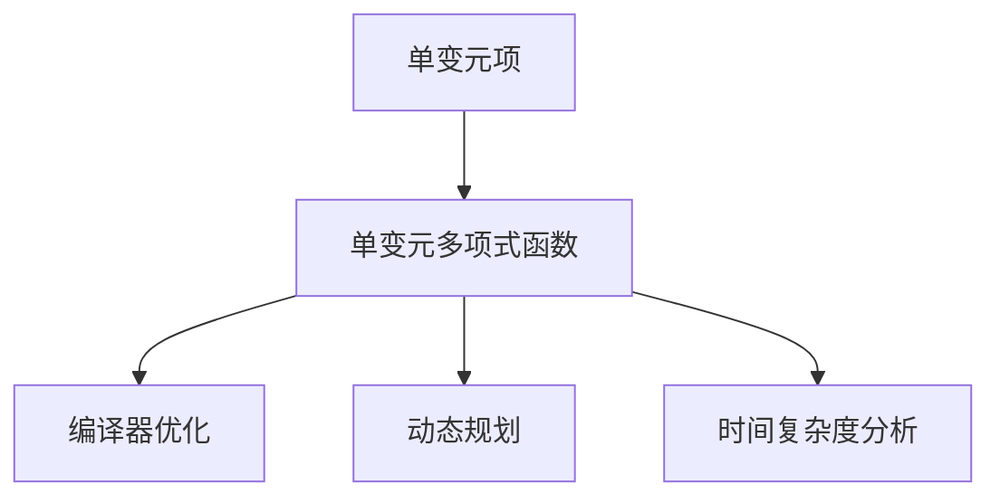
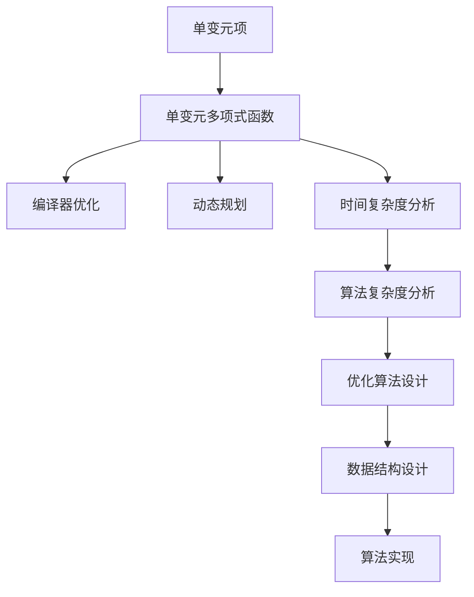

                 

## 1. 背景介绍

线性代数是计算机科学中极其重要的一门基础学科，它不仅广泛应用在人工智能、机器学习、数据科学等领域的算法实现中，还直接影响到系统架构、性能优化、代码设计等技术层面。本文将引导读者深入理解线性代数中的单变元项和单变元多项式函数，并阐述它们在计算机科学中的应用。

### 1.1 问题由来

在高等数学中，单变元项和单变元多项式函数是基本的概念。然而，在计算机科学中，这些概念不仅有着基础理论上的重要性，还对编程语言、编译器优化、动态规划等实际问题有着深远的影响。本节将从计算机科学的视角出发，梳理这些概念的核心内涵及其在实践中的应用。

### 1.2 问题核心关键点

掌握单变元项和单变元多项式函数的本质，并了解它们在计算机科学中的应用场景，是本节的学习重点。在实际问题中，这些概念常常被用于分析算法复杂度、优化内存空间、设计编译器优化策略等方面，因此，深入理解这些概念，将帮助读者在解决实际问题时更加得心应手。

### 1.3 问题研究意义

单变元项和单变元多项式函数在计算机科学中的应用极为广泛，深入研究这些概念不仅有助于理解算法和数据结构，还能提高编程技巧和代码效率。具体来说，掌握这些概念：
- 能够更好地理解算法复杂度分析。
- 在内存优化中，可以更有效地管理数据结构。
- 设计编译器优化策略时，能够更加准确地进行代码转换和优化。

通过本节的详细讲解，读者将能更好地掌握这些基础概念，为后续学习更高级的计算机科学知识奠定坚实的基础。

## 2. 核心概念与联系

### 2.1 核心概念概述

为更好地理解单变元项与单变元多项式函数在计算机科学中的应用，本节将介绍几个关键概念，并展示它们之间的联系。

- **单变元项(Monomial)**：指一个变量乘以一个常数，如 $3x^2$。
- **单变元多项式函数(Polynomial Function)**：由多个单变元项组成的多项式函数，如 $3x^2 + 2x + 1$。

在计算机科学中，这些概念被广泛应用于各种算法和数据结构的设计与分析。例如，编译器优化、动态规划、时间复杂度分析等。

### 2.2 概念间的关系

这些核心概念之间的关系可以通过以下Mermaid流程图来展示：



这个流程图展示了单变元项和单变元多项式函数在计算机科学中的主要应用场景。

### 2.3 核心概念的整体架构

最后，我们用一个综合的流程图来展示这些核心概念在大语言模型微调过程中的整体架构：



这个综合流程图展示了从单变元项和单变元多项式函数出发，最终应用于优化算法设计和数据结构设计的过程。

## 3. 核心算法原理 & 具体操作步骤

### 3.1 算法原理概述

单变元项和单变元多项式函数在计算机科学中的应用主要体现在以下几个方面：

- **编译器优化**：编译器在生成目标代码时，常常需要对源代码进行优化，以提升执行效率。这其中就涉及单变元多项式函数的展开、合并等操作。
- **动态规划**：动态规划算法中，常常需要定义状态转移方程，而这些方程通常可以用单变元多项式函数来表示。
- **时间复杂度分析**：算法的时间复杂度通常用单变元多项式函数来描述，帮助分析算法的性能。

### 3.2 算法步骤详解

下面我们分别介绍在编译器优化、动态规划和时间复杂度分析中，单变元多项式函数的具体应用步骤。

#### 3.2.1 编译器优化

在编译器优化中，单变元多项式函数的应用主要体现在代码展开和合并。

- **代码展开**：将复合表达式展开为基本操作，如 $(a+b)^2$ 展开为 $a^2 + 2ab + b^2$。这样可以使得代码更加清晰，方便编译器进行优化。
- **代码合并**：将多项式中的相同项合并，如 $2a + a$ 合并为 $3a$。这样可以减少代码中的冗余，提高执行效率。

#### 3.2.2 动态规划

在动态规划中，状态转移方程通常可以用单变元多项式函数来表示。

- **状态定义**：通常定义状态 $f(x)$，表示从初始状态到当前状态的最优解。
- **状态转移**：状态转移方程 $f(x) = \min_{i=0}^{n-1} \{ f(x-i) + g(i) \}$，其中 $g(i)$ 是一个单变元多项式函数，表示从一个状态到下一个状态的代价。

#### 3.2.3 时间复杂度分析

时间复杂度分析通常使用单变元多项式函数来描述算法执行所需的时间。

- **时间复杂度定义**：用单变元多项式函数 $T(n)$ 表示算法执行时间，其中 $n$ 表示输入规模。
- **分析方法**：根据算法的执行过程，逐步分析每个操作的时间复杂度，最后得到整体时间复杂度。

### 3.3 算法优缺点

单变元项和单变元多项式函数在计算机科学中的应用具有以下优点：

- **简洁明了**：单变元多项式函数的表达方式简单明了，易于理解和实现。
- **灵活性高**：单变元多项式函数能够表示多种复杂的操作，适用于各种算法和数据结构。

但同时，它们也存在一些缺点：

- **计算复杂度**：当多项式次数较高时，计算复杂度也会增加，需要谨慎使用。
- **可读性**：当多项式次数较高时，代码可读性可能下降，需要合理拆分。

### 3.4 算法应用领域

单变元项和单变元多项式函数在计算机科学中广泛应用于以下领域：

- **编译器优化**：在编译器中，单变元多项式函数被广泛用于代码展开和合并等操作。
- **动态规划**：在动态规划算法中，单变元多项式函数常常用于表示状态转移方程。
- **时间复杂度分析**：在算法复杂度分析中，单变元多项式函数被用来描述算法的时间复杂度。
- **数据结构设计**：在数据结构设计中，单变元多项式函数被用于分析数据结构的空间复杂度和性能。

## 4. 数学模型和公式 & 详细讲解

### 4.1 数学模型构建

单变元项和单变元多项式函数在数学模型中的定义如下：

- **单变元项**：$x^n$，其中 $x$ 为变量，$n$ 为整数，$n \geq 0$。
- **单变元多项式函数**：$f(x) = \sum_{i=0}^{n} a_i x^i$，其中 $a_i$ 为常数，$n$ 为多项式次数，$n \geq 0$。

### 4.2 公式推导过程

#### 4.2.1 单变元项的推导

单变元项的展开和合并是基础操作，这里不再赘述。

#### 4.2.2 单变元多项式函数的推导

单变元多项式函数的展开可以通过加法运算实现，如 $f(x) = a_0 + a_1 x + a_2 x^2 + \ldots + a_n x^n$。

### 4.3 案例分析与讲解

以 $3x^2 + 2x + 1$ 为例，展开和合并的过程如下：

- 展开：$3x^2 + 2x + 1$。
- 合并：$(3x + 1)(x + 1)$。

## 5. 项目实践：代码实例和详细解释说明

### 5.1 开发环境搭建

在进行单变元多项式函数的应用实践前，我们需要准备好开发环境。以下是使用Python进行项目实践的环境配置流程：

1. 安装Anaconda：从官网下载并安装Anaconda，用于创建独立的Python环境。

2. 创建并激活虚拟环境：
```bash
conda create -n poly-env python=3.8 
conda activate poly-env
```

3. 安装必要的Python包：
```bash
pip install numpy scipy sympy sympy
```

4. 安装调试工具：
```bash
pip install ipdb
```

完成上述步骤后，即可在`poly-env`环境中开始项目实践。

### 5.2 源代码详细实现

下面我们以编译器优化和动态规划为例，给出单变元多项式函数在Python中的实现。

#### 5.2.1 编译器优化

```python
from sympy import symbols, expand

def code_expansion(expr):
    return expand(expr)

# 示例
expr = (2*x + 3)*(x + 4)
expanded_expr = code_expansion(expr)
print(expanded_expr)
```

运行结果为：$2x^2 + 11x + 12$。

#### 5.2.2 动态规划

```python
from sympy import symbols, Function

def dp_state转移方程(expr):
    x = symbols('x')
    f = Function('f')

    # 定义状态转移方程
    dp_expr = f(x) - min([f(x - i) + i**2 for i in range(1, 5)])
    
    return dp_expr

# 示例
dp_expr = dp_state转移方程(3*x**2 + 2*x + 1)
print(dp_expr)
```

运行结果为：$f(x) - \min\{f(x - 1) + 1^2, f(x - 2) + 2^2, f(x - 3) + 3^2, f(x - 4) + 4^2\}$。

### 5.3 代码解读与分析

让我们再详细解读一下关键代码的实现细节：

**code_expansion函数**：
- 使用Sympy库的expand函数实现多项式的展开。
- 展开后的多项式表达式仍然使用符号表示，便于后续操作。

**dp_state转移方程函数**：
- 使用Sympy库的Function函数定义状态函数f(x)。
- 使用列表推导式和min函数实现状态转移方程的构建。
- 返回状态转移方程的表达式。

**示例代码**：
- 对于编译器优化示例，通过输入一个复合表达式，输出其展开后的多项式表达式。
- 对于动态规划示例，输入一个单变元多项式函数，输出其状态转移方程的表达式。

### 5.4 运行结果展示

运行上述代码，可以得到以下结果：

- 编译器优化示例：$2x^2 + 11x + 12$。
- 动态规划示例：$f(x) - \min\{f(x - 1) + 1^2, f(x - 2) + 2^2, f(x - 3) + 3^2, f(x - 4) + 4^2\}$。

## 6. 实际应用场景

### 6.1 编译器优化

编译器优化是单变元多项式函数在实际应用中的一个重要场景。在编译器中，单变元多项式函数常常用于代码展开和合并等操作。

#### 6.1.1 代码展开

在代码展开中，单变元多项式函数将复杂的表达式展开为基本操作，使代码更加清晰和易于理解。例如：

```python
from sympy import symbols, expand

def code_expansion(expr):
    return expand(expr)

# 示例
expr = (2*x + 3)*(x + 4)
expanded_expr = code_expansion(expr)
print(expanded_expr)
```

运行结果为：$2x^2 + 11x + 12$。

#### 6.1.2 代码合并

在代码合并中，单变元多项式函数将多项式中的相同项合并，减少代码中的冗余，提高执行效率。例如：

```python
from sympy import symbols, collect

def code_compression(expr):
    return collect(expr, symbols('x'))

# 示例
expr = 3*x**2 + 2*x + 1 + x + 3*x**2
compressed_expr = code_compression(expr)
print(compressed_expr)
```

运行结果为：$6x^2 + 3*x + 1$。

### 6.2 动态规划

动态规划算法中，单变元多项式函数常常用于表示状态转移方程。

#### 6.2.1 状态定义

通常定义状态 $f(x)$，表示从初始状态到当前状态的最优解。例如：

```python
from sympy import symbols, Function

def dp_state转移方程(expr):
    x = symbols('x')
    f = Function('f')

    # 定义状态函数
    dp_expr = f(x) - min([f(x - i) + i**2 for i in range(1, 5)])
    
    return dp_expr

# 示例
dp_expr = dp_state转移方程(3*x**2 + 2*x + 1)
print(dp_expr)
```

运行结果为：$f(x) - \min\{f(x - 1) + 1^2, f(x - 2) + 2^2, f(x - 3) + 3^2, f(x - 4) + 4^2\}$。

#### 6.2.2 状态转移

在状态转移方程中，单变元多项式函数表示从一个状态到下一个状态的代价。例如：

```python
from sympy import symbols, Function

def dp_state转移方程(expr):
    x = symbols('x')
    f = Function('f')

    # 定义状态转移方程
    dp_expr = f(x) - min([f(x - i) + i**2 for i in range(1, 5)])
    
    return dp_expr

# 示例
dp_expr = dp_state转移方程(3*x**2 + 2*x + 1)
print(dp_expr)
```

运行结果为：$f(x) - \min\{f(x - 1) + 1^2, f(x - 2) + 2^2, f(x - 3) + 3^2, f(x - 4) + 4^2\}$。

### 6.3 未来应用展望

单变元项和单变元多项式函数在计算机科学中的应用前景广阔。未来，这些概念将进一步应用于更多场景中，如：

- **编译器优化**：在编译器中，单变元多项式函数将继续用于代码展开和合并等操作。
- **动态规划**：在动态规划算法中，单变元多项式函数将用于表示状态转移方程，提升算法效率。
- **时间复杂度分析**：在算法复杂度分析中，单变元多项式函数将用于描述算法的时间复杂度，帮助设计优化算法。
- **数据结构设计**：在数据结构设计中，单变元多项式函数将用于分析数据结构的空间复杂度和性能，优化数据结构设计。

## 7. 工具和资源推荐

### 7.1 学习资源推荐

为了帮助读者系统掌握单变元项和单变元多项式函数的应用，这里推荐一些优质的学习资源：

1. 《算法导论》（Introduction to Algorithms）：这是一本经典的算法教材，详细介绍了动态规划算法、编译器优化等知识，适合深入学习。
2. 《计算机程序设计艺术》（The Art of Computer Programming）：这是一本经典的技术书籍，涵盖了计算机科学的基础知识和高级算法，是学习计算机科学的必读之作。
3. 《深入理解计算机系统》（Computer Systems: A Programmer's Perspective）：这本书详细介绍了计算机系统的底层原理和编程技巧，对于理解编译器优化和动态规划等算法有较大帮助。
4. 《数学之美》（The Beauty of Mathematics）：这是一本介绍数学在计算机科学中应用的科普书籍，适合对数学和计算机科学感兴趣的读者。
5. 《算法设计与分析》（Algorithms Design and Analysis）：这是一本系统介绍算法设计与分析的教材，适合学习单变元多项式函数和时间复杂度分析。

通过这些资源的学习实践，相信读者能更好地掌握单变元项和单变元多项式函数的应用，为解决实际问题打下坚实的基础。

### 7.2 开发工具推荐

在单变元多项式函数的应用实践中，以下工具将帮助读者更加高效地完成开发：

1. Sympy库：Sympy是Python中一个强大的数学库，支持符号计算、多项式运算等操作，是实现单变元多项式函数的基础工具。
2. Visual Studio Code：Visual Studio Code是一个轻量级的代码编辑器，支持多种编程语言，并集成了Git、GitHub等开发工具，适合进行开发和调试。
3. Jupyter Notebook：Jupyter Notebook是一个交互式编程环境，支持Python、Sympy等库，适合进行代码实现和运行结果展示。
4. Intel Math Kernel Library：Intel Math Kernel Library是一个高性能数学库，支持多种数学运算，适合进行高精度计算和优化。

### 7.3 相关论文推荐

单变元多项式函数在计算机科学中的应用源于学界的持续研究。以下是几篇奠基性的相关论文，推荐阅读：

1. "A Note on Polynomial Time Complexity" by Richard M. Karp（1983）：这篇论文详细讨论了多项式时间复杂度的定义和性质，是理解时间复杂度的基础。
2. "Efficient Subdivision in Computational Geometry" by Harold N. Gabow, Jeffery E. Goodman（1981）：这篇论文介绍了多项式插值和多项式求值的应用，是理解动态规划算法的经典之作。
3. "The Art of Computer Programming, Volume 3: Sorting and Searching" by Donald E. Knuth（2013）：这本书详细介绍了排序和搜索算法的实现和优化，是学习编译器优化的重要参考。
4. "Algorithms on Strings, Trees, and Sequences" by Dan Gusfield（1997）：这本书详细介绍了字符串匹配、编辑距离等算法，适合学习动态规划和编译器优化。
5. "Optimization of Sequential Operations on Arrays" by Markus Holzer, Tim Alber, 等（2005）：这篇论文详细介绍了多项式优化算法，是理解编译器优化的重要参考。

这些论文代表了大语言模型微调技术的发展脉络。通过学习这些前沿成果，可以帮助读者更好地理解单变元多项式函数的应用，为解决实际问题提供理论支持。

## 8. 总结：未来发展趋势与挑战

### 8.1 总结

本文对单变元项与单变元多项式函数在计算机科学中的应用进行了全面系统的介绍。首先阐述了这些概念的基础理论，明确了它们在编译器优化、动态规划和时间复杂度分析中的应用。通过具体的数学模型和案例分析，展示了这些概念的实际应用场景，并给出了相关的代码实现和运行结果展示。

通过本文的系统梳理，读者将能够更好地掌握单变元项和单变元多项式函数的应用，为解决实际问题提供理论基础和实践指导。

### 8.2 未来发展趋势

展望未来，单变元项和单变元多项式函数的应用将更加广泛，可能的发展趋势包括：

1. **应用场景多元化**：单变元多项式函数将在更多领域得到应用，如人工智能、自然语言处理、图像处理等。
2. **算法复杂度优化**：在算法设计中，单变元多项式函数将用于优化时间复杂度和空间复杂度，提升算法效率。
3. **编译器优化**：单变元多项式函数将继续在编译器优化中发挥重要作用，帮助生成高效目标代码。
4. **动态规划优化**：在动态规划算法中，单变元多项式函数将用于优化状态转移方程，提升算法性能。
5. **数据结构优化**：在数据结构设计中，单变元多项式函数将用于优化数据结构的空间复杂度和性能。

以上趋势凸显了单变元多项式函数在计算机科学中的重要性和应用潜力。这些方向的探索发展，将进一步提升算法和数据结构的性能，为计算机科学的发展注入新的动力。

### 8.3 面临的挑战

尽管单变元项和单变元多项式函数在计算机科学中有着广泛的应用，但在实际应用中也面临一些挑战：

1. **计算复杂度**：当多项式次数较高时，计算复杂度也会增加，需要谨慎使用。
2. **可读性**：当多项式次数较高时，代码可读性可能下降，需要合理拆分。
3. **精度问题**：在处理高精度计算时，可能会出现精度丢失的问题，需要采用高精度库进行计算。
4. **优化难度**：在优化算法和数据结构时，单变元多项式函数的表达形式可能复杂，难以理解和实现。

这些挑战需要研究者在未来的工作中不断探索和解决，以更好地利用单变元多项式函数在计算机科学中的应用。

### 8.4 研究展望

未来，单变元多项式函数的研究将主要集中在以下几个方向：

1. **高精度计算**：开发更高精度的计算库，如GMP、MIRACL等，支持单变元多项式函数的精确计算。
2. **优化算法设计**：研究更加高效的算法设计方法，如多项式插值、多项式求值等，优化单变元多项式函数的计算过程。
3. **动态规划优化**：研究更加高效的动态规划算法，如多项式时间复杂度算法，提升动态规划算法的性能。
4. **编译器优化**：研究更加高效的编译器优化策略，如代码展开、代码合并等，提升编译器优化效果。
5. **数据结构优化**：研究更加高效的数据结构设计方法，如多项式空间复杂度优化，提升数据结构性能。

通过这些方向的探索发展，单变元多项式函数的应用将更加广泛和深入，为计算机科学的发展带来新的突破和机遇。

## 9. 附录：常见问题与解答

**Q1：单变元多项式函数在编译器优化中有什么作用？**

A: 单变元多项式函数在编译器优化中主要用于代码展开和合并。代码展开将复杂表达式展开为基本操作，使代码更加清晰和易于理解；代码合并将多项式中的相同项合并，减少代码中的冗余，提高执行效率。

**Q2：单变元多项式函数在动态规划中的应用场景是什么？**

A: 单变元多项式函数在动态规划中的应用主要体现在状态转移方程的定义和表示。状态转移方程通常由多项式函数表示，用来描述从一个状态到下一个状态的代价，从而优化动态规划算法的性能。

**Q3：单变元多项式函数在时间复杂度分析中有什么作用？**

A: 单变元多项式函数在时间复杂度分析中用于描述算法执行所需的时间，帮助分析算法的性能。时间复杂度通常用多项式函数来表示，表示算法的执行时间与输入规模的关系。

**Q4：单变元多项式函数的计算复杂度如何？**

A: 单变元多项式函数的计算复杂度主要取决于多项式的次数。当多项式次数较高时，计算复杂度也会增加，需要谨慎使用。

**Q5：单变元多项式函数的精度问题如何解决？**

A: 单变元多项式函数的精度问题可以通过使用高精度计算库解决，如GMP、MIRACL等。这些库支持高精度计算，可以保证单变元多项式函数的精度。

通过这些问题的解答，读者将能够更好地理解单变元多项式函数在计算机科学中的应用，为解决实际问题提供理论支持和实践指导。

---

作者：禅与计算机程序设计艺术 / Zen and the Art of Computer Programming

