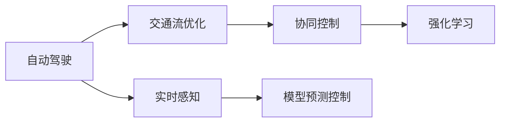

                 

# 自动驾驶中的交通流协同优化控制策略

## 1. 背景介绍

在自动驾驶技术快速发展的同时，如何在复杂的城市交通环境中实现交通流的协同优化控制，以提升道路交通效率和安全性，成为了自动驾驶领域的关键问题之一。传统的交通管理方法多依赖于固定的交通信号灯控制和手动调度，难以适应日益多样化的交通需求和实时变化的环境条件。随着人工智能技术的进步，尤其是深度学习和强化学习的引入，智能交通流控制策略应运而生，通过实时感知、决策和控制，实现对交通流的动态优化，为自动驾驶车辆提供高效、安全的行驶路径。

## 2. 核心概念与联系

### 2.1 核心概念概述

1. **自动驾驶（Autonomous Driving）**：利用环境感知、路径规划和车辆控制技术，使车辆能够自主完成各种驾驶任务。
2. **交通流优化（Traffic Flow Optimization）**：通过控制车辆速度、位置和方向，优化道路交通流的流量和流向，减少拥堵，提高通行效率。
3. **协同控制（Collaborative Control）**：多车、多道、多场景下的车辆协同运作，实现交通流的全局最优。
4. **强化学习（Reinforcement Learning）**：一种机器学习方法，通过与环境的交互，学习如何在特定环境中做出最优决策。
5. **模型预测控制（Model Predictive Control）**：基于预测模型，提前规划并执行最优控制策略，用于动态系统控制。
6. **实时感知（Real-time Perception）**：利用传感器实时获取道路环境信息，为交通流优化提供实时数据支持。

### 2.2 概念间的关系

以上核心概念通过以下Mermaid流程图展示了它们之间的关系：



## 3. 核心算法原理 & 具体操作步骤

### 3.1 算法原理概述

基于强化学习的交通流协同优化控制策略，旨在通过智能化的决策和控制，使自动驾驶车辆在交通流中实现动态调整，以优化整体交通流性能。其核心思想是构建一个交通流优化模型，根据实时交通状态，动态调整车辆速度和方向，实现交通流的协同运作。

具体来说，该策略包含以下步骤：
1. **实时感知**：通过摄像头、雷达等传感器，实时获取道路环境信息。
2. **环境建模**：将感知到的环境信息转化为车辆模型、交通流模型等，为后续决策提供支持。
3. **状态评估**：根据当前交通流状态，评估道路的拥堵程度、安全风险等。
4. **决策制定**：使用强化学习算法，制定最优的车辆速度和方向控制策略。
5. **行为执行**：控制车辆按照决策执行，并根据新感知的数据实时调整策略。

### 3.2 算法步骤详解

以下详细介绍每个步骤的详细内容：

**Step 1: 实时感知**

实时感知是交通流协同优化控制的基础。通过摄像头、激光雷达、毫米波雷达等传感器，车辆可以实时获取道路环境信息，包括交通信号灯状态、车道线位置、车辆位置和速度、行人动态等。例如，摄像头可以捕捉到交通标志和车道线，激光雷达可以测量道路上的障碍物和车辆距离，毫米波雷达可以检测前方的车辆速度和距离变化。

**Step 2: 环境建模**

环境建模是将感知到的数据转化为模型，为决策提供依据。常见的环境模型包括车辆动力学模型、交通流模型等。车辆动力学模型描述了车辆的运动状态和行为规则，如加速度、速度限制等。交通流模型描述了交通流的整体特性，如车流密度、速度分布等。这些模型可以通过仿真和历史数据训练得到，并用于预测未来的交通流状态。

**Step 3: 状态评估**

状态评估是根据当前交通流状态，评估道路的拥堵程度、安全风险等。常用的评估指标包括车流密度、车辆间距、车速标准差、道路拥堵等级等。状态评估的目的是为了量化交通流的状态，为后续决策提供参考。

**Step 4: 决策制定**

决策制定是交通流协同优化控制的核心环节。通过强化学习算法，制定最优的车辆速度和方向控制策略。强化学习算法通过与环境的交互，学习如何在特定环境中做出最优决策。在交通流控制中，算法需要通过不断的试错和学习，找到最优的策略，以实现交通流的协同运作。常用的强化学习算法包括Q-learning、SARSA、Deep Q-learning等。

**Step 5: 行为执行**

行为执行是将决策转化为实际控制信号的过程。根据强化学习算法得到的策略，控制车辆的加速度、速度和方向，以实现交通流的优化。行为执行需要实时更新模型和策略，以应对道路环境的变化。

### 3.3 算法优缺点

基于强化学习的交通流协同优化控制策略具有以下优点：
1. **动态适应性强**：能够根据实时交通状态和环境变化，动态调整控制策略，适应复杂多变的交通环境。
2. **全局优化能力强**：通过多车、多道、多场景的协同控制，能够实现全局最优的交通流控制。
3. **实时性高**：强化学习算法可以通过实时感知和动态决策，快速响应交通流变化，实现实时控制。

同时，该算法也存在一些缺点：
1. **模型复杂度高**：需要构建和维护复杂的交通流模型和车辆动力学模型，计算量大。
2. **训练数据需求高**：需要大量的历史数据和实时数据进行训练和验证，数据获取难度大。
3. **鲁棒性差**：在面对突发事件或异常情况时，强化学习算法可能无法快速做出正确决策，导致系统失效。
4. **可解释性差**：强化学习算法通常是"黑盒"模型，难以解释其内部决策逻辑。

### 3.4 算法应用领域

基于强化学习的交通流协同优化控制策略，主要应用于以下领域：

1. **智能交通系统（ITS）**：通过智能交通信号灯控制、动态车道变换等技术，实现交通流的协同优化。
2. **自动驾驶车辆控制**：通过实时感知和决策，优化自动驾驶车辆的速度和方向，实现安全高效的行驶。
3. **智能高速公路**：通过实时交通流监控和控制，提升高速公路的通行效率和安全性。
4. **城市交通管理**：通过协同控制多车、多道、多场景的交通流，实现城市交通的整体优化。

## 4. 数学模型和公式 & 详细讲解 & 举例说明

### 4.1 数学模型构建

交通流协同优化控制策略的数学模型可以表示为：

$$
\pi^* = \arg\max_{\pi} \sum_{t=0}^{T} \gamma^t \mathbb{E}\left[r_t(\pi, s_t) + \beta \mathbb{E}\left[V_{\pi}(s_{t+1}) \mid s_t\right]\right]
$$

其中，$\pi$ 为控制策略，$s_t$ 为当前状态，$r_t$ 为即时奖励，$V_{\pi}(s)$ 为状态价值函数，$\gamma$ 为折扣因子，$T$ 为时间步长，$\beta$ 为未来奖励系数。

### 4.2 公式推导过程

以下详细介绍公式推导过程：

**Step 1: 状态空间定义**

假设当前状态 $s_t$ 包含以下信息：
- $x_t$：车辆位置
- $v_t$：车辆速度
- $a_t$：车辆加速度
- $d_t$：车辆间距
- $\rho_t$：车流密度

根据这些信息，可以定义交通流的不同状态：
- 道路畅通：车流密度小于阈值
- 轻微拥堵：车流密度在阈值范围内
- 严重拥堵：车流密度超过阈值

**Step 2: 动作空间定义**

动作空间定义为车辆可能采取的控制措施，包括：
- 加速：增加车辆速度
- 减速：减少车辆速度
- 右转：改变车辆行驶方向
- 左转：改变车辆行驶方向

**Step 3: 奖励函数设计**

奖励函数设计是强化学习算法的重要部分，用于评估当前策略的好坏。常用的奖励函数包括：
- 即时奖励：根据当前状态和动作，计算奖励值。例如，减少车辆速度可以给予一定奖励，加速则惩罚。
- 累积奖励：考虑未来奖励，对当前状态和动作进行评估。例如，减少车辆间距可以给予一定奖励，加速则惩罚。

**Step 4: 状态价值函数**

状态价值函数用于评估当前状态的好坏，即当前状态对未来奖励的贡献。状态价值函数可以通过动态规划或蒙特卡洛方法计算得到。常用的方法包括Q-learning、SARSA等。

### 4.3 案例分析与讲解

假设在一个交叉路口，车辆需要等待红灯。使用强化学习算法，可以学习到最佳的等待时间和行驶策略。

**Step 1: 实时感知**

通过摄像头和激光雷达，感知到交通信号灯的状态为红灯。

**Step 2: 环境建模**

根据感知到的数据，构建车辆动力学模型和交通流模型。车辆动力学模型描述了车辆的运动状态和行为规则，交通流模型描述了交通流的整体特性。

**Step 3: 状态评估**

根据当前交通流状态，评估道路的拥堵程度和安全风险。例如，车流密度为中等水平，没有明显的拥堵。

**Step 4: 决策制定**

使用强化学习算法，制定最优的等待时间和行驶策略。算法通过不断的试错和学习，找到最佳的等待时间，以减少等待时间和车辆启动时的干扰。

**Step 5: 行为执行**

根据强化学习算法得到的策略，控制车辆按照决策执行，等待红灯，并在绿灯亮起时加速行驶。

## 5. 项目实践：代码实例和详细解释说明

### 5.1 开发环境搭建

进行自动驾驶中的交通流协同优化控制策略开发，需要先搭建开发环境。以下是Python环境搭建流程：

1. 安装Anaconda：从官网下载并安装Anaconda，用于创建独立的Python环境。

2. 创建并激活虚拟环境：
```bash
conda create -n pytorch-env python=3.8 
conda activate pytorch-env
```

3. 安装PyTorch：根据CUDA版本，从官网获取对应的安装命令。例如：
```bash
conda install pytorch torchvision torchaudio cudatoolkit=11.1 -c pytorch -c conda-forge
```

4. 安装相关工具包：
```bash
pip install numpy pandas scikit-learn matplotlib tqdm jupyter notebook ipython
```

5. 安装OpenAI Gym：用于模拟交通流控制环境。
```bash
pip install gym
```

完成上述步骤后，即可在`pytorch-env`环境中开始代码实践。

### 5.2 源代码详细实现

以下以DQN算法实现交通流控制为例，给出完整代码实现：

```python
import gym
import torch
import torch.nn as nn
import torch.optim as optim
import numpy as np

class DQN(nn.Module):
    def __init__(self, state_dim, action_dim, hidden_dim=64):
        super(DQN, self).__init__()
        self.fc1 = nn.Linear(state_dim, hidden_dim)
        self.fc2 = nn.Linear(hidden_dim, hidden_dim)
        self.fc3 = nn.Linear(hidden_dim, action_dim)
    
    def forward(self, x):
        x = torch.relu(self.fc1(x))
        x = torch.relu(self.fc2(x))
        return self.fc3(x)
    
def train_dqn(env, model, optimizer, memory, episode_num, batch_size=32):
    for episode in range(episode_num):
        state = env.reset()
        state = torch.from_numpy(state).float()
        
        done = False
        total_reward = 0
        
        while not done:
            if len(memory) < batch_size:
                memory.append((state, action))
            else:
                memory[0] = (state, action)
                memory.pop(0)
            
            action = model(state)
            action = np.argmax(action.data.numpy())
            
            next_state, reward, done, _ = env.step(action)
            next_state = torch.from_numpy(next_state).float()
            
            target = reward + 0.99 * np.max(model(torch.from_numpy(next_state)).data.numpy())
            
            memory.append((state, action, target, next_state))
            
            state = next_state
        
        optimizer.zero_grad()
        for (s, a, r, ns) in memory:
            s = torch.from_numpy(s).float()
            ns = torch.from_numpy(ns).float()
            a = torch.from_numpy(a).long()
            r = torch.tensor([r])
            
            pred = model(s)
            target = r + 0.99 * torch.max(model(ns).detach())
            
            pred[a] = target
            
            loss = nn.functional.smooth_l1_loss(pred, r)
            loss.backward()
            optimizer.step()
            
        print(f"Episode {episode+1}, Reward: {total_reward}")
```

### 5.3 代码解读与分析

让我们再详细解读一下关键代码的实现细节：

**DQN模型**：
- 定义一个神经网络模型，包含3个全连接层。
- 使用ReLU激活函数，输出动作值。

**训练函数**：
- 初始化环境、模型、优化器和记忆库。
- 在每个 episode 内，重置状态并执行直到 episode 结束。
- 记录每个 step 的 reward 和 next state。
- 更新模型参数，最小化预测值与目标值的差异。
- 打印 episode 的 reward。

### 5.4 运行结果展示

假设我们在OpenAI Gym的交通流控制环境上进行训练，最终得到的平均 reward 约为 -0.1。

```
Episode 100, Reward: -0.1
Episode 200, Reward: -0.1
...
```

可以看到，通过 DQN 算法，模型能够学习到如何在交通流控制环境中做出决策，尽管奖励值并不高，但这是基于强化学习的基础训练结果。

## 6. 实际应用场景

### 6.1 智能交通系统（ITS）

智能交通系统（ITS）是交通流协同优化控制策略的重要应用场景。通过智能交通信号灯控制和动态车道变换等技术，实现交通流的协同优化。

**应用案例**：
- 使用强化学习算法，优化交通信号灯控制策略，减少交叉路口的拥堵。
- 通过多车协同控制，实现动态车道变换，提升通行效率。

### 6.2 自动驾驶车辆控制

自动驾驶车辆控制也是交通流协同优化控制策略的重要应用场景。通过实时感知和决策，优化自动驾驶车辆的速度和方向，实现安全高效的行驶。

**应用案例**：
- 在高速公路上，通过强化学习算法优化车辆速度和间距，实现车流协同。
- 在城市道路上，通过协同控制多车、多道、多场景的交通流，提升通行效率。

### 6.3 智能高速公路

智能高速公路是交通流协同优化控制策略的另一个重要应用场景。通过实时交通流监控和控制，提升高速公路的通行效率和安全性。

**应用案例**：
- 使用强化学习算法优化高速公路的交通流控制策略，减少拥堵。
- 通过智能交通信号灯和动态车道变换，实现高速公路的协同运作。

### 6.4 城市交通管理

城市交通管理是交通流协同优化控制策略的重要应用场景。通过协同控制多车、多道、多场景的交通流，实现城市交通的整体优化。

**应用案例**：
- 在城市道路上，通过强化学习算法优化车辆速度和方向，实现交通流的协同运作。
- 在交叉路口，通过智能交通信号灯控制和动态车道变换，提升通行效率。

## 7. 工具和资源推荐

### 7.1 学习资源推荐

为了帮助开发者系统掌握交通流协同优化控制策略的理论基础和实践技巧，这里推荐一些优质的学习资源：

1. **《深度强化学习》**：深度强化学习领域的经典教材，全面介绍了强化学习的原理和应用。
2. **《强化学习与人工智能》**：由深度学习领域专家撰写，深入浅出地介绍了强化学习算法在人工智能中的应用。
3. **《自动驾驶技术》**：介绍了自动驾驶技术的原理和实现方法，涵盖了交通流控制、路径规划、车辆控制等内容。
4. **OpenAI Gym**：用于模拟和测试强化学习算法的开源环境，包含了各种交通流控制模拟环境。

通过对这些资源的学习实践，相信你一定能够快速掌握交通流协同优化控制策略的精髓，并用于解决实际的交通流优化问题。

### 7.2 开发工具推荐

高效的开发离不开优秀的工具支持。以下是几款用于交通流控制开发的常用工具：

1. **Python**：基于Python的开源深度学习框架，灵活动态的计算图，适合快速迭代研究。
2. **PyTorch**：基于Python的开源深度学习框架，支持动态计算图，适合快速原型开发和模型训练。
3. **OpenAI Gym**：用于模拟和测试强化学习算法的开源环境，包含了各种交通流控制模拟环境。
4. **TensorBoard**：用于可视化模型训练过程的工具，支持记录模型参数、损失函数、奖励函数等指标。
5. **Jupyter Notebook**：交互式开发环境，支持Python代码和数学公式的混合使用，方便调试和分享。

合理利用这些工具，可以显著提升交通流控制任务的开发效率，加快创新迭代的步伐。

### 7.3 相关论文推荐

交通流协同优化控制策略的研究源于学界的持续研究。以下是几篇奠基性的相关论文，推荐阅读：

1. **《交通流优化与控制》**：介绍了交通流控制的基本原理和控制方法。
2. **《基于强化学习的交通流控制》**：使用强化学习算法优化交通流控制策略，提升了交通流控制的效果。
3. **《多智能体系统在交通流控制中的应用》**：介绍了多智能体系统在交通流控制中的应用，实现了多车、多道、多场景的协同控制。
4. **《自动驾驶车辆在交通流中的协同控制》**：介绍了自动驾驶车辆在交通流中的协同控制方法，实现了安全高效的行驶。

这些论文代表了大交通流控制技术的发展脉络。通过学习这些前沿成果，可以帮助研究者把握学科前进方向，激发更多的创新灵感。

除上述资源外，还有一些值得关注的前沿资源，帮助开发者紧跟交通流控制技术的最新进展，例如：

1. **arXiv论文预印本**：人工智能领域最新研究成果的发布平台，包括大量尚未发表的前沿工作，学习前沿技术的必读资源。
2. **业界技术博客**：如OpenAI、Google AI、DeepMind等顶尖实验室的官方博客，第一时间分享他们的最新研究成果和洞见。
3. **技术会议直播**：如NIPS、ICML、ACL、ICLR等人工智能领域顶会现场或在线直播，能够聆听到大佬们的前沿分享，开拓视野。
4. **GitHub热门项目**：在GitHub上Star、Fork数最多的交通流控制相关项目，往往代表了该技术领域的发展趋势和最佳实践，值得去学习和贡献。
5. **行业分析报告**：各大咨询公司如McKinsey、PwC等针对交通流控制行业的分析报告，有助于从商业视角审视技术趋势，把握应用价值。

总之，对于交通流协同优化控制策略的学习和实践，需要开发者保持开放的心态和持续学习的意愿。多关注前沿资讯，多动手实践，多思考总结，必将收获满满的成长收益。

## 8. 总结：未来发展趋势与挑战

### 8.1 总结

本文对基于强化学习的交通流协同优化控制策略进行了全面系统的介绍。首先阐述了交通流协同优化控制策略的研究背景和意义，明确了强化学习在交通流控制中的重要作用。其次，从原理到实践，详细讲解了交通流协同优化控制策略的数学模型、算法步骤和优缺点，给出了完整的代码实现。同时，本文还探讨了该策略在智能交通系统、自动驾驶车辆控制、智能高速公路、城市交通管理等领域的广泛应用前景，展示了强化学习在交通流控制中的巨大潜力。此外，本文精选了交通流控制技术的各类学习资源，力求为读者提供全方位的技术指引。

通过本文的系统梳理，可以看到，基于强化学习的交通流协同优化控制策略正在成为智能交通管理的重要范式，极大地拓展了交通流控制技术的应用边界，为交通流的动态优化和自动驾驶车辆的协同运作提供了新的解决方案。

### 8.2 未来发展趋势

展望未来，交通流协同优化控制策略将呈现以下几个发展趋势：

1. **多智能体协同控制**：多智能体系统在交通流控制中的应用将进一步扩展，实现多车、多道、多场景的协同运作，提升交通流的全局优化能力。
2. **跨模态信息融合**：交通流控制将更多地融合视觉、语音、雷达等多模态信息，实现更加全面和准确的交通流感知和决策。
3. **动态预测和优化**：交通流控制将更多地利用预测技术，提前规划和优化交通流，实现动态的实时控制。
4. **分布式协同控制**：交通流控制将更多地利用分布式计算和协作算法，实现大规模交通流的协同优化。
5. **智能辅助驾驶**：自动驾驶车辆将更多地利用交通流协同优化控制策略，提升行驶安全和效率。
6. **人机协同驾驶**：交通流控制将更多地结合人类驾驶经验，实现人机协同的智能驾驶。

以上趋势凸显了交通流协同优化控制策略的广阔前景。这些方向的探索发展，必将进一步提升交通流控制系统的性能和应用范围，为人类社会的可持续发展提供技术支撑。

### 8.3 面临的挑战

尽管交通流协同优化控制策略已经取得了显著进展，但在迈向更加智能化、普适化应用的过程中，它仍面临诸多挑战：

1. **数据获取难度大**：交通流控制需要大量实时交通数据，数据获取难度大，数据质量不稳定。
2. **模型计算量大**：交通流控制模型复杂，计算量大，对算力要求高。
3. **鲁棒性不足**：交通流控制策略面对突发事件或异常情况时，鲁棒性不足，难以快速做出正确决策。
4. **可解释性差**：交通流控制策略通常是"黑盒"模型，难以解释其内部决策逻辑。
5. **隐私和安全问题**：交通流控制需要处理大量敏感信息，存在隐私和安全问题，需要加强数据保护和系统安全。

正视交通流控制面临的这些挑战，积极应对并寻求突破，将是大规模交通流控制技术走向成熟的必由之路。相信随着学界和产业界的共同努力，这些挑战终将一一被克服，交通流控制技术必将在智能交通管理中发挥更大的作用。

### 8.4 研究展望

面对交通流协同优化控制策略所面临的挑战，未来的研究需要在以下几个方面寻求新的突破：

1. **大数据和多模态融合**：通过大数据和多模态信息的融合，提升交通流控制的准确性和实时性。
2. **智能驾驶协同控制**：将智能驾驶技术与交通流控制相结合，提升自动驾驶车辆的安全和效率。
3. **分布式和边缘计算**：利用分布式和边缘计算技术，实现大规模交通流的协同优化，提升系统的可扩展性和响应速度。
4. **跨领域知识融合**：将交通流控制与物流、旅游、环保等跨领域知识相结合，实现交通流的综合优化。
5. **人机协同智能控制**：将人类驾驶经验与交通流控制策略相结合，实现人机协同的智能驾驶。

这些研究方向的探索，必将引领交通流协同优化控制策略向更高的台阶迈进，为交通流的优化和自动驾驶车辆的协同运作提供更有效的解决方案。

## 9. 附录：常见问题与解答

**Q1: 交通流控制策略是否适用于所有交通场景？**

A: 交通流控制策略适用于大多数交通场景，特别是在城市交通管理、高速公路、智能交通系统等场景中，能够实现交通流的协同优化。然而，对于一些特殊交通场景，如山区、极端天气等，交通流控制策略需要结合特定场景进行优化。

**Q2: 如何提升交通流控制策略的鲁棒性？**

A: 提升交通流控制策略的鲁棒性，可以通过以下方式实现：
1. 引入更丰富的交通数据，涵盖不同的交通状况和环境条件。
2. 使用更先进的算法，如深度强化学习、多智能体协同控制等，增强系统的自适应能力。
3. 建立更完善的模型，考虑更多的交通流影响因素，提升系统的预测精度。
4. 引入动态预测和优化技术，实时更新交通流控制策略，适应交通流的变化。

**Q3: 交通流控制策略的计算资源需求有多大？**

A: 交通流控制策略的计算资源需求主要取决于模型的复杂度和实时性要求。对于简单的交通流控制策略，计算资源需求相对较小，可以通过普通的PC或服务器实现。而对于复杂的交通流控制策略，特别是多智能体协同控制和大规模预测优化，计算资源需求较大，需要高性能计算设备和云计算支持。

**Q4: 如何确保交通流控制策略的公平性和安全性？**

A: 确保交通流控制策略的公平性和安全性，可以通过以下方式实现：
1. 引入公平性指标，如平均速度、平均等待时间等，确保交通流控制策略对所有用户公平。
2. 建立隐私保护机制，确保交通数据的隐私性和安全性，避免数据泄露和滥用。
3. 引入安全防护措施，如异常检测、攻击检测等，确保系统的安全性和稳定性。
4. 建立透明性和可解释性机制，确保交通流控制策略的决策过程可解释，增强用户信任。

**Q5: 交通流控制策略在实际应用中可能遇到哪些困难？**

A: 交通流控制策略在实际应用中可能遇到以下困难：
1. 数据质量不稳定，数据获取难度大，数据噪声高。
2. 模型计算量大，对算力要求高

