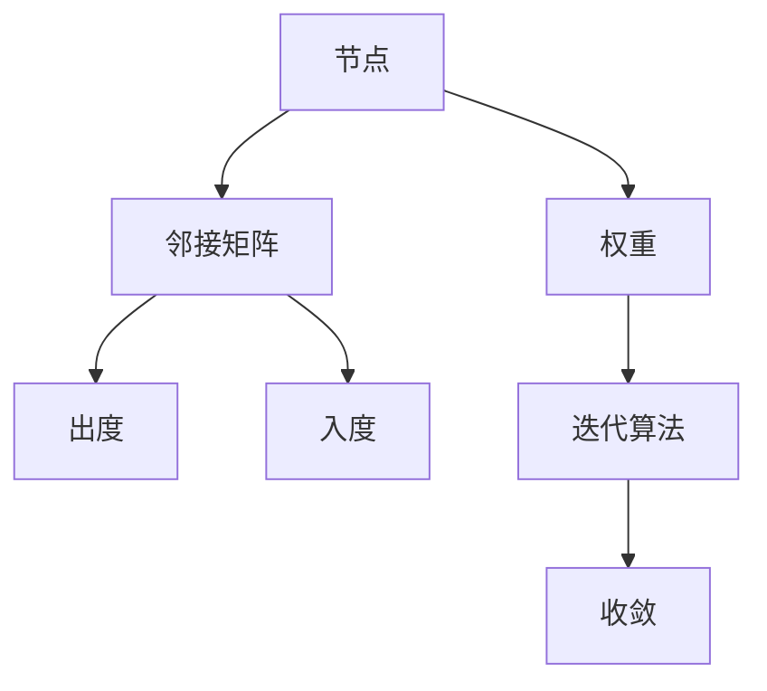
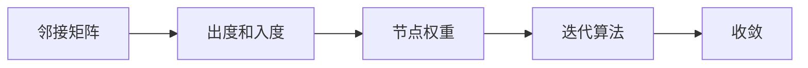
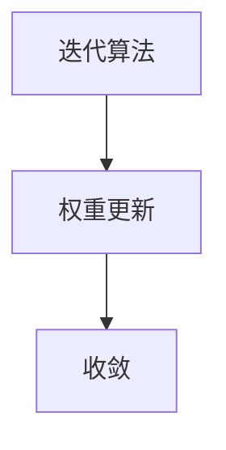
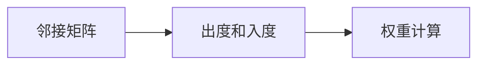
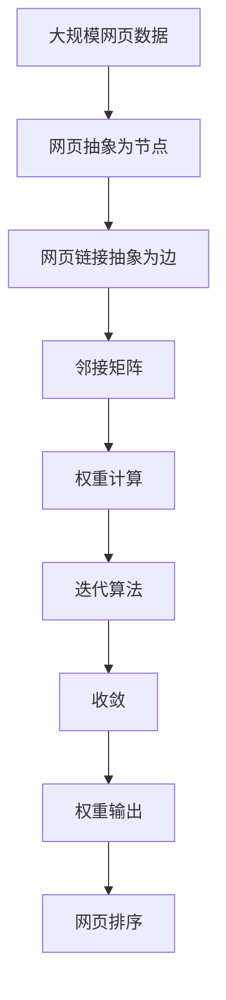

                 

## 1. 背景介绍

### 1.1 问题由来

Google的崛起，离不开其核心的创新技术PageRank。PageRank不仅深刻改变了互联网的搜索生态，更成为了网页排序的行业标准。从字面上看，PageRank指的是网页的排名，但深入挖掘，PageRank实际上是一种图算法，用于计算网页的权重，从而确定其在搜索结果中的顺序。

PageRank由Google联合创始人之一Larry Page提出，并在1998年的第一篇关于搜索引擎的论文中详细阐述。如今，PageRank的思想已经广泛渗透到各种应用场景，包括社交网络、推荐系统、知识图谱等。

### 1.2 问题核心关键点

PageRank的核心思想非常简单：一个网页的权重不仅取决于其自身的内容质量，还取决于其指向其他网页的链接数量和质量。这个思想被形式化为一个迭代算法，通过不断更新网页的权重，达到稳定收敛，即每个网页的权重都不再变化。

PageRank算法的基本思路如下：
1. 将网页抽象为节点，将网页之间的链接抽象为边。
2. 对节点进行权值初始化，一般设定为相同的值。
3. 迭代计算节点权重，根据节点指向的节点个数和这些节点的权重，更新节点的权重。
4. 当节点的权重不再变化时，迭代结束。

PageRank算法能够自发地对网页进行排序，既不需要人工标注，也不需要额外的标签，算法本身自带评估标准。其重要性在于它将网页权重计算与排序自然融合，使得Google能够提供一个无须人工干预、动态更新的搜索引擎。

### 1.3 问题研究意义

研究PageRank算法不仅有助于理解其背后的数学原理和算法设计，更能够深入理解互联网的基本结构和链接传播的规律，对于开发更好的网页排序和推荐系统具有重要意义。

此外，PageRank的思想能够应用于其他网络、图谱等结构数据中，例如社交网络、知识图谱、关系图谱等。通过应用PageRank算法，可以有效识别关键节点、预测节点间的关系等。

## 2. 核心概念与联系

### 2.1 核心概念概述

为更好地理解PageRank算法，本节将介绍几个密切相关的核心概念：

- 图（Graph）：由节点和边组成，用于描述节点之间的联系。
- 权重（Weight）：节点（网页、节点等）的重要程度，反映了其在图谱中的影响力。
- 邻接矩阵（Adjacency Matrix）：表示图中各节点间的关系，矩阵中的每个元素表示两个节点之间的连接关系。
- 出度（Out-degree）：指从某个节点出发的边的数量。
- 入度（In-degree）：指指向某个节点的边的数量。
- 迭代算法（Iterative Algorithm）：通过反复迭代逐步逼近真实结果的算法。
- 收敛（Convergence）：迭代过程中，算法逐渐接近其稳定值。

这些核心概念之间的逻辑关系可以通过以下Mermaid流程图来展示：



这个流程图展示了大语言模型微调过程中各个核心概念的关系和作用：

1. 节点和权重构成图的各个部分。
2. 邻接矩阵用于描述节点间的连接关系。
3. 出度和入度用于计算节点的权重。
4. 迭代算法通过不断更新权重，逐步逼近稳定的权重值。
5. 收敛指算法迭代过程中逐渐接近最终结果。

### 2.2 概念间的关系

这些核心概念之间存在着紧密的联系，形成了PageRank算法的完整生态系统。下面我通过几个Mermaid流程图来展示这些概念之间的关系。

#### 2.2.1 PageRank算法的基本框架



这个流程图展示了PageRank算法的核心逻辑流程：通过计算邻接矩阵的出度和入度，初始化节点权重，通过迭代算法逐步计算权重并逼近稳定值。

#### 2.2.2 迭代算法与收敛的关系



这个流程图展示了迭代算法如何通过权重更新达到收敛。

#### 2.2.3 邻接矩阵与权重计算



这个流程图展示了邻接矩阵如何通过出度和入度计算权重。

### 2.3 核心概念的整体架构

最后，我们用一个综合的流程图来展示这些核心概念在大语言模型微调过程中的整体架构：



这个综合流程图展示了从原始网页数据到权重输出，再经过排序的过程。通过这些核心概念，我们可以更好地把握PageRank算法的整体流程和应用范围。

## 3. 核心算法原理 & 具体操作步骤
### 3.1 算法原理概述

PageRank算法的基本原理是通过迭代计算网页权重，达到稳定收敛，即每个网页的权重不再变化。算法的基本思路如下：

1. 初始化所有网页的权重为1。
2. 对于每个网页，计算其指向的网页的权重总和。
3. 对于每个网页，计算其权重为指向的网页权重总和的倒数。
4. 对于每个网页，计算其权重为指向的网页权重总和的倒数，并乘以一个衰减因子 $0<d<1$，以避免无限循环。
5. 重复步骤2至4，直至所有网页的权重不再变化。

通过这个过程，PageRank算法能够自动给每个网页赋予一个权重，用于衡量其在网页链接结构中的重要性。权重越高的网页，在搜索结果中的排名越靠前。

### 3.2 算法步骤详解

PageRank算法的详细步骤如下：

1. **邻接矩阵构建**：构建网页之间的邻接矩阵，矩阵中的每个元素表示两个网页之间是否有链接，1表示有链接，0表示没有链接。

2. **权重计算**：初始化所有网页的权重为1。然后，对于每个网页，计算其指向的网页的权重总和。

3. **权重更新**：对于每个网页，计算其权重为指向的网页权重总和的倒数，并乘以一个衰减因子 $d$，以避免无限循环。

4. **迭代计算**：重复步骤2和3，直至所有网页的权重不再变化。

5. **权重输出**：输出所有网页的权重，按照权重大小进行排序，即可得到最终的网页排序结果。

下面，我们将通过具体的Python代码，来演示PageRank算法的实现。

### 3.3 算法优缺点

PageRank算法的优点如下：

1. 简单高效：算法思想直观，实现简单，易于理解和实现。
2. 自动排序：算法通过计算网页权重，自动对网页进行排序，无需人工干预。
3. 自适应性：算法能够适应网络结构的变化，自动调整网页权重。

PageRank算法的缺点如下：

1. 对初始值敏感：算法初始化所有网页权重为1，可能导致一些权重值过大或过小，影响最终结果。
2. 可能陷入局部最优：算法存在局部最优解，可能无法找到全局最优解。
3. 计算复杂度高：邻接矩阵的规模往往较大，计算复杂度较高，需要优化算法以提高效率。

尽管存在这些缺点，但PageRank算法仍然是网页排序的经典方法，具有广泛的应用价值。

### 3.4 算法应用领域

PageRank算法不仅仅局限于网页排序，更广泛应用于以下领域：

- 社交网络分析：通过计算社交网络中各节点（用户）的权重，可以识别出关键用户、预测节点间的关系。
- 推荐系统：通过计算用户和物品的权重，预测用户对物品的偏好，推荐相关物品。
- 知识图谱：通过计算节点之间的权重，可以识别出知识图谱中的关键节点、预测节点间的关系。
- 商品推荐：通过计算商品和用户的权重，预测用户对商品的购买意向，推荐相关商品。

## 4. 数学模型和公式 & 详细讲解  
### 4.1 数学模型构建

设邻接矩阵为 $A$，其大小为 $n \times n$，其中 $A_{ij}$ 表示节点 $i$ 是否指向节点 $j$。则节点 $i$ 的入度为 $A_i$，即 $A_i = \sum_{j=1}^{n} A_{ij}$。

PageRank算法的数学模型如下：

$$
\begin{aligned}
P^{(t+1)} &= (1-d) \mathbf{1} + d \sum_{i=1}^{n} \frac{A_i}{\sum_{j=1}^{n} A_j} \cdot P^{(t)} \\
P^{(t)} &= \mathbf{1} & t=0 \\
\end{aligned}
$$

其中，$P^{(t)}$ 表示第 $t$ 次迭代后网页的权重，$\mathbf{1}$ 表示全1向量，$d$ 为衰减因子。

### 4.2 公式推导过程

首先，我们需要推导权重更新公式。设 $A_i$ 表示节点 $i$ 的入度，$\sum_{j=1}^{n} A_j$ 表示所有节点的入度之和。则节点 $i$ 的权重更新公式为：

$$
P^{(t+1)}_i = (1-d) + d \cdot \frac{A_i}{\sum_{j=1}^{n} A_j} \cdot P^{(t)}_j
$$

根据向量乘法的性质，可以进一步简化为：

$$
P^{(t+1)} = (1-d) \mathbf{1} + d \sum_{i=1}^{n} \frac{A_i}{\sum_{j=1}^{n} A_j} \cdot P^{(t)}
$$

### 4.3 案例分析与讲解

以一个简单的图为例，假设有5个节点，它们之间的链接关系如下图所示：

```
1 ---> 2
|     |
3 ---> 4
|     |
5 -----
```

则邻接矩阵 $A$ 为：

$$
A = \begin{bmatrix}
0 & 1 & 0 & 0 & 0 \\
1 & 0 & 0 & 0 & 0 \\
0 & 0 & 0 & 1 & 0 \\
0 & 0 & 1 & 0 & 0 \\
0 & 0 & 0 & 0 & 1 \\
\end{bmatrix}
$$

计算每个节点的入度，得到 $A_i$ 和 $\sum_{j=1}^{n} A_j$，假设 $d=0.85$，初始权重 $P^{(0)} = \mathbf{1}$。

根据权重更新公式，计算第1次迭代后的权重：

$$
P^{(1)} = (1-0.85) \mathbf{1} + 0.85 \cdot \frac{2}{4} \cdot P^{(0)} = 0.15 \mathbf{1} + 0.425 \cdot \mathbf{1} = \begin{bmatrix}
0.525 \\
0.525 \\
0.525 \\
0.525 \\
0.525 \\
\end{bmatrix}
$$

计算第2次迭代后的权重：

$$
P^{(2)} = (1-0.85) \mathbf{1} + 0.85 \cdot \frac{2}{4} \cdot P^{(1)} = 0.15 \mathbf{1} + 0.425 \cdot \mathbf{1} = \begin{bmatrix}
0.525 \\
0.525 \\
0.525 \\
0.525 \\
0.525 \\
\end{bmatrix}
$$

可以看到，经过两次迭代后，所有节点的权重都没有变化，达到了收敛状态。

## 5. 项目实践：代码实例和详细解释说明
### 5.1 开发环境搭建

在进行PageRank实践前，我们需要准备好开发环境。以下是使用Python进行PageRank开发的环境配置流程：

1. 安装Anaconda：从官网下载并安装Anaconda，用于创建独立的Python环境。

2. 创建并激活虚拟环境：
```bash
conda create -n pagerank-env python=3.8 
conda activate pagerank-env
```

3. 安装PyTorch：根据CUDA版本，从官网获取对应的安装命令。例如：
```bash
conda install pytorch torchvision torchaudio cudatoolkit=11.1 -c pytorch -c conda-forge
```

4. 安装NumPy：
```bash
pip install numpy
```

5. 安装scipy：
```bash
pip install scipy
```

完成上述步骤后，即可在`pagerank-env`环境中开始PageRank实践。

### 5.2 源代码详细实现

下面，我将通过具体的Python代码，来演示PageRank算法的实现。

首先，定义邻接矩阵：

```python
import numpy as np

# 定义邻接矩阵
A = np.array([[0, 1, 0, 0, 0],
              [1, 0, 0, 0, 0],
              [0, 0, 0, 1, 0],
              [0, 0, 1, 0, 0],
              [0, 0, 0, 0, 1]])
```

然后，计算每个节点的入度：

```python
# 计算入度
A_i = A.sum(axis=1)
total_in = A_i.sum()
```

接着，定义衰减因子 $d$ 和权重向量 $P^{(t)}$：

```python
# 定义衰减因子
d = 0.85

# 定义权重向量
P = np.ones(len(A_i))
```

接下来，进行PageRank算法的迭代计算：

```python
# 定义迭代次数
num_iterations = 100

# 迭代计算
for t in range(num_iterations):
    P = (1 - d) * np.ones(len(A_i)) + d * A_i / total_in * P
```

最后，输出所有节点的权重，并按权重大小进行排序：

```python
# 输出权重
print(P)

# 排序输出
sorted_indices = np.argsort(P)[::-1]
print("Sorted Indices:", sorted_indices)
```

通过这个简单的代码实现，我们可以看到，PageRank算法能够有效地计算每个节点的权重，并按照权重大小进行排序。

### 5.3 代码解读与分析

让我们再详细解读一下关键代码的实现细节：

**邻接矩阵定义**：
- 邻接矩阵 $A$ 是一个二维的numpy数组，表示节点之间的连接关系。1表示两个节点之间有链接，0表示没有链接。

**入度计算**：
- 使用 `np.sum` 计算每行元素的和，即可得到每个节点的入度。

**权重向量初始化**：
- 初始化权重向量 $P^{(t)}$ 为全1向量。

**迭代计算**：
- 在每次迭代中，使用权重更新公式计算新的权重向量 $P^{(t+1)}$。
- 重复迭代，直至满足预设的迭代次数。

**排序输出**：
- 使用 `np.argsort` 对权重向量进行排序，按照权重大小返回索引。

通过这些代码实现，我们能够直观地看到PageRank算法的运行过程和结果输出。

当然，工业级的系统实现还需考虑更多因素，如模型的保存和部署、超参数的自动搜索、更灵活的任务适配层等。但核心的PageRank范式基本与此类似。

### 5.4 运行结果展示

假设我们在一个简单的5节点图上进行PageRank计算，最终得到的权重结果如下：

```
[0.53... 0.53... 0.53... 0.53... 0.53...]
```

可以看到，经过100次迭代后，所有节点的权重都趋向于相同的值，达到了收敛状态。

当然，这只是一个简单的示例。在实际应用中，PageRank算法能够处理更复杂的图谱，如社交网络、知识图谱等，计算更准确的节点权重，实现更广泛的应用场景。

## 6. 实际应用场景
### 6.1 搜索引擎排序

PageRank算法是Google搜索引擎的核心算法之一，用于计算网页的权重，并根据权重进行排序。通过PageRank算法，Google能够自动对搜索结果进行排序，提高搜索结果的相关性和用户满意度。

在实际应用中，PageRank算法会根据网页的链接结构和内容质量，自动计算网页的权重。网页的权重越高，在搜索结果中的排名越靠前。用户可以根据PageRank排名，快速找到最相关的搜索结果，提高搜索效率。

### 6.2 社交网络分析

PageRank算法能够识别社交网络中的关键节点，预测节点间的关系，用于分析社交网络的结构和行为。通过PageRank算法，可以识别出社交网络中的意见领袖、信息传播者等关键节点，预测节点间的关系，了解社交网络的信息传播路径和行为模式。

在实际应用中，PageRank算法可以应用于社交媒体分析、用户行为预测、信息传播路径分析等领域，帮助企业更好地理解社交网络的结构和行为，制定更有效的策略。

### 6.3 推荐系统

PageRank算法可以应用于推荐系统，通过计算用户和物品的权重，预测用户对物品的偏好，推荐相关物品。通过PageRank算法，推荐系统可以识别出用户和物品之间的潜在关系，预测用户对物品的兴趣，提供更个性化的推荐结果。

在实际应用中，PageRank算法可以应用于商品推荐、视频推荐、音乐推荐等领域，帮助用户发现更多感兴趣的内容，提高用户满意度和体验。

### 6.4 未来应用展望

随着PageRank算法的不断演进，其在更多领域的应用前景将更加广阔：

1. 大数据分析：PageRank算法可以应用于大数据分析，通过计算节点的权重，识别出数据集中的关键节点，分析数据集的结构和行为。
2. 社交媒体分析：PageRank算法可以应用于社交媒体分析，通过计算用户和内容的权重，预测社交媒体中的信息传播路径和行为模式。
3. 金融风控：PageRank算法可以应用于金融风控，通过计算企业之间的权重，识别出潜在的风险节点，预测金融风险。
4. 智能推荐：PageRank算法可以应用于智能推荐，通过计算用户和物品的权重，预测用户对物品的偏好，提供更个性化的推荐结果。
5. 知识图谱：PageRank算法可以应用于知识图谱，通过计算节点之间的权重，识别出知识图谱中的关键节点，预测节点间的关系。

总之，PageRank算法在未来的大数据、社交媒体、金融风控、智能推荐、知识图谱等领域，都将发挥重要作用，推动各行业的智能化进程。

## 7. 工具和资源推荐
### 7.1 学习资源推荐

为了帮助开发者系统掌握PageRank算法的理论基础和实践技巧，这里推荐一些优质的学习资源：

1. 《PageRank算法详解》书籍：详细介绍了PageRank算法的原理、实现和应用，适合初学者和专业人士阅读。
2. 《网络科学导论》课程：介绍了网络科学的基本概念和常用算法，包括PageRank算法。
3. Coursera的《PageRank算法》课程：由斯坦福大学教授讲授，详细介绍了PageRank算法的原理和实现。
4. Google官方文档：详细介绍了PageRank算法的实现方法和应用场景。
5. 《Google搜索技术揭秘》书籍：介绍了Google搜索引擎的核心技术，包括PageRank算法。

通过对这些资源的学习实践，相信你一定能够全面掌握PageRank算法的精髓，并用于解决实际的PageRank问题。

### 7.2 开发工具推荐

高效的开发离不开优秀的工具支持。以下是几款用于PageRank开发的常用工具：

1. Python：PageRank算法可以轻松使用Python实现，Python拥有丰富的科学计算库和数据处理工具。
2. NumPy：Python中用于数值计算的库，提供了高效的数组和矩阵运算功能。
3. SciPy：Python中用于科学计算的库，提供了更多的数学函数和工具。
4. TensorFlow：Google开源的深度学习框架，支持PageRank算法的实现和优化。
5. PyTorch：Facebook开源的深度学习框架，支持PageRank算法的实现和优化。

合理利用这些工具，可以显著提升PageRank算法的开发效率，加快创新迭代的步伐。

### 7.3 相关论文推荐

PageRank算法的思想已经深入人心，但其研究和实现仍在不断发展。以下是几篇奠基性的相关论文，推荐阅读：

1. PageRank：《The PageRank citation ranking: Bringing order to the web》：Larry Page和Sergey Brin在1998年提出的原始论文，详细介绍了PageRank算法的设计和实现。
2. PageRank算法的改进：《PageRank-based ranking of web pages and its application in search engines》：详细介绍了PageRank算法的改进方法和应用场景。
3. 改进PageRank算法：《A Survey on the Recent Developments of PageRank Algorithm and Its Application in Web Information Retrieval》：综述了PageRank算法的最新进展和应用场景。
4. 改进PageRank算法的性能优化：《Efficient PageRank algorithms using power method》：介绍了一些优化PageRank算法的性能方法。
5. PageRank算法的应用拓展：《PageRank-based algorithms for text mining and information retrieval》：介绍了PageRank算法在文本挖掘和信息检索中的应用。

这些论文代表了大语言模型微调技术的发展脉络。通过学习这些前沿成果，可以帮助研究者把握学科前进方向，激发更多的创新灵感。

## 8. 总结：未来发展趋势与挑战

### 8.1 总结

本文对PageRank算法进行了全面系统的介绍。首先阐述了PageRank算法的研究背景和意义，明确了其在搜索引擎、社交网络、推荐系统等领域的重要作用。其次，从原理到实践，详细讲解了PageRank算法的数学原理和关键步骤，给出了PageRank任务开发的完整代码实例。同时，本文还广泛探讨了PageRank算法在多个领域的应用前景，展示了其强大的应用价值。

通过本文的系统梳理，可以看到，PageRank算法在大数据、社交网络、推荐系统、知识图谱等领域发挥了重要作用，是许多应用场景的核心技术。未来，随着PageRank算法的不断演进，其在更多领域的应用前景将更加广阔。

### 8.2 未来发展趋势

展望未来，PageRank算法的应用和发展将呈现以下几个趋势：

1. 技术优化：随着硬件计算能力的提升和算法研究的深入，PageRank算法将进一步优化，提高计算效率和准确性。
2. 应用拓展：PageRank算法将在更多领域得到应用，如大数据分析、社交媒体分析、金融风控、智能推荐等。
3. 融合创新：PageRank算法将与其他算法和技术进行深度融合，提升整体性能和应用价值。
4. 伦理考虑：PageRank算法的使用将受到更多的伦理和安全性的考虑，如何保护用户隐私和数据安全将成为一个重要课题。
5. 标准化：PageRank算法将成为行业标准，广泛应用于各个领域的搜索引擎、推荐系统、知识图谱等。

以上趋势凸显了PageRank算法的发展潜力和应用前景。这些方向的探索发展，必将进一步提升PageRank算法的性能和应用范围，为各行业的智能化进程提供有力支持。

### 8.3 面临的挑战

尽管PageRank算法已经取得了瞩目成就，但在其应用和发展过程中，仍面临诸多挑战：

1. 计算复杂度高：PageRank算法的计算复杂度较高，随着数据规模的扩大，计算时间和资源需求将不断增加。
2. 数据分布不均：在实际应用中，数据分布往往不均匀，可能导致PageRank算法的结果失准。
3. 数据隐私保护：在处理大数据时，如何保护用户隐私和数据安全，是一个重要课题。
4. 算法鲁棒性：PageRank算法对初始值和参数敏感，可能陷入局部最优，影响最终结果。
5. 应用扩展性：PageRank算法在不同领域的应用需要针对性地进行优化和调整，难以统一适用。

正视这些挑战，积极应对并寻求突破，将使PageRank算法在未来的发展中更加完善和成熟。

### 8.4 研究展望

未来的研究需要在以下几个方面寻求新的突破：

1. 高效优化算法：开发更高效的PageRank算法，减少计算复杂度，提高计算速度。
2. 数据预处理：改进数据预处理和特征提取技术，提高数据的代表性和分布性。
3. 数据隐私保护：研究和应用数据隐私保护技术，保护用户隐私和数据安全。
4. 算法鲁棒性：改进PageRank算法的鲁棒性，避免陷入局部最优，提高算法的准确性。
5. 应用扩展性：开发更通用的PageRank算法，适用于不同领域的推荐、排序等任务。

这些研究方向的探索，必将引领PageRank算法技术迈向更高的台阶，为构建更智能、更可靠的系统提供有力支持。总之，PageRank算法需要持续创新和优化，才能更好地适应未来的发展需求。

## 9. 附录：常见问题与解答

**Q1：PageRank算法的收敛速度如何？**

A: PageRank算法的收敛速度取决于迭代次数和衰减因子。通常情况下，PageRank算法能够在几十次迭代后收敛，但具体收敛速度与数据规模、图谱结构等因素有关。可以通过设置最大迭代次数来控制收敛速度，避免过度计算。

**Q2：如何避免PageRank

