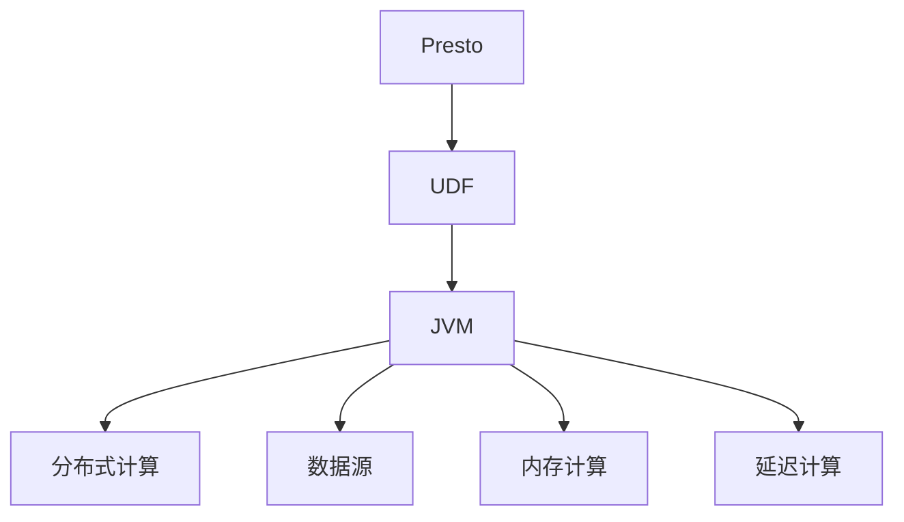
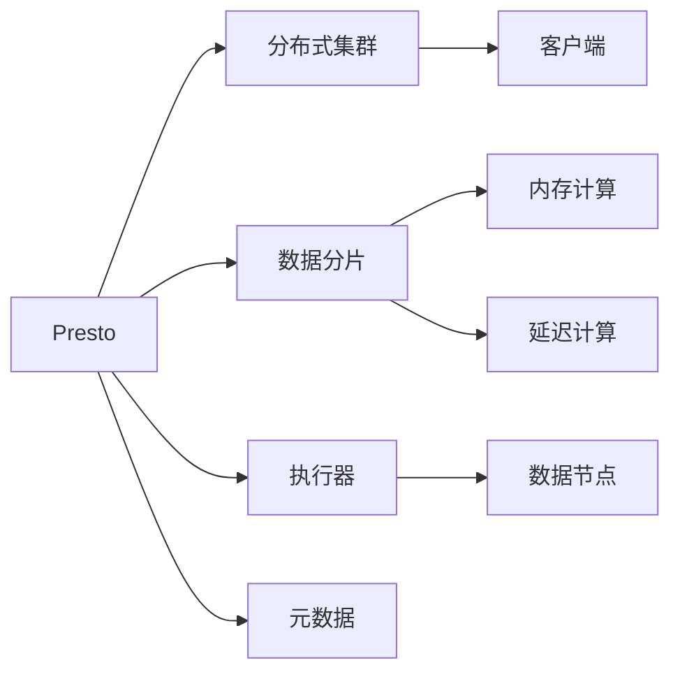
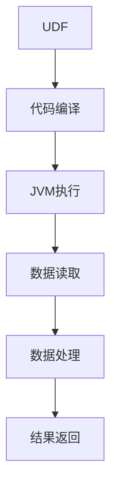
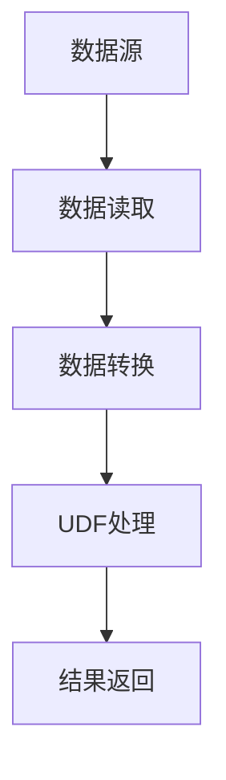
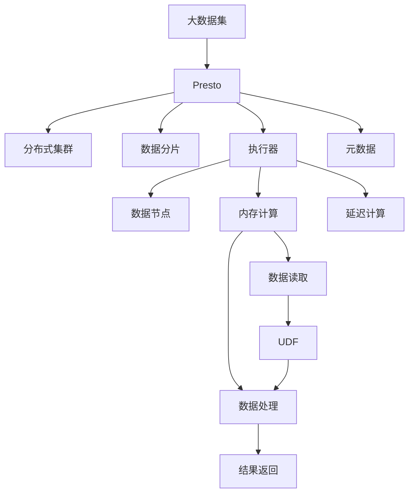

                 

# Presto UDF原理与代码实例讲解

> 关键词：Presto, UDF, 数据处理, 数据库, 编程技术

## 1. 背景介绍

### 1.1 问题由来
随着数据存储和处理的复杂度不断增加，传统SQL数据库已经难以满足高效、灵活处理海量数据的需求。而Presto作为一款开源的分布式SQL查询引擎，凭借其高性能、易用性，迅速成为大数据领域的热门选择。Presto的一个重要特性是其支持用户自定义函数(User Defined Functions, UDF)，使得用户能够扩展其功能，处理更加复杂的数据分析任务。

### 1.2 问题核心关键点
Presto的UDF机制允许用户定义各种类型的功能函数，包括标量函数、聚合函数、窗口函数等，以处理多种数据转换和计算需求。UDF是Presto中极为灵活、功能强大的特性，其核心在于Presto的JVM架构，能够方便地将用户定义的Java代码编译为可执行的UDF，从而在查询执行过程中调用。

### 1.3 问题研究意义
通过深入理解Presto的UDF原理和实现细节，可以更好地利用Presto的强大功能，优化数据处理效率，提升数据分析的灵活性和准确性。同时，UDF的应用还能够极大地降低开发成本，提升企业的信息化水平。

## 2. 核心概念与联系

### 2.1 核心概念概述

为更好地理解Presto的UDF机制，本节将介绍几个密切相关的核心概念：

- Presto: 一款开源的分布式SQL查询引擎，以其高效、易用、灵活著称。Presto能够处理大规模数据集，支持标准SQL和多种数据源，并具有强大的扩展性和灵活性。

- UDF: 用户自定义函数，允许用户根据自己的需求定义各种类型的函数，丰富Presto的功能，满足复杂的数据处理需求。

- JVM: Java虚拟机，Presto的运行时环境。UDF代码通过编译成字节码后，可以在JVM中执行。

- 分布式计算: Presto支持大规模分布式计算，UDF代码可以在每个计算节点上并行执行，提高处理效率。

- 数据源: Presto支持从多种数据源加载数据，包括Hive、Kafka、S3、HDFS等，UDF代码可以访问这些数据源的数据。

- 内存计算: Presto的UDF机制强调内存计算，能够在内存中高效处理数据，提升查询速度。

- 延迟计算: Presto支持延迟计算，UDF代码可以延迟执行，减少内存占用和计算延迟。

这些核心概念之间的逻辑关系可以通过以下Mermaid流程图来展示：



这个流程图展示了大语言模型的核心概念及其之间的关系：

1. Presto通过UDF机制，允许用户定义各种类型的函数。
2. UDF代码通过JVM进行编译和执行。
3. Presto支持大规模分布式计算，UDF代码可以在每个计算节点上并行执行。
4. Presto可以访问多种数据源，UDF代码可以读取这些数据源的数据。
5. Presto强调内存计算，UDF代码可以在内存中高效处理数据。
6. Presto支持延迟计算，UDF代码可以延迟执行，减少内存占用和计算延迟。

### 2.2 概念间的关系

这些核心概念之间存在着紧密的联系，形成了Presto的UDF机制的完整生态系统。下面我通过几个Mermaid流程图来展示这些概念之间的关系。

#### 2.2.1 Presto的架构与UDF


这个流程图展示了Presto的架构及其与UDF的关系。Presto通过分布式集群和数据分片技术，实现了大规模的数据处理能力。UDF代码在Presto的执行器中进行编译和执行，能够在每个数据节点上并行运行。

#### 2.2.2 UDF的执行路径


这个流程图展示了UDF的执行路径。用户定义的UDF代码首先被编译成JVM代码，然后在JVM中执行。执行过程中，UDF代码读取所需的数据，进行数据处理，最终返回结果。

#### 2.2.3 UDF的数据访问方式


这个流程图展示了UDF对数据源的访问方式。Presto支持多种数据源，UDF代码可以读取这些数据源的数据，进行数据转换和处理，最终返回结果。

### 2.3 核心概念的整体架构

最后，我们用一个综合的流程图来展示这些核心概念在Presto UDF机制中的整体架构：



这个综合流程图展示了从大数据集到Presto UDF的完整路径。大数据集首先被Presto的分布式集群处理，然后通过数据分片和执行器进行进一步处理。UDF代码在内存中高效执行，读取所需数据，进行数据转换和处理，最终返回结果。

## 3. 核心算法原理 & 具体操作步骤
### 3.1 算法原理概述

Presto的UDF机制允许用户定义各种类型的函数，包括标量函数、聚合函数、窗口函数等。这些函数的核心原理都是通过将用户自定义的Java代码编译成字节码，然后在JVM中执行。以下将详细讲解UDF的算法原理和具体操作步骤。

### 3.2 算法步骤详解

#### 3.2.1 UDF的定义

用户可以通过Presto的JDBC接口，将自定义的Java函数定义并注册为UDF。以下是一个简单的标量函数示例：

```java
public class MyUDF extends Function {
    @Override
    public Object evaluate(Object... inputs) throws Exception {
        // 示例函数，将两个数的和作为输出
        double a = (Double) inputs[0];
        double b = (Double) inputs[1];
        return a + b;
    }
}
```

在函数中，用户需要实现evaluate方法，方法接收一个或多个输入参数，返回一个计算结果。

#### 3.2.2 UDF的注册

注册UDF需要指定函数名、函数类型、函数描述等属性。以下是一个简单的UDF注册示例：

```java
public static void registerUDFs(PrestoClient client) {
    client.registerFunction("my_udf", new MyUDF());
}
```

在注册函数时，需要指定函数名"my_udf"，以及实现函数MyUDF的实例。

#### 3.2.3 UDF的执行

在查询语句中，用户可以通过调用UDF函数来实现复杂的数据处理逻辑。以下是一个简单的查询示例：

```sql
SELECT my_udf(x, y) FROM table;
```

在查询中，my_udf函数作为自定义函数被调用，将table表中的x和y两列进行相加。

#### 3.2.4 UDF的优化

Presto的执行器会在执行UDF函数时进行优化。例如，对于输入参数较小的UDF函数，Presto会尽量将计算任务并行化，减少计算延迟。而对于需要大量计算的UDF函数，Presto会尽量将计算任务放到执行器中进行处理，避免内存溢出。

### 3.3 算法优缺点

Presto的UDF机制具有以下优点：

- 灵活性高：用户可以自由定义各种类型的函数，满足复杂的数据处理需求。
- 可扩展性强：UDF代码可以通过JDBC接口进行动态注册和卸载，方便用户扩展Presto的功能。
- 执行效率高：UDF代码能够在内存中进行高效计算，避免了传统数据库中的I/O瓶颈。
- 兼容性好：UDF代码可以与Presto的内置函数无缝集成，实现更为复杂的数据处理逻辑。

同时，Presto的UDF机制也存在以下缺点：

- 开发复杂度：用户需要熟悉Java编程和Presto的接口规范，才能编写UDF代码。
- 性能瓶颈：如果UDF代码执行过于复杂，可能会造成性能瓶颈，影响查询效率。
- 安全性风险：UDF代码的恶意使用可能会影响Presto的安全性。

### 3.4 算法应用领域

Presto的UDF机制已经在数据处理、数据分析、数据可视化等多个领域得到了广泛应用。以下是几个典型的应用场景：

- 数据清洗：通过编写自定义函数，对脏数据进行清洗和处理，提高数据质量。
- 数据转换：通过自定义函数，实现复杂的数据转换逻辑，满足特定数据处理需求。
- 报表生成：通过编写报表函数，生成复杂的报表和图表，支持业务决策。
- 数据融合：通过自定义函数，实现不同数据源的数据融合，提升数据利用率。
- 实时计算：通过编写延迟计算函数，实现实时数据处理，支持实时业务场景。

除了这些场景，Presto的UDF机制还可以应用于更多的数据处理和分析任务，为Presto的功能扩展和灵活性提升提供了强大的支持。

## 4. 数学模型和公式 & 详细讲解 & 举例说明

### 4.1 数学模型构建

在Presto中，UDF函数的数学模型构建主要涉及函数的输入、输出以及计算逻辑。以下是一个简单的标量函数的数学模型：

$$
y = f(x_1, x_2, ..., x_n)
$$

其中，$x_1, x_2, ..., x_n$为输入参数，$y$为输出结果，$f$为计算函数。

### 4.2 公式推导过程

以一个简单的标量函数为例，计算两个数的和。假设输入参数为$x_1$和$x_2$，则计算逻辑为：

$$
y = x_1 + x_2
$$

对于上述函数，Presto的执行器会将输入参数转换为Java对象，并调用evaluate方法计算结果。

### 4.3 案例分析与讲解

以下是一个简单的UDF函数示例，实现两个数的最大值计算：

```java
public class MaxUDF extends Function {
    @Override
    public Object evaluate(Object... inputs) throws Exception {
        double max = Double.NEGATIVE_INFINITY;
        for (Object obj : inputs) {
            if (obj instanceof Double) {
                double val = (Double) obj;
                if (val > max) {
                    max = val;
                }
            }
        }
        return max;
    }
}
```

在上述函数中，用户通过循环遍历输入参数，找到最大值，并将其作为输出结果返回。

## 5. 项目实践：代码实例和详细解释说明

### 5.1 开发环境搭建

在进行Presto UDF开发前，我们需要准备好开发环境。以下是使用Java进行Presto UDF开发的环境配置流程：

1. 安装JDK：从官网下载并安装Java Development Kit（JDK），推荐安装Java 11或以上版本。

2. 安装Presto：从官网下载并安装Presto，并配置好启动脚本。

3. 创建Presto UDF项目：在Presto目录下创建UDF项目，包含UDF代码和JDBC驱动程序。

4. 安装数据库驱动：下载并安装JDBC驱动程序，如H2或MySQL，用于测试UDF函数的执行效果。

完成上述步骤后，即可在Presto环境中开始UDF函数的开发和测试。

### 5.2 源代码详细实现

以下是一个简单的UDF函数示例，实现两个数的平均值计算：

```java
public class AvgUDF extends Function {
    @Override
    public Object evaluate(Object... inputs) throws Exception {
        double sum = 0.0;
        int count = 0;
        for (Object obj : inputs) {
            if (obj instanceof Double) {
                sum += (Double) obj;
                count++;
            }
        }
        return sum / count;
    }
}
```

在上述函数中，用户通过循环遍历输入参数，计算平均值，并将其作为输出结果返回。

### 5.3 代码解读与分析

让我们再详细解读一下关键代码的实现细节：

**UDF函数类**：
- `MyUDF`类：实现用户自定义的标量函数，继承`Function`类。
- `evaluate`方法：实现计算逻辑，接收一个或多个输入参数，返回计算结果。

**UDF函数注册**：
- `registerUDFs`方法：通过Presto客户端注册UDF函数，指定函数名和函数实现。

**查询示例**：
- `SELECT my_udf(x, y) FROM table`：在查询语句中调用自定义函数，进行数据处理。

**UDF函数执行优化**：
- Presto的执行器会根据UDF函数的输入参数大小，进行并行化处理，减少计算延迟。
- 对于复杂度较高的UDF函数，Presto会尽量将计算任务放到执行器中进行处理，避免内存溢出。

### 5.4 运行结果展示

假设我们测试的UDF函数为`avg_udf`，在Presto中注册并执行查询，得到的结果如下：

```sql
SELECT avg_udf(x, y) FROM table;
```

在测试UDF函数时，可以通过Presto客户端的JDBC接口进行测试，如MySQL或H2数据库。以下是一个简单的测试示例：

```java
String url = "jdbc:mysql://localhost:3306/test";
String user = "root";
String password = "password";
String query = "SELECT avg_udf(x, y) FROM table";
try (Connection conn = DriverManager.getConnection(url, user, password);
     Statement stmt = conn.createStatement()) {
    ResultSet rs = stmt.executeQuery(query);
    while (rs.next()) {
        System.out.println(rs.getDouble(1));
    }
}
```

在测试中，通过JDBC接口连接数据库，并执行查询，获取UDF函数的计算结果。

## 6. 实际应用场景

### 6.1 数据清洗

在进行数据分析前，需要对数据进行清洗和处理。通过编写自定义函数，可以实现复杂的数据清洗逻辑，提高数据质量。例如，以下UDF函数可以实现数据去重：

```java
public class DistinctUDF extends Function {
    @Override
    public Object evaluate(Object... inputs) throws Exception {
        Set<Object> set = new HashSet<>();
        for (Object obj : inputs) {
            if (obj instanceof String) {
                set.add(obj);
            }
        }
        return set;
    }
}
```

在上述函数中，用户通过HashSet集合实现数据去重，并将结果作为输出结果返回。

### 6.2 数据转换

通过编写自定义函数，可以实现复杂的数据转换逻辑，满足特定数据处理需求。例如，以下UDF函数可以实现日期格式转换：

```java
public class DateFormatUDF extends Function {
    @Override
    public Object evaluate(Object... inputs) throws Exception {
        SimpleDateFormat sdf = new SimpleDateFormat("yyyy-MM-dd");
        Date date = (Date) inputs[0];
        return sdf.format(date);
    }
}
```

在上述函数中，用户通过SimpleDateFormat实现日期格式转换，并将结果作为输出结果返回。

### 6.3 报表生成

通过编写报表函数，生成复杂的报表和图表，支持业务决策。例如，以下UDF函数可以实现销售数据报表：

```java
public class SalesReportUDF extends Function {
    @Override
    public Object evaluate(Object... inputs) throws Exception {
        Map<String, Integer> sales = new HashMap<>();
        for (Object obj : inputs) {
            if (obj instanceof Map) {
                Map<String, Double> saleData = (Map<String, Double>) obj;
                for (String product : saleData.keySet()) {
                    if (!sales.containsKey(product)) {
                        sales.put(product, 0);
                    }
                    sales.put(product, sales.get(product) + saleData.get(product));
                }
            }
        }
        List<Map.Entry<String, Integer>> entryList = new ArrayList<>(sales.entrySet());
        Collections.sort(entryList, (e1, e2) -> e2.getValue().compareTo(e1.getValue()));
        return entryList;
    }
}
```

在上述函数中，用户通过HashMap实现销售数据的统计和排序，并将结果作为输出结果返回。

### 6.4 未来应用展望

随着Presto UDF机制的不断完善和优化，其在数据处理和分析中的应用前景将更加广阔。未来，Presto UDF机制将支持更多类型的数据处理逻辑，满足更复杂的数据分析需求。

在智慧城市、智能制造、医疗健康等领域，Presto UDF机制将发挥重要作用。例如，在智慧城市中，Presto可以处理大规模城市数据，实现实时数据分析和预测，支持城市治理和公共安全；在智能制造中，Presto可以处理工业数据，实现设备监控和维护，提高生产效率；在医疗健康中，Presto可以处理医疗数据，实现疾病预测和诊断，提升医疗服务水平。

## 7. 工具和资源推荐

### 7.1 学习资源推荐

为了帮助开发者系统掌握Presto的UDF机制，以下推荐一些优质的学习资源：

1. Presto官方文档：包含Presto的详细功能和API文档，是学习Presto UDF机制的基础。

2. Presto UDF示例代码：Presto官网提供了丰富的UDF示例代码，方便开发者学习和参考。

3. Presto社区论坛：Presto社区论坛汇集了大量用户和专家，提供丰富的交流和学习资源。

4. 《Presto 实战指南》书籍：该书详细介绍了Presto的部署和应用，包括UDF机制的实现。

5. 《Presto官方培训课程》：Presto官方提供的培训课程，系统介绍了Presto的架构、使用和优化方法。

通过这些资源的学习实践，相信你一定能够快速掌握Presto UDF机制，并用于解决实际的Presto问题。

### 7.2 开发工具推荐

高效的开发离不开优秀的工具支持。以下是几款用于Presto UDF开发的常用工具：

1. IntelliJ IDEA：一款强大的Java开发工具，支持Presto UDF的编写和调试。

2. Git：版本控制工具，方便开发者管理和协作开发UDF函数。

3. Maven：Java项目管理工具，可以自动化构建、测试和发布Presto UDF项目。

4. JUnit：Java单元测试框架，用于测试Presto UDF函数的正确性和性能。

5. Docker：容器化技术，可以方便地部署和运行Presto UDF函数。

合理利用这些工具，可以显著提升Presto UDF开发的效率，加快创新迭代的步伐。

### 7.3 相关论文推荐

Presto UDF机制的实现涉及多方面的技术细节，以下是几篇相关论文，推荐阅读：

1. "Presto: A Distributed SQL Engine"：Presto架构设计论文，介绍了Presto的整体架构和核心技术。

2. "Pluggable Storage and Execution Layer"：Presto可插拔存储和执行层论文，介绍了Presto的存储和执行机制。

3. "User Defined Functions in Presto"：Presto UDF机制论文，详细介绍了Presto的UDF机制及其优化策略。

4. "Hive Metastore Performance and Scalability"：Presto与Hive的集成优化论文，介绍了Presto与Hive的交互机制和性能优化。

5. "Apache Presto: Data Mining Framework for Big Data"：Presto数据分析框架论文，介绍了Presto在数据挖掘中的应用。

这些论文代表了Presto UDF机制的研究进展，通过学习这些前沿成果，可以帮助研究者把握学科前进方向，激发更多的创新灵感。

除上述资源外，还有一些值得关注的前沿资源，帮助开发者紧跟Presto UDF机制的最新进展，例如：

1. Presto社区博客：Presto社区的官方博客，发布了大量的技术文章和实践经验。

2. 《Presto官方博客》：Presto官方博客，发布了最新的技术动态和最佳实践。

3. 技术会议直播：如Presto的Conference、Meetup等，可以聆听到Presto专家的前沿分享。

4. GitHub热门项目：在GitHub上Star、Fork数最多的Presto相关项目，往往代表了该技术领域的发展趋势和最佳实践。

5. 行业分析报告：各大咨询公司如McKinsey、PwC等针对Presto的行业分析报告，有助于从商业视角审视技术趋势，把握应用价值。

总之，对于Presto UDF机制的学习和实践，需要开发者保持开放的心态和持续学习的意愿。多关注前沿资讯，多动手实践，多思考总结，必将收获满满的成长收益。

## 8. 总结：未来发展趋势与挑战

### 8.1 总结

本文对Presto的UDF机制进行了全面系统的介绍。首先阐述了Presto和UDF机制的研究背景和意义，明确了UDF在Presto中的核心作用。其次，从原理到实践，详细讲解了UDF的算法原理和操作步骤，给出了UDF函数开发的完整代码实例。同时，本文还广泛探讨了UDF机制在数据处理、数据分析、报表生成等多个领域的应用前景，展示了UDF机制的强大功能。

通过本文的系统梳理，可以看到，Presto UDF机制为Presto的功能扩展和灵活性提升提供了强大的支持，极大地提升了数据处理和分析的效率和灵活性。未来，随着Presto UDF机制的不断完善和优化，其在Presto中的应用前景将更加广阔。

### 8.2 未来发展趋势

展望未来，Presto的UDF机制将呈现以下几个发展趋势：

1. 可扩展性增强：UDF代码可以通过JDBC接口进行动态注册和卸载，方便用户扩展Presto的功能。

2. 性能优化：Presto的执行器会不断优化UDF代码的执行路径，提升查询效率和性能。

3. 安全性保障：Presto会加强UDF代码的安全性检查，防止恶意使用。

4. 兼容性和易用性提升：Presto会优化UDF代码的编写和调试体验，提升用户体验。

5. 多数据源支持：Presto会支持更多的数据源，提供更加丰富的数据处理能力。

6. 自动化和智能化：Presto会引入更多的自动化和智能化技术，提升UDF代码的开发和调试效率。

以上趋势凸显了Presto UDF机制的广阔前景。这些方向的探索发展，必将进一步提升Presto UDF机制的性能和灵活性，满足更多复杂的数据处理需求。

### 8.3 面临的挑战

尽管Presto UDF机制已经取得了瞩目成就，但在迈向更加智能化、普适化应用的过程中，它仍面临着诸多挑战：

1. 开发复杂度：用户需要熟悉Java编程和Presto的接口规范，才能编写UDF代码。

2. 性能瓶颈：如果UDF代码执行过于复杂，可能会造成性能瓶颈，影响查询效率。

3. 安全性风险：UDF代码的恶意使用可能会影响Presto的安全性。

4. 兼容性问题：Presto UDF代码需要与不同的数据源和业务场景进行适配，可能存在兼容性问题。

5. 社区支持：Presto UDF机制还在不断发展中，社区支持和技术支持有待完善。

正视Presto UDF机制面临的这些挑战，积极应对并寻求突破，将是大语言模型微调走向成熟的必由之路。相信随着学界和产业界的共同努力，这些挑战终将一一被克服，Presto UDF机制必将在构建人机协同的智能时代中扮演越来越重要的角色。

### 8.4 研究展望

面对Presto UDF机制面临的挑战，未来的研究需要在以下几个方面寻求新的突破：

1. 探索可扩展的UDF机制：如何通过更高效的技术手段，实现UDF代码的动态注册和卸载，提升Presto的扩展性。

2. 研究高效的UDF执行策略：如何通过更优化的方法，提升UDF代码的执行效率，减少计算延迟。

3. 引入更多的安全机制：如何通过更严格的安全检查，防止恶意使用UDF代码，保障Presto的安全性。

4. 优化UDF代码的编写和调试：如何通过更友好的技术手段，提升UDF代码的编写和调试效率，提升用户体验。

5. 支持更多的数据源和业务场景：如何通过更灵活的技术手段，支持更多的数据源和业务场景，满足复杂的数据处理需求。

6. 引入更多的自动化和智能化技术：如何通过更智能的技术手段，提升UDF代码的开发和调试效率，提升用户体验。

这些研究方向的探索，必将引领Presto UDF机制迈向更高的台阶，为Presto UDF机制的未来发展提供新的思路和方法。

## 9. 附录：常见问题与解答

**Q1：Presto UDF的开发是否需要编程知识？**

A: 是的，开发Presto UDF需要具备Java编程和Presto接口规范的知识。需要

