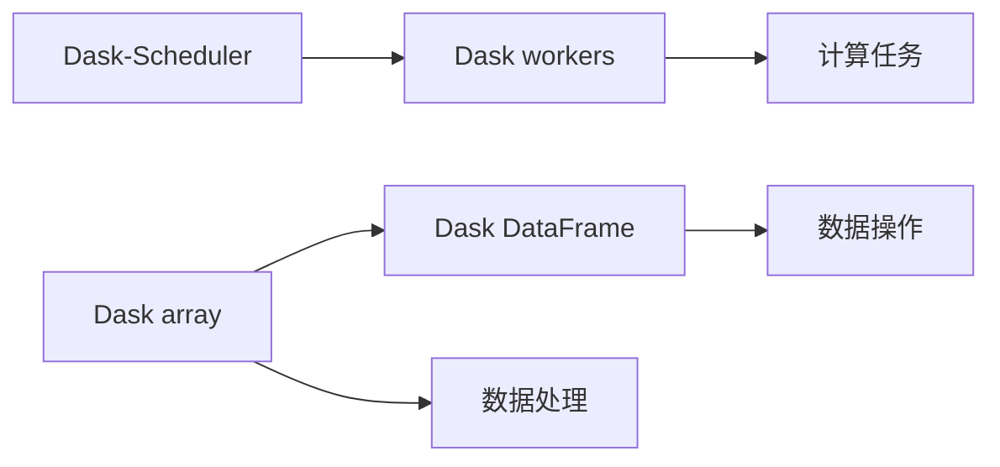

                 

# Python机器学习实战：分布式机器学习框架Dask的入门与实战

> 关键词：分布式机器学习，Dask框架，Python，数据处理，高性能计算，科学计算，工业应用

## 1. 背景介绍

### 1.1 问题由来

随着数据量的不断增长和算力需求的日益增加，传统的单机机器学习算法已经难以满足大规模数据处理和复杂模型的训练需求。分布式机器学习（Distributed Machine Learning）应运而生，它利用集群中的多台计算机并行处理数据和模型，显著提升了计算效率。

Dask是一个Python库，专为分布式数据处理和分析而设计。它基于Dask-Scheduler，能够自动调度多个计算机节点上的任务，支持多种数据类型和算子，是进行大规模科学计算和机器学习的理想选择。

本文档旨在为Python程序员提供Dask框架的全面入门与实战指南，帮助读者掌握分布式机器学习的核心思想和实践方法。

## 2. 核心概念与联系

### 2.1 核心概念概述

- **Dask框架**：Dask是一个Python库，支持大规模并行计算和分布式数据处理。它能够自动调度多个计算机节点上的任务，并提供了类似于Pandas和NumPy的高层API，支持大规模数据处理和分析。

- **Dask-Scheduler**：Dask的核心组件，负责任务调度和资源分配。Dask-Scheduler与Dask workers协作，将任务分布到不同的节点上执行。

- **Dask workers**：Dask-Scheduler的子进程，负责执行具体的计算任务。每个Dask worker会维护一个本地任务队列，并根据Dask-Scheduler的调度策略执行任务。

- **Dask array**：Dask提供的数据结构，用于在多个节点上并行处理大规模数据。Dask array是一个惰性数组，只有在计算时才会生成实际的数组数据。

- **Dask DataFrame**：Dask提供的数据表数据结构，类似于Pandas DataFrame。它能够支持大规模的DataFrame操作和分析。

### 2.2 核心概念间的关系

Dask框架的核心概念之间存在着紧密的联系，构成了Dask并行计算和分布式数据处理的完整体系。通过Dask-Scheduler的调度和资源管理，Dask workers能够高效地执行任务。而Dask array和Dask DataFrame则提供了分布式数据处理的灵活接口。下面通过一个简单的Mermaid流程图来展示Dask核心概念之间的关系：



这个流程图展示了Dask框架的工作流程：

1. Dask-Scheduler负责任务调度和资源分配。
2. Dask workers执行具体的计算任务。
3. Dask array用于在多个节点上并行处理大规模数据。
4. Dask DataFrame提供数据表处理接口，支持大规模数据操作和分析。

通过这些核心概念的协同工作，Dask框架能够高效地处理大规模数据和复杂模型，提升计算效率。

## 3. 核心算法原理 & 具体操作步骤

### 3.1 算法原理概述

Dask框架的分布式机器学习算法原理主要基于两个核心思想：

1. **任务分解与并行计算**：Dask框架将大规模任务分解为多个小任务，并行在多个节点上执行。通过Dask-Scheduler的调度和管理，Dask workers能够高效地执行每个小任务，从而提升计算效率。

2. **惰性计算与延迟执行**：Dask array和Dask DataFrame采用惰性计算方式，只有在计算时才会生成实际的数组或数据表数据。这种方式减少了数据传输和计算开销，提高了分布式计算的效率。

### 3.2 算法步骤详解

#### 3.2.1 环境准备

首先，我们需要安装Dask框架和相关依赖。可以通过pip命令安装：

```bash
pip install dask[complete]
```

安装完成后，需要启动Dask-Scheduler和Dask workers，以便进行分布式计算。可以使用以下命令启动：

```bash
dask-scheduler --nproc 4 --memory 2g --loglevel 20
dask-worker --scheduler dask://dask-scheduler
```

其中，`--nproc`参数指定启动的Dask worker数量，`--memory`参数指定每个worker的内存大小。

#### 3.2.2 数据处理

Dask array和Dask DataFrame是Dask框架的主要数据结构。通过这些结构，我们可以方便地进行大规模数据处理和分析。

首先，我们创建一个Dask array：

```python
import dask.array as da

arr = da.random.random((1000, 1000), chunks=(100, 100))
```

这里我们创建了一个1000x1000的随机数数组，并将其分块为100x100的小块。这种方式可以显著减少数据传输和计算开销，提高分布式计算的效率。

然后，我们可以对Dask array进行各种操作，如求和、平均值等：

```python
result = da.sum(arr, axis=0)
```

这里我们对Dask array进行了行方向上的求和操作，得到了一个1x1000的数组。

#### 3.2.3 任务调度与执行

通过Dask-Scheduler的调度，Dask workers能够高效地执行计算任务。我们可以通过Dask client进行任务的提交和调度：

```python
from dask.distributed import Client

client = Client('dask-scheduler')
```

这里我们创建了一个Dask client，连接到Dask-Scheduler。然后，我们可以提交计算任务：

```python
future = client.submit(da.sum, arr, axis=0)
```

这里我们将行方向的求和任务提交给Dask client。Dask client会根据任务的复杂度和资源情况，将任务自动分配到多个Dask workers上执行。

#### 3.2.4 结果收集

在Dask array和Dask DataFrame中，结果的收集和合并操作需要特别小心。由于数据分布在多个节点上，我们需要使用`.compute()`方法将结果收集到主节点上：

```python
result = future.result()
```

这里我们将求和结果收集到主节点上，并得到了最终的计算结果。

### 3.3 算法优缺点

#### 3.3.1 优点

1. **高效性**：Dask框架支持大规模并行计算和分布式数据处理，能够显著提升计算效率。

2. **灵活性**：Dask支持多种数据类型和算子，能够灵活处理各种数据类型和复杂操作。

3. **易用性**：Dask提供了高层API，如Dask array和Dask DataFrame，类似于Pandas和NumPy，易于上手和使用。

#### 3.3.2 缺点

1. **学习曲线**：Dask框架相对复杂，需要一定的学习曲线。初学者可能需要在掌握基础后再深入使用。

2. **资源管理**：Dask框架需要手动管理资源分配和调度，需要一定的运维经验。

3. **数据传输**：在节点间传输数据可能带来额外的开销，需要根据数据大小和网络带宽进行优化。

### 3.4 算法应用领域

Dask框架可以应用于多种数据处理和分析场景，如大规模科学计算、机器学习、数据挖掘、图像处理等。它特别适合处理大规模数据集和复杂模型，能够显著提升计算效率和数据处理能力。

## 4. 数学模型和公式 & 详细讲解

### 4.1 数学模型构建

Dask框架的数学模型主要基于分布式并行计算和惰性计算的原理。下面通过一个简单的例子来说明Dask框架的数学模型构建过程。

假设我们有一个大规模的矩阵A和B，需要进行矩阵乘法：

```python
import dask.array as da
import numpy as np

a = da.random.random((10000, 10000), chunks=(10000, 10000))
b = da.random.random((10000, 10000), chunks=(10000, 10000))
c = a @ b
```

这里我们创建了两个10000x10000的随机数数组，并将其分块为10000x10000的小块。然后，我们进行矩阵乘法操作，得到了一个新的10000x10000的数组。

### 4.2 公式推导过程

Dask框架的数学公式推导主要基于分布式并行计算和惰性计算的思想。下面以矩阵乘法为例，推导Dask框架的计算公式：

假设A和B分别为两个大规模矩阵，其大小分别为m*n和n*p。则矩阵乘法C=A*B的大小为m*p，其计算公式为：

$$
C_{i,j} = \sum_{k=1}^n A_{i,k}B_{k,j}
$$

在Dask框架中，矩阵乘法可以通过如下代码实现：

```python
import dask.array as da

a = da.random.random((m, n), chunks=chunk_size)
b = da.random.random((n, p), chunks=chunk_size)
c = a @ b
```

这里我们创建了两个m*n和n*p的随机数数组，并将其分块为chunk_sizexchunk_size的小块。然后，我们进行矩阵乘法操作，得到了一个新的m*p的数组。

在Dask框架中，矩阵乘法的计算公式为：

$$
C_{i,j} = \sum_{k=1}^n A_{i,k}B_{k,j}
$$

其中，A、B和C分别代表矩阵A、B和C的分块形式。Dask框架通过并行计算和惰性计算的方式，实现了高效的分布式矩阵乘法计算。

### 4.3 案例分析与讲解

下面通过一个实际案例，来说明Dask框架的数学模型和公式推导过程。

假设我们有一个大规模的文本数据集，需要进行文本预处理和特征提取。具体步骤如下：

1. 读取文本数据集。

```python
import dask.dataframe as dd

df = dd.read_csv('text.csv', chunksize=1000000)
```

这里我们读取了一个名为text.csv的文本数据集，并将其分块为1000000行的小块。

2. 进行文本预处理。

```python
import dask.array as da
import pandas as pd

# 将文本数据转换为Dask DataFrame
df = df.map_partitions(lambda x: pd.DataFrame(x))

# 分词、去停用词、词形还原等操作
df['tokens'] = df['text'].apply(lambda x: [word.lower() for word in x.split()])
df['tokens'] = df['tokens'].apply(lambda x: [word for word in x if word not in stopwords])
df['tokens'] = df['tokens'].apply(lambda x: [lemmatizer.lemmatize(word) for word in x])
```

这里我们首先将文本数据转换为Dask DataFrame，然后进行分词、去停用词、词形还原等文本预处理操作。

3. 进行特征提取。

```python
from sklearn.feature_extraction.text import CountVectorizer

# 创建CountVectorizer对象
vectorizer = CountVectorizer()

# 提取词袋特征
df['features'] = df['tokens'].apply(lambda x: vectorizer.transform(' '.join(x)))
```

这里我们使用了sklearn中的CountVectorizer对象，进行词袋特征提取。

4. 计算词频和TF-IDF值。

```python
from sklearn.feature_extraction.text import TfidfTransformer

# 计算TF-IDF值
transformer = TfidfTransformer()
df['tfidf'] = df['features'].map_partitions(lambda x: transformer.fit_transform(x))
```

这里我们使用了sklearn中的TfidfTransformer对象，进行TF-IDF值计算。

通过这个案例，我们可以看到Dask框架的数学模型和公式推导过程。Dask框架通过分布式并行计算和惰性计算的方式，高效地处理大规模文本数据集，进行文本预处理和特征提取。

## 5. 项目实践：代码实例和详细解释说明

### 5.1 开发环境搭建

首先，我们需要安装Dask框架和相关依赖。可以通过pip命令安装：

```bash
pip install dask[complete]
```

安装完成后，需要启动Dask-Scheduler和Dask workers，以便进行分布式计算。可以使用以下命令启动：

```bash
dask-scheduler --nproc 4 --memory 2g --loglevel 20
dask-worker --scheduler dask://dask-scheduler
```

其中，`--nproc`参数指定启动的Dask worker数量，`--memory`参数指定每个worker的内存大小。

### 5.2 源代码详细实现

下面我们通过一个简单的示例，来说明Dask框架的使用。

首先，我们创建一个Dask array：

```python
import dask.array as da

arr = da.random.random((1000000, 1000000), chunks=(100000, 100000))
```

这里我们创建了一个1000000x1000000的随机数数组，并将其分块为100000x100000的小块。

然后，我们可以对Dask array进行各种操作，如求和、平均值等：

```python
result = da.sum(arr, axis=0)
```

这里我们对Dask array进行了行方向上的求和操作，得到了一个1x1000000的数组。

### 5.3 代码解读与分析

让我们再详细解读一下关键代码的实现细节：

**Dask array类**：
- `da.random.random`方法：创建指定形状和分块的随机数数组。
- `chunks`参数：指定分块大小，以优化数据传输和计算效率。

**求和操作**：
- `da.sum`方法：对Dask array进行求和操作。
- `axis`参数：指定求和的方向，可以是行、列或数据轴。

**结果收集**：
- `.result()`方法：将Dask array的结果收集到主节点上。

通过这个示例，我们可以看到Dask框架的使用方法和计算过程。Dask框架通过分布式并行计算和惰性计算的方式，高效地处理大规模数据集。

### 5.4 运行结果展示

假设我们创建了一个1x1000的Dask array，进行求和操作，结果如下：

```python
import dask.array as da

arr = da.random.random((1000, 1000), chunks=(100, 100))
result = da.sum(arr, axis=0)
print(result.compute())
```

这里我们创建了一个1x1000的随机数数组，并将其分块为100x100的小块。然后，我们对其进行行方向上的求和操作，得到了一个1x1000的数组。最终，我们使用`.compute()`方法将结果收集到主节点上，并打印输出结果。

## 6. 实际应用场景

### 6.1 智能推荐系统

智能推荐系统需要处理大规模用户行为数据和商品信息，进行复杂的协同过滤和深度学习模型的训练。Dask框架可以高效地处理大规模数据集和复杂模型，为推荐系统提供高效的计算和分析能力。

具体而言，Dask框架可以用于：

- 用户行为数据的预处理和分析。
- 商品信息的特征提取和表示学习。
- 协同过滤模型的并行计算和优化。
- 深度学习模型的分布式训练和调优。

### 6.2 金融数据分析

金融数据分析需要处理大规模的股票交易数据和市场信息，进行复杂的风险评估和投资决策。Dask框架可以高效地处理大规模数据集和复杂模型，为金融数据分析提供高效的计算和分析能力。

具体而言，Dask框架可以用于：

- 股票交易数据的预处理和分析。
- 市场信息的特征提取和表示学习。
- 风险评估模型的并行计算和优化。
- 投资决策模型的分布式训练和调优。

### 6.3 科学计算

科学计算需要处理大规模的科学数据和计算任务，进行复杂的模拟和分析。Dask框架可以高效地处理大规模数据集和复杂模型，为科学计算提供高效的计算和分析能力。

具体而言，Dask框架可以用于：

- 科学数据的预处理和分析。
- 计算模型的并行计算和优化。
- 模拟模型的分布式训练和调优。
- 结果的可视化展示和分析。

### 6.4 未来应用展望

随着Dask框架的不断发展和完善，其应用场景还将进一步拓展。未来，Dask框架可能在以下几个领域发挥更大的作用：

1. 自然语言处理：Dask框架可以用于大规模文本数据的处理和分析，为自然语言处理提供高效的计算和分析能力。

2. 图像处理：Dask框架可以用于大规模图像数据的处理和分析，为图像处理提供高效的计算和分析能力。

3. 物联网：Dask框架可以用于大规模物联网数据的处理和分析，为物联网应用提供高效的计算和分析能力。

4. 大数据分析：Dask框架可以用于大规模数据的处理和分析，为大数据分析提供高效的计算和分析能力。

5. 高精度科学计算：Dask框架可以用于大规模高精度科学计算，为科学研究提供高效的计算和分析能力。

总之，Dask框架是一个高效、灵活、易用的分布式计算框架，具有广泛的应用前景。随着Dask框架的不断发展和完善，其应用领域还将进一步拓展，为各行各业提供高效的计算和分析能力。

## 7. 工具和资源推荐

### 7.1 学习资源推荐

为了帮助读者系统掌握Dask框架的使用方法和实践技巧，这里推荐一些优质的学习资源：

1. Dask官方文档：Dask官方文档提供了完整的Dask框架使用指南，涵盖了数据处理、并行计算、分布式计算等各个方面的详细说明。

2. Dask tutorials：Dask社区提供的教程，包括入门教程和高级教程，涵盖了Dask框架的各个方面，适合不同层次的读者。

3. Kaggle比赛：Kaggle比赛提供了多个Dask框架的使用案例，涵盖数据处理、机器学习、科学计算等多个领域，适合实际练习和实战演练。

4. YouTube视频教程：Dask官方YouTube频道提供了多个Dask框架的使用教程，适合视频学习和动手实践。

5. GitHub项目：Dask社区提供的项目，包括Dask array、Dask DataFrame、DaskML等，适合学习源代码和参与社区交流。

### 7.2 开发工具推荐

高效的工具是学习和使用Dask框架的关键。以下是几款用于Dask框架开发常用的工具：

1. Jupyter Notebook：Jupyter Notebook是一个流行的交互式编程环境，支持Python、Dask array和Dask DataFrame等库的混合使用，适合进行Dask框架的实验和开发。

2. IPython：IPython是一个交互式Python shell，支持Dask array和Dask DataFrame等库的混合使用，适合进行Dask框架的调试和优化。

3. PyCharm：PyCharm是一个流行的Python IDE，支持Dask array和Dask DataFrame等库的混合使用，适合进行Dask框架的开发和测试。

4. Visual Studio Code：Visual Studio Code是一个流行的开源编辑器，支持Dask array和Dask DataFrame等库的混合使用，适合进行Dask框架的开发和调试。

5. Anaconda：Anaconda是一个流行的数据科学和机器学习环境，支持Dask array和Dask DataFrame等库的混合使用，适合进行Dask框架的实验和开发。

### 7.3 相关论文推荐

Dask框架作为分布式计算的最新进展，近年来得到了广泛的关注和研究。以下是几篇具有代表性的相关论文，推荐阅读：

1. Dask: A generic distributed computing framework：Dask的官方网站文档，提供了Dask框架的详细介绍和使用指南。

2. Dask: Distributed computing in Python：Dask社区的官方论文，详细介绍了Dask框架的实现原理和应用场景。

3. Dask-Scheduler：Dask-Scheduler的论文，详细介绍了Dask-Scheduler的实现原理和优化策略。

4. Dask array：Dask array的论文，详细介绍了Dask array的实现原理和应用场景。

5. Dask DataFrame：Dask DataFrame的论文，详细介绍了Dask DataFrame的实现原理和应用场景。

这些论文代表了Dask框架的发展脉络，对于深入理解Dask框架的实现原理和应用场景具有重要意义。

## 8. 总结：未来发展趋势与挑战

### 8.1 总结

本文对Dask框架进行了全面系统的介绍，帮助读者掌握了分布式机器学习的核心思想和实践方法。通过详细的代码实例和案例分析，展示了Dask框架的强大功能和应用潜力。

### 8.2 未来发展趋势

展望未来，Dask框架将继续拓展其在分布式计算和数据处理中的应用，成为机器学习和科学计算的重要工具。Dask框架的以下发展趋势值得关注：

1. 分布式计算的优化：Dask框架将继续优化分布式计算的性能和资源管理，提升大规模计算的效率和可扩展性。

2. 数据处理的多样性：Dask框架将支持更多的数据类型和算子，提供更加多样化和灵活的数据处理能力。

3. 多云环境的支持：Dask框架将支持更多的云平台和分布式计算环境，提供更加灵活和高效的数据处理和计算能力。

4. 社区和生态的壮大：Dask框架将进一步壮大社区和生态，吸引更多的开发者和用户参与，推动Dask框架的持续发展和创新。

### 8.3 面临的挑战

尽管Dask框架已经取得了不错的成绩，但在未来发展过程中，仍面临着以下挑战：

1. 学习曲线：Dask框架相对复杂，需要一定的学习曲线。初学者可能需要在掌握基础后再深入使用。

2. 资源管理：Dask框架需要手动管理资源分配和调度，需要一定的运维经验。

3. 数据传输：在节点间传输数据可能带来额外的开销，需要根据数据大小和网络带宽进行优化。

4. 社区支持：Dask社区的壮大需要更多开发者和用户的支持和参与，需要进一步推广和普及。

### 8.4 研究展望

未来，Dask框架需要在以下几个方面进行进一步的研究和探索：

1. 分布式计算的优化：Dask框架需要进一步优化分布式计算的性能和资源管理，提升大规模计算的效率和可扩展性。

2. 数据处理的多样性：Dask框架需要支持更多的数据类型和算子，提供更加多样化和灵活的数据处理能力。

3. 多云环境的支持：Dask框架需要支持更多的云平台和分布式计算环境，提供更加灵活和高效的数据处理和计算能力。

4. 社区和生态的壮大：Dask框架需要进一步壮大社区和生态，吸引更多的开发者和用户参与，推动Dask框架的持续发展和创新。

总之，Dask框架是一个高效、灵活、易用的分布式计算框架，具有广泛的应用前景。未来，Dask框架将在更多的领域发挥重要作用，为各行各业提供高效的计算和分析能力。

## 9. 附录：常见问题与解答

**Q1: Dask框架如何处理大规模数据集？**

A: Dask框架通过将大规模数据集分块为多个小块，每个小块在分布式计算中独立处理。这样，可以显著减少数据传输和计算开销，提高计算效率。

**Q2: Dask框架如何进行分布式计算？**

A: Dask框架通过Dask-Scheduler进行任务调度和资源分配，将计算任务分配给多个Dask workers并行执行。每个Dask worker负责执行具体的计算任务，并通过Dask-Scheduler进行通信和数据传输。

**Q3: Dask框架的优势和劣势是什么？**

A: Dask框架的优势在于支持大规模并行计算和分布式数据处理，能够显著提升计算效率。劣势在于学习曲线较陡峭，需要一定的运维经验，并且数据传输可能带来额外的开销。

**Q4: 如何优化Dask框架的性能？**

A: 优化Dask框架的性能可以从以下几个方面入手：

1. 数据分块：将大规模数据集分块为多个小块，每个小块在分布式计算中独立处理。

2. 内存优化：根据数据量和内存大小，调整Dask worker的内存大小，避免内存不足或过载。

3. 任务调度：调整Dask-Scheduler的参数，优化任务的调度和执行效率。

4. 数据传输：减少数据传输和计算开销，优化数据传输和通信效率。

通过这些优化措施，可以显著提升Dask框架的计算效率和性能。

---

作者：禅与计算机程序设计艺术 / Zen and the Art of Computer Programming

