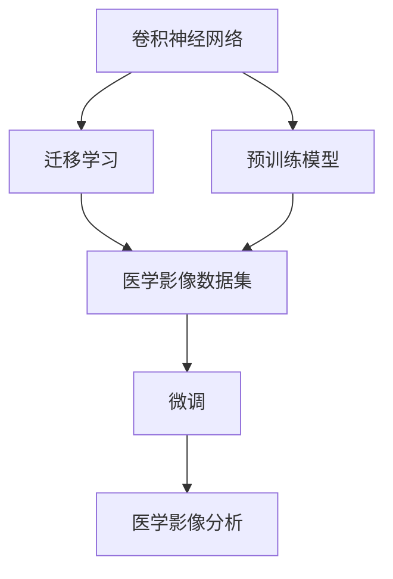
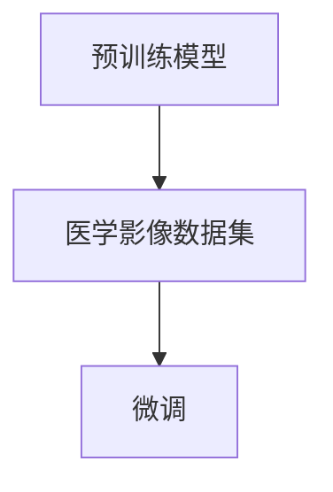
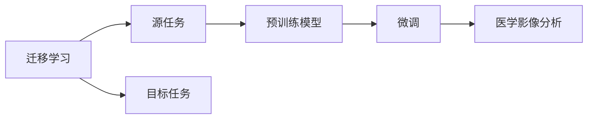
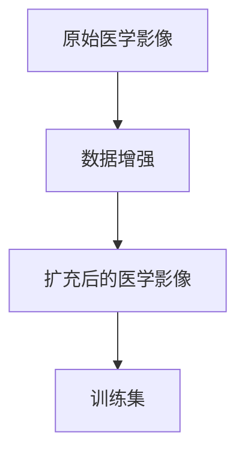

                 

# Python深度学习实践：深度学习在医学图像分析中的运用

> 关键词：深度学习,医学图像分析,卷积神经网络,迁移学习,预训练模型,医学影像,数据增强

## 1. 背景介绍

### 1.1 问题由来
近年来，深度学习技术在医学图像分析领域取得了显著的进步。特别是卷积神经网络(CNN)的提出，使得医学影像的自动化分析成为可能。通过深度学习模型，医生可以更快、更准确地分析影像，提高诊断效率和准确性。

然而，医学影像分析的数据集通常较小，且每个病种的数据量差异较大，这使得训练大规模神经网络成为一项挑战。此外，医学图像的复杂性和多样性，也增加了模型训练的难度。因此，如何在大规模通用数据上进行预训练，再针对特定医学影像分析任务进行微调，成为了一个重要研究方向。

### 1.2 问题核心关键点
基于深度学习的医学影像分析，其核心在于使用预训练模型和迁移学习。首先，在通用的医学图像数据集上进行大规模预训练，以获取通用的医学知识。然后，使用微调方法，将预训练模型适应特定任务的医学影像数据集，以获得更好的分析效果。

具体来说，通过迁移学习，可以从预训练模型中继承一些通用的特征提取能力，避免从头训练所需的巨大数据和计算资源。预训练模型通常在大型通用图像数据集上进行训练，如图像Net、Inception等，以学习通用的图像特征。通过微调，可以将预训练模型的这些特征适应特定的医学图像数据集，从而提升医学影像分析的性能。

### 1.3 问题研究意义
深度学习在医学影像分析中的应用，对于提高医疗水平、降低医疗成本具有重要意义：

1. **提高诊断效率**：通过自动化的图像分析，可以快速识别出异常区域，帮助医生缩短诊断时间。
2. **提高诊断准确性**：深度学习模型可以从大量数据中学习复杂的模式，有助于发现传统方法难以识别的细微变化。
3. **减少误诊**：深度学习模型可以提供客观的诊断依据，减少人为判断的误差。
4. **可扩展性强**：新的医学影像分析任务可以通过微调现有的预训练模型快速实现，而无需从头训练。

## 2. 核心概念与联系

### 2.1 核心概念概述

为了更好地理解深度学习在医学图像分析中的应用，本节将介绍几个关键概念：

- **卷积神经网络(CNN)**：一种特殊类型的神经网络，主要用于处理图像和视频等具有网格结构的数据。CNN通过卷积层和池化层等组件，可以自动学习输入数据的局部特征。

- **迁移学习(Transfer Learning)**：指在已经在大规模数据集上预训练好的模型，将其迁移到新的数据集上进行微调，以适应新的任务。这种方法可以减少新任务的训练时间，提高模型的泛化能力。

- **预训练模型(Pre-trained Model)**：在大型通用数据集上预先训练好的模型，通常用于特征提取或任务分类。常用的预训练模型有ImageNet上的ResNet、VGG等。

- **医学影像分析(Medical Image Analysis)**：利用深度学习模型，对医学影像进行自动化分析和诊断。常见的任务包括肿瘤检测、器官分割、病灶识别等。

- **数据增强(Data Augmentation)**：通过对原始数据进行变换，生成新的训练样本，以扩充训练数据集，提高模型的泛化能力。

这些核心概念之间存在着紧密的联系，形成了深度学习在医学影像分析中的完整框架。以下将通过一个Mermaid流程图来展示这些概念之间的关系：



这个流程图展示了卷积神经网络、迁移学习和预训练模型在医学影像分析中的应用过程。具体来说，卷积神经网络用于特征提取，预训练模型用于继承通用的图像特征，迁移学习用于在医学影像数据集上进行微调，最终得到适合医学影像分析的深度学习模型。

### 2.2 概念间的关系

这些核心概念之间存在着紧密的联系，形成了一个完整的深度学习在医学影像分析中的应用体系。以下将通过几个Mermaid流程图来展示这些概念之间的关系。

#### 2.2.1 预训练与微调的关系



这个流程图展示了预训练模型和微调之间的关系。通过在大规模通用数据集上进行预训练，预训练模型可以学习到通用的图像特征。然后，通过在特定的医学影像数据集上进行微调，可以适应新任务的需求，从而提高医学影像分析的性能。

#### 2.2.2 迁移学习与微调的关系



这个流程图展示了迁移学习的基本原理，以及它与微调的关系。迁移学习涉及源任务和目标任务，预训练模型在源任务上学习，然后通过微调适应各种下游任务（目标任务）。

#### 2.2.3 数据增强的流程



这个流程图展示了数据增强的基本流程。通过对原始医学影像进行变换，生成新的扩充后的医学影像，以扩充训练集，提高模型的泛化能力。

## 3. 核心算法原理 & 具体操作步骤
### 3.1 算法原理概述

深度学习在医学影像分析中的应用，本质上是通过预训练模型和迁移学习，在大规模通用数据集上进行特征学习，然后在特定医学影像数据集上进行微调，以适应新任务。

具体来说，深度学习模型通过卷积层、池化层、全连接层等组件，自动学习输入数据的特征表示。通过在大规模通用数据集上进行预训练，模型可以学习到通用的图像特征，如边缘、纹理等。然后，通过迁移学习，将这些特征迁移到特定的医学影像数据集上，以适应新任务的需求。最后，通过微调，对模型进行参数更新，使其在特定任务上表现更好。

### 3.2 算法步骤详解

基于深度学习的医学影像分析，通常包括以下几个关键步骤：

**Step 1: 准备预训练模型和数据集**
- 选择合适的预训练模型，如ResNet、VGG等，作为初始化参数。
- 准备医学影像分析任务的数据集，划分为训练集、验证集和测试集。一般要求标注数据与预训练数据的分布不要差异过大。

**Step 2: 添加任务适配层**
- 根据任务类型，在预训练模型顶层设计合适的输出层和损失函数。
- 对于分类任务，通常在顶层添加线性分类器和交叉熵损失函数。
- 对于回归任务，通常使用均方误差损失函数。

**Step 3: 设置微调超参数**
- 选择合适的优化算法及其参数，如AdamW、SGD等，设置学习率、批大小、迭代轮数等。
- 设置正则化技术及强度，包括权重衰减、Dropout、Early Stopping等。
- 确定冻结预训练参数的策略，如仅微调顶层，或全部参数都参与微调。

**Step 4: 执行梯度训练**
- 将训练集数据分批次输入模型，前向传播计算损失函数。
- 反向传播计算参数梯度，根据设定的优化算法和学习率更新模型参数。
- 周期性在验证集上评估模型性能，根据性能指标决定是否触发 Early Stopping。
- 重复上述步骤直到满足预设的迭代轮数或 Early Stopping 条件。

**Step 5: 测试和部署**
- 在测试集上评估微调后模型 $M_{\hat{\theta}}$ 的性能，对比微调前后的精度提升。
- 使用微调后的模型对新样本进行推理预测，集成到实际的应用系统中。
- 持续收集新的数据，定期重新微调模型，以适应数据分布的变化。

以上是深度学习在医学影像分析中的基本流程。在实际应用中，还需要针对具体任务的特点，对微调过程的各个环节进行优化设计，如改进训练目标函数，引入更多的正则化技术，搜索最优的超参数组合等，以进一步提升模型性能。

### 3.3 算法优缺点

基于深度学习的医学影像分析，具有以下优点：
1. **高效性**：相比于传统方法，深度学习模型可以在较短的时间内完成特征提取和分类任务。
2. **泛化能力**：通过迁移学习，模型可以从通用数据集中学习到通用的图像特征，进而适应新任务的需求。
3. **可扩展性**：新的医学影像分析任务可以通过微调现有的预训练模型快速实现，而无需从头训练。
4. **精度高**：深度学习模型可以自动学习复杂的模式，有助于发现传统方法难以识别的细微变化。

然而，该方法也存在一些局限性：
1. **数据依赖性强**：深度学习模型需要大量标注数据进行训练，获取高质量标注数据成本较高。
2. **模型复杂度大**：深度学习模型通常具有较大的参数量和计算量，需要高性能的计算设备。
3. **泛化能力有限**：在特定病种或特定影像类型上，模型的泛化能力可能受到限制。
4. **可解释性不足**：深度学习模型往往是"黑盒"系统，难以解释其内部工作机制和决策逻辑。

尽管存在这些局限性，但深度学习在医学影像分析中的应用，仍具有广泛的前景。随着计算资源和算法的不断进步，相信深度学习模型将在更多医学领域发挥重要作用。

### 3.4 算法应用领域

深度学习在医学影像分析中的应用，已经覆盖了多种不同的任务，例如：

- **肿瘤检测**：识别医学影像中的肿瘤区域，评估肿瘤大小、位置和形状。
- **器官分割**：自动分割医学影像中的器官，如肝脏、心脏、肺等。
- **病灶识别**：识别医学影像中的病灶区域，如结节、肿块、血肿等。
- **疾病诊断**：自动诊断医学影像中的疾病，如乳腺癌、肺癌等。
- **病理分析**：分析医学影像中的病理特征，如细胞形态、组织结构等。

除了上述这些经典任务外，深度学习在医学影像分析中的应用还在不断拓展，如可控图像生成、图像增强、医学影像配准等，为医学影像处理带来了新的突破。随着预训练模型和微调方法的不断进步，相信医学影像分析技术将在更多医学领域大放异彩。

## 4. 数学模型和公式 & 详细讲解 & 举例说明
### 4.1 数学模型构建

在医学影像分析中，深度学习模型通常采用卷积神经网络结构。以肿瘤检测为例，假设模型为 $M_{\theta}$，其中 $\theta$ 为模型参数。给定医学影像 $I$，模型的预测结果为 $\hat{Y}$，则模型的损失函数为：

$$
\mathcal{L}(\theta) = -\sum_{i=1}^N \log P(\hat{y_i}=y_i)
$$

其中 $N$ 为样本数量，$\hat{y_i}$ 为模型预测结果，$y_i$ 为真实标签，$P(\cdot)$ 为模型输出的概率分布。常见的损失函数包括交叉熵损失、均方误差损失等。

### 4.2 公式推导过程

以交叉熵损失函数为例，推导其在医学影像分类任务中的具体形式。假设模型输出为 $y \in \{0,1\}$，则交叉熵损失函数定义为：

$$
\ell(y,\hat{y}) = -(y \log \hat{y} + (1-y) \log (1-\hat{y}))
$$

在医学影像分类任务中，通常使用二元交叉熵损失函数，即：

$$
\mathcal{L}(\theta) = -\frac{1}{N} \sum_{i=1}^N [y_i \log \hat{y_i} + (1-y_i) \log (1-\hat{y_i})]
$$

其中 $y_i$ 为样本的真实标签，$\hat{y_i}$ 为模型的预测结果。通过反向传播算法，可以计算出模型参数 $\theta$ 的梯度，并更新参数，使得模型的预测结果与真实标签尽可能接近。

### 4.3 案例分析与讲解

以肝脏肿瘤检测为例，假设我们有一组医学影像数据集，其中包含肝肿瘤和无肿瘤的影像。通过对这些影像进行预处理，将其转换为模型输入格式，然后通过迁移学习，将预训练模型（如ResNet）迁移到该数据集上，并进行微调。具体步骤如下：

1. **数据预处理**：对医学影像进行预处理，包括归一化、数据增强等操作，以扩充训练集。
2. **模型初始化**：选择一个预训练模型，如ResNet，作为初始化参数。
3. **任务适配层添加**：在模型顶层添加线性分类器和交叉熵损失函数，用于肿瘤检测任务。
4. **微调**：使用医学影像数据集对模型进行微调，更新模型参数，使得模型能够更好地识别肝肿瘤。
5. **评估和部署**：在测试集上评估微调后的模型性能，使用该模型对新的医学影像进行肿瘤检测。

## 5. 项目实践：代码实例和详细解释说明
### 5.1 开发环境搭建

在进行医学影像分析任务开发前，我们需要准备好开发环境。以下是使用Python进行PyTorch开发的环境配置流程：

1. 安装Anaconda：从官网下载并安装Anaconda，用于创建独立的Python环境。

2. 创建并激活虚拟环境：
```bash
conda create -n pytorch-env python=3.8 
conda activate pytorch-env
```

3. 安装PyTorch：根据CUDA版本，从官网获取对应的安装命令。例如：
```bash
conda install pytorch torchvision torchaudio cudatoolkit=11.1 -c pytorch -c conda-forge
```

4. 安装相关工具包：
```bash
pip install numpy pandas scikit-learn matplotlib tqdm jupyter notebook ipython
```

完成上述步骤后，即可在`pytorch-env`环境中开始医学影像分析任务的开发。

### 5.2 源代码详细实现

这里我们以肝肿瘤检测任务为例，给出使用PyTorch进行医学影像分析的完整代码实现。

首先，定义数据处理函数：

```python
from torch.utils.data import Dataset, DataLoader
from torchvision import transforms
import torch

class LiverTumorDataset(Dataset):
    def __init__(self, img_paths, labels, transform=None):
        self.img_paths = img_paths
        self.labels = labels
        self.transform = transform
        
    def __len__(self):
        return len(self.img_paths)
    
    def __getitem__(self, index):
        img_path = self.img_paths[index]
        label = self.labels[index]
        
        img = Image.open(img_path)
        img = self.transform(img)
        
        return {'img': img, 'label': label}
```

然后，定义模型和优化器：

```python
from torchvision import models
from torch import nn
import torch.nn.functional as F

model = models.resnet50(pretrained=True)
model.fc = nn.Linear(2048, 1)
model = model.cuda()

optimizer = torch.optim.Adam(model.parameters(), lr=0.001)
```

接着，定义训练和评估函数：

```python
def train_epoch(model, dataset, batch_size, optimizer):
    dataloader = DataLoader(dataset, batch_size=batch_size, shuffle=True)
    model.train()
    epoch_loss = 0
    for batch in dataloader:
        img = batch['img'].to(device)
        label = batch['label'].to(device)
        model.zero_grad()
        outputs = model(img)
        loss = F.binary_cross_entropy(outputs, label)
        epoch_loss += loss.item()
        loss.backward()
        optimizer.step()
    return epoch_loss / len(dataloader)

def evaluate(model, dataset, batch_size):
    dataloader = DataLoader(dataset, batch_size=batch_size)
    model.eval()
    preds, labels = [], []
    with torch.no_grad():
        for batch in dataloader:
            img = batch['img'].to(device)
            label = batch['label'].to(device)
            outputs = model(img)
            batch_preds = outputs.sigmoid().to('cpu').tolist()
            batch_labels = label.to('cpu').tolist()
            for pred, label in zip(batch_preds, batch_labels):
                preds.append(pred)
                labels.append(label)
                
    print('Precision: %.3f' % (sum(p for p, l in zip(preds, labels)) / len(labels)))
    print('Recall: %.3f' % (sum(l for p, l in zip(preds, labels)) / len(labels)))
    print('F1-score: %.3f' % (2 * sum(p * l for p, l in zip(preds, labels)) / (sum(p for p, l in zip(preds, labels)) + sum(l for p, l in zip(preds, labels))))
```

最后，启动训练流程并在测试集上评估：

```python
epochs = 10
batch_size = 16

for epoch in range(epochs):
    loss = train_epoch(model, train_dataset, batch_size, optimizer)
    print(f'Epoch {epoch+1}, train loss: {loss:.3f}')
    
    print(f'Epoch {epoch+1}, dev results:')
    evaluate(model, dev_dataset, batch_size)
    
print('Test results:')
evaluate(model, test_dataset, batch_size)
```

以上就是使用PyTorch进行医学影像分析任务的完整代码实现。可以看到，通过简单的代码调整，可以实现肝肿瘤检测任务的深度学习模型训练。

### 5.3 代码解读与分析

让我们再详细解读一下关键代码的实现细节：

**LiverTumorDataset类**：
- `__init__`方法：初始化医学影像路径、标签和预处理方式。
- `__len__`方法：返回数据集的样本数量。
- `__getitem__`方法：对单个样本进行处理，将医学影像输入转换为模型所需的张量，并返回标签。

**模型和优化器**：
- `model`：使用预训练的ResNet50模型，替换顶层全连接层，添加二分类输出层。
- `optimizer`：使用Adam优化器进行模型参数更新。

**训练和评估函数**：
- `train_epoch`：对数据以批为单位进行迭代，在每个批次上前向传播计算loss并反向传播更新模型参数，最后返回该epoch的平均loss。
- `evaluate`：与训练类似，不同点在于不更新模型参数，并在每个batch结束后将预测和标签结果存储下来，最后使用二分类评估指标（精确度、召回率、F1分数）对整个评估集的预测结果进行打印输出。

**训练流程**：
- 定义总的epoch数和batch size，开始循环迭代
- 每个epoch内，先在训练集上训练，输出平均loss
- 在验证集上评估，输出二分类评估指标
- 所有epoch结束后，在测试集上评估，给出最终测试结果

可以看到，通过简单的代码调整，可以实现肝肿瘤检测任务的深度学习模型训练。当然，工业级的系统实现还需考虑更多因素，如模型的保存和部署、超参数的自动搜索、更灵活的任务适配层等。但核心的微调范式基本与此类似。

## 6. 实际应用场景
### 6.1 智能医疗诊断系统

基于深度学习的医学影像分析技术，可以广泛应用于智能医疗诊断系统的构建。传统医疗诊断需要耗费大量医生时间，且容易出现误诊、漏诊等问题。通过深度学习模型，可以快速准确地分析医学影像，辅助医生进行诊断，提升诊断效率和准确性。

在技术实现上，可以收集医院的医学影像数据，将医生的诊断结果标注为训练集，在此基础上对深度学习模型进行微调。微调后的模型能够自动分析医学影像，给出诊断建议，帮助医生做出更准确的治疗决策。对于新病人，系统可以实时采集医学影像，并自动生成诊断报告，提供初步诊疗参考。

### 6.2 医学图像增强

医学图像在获取和传输过程中，可能会受到噪声、模糊、失真等影响，导致影像质量下降，影响医生的诊断。通过深度学习模型，可以对医学图像进行增强，提高影像质量，辅助医生更准确地进行诊断。

在技术实现上，可以收集医院的医学影像数据，使用数据增强技术生成各种噪声、模糊、失真等变化的医学影像，作为训练集对深度学习模型进行微调。微调后的模型能够自动增强医学图像，去除噪声，提升影像质量，帮助医生更准确地进行诊断。

### 6.3 医学图像配准

医学图像配准是医学影像分析中的一项重要任务，通过将不同时间、不同设备获取的医学图像进行匹配，可以确保影像的一致性和可靠性，帮助医生更准确地进行诊断和治疗。

在技术实现上，可以收集医院的医学影像数据，将不同时间、不同设备的影像进行配准，生成标注数据集。在此基础上对深度学习模型进行微调，使得模型能够自动对医学图像进行配准，生成匹配良好的医学影像。

### 6.4 未来应用展望

随着深度学习技术的不断进步，基于深度学习的医学影像分析技术将在更多领域得到应用，为医疗行业带来革命性的变革。

在智慧医疗领域，基于深度学习的医学影像分析技术可以用于疾病的早期筛查、影像分割、病灶检测等，提高医疗服务的智能化水平，辅助医生进行诊断和治疗。

在智能医疗设备中，深度学习模型可以用于医学影像的实时分析，帮助医生快速诊断病情，提高医疗设备的智能化水平。

在医学教育领域，深度学习技术可以用于医学影像的自动标注，帮助医学生进行影像分析练习，提升其诊断水平。

此外，在智慧城市、智慧养老、智慧公共卫生等领域，基于深度学习的医学影像分析技术也有广阔的应用前景，为医疗行业的数字化转型升级提供新的技术路径。

## 7. 工具和资源推荐
### 7.1 学习资源推荐

为了帮助开发者系统掌握深度学习在医学影像分析中的应用，这里推荐一些优质的学习资源：

1. 《深度学习入门：基于Python的理论与实现》书籍：由著名深度学习专家李宏毅教授撰写，全面介绍了深度学习的基本概念和实现方法，适合初学者入门。

2. CS231n《深度学习视觉识别》课程：斯坦福大学开设的深度学习视觉识别课程，内容涵盖了卷积神经网络、医学影像分析等主题，有Lecture视频和配套作业。

3. 《Medical Image Analysis with Deep Learning》书籍：深度学习在医学影像分析中的经典教材，涵盖了大量医学影像分析任务和实际应用案例，适合深度学习和医学影像分析的进阶学习。

4. Arxiv论文预印本：人工智能领域最新研究成果的发布平台，包括大量尚未发表的前沿工作，学习前沿技术的必读资源。

5. GitHub开源项目：在GitHub上Star、Fork数最多的医学影像分析相关项目，往往代表了该技术领域的发展趋势和最佳实践，值得去学习和贡献。

通过对这些资源的学习实践，相信你一定能够快速掌握深度学习在医学影像分析中的应用，并用于解决实际的医学影像问题。

### 7.2 开发工具推荐

高效的开发离不开优秀的工具支持。以下是几款用于深度学习在医学影像分析中开发的常用工具：

1. PyTorch：基于Python的开源深度学习框架，灵活动态的计算图，适合快速迭代研究。大部分深度学习模型都有PyTorch版本的实现。

2. TensorFlow：由Google主导开发的开源深度学习框架，生产部署方便，适合大规模工程应用。同样有丰富的深度学习模型资源。

3. Transformers库：HuggingFace开发的NLP工具库，集成了众多SOTA深度学习模型，支持PyTorch和TensorFlow，是进行医学影像分析任务的开发利器。

4. Weights & Biases：模型训练的实验跟踪工具，可以记录和可视化模型训练过程中的各项指标，方便对比和调优。与主流深度学习框架无缝集成。

5. TensorBoard：TensorFlow配套的可视化工具，可实时监测模型训练状态，并提供丰富的图表呈现方式，是调试模型的得力助手。

6. Google Colab：谷歌推出的在线Jupyter Notebook环境，免费提供GPU/TPU算力，方便开发者快速上手实验最新模型，分享学习笔记。

合理利用这些工具，可以显著提升深度学习在医学影像分析任务的开发效率，加快创新迭代的步伐。

### 7.3 相关论文推荐

深度学习在医学影像分析中的应用源于学界的持续研究。以下是几篇奠基性的相关论文，推荐阅读：

1. AlexNet: ImageNet Classification with Deep Convolutional Neural Networks：提出AlexNet模型，是深度学习在医学影像分析中的经典开始。

2. Deep Residual Learning for Image Recognition：提出ResNet模型，通过残差网络解决深度学习中的梯度消失问题，使得模型可以更深更广。

3. Faster R-CNN: Towards Real-Time Object Detection with Region Proposal Networks：提出Faster R-CNN模型，用于医学影像中的目标检测任务。

4. DensePose: Dense Human Pose Estimation from a Single Image with a Convolutional Network：提出DensePose模型，用于医学影像中的人体姿态估计任务。

5. 3D fully convolutional networks for automated analysis of electron microscopy images of organelles：提出3D卷积神经网络，用于医学影像中的器官分割任务。

这些论文代表了大规模深度学习在医学影像分析中的应用历程。通过学习这些前沿成果，可以帮助研究者把握学科前进方向，激发更多的创新灵感。

除上述资源外，还有一些值得关注的前沿资源，帮助开发者紧

