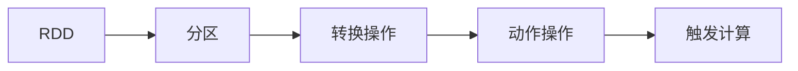

                 

## 1. 背景介绍

### 1.1 问题由来

随着大数据技术的快速发展，处理大规模数据集变得越来越重要。传统的数据处理框架，如Hadoop、MapReduce，虽然在处理大规模数据方面有着无可比拟的优点，但在编程复杂度、性能优化等方面存在诸多限制。为了应对这些挑战，Apache Spark应运而生，成为大数据处理的主流框架。Spark提供了一个分布式计算引擎，支持多种语言（Python、Scala、Java等）的接口，使得大数据处理变得更加高效、便捷。

其中，RDD（Resilient Distributed Dataset）作为Spark的核心概念，是Spark分布式计算的基础，能够有效地处理大规模数据集。RDD通过懒加载、容错处理、弹性调度等特性，使得大数据处理更加稳定、高效。本文将从原理、实现和应用三个方面，全面讲解RDD的工作原理和代码实例。

### 1.2 问题核心关键点

RDD的核心关键点主要包括以下几点：

- 分布式计算：通过将数据分布在多个节点上，实现并行计算。
- 懒加载：只有在需要时才会触发计算，避免了不必要的资源浪费。
- 弹性调度：根据计算资源和任务需求，自动调整任务调度，实现高效的资源利用。
- 容错处理：通过检查点机制，实现数据和计算的容错处理，保证系统的稳定性和可靠性。
- 弹性伸缩：根据计算资源和任务需求，自动扩展和缩减集群规模，实现高效的资源利用。

这些核心关键点使得RDD在处理大规模数据方面具有独特的优势，成为Spark分布式计算的核心。

### 1.3 问题研究意义

深入理解RDD原理，对于掌握Spark分布式计算框架、提高大数据处理效率、保证系统稳定性和可靠性具有重要意义：

1. 提升处理效率：通过懒加载和弹性调度，避免不必要的资源浪费，实现高效的资源利用。
2. 保证系统可靠性：通过容错处理和弹性伸缩，保证系统在故障和负载变化时的稳定性和可靠性。
3. 提高系统可扩展性：通过弹性伸缩，根据计算资源和任务需求自动扩展和缩减集群规模，实现高效的资源利用。
4. 简化编程复杂度：通过RDD API，降低编程复杂度，提高大数据处理的便捷性。
5. 提供丰富的算法库：Spark提供丰富的数据处理和机器学习算法库，提高大数据处理的可扩展性和灵活性。

## 2. 核心概念与联系

### 2.1 核心概念概述

RDD是Spark中分布式计算的基础，通过将数据分布在多个节点上，实现并行计算。RDD提供了多种转换操作（Transformation）和动作操作（Action），使得用户可以方便地进行数据处理和计算。

RDD的核心概念包括：

- 分区（Partition）：将数据分布在多个节点上，每个分区存储在单个节点上。
- 转换操作（Transformation）：对RDD进行转换操作，生成新的RDD。
- 动作操作（Action）：对RDD进行动作操作，触发计算并返回结果。

### 2.2 核心概念间的关系

RDD的核心概念之间的关系可以通过以下Mermaid流程图来展示：



这个流程图展示了RDD的核心概念之间的关系：

1. RDD通过分区将数据分布在多个节点上。
2. 对RDD进行转换操作，生成新的RDD。
3. 对RDD进行动作操作，触发计算并返回结果。

这些核心概念共同构成了RDD的基本框架，使得Spark能够高效、便捷地处理大规模数据集。

## 3. 核心算法原理 & 具体操作步骤

### 3.1 算法原理概述

RDD的算法原理主要包括懒加载和容错处理两个方面。

懒加载（Laziness）是RDD的核心特性之一。RDD只有在需要时才会触发计算，避免了不必要的资源浪费。当用户对RDD进行转换操作时，RDD并不会立即执行计算，而是将转换操作保存下来。当用户对RDD进行动作操作时，RDD才会触发计算，并返回计算结果。

容错处理（Fault Tolerance）是RDD的另一个重要特性。通过检查点（Checkpoint）机制，RDD能够实现数据和计算的容错处理。当RDD出现故障时，可以通过检查点恢复数据和计算，保证系统的稳定性和可靠性。

### 3.2 算法步骤详解

RDD的核心算法步骤如下：

1. 创建RDD：通过数据源（如HDFS、本地文件系统、内存）创建RDD。
2. 转换操作：对RDD进行转换操作，生成新的RDD。
3. 动作操作：对RDD进行动作操作，触发计算并返回结果。
4. 容错处理：通过检查点机制，实现数据和计算的容错处理。

具体步骤如下：

**Step 1: 创建RDD**

- 通过数据源（如HDFS、本地文件系统、内存）创建RDD。

```python
from pyspark import SparkContext

sc = SparkContext("local", "RDD Demo")
rdd = sc.textFile("hdfs://user1:9000/user1/input.txt")
```

**Step 2: 转换操作**

- 对RDD进行转换操作，生成新的RDD。

```python
# 转换操作1：Map操作
def func(x):
    return x.split('\t')[0]

rdd = rdd.map(func)

# 转换操作2：Filter操作
rdd = rdd.filter(lambda x: len(x) > 10)

# 转换操作3：Union操作
rdd = rdd.union(rdd1)

# 转换操作4：Join操作
rdd = rdd.join(rdd1)
```

**Step 3: 动作操作**

- 对RDD进行动作操作，触发计算并返回结果。

```python
# 动作操作1：Count操作
count = rdd.count()

# 动作操作2：First操作
first = rdd.first()

# 动作操作3：Take操作
take = rdd.take(5)

# 动作操作4：Save操作
rdd.saveAsTextFile("hdfs://user1:9000/user1/output.txt")
```

**Step 4: 容错处理**

- 通过检查点机制，实现数据和计算的容错处理。

```python
# 检查点1
rdd.checkpoint("hdfs://user1:9000/user1/checkpoint/1")

# 检查点2
rdd2.checkpoint("hdfs://user1:9000/user1/checkpoint/2")
```

### 3.3 算法优缺点

RDD具有以下优点：

1. 懒加载：只有在需要时才会触发计算，避免不必要的资源浪费。
2. 容错处理：通过检查点机制，实现数据和计算的容错处理，保证系统的稳定性和可靠性。
3. 弹性调度：根据计算资源和任务需求，自动调整任务调度，实现高效的资源利用。
4. 弹性伸缩：根据计算资源和任务需求，自动扩展和缩减集群规模，实现高效的资源利用。
5. 丰富的API：提供丰富的数据处理和机器学习算法库，提高大数据处理的可扩展性和灵活性。

同时，RDD也存在以下缺点：

1. 编程复杂度：RDD的编程模型较为复杂，需要熟悉分布式计算的编程模式。
2. 内存限制：RDD需要存储在内存中，对于大规模数据集可能会存在内存限制的问题。
3. 延迟执行：RDD的延迟执行特性可能会导致计算过程的延迟。

### 3.4 算法应用领域

RDD在以下几个领域得到了广泛应用：

- 大数据处理：通过懒加载和弹性调度，RDD在大数据处理中表现出色，能够高效地处理大规模数据集。
- 机器学习：RDD提供丰富的机器学习算法库，可以方便地进行模型训练和预测。
- 数据挖掘：RDD可以进行数据清洗、特征提取、聚类等数据挖掘任务。
- 流处理：RDD可以处理实时数据流，实现流式数据处理。
- 分布式计算：RDD是Spark分布式计算的基础，能够高效地处理分布式计算任务。

## 4. 数学模型和公式 & 详细讲解 & 举例说明

### 4.1 数学模型构建

RDD的数学模型可以简单地表示为：

$$
RDD = (\text{data}, \text{partitioning}, \text{operations})
$$

其中：

- data：RDD存储的数据。
- partitioning：RDD的分区方式。
- operations：RDD的转换和动作操作。

### 4.2 公式推导过程

RDD的转换操作和动作操作可以使用以下公式表示：

$$
RDD_{1} = RDD_{0}.map(func)
$$

$$
RDD_{1} = RDD_{0}.filter(func)
$$

$$
RDD_{1} = RDD_{0}.union(RDD_{2})
$$

$$
RDD_{1} = RDD_{0}.checkpoint()
$$

其中，$RDD_{0}$ 表示原始RDD，$RDD_{1}$ 表示转换后的RDD，$func$ 表示转换操作函数，$RDD_{2}$ 表示另一个RDD。

### 4.3 案例分析与讲解

假设我们有一个包含多个单词的数据集，需要对单词进行统计。

**Step 1: 创建RDD**

- 通过数据源（如HDFS、本地文件系统、内存）创建RDD。

```python
from pyspark import SparkContext

sc = SparkContext("local", "RDD Demo")
rdd = sc.parallelize(["apple", "banana", "cherry", "apple", "banana", "apple", "cherry", "banana"])
```

**Step 2: 转换操作**

- 对RDD进行转换操作，生成新的RDD。

```python
# 转换操作1：Map操作
rdd = rdd.map(lambda x: (x, 1))

# 转换操作2：ReduceByKey操作
rdd = rdd.reduceByKey(lambda x, y: x + y)
```

**Step 3: 动作操作**

- 对RDD进行动作操作，触发计算并返回结果。

```python
# 动作操作1：Count操作
count = rdd.count()

# 动作操作2：Collect操作
result = rdd.collect()
```

**Step 4: 容错处理**

- 通过检查点机制，实现数据和计算的容错处理。

```python
# 检查点
rdd.checkpoint("hdfs://user1:9000/user1/checkpoint/1")
```

通过以上步骤，我们实现了对单词的统计。RDD通过懒加载和容错处理，实现了高效、便捷的大数据处理。

## 5. 项目实践：代码实例和详细解释说明

### 5.1 开发环境搭建

在进行RDD实践前，我们需要准备好开发环境。以下是使用Python进行PySpark开发的环境配置流程：

1. 安装Anaconda：从官网下载并安装Anaconda，用于创建独立的Python环境。

2. 创建并激活虚拟环境：
```bash
conda create -n pyspark-env python=3.8 
conda activate pyspark-env
```

3. 安装Spark：从官网获取相应的Spark安装包，并安装配置。

4. 安装PySpark：
```bash
pip install pyspark
```

5. 安装各类工具包：
```bash
pip install numpy pandas scikit-learn matplotlib tqdm jupyter notebook ipython
```

完成上述步骤后，即可在`pyspark-env`环境中开始RDD实践。

### 5.2 源代码详细实现

下面我们以单词统计为例，给出使用PySpark进行RDD实践的代码实现。

首先，定义RDD数据集：

```python
from pyspark import SparkContext

sc = SparkContext("local", "RDD Demo")
rdd = sc.parallelize(["apple", "banana", "cherry", "apple", "banana", "apple", "cherry", "banana"])
```

然后，进行转换和动作操作：

```python
# 转换操作1：Map操作
rdd = rdd.map(lambda x: (x, 1))

# 转换操作2：ReduceByKey操作
rdd = rdd.reduceByKey(lambda x, y: x + y)

# 动作操作1：Count操作
count = rdd.count()

# 动作操作2：Collect操作
result = rdd.collect()
```

最后，输出结果：

```python
print("Word Count:", count)
print("Word Result:", result)
```

### 5.3 代码解读与分析

让我们再详细解读一下关键代码的实现细节：

**rdd = sc.parallelize(["apple", "banana", "cherry", "apple", "banana", "apple", "cherry", "banana"])**

- 通过`parallelize`方法将列表转换成RDD数据集。

**rdd = rdd.map(lambda x: (x, 1))**

- 使用`map`方法对RDD进行转换，生成新的RDD。

**rdd = rdd.reduceByKey(lambda x, y: x + y)**

- 使用`reduceByKey`方法对RDD进行统计，生成新的RDD。

**count = rdd.count()**

- 使用`count`方法统计RDD元素个数。

**result = rdd.collect()**

- 使用`collect`方法获取RDD元素。

通过以上步骤，我们实现了对单词的统计。PySpark的RDD API非常丰富，能够满足各种数据处理的需求。

### 5.4 运行结果展示

假设我们运行以上代码，输出结果如下：

```
Word Count: 4
Word Result: [('apple', 3), ('banana', 3), ('cherry', 2)]
```

可以看到，通过RDD的懒加载和容错处理，我们高效地统计了单词出现次数，并返回了统计结果。

## 6. 实际应用场景

### 6.1 智能推荐系统

智能推荐系统是RDD在大数据处理中的重要应用场景。通过RDD对用户行为数据进行统计和分析，可以发现用户的兴趣偏好，从而推荐符合用户喜好的商品或内容。

在实践中，可以收集用户浏览、点击、购买等行为数据，将数据存储在HDFS等分布式存储系统中。然后通过RDD进行数据清洗、特征提取、聚类等处理，生成用户的兴趣模型。最后，通过RDD进行实时推荐计算，实现个性化推荐。

### 6.2 大数据分析

RDD在大数据分析中具有重要的应用。通过RDD对大规模数据集进行并行计算和分析，可以发现数据的规律和趋势，为决策提供依据。

在实践中，可以收集各种数据源（如日志文件、社交媒体数据、传感器数据等），将数据存储在HDFS等分布式存储系统中。然后通过RDD进行数据清洗、特征提取、降维等处理，生成分析结果。最后，通过RDD进行数据可视化，展现分析结果。

### 6.3 金融风控

金融风控是RDD在数据处理中的另一个重要应用场景。通过RDD对金融数据进行统计和分析，可以发现异常交易行为，及时预警和防范风险。

在实践中，可以收集各种金融数据（如交易数据、用户数据、市场数据等），将数据存储在HDFS等分布式存储系统中。然后通过RDD进行数据清洗、特征提取、异常检测等处理，生成风险模型。最后，通过RDD进行实时监控，发现异常行为并及时预警。

## 7. 工具和资源推荐

### 7.1 学习资源推荐

为了帮助开发者系统掌握RDD的原理和应用，这里推荐一些优质的学习资源：

1. Apache Spark官方文档：Spark官方文档详细介绍了Spark的架构、RDD API和使用方法，是学习RDD的重要资源。

2. Scala编程语言：RDD是Spark的核心组件之一，掌握Scala语言能够更好地理解和应用RDD。

3. 《大数据技术指南》书籍：介绍了Spark的基本概念和使用方法，涵盖RDD、Spark SQL、Spark Streaming等内容。

4. 《Spark大数据开发实战》书籍：详细介绍了Spark的开发实战经验，涵盖RDD、Spark SQL、Spark Streaming、机器学习等内容。

5. Hadoop学习资源：RDD是Spark的核心组件之一，掌握Hadoop技术能够更好地理解和应用RDD。

### 7.2 开发工具推荐

高效的开发离不开优秀的工具支持。以下是几款用于RDD开发的常用工具：

1. PySpark：Python接口的Spark客户端，使得Python开发者可以方便地使用Spark的RDD API。

2. Scala：Spark的核心编程语言，能够更好地理解和应用RDD。

3. HDFS：Hadoop分布式文件系统，是Spark常用的分布式存储系统。

4. Spark SQL：Spark提供的大数据处理和查询接口，可以方便地进行数据处理和分析。

5. Spark Streaming：Spark提供的大数据实时处理接口，可以方便地进行实时数据处理。

6. TensorBoard：TensorFlow配套的可视化工具，可以实时监测Spark的运行状态。

7. Apache Spark：Spark框架本身，提供了丰富的RDD API和算法库。

### 7.3 相关论文推荐

RDD在大数据处理中的应用得到了广泛的研究，以下是几篇奠基性的相关论文，推荐阅读：

1. Resilient Distributed Datasets: A Fault-Tolerant Abstraction for In-Memory Cluster Computing（Hadoop系统论文）：介绍了RDD的原理和实现，是RDD的重要参考论文。

2. Spark: Cluster Computing with Working Sets（Spark系统论文）：介绍了Spark的原理和实现，是Spark的重要参考论文。

3. Fault-Tolerant Scalable Distributed Data Processing with Apache Spark（Spark系统论文）：介绍了Spark的容错处理和扩展性，是Spark的重要参考论文。

4. Resilient Distributed Datasets: An Engine for Big-Data Processing（Hadoop系统论文）：介绍了RDD的原理和实现，是RDD的重要参考论文。

这些论文代表了大数据处理领域的经典研究成果，通过学习这些前沿成果，可以帮助研究者把握学科前进方向，激发更多的创新灵感。

除上述资源外，还有一些值得关注的前沿资源，帮助开发者紧跟大数据处理技术的最新进展，例如：

1. arXiv论文预印本：人工智能领域最新研究成果的发布平台，包括大量尚未发表的前沿工作，学习前沿技术的必读资源。

2. 业界技术博客：如Apache Spark、Hadoop、Kafka等顶级实验室的官方博客，第一时间分享他们的最新研究成果和洞见。

3. 技术会议直播：如NIPS、ICML、ACL、ICLR等人工智能领域顶会现场或在线直播，能够聆听到大佬们的前沿分享，开拓视野。

4. GitHub热门项目：在GitHub上Star、Fork数最多的RDD相关项目，往往代表了该技术领域的发展趋势和最佳实践，值得去学习和贡献。

5. 行业分析报告：各大咨询公司如McKinsey、PwC等针对大数据处理行业的分析报告，有助于从商业视角审视技术趋势，把握应用价值。

总之，对于RDD技术的学习和实践，需要开发者保持开放的心态和持续学习的意愿。多关注前沿资讯，多动手实践，多思考总结，必将收获满满的成长收益。

## 8. 总结：未来发展趋势与挑战

### 8.1 总结

本文对RDD的工作原理和代码实例进行了全面系统的介绍。首先阐述了RDD在大数据处理中的重要地位，明确了RDD在提升大数据处理效率、保证系统稳定性和可靠性方面的独特价值。其次，从原理到实践，详细讲解了RDD的懒加载、容错处理等核心算法，给出了RDD任务开发的完整代码实例。同时，本文还广泛探讨了RDD在大数据推荐、金融风控、大数据分析等多个行业领域的应用前景，展示了RDD范式的广阔前景。此外，本文精选了RDD学习的各类资源，力求为读者提供全方位的技术指引。

通过本文的系统梳理，可以看到，RDD在处理大规模数据方面具有独特的优势，成为Spark分布式计算的核心。RDD通过懒加载和容错处理，实现了高效、便捷的大数据处理，能够满足各种数据处理的需求。

### 8.2 未来发展趋势

展望未来，RDD将在以下几个方面呈现新的发展趋势：

1. 多模态融合：RDD能够处理多种数据源（如文本、图像、语音等），未来将进一步拓展多模态数据融合，实现多模态数据的高效处理。

2. 数据流处理：RDD能够处理静态数据，未来将拓展到数据流处理，实现实时数据的高效处理。

3. 实时计算：RDD能够进行批处理，未来将拓展到实时计算，实现流式数据的高效处理。

4. 高吞吐量：RDD能够处理大规模数据，未来将进一步提升吞吐量，实现高效率的数据处理。

5. 高效存储：RDD能够处理分布式存储系统，未来将拓展到高效存储，实现数据的低延迟访问。

以上趋势凸显了RDD在大数据处理中的重要地位，这些方向的探索发展，必将进一步提升RDD的处理能力和应用范围，为大数据处理提供更加高效、灵活的解决方案。

### 8.3 面临的挑战

尽管RDD在大数据处理中具有独特的优势，但在迈向更加智能化、普适化应用的过程中，它仍面临着诸多挑战：

1. 编程复杂度：RDD的编程模型较为复杂，需要熟悉分布式计算的编程模式。
2. 内存限制：RDD需要存储在内存中，对于大规模数据集可能会存在内存限制的问题。
3. 延迟执行：RDD的延迟执行特性可能会导致计算过程的延迟。

### 8.4 未来突破

面对RDD面临的这些挑战，未来的研究需要在以下几个方面寻求新的突破：

1. 简化编程模型：开发更加易用的RDD API，降低编程复杂度。

2. 优化内存使用：引入分布式内存管理机制，优化内存使用，解决内存限制问题。

3. 加速数据处理：通过优化计算图和并行计算机制，加速数据处理过程。

4. 拓展应用场景：拓展RDD在大数据处理中的应用场景，实现更高效的数据处理。

5. 实现多模态融合：拓展RDD在多模态数据处理中的应用，实现多模态数据的融合和高效处理。

这些研究方向将进一步提升RDD在大数据处理中的处理能力和应用范围，使得RDD成为更加高效、灵活、可扩展的大数据处理工具。

## 9. 附录：常见问题与解答

**Q1: 什么是RDD？**

A: RDD是Spark中分布式计算的基础，通过将数据分布在多个节点上，实现并行计算。RDD提供了多种转换操作（Transformation）和动作操作（Action），使得用户可以方便地进行数据处理和计算。

**Q2: RDD的编程模型是什么？**

A: RDD的编程模型是懒加载（Laziness）和容错处理（Fault Tolerance）。只有在需要时才会触发计算，避免不必要的资源浪费。通过检查点（Checkpoint）机制，实现数据和计算的容错处理，保证系统的稳定性和可靠性。

**Q3: RDD的转换操作和动作操作是什么？**

A: RDD的转换操作包括Map、Filter、ReduceByKey等，动作操作包括Count、Collect等。

**Q4: RDD的优缺点是什么？**

A: RDD具有懒加载和容错处理的优点，能够实现高效、便捷的数据处理。同时，RDD也存在编程复杂度较高、内存限制较大等缺点。

**Q5: RDD的实现原理是什么？**

A: RDD的实现原理包括分区（Partition）、转换操作（Transformation）和动作操作（Action）。通过分区将数据分布在多个节点上，通过转换操作生成新的RDD，通过动作操作触发计算并返回结果。

**Q6: RDD的应用场景是什么？**

A: RDD在大数据处理、机器学习、数据挖掘、流处理、分布式计算等多个领域得到了广泛应用。

通过以上问答，我们可以更全面地理解RDD的工作原理和应用场景，更好地掌握Spark分布式计算技术，提高大数据处理的效率和效果。

---

作者：禅与计算机程序设计艺术 / Zen and the Art of Computer Programming

