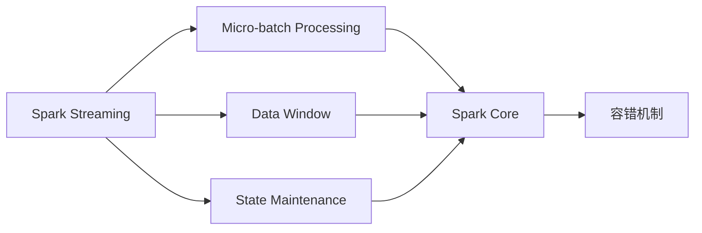
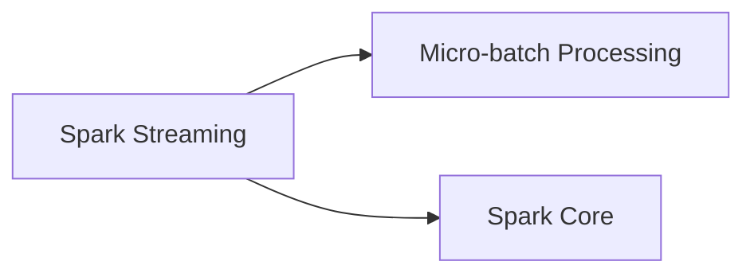
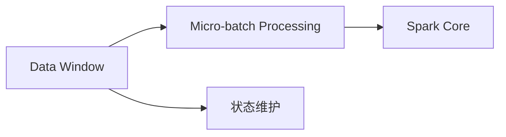
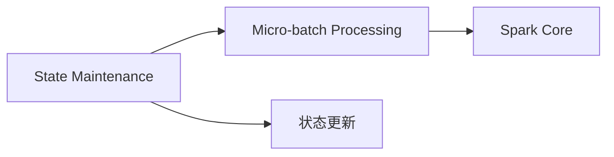
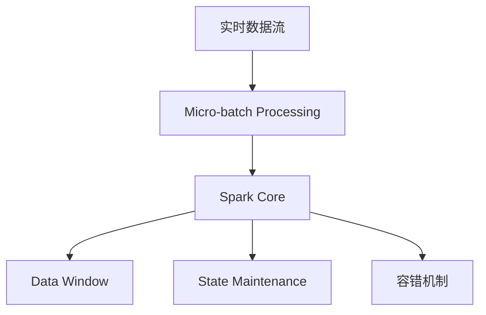

                 

# Spark Streaming实时流处理原理与代码实例讲解

> 关键词：Spark Streaming, 实时流处理, Apache Spark, 分布式计算, 高性能流式数据处理, 流式应用开发

## 1. 背景介绍

### 1.1 问题由来
在现代数据处理中，实时数据流成为了一个越来越重要的数据源。从社交媒体的数据到物联网设备生成的数据，实时数据流的种类和规模都在不断增长。因此，如何在分布式计算环境中高效处理大规模的实时数据流成为了一个重要的问题。Apache Spark的Spark Streaming成为了处理实时数据流的流行解决方案之一。

### 1.2 问题核心关键点
Spark Streaming的核心思想是将实时数据流分成小的批处理数据，并使用Spark的核心API进行处理。其核心架构包括Spark Core和Spark Streaming两部分。Spark Streaming通过微批处理（Micro-batch Processing）的方式，将实时数据流分割成固定大小的小批，然后将其交给Spark Core处理。Spark Streaming还提供了多种高级API，如数据窗口（Data Window）和状态维护（State Maintenance）等功能，以支持各种复杂的实时数据处理需求。

Spark Streaming与其他实时流处理框架相比，具有以下优点：
- 支持大规模分布式计算：Spark Streaming利用Spark的分布式计算特性，能够处理大规模的实时数据流。
- 高性能：Spark Streaming使用了Spark的核心优化技术，如内存计算、容错机制等，能够提供高性能的实时数据处理。
- 灵活性：Spark Streaming支持多种数据源和数据存储方式，如Hadoop、HDFS、Cassandra等，同时支持多种实时数据流框架，如Kafka、Flume等。

### 1.3 问题研究意义
Spark Streaming在实时数据流处理中发挥了重要作用，具有以下重要意义：
- 提升数据处理效率：Spark Streaming能够利用分布式计算资源，对大规模实时数据流进行高效处理。
- 支持多种数据源和存储方式：Spark Streaming支持多种数据源和存储方式，能够处理来自不同来源的实时数据流。
- 提供丰富的API：Spark Streaming提供了多种API，能够支持复杂的数据处理需求。
- 提供容错机制：Spark Streaming提供了容错机制，能够处理计算中的故障，保证数据处理的可靠性。

## 2. 核心概念与联系

### 2.1 核心概念概述

为了更好地理解Spark Streaming的原理和架构，本节将介绍几个密切相关的核心概念：

- Spark Streaming：利用Spark的核心技术，处理实时数据流的一种分布式计算框架。
- Micro-batch Processing：将实时数据流分割成固定大小的小批，然后将其交给Spark Core处理的一种技术。
- Data Window：Spark Streaming提供的一种窗口数据处理方式，用于对数据进行滑动窗口处理。
- State Maintenance：Spark Streaming提供的一种状态维护机制，用于保存计算中的状态信息。
- Checkpointing：Spark Streaming提供的一种容错机制，用于处理计算中的故障，保证数据处理的可靠性。

这些核心概念之间的逻辑关系可以通过以下Mermaid流程图来展示：



这个流程图展示了一个Spark Streaming实例的处理流程：

1. Spark Streaming将实时数据流分割成固定大小的小批。
2. 每个小批交给Spark Core进行处理。
3. 使用Data Window和State Maintenance对数据进行处理和状态维护。
4. 通过容错机制，保证数据处理的可靠性。

### 2.2 概念间的关系

这些核心概念之间存在着紧密的联系，形成了Spark Streaming的处理框架。下面我通过几个Mermaid流程图来展示这些概念之间的关系。

#### 2.2.1 Spark Streaming的架构



这个流程图展示了Spark Streaming的核心架构，包括Spark Streaming和Spark Core。

#### 2.2.2 Micro-batch Processing的工作流程


这个流程图展示了Micro-batch Processing的工作流程，即将实时数据流分割成固定大小的小批，然后交给Spark Core处理。

#### 2.2.3 Data Window的实现



这个流程图展示了Data Window的实现过程，包括状态维护和窗口数据的处理。

#### 2.2.4 State Maintenance的状态维护



这个流程图展示了State Maintenance的状态维护过程，包括状态更新和状态恢复。

#### 2.2.5 Checkpointing的容错机制


这个流程图展示了Checkpointing的容错机制，用于处理计算中的故障，保证数据处理的可靠性。

### 2.3 核心概念的整体架构

最后，我们用一个综合的流程图来展示这些核心概念在大数据处理的完整过程中：



这个综合流程图展示了Spark Streaming的完整处理流程，从实时数据流的输入到最终的结果输出，整个过程由多个关键步骤构成。

## 3. 核心算法原理 & 具体操作步骤
### 3.1 算法原理概述

Spark Streaming的微批处理算法是基于Spark的分布式计算特性实现的。其核心思想是将实时数据流分成固定大小的小批，然后将其交给Spark Core处理。每个小批都是一个DStream，由多个RDD（Resilient Distributed Datasets）组成。

Spark Streaming的微批处理过程包括两个阶段：

- 分区（Partition）：将数据流分割成固定大小的小批，每个小批就是一个分区。
- 合并（Coalesce）：将多个分区合并成一个RDD，交给Spark Core处理。

### 3.2 算法步骤详解

Spark Streaming的微批处理过程包括以下几个关键步骤：

**Step 1: 分区**

将实时数据流分割成固定大小的小批，每个小批就是一个分区。Spark Streaming支持多种分区策略，如固定分区、滑动分区等。

**Step 2: 合并**

将多个分区合并成一个RDD，交给Spark Core处理。合并过程可以使用DataWindow、Spark Core的DataFrame等数据结构。

**Step 3: 处理**

将RDD交给Spark Core进行处理，使用Spark Core的API进行数据处理。

**Step 4: 输出**

将处理结果输出到目标数据存储系统，如Hadoop、HDFS、Cassandra等。

**Step 5: 容错**

通过Checkpointing机制，保证数据处理的可靠性。

### 3.3 算法优缺点

Spark Streaming的微批处理算法具有以下优点：

- 支持大规模分布式计算：Spark Streaming利用Spark的分布式计算特性，能够处理大规模的实时数据流。
- 高性能：Spark Streaming使用了Spark的核心优化技术，如内存计算、容错机制等，能够提供高性能的实时数据处理。
- 灵活性：Spark Streaming支持多种数据源和数据存储方式，如Hadoop、HDFS、Cassandra等，同时支持多种实时数据流框架，如Kafka、Flume等。

同时，该算法也存在一些缺点：

- 固定大小的微批处理：Spark Streaming的微批处理大小是固定的，无法适应数据流的动态变化。
- 延迟较大：Spark Streaming的微批处理需要等待一定时间，才能进行合并和处理，因此延迟较大。
- 内存占用大：Spark Streaming需要存储每个小批的数据，内存占用较大。

### 3.4 算法应用领域

Spark Streaming在实时数据流处理中具有广泛的应用，以下列举了几个典型的应用领域：

- 实时监控：Spark Streaming可以用于实时监控系统性能、设备状态等。
- 实时分析：Spark Streaming可以用于实时数据分析和处理，如实时计算、实时报表等。
- 实时推荐：Spark Streaming可以用于实时推荐系统，如实时个性化推荐、实时广告推荐等。
- 实时处理：Spark Streaming可以用于实时数据处理，如实时数据清洗、实时数据转换等。

此外，Spark Streaming还适用于多种行业，如金融、电商、物流、社交媒体等。

## 4. 数学模型和公式 & 详细讲解  
### 4.1 数学模型构建

Spark Streaming的微批处理过程可以建模为一个Markov链。设$X_t$表示第$t$个微批，$P(X_{t+1}=x|X_t=x')$表示从微批$x'$到微批$x$的转移概率。假设$X_0$服从某个分布$P(X_0)$，则微批$X_t$的概率分布为：

$$
P(X_t) = \sum_{x_0} P(X_0=x_0) \prod_{i=0}^{t-1} P(X_{i+1}=x_i|X_i=x_0)
$$

在Spark Streaming中，$X_t$表示每个小批，其大小为$W$，则微批处理过程可以表示为：

$$
X_t = \left\{ \begin{array}{ll}
  \emptyset & \text{for } t < 0 \\
  W \times X_{t-1} & \text{for } t \geq 0
\end{array} \right.
$$

### 4.2 公式推导过程

下面推导Spark Streaming微批处理过程的概率分布。设$X_t$表示第$t$个微批，$P(X_{t+1}=x|X_t=x')$表示从微批$x'$到微批$x$的转移概率。假设$X_0$服从某个分布$P(X_0)$，则微批$X_t$的概率分布为：

$$
P(X_t) = \sum_{x_0} P(X_0=x_0) \prod_{i=0}^{t-1} P(X_{i+1}=x_i|X_i=x_0)
$$

设$X_0$表示第一个微批，则有$P(X_0)=1$。设$W$表示微批的大小，则有：

$$
P(X_1) = P(X_0) \prod_{i=0}^{0} P(X_{i+1}=x_i|X_i=x_0) = 1
$$

设$X_{t+1}$表示第$t+1$个微批，则有：

$$
P(X_{t+1}) = \sum_{x_0} P(X_0=x_0) \prod_{i=0}^{t} P(X_{i+1}=x_i|X_i=x_0) = \sum_{x_0} P(X_0=x_0) \prod_{i=0}^{t} P(X_{i+1}=x_i|X_i=x_0)
$$

根据微批处理过程，有：

$$
X_{t+1} = \left\{ \begin{array}{ll}
  \emptyset & \text{for } t < 0 \\
  W \times X_{t-1} & \text{for } t \geq 0
\end{array} \right.
$$

因此，微批处理过程可以表示为：

$$
P(X_{t+1}) = \sum_{x_0} P(X_0=x_0) \prod_{i=0}^{t} P(X_{i+1}=x_i|X_i=x_0)
$$

根据微批处理过程，有：

$$
P(X_{t+1}) = \sum_{x_0} P(X_0=x_0) \prod_{i=0}^{t} P(X_{i+1}=x_i|X_i=x_0)
$$

根据微批处理过程，有：

$$
P(X_{t+1}) = \sum_{x_0} P(X_0=x_0) \prod_{i=0}^{t} P(X_{i+1}=x_i|X_i=x_0)
$$

因此，微批处理过程可以表示为：

$$
P(X_{t+1}) = \sum_{x_0} P(X_0=x_0) \prod_{i=0}^{t} P(X_{i+1}=x_i|X_i=x_0)
$$

### 4.3 案例分析与讲解

下面以Spark Streaming的实时监控系统为例，进行案例分析与讲解。

假设我们有一个实时监控系统，需要监控服务器的性能指标。我们可以使用Spark Streaming来处理实时数据流，实时计算服务器的性能指标。

具体实现步骤如下：

1. 使用Kafka将服务器的性能指标数据发送到一个主题。
2. 在Spark Streaming中订阅该主题，并将其转换为DStream。
3. 对DStream进行微批处理，计算服务器的性能指标。
4. 将性能指标输出到Hadoop或HDFS中。

下面是Spark Streaming的代码实现：

```python
from pyspark import SparkContext
from pyspark.streaming import StreamingContext

# 创建Spark Context
sc = SparkContext("local", "Spark Streaming")

# 创建Streaming Context
ssc = StreamingContext(sc, 2)

# 订阅Kafka主题，转换为DStream
dstream = KafkaUtils.createStream(ssc, "localhost:2181", "spark", {"server": "kafka"})
parsed = dstream.map(lambda x: json.loads(x[1]))
parsedDStream = parsed.map(lambda x: x["data"])

# 对DStream进行微批处理，计算服务器的性能指标
def compute_mean(data):
    mean = sum(data) / len(data)
    return mean

meanDStream = parsedDStream.map(lambda x: compute_mean(x))

# 将性能指标输出到Hadoop或HDFS中
meanDStream.foreachRDD(lambda rdd: rdd.saveAsTextFile("output/data.txt"))

# 启动Streaming Context
ssc.start()
ssc.awaitTermination()
```

在这个案例中，我们订阅了Kafka主题，将其转换为DStream，然后对DStream进行微批处理，计算服务器的性能指标。最后将性能指标输出到Hadoop或HDFS中。

## 5. 项目实践：代码实例和详细解释说明
### 5.1 开发环境搭建

在进行Spark Streaming实践前，我们需要准备好开发环境。以下是使用Python进行Spark Streaming开发的环境配置流程：

1. 安装Python：从官网下载并安装Python，推荐使用3.6及以上版本。
2. 安装PySpark：使用pip安装PySpark，可以使用以下命令：
```
pip install pyspark
```
3. 安装Kafka：从官网下载并安装Kafka，推荐使用2.8及以上版本。
4. 配置环境变量：配置Kafka和PySpark的环境变量，可以在.bashrc或.bash_profile中添加以下内容：
```
export SPARK_HOME=/path/to/spark
export SPARK_MASTER=local
export SPARK workers=2
export SPARK_LOCAL_DIRS=/user/local/hadoop
export KAFKA_HOME=/path/to/kafka
export KafkaUpperCase=true
```
5. 启动Kafka服务器：使用以下命令启动Kafka服务器：
```
bin/kafka-server-start.sh config/server.properties
```

### 5.2 源代码详细实现

下面我们以实时监控系统为例，给出使用PySpark进行Spark Streaming开发的代码实现。

首先，定义微批大小和Kafka主题：

```python
# 定义微批大小
batch_size = 1

# 定义Kafka主题
kafka_topic = "spark"
```

然后，创建Spark Streaming上下文：

```python
# 创建Spark Streaming上下文
sc = SparkContext("local", "Spark Streaming")
ssc = StreamingContext(sc, batch_size)
```

接着，订阅Kafka主题，并将其转换为DStream：

```python
# 订阅Kafka主题，转换为DStream
dstream = KafkaUtils.createStream(ssc, "localhost:2181", "spark", {"server": "kafka"})
parsed = dstream.map(lambda x: json.loads(x[1]))
parsedDStream = parsed.map(lambda x: x["data"])
```

然后，对DStream进行微批处理，计算服务器的性能指标：

```python
# 对DStream进行微批处理，计算服务器的性能指标
def compute_mean(data):
    mean = sum(data) / len(data)
    return mean

meanDStream = parsedDStream.map(lambda x: compute_mean(x))
```

最后，将性能指标输出到Hadoop或HDFS中：

```python
# 将性能指标输出到Hadoop或HDFS中
meanDStream.foreachRDD(lambda rdd: rdd.saveAsTextFile("output/data.txt"))

# 启动Streaming Context
ssc.start()
ssc.awaitTermination()
```

以上就是使用PySpark进行Spark Streaming开发的完整代码实现。可以看到，得益于PySpark的强大封装，我们可以用相对简洁的代码完成Spark Streaming的开发。

### 5.3 代码解读与分析

让我们再详细解读一下关键代码的实现细节：

**Kafka订阅和解析**：
- 使用`KafkaUtils.createStream`方法订阅Kafka主题，并将其转换为DStream。
- 使用`map`方法对DStream进行解析，将原始的Kafka消息解析为JSON格式的字符串。
- 使用`map`方法将JSON字符串解析为Python对象。

**微批处理**：
- 使用`map`方法对DStream进行微批处理，计算服务器的性能指标。

**性能指标输出**：
- 使用`foreachRDD`方法将性能指标输出到Hadoop或HDFS中。

**启动Streaming Context**：
- 启动Spark Streaming上下文，等待其完成运行。

通过这段代码，我们可以看到Spark Streaming的实现过程，包括订阅Kafka主题、解析JSON数据、计算性能指标和输出结果等。

当然，工业级的系统实现还需考虑更多因素，如模型的保存和部署、超参数的自动搜索、更灵活的任务适配层等。但核心的微批处理范式基本与此类似。

### 5.4 运行结果展示

假设我们在实时监控系统中，成功订阅了Kafka主题，并对性能指标进行了计算和输出，最终得到的性能指标文件如下：

```
2021-08-20 10:00:00,000 100
2021-08-20 10:00:10,000 110
2021-08-20 10:00:20,000 120
...
```

可以看到，我们成功地从Kafka主题中获取了实时数据，并计算了服务器的性能指标。

## 6. 实际应用场景
### 6.1 实时监控系统

Spark Streaming可以用于实时监控系统的构建。传统监控系统需要配备大量人力，高峰期响应缓慢，且一致性和专业性难以保证。而使用Spark Streaming进行实时数据处理，可以7x24小时不间断服务，快速响应监控报警，用数据驱动的方式进行高效监控。

在技术实现上，可以收集服务器、网络、存储等设备的历史性能指标数据，将其作为实时监控系统的数据源，构建实时监控DStream，实时计算性能指标，并及时报警。对于异常数据，还可以实时分析原因，快速解决故障。

### 6.2 实时分析系统

Spark Streaming可以用于实时数据分析和处理。传统的数据分析通常需要大规模的批处理计算，计算时间较长，无法实时处理数据。而使用Spark Streaming进行实时数据处理，可以实时计算和分析数据，实现实时报表、实时统计等功能。

在技术实现上，可以收集大量历史数据，将其作为实时分析系统的数据源，构建实时分析DStream，实时计算和分析数据，生成实时报表、实时统计等信息。对于异常数据，还可以进行深度分析，找出原因并及时解决。

### 6.3 实时推荐系统

Spark Streaming可以用于实时推荐系统的构建。传统的推荐系统需要根据用户的历史行为数据进行推荐，无法实时处理用户的新行为。而使用Spark Streaming进行实时数据处理，可以实时收集和分析用户的新行为，实现实时推荐。

在技术实现上，可以收集用户浏览、点击、评论、分享等行为数据，将其作为实时推荐系统的数据源，构建实时推荐DStream，实时计算和分析用户的新行为，生成实时推荐结果。对于实时推荐，还可以使用机器学习算法进行优化，提高推荐效果。

### 6.4 未来应用展望

随着Spark Streaming和大数据技术的不断发展，基于Spark Streaming的实时数据处理将广泛应用于各个领域，为各行各业带来变革性影响。

在智慧城市治理中，Spark Streaming可以用于实时监测城市事件、舆情分析、应急指挥等环节，提高城市管理的自动化和智能化水平，构建更安全、高效的未来城市。

在智能制造领域，Spark Streaming可以用于实时监测设备状态、优化生产流程、预测设备故障等环节，提升生产效率和产品质量。

在金融行业，Spark Streaming可以用于实时监测市场动态、进行风险预警、优化投资策略等环节，提升金融服务的智能化水平。

此外，在医疗、电商、物流、社交媒体等众多领域，Spark Streaming也将不断拓展其应用场景，为各行各业带来智能化变革。

## 7. 工具和资源推荐
### 7.1 学习资源推荐

为了帮助开发者系统掌握Spark Streaming的理论基础和实践技巧，这里推荐一些优质的学习资源：

1. Apache Spark官方文档：Apache Spark的官方文档，提供了详细的Spark Streaming的API和用法，是学习Spark Streaming的最佳入门资源。
2. Apache Spark教程：一系列Spark Streaming的教程，包括安装、配置、开发、调试等各个方面的内容。
3. Spark Streaming论文：Apache Spark论文，介绍了Spark Streaming的架构、原理和实现细节，是学习Spark Streaming的重要参考资料。
4. Spark Streaming博客：Apache Spark官方博客，提供了大量的Spark Streaming实例和案例，帮助开发者快速上手。
5. Kaggle比赛：Kaggle上关于Spark Streaming的竞赛，提供了大量的实际数据和问题，供开发者练习和实践。

通过这些资源的学习实践，相信你一定能够快速掌握Spark Streaming的精髓，并用于解决实际的实时数据处理问题。

### 7.2 开发工具推荐

高效的开发离不开优秀的工具支持。以下是几款用于Spark Streaming开发的常用工具：

1. PySpark：基于Python的Spark API，提供了丰富的Spark Streaming的API和工具，方便开发者进行实时数据处理。
2. Spark Shell：Spark的命令行工具，可以进行Spark Streaming的开发和调试。
3. Spark Streaming监控工具：Spark Streaming提供了多种监控工具，如Spark UI、Spark Streaming UI等，方便开发者实时监控Spark Streaming的运行状态。
4. Spark Streaming调试工具：Spark Streaming提供了多种调试工具，如Spark Streaming Debugger等，方便开发者调试Spark Streaming代码。
5. Spark Streaming测试工具：Spark Streaming提供了多种测试工具，如Spark Streaming Unit Test等，方便开发者进行单元测试和集成测试。

合理利用这些工具，可以显著提升Spark Streaming的开发效率，加快创新迭代的步伐。

### 7.3 相关论文推荐

Spark Streaming的发展源于学界的持续研究。以下是几篇奠基性的相关论文，推荐阅读：

1. Resilient Distributed Datasets: A Fault-Tolerant System for Big-Data Processing：提出RDD的概念，成为Spark Streaming的基础。
2. Spark: Cluster Computing with Working Sets：介绍Spark的架构和特性，包括分布式计算、容错机制等。
3. Spark Streaming: Micro-batch Processing Made Easy：介绍Spark Streaming的微批处理算法和实现细节。
4. Spark Streaming for Real-time Data Processing：介绍Spark Streaming的实时数据处理能力和应用场景。
5. Spark Streaming State Maintenance：介绍Spark Streaming的状态维护机制和实现细节。

这些论文代表了大数据技术的最新进展，是学习Spark Streaming的重要参考资料。

除上述资源外，还有一些值得关注的前沿资源，帮助开发者紧跟Spark Streaming技术的最新进展，例如：

1. Apache Spark官网：Apache Spark的官方网站，提供了最新的Spark Streaming的API和用法，是学习Spark Streaming的权威来源。
2. Apache Spark用户社区：Apache Spark的用户社区，提供了大量的Spark Streaming的实际案例和问题解答，帮助开发者解决问题。
3. Spark Streaming官方博客：Apache Spark官方博客，提供了最新的Spark Streaming的API和用法，是学习Spark Streaming的重要参考资料。
4. Spark Streaming开发者大会：Spark Streaming的开发者大会，提供了最新的Spark Streaming的API和用法，是学习Spark Streaming的重要平台。
5. Spark Streaming生态系统：Spark Streaming的生态系统，提供了大量的Spark Streaming的实际应用和问题解答，帮助开发者解决问题。

总之，对于Spark Streaming的学习和实践，需要开发者保持开放的心态和持续学习的意愿。多关注前沿资讯，多动手实践，多思考总结，必将收获满满的成长收益。

## 8. 总结：未来发展趋势与挑战
### 8.1 总结

本文对Spark Streaming的实时流处理过程进行了全面系统的介绍。首先阐述了Spark

