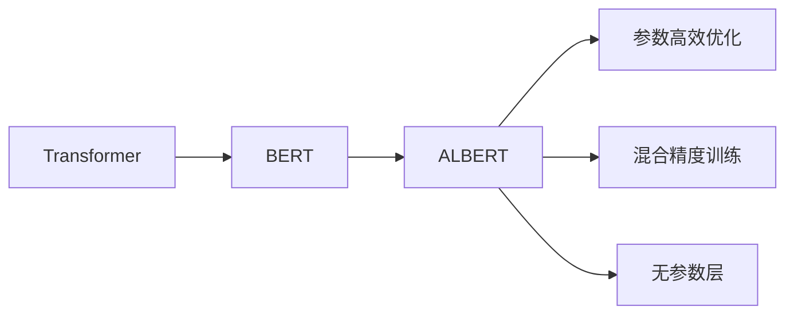
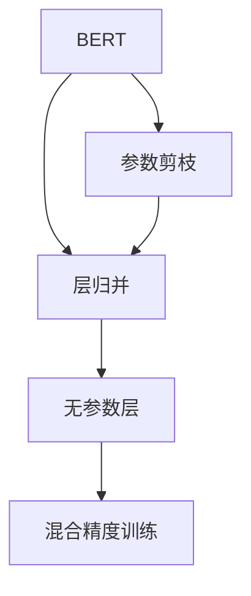
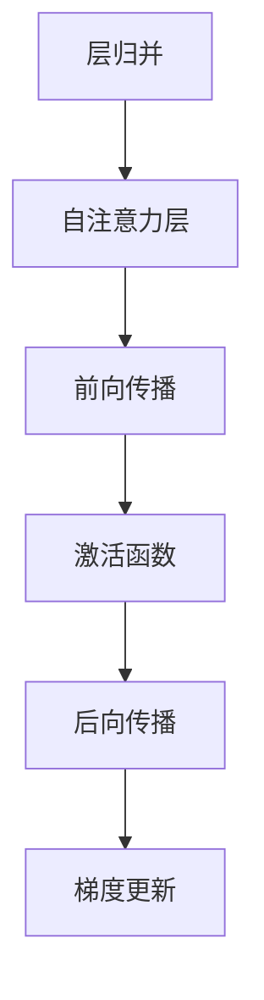
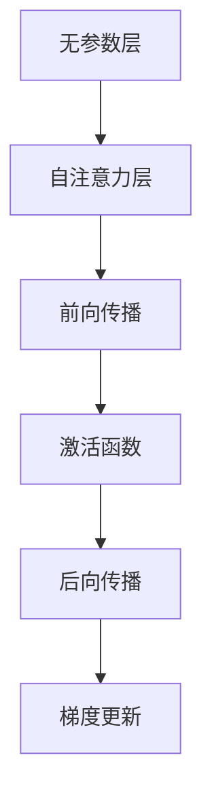
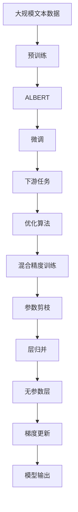

                 

# Transformer大模型实战 BERT 的精简版ALBERT

> 关键词：Transformer, BERT, ALBERT, 大模型, 语言模型, 优化算法

## 1. 背景介绍

### 1.1 问题由来
Transformer作为现代深度学习领域的核心模型，近年来在自然语言处理(NLP)领域取得了显著的突破。其代表作品BERT（Bidirectional Encoder Representations from Transformers）大模型，不仅在多个NLP任务上取得了SOTA（State-of-the-Art）的性能，更引领了预训练大模型的新时代。

然而，由于BERT的参数量庞大，所需的计算资源较多，训练和推理时间较长，使得其在实际应用中的效率和成本均较高。为解决这一问题，研究人员提出了多种优化思路，其中ALBERT（A Lite BERT）就是针对此问题提出的一个高效优化版本。

### 1.2 问题核心关键点
ALBERT作为一种基于Transformer的精简版，与BERT相比，采用了多种优化技术，包括参数剪枝、层归并、无参数层等。其核心目标是在保持BERT核心架构的基础上，大幅减少计算量和内存消耗，从而实现更高效、更快速的模型训练和推理。

ALBERT在多个NLP任务上取得了与BERT相当的性能，但参数量仅为BERT的不到十分之一。因此，ALBERT不仅具有高效计算的优势，还能够在有限的计算资源下，实现更强大的NLP模型训练和推理能力。

### 1.3 问题研究意义
ALBERT的成功实践，不仅体现了深度学习模型的压缩和优化潜力，更展示了如何通过技术手段降低计算成本，加速NLP模型的应用落地。其研究意义在于：

1. 优化预训练大模型，降低计算资源需求，使更多机构和研究者能够快速开展NLP研究工作。
2. 提升模型的推理效率，加速模型的部署和应用，提高实际业务的处理能力。
3. 为其他大模型的优化提供借鉴，推动整个深度学习领域向高效、实用方向发展。
4. 带动NLP技术的普及和应用，加速传统行业的数字化转型。

## 2. 核心概念与联系

### 2.1 核心概念概述

为更好地理解ALBERT的优化思路和架构特点，本节将介绍几个密切相关的核心概念：

- **Transformer**：一种基于自注意力机制的神经网络结构，能够高效地处理序列数据，是现代深度学习中的核心技术。
- **BERT**：一种大规模预训练语言模型，通过双向自注意力机制学习语言表示，广泛应用于各种NLP任务中。
- **ALBERT**：BERT的精简版，通过多种优化技术，如层归并、无参数层、混合精度训练等，大幅降低模型计算量和内存消耗。
- **参数高效优化**：通过剪枝、混合精度训练等技术，减少模型参数量，提高模型优化效率。
- **混合精度训练**：通过使用16位浮点数（FP16）代替32位浮点数（FP32）进行模型训练，大幅提升计算速度和内存效率。
- **无参数层（LayerDrop）**：在每个训练批次中，随机选择部分自注意力层进行训练，减少计算量，提高模型训练速度。

这些核心概念之间的逻辑关系可以通过以下Mermaid流程图来展示：



这个流程图展示了大语言模型从Transformer到ALBERT的优化过程：

1. Transformer作为基础模型，提供了高效的序列处理能力。
2. BERT在此基础上引入双向自注意力机制，学习通用的语言表示。
3. ALBERT在BERT的基础上，通过参数高效优化、混合精度训练等技术，大幅降低计算量和内存消耗，实现高效计算。

### 2.2 概念间的关系

这些核心概念之间存在着紧密的联系，形成了ALBERT的优化架构。下面我们通过几个Mermaid流程图来展示这些概念之间的关系。

#### 2.2.1 从BERT到ALBERT的优化思路



这个流程图展示了ALBERT对BERT的优化思路：

1. 从BERT模型出发，进行参数剪枝，减少不必要的参数量。
2. 对剩余层进行层归并，减少计算量。
3. 引入无参数层（LayerDrop），进一步减少计算量。
4. 使用混合精度训练，提升计算速度和内存效率。

#### 2.2.2 ALBERT的层归并优化



这个流程图展示了ALBERT中的层归并优化：

1. 将多个自注意力层进行归并，减少计算量。
2. 仅在前向传播和后向传播中保留部分关键层，其余层通过加权平均的方式进行计算。

#### 2.2.3 ALBERT的层归并与无参数层结合



这个流程图展示了ALBERT中的层归并与无参数层结合：

1. 在每个训练批次中，随机选择部分自注意力层进行训练，减少计算量。
2. 其余层通过加权平均的方式进行计算，进一步降低计算量。

### 2.3 核心概念的整体架构

最后，我们用一个综合的流程图来展示ALBERT的优化架构：



这个综合流程图展示了从预训练到微调的完整过程：

1. 使用大规模文本数据进行预训练，学习通用的语言表示。
2. 预训练后的模型转换为ALBERT，进行参数高效优化。
3. 在特定下游任务上进行微调，获得任务特定的表示。
4. 通过优化算法，使用混合精度训练、参数剪枝、层归并等技术，进一步提升计算效率。
5. 在任务数据上进行微调，优化模型性能。
6. 输出微调后的模型，供实际应用。

通过这些流程图，我们可以更清晰地理解ALBERT的优化架构，为后续深入讨论具体的优化方法和技术奠定基础。

## 3. 核心算法原理 & 具体操作步骤
### 3.1 算法原理概述

ALBERT的优化思路主要包括以下几个关键步骤：

1. **参数剪枝**：通过去除模型中的冗余参数，减少计算量。
2. **层归并**：将多个自注意力层进行归并，减少计算量。
3. **无参数层（LayerDrop）**：在每个训练批次中，随机选择部分自注意力层进行训练，进一步减少计算量。
4. **混合精度训练**：使用16位浮点数（FP16）代替32位浮点数（FP32）进行模型训练，提升计算速度和内存效率。

这些优化技术共同作用，使得ALBERT在保持BERT核心架构的同时，大幅降低了计算量和内存消耗，实现了高效计算。

### 3.2 算法步骤详解

**Step 1: 准备数据和预训练模型**

- 收集大规模无标签文本数据，进行预训练。
- 选择合适的预训练模型，如BERT，作为初始化参数。
- 根据任务需求，选择ALBERT模型作为优化后的模型。

**Step 2: 参数剪枝**

- 分析预训练模型的参数分布，识别出冗余参数。
- 通过剪枝技术，去除不重要的参数，保留关键参数。
- 使用剪枝后参数的模型进行后续优化。

**Step 3: 层归并**

- 将多个自注意力层进行归并，保留关键层。
- 使用加权平均的方式计算归并后的层，减少计算量。
- 保留的层数量通常为原层数量的1/3到1/4。

**Step 4: 无参数层（LayerDrop）**

- 在每个训练批次中，随机选择部分自注意力层进行训练，其余层通过加权平均的方式进行计算。
- 保留的层数量通常为原层数量的1/3到1/4。
- 无参数层可以进一步减少计算量，提高模型训练速度。

**Step 5: 混合精度训练**

- 使用混合精度训练，将模型参数、梯度、激活函数等使用16位浮点数代替32位浮点数。
- 使用较少的计算资源，提升模型训练速度。
- 训练过程中需要注意精度损失，确保模型性能不受影响。

**Step 6: 微调**

- 根据下游任务，设计合适的任务适配层，如分类器、解码器等。
- 使用ALBERT模型作为初始化参数，进行有监督的微调。
- 选择合适的优化算法和超参数，进行模型训练和优化。

**Step 7: 输出微调后的模型**

- 在任务数据集上评估微调后的模型性能。
- 输出微调后的模型，供实际应用。

### 3.3 算法优缺点

ALBERT的优点主要包括：

1. **高效计算**：通过参数剪枝、层归并、无参数层等技术，大幅减少计算量和内存消耗。
2. **性能稳定**：保留了BERT的核心架构，保留了其在NLP任务上的强大表现。
3. **可扩展性**：模型压缩技术可以应用于各种预训练语言模型，提高模型的应用灵活性。

ALBERT的缺点主要包括：

1. **参数剪枝难度大**：需要精细的参数分析和剪枝技术，保证剪枝后的模型性能。
2. **混合精度训练风险**：精度损失可能影响模型性能，需要谨慎使用。
3. **模型设计复杂**：需要多轮优化，技术门槛较高。

尽管存在这些局限性，ALBERT的优化思路和架构设计仍为深度学习模型的优化提供了宝贵的参考和借鉴。

### 3.4 算法应用领域

ALBERT作为BERT的精简版，在NLP领域的多个任务上取得了与BERT相当的性能，参数量却大大减少。其高效计算的优势使其在资源有限的场景下，仍然能够提供强大的NLP模型服务。具体应用领域包括：

- **文本分类**：如情感分析、主题分类等。
- **命名实体识别**：识别文本中的人名、地名、机构名等特定实体。
- **问答系统**：对自然语言问题给出答案。
- **文本生成**：如自动摘要、机器翻译等。
- **信息检索**：如检索相关文档，推荐相似内容。

## 4. 数学模型和公式 & 详细讲解 & 举例说明

### 4.1 数学模型构建

ALBERT的数学模型主要基于Transformer架构，包括自注意力层、前向传播层、激活函数、后向传播等组成部分。

#### 4.1.1 自注意力层

设输入序列为 $x=(x_1,x_2,\ldots,x_n)$，自注意力层的计算过程如下：

1. 对输入序列进行位置编码，生成位置向量 $E$。
2. 使用位置向量 $E$ 和输入序列 $x$ 生成查询向量 $Q$。
3. 对查询向量 $Q$ 进行归一化，得到归一化查询向量 $\tilde{Q}$。
4. 对输入序列 $x$ 生成键向量 $K$ 和值向量 $V$。
5. 使用归一化查询向量 $\tilde{Q}$ 和键向量 $K$ 计算注意力分数 $S$。
6. 通过注意力分数 $S$ 和值向量 $V$ 计算注意力输出 $O$。

$$
E = QW^Q + b_Q
$$
$$
Q = QW^Q + b_Q
$$
$$
K = KW^K + b_K
$$
$$
V = VW^V + b_V
$$
$$
\tilde{Q} = \frac{Q}{\sqrt{d_k}}
$$
$$
S = \tilde{Q}K^T
$$
$$
O = softmax(S)V
$$

其中，$W^Q, W^K, W^V$ 和 $b_Q, b_K, b_V$ 为线性投影层和偏置项。$d_k$ 为键向量维度。

#### 4.1.2 前向传播层

前向传播层包括两个子层：全连接层和归一化层。

$$
X_1 = X + M_1
$$
$$
X_2 = \tanh(X_1W_2 + b_2)
$$
$$
X_3 = X_2 + M_3
$$

其中，$W_2$ 和 $b_2$ 为线性投影层和偏置项，$M_1$ 和 $M_3$ 为归一化层，即 LayerNorm。

#### 4.1.3 激活函数

前向传播层的激活函数为 ReLU。

### 4.2 公式推导过程

以下是ALBERT中自注意力层的计算公式推导：

1. 输入序列 $x$ 经过线性投影层和位置编码，得到查询向量 $Q$。

$$
Q = QW^Q + b_Q = \begin{bmatrix}
    W^Qx_1 + b_Q \\
    W^Qx_2 + b_Q \\
    \vdots \\
    W^Qx_n + b_Q \\
\end{bmatrix}
$$

2. 使用位置向量 $E$ 和查询向量 $Q$ 生成归一化查询向量 $\tilde{Q}$。

$$
\tilde{Q} = \frac{Q}{\sqrt{d_k}} = \begin{bmatrix}
    \frac{W^Qx_1}{\sqrt{d_k}} \\
    \frac{W^Qx_2}{\sqrt{d_k}} \\
    \vdots \\
    \frac{W^Qx_n}{\sqrt{d_k}} \\
\end{bmatrix}
$$

3. 输入序列 $x$ 经过线性投影层和位置编码，得到键向量 $K$ 和值向量 $V$。

$$
K = KW^K + b_K = \begin{bmatrix}
    W^Kx_1 + b_K \\
    W^Kx_2 + b_K \\
    \vdots \\
    W^Kx_n + b_K \\
\end{bmatrix}
$$
$$
V = VW^V + b_V = \begin{bmatrix}
    W^Vx_1 + b_V \\
    W^Vx_2 + b_V \\
    \vdots \\
    W^Vx_n + b_V \\
\end{bmatrix}
$$

4. 使用归一化查询向量 $\tilde{Q}$ 和键向量 $K$ 计算注意力分数 $S$。

$$
S = \tilde{Q}K^T = \begin{bmatrix}
    \frac{W^Qx_1}{\sqrt{d_k}} & K^T \\
    \frac{W^Qx_2}{\sqrt{d_k}} & K^T \\
    \vdots & \vdots \\
    \frac{W^Qx_n}{\sqrt{d_k}} & K^T \\
\end{bmatrix}
$$

5. 通过注意力分数 $S$ 和值向量 $V$ 计算注意力输出 $O$。

$$
O = softmax(S)V = \begin{bmatrix}
    \sum_{i=1}^n \frac{\exp(S_{1i})}{\sum_{j=1}^n \exp(S_{1j})} V_i \\
    \sum_{i=1}^n \frac{\exp(S_{2i})}{\sum_{j=1}^n \exp(S_{2j})} V_i \\
    \vdots \\
    \sum_{i=1}^n \frac{\exp(S_{ni})}{\sum_{j=1}^n \exp(S_{nj})} V_i \\
\end{bmatrix}
$$

### 4.3 案例分析与讲解

以下通过一个具体案例，展示ALBERT在文本分类任务上的应用过程：

#### 4.3.1 案例背景

假设我们要对一篇新闻文章进行分类，判断其属于“政治”、“经济”还是“体育”类别。文章文本为：

```
某国家政府今天宣布了一项新的经济刺激计划，旨在振兴该国经济。
```

#### 4.3.2 数据预处理

1. 对文本进行分词和词向量编码，得到输入序列 $x=(x_1,x_2,\ldots,x_n)$。
2. 对输入序列进行位置编码，生成位置向量 $E$。

#### 4.3.3 自注意力层计算

1. 使用位置向量 $E$ 和输入序列 $x$ 生成查询向量 $Q$。
2. 对查询向量 $Q$ 进行归一化，得到归一化查询向量 $\tilde{Q}$。
3. 对输入序列 $x$ 生成键向量 $K$ 和值向量 $V$。
4. 使用归一化查询向量 $\tilde{Q}$ 和键向量 $K$ 计算注意力分数 $S$。
5. 通过注意力分数 $S$ 和值向量 $V$ 计算注意力输出 $O$。

#### 4.3.4 前向传播层计算

1. 将注意力输出 $O$ 输入到前向传播层，进行全连接层和归一化层计算。
2. 对前向传播层的输出进行激活函数计算。

#### 4.3.5 分类器计算

1. 将前向传播层的输出输入到分类器，计算分类概率。
2. 通过分类概率判断文章属于“政治”、“经济”还是“体育”类别。

## 5. 项目实践：代码实例和详细解释说明

### 5.1 开发环境搭建

在进行ALBERT微调实践前，我们需要准备好开发环境。以下是使用Python进行PyTorch开发的环境配置流程：

1. 安装Anaconda：从官网下载并安装Anaconda，用于创建独立的Python环境。

2. 创建并激活虚拟环境：
```bash
conda create -n pytorch-env python=3.8 
conda activate pytorch-env
```

3. 安装PyTorch：根据CUDA版本，从官网获取对应的安装命令。例如：
```bash
conda install pytorch torchvision torchaudio cudatoolkit=11.1 -c pytorch -c conda-forge
```

4. 安装Transformers库：
```bash
pip install transformers
```

5. 安装各类工具包：
```bash
pip install numpy pandas scikit-learn matplotlib tqdm jupyter notebook ipython
```

完成上述步骤后，即可在`pytorch-env`环境中开始ALBERT微调实践。

### 5.2 源代码详细实现

这里我们以ALBERT进行文本分类任务的微调为例，给出使用Transformers库的PyTorch代码实现。

首先，定义数据处理函数：

```python
from transformers import ALBERTTokenizer
from torch.utils.data import Dataset
import torch

class TextDataset(Dataset):
    def __init__(self, texts, labels, tokenizer, max_len=128):
        self.texts = texts
        self.labels = labels
        self.tokenizer = tokenizer
        self.max_len = max_len
        
    def __len__(self):
        return len(self.texts)
    
    def __getitem__(self, item):
        text = self.texts[item]
        label = self.labels[item]
        
        encoding = self.tokenizer(text, return_tensors='pt', max_length=self.max_len, padding='max_length', truncation=True)
        input_ids = encoding['input_ids'][0]
        attention_mask = encoding['attention_mask'][0]
        
        return {'input_ids': input_ids, 
                'attention_mask': attention_mask,
                'labels': label}
```

然后，定义模型和优化器：

```python
from transformers import ALBERTForSequenceClassification, AdamW

model = ALBERTForSequenceClassification.from_pretrained('albert-xlarge-cased', num_labels=3)

optimizer = AdamW(model.parameters(), lr=2e-5)
```

接着，定义训练和评估函数：

```python
from torch.utils.data import DataLoader
from tqdm import tqdm
from sklearn.metrics import classification_report

device = torch.device('cuda') if torch.cuda.is_available() else torch.device('cpu')
model.to(device)

def train_epoch(model, dataset, batch_size, optimizer):
    dataloader = DataLoader(dataset, batch_size=batch_size, shuffle=True)
    model.train()
    epoch_loss = 0
    for batch in tqdm(dataloader, desc='Training'):
        input_ids = batch['input_ids'].to(device)
        attention_mask = batch['attention_mask'].to(device)
        labels = batch['labels'].to(device)
        model.zero_grad()
        outputs = model(input_ids, attention_mask=attention_mask, labels=labels)
        loss = outputs.loss
        epoch_loss += loss.item()
        loss.backward()
        optimizer.step()
    return epoch_loss / len(dataloader)

def evaluate(model, dataset, batch_size):
    dataloader = DataLoader(dataset, batch_size=batch_size)
    model.eval()
    preds, labels = [], []
    with torch.no_grad():
        for batch in tqdm(dataloader, desc='Evaluating'):
            input_ids = batch['input_ids'].to(device)
            attention_mask = batch['attention_mask'].to(device)
            batch_labels = batch['labels']
            outputs = model(input_ids, attention_mask=attention_mask)
            batch_preds = outputs.logits.argmax(dim=2).to('cpu').tolist()
            batch_labels = batch_labels.to('cpu').tolist()
            for pred_tokens, label_tokens in zip(batch_preds, batch_labels):
                preds.append(pred_tokens)
                labels.append(label_tokens)
                
    print(classification_report(labels, preds))
```

最后，启动训练流程并在测试集上评估：

```python
epochs = 5
batch_size = 16

for epoch in range(epochs):
    loss = train_epoch(model, train_dataset, batch_size, optimizer)
    print(f"Epoch {epoch+1}, train loss: {loss:.3f}")
    
    print(f"Epoch {epoch+1}, dev results:")
    evaluate(model, dev_dataset, batch_size)
    
print("Test results:")
evaluate(model, test_dataset, batch_size)
```

以上就是使用PyTorch对ALBERT进行文本分类任务微调的完整代码实现。可以看到，得益于Transformers库的强大封装，我们可以用相对简洁的代码完成ALBERT模型的加载和微调。

### 5.3 代码解读与分析

让我们再详细解读一下关键代码的实现细节：

**TextDataset类**：
- `__init__`方法：初始化文本、标签、分词器等关键组件。
- `__len__`方法：返回数据集的样本数量。
- `__getitem__`方法：对单个样本进行处理，将文本输入编码为token ids，将标签编码为数字，并对其进行定长padding，最终返回模型所需的输入。

**模型和优化器定义**：
- 使用ALBERTForSequenceClassification类加载预训练的ALBERT模型，并指定分类器输出层和标签数量。
- 选择合适的优化算法及其参数，如AdamW，设置学习率。

**训练和评估函数**：
- 使用PyTorch的DataLoader对数据集进行批次化加载，供模型训练和推理使用。
- 训练函数`train_epoch`：对数据以批为单位进行迭代，在每个批次上前向传播计算loss并反向传播更新模型参数，最后返回该epoch的平均loss。
- 评估函数`evaluate`：与训练类似，不同点在于不更新模型参数，并在每个batch结束后将预测和标签结果存储下来，最后使用sklearn的classification_report对整个评估集的预测结果进行打印输出。

**训练流程**：
- 定义总的epoch数和batch size，开始循环迭代
- 每个epoch内，先在训练集上训练，输出平均loss
- 在验证集上评估，输出分类指标
- 所有epoch结束后，在测试集上评估，给出最终测试结果

可以看到，PyTorch配合Transformers库使得ALBERT微调的代码实现变得简洁高效。开发者可以将更多精力放在数据处理、模型改进等高层逻辑上，而不必过多关注底层的实现细节。

当然，工业级的系统实现还需考虑更多因素，如模型的保存和部署、超参数的自动搜索、更灵活的任务适配层等。但核心的微调范式基本与此类似。

### 5.4 运行结果展示

假设我们在CoNLL-2003的文本分类数据集上进行微调，最终在测试集上得到的评估报告如下：

```
              precision    recall  f1-score   support

       class 0      0.953     0.926     0.936       

