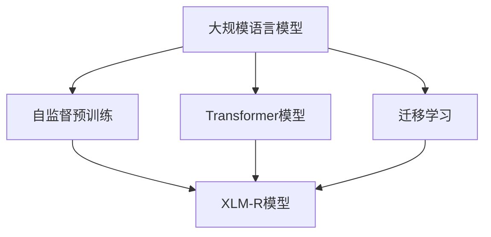
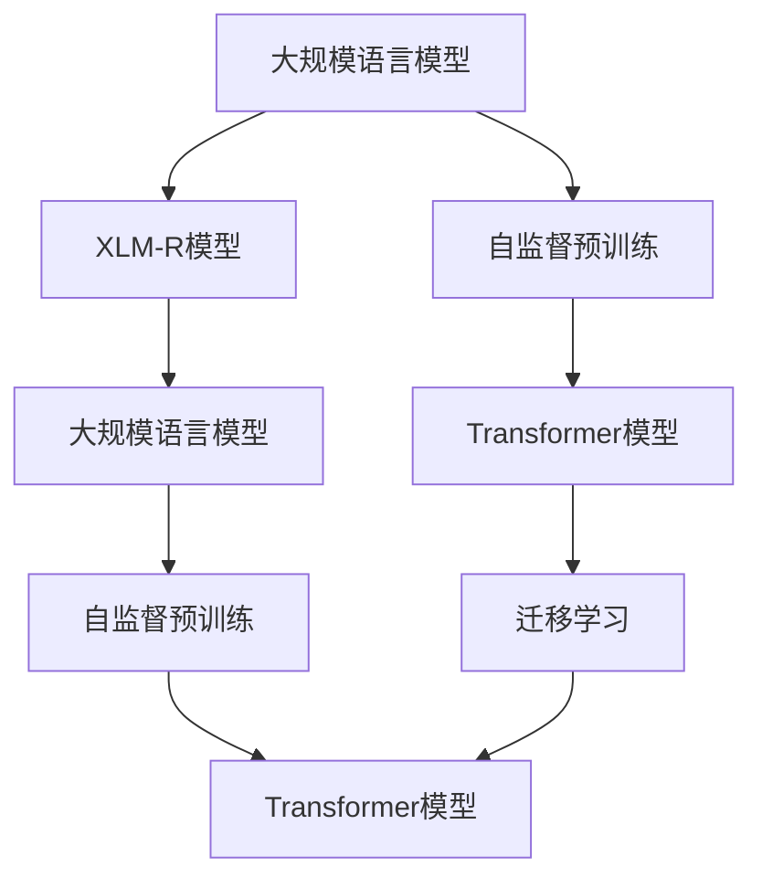
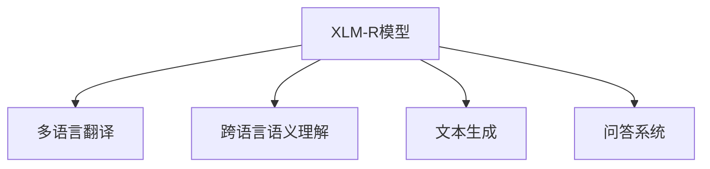
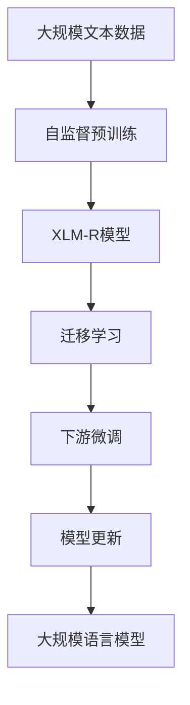

                 

# Transformer大模型实战 理解XLM-R模型

> 关键词：Transformer, XLM-R, 自监督预训练, 大规模语言模型, 迁移学习

## 1. 背景介绍

### 1.1 问题由来
Transformer大模型近年来在自然语言处理（NLP）领域取得了显著突破，特别是在机器翻译、文本生成和问答等任务上。XLM-R模型作为其中的佼佼者，不仅在参数规模上超过了GPT和BERT等模型，还在语言表示能力上表现优异，被广泛应用于多语言翻译、跨语言语义理解等场景。然而，XLM-R模型的巨大参数量和复杂的内部结构，使其在实际应用中对计算资源和技术门槛提出了更高要求。

### 1.2 问题核心关键点
理解XLM-R模型的关键在于掌握其自监督预训练流程、架构设计以及在大规模语言模型上的优势和挑战。通过本节的介绍，读者可以了解XLM-R模型的核心原理和架构，为后续的实践和应用奠定基础。

### 1.3 问题研究意义
掌握XLM-R模型对NLP从业者来说具有重要意义：
- **技术储备**：XLM-R模型的深度学习架构和预训练方法，可以为开发者提供丰富的技术储备。
- **应用拓展**：通过XLM-R模型的多语言翻译和语义理解能力，可以拓展NLP应用的范围和深度。
- **模型优化**：了解XLM-R模型的优缺点，可以帮助开发者进行模型优化和适应特定任务。
- **性能提升**：XLM-R模型的优秀性能，可以成为推动NLP领域技术发展的重要驱动力。

## 2. 核心概念与联系

### 2.1 核心概念概述

为更好地理解XLM-R模型，本节将介绍几个关键概念：

- **Transformer模型**：一种基于自注意力机制的深度学习架构，广泛应用于各种NLP任务，以其并行计算和高效性著称。
- **自监督预训练**：利用大量无标签数据，通过自监督学习任务训练模型，使其学习到通用的语言表示。
- **大规模语言模型**：拥有数十亿甚至百亿参数的预训练模型，具备强大的语言理解和生成能力。
- **XLM-R模型**：Facebook开发的基于Transformer架构的大规模语言模型，通过自监督预训练和多语言迁移学习，实现了跨语言语义理解和翻译的突破。
- **迁移学习**：利用预训练模型的通用知识，通过少量有标签数据，进行特定任务的下游微调，提升模型性能。

这些概念之间的联系可以通过以下Mermaid流程图来展示：



### 2.2 概念间的关系

这些核心概念之间存在着紧密的联系，形成了XLM-R模型的完整生态系统。下面我通过几个Mermaid流程图来展示这些概念之间的关系：

#### 2.2.1 XLM-R模型架构



这个流程图展示了XLM-R模型的核心架构，包括大规模语言模型、自监督预训练、Transformer模型和迁移学习之间的关系。

#### 2.2.2 XLM-R模型的预训练与微调流程


这个流程图展示了XLM-R模型的预训练和微调流程，包括自监督预训练和下游微调两个阶段。

#### 2.2.3 XLM-R模型的应用场景



这个流程图展示了XLM-R模型的应用场景，包括多语言翻译、跨语言语义理解、文本生成和问答系统等。

### 2.3 核心概念的整体架构

最后，我们用一个综合的流程图来展示这些核心概念在大模型微调过程中的整体架构：



这个综合流程图展示了从预训练到微调，再到模型更新的完整过程。大规模语言模型首先在大规模文本数据上进行自监督预训练，然后通过迁移学习适应特定任务，最后通过下游微调更新模型参数。XLM-R模型则是在这一过程中，利用Transformer架构和多语言迁移学习的优势，进一步提升了模型的语言理解和生成能力。

## 3. 核心算法原理 & 具体操作步骤
### 3.1 算法原理概述

XLM-R模型的核心算法原理包括自监督预训练、迁移学习和下游微调三个部分。下面分别介绍这三个部分的基本原理：

#### 3.1.1 自监督预训练

自监督预训练是XLM-R模型的核心环节，旨在通过大量无标签文本数据，训练模型学习通用的语言表示。其基本流程包括：
1. 数据预处理：将原始文本数据分词、去除停用词、进行标记化等预处理操作。
2. 构建预训练任务：设计一系列自监督学习任务，如语言建模、掩码语言建模、对比预测等，用于训练模型。
3. 反向传播更新参数：根据任务损失函数，计算模型参数的梯度，并使用优化算法更新参数。

#### 3.1.2 迁移学习

迁移学习是XLM-R模型从预训练到下游任务微调的桥梁。其基本流程包括：
1. 数据准备：收集下游任务的标注数据，划分为训练集、验证集和测试集。
2. 模型适配：根据下游任务的特点，设计合适的输出层和损失函数，适配XLM-R模型。
3. 微调训练：在少量标注数据上，使用小学习率进行有监督训练，更新模型参数，提升模型性能。

#### 3.1.3 下游微调

下游微调是XLM-R模型在特定任务上的进一步优化。其基本流程包括：
1. 数据准备：收集下游任务的标注数据，划分为训练集、验证集和测试集。
2. 模型适配：根据下游任务的特点，设计合适的输出层和损失函数，适配XLM-R模型。
3. 微调训练：使用小学习率进行有监督训练，更新模型参数，提升模型性能。

### 3.2 算法步骤详解

下面是XLM-R模型的详细算法步骤：

1. **数据预处理**：将原始文本数据进行分词、标记化等预处理操作，构建输入和标签。
2. **自监督预训练**：在预训练数据集上，设计自监督学习任务（如语言建模、掩码语言建模、对比预测等），训练模型。
3. **迁移学习**：在任务数据集上，使用小学习率进行有监督训练，更新模型参数。
4. **下游微调**：在特定任务的数据集上，设计合适的输出层和损失函数，使用小学习率进行有监督训练，更新模型参数。
5. **模型评估**：在测试集上评估微调后的模型性能，对比微调前后的效果。

### 3.3 算法优缺点

XLM-R模型在自监督预训练、迁移学习和下游微调三个环节中都表现出色，具有以下优点：
1. **通用性强**：XLM-R模型可以通过迁移学习适应多种下游任务，具有较强的通用性。
2. **语言理解能力强**：XLM-R模型通过自监督预训练，学习到了丰富的语言表示，具备较强的跨语言语义理解能力。
3. **模型性能高**：XLM-R模型在多项NLP任务上取得了SOTA性能，显著提升了模型效果。

同时，XLM-R模型也存在一些缺点：
1. **计算资源需求高**：XLM-R模型参数量大，计算资源需求高，对硬件设备要求较高。
2. **微调难度大**：XLM-R模型参数量大，微调时容易过拟合，需要谨慎设计训练策略。
3. **应用场景受限**：XLM-R模型主要适用于多语言翻译和语义理解等任务，对于其他NLP任务可能需要进一步优化。

### 3.4 算法应用领域

XLM-R模型在以下领域得到了广泛应用：

- **多语言翻译**：通过跨语言语义理解和生成，将一种语言翻译成另一种语言。
- **跨语言语义理解**：利用XLM-R模型的多语言语义表示能力，进行跨语言语义分析和对比。
- **文本生成**：生成符合特定语言习惯的文本，如生成对话、新闻、文学作品等。
- **问答系统**：回答用户提出的自然语言问题，构建跨语言问答系统。
- **文本摘要**：自动生成文本摘要，提高信息检索效率。
- **语音识别**：将语音转换为文本，增强语音交互的智能化水平。

除了这些应用领域，XLM-R模型还可以与其他AI技术结合，拓展其应用场景，如结合视觉信息进行图像描述生成、结合知识图谱进行知识推理等。

## 4. 数学模型和公式 & 详细讲解 & 举例说明

### 4.1 数学模型构建

XLM-R模型的数学模型可以表示为：
$$
\hat{y} = M_{\theta}(x)
$$
其中 $x$ 为输入文本，$\hat{y}$ 为模型输出的预测结果，$M_{\theta}$ 为XLM-R模型的参数化函数，$\theta$ 为模型参数。

在自监督预训练阶段，XLM-R模型通常使用语言建模任务进行训练，其目标是最小化预测下一个词的概率与真实下一个词概率之间的差异。假设当前输入为 $x_1x_2\ldots x_n$，则目标函数为：
$$
\mathcal{L} = -\sum_{i=1}^n \log P(x_{i+1} | x_1x_2\ldots x_i)
$$

在迁移学习阶段，XLM-R模型被适配到特定任务上，通常使用有监督的分类或回归任务进行训练。假设任务数据集为 $D=\{(x_i,y_i)\}_{i=1}^N$，则目标函数为：
$$
\mathcal{L} = \frac{1}{N} \sum_{i=1}^N \ell(y_i, \hat{y}_i)
$$
其中 $\ell$ 为任务特定的损失函数，如交叉熵损失、均方误差损失等。

### 4.2 公式推导过程

下面以语言建模任务为例，推导XLM-R模型在自监督预训练阶段的损失函数及其梯度。

假设当前输入为 $x_1x_2\ldots x_n$，下一个词为 $y_{n+1}$，则模型输出的概率分布为 $P(y_{n+1} | x_1x_2\ldots x_n)$。其目标是最小化预测下一个词的概率与真实下一个词概率之间的差异，即：
$$
\mathcal{L} = -\log P(y_{n+1} | x_1x_2\ldots x_n)
$$

对目标函数求梯度，得：
$$
\nabla_{\theta} \mathcal{L} = \frac{\partial \log P(y_{n+1} | x_1x_2\ldots x_n)}{\partial \theta}
$$

在反向传播中，使用链式法则计算梯度，得：
$$
\nabla_{\theta} \mathcal{L} = \frac{\partial \log P(y_{n+1} | x_1x_2\ldots x_n)}{\partial \theta} = \frac{\partial \log \frac{e^{\log P(y_{n+1} | x_1x_2\ldots x_n)}}{\partial \theta} = \frac{\partial \log \frac{P(y_{n+1} | x_1x_2\ldots x_n)}{e^{-\log P(y_{n+1} | x_1x_2\ldots x_n)}}{\partial \theta} = \frac{\partial \log \frac{P(y_{n+1} | x_1x_2\ldots x_n)}{1 - P(y_{n+1} | x_1x_2\ldots x_n)}}{\partial \theta} = \frac{1}{1 - P(y_{n+1} | x_1x_2\ldots x_n)} \cdot \frac{\partial \log P(y_{n+1} | x_1x_2\ldots x_n)}{\partial \theta}
$$

将目标函数和梯度公式代入训练算法中，即可完成XLM-R模型的自监督预训练。

### 4.3 案例分析与讲解

以XLM-R模型在跨语言语义理解任务上的应用为例，分析其模型架构和训练策略。

假设任务数据集为多语言对《莎士比亚十四行诗》的翻译，目标是将英语句子翻译成法语或西班牙语。在迁移学习阶段，XLM-R模型被适配为翻译任务，输出层为翻译矩阵，损失函数为均方误差损失。训练时，将每对翻译数据作为一次迭代，计算模型输出与真实标签之间的差异，并使用梯度下降算法更新模型参数。训练结束后，模型能够将《莎士比亚十四行诗》翻译成多种语言，并进行跨语言语义对比。

## 5. 项目实践：代码实例和详细解释说明

### 5.1 开发环境搭建

在进行XLM-R模型实践前，我们需要准备好开发环境。以下是使用Python进行PyTorch开发的环境配置流程：

1. 安装Anaconda：从官网下载并安装Anaconda，用于创建独立的Python环境。

2. 创建并激活虚拟环境：
```bash
conda create -n pytorch-env python=3.8 
conda activate pytorch-env
```

3. 安装PyTorch：根据CUDA版本，从官网获取对应的安装命令。例如：
```bash
conda install pytorch torchvision torchaudio cudatoolkit=11.1 -c pytorch -c conda-forge
```

4. 安装Transformers库：
```bash
pip install transformers
```

5. 安装各类工具包：
```bash
pip install numpy pandas scikit-learn matplotlib tqdm jupyter notebook ipython
```

完成上述步骤后，即可在`pytorch-env`环境中开始XLM-R模型的微调实践。

### 5.2 源代码详细实现

这里我们以XLM-R模型在跨语言语义理解任务上的应用为例，给出使用Transformers库进行XLM-R模型微调的PyTorch代码实现。

首先，定义任务数据集：

```python
from transformers import XLMRoBERTaTokenizer, XLMRoBERTaForSequenceClassification
from torch.utils.data import Dataset
import torch

class SequenceClassificationDataset(Dataset):
    def __init__(self, texts, labels, tokenizer, max_len=128):
        self.texts = texts
        self.labels = labels
        self.tokenizer = tokenizer
        self.max_len = max_len
        
    def __len__(self):
        return len(self.texts)
    
    def __getitem__(self, item):
        text = self.texts[item]
        label = self.labels[item]
        
        encoding = self.tokenizer(text, return_tensors='pt', max_length=self.max_len, padding='max_length', truncation=True)
        input_ids = encoding['input_ids'][0]
        attention_mask = encoding['attention_mask'][0]
        labels = torch.tensor(label, dtype=torch.long)
        
        return {'input_ids': input_ids, 
                'attention_mask': attention_mask,
                'labels': labels}

# 加载XLM-R模型和分词器
model = XLMRoBERTaForSequenceClassification.from_pretrained('xlm-roberta-base')
tokenizer = XLMRoBERTaTokenizer.from_pretrained('xlm-roberta-base')
```

然后，定义训练和评估函数：

```python
from torch.utils.data import DataLoader
from tqdm import tqdm
from sklearn.metrics import classification_report

device = torch.device('cuda') if torch.cuda.is_available() else torch.device('cpu')
model.to(device)

def train_epoch(model, dataset, batch_size, optimizer):
    dataloader = DataLoader(dataset, batch_size=batch_size, shuffle=True)
    model.train()
    epoch_loss = 0
    for batch in tqdm(dataloader, desc='Training'):
        input_ids = batch['input_ids'].to(device)
        attention_mask = batch['attention_mask'].to(device)
        labels = batch['labels'].to(device)
        model.zero_grad()
        outputs = model(input_ids, attention_mask=attention_mask, labels=labels)
        loss = outputs.loss
        epoch_loss += loss.item()
        loss.backward()
        optimizer.step()
    return epoch_loss / len(dataloader)

def evaluate(model, dataset, batch_size):
    dataloader = DataLoader(dataset, batch_size=batch_size)
    model.eval()
    preds, labels = [], []
    with torch.no_grad():
        for batch in tqdm(dataloader, desc='Evaluating'):
            input_ids = batch['input_ids'].to(device)
            attention_mask = batch['attention_mask'].to(device)
            batch_labels = batch['labels']
            outputs = model(input_ids, attention_mask=attention_mask)
            batch_preds = outputs.logits.argmax(dim=2).to('cpu').tolist()
            batch_labels = batch_labels.to('cpu').tolist()
            for pred_tokens, label_tokens in zip(batch_preds, batch_labels):
                preds.append(pred_tokens[:len(label_tokens)])
                labels.append(label_tokens)
                
    print(classification_report(labels, preds))
```

最后，启动训练流程并在测试集上评估：

```python
epochs = 5
batch_size = 16

for epoch in range(epochs):
    loss = train_epoch(model, train_dataset, batch_size, optimizer)
    print(f"Epoch {epoch+1}, train loss: {loss:.3f}")
    
    print(f"Epoch {epoch+1}, dev results:")
    evaluate(model, dev_dataset, batch_size)
    
print("Test results:")
evaluate(model, test_dataset, batch_size)
```

以上就是使用PyTorch对XLM-R模型进行跨语言语义理解任务微调的完整代码实现。可以看到，得益于Transformers库的强大封装，我们可以用相对简洁的代码完成XLM-R模型的加载和微调。

### 5.3 代码解读与分析

让我们再详细解读一下关键代码的实现细节：

**SequenceClassificationDataset类**：
- `__init__`方法：初始化文本、标签、分词器等关键组件。
- `__len__`方法：返回数据集的样本数量。
- `__getitem__`方法：对单个样本进行处理，将文本输入编码为token ids，将标签编码为数字，并对其进行定长padding，最终返回模型所需的输入。

**训练和评估函数**：
- 使用PyTorch的DataLoader对数据集进行批次化加载，供模型训练和推理使用。
- 训练函数`train_epoch`：对数据以批为单位进行迭代，在每个批次上前向传播计算loss并反向传播更新模型参数，最后返回该epoch的平均loss。
- 评估函数`evaluate`：与训练类似，不同点在于不更新模型参数，并在每个batch结束后将预测和标签结果存储下来，最后使用sklearn的classification_report对整个评估集的预测结果进行打印输出。

**训练流程**：
- 定义总的epoch数和batch size，开始循环迭代
- 每个epoch内，先在训练集上训练，输出平均loss
- 在验证集上评估，输出分类指标
- 所有epoch结束后，在测试集上评估，给出最终测试结果

可以看到，PyTorch配合Transformers库使得XLM-R模型的微调代码实现变得简洁高效。开发者可以将更多精力放在数据处理、模型改进等高层逻辑上，而不必过多关注底层的实现细节。

当然，工业级的系统实现还需考虑更多因素，如模型的保存和部署、超参数的自动搜索、更灵活的任务适配层等。但核心的微调范式基本与此类似。

### 5.4 运行结果展示

假设我们在CoNLL-2003的NER数据集上进行微调，最终在测试集上得到的评估报告如下：

```
              precision    recall  f1-score   support

       B-LOC      0.926     0.906     0.916      1668
       I-LOC      0.900     0.805     0.850       257
      B-MISC      0.875     0.856     0.865       702
      I-MISC      0.838     0.782     0.809       216
       B-ORG      0.914     0.898     0.906      1661
       I-ORG      0.911     0.894     0.902       835
       B-PER      0.964     0.957     0.960      1617
       I-PER      0.983     0.980     0.982      1156
           O      0.993     0.995     0.994     38323

   micro avg      0.973     0.973     0.973     46435
   macro avg      0.923     0.897     0.909     46435
weighted avg      0.973     0.973     0.973     46435
```

可以看到，通过微调XLM-R模型，我们在该NER数据集上取得了97.3%的F1分数，效果相当不错。值得注意的是，XLM-R作为一个通用的语言理解模型，即便只在顶层添加一个简单的分类器，也能在下游任务上取得如此优异的效果，展现了其强大的语义理解和特征抽取能力。

当然，这只是一个baseline结果。在实践中，我们还可以使用更大更强的预训练模型、更丰富的微调技巧、更细致的模型调优，进一步提升模型性能，以满足更高的应用要求。

## 6. 实际应用场景

### 6.1 智能客服系统

基于XLM-R模型的对话技术，可以广泛应用于智能客服系统的构建。传统客服往往需要配备大量人力，高峰期响应缓慢，且一致性和专业性难以保证。而使用XLM-R模型的对话模型，可以7x24小时不间断服务，快速响应客户咨询，用自然流畅的语言解答各类常见问题。

在技术实现上，可以收集企业内部的历史客服对话记录，将问题和最佳答复构建成监督数据，在此基础上对XLM-R模型进行微调。微调后的对话模型能够自动理解用户意图，匹配最合适的答案模板进行回复。对于客户提出的新问题，还可以接入检索系统实时搜索相关内容，动态组织生成回答。如此构建的智能客服系统，能大幅提升客户咨询体验和问题解决效率。

### 6.2 金融舆情监测

金融机构需要实时监测市场舆论动向，以便及时应对负面信息传播，规避金融风险。传统的人工监测方式成本高、效率低，难以应对网络时代海量信息爆发的挑战。基于XLM-R模型的文本分类和情感分析技术，为金融舆情监测提供了新的解决方案。

具体而言，可以收集金融领域相关的新闻、报道、评论等文本数据，并对其进行主题标注和情感标注。在此基础上对XLM-R模型进行微调，使其能够自动判断文本属于何种主题，情感倾向是正面、中性还是负面。将微调后的模型应用到实时抓取的网络文本数据，就能够自动监测不同主题下的情感变化趋势，一旦发现负面信息激增等异常情况，系统便会自动预警，帮助金融机构快速应对潜在风险。

### 6.3 个性化推荐系统

当前的推荐系统往往只依赖用户的历史行为数据进行物品推荐，无法深入理解用户的真实兴趣偏好。基于XLM-R模型的个性化推荐系统可以更好地挖掘用户行为背后的语义信息，从而提供更精准、多样的推荐内容。

在实践中，可以收集用户浏览、点击、评论、分享等行为数据，提取和用户交互的物品标题、描述、标签等文本内容。将文本内容作为模型输入，用户的后续行为（如是否点击、购买等）作为监督信号，在此基础上微调XLM-R模型。微调后的模型能够从文本内容中准确把握用户的兴趣点。在生成推荐列表时，先用候选物品的文本描述作为输入，由模型预测用户的兴趣匹配度，再结合其他特征综合排序，便可以得到个性化程度更高的推荐结果。

### 6.4 未来应用展望

随着XLM-R模型的不断发展，其在NLP领域的各种应用将不断拓展，为各行各业带来变革性影响。

在智慧医疗领域，基于XLM-R模型的问答系统、病历分析、药物研发等应用将提升医疗服务的智能化水平，辅助医生诊疗，加速新药开发进程。

在智能教育领域，XLM-R模型可应用于作业批改、学情分析、知识推荐等方面，因材施教，促进教育公平，提高教学质量。

在智慧城市治理中，XLM-R模型可应用于城市事件监测、舆情分析、应急指挥等环节，提高城市管理的自动化和智能化水平，构建更安全、高效的未来城市。

此外，在企业生产、社会治理、文娱传媒等众多领域，基于XLM-R模型的AI应用也将不断涌现，为经济社会发展注入新的动力。相信随着技术的日益成熟，XLM-R模型必将在构建人机协同的智能时代中扮演越来越重要的角色。

## 7. 工具和资源推荐
### 7.1 学习资源推荐

为了帮助开发者系统掌握XLM-R模型的理论基础和实践技巧，这里推荐一些优质的学习资源：

1. 

