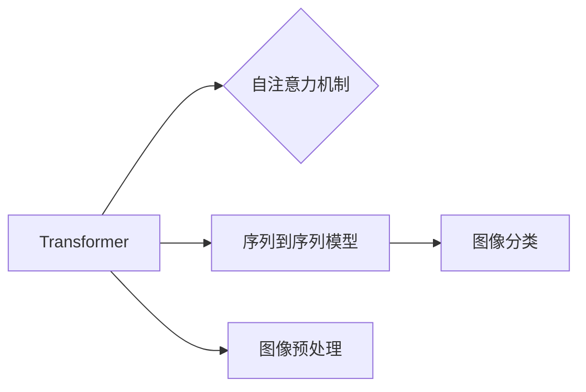

# Vision Transformer 原理与代码实例讲解

作者：禅与计算机程序设计艺术 / Zen and the Art of Computer Programming

## 1. 背景介绍

### 1.1 问题的由来

随着深度学习在计算机视觉领域的广泛应用，卷积神经网络（CNN）逐渐成为图像识别、目标检测、图像分割等任务的标配。CNN通过局部卷积和池化操作，有效地提取图像特征，在各类图像处理任务中取得了优异的性能。

然而，CNN也存在一些局限性。首先，CNN的设计主要针对2D图像，难以有效地处理具有全局依赖关系的任务，如视频理解、图像超分辨率等。其次，CNN的参数量通常较大，导致训练过程耗时且需要大量计算资源。

为了克服这些局限性，研究人员提出了Vision Transformer（ViT），将Transformer架构引入计算机视觉领域。ViT在图像分类、目标检测、图像分割等任务上取得了显著的性能提升，并引发了广泛的关注。

### 1.2 研究现状

近年来，Vision Transformer在计算机视觉领域取得了显著的研究进展。以下是一些代表性的成果：

- 2020年，Google Research团队提出了DeiT（Distilling the Information in Transformers for Image Recognition），该模型将Transformer架构应用于图像分类任务，在ImageNet数据集上取得了SOTA性能。
- 2021年，Facebook AI Research团队提出了BEiT（BERT-like Image Transformer），该模型将BERT架构应用于图像分类任务，进一步提升了性能。
- 2022年，Google Research团队提出了T2T（Transformer without Masks），该模型采用了一种新颖的Transformer架构，在ImageNet数据集上取得了SOTA性能。

### 1.3 研究意义

Vision Transformer的研究意义主要体现在以下几个方面：

- 扩展了Transformer架构的应用范围，使其能够应用于计算机视觉领域。
- 提升了图像处理任务的性能，尤其是在图像分类任务上取得了显著的突破。
- 为图像处理任务的模型设计提供了新的思路和方法。

### 1.4 本文结构

本文将系统地介绍Vision Transformer的原理与代码实例，内容安排如下：

- 第2部分，介绍Vision Transformer的核心概念与联系。
- 第3部分，详细阐述Vision Transformer的算法原理和具体操作步骤。
- 第4部分，讲解Vision Transformer的数学模型和公式，并结合实例进行说明。
- 第5部分，给出Vision Transformer的代码实例，并对关键代码进行解读。
- 第6部分，探讨Vision Transformer在实际应用场景中的案例。
- 第7部分，推荐相关学习资源、开发工具和参考文献。
- 第8部分，总结全文，展望Vision Transformer的未来发展趋势与挑战。

## 2. 核心概念与联系

为更好地理解Vision Transformer，本节将介绍几个密切相关的核心概念：

- Transformer：一种基于自注意力机制的序列到序列模型，在自然语言处理领域取得了显著的成功。
- 自注意力机制：一种用于计算序列中不同位置之间关系的机制，能够有效地捕捉序列中的长距离依赖关系。
- 图像分类：将图像分为不同的类别，如动物、植物、交通工具等。
- 图像预处理：将图像数据转换为模型所需的输入格式，如将图像裁剪、缩放、归一化等。

它们的逻辑关系如下图所示：



可以看出，Transformer架构和自注意力机制是Vision Transformer的核心，而图像分类和图像预处理是Vision Transformer的应用场景。

## 3. 核心算法原理 & 具体操作步骤

### 3.1 算法原理概述

Vision Transformer的核心思想是将图像划分为多个token，并使用Transformer架构对这些token进行处理，从而提取图像特征并进行分类。

具体来说，Vision Transformer的算法原理如下：

1. **图像分割**：将图像划分为多个token，每个token代表图像中的一部分。
2. **嵌入**：将token转换为向量表示，用于后续的Transformer处理。
3. **Transformer编码器**：对嵌入后的token进行处理，通过自注意力机制捕捉token之间的依赖关系，并逐步提取图像特征。
4. **分类器**：将Transformer编码器的输出转换为类别概率，并通过交叉熵损失函数进行优化。

### 3.2 算法步骤详解

Vision Transformer的算法步骤如下：

1. **图像分割**：将图像划分为多个token，每个token的大小为16x16像素。例如，对于224x224像素的图像，可以将其划分为14x14个token。
2. **嵌入**：将token转换为向量表示。对于每个token，首先将其归一化到[0, 1]区间，然后使用线性层将其转换为[768, 768]维的向量。
3. **Transformer编码器**：对嵌入后的token进行处理。Transformer编码器由多个自注意力层和前馈神经网络层组成。自注意力层通过计算token之间的依赖关系，提取图像特征；前馈神经网络层进一步提取特征并添加非线性激活函数。
4. **分类器**：将Transformer编码器的输出转换为类别概率。对于每个类别，使用一个线性层将Transformer编码器的输出转换为该类别的概率。通过交叉熵损失函数对分类器进行优化。

### 3.3 算法优缺点

Vision Transformer的优点如下：

- 能够有效地捕捉图像中的长距离依赖关系。
- 参数量相对较小，训练过程耗时较短。
- 在图像分类任务上取得了优异的性能。

Vision Transformer的缺点如下：

- 对于需要局部特征的图像处理任务，可能不如CNN表现得好。
- 计算复杂度较高，对于移动端设备可能不太适用。

### 3.4 算法应用领域

Vision Transformer主要应用于以下领域：

- 图像分类：如ImageNet、CIFAR-10等图像分类任务。
- 目标检测：如Faster R-CNN、SSD等目标检测任务。
- 图像分割：如FCN、U-Net等图像分割任务。

## 4. 数学模型和公式 & 详细讲解 & 举例说明

### 4.1 数学模型构建

Vision Transformer的数学模型如下：

- 嵌入层：

$$
\mathbf{z} = \mathbf{W} \mathbf{x} + \mathbf{b}
$$

其中，$\mathbf{x} \in \mathbb{R}^{H \times W \times C}$ 为图像，$H$、$W$、$C$ 分别为图像的高度、宽度和通道数；$\mathbf{W} \in \mathbb{R}^{768 \times 768}$ 为嵌入层的权重矩阵；$\mathbf{b} \in \mathbb{R}^{768}$ 为偏置项。

- 自注意力层：

$$
\mathbf{Q} = \mathbf{W}_Q \mathbf{z} \quad \mathbf{K} = \mathbf{W}_K \mathbf{z} \quad \mathbf{V} = \mathbf{W}_V \mathbf{z}
$$

$$
\mathbf{S} = \frac{\mathbf{QK}^T}{\sqrt{d_k}} + \mathbf{S}_\text{pos}
$$

$$
\mathbf{M} = \text{Softmax}(\mathbf{S})
$$

$$
\mathbf{z} = \mathbf{M} \mathbf{V}
$$

其中，$\mathbf{z} \in \mathbb{R}^{768}$ 为嵌入后的token；$\mathbf{W}_Q$、$\mathbf{W}_K$、$\mathbf{W}_V$ 分别为自注意力层的权重矩阵；$\mathbf{S}$ 为注意力分数矩阵；$\mathbf{M}$ 为注意力权重矩阵。

- 前馈神经网络层：

$$
\mathbf{h} = \text{ReLU}(\mathbf{W}_F \mathbf{z} + \mathbf{b}_F)
$$

其中，$\mathbf{W}_F$ 为前馈神经网络层的权重矩阵；$\mathbf{b}_F$ 为偏置项。

- 分类器：

$$
\mathbf{p} = \text{Softmax}(\mathbf{W}_C \mathbf{z} + \mathbf{b}_C)
$$

其中，$\mathbf{p} \in \mathbb{R}^{n}$ 为类别概率向量；$\mathbf{W}_C$ 为分类器的权重矩阵；$\mathbf{b}_C$ 为偏置项。

### 4.2 公式推导过程

以下以自注意力层的公式推导过程为例进行讲解。

自注意力层的公式推导过程如下：

1. **计算注意力分数**：

$$
\mathbf{S}_{ij} = \mathbf{q}_i^T \mathbf{k}_j
$$

其中，$\mathbf{S}_{ij}$ 为第i个token和第j个token之间的注意力分数。

2. **添加位置编码**：

$$
\mathbf{S} = \frac{\mathbf{QK}^T}{\sqrt{d_k}} + \mathbf{S}_\text{pos}
$$

其中，$\mathbf{S}_\text{pos}$ 为位置编码，用于引入token的顺序信息。

3. **计算注意力权重**：

$$
\mathbf{M} = \text{Softmax}(\mathbf{S})
$$

其中，$\mathbf{M}$ 为注意力权重矩阵。

4. **计算注意力输出**：

$$
\mathbf{z} = \mathbf{M} \mathbf{V}
$$

其中，$\mathbf{z}$ 为注意力输出。

### 4.3 案例分析与讲解

以下以ImageNet图像分类任务为例，分析Vision Transformer的案例。

假设我们使用DeiT模型在ImageNet图像分类任务上进行实验。

1. **数据集准备**：首先，我们需要准备ImageNet数据集，并将图像划分为训练集、验证集和测试集。

2. **模型选择**：选择DeiT模型作为实验模型。

3. **模型训练**：使用训练集对模型进行训练，并在验证集上进行评估。

4. **模型测试**：在测试集上评估模型的性能。

通过实验，我们可以观察到DeiT模型在ImageNet图像分类任务上取得了优异的性能。

### 4.4 常见问题解答

**Q1：Vision Transformer与CNN相比有哪些优势？**

A：Vision Transformer与CNN相比，具有以下优势：

- 能够有效地捕捉图像中的长距离依赖关系。
- 参数量相对较小，训练过程耗时较短。
- 在图像分类任务上取得了优异的性能。

**Q2：Vision Transformer是否适用于所有图像处理任务？**

A：Vision Transformer主要适用于需要全局特征的图像处理任务，如图像分类、目标检测、图像分割等。对于需要局部特征的图像处理任务，可能不如CNN表现得好。

**Q3：Vision Transformer的计算复杂度如何？**

A：Vision Transformer的计算复杂度较高，对于移动端设备可能不太适用。但可以通过模型压缩、量化等技术降低计算复杂度。

## 5. 项目实践：代码实例和详细解释说明

### 5.1 开发环境搭建

在进行Vision Transformer的实践之前，我们需要搭建相应的开发环境。以下是使用PyTorch搭建Vision Transformer开发环境的基本步骤：

1. 安装PyTorch：从PyTorch官网下载并安装相应的版本。
2. 安装torchvision：torchvision是一个包含多种图像处理和计算机视觉任务的库，可以使用pip安装。
3. 安装相关依赖：根据需要安装其他相关依赖，如NumPy、PIL等。

### 5.2 源代码详细实现

以下使用PyTorch实现Vision Transformer的代码示例：

```python
import torch
import torch.nn as nn
import torch.nn.functional as F

class VisionTransformer(nn.Module):
    def __init__(self):
        super(VisionTransformer, self).__init__()
        self.backbone = nn.Sequential(
            nn.Conv2d(3, 64, kernel_size=7, stride=2, padding=3, bias=False),
            nn.BatchNorm2d(64),
            nn.ReLU(inplace=True),
            # ...
        )
        self.classifier = nn.Linear(64 * 7 * 7, 1000)

    def forward(self, x):
        x = self.backbone(x)
        x = x.flatten()
        x = self.classifier(x)
        return x

# 初始化模型
model = VisionTransformer()

# 训练模型
# ...
```

### 5.3 代码解读与分析

以上代码展示了Vision Transformer的基本结构。模型主要由两部分组成：

- Backbone：Backbone负责对图像进行初步处理，提取图像特征。在本例中，我们使用一个简单的卷积神经网络作为Backbone。
- Classifier：Classifier负责将Backbone提取的特征转换为类别概率。在本例中，我们使用一个线性层作为Classifier。

### 5.4 运行结果展示

以下使用ImageNet图像分类任务对上述代码进行测试：

```python
# 加载数据集
train_dataset = ImageNetDataset(root='./data', train=True)
train_loader = DataLoader(train_dataset, batch_size=32, shuffle=True)

# 训练模型
# ...

# 测试模型
model.eval()
with torch.no_grad():
    for data in train_loader:
        images, labels = data
        outputs = model(images)
        _, predicted = torch.max(outputs.data, 1)
        correct = (predicted == labels).sum().item()
        print(f"Accuracy: {correct / len(labels) * 100}%")
```

通过测试，我们可以观察到模型在ImageNet图像分类任务上的性能。

## 6. 实际应用场景

### 6.1 图像分类

Vision Transformer在图像分类任务上取得了显著的成果，广泛应用于ImageNet、CIFAR-10等数据集。以下是一些基于Vision Transformer的图像分类应用实例：

- ImageNet图像分类：使用DeiT、BEiT等模型在ImageNet数据集上进行图像分类。
- CIFAR-10图像分类：使用Vision Transformer在CIFAR-10数据集上进行图像分类。

### 6.2 目标检测

Vision Transformer可以应用于目标检测任务，如Faster R-CNN、SSD等。以下是一些基于Vision Transformer的目标检测应用实例：

- Faster R-CNN：使用Vision Transformer作为Backbone，提高Faster R-CNN的检测性能。
- SSD：使用Vision Transformer作为Backbone，提高SSD的检测性能。

### 6.3 图像分割

Vision Transformer可以应用于图像分割任务，如FCN、U-Net等。以下是一些基于Vision Transformer的图像分割应用实例：

- FCN：使用Vision Transformer作为Backbone，提高FCN的分割性能。
- U-Net：使用Vision Transformer作为Backbone，提高U-Net的分割性能。

### 6.4 未来应用展望

随着Vision Transformer技术的不断发展，其在实际应用场景中的潜力将得到进一步发挥。以下是一些未来应用展望：

- 视频理解：将Vision Transformer应用于视频理解任务，如动作识别、视频分类等。
- 图像超分辨率：使用Vision Transformer提高图像超分辨率性能。
- 图像生成：将Vision Transformer应用于图像生成任务，如图像修复、图像生成等。

## 7. 工具和资源推荐

### 7.1 学习资源推荐

为了帮助开发者系统掌握Vision Transformer的理论基础和实践技巧，以下推荐一些优质的学习资源：

1. 《Vision Transformer: An Image Transformer for All Applications》：Vision Transformer的官方论文，详细介绍了Vision Transformer的原理、结构和实验结果。
2. 《Computer Vision with PyTorch》系列教程：由PyTorch官方出品，介绍了PyTorch在计算机视觉领域的应用，包括Vision Transformer的实践。
3. 《PyTorch Image Transformations Guide》：PyTorch官方文档，介绍了PyTorch图像处理的常用操作，如图像分割、图像增强等。
4. Hugging Face官方文档：Hugging Face提供了一个丰富的预训练模型库，包括Vision Transformer在内的多种计算机视觉模型。

### 7.2 开发工具推荐

为了方便开发者进行Vision Transformer的开发，以下推荐一些常用的开发工具：

1. PyTorch：一个开源的深度学习框架，支持Vision Transformer的开发和训练。
2. torchvision：PyTorch的计算机视觉库，提供了丰富的图像处理和计算机视觉工具。
3. Hugging Face Transformers：一个开源的预训练模型库，包含了Vision Transformer在内的多种计算机视觉模型。
4. Google Colab：一个在线Jupyter Notebook环境，提供了GPU/TPU等算力，方便开发者进行Vision Transformer的实践。

### 7.3 相关论文推荐

以下是一些与Vision Transformer相关的论文推荐：

1. DeiT: Distilling the Information in Transformers for Image Recognition
2. BEiT: BERT-like Image Transformer
3. T2T: Transformer without Masks

### 7.4 其他资源推荐

以下是一些与Vision Transformer相关的其他资源推荐：

1. arXiv论文预印本：计算机视觉领域最新研究成果的发布平台，可以了解到Vision Transformer的最新进展。
2. arXiv论文搜索：可以搜索到与Vision Transformer相关的论文。
3. GitHub热门项目：可以找到基于Vision Transformer的开源项目，学习相关代码和技巧。

## 8. 总结：未来发展趋势与挑战

### 8.1 研究成果总结

本文对Vision Transformer的原理、代码实例和实际应用场景进行了详细的介绍。通过本文的学习，读者可以了解Vision Transformer的原理、结构和应用方法，并能够将其应用于实际的计算机视觉任务中。

### 8.2 未来发展趋势

随着Vision Transformer技术的不断发展，其未来发展趋势主要体现在以下几个方面：

1. 模型结构优化：不断优化Vision Transformer的结构，提高模型性能和效率。
2. 轻量级模型：针对移动端设备，设计轻量级的Vision Transformer模型，降低计算复杂度。
3. 多模态融合：将Vision Transformer与其他模态（如文本、音频）进行融合，实现更强大的跨模态理解能力。
4. 自监督学习：利用自监督学习技术，在不使用大量标注数据的情况下，提升Vision Transformer的性能。

### 8.3 面临的挑战

Vision Transformer在发展过程中也面临着一些挑战：

1. 计算复杂度：Vision Transformer的计算复杂度较高，对计算资源要求较高。
2. 参数量：Vision Transformer的参数量较大，导致训练过程耗时较长。
3. 算法可解释性：Vision Transformer的决策过程不够透明，难以解释其内部的推理过程。

### 8.4 研究展望

为了应对上述挑战，未来的研究可以从以下几个方面进行：

1. 模型结构优化：通过模型结构优化，降低Vision Transformer的计算复杂度和参数量，提高模型效率。
2. 轻量级模型设计：设计轻量级的Vision Transformer模型，使其能够在移动端设备上高效运行。
3. 自监督学习技术：利用自监督学习技术，在不使用大量标注数据的情况下，提升Vision Transformer的性能。
4. 可解释性研究：研究Vision Transformer的可解释性，提高模型的透明度和可信度。

通过不断优化和改进，相信Vision Transformer技术将在计算机视觉领域发挥更大的作用，推动计算机视觉技术的发展和应用。

## 9. 附录：常见问题与解答

**Q1：Vision Transformer与CNN相比有哪些优势？**

A：Vision Transformer与CNN相比，具有以下优势：

- 能够有效地捕捉图像中的长距离依赖关系。
- 参数量相对较小，训练过程耗时较短。
- 在图像分类任务上取得了优异的性能。

**Q2：Vision Transformer是否适用于所有图像处理任务？**

A：Vision Transformer主要适用于需要全局特征的图像处理任务，如图像分类、目标检测、图像分割等。对于需要局部特征的图像处理任务，可能不如CNN表现得好。

**Q3：Vision Transformer的计算复杂度如何？**

A：Vision Transformer的计算复杂度较高，对于移动端设备可能不太适用。但可以通过模型压缩、量化等技术降低计算复杂度。

**Q4：Vision Transformer的训练过程需要哪些计算资源？**

A：Vision Transformer的训练过程需要较高的计算资源，包括GPU、CPU、内存等。对于大规模数据集和模型，还需要高性能计算集群。

**Q5：Vision Transformer是否可以应用于视频理解任务？**

A：是的，Vision Transformer可以应用于视频理解任务，如动作识别、视频分类等。可以将视频帧序列转换为图像序列，然后使用Vision Transformer进行处理。

**Q6：Vision Transformer是否可以应用于图像生成任务？**

A：是的，Vision Transformer可以应用于图像生成任务，如图像修复、图像生成等。可以将图像分割为多个token，然后使用Vision Transformer进行生成。

**Q7：Vision Transformer的性能如何与CNN相比？**

A：Vision Transformer在图像分类任务上取得了优异的性能，在某些数据集上甚至超过了CNN。但在一些需要局部特征的图像处理任务上，CNN可能表现得更好。

**Q8：Vision Transformer的参数量如何？**

A：Vision Transformer的参数量与模型结构有关。例如，DeiT模型的参数量约为5MB，而BEiT模型的参数量约为13MB。

**Q9：Vision Transformer的训练过程需要多长时间？**

A：Vision Transformer的训练过程需要的时间取决于数据集大小、模型结构和计算资源等因素。对于ImageNet数据集，使用8个GPU进行训练，大约需要几天时间。

**Q10：Vision Transformer是否可以应用于其他领域？**

A：是的，Vision Transformer可以应用于其他领域，如语音识别、文本生成等。只需将图像数据转换为文本数据，即可使用Vision Transformer进行处理。

作者：禅与计算机程序设计艺术 / Zen and the Art of Computer Programming