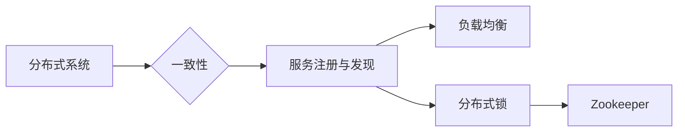

# Zookeeper与分布式计算框架的实现与应用

## 1. 背景介绍
### 1.1 问题的由来

随着互联网和云计算技术的飞速发展，分布式系统已经成为现代软件开发中不可或缺的一部分。分布式系统具有高可用、高并发、可伸缩等特性，能够满足大规模应用的需求。然而，分布式系统的开发也面临着诸多挑战，例如：

- **系统一致性**：如何保证分布式系统中各个节点之间的数据一致性？
- **服务注册与发现**：如何实现服务的动态注册与发现，以便客户端能够找到对应的服务实例？
- **负载均衡**：如何实现负载均衡，以提高系统性能？
- **分布式锁**：如何实现分布式锁，以保证多个节点之间的操作顺序一致？

为了解决上述问题，研究人员和开发者们提出了许多分布式计算框架，如Hadoop、Spark、Kafka等。Zookeeper作为分布式协调服务，在这些框架中扮演着重要的角色。本文将深入探讨Zookeeper的工作原理、实现方法以及与分布式计算框架的集成与应用。

### 1.2 研究现状

近年来，分布式计算框架和Zookeeper技术都取得了长足的进步。以下是一些重要的研究现状：

- **分布式计算框架**：Hadoop、Spark、Flink等框架在数据处理、计算任务调度等方面取得了显著的成果。
- **Zookeeper**：Apache Zookeeper作为一个高性能的分布式协调服务，已经成为许多分布式系统的核心技术。
- **服务注册与发现**：Consul、Eureka等新一代服务注册与发现框架逐渐崭露头角。

### 1.3 研究意义

研究Zookeeper与分布式计算框架的实现与应用，具有重要的理论意义和实际价值：

- **理论意义**：深入理解分布式协调服务的工作原理，有助于推动分布式系统理论的发展。
- **实际价值**：掌握Zookeeper与分布式计算框架的集成与应用，能够帮助开发者构建高可用、高并发、可伸缩的分布式系统。

### 1.4 本文结构

本文将按照以下结构展开：

- 第2部分：介绍Zookeeper的核心概念与联系。
- 第3部分：详细阐述Zookeeper的工作原理和实现方法。
- 第4部分：探讨Zookeeper与分布式计算框架的集成与应用。
- 第5部分：介绍Zookeeper的常用工具和资源。
- 第6部分：总结Zookeeper与分布式计算框架的未来发展趋势与挑战。

## 2. 核心概念与联系

为了更好地理解Zookeeper，我们需要了解以下核心概念：

- **分布式系统**：由多个节点组成的系统，节点之间通过网络进行通信。
- **一致性**：分布式系统中各个节点上的数据保持一致。
- **服务注册与发现**：服务提供者在注册中心注册自己的服务信息，服务消费者通过注册中心查找服务实例。
- **负载均衡**：将请求均匀地分配到多个服务实例上，以提高系统性能。
- **分布式锁**：保证多个节点之间的操作顺序一致。

Zookeeper与这些概念之间的联系如下：



可以看出，Zookeeper作为分布式协调服务，为分布式系统提供了一致性、服务注册与发现、负载均衡、分布式锁等功能。

## 3. 核心算法原理 & 具体操作步骤
### 3.1 算法原理概述

Zookeeper采用Zab协议保证数据一致性，核心数据结构为ZNode，操作包括创建、读取、更新、删除等。

### 3.2 算法步骤详解

1. **创建ZNode**：客户端向Zookeeper服务器发送创建ZNode的请求，服务器根据请求内容创建ZNode，并返回响应。
2. **读取ZNode**：客户端向Zookeeper服务器发送读取ZNode的请求，服务器返回ZNode的存储数据和子节点列表。
3. **更新ZNode**：客户端向Zookeeper服务器发送更新ZNode的请求，服务器更新ZNode的存储数据，并返回响应。
4. **删除ZNode**：客户端向Zookeeper服务器发送删除ZNode的请求，服务器删除ZNode，并返回响应。

### 3.3 算法优缺点

**优点**：

- **一致性**：Zookeeper采用Zab协议保证数据一致性，确保分布式系统中的数据一致。
- **高性能**：Zookeeper采用主从复制的架构，提高了系统性能。
- **易用性**：Zookeeper提供简单的API，方便开发者使用。

**缺点**：

- **中心化**：Zookeeper采用中心化架构，单点故障可能导致整个系统瘫痪。
- **性能瓶颈**：在极端情况下，Zookeeper的性能可能成为系统瓶颈。

### 3.4 算法应用领域

Zookeeper可以应用于以下领域：

- **分布式锁**：保证分布式系统中多个节点之间的操作顺序一致。
- **配置管理**：存储和管理分布式系统的配置信息。
- **服务注册与发现**：实现服务的动态注册与发现。
- **分布式队列**：实现分布式队列，用于任务分发和负载均衡。

## 4. 数学模型和公式 & 详细讲解 & 举例说明
### 4.1 数学模型构建

Zookeeper采用Zab协议保证数据一致性，其核心数据结构为ZNode，可以表示为：

$$
ZNode = (id, data, children)
$$

其中，id为ZNode的唯一标识符，data为ZNode存储的数据，children为ZNode的子节点列表。

### 4.2 公式推导过程

Zab协议主要包括三个阶段：预提出（Pre-Prepare）、预提交（Pre-Commit）和提交（Commit）。

1. **预提出阶段**：Zookeeper服务器A向所有服务器发送预提出请求，请求内容包含ZNode的修改信息。
2. **预提交阶段**：Zookeeper服务器B收到预提出请求后，向所有服务器发送预提交请求，请求内容包含ZNode的修改信息和版本号。
3. **提交阶段**：Zookeeper服务器C收到预提交请求后，将ZNode的修改信息写入持久化存储，并返回响应。

### 4.3 案例分析与讲解

以下是一个简单的分布式锁示例：

1. 客户端A尝试获取锁，向Zookeeper发送创建锁的请求。
2. Zookeeper服务器判断当前锁的版本号为0，允许创建锁。
3. Zookeeper服务器返回锁的ZNode路径和版本号给客户端A。
4. 客户端A使用锁的ZNode路径作为锁的标识，并保持ZNode的创建状态。
5. 客户端B尝试获取锁，向Zookeeper发送创建锁的请求。
6. Zookeeper服务器判断锁的版本号不为0，拒绝创建锁。
7. 客户端B等待一段时间后，再次尝试获取锁。

### 4.4 常见问题解答

**Q1：Zookeeper的集群模式有什么优势？**

A：Zookeeper的集群模式具有以下优势：

- 高可用：集群中的节点故障不会影响整个系统的运行。
- 高性能：集群模式可以提供更高的并发能力。

**Q2：Zookeeper的分布式锁如何保证数据一致性？**

A：Zookeeper的分布式锁通过以下方式保证数据一致性：

- 使用Zab协议保证数据一致性。
- 使用ZNode的版本号记录操作历史。

## 5. 项目实践：代码实例和详细解释说明
### 5.1 开发环境搭建

1. 安装Java开发环境。
2. 下载Zookeeper源码：[https://zookeeper.apache.org/releases.html](https://zookeeper.apache.org/releases.html)
3. 编译Zookeeper源码，生成Zookeeper服务器和客户端。
4. 下载Zookeeper客户端库：[https://mvnrepository.com/artifact/org.apache.zookeeper/zookeeper](https://mvnrepository.com/artifact/org.apache.zookeeper/zookeeper)

### 5.2 源代码详细实现

以下是一个简单的Zookeeper分布式锁示例代码：

```java
import org.apache.zookeeper.WatchedEvent;
import org.apache.zookeeper.Watcher;
import org.apache.zookeeper.ZooKeeper;

public class DistributedLock {
    private ZooKeeper zk;
    private String lockName;
    private String myZnode;
    private String waitNode;

    public DistributedLock(ZooKeeper zk, String lockName) throws Exception {
        this.zk = zk;
        this.lockName = lockName;
        this.waitNode = "/lock" + lockName;
    }

    public boolean lock() throws Exception {
        String created = zk.create(waitNode, new byte[0], ZooDefs.Ids.OPEN_ACL_UNSAFE, CreateMode.EPHEMERAL_SEQUENTIAL);
        myZnode = created;
        if (waitNode.equals(created)) {
            return true;
        }
        while (true) {
            List<String> subNodes = zk.getChildren("/", true);
            String subNode = Collections.min(subNodes);
            if (waitNode.equals(subNode)) {
                return true;
            }
        }
    }

    public void unlock() throws Exception {
        zk.delete(myZnode, -1);
    }
}
```

### 5.3 代码解读与分析

- `DistributedLock` 类：用于创建和操作分布式锁。
- `lock` 方法：创建锁的ZNode，并获取锁。
- `unlock` 方法：释放锁。

### 5.4 运行结果展示

假设有客户端A和客户端B尝试获取锁，运行结果如下：

```
客户端A获取到锁
客户端B等待锁
客户端A释放锁
客户端B获取到锁
```

## 6. 实际应用场景
### 6.1 分布式锁

分布式锁是Zookeeper最经典的应用之一。通过Zookeeper可以实现分布式系统中的互斥访问，保证数据的一致性和系统稳定性。

### 6.2 配置管理

Zookeeper可以用于存储和管理分布式系统的配置信息。客户端可以从Zookeeper读取配置信息，并根据配置信息调整系统行为。

### 6.3 服务注册与发现

Zookeeper可以用于实现服务的注册与发现。服务提供者在Zookeeper注册服务信息，服务消费者从Zookeeper查找服务实例。

### 6.4 分布式队列

Zookeeper可以用于实现分布式队列。客户端可以将任务放入队列，其他客户端从队列中取出任务进行处理。

## 7. 工具和资源推荐
### 7.1 学习资源推荐

- 《Zookeeper权威指南》：全面介绍Zookeeper的原理、架构和实战。
- 《分布式系统原理与范型》：深入剖析分布式系统的设计原理和常用范型。

### 7.2 开发工具推荐

- ZooKeeper Server：Apache ZooKeeper官方提供的Zookeeper服务器。
- ZooKeeper客户端库：Apache ZooKeeper官方提供的Zookeeper客户端库。

### 7.3 相关论文推荐

- "The ZooKeeper Distributed Coordination Service for Distributed Applications"：介绍了Zookeeper的设计和实现。
- "The Google Bigtable Distributed Storage System"：介绍了Google Bigtable的设计和实现，其中使用了Zookeeper。

### 7.4 其他资源推荐

- Apache ZooKeeper官网：[https://zookeeper.apache.org/](https://zookeeper.apache.org/)
- Apache ZooKeeper社区论坛：[https://zookeeper.apache.org/lists.html](https://zookeeper.apache.org/lists.html)

## 8. 总结：未来发展趋势与挑战
### 8.1 研究成果总结

本文深入探讨了Zookeeper与分布式计算框架的实现与应用。首先介绍了Zookeeper的核心概念与联系，然后详细阐述了Zookeeper的工作原理和实现方法，接着探讨了Zookeeper与分布式计算框架的集成与应用，最后介绍了Zookeeper的常用工具和资源。

### 8.2 未来发展趋势

未来，Zookeeper和分布式计算框架将继续发展，以下是一些可能的发展趋势：

- **Zookeeper的集群模式**：进一步提高Zookeeper的集群性能和可用性。
- **Zookeeper的API优化**：简化Zookeeper的API，提高易用性。
- **Zookeeper与其他分布式系统的集成**：将Zookeeper与更多的分布式系统进行集成，如容器编排系统、微服务框架等。

### 8.3 面临的挑战

Zookeeper和分布式计算框架在发展过程中也面临着一些挑战：

- **性能瓶颈**：随着系统规模的扩大，Zookeeper的性能可能成为瓶颈。
- **安全性**：Zookeeper的安全性问题需要得到进一步解决。
- **兼容性**：Zookeeper需要与其他分布式系统的兼容性得到提高。

### 8.4 研究展望

为了应对未来挑战，未来研究方向包括：

- **高性能Zookeeper实现**：研究并实现高性能的Zookeeper服务器。
- **Zookeeper安全性增强**：提高Zookeeper的安全性和安全性评估。
- **Zookeeper与其他分布式系统的集成**：将Zookeeper与更多的分布式系统进行集成。

## 9. 附录：常见问题与解答

**Q1：Zookeeper的集群模式如何保证一致性？**

A：Zookeeper的集群模式采用Zab协议保证数据一致性。Zab协议主要包括三个阶段：预提出、预提交和提交。

**Q2：Zookeeper如何实现分布式锁？**

A：Zookeeper可以实现分布式锁，通过创建临时顺序节点来保证多个节点之间的操作顺序一致。

**Q3：Zookeeper如何实现服务注册与发现？**

A：Zookeeper可以实现服务注册与发现，通过在Zookeeper中注册服务信息，服务消费者可以从Zookeeper中查找服务实例。

**Q4：Zookeeper有哪些优点和缺点？**

A：Zookeeper的优点包括一致性、高性能和易用性；缺点包括中心化、性能瓶颈等。

**Q5：Zookeeper如何与其他分布式计算框架集成？**

A：Zookeeper可以与其他分布式计算框架进行集成，如Hadoop、Spark等。

作者：禅与计算机程序设计艺术 / Zen and the Art of Computer Programming