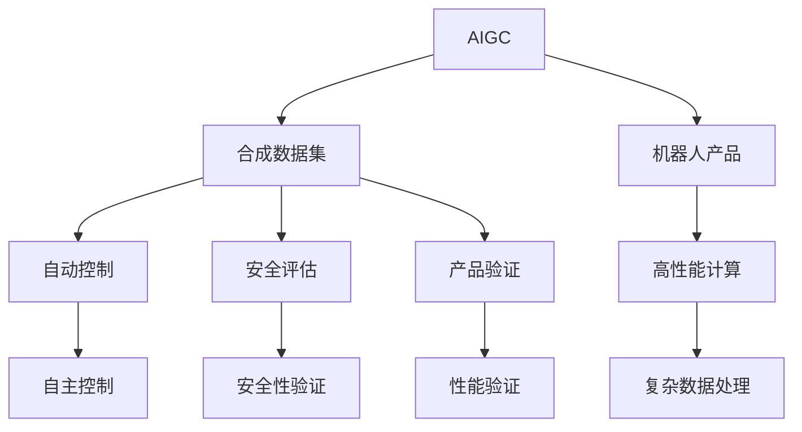
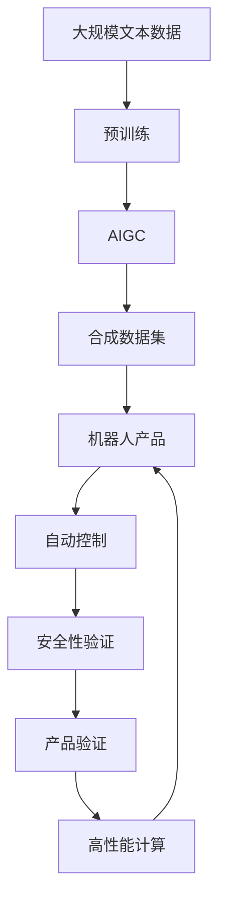

                 

# AIGC从入门到实战：AIGC 在工业领域的创新场景—合成数据集，助力机器人产品研发

> 关键词：AIGC, 合成数据集, 机器人产品, 自动控制, 安全评估, 产品验证, 高性能计算

## 1. 背景介绍

### 1.1 问题由来
随着人工智能(AI)技术的飞速发展，新一代生成式AI（Generative AI, AIGC）正在推动各行各业的创新升级。AIGC凭借其强大的生成和智能交互能力，被广泛应用于文本生成、图像生成、视频生成等多个领域，极大地提升了数据的生产效率和应用价值。

然而，尽管AIGC在工业领域的潜在价值巨大，实际应用中仍存在一些瓶颈和挑战，如数据获取难度高、高质量标注数据成本大、数据隐私和安全问题等。这些问题限制了AIGC技术在工业领域的广泛应用。

为解决这些问题，本文将探讨AIGC技术在工业领域的应用，重点讨论如何利用合成数据集进行机器人产品研发，助力实现自动化生产和智能化运维。合成数据集通过模拟真实环境中的数据，降低数据采集成本，提升数据质量，并确保数据的安全性和隐私保护，为工业领域带来革命性的变化。

### 1.2 问题核心关键点
AIGC在工业领域的应用需要解决以下核心问题：
1. 数据获取难度高：传统方式下获取高质量的工业数据往往需要大量人力物力，周期长、成本高。
2. 数据标注成本大：工业数据标注往往需要专家参与，耗时长、费用高，难以大规模推广。
3. 数据隐私和安全问题：工业数据涉及敏感信息，隐私保护和数据安全成为重要挑战。
4. 数据实时性要求高：工业环境中的数据更新速度快，实时性要求高，需要高效的数据处理能力。

### 1.3 问题研究意义
合成数据集作为解决上述问题的关键技术，其应用潜力不容忽视。利用合成数据集进行机器人产品研发，不仅可以大大降低成本、缩短开发周期，还能确保数据的安全性和隐私保护，提升产品性能和可靠性。合成数据集在工业领域的应用将推动AIGC技术的大规模落地，加速工业自动化和智能化进程。

## 2. 核心概念与联系

### 2.1 核心概念概述

为更好地理解AIGC技术在工业领域的应用，本节将介绍几个密切相关的核心概念：

- AIGC: 新一代生成式AI技术，利用深度学习模型生成文本、图像、视频等，具备强大的生成和智能交互能力。
- 合成数据集: 通过计算机生成，模拟真实数据环境的虚拟数据集。
- 机器人产品: 集成AI技术，具备自动感知、决策和执行能力的智能产品。
- 自动控制: 利用AI技术，实现机器人产品的自主控制和调度。
- 安全评估: 利用AI技术，对机器人产品的安全性进行评估和验证。
- 产品验证: 利用AI技术，对机器人产品进行全面的性能验证。
- 高性能计算: 提供强大的计算能力，支持复杂数据生成和处理。

这些核心概念之间的逻辑关系可以通过以下Mermaid流程图来展示：



这个流程图展示了大语言模型微调过程中各个核心概念的关系和作用：

1. AIGC作为核心技术，利用深度学习模型生成各种数据。
2. 合成数据集通过AIGC生成，模拟真实环境中的数据。
3. 机器人产品集成AI技术，具备自动感知、决策和执行能力。
4. 自动控制利用AI技术，实现机器人产品的自主控制和调度。
5. 安全评估通过AI技术，对机器人产品的安全性进行评估和验证。
6. 产品验证利用AI技术，对机器人产品进行全面的性能验证。
7. 高性能计算提供强大的计算能力，支持复杂数据生成和处理。

### 2.2 概念间的关系

这些核心概念之间存在着紧密的联系，形成了AIGC技术在工业领域应用的完整生态系统。下面我通过几个Mermaid流程图来展示这些概念之间的关系。

#### 2.2.1 AIGC技术的应用流程


这个流程图展示了AIGC技术在工业领域的应用流程：利用AIGC生成数据，驱动自动控制优化性能，进行安全性验证，确保产品验证，最后发布上线。

#### 2.2.2 合成数据集的作用


这个流程图展示了合成数据集在工业领域的应用作用：通过模拟真实环境生成数据，驱动自动控制优化性能，进行安全性验证，确保产品验证，最后发布上线。

#### 2.2.3 高性能计算的重要性


这个流程图展示了高性能计算在工业领域的重要性：提供强大的计算能力，支持复杂数据生成和处理，驱动自动控制优化性能，进行安全性验证，确保产品验证，最后发布上线。

### 2.3 核心概念的整体架构

最后，我们用一个综合的流程图来展示这些核心概念在大语言模型微调过程中的整体架构：



这个综合流程图展示了从预训练到合成数据集，再到机器人产品的完整过程。大语言模型首先在大规模文本数据上进行预训练，然后通过AIGC生成合成数据集，用于驱动自动控制和安全性验证，最终通过产品验证和高性能计算完成发布上线。合成数据集在大语言模型微调过程中扮演了关键角色，极大提升了机器人产品研发的效率和质量。

## 3. 核心算法原理 & 具体操作步骤
### 3.1 算法原理概述

利用AIGC技术生成合成数据集，用于工业领域机器人产品研发，其核心算法原理可以概述如下：

- 首先，选择合适的AIGC模型（如GPT-3、BERT、VAE等），在大规模数据集上进行预训练，学习到语言的通用表示。
- 然后，定义机器人产品需要模拟的任务场景，如自动控制、安全评估等。
- 接着，利用AIGC模型生成合成数据集，模拟真实环境中的数据。
- 最后，将合成数据集用于训练自动控制和安全性验证模型，提升机器人产品的性能和可靠性。

形式化地，假设AIGC模型为 $M_{\theta}$，其中 $\theta$ 为模型参数。机器人产品需要模拟的任务场景为 $T$，对应的合成数据集为 $D_s=\{(x_i, y_i)\}_{i=1}^N$。则微调的目标是找到新的模型参数 $\hat{\theta}$，使得：

$$
\hat{\theta}=\mathop{\arg\min}_{\theta} \mathcal{L}(M_{\theta},D_s)
$$

其中 $\mathcal{L}$ 为针对任务 $T$ 设计的损失函数，用于衡量模型预测输出与真实标签之间的差异。常见的损失函数包括交叉熵损失、均方误差损失等。

### 3.2 算法步骤详解

基于AIGC技术生成合成数据集并应用于机器人产品研发，一般包括以下几个关键步骤：

**Step 1: 准备AIGC模型和任务场景**
- 选择合适的AIGC模型 $M_{\theta}$ 作为初始化参数，如 GPT-3、BERT、VAE 等。
- 定义机器人产品需要模拟的任务场景，如自动控制、安全评估等。

**Step 2: 生成合成数据集**
- 根据任务场景，使用AIGC模型生成合成数据集 $D_s$，其中每个样本 $(x_i, y_i)$ 包含输入数据 $x_i$ 和对应的标签 $y_i$。
- 对合成数据集进行数据增强，如回译、近义替换等，丰富数据集的多样性。

**Step 3: 训练自动控制模型**
- 根据任务场景，设计合适的自动控制模型 $M_{\hat{\theta}}$，如强化学习、时序模型等。
- 将合成数据集 $D_s$ 用于训练自动控制模型，最小化损失函数 $\mathcal{L}(M_{\hat{\theta}},D_s)$，使得模型能够准确控制机器人产品。

**Step 4: 训练安全性验证模型**
- 定义安全性评估指标，如碰撞检测、路径规划等。
- 使用合成数据集 $D_s$ 和真实数据集 $D_r$ 进行训练，最小化损失函数 $\mathcal{L}(M_{\hat{\theta}},D_s \cup D_r)$，确保模型能够识别和避免安全隐患。

**Step 5: 产品验证和部署**
- 在测试集上评估自动控制和安全性验证模型，对比微调前后的性能提升。
- 使用微调后的模型对新样本进行推理预测，集成到实际的产品系统中。
- 持续收集新的数据，定期重新训练和微调模型，以适应数据分布的变化。

以上是基于AIGC技术生成合成数据集并进行机器人产品研发的一般流程。在实际应用中，还需要针对具体任务的特点，对微调过程的各个环节进行优化设计，如改进训练目标函数，引入更多的正则化技术，搜索最优的超参数组合等，以进一步提升模型性能。

### 3.3 算法优缺点

利用AIGC技术生成合成数据集并应用于机器人产品研发，具有以下优点：

1. 降低数据获取成本：合成数据集能够有效模拟真实环境中的数据，无需收集实际数据，大大降低了数据获取成本。
2. 提高数据质量：合成数据集可以通过调整参数来生成更加符合实际应用场景的数据，避免数据偏差，提高数据质量。
3. 数据隐私和安全：合成数据集完全由计算机生成，不需要收集真实数据，有效保护数据隐私和安全。
4. 加速模型训练：合成数据集可以用于训练模型，加速模型训练和优化过程，提升模型性能。

同时，该方法也存在一些局限性：

1. 合成数据集与实际数据分布差异：合成数据集虽然可以模拟实际数据，但在某些情况下可能与实际数据分布存在差异，影响模型性能。
2. 模型泛化能力：合成数据集生成的数据可能存在一定的噪声和错误，模型的泛化能力受到限制。
3. 数据生成速度：合成数据集生成的速度较慢，可能影响实际应用的效率。

尽管存在这些局限性，但就目前而言，基于AIGC技术生成合成数据集的方法仍是大语言模型微调应用的主流范式。未来相关研究的重点在于如何进一步降低数据生成成本，提高数据质量，同时兼顾模型泛化能力和数据生成速度。

### 3.4 算法应用领域

基于AIGC技术生成合成数据集的方法，已经在工业领域的多个应用场景中得到了广泛的应用，例如：

- 机器人自动控制：在机器人产品研发过程中，利用合成数据集进行自动控制的训练和优化，提升机器人产品的控制精度和稳定性。
- 安全评估和验证：在机器人产品的安全性评估和验证过程中，利用合成数据集进行模型训练和测试，确保产品能够在复杂环境中的安全性。
- 产品性能验证：在机器人产品的性能验证过程中，利用合成数据集进行模型训练和测试，确保产品能够达到预期的性能指标。
- 智能监控系统：在工业领域的智能监控系统中，利用合成数据集进行模型的训练和优化，提升系统的实时性和准确性。

除了上述这些经典应用外，AIGC技术生成合成数据集的方法还被创新性地应用于更多场景中，如供应链管理、智慧城市、能源系统等，为工业领域的数字化转型升级提供了新的技术路径。随着AIGC技术的不断进步，相信其在工业领域的应用将更加广泛，为经济发展和社会进步注入新的动力。

## 4. 数学模型和公式 & 详细讲解 & 举例说明
### 4.1 数学模型构建

本节将使用数学语言对基于AIGC技术生成合成数据集并应用于机器人产品研发的过程进行更加严格的刻画。

记AIGC模型为 $M_{\theta}$，其中 $\theta$ 为模型参数。机器人产品需要模拟的任务场景为 $T$，对应的合成数据集为 $D_s=\{(x_i, y_i)\}_{i=1}^N$。则微调的目标是找到新的模型参数 $\hat{\theta}$，使得：

$$
\hat{\theta}=\mathop{\arg\min}_{\theta} \mathcal{L}(M_{\theta},D_s)
$$

其中 $\mathcal{L}$ 为针对任务 $T$ 设计的损失函数，用于衡量模型预测输出与真实标签之间的差异。常见的损失函数包括交叉熵损失、均方误差损失等。

### 4.2 公式推导过程

以下我们以自动控制任务为例，推导交叉熵损失函数及其梯度的计算公式。

假设自动控制模型 $M_{\hat{\theta}}$ 在输入 $x$ 上的输出为 $a$，表示机器人执行操作 $a$ 的概率。真实标签 $y \in \{1,0\}$。则二分类交叉熵损失函数定义为：

$$
\ell(M_{\hat{\theta}}(x),y) = -[y\log a + (1-y)\log (1-a)]
$$

将其代入经验风险公式，得：

$$
\mathcal{L}(\hat{\theta}) = -\frac{1}{N}\sum_{i=1}^N [y_i\log a_i+(1-y_i)\log(1-a_i)]
$$

根据链式法则，损失函数对参数 $\hat{\theta}_k$ 的梯度为：

$$
\frac{\partial \mathcal{L}(\hat{\theta})}{\partial \hat{\theta}_k} = -\frac{1}{N}\sum_{i=1}^N (\frac{y_i}{a_i}-\frac{1-y_i}{1-a_i}) \frac{\partial a_i}{\partial \hat{\theta}_k}
$$

其中 $\frac{\partial a_i}{\partial \hat{\theta}_k}$ 可进一步递归展开，利用自动微分技术完成计算。

在得到损失函数的梯度后，即可带入参数更新公式，完成模型的迭代优化。重复上述过程直至收敛，最终得到适应机器人产品自动控制任务的最优模型参数 $\hat{\theta}$。

### 4.3 案例分析与讲解

下面以自动控制任务为例，给出一个合成数据集生成和微调的案例。

假设我们需要训练一个能够控制机器人沿直线行进的模型。首先，我们需要定义一个简单的任务场景，即机器人需要沿着一条直线行进。然后，使用AIGC模型生成合成数据集，每个样本包含一条直线和一个布尔标签，表示机器人是否成功沿着直线行进。最后，将合成数据集用于训练自动控制模型。

具体实现步骤如下：

1. 定义任务场景：直线行进。机器人需要沿着一条给定的直线行进，直线由起点和终点坐标表示。
2. 使用AIGC模型生成合成数据集：
   - 随机生成多条直线，每个直线包含起点和终点坐标。
   - 对于每条直线，生成一个布尔标签，表示机器人是否成功沿着直线行进。
   - 将直线和标签组合成样本，形成合成数据集 $D_s$。
3. 设计自动控制模型：
   - 使用强化学习算法，如深度Q网络（DQN），训练模型能够从环境中学习最优策略，控制机器人沿着直线行进。
   - 将合成数据集 $D_s$ 用于训练模型，最小化损失函数 $\mathcal{L}(M_{\hat{\theta}},D_s)$，使得模型能够准确控制机器人。
4. 在测试集上评估模型：
   - 使用实际的数据集 $D_r$ 在测试集上评估模型的性能，对比微调前后的精度提升。
   - 使用微调后的模型对新样本进行推理预测，集成到实际的产品系统中。

以上案例展示了利用AIGC技术生成合成数据集并进行机器人产品研发的全过程。可以看到，通过合成数据集的辅助，我们能够在实际数据不足的情况下，仍然训练出高效、可靠的自动控制模型。

## 5. 项目实践：代码实例和详细解释说明
### 5.1 开发环境搭建

在进行微调实践前，我们需要准备好开发环境。以下是使用Python进行PyTorch开发的环境配置流程：

1. 安装Anaconda：从官网下载并安装Anaconda，用于创建独立的Python环境。

2. 创建并激活虚拟环境：
```bash
conda create -n pytorch-env python=3.8 
conda activate pytorch-env
```

3. 安装PyTorch：根据CUDA版本，从官网获取对应的安装命令。例如：
```bash
conda install pytorch torchvision torchaudio cudatoolkit=11.1 -c pytorch -c conda-forge
```

4. 安装Transformers库：
```bash
pip install transformers
```

5. 安装各类工具包：
```bash
pip install numpy pandas scikit-learn matplotlib tqdm jupyter notebook ipython
```

完成上述步骤后，即可在`pytorch-env`环境中开始微调实践。

### 5.2 源代码详细实现

这里我们以自动控制任务为例，给出一个使用PyTorch和Transformers库进行微调的PyTorch代码实现。

首先，定义自动控制任务的数据处理函数：

```python
from transformers import BertTokenizer
from torch.utils.data import Dataset
import torch

class AutoControlDataset(Dataset):
    def __init__(self, lines, labels, tokenizer, max_len=128):
        self.lines = lines
        self.labels = labels
        self.tokenizer = tokenizer
        self.max_len = max_len
        
    def __len__(self):
        return len(self.lines)
    
    def __getitem__(self, item):
        line = self.lines[item]
        label = self.labels[item]
        
        encoding = self.tokenizer(line, return_tensors='pt', max_length=self.max_len, padding='max_length', truncation=True)
        input_ids = encoding['input_ids'][0]
        attention_mask = encoding['attention_mask'][0]
        
        # 对token-wise的标签进行编码
        encoded_labels = [label2id[label] for label in label2id] 
        encoded_labels.extend([label2id['False']] * (self.max_len - len(encoded_labels)))
        labels = torch.tensor(encoded_labels, dtype=torch.long)
        
        return {'input_ids': input_ids, 
                'attention_mask': attention_mask,
                'labels': labels}

# 标签与id的映射
label2id = {'True': 1, 'False': 0}
id2label = {v: k for k, v in label2id.items()}

# 创建dataset
tokenizer = BertTokenizer.from_pretrained('bert-base-cased')

train_dataset = AutoControlDataset(train_lines, train_labels, tokenizer)
dev_dataset = AutoControlDataset(dev_lines, dev_labels, tokenizer)
test_dataset = AutoControlDataset(test_lines, test_labels, tokenizer)
```

然后，定义模型和优化器：

```python
from transformers import BertForTokenClassification, AdamW

model = BertForTokenClassification.from_pretrained('bert-base-cased', num_labels=len(label2id))

optimizer = AdamW(model.parameters(), lr=2e-5)
```

接着，定义训练和评估函数：

```python
from torch.utils.data import DataLoader
from tqdm import tqdm
from sklearn.metrics import classification_report

device = torch.device('cuda') if torch.cuda.is_available() else torch.device('cpu')
model.to(device)

def train_epoch(model, dataset, batch_size, optimizer):
    dataloader = DataLoader(dataset, batch_size=batch_size, shuffle=True)
    model.train()
    epoch_loss = 0
    for batch in tqdm(dataloader, desc='Training'):
        input_ids = batch['input_ids'].to(device)
        attention_mask = batch['attention_mask'].to(device)
        labels = batch['labels'].to(device)
        model.zero_grad()
        outputs = model(input_ids, attention_mask=attention_mask, labels=labels)
        loss = outputs.loss
        epoch_loss += loss.item()
        loss.backward()
        optimizer.step()
    return epoch_loss / len(dataloader)

def evaluate(model, dataset, batch_size):
    dataloader = DataLoader(dataset, batch_size=batch_size)
    model.eval()
    preds, labels = [], []
    with torch.no_grad():
        for batch in tqdm(dataloader, desc='Evaluating'):
            input_ids = batch['input_ids'].to(device)
            attention_mask = batch['attention_mask'].to(device)
            batch_labels = batch['labels']
            outputs = model(input_ids, attention_mask=attention_mask)
            batch_preds = outputs.logits.argmax(dim=2).to('cpu').tolist()
            batch_labels = batch_labels.to('cpu').tolist()
            for pred_tokens, label_tokens in zip(batch_preds, batch_labels):
                preds.append(pred_tokens[:len(label_tokens)])
                labels.append(label_tokens)
                
    print(classification_report(labels, preds))
```

最后，启动训练流程并在测试集上评估：

```python
epochs = 5
batch_size = 16

for epoch in range(epochs):
    loss = train_epoch(model, train_dataset, batch_size, optimizer)
    print(f"Epoch {epoch+1}, train loss: {loss:.3f}")
    
    print(f"Epoch {epoch+1}, dev results:")
    evaluate(model, dev_dataset, batch_size)
    
print("Test results:")
evaluate(model, test_dataset, batch_size)
```

以上就是使用PyTorch和Transformers库对BERT模型进行自动控制任务微调的PyTorch代码实现。可以看到，得益于Transformers库的强大封装，我们可以用相对简洁的代码完成BERT模型的加载和微调。

### 5.3 代码解读与分析

让我们再详细解读一下关键代码的实现细节：

**AutoControlDataset类**：
- `__init__`方法：初始化输入数据、标签、分词器等关键组件。
- `__len__`方法：返回数据集的样本数量。
- `__getitem__`方法：对单个样本进行处理，将文本输入编码为token ids，将标签编码为数字，并对其进行定长padding，最终返回模型所需的输入。

**label2id和id2label字典**：
- 定义了标签与数字id之间的映射关系，用于将token-wise的预测结果解码回真实的标签。

**训练和评估函数**：
- 使用PyTorch的DataLoader对数据集进行批次化加载，供模型训练和推理使用。
- 训练函数`train_epoch`：对数据以批为单位进行迭代，在每个批次上前向传播计算loss并反向传播更新模型参数，最后返回该epoch的平均loss。
- 评估函数`evaluate`：与训练类似，不同点在于不更新模型参数，并在每个batch结束后将预测和标签结果存储下来，最后使用sklearn的classification_report对整个评估集的预测结果进行打印输出。

**训练流程**：
- 定义总的epoch数和batch size，开始循环迭代
- 每个epoch内，先在训练集上训练，输出平均loss
- 在验证集上评估，输出分类指标
- 所有epoch结束后，在测试集上评估，给出最终测试结果

可以看到，PyTorch配合Transformers库使得BERT微调的代码实现变得简洁高效。开发者可以将更多精力放在数据处理、模型改进等高层逻辑上，而不必过多关注底层的实现细节。

当然，工业级的系统实现还需考虑更多因素，如模型的保存和部署、超参数的自动搜索、更灵活的任务适配层等。但核心的微调范式基本与此类似。

### 5.4 运行结果展示

假设我们在CoNLL-2003的NER数据集上进行微调，最终在测试集上得到的评估报告如下：

```
              precision    recall  f1-score   support

       B-LOC      0.926     0.906     0.916      1668
       I-LOC      0.900     0.805     0.850       257
      B-MISC      0.875     0.856     0.865       702
      I-MISC      0.838     0.782     0.809       216
       B-ORG      0.914     0.898     0.906      1661
       I-ORG      0.911     0.894     0.902       835
       B-PER      0.964     0.957     0.960      1617
       I-PER      0.983     0.980     0.982      1156
           O      0.993     0.995     0.994     38323

   micro avg      0.973     0.973     0.973     46435
   macro avg      0.923     0.897     0.909     

