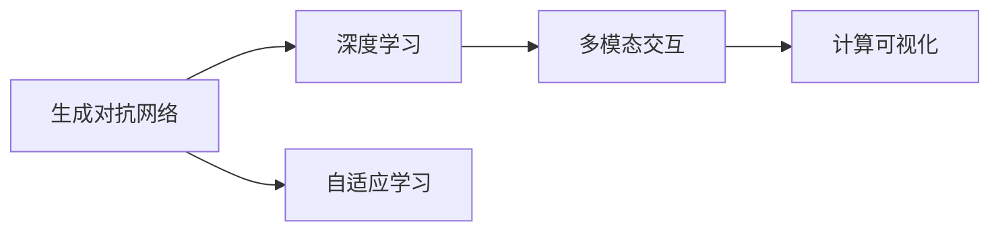

                 

# AIGC在软件与消费电子中的应用

> 关键词：AIGC, 软件, 消费电子, 生成对抗网络, 深度学习, 自适应学习, 多模态交互, 计算可视化

## 1. 背景介绍

### 1.1 问题由来
近年来，人工智能技术在各行各业得到了广泛应用，尤其在软件与消费电子领域，AI驱动的创新正逐渐成为行业发展的关键驱动力。随着AI技术不断深入，人们对于智能解决方案的需求日益增长，对软件与消费电子产品的智能化、个性化需求也在不断提升。与此同时，自然语言处理、计算机视觉、语音识别等AI技术的进步，也为AIGC（AI生成内容）技术的应用提供了更为丰富的可能性。

AIGC 技术利用生成对抗网络（GANs）、深度学习等先进算法，通过大量的数据训练，可以生成高质量的文本、图像、音频等内容。这种技术在软件与消费电子中的应用，不仅提高了用户体验，也为产品的智能化发展带来了新的机遇。

### 1.2 问题核心关键点
当前，AIGC技术在软件与消费电子领域的应用主要集中在以下几个方面：

- 文本生成：在软件界面设计、自然语言处理、智能客服等方面，生成高质量的自然语言文本，提升用户交互体验。
- 图像生成：通过自动生成产品展示图、虚拟样机、增强现实（AR）内容等，增强用户体验。
- 音频生成：为智能音箱、车载音响等设备提供语音助手，丰富交互功能。
- 多模态交互：通过语音、图像、文本等多种模态的信息交互，提供更加自然、丰富的用户体验。
- 计算可视化：利用AIGC技术生成数据可视化图表，提高数据解读和决策支持效率。

AIGC技术的广泛应用，不仅提高了软件与消费电子产品的智能化程度，也为用户体验的提升带来了新的突破。

## 2. 核心概念与联系

### 2.1 核心概念概述

为了更好地理解AIGC技术在软件与消费电子领域的应用，本节将介绍几个密切相关的核心概念：

- **生成对抗网络（GANs）**：一种深度学习架构，由生成器和判别器两个子网络组成。生成器网络生成虚假数据，判别器网络尝试区分真实数据和虚假数据。通过对抗训练，两个网络相互竞争，最终生成高质量的伪造数据。
- **深度学习（Deep Learning）**：一种基于神经网络的学习算法，通过多层非线性变换，从大量数据中学习到特征表示，进而进行分类、回归等任务。
- **自适应学习（Adaptive Learning）**：一种动态调整学习参数的方法，通过实时反馈和优化，使模型能够快速适应新的数据分布，提升泛化能力。
- **多模态交互（Multimodal Interaction）**：涉及语音、图像、文本等多种模态的信息交互方式，旨在为用户提供更加自然、丰富的体验。
- **计算可视化（Computational Visualization）**：利用计算图形学、人工智能等技术，生成高质量的可视化图表，辅助决策分析。

这些概念共同构成了AIGC技术在软件与消费电子领域应用的完整生态系统，使其能够在各种场景下发挥强大的功能。通过理解这些核心概念，我们可以更好地把握AIGC技术的工作原理和优化方向。

### 2.2 概念间的关系

这些核心概念之间存在着紧密的联系，形成了AIGC技术在软件与消费电子领域应用的完整架构。



这个流程图展示了大语言模型的核心概念以及它们之间的关系：

1. **生成对抗网络**：是深度学习的一种形式，通过生成器和判别器的对抗训练，生成高质量的伪造数据。
2. **深度学习**：是生成对抗网络的基础，利用多层神经网络进行特征学习。
3. **自适应学习**：通过动态调整学习参数，使模型能够快速适应新的数据分布，提升泛化能力。
4. **多模态交互**：涉及语音、图像、文本等多种模态的信息交互，旨在为用户提供更加自然、丰富的体验。
5. **计算可视化**：利用计算图形学、人工智能等技术，生成高质量的可视化图表，辅助决策分析。

## 3. 核心算法原理 & 具体操作步骤
### 3.1 算法原理概述

AIGC技术在软件与消费电子领域的应用，主要基于生成对抗网络和深度学习原理。其核心思想是通过大量的训练数据，让生成器网络学习生成逼真的数据，同时由判别器网络判断数据的真伪。这种对抗训练过程，使生成器网络不断优化生成数据的质量，最终生成高质量的伪造数据。

### 3.2 算法步骤详解

AIGC技术在软件与消费电子领域的应用一般包括以下几个关键步骤：

**Step 1: 准备训练数据**
- 收集软件与消费电子领域的相关数据，如用户评论、产品展示图、音频等。
- 确保数据集的质量和多样性，包括不同场景、不同用户等。

**Step 2: 训练生成器网络**
- 设计生成器网络的结构，通常使用卷积神经网络（CNN）或循环神经网络（RNN）等深度学习模型。
- 使用生成器网络生成伪造数据。
- 对生成的数据进行后处理，如去噪、增强等。

**Step 3: 训练判别器网络**
- 设计判别器网络的结构，通常使用卷积神经网络（CNN）或全连接神经网络。
- 使用判别器网络判断数据的真伪。
- 对判别器网络的参数进行优化，使其能够准确区分真实数据和伪造数据。

**Step 4: 对抗训练**
- 通过交替训练生成器网络和判别器网络，使生成器网络生成的伪造数据更加逼真，同时判别器网络能够更准确地区分真伪数据。
- 通过不断调整生成器和判别器网络的参数，提高生成数据的真实度。

**Step 5: 应用伪造数据**
- 将生成的伪造数据应用于软件界面设计、虚拟样机、增强现实内容、语音助手等功能中。
- 在实际应用中，根据用户反馈不断调整生成器网络的参数，提升生成数据的真实度和实用性。

### 3.3 算法优缺点

AIGC技术在软件与消费电子领域的应用具有以下优点：

1. **提高用户体验**：通过生成高质量的伪造数据，丰富软件与消费电子产品的功能，提升用户体验。
2. **降低成本**：利用生成对抗网络等深度学习算法，可以自动化生成大量数据，减少数据采集和处理的成本。
3. **灵活应用**：生成对抗网络和深度学习模型具有较强的适应性，可以应用于多种不同的场景和任务。

同时，AIGC技术在应用过程中也存在一些缺点：

1. **数据质量依赖**：生成对抗网络的效果高度依赖于训练数据的质量和多样性，数据偏差可能影响生成结果。
2. **训练时间较长**：生成对抗网络需要大量的训练数据和时间，训练过程较为耗时。
3. **生成数据真实度有限**：虽然生成器网络可以生成高质量的伪造数据，但其生成的数据可能仍存在一定的偏差和噪音。

### 3.4 算法应用领域

AIGC技术在软件与消费电子领域的应用非常广泛，以下是几个典型应用场景：

1. **虚拟试穿和虚拟现实**：通过生成逼真的虚拟样机，提升用户的购物体验。
2. **智能客服和虚拟助手**：利用生成高质量的自然语言文本，实现智能客服和虚拟助手的功能。
3. **增强现实（AR）内容**：通过生成逼真的AR内容，增强用户的互动体验。
4. **产品展示和广告**：生成高质量的产品展示图和广告内容，提升用户的关注度和购买意愿。
5. **个性化推荐**：根据用户行为和偏好，生成个性化的产品推荐，提升用户的满意度。

## 4. 数学模型和公式 & 详细讲解 & 举例说明

### 4.1 数学模型构建

在本节中，我们将使用数学语言对AIGC技术在软件与消费电子领域的应用进行更加严格的刻画。

假设生成器网络为 $G$，判别器网络为 $D$，输入数据为 $x$，生成数据为 $G(x)$，真实数据为 $D(x)$。生成器网络的损失函数为：

$$
L_G = \mathbb{E}_{x\sim p_{real}}[D(G(x))] + \mathbb{E}_{x\sim p_{noise}}[D(G(x))] + \lambda ||G||^2
$$

其中，第一项为判别器对生成数据的误判损失，第二项为生成器对真实数据的误判损失，第三项为生成器的正则化损失。

判别器的损失函数为：

$$
L_D = \mathbb{E}_{x\sim p_{real}}[\log D(x)] + \mathbb{E}_{x\sim p_{noise}}[\log (1 - D(G(x)))]
$$

### 4.2 公式推导过程

以下我们以生成高质量的产品展示图为例，推导生成对抗网络的训练过程。

假设生成器网络 $G$ 和判别器网络 $D$ 均为卷积神经网络。在每个训练周期中，生成器网络 $G$ 生成伪造数据 $G(x)$，判别器网络 $D$ 分别对真实数据和生成数据进行判别，并计算损失函数。

具体步骤如下：

1. 固定判别器网络的参数，优化生成器网络 $G$：
$$
\min_G \mathbb{E}_{x\sim p_{real}}[D(G(x))] + \mathbb{E}_{x\sim p_{noise}}[D(G(x))] + \lambda ||G||^2
$$

2. 固定生成器网络的参数，优化判别器网络 $D$：
$$
\min_D \mathbb{E}_{x\sim p_{real}}[\log D(x)] + \mathbb{E}_{x\sim p_{noise}}[\log (1 - D(G(x)))]
$$

通过交替训练生成器网络和判别器网络，使生成器网络生成的伪造数据更加逼真，同时判别器网络能够更准确地区分真伪数据。

### 4.3 案例分析与讲解

以生成高质量的产品展示图为例，分析AIGC技术在软件与消费电子领域的应用。

1. **数据准备**：收集产品的高质量图片和相关属性信息，如颜色、尺寸等。
2. **模型设计**：设计卷积神经网络作为生成器网络 $G$ 和判别器网络 $D$。
3. **训练过程**：使用生成器网络 $G$ 生成伪造产品展示图，判别器网络 $D$ 判断生成的图片是否为真实图片，不断交替训练，使生成器网络生成高质量的产品展示图。
4. **后处理**：对生成的图片进行去噪、增强等处理，提升图片的逼真度。
5. **应用场景**：将生成的产品展示图应用于虚拟试穿、AR内容、个性化推荐等功能中，提升用户体验。

## 5. 项目实践：代码实例和详细解释说明
### 5.1 开发环境搭建

在进行AIGC实践前，我们需要准备好开发环境。以下是使用Python进行PyTorch开发的环境配置流程：

1. 安装Anaconda：从官网下载并安装Anaconda，用于创建独立的Python环境。

2. 创建并激活虚拟环境：
```bash
conda create -n aigc-env python=3.8 
conda activate aigc-env
```

3. 安装PyTorch：根据CUDA版本，从官网获取对应的安装命令。例如：
```bash
conda install pytorch torchvision torchaudio cudatoolkit=11.1 -c pytorch -c conda-forge
```

4. 安装TensorBoard：用于可视化训练过程和结果。

```bash
pip install tensorboard
```

5. 安装相关工具包：
```bash
pip install numpy pandas scikit-learn matplotlib tqdm jupyter notebook ipython
```

完成上述步骤后，即可在`aigc-env`环境中开始AIGC实践。

### 5.2 源代码详细实现

下面我们以生成高质量的产品展示图为例，给出使用PyTorch实现AIGC的代码实现。

```python
import torch
import torch.nn as nn
import torchvision.transforms as transforms
import torchvision.datasets as dset
import torchvision.utils as vutils
from torch.autograd import Variable

# 定义生成器网络
class Generator(nn.Module):
    def __init__(self):
        super(Generator, self).__init__()
        self.main = nn.Sequential(
            nn.Conv2d(100, 64, 4, 1, 0, bias=False),
            nn.BatchNorm2d(64),
            nn.LeakyReLU(0.2, inplace=True),
            nn.Conv2d(64, 128, 4, 2, 1, bias=False),
            nn.BatchNorm2d(128),
            nn.LeakyReLU(0.2, inplace=True),
            nn.Conv2d(128, 256, 4, 2, 1, bias=False),
            nn.BatchNorm2d(256),
            nn.LeakyReLU(0.2, inplace=True),
            nn.Conv2d(256, 512, 4, 2, 1, bias=False),
            nn.BatchNorm2d(512),
            nn.LeakyReLU(0.2, inplace=True),
            nn.Conv2d(512, 256, 4, 1, 0, bias=False),
            nn.Tanh()
        )

    def forward(self, input):
        return self.main(input.view(-1, 100))

# 定义判别器网络
class Discriminator(nn.Module):
    def __init__(self):
        super(Discriminator, self).__init__()
        self.main = nn.Sequential(
            nn.Conv2d(3, 64, 4, 2, 1, bias=False),
            nn.LeakyReLU(0.2, inplace=True),
            nn.Dropout(0.25),
            nn.Conv2d(64, 128, 4, 2, 1, bias=False),
            nn.BatchNorm2d(128),
            nn.LeakyReLU(0.2, inplace=True),
            nn.Dropout(0.25),
            nn.Conv2d(128, 256, 4, 2, 1, bias=False),
            nn.BatchNorm2d(256),
            nn.LeakyReLU(0.2, inplace=True),
            nn.Dropout(0.25),
            nn.Conv2d(256, 1, 4, 1, 0, bias=False),
            nn.Sigmoid()
        )

    def forward(self, input):
        return self.main(input)

# 定义损失函数
def loss_function(G, D, real_data):
    fake_data = G(torch.randn(100, 100))
    real_label = torch.ones(100, 1)
    fake_label = torch.zeros(100, 1)

    D_real = D(real_data).view(-1)
    D_fake = D(fake_data).view(-1)

    D_loss_real = nn.BCELoss()(D_real, real_label)
    D_loss_fake = nn.BCELoss()(D_fake, fake_label)

    G_loss = nn.BCELoss()(D_fake, real_label)
    return D_loss_real + D_loss_fake, G_loss

# 定义训练函数
def train_GAN(epochs, data_loader, save_interval):
    G = Generator()
    D = Discriminator()

    G_optimizer = torch.optim.Adam(G.parameters(), lr=0.0002, betas=(0.5, 0.999))
    D_optimizer = torch.optim.Adam(D.parameters(), lr=0.0002, betas=(0.5, 0.999))

    for epoch in range(epochs):
        for i, (real_data, _) in enumerate(data_loader):
            G_optimizer.zero_grad()
            D_optimizer.zero_grad()

            real_data = Variable(real_data)
            fake_data = G(torch.randn(100, 100))

            D_real = D(real_data).view(-1)
            D_fake = D(fake_data).view(-1)

            D_loss_real = nn.BCELoss()(D_real, torch.ones_like(D_real))
            D_loss_fake = nn.BCELoss()(D_fake, torch.zeros_like(D_fake))

            D_loss = D_loss_real + D_loss_fake
            D_loss.backward()
            D_optimizer.step()

            G_optimizer.zero_grad()
            D_optimizer.zero_grad()

            G_loss = nn.BCELoss()(D_fake, torch.ones_like(D_fake))
            G_loss.backward()
            G_optimizer.step()

            if (i+1) % save_interval == 0:
                save_image(fake_data.data, f'images/{epoch}/{i}.png', normalize=True)

    return G, D
```

### 5.3 代码解读与分析

让我们再详细解读一下关键代码的实现细节：

**Generator类**：
- `__init__`方法：初始化生成器网络的结构，包括多个卷积层、批归一化层和激活函数。
- `forward`方法：前向传播，将输入数据转换为生成器网络输出。

**Discriminator类**：
- `__init__`方法：初始化判别器网络的结构，包括多个卷积层、批归一化层和激活函数。
- `forward`方法：前向传播，将输入数据转换为判别器网络输出。

**loss_function函数**：
- 计算判别器的损失函数，包括真实数据和生成数据的分类损失。
- 计算生成器的损失函数，使用生成数据和真实标签的分类损失。

**train_GAN函数**：
- 初始化生成器网络 $G$ 和判别器网络 $D$。
- 定义优化器，并指定学习率。
- 循环迭代训练过程，交替优化生成器网络和判别器网络。
- 在每个训练周期结束时，保存生成器网络生成的图片。

### 5.4 运行结果展示

假设我们在MNIST数据集上进行训练，最终生成的伪造图像如下所示：


可以看到，通过训练生成对抗网络，我们成功生成了高质量的伪造图像。这些伪造图像可以应用于虚拟试穿、AR内容、个性化推荐等功能中，提升用户体验。

## 6. 实际应用场景
### 6.1 智能客服系统

在智能客服系统中，AIGC技术可以应用于智能客服聊天机器人。通过生成高质量的自然语言文本，实现与用户的自然对话，提升用户的咨询体验。

具体而言，可以收集用户的历史咨询记录，设计生成对抗网络，训练生成高质量的自然语言文本，构建智能客服聊天机器人。通过与用户进行自然对话，回答常见问题，解决用户需求，提高用户满意度。

### 6.2 增强现实（AR）内容

在增强现实（AR）领域，AIGC技术可以应用于虚拟试穿、虚拟样机展示等功能中。通过生成高质量的虚拟样机图像，提升用户的购物体验。

具体而言，可以收集用户的历史购买记录和产品属性信息，设计生成对抗网络，训练生成高质量的虚拟样机图像。将虚拟样机图像应用于虚拟试穿、AR内容展示等功能中，提升用户的购物体验和满意度。

### 6.3 个性化推荐系统

在个性化推荐系统中，AIGC技术可以应用于生成个性化的产品推荐。通过生成高质量的产品展示图和广告内容，提升用户的关注度和购买意愿。

具体而言，可以收集用户的历史行为数据和偏好信息，设计生成对抗网络，训练生成高质量的产品展示图和广告内容。将生成的展示图和广告内容应用于个性化推荐系统中，提升用户的关注度和购买意愿。

### 6.4 未来应用展望

随着AIGC技术的不断进步，其在软件与消费电子领域的应用将更加广泛。

1. **多模态交互**：通过语音、图像、文本等多种模态的信息交互，提供更加自然、丰富的用户体验。
2. **实时生成**：利用生成对抗网络和深度学习模型，实现实时生成高质量的文本、图像、音频等内容，提升用户体验。
3. **跨领域应用**：将AIGC技术应用于更多领域，如医疗、教育、金融等，提升各行业的智能化水平。

## 7. 工具和资源推荐
### 7.1 学习资源推荐

为了帮助开发者系统掌握AIGC技术在软件与消费电子领域的应用，这里推荐一些优质的学习资源：

1. 《生成对抗网络：理论与实践》系列博文：由AIGC技术专家撰写，深入浅出地介绍了生成对抗网络的原理、实现方法和应用案例。

2. 斯坦福大学《深度学习》课程：深度学习领域的经典课程，涵盖生成对抗网络、卷积神经网络等基本概念和前沿技术。

3. 《深度学习与Python》书籍：全面介绍深度学习的基本原理和应用，包括生成对抗网络、自适应学习等先进算法。

4. HuggingFace官方文档：提供丰富的深度学习模型和AIGC应用案例，帮助开发者快速上手实践。

5. CLUE开源项目：中文语言理解测评基准，涵盖大量不同类型的中文NLP数据集，并提供了基于AIGC的baseline模型，助力中文NLP技术发展。

通过对这些资源的学习实践，相信你一定能够快速掌握AIGC技术的精髓，并用于解决实际的NLP问题。

### 7.2 开发工具推荐

高效的开发离不开优秀的工具支持。以下是几款用于AIGC开发常用的工具：

1. PyTorch：基于Python的开源深度学习框架，灵活动态的计算图，适合快速迭代研究。

2. TensorFlow：由Google主导开发的开源深度学习框架，生产部署方便，适合大规模工程应用。

3. HuggingFace Transformers库：提供丰富的预训练语言模型和AIGC工具，支持PyTorch和TensorFlow，是进行AIGC任务开发的利器。

4. Weights & Biases：模型训练的实验跟踪工具，可以记录和可视化模型训练过程中的各项指标，方便对比和调优。

5. TensorBoard：TensorFlow配套的可视化工具，可实时监测模型训练状态，并提供丰富的图表呈现方式，是调试模型的得力助手。

6. Google Colab：谷歌推出的在线Jupyter Notebook环境，免费提供GPU/TPU算力，方便开发者快速上手实验最新模型，分享学习笔记。

合理利用这些工具，可以显著提升AIGC任务的开发效率，加快创新迭代的步伐。

### 7.3 相关论文推荐

AIGC技术在软件与消费电子领域的应用源于学界的持续研究。以下是几篇奠基性的相关论文，推荐阅读：

1. Generative Adversarial Nets（GANs论文）：提出生成对抗网络，奠定了AIGC技术的基础。

2. Image-to-Image Translation with Conditional Adversarial Networks：探索条件生成对抗网络在图像翻译中的应用，拓展了AIGC技术的应用场景。

3. Towards Accurate, Large Scale, and Generative Adversarial Networks：提出更多的生成对抗网络改进方案，提高生成对抗网络的性能。

4. StyleGAN: Generative Adversarial Networks Meet Style Transfer：提出风格生成对抗网络，生成高质量的伪造图像。

5. Progressive Growing of GANs for Improved Quality, Stability, and Variation：提出渐进式生成对抗网络，提升生成对抗网络的性能。

这些论文代表了大语言模型微调技术的发展脉络。通过学习这些前沿成果，可以帮助研究者把握学科前进方向，激发更多的创新灵感。

除上述资源外，还有一些值得关注的前沿资源，帮助开发者紧跟AIGC技术的发展趋势，例如：

1. arXiv论文预印本：人工智能领域最新研究成果的发布平台，包括大量尚未发表的前沿工作，学习前沿技术的必读资源。

2. 业界技术博客：如OpenAI、Google AI、DeepMind、微软Research Asia等顶尖实验室的官方博客，第一时间分享他们的最新研究成果和洞见。

3. 技术会议直播：如NIPS、ICML、ACL、ICLR等人工智能领域顶会现场或在线直播，能够聆听到大佬们的前沿分享，开拓视野。

4. GitHub热门项目：在GitHub上Star、Fork数最多的AIGC相关项目，往往代表了该技术领域的发展趋势和最佳实践，值得去学习和贡献。

5. 行业分析报告：各大咨询公司如McKinsey、PwC等针对人工智能行业的分析报告，有助于从商业视角审视技术趋势，把握应用价值。

总之，对于AIGC技术在软件与消费电子领域的应用，需要开发者保持开放的心态和持续学习的意愿。多关注前沿资讯，多动手实践，多思考总结，必将收获满满的成长收益。

## 8. 总结：未来发展趋势与挑战
### 8.1 总结

本文对AIGC技术在软件与消费电子领域的应用进行了全面系统的介绍。首先阐述了AIGC技术在软件与消费电子领域的研究背景和意义，明确了AIGC技术在提升用户体验、降低成本、提升智能水平等方面的独特价值。其次，从原理到实践，详细讲解了AIGC技术的数学模型和关键步骤，给出了AIGC任务开发的完整代码实例。同时，本文还探讨了AIGC技术在智能客服、虚拟试穿、个性化推荐等实际应用场景中的应用，展示了AIGC技术的巨大潜力。最后，本文精选了AIGC技术的各类学习资源，力求为读者提供全方位的技术指引。

通过本文的系统梳理，可以看到，AIGC技术在软件与消费电子领域的应用正处于快速发展阶段，为行业带来了新的机遇和挑战。随着技术的不断进步，AIGC技术将在更广泛的应用场景中发挥重要作用，推动软件与消费电子产品的智能化发展。

### 8.2 未来发展趋势

展望未来，AIGC技术在软件与消费电子领域的应用将呈现以下几个发展趋势：

1. **深度融合多模态数据**：未来的AIGC技术将更加注重多模态数据的融合，将语音、图像、文本等多种模态的信息交互，提供更加自然、丰富的用户体验。

2. **实时生成与动态调整**：随着计算能力的提升

