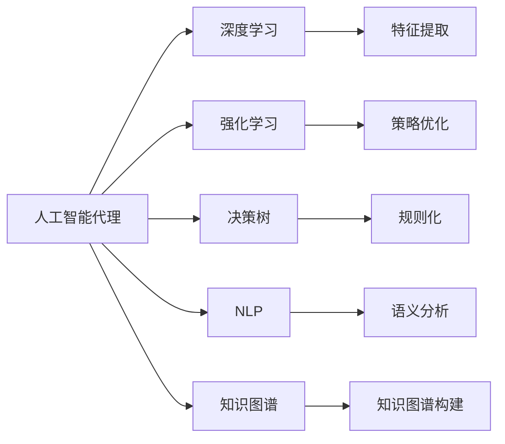

                 

# AI人工智能代理工作流 AI Agent WorkFlow：在保险风险预测中的应用

> 关键词：人工智能代理,保险,风险预测,工作流,深度学习,强化学习,决策树,自然语言处理(NLP),知识图谱

## 1. 背景介绍

### 1.1 问题由来
随着人工智能技术的快速发展，人工智能代理(AI Agent)在各行各业得到了广泛应用。特别是在保险行业，保险公司的运营模式日趋复杂化，决策需要考量多种因素，诸如保费定价、风险评估、理赔处理等。传统的决策方式往往依赖经验丰富的员工，但人力成本高、效率低、容易出错。人工智能代理则能够通过智能算法和自动化流程，快速高效地完成各类任务，同时可以24小时无间断服务，显著提升保险公司的运营效率和决策准确性。

然而，构建一个高效可靠的人工智能代理，并不是一件易事。需要从多个角度进行深入研究，包括模型选择、算法优化、流程设计、知识图谱构建等。本文将聚焦于在保险风险预测中的应用，探讨如何构建一个高效的人工智能代理工作流。

### 1.2 问题核心关键点
构建高效可靠的人工智能代理工作流，需要满足以下关键要求：
- 准确性：确保代理的预测结果准确可靠，尽可能减少错误。
- 实时性：代理应能够实时处理请求，快速响应决策需求。
- 安全性：代理处理的数据必须保证安全和隐私，避免泄露敏感信息。
- 可解释性：代理的决策过程应尽可能透明，便于理解和调试。
- 扩展性：代理能够处理多种场景和数据类型，适应不同的业务需求。
- 易用性：代理应易于集成和部署，降低使用门槛。

本文将围绕这些关键点，全面系统地介绍如何构建一个高效的人工智能代理工作流。

### 1.3 问题研究意义
构建高效可靠的人工智能代理工作流，对于提升保险公司的运营效率、降低运营成本、提高决策质量，具有重要意义：
- 降低人力成本：自动化处理复杂的决策任务，减少对人工的依赖。
- 提高决策效率：实时处理请求，快速响应决策需求，提升决策速度。
- 减少错误率：通过精确的算法和模型，降低决策错误率，提升运营质量。
- 保证数据安全：保护客户隐私和数据安全，避免数据泄露风险。
- 增强决策可解释性：使决策过程透明化，便于理解和调试，增强客户信任。
- 支持多场景应用：适应多种业务需求，构建灵活的代理系统。

本文通过介绍具体的构建方法，旨在帮助读者掌握相关技术，推动人工智能代理在保险行业的应用和发展。

## 2. 核心概念与联系

### 2.1 核心概念概述

为更好地理解人工智能代理工作流的构建方法，本节将介绍几个核心概念及其相互关系：

- **人工智能代理(AI Agent)**：基于人工智能技术，能够自主决策、执行任务的自动化系统。常用于自动化处理复杂任务，提升工作效率和决策质量。
- **工作流(Workflow)**：一种流程化的管理方法，通过定义任务、数据流、规则等，实现复杂流程的自动化和标准化。人工智能代理工作流通常由多个步骤组成，每个步骤负责特定的子任务。
- **深度学习(Deep Learning)**：一种机器学习方法，通过多层次神经网络模型，能够学习复杂的非线性关系。常用于图像识别、自然语言处理等领域。
- **强化学习(Reinforcement Learning)**：一种通过试错过程学习最优策略的方法，适用于决策优化、控制等领域。
- **决策树(Decision Tree)**：一种基于树形结构的分类模型，通过划分数据集，生成规则化的分类结果。常用于风险评估、信用评分等领域。
- **自然语言处理(NLP)**：一种人工智能技术，能够使计算机理解和处理人类语言，包括文本分类、情感分析、实体识别等任务。
- **知识图谱(Knowledge Graph)**：一种结构化的语义知识表示方法，通过节点和边的方式，构建和组织知识体系。常用于信息检索、推荐系统等领域。

这些核心概念通过特定的方式相互关联，共同构成了一个高效的人工智能代理工作流。

### 2.2 概念间的关系

这些核心概念之间的关系可以通过以下Mermaid流程图来展示：



这个流程图展示了人工智能代理工作流的核心组成及其相互关系：

1. **深度学习**：通过特征提取，从原始数据中学习有用的特征表示。
2. **强化学习**：通过策略优化，确定最优的决策方案。
3. **决策树**：通过规则化，生成简单的决策规则。
4. **自然语言处理**：通过语义分析，理解文本信息。
5. **知识图谱**：通过构建知识图谱，整合和组织知识。
6. **特征提取**：将原始数据转化为特征表示。
7. **策略优化**：通过策略优化，找到最优策略。
8. **规则化**：将策略转化为规则。
9. **语义分析**：理解文本信息。
10. **知识图谱构建**：整合和组织知识。

这些组件通过合理的设计和组合，可以构建出一个高效、可靠、灵活的人工智能代理工作流。

## 3. 核心算法原理 & 具体操作步骤
### 3.1 算法原理概述

构建人工智能代理工作流，通常涉及多个步骤，包括数据预处理、特征提取、模型训练、策略优化等。其核心原理如下：

1. **数据预处理**：清洗和标准化输入数据，以便于后续处理和建模。
2. **特征提取**：通过深度学习模型，将原始数据转化为特征表示。
3. **模型训练**：使用训练集数据，训练决策模型。
4. **策略优化**：通过强化学习或优化算法，优化决策策略。
5. **规则生成**：将优化后的策略转化为规则，形成决策树。
6. **语义分析**：通过自然语言处理技术，理解文本信息。
7. **知识整合**：通过知识图谱构建，整合和组织知识。
8. **工作流设计**：定义多个步骤，实现流程自动化。
9. **部署和集成**：将工作流集成到业务系统中，实现自动化。

通过这些步骤，可以实现一个高效、可靠、灵活的人工智能代理工作流。

### 3.2 算法步骤详解

以下是具体的人工智能代理工作流构建步骤：

**Step 1: 数据预处理**
- 收集和清洗输入数据，包括结构化数据和非结构化数据。
- 标准化数据格式，如统一日期格式、字符串编码等。
- 去除噪声数据和异常值，确保数据质量。
- 进行特征工程，生成有用的特征表示。

**Step 2: 特征提取**
- 使用深度学习模型，如卷积神经网络(CNN)、循环神经网络(RNN)、长短时记忆网络(LSTM)等，将原始数据转化为特征表示。
- 对特征进行归一化、标准化处理，以便于后续模型训练。
- 生成高维特征向量，用于后续的模型训练。

**Step 3: 模型训练**
- 选择合适的模型，如决策树、支持向量机(SVM)、随机森林等，使用训练集数据进行模型训练。
- 使用交叉验证等方法，评估模型性能，避免过拟合。
- 调整模型超参数，如学习率、正则化系数等，优化模型效果。
- 保存训练好的模型，以备后续使用。

**Step 4: 策略优化**
- 通过强化学习或优化算法，如梯度下降、遗传算法等，优化决策策略。
- 设计奖励函数，评估策略性能，找到最优策略。
- 对策略进行模拟测试，验证效果。
- 保存优化后的策略，以备后续使用。

**Step 5: 规则生成**
- 将优化后的策略转化为规则，生成决策树。
- 通过剪枝、合并等方法，优化决策树结构。
- 保存生成的决策树，以备后续使用。

**Step 6: 语义分析**
- 使用自然语言处理技术，如词向量、BERT等，对文本信息进行语义分析。
- 生成文本特征向量，用于后续的模型训练。
- 对文本信息进行情感分析、实体识别等任务，提取有用信息。

**Step 7: 知识整合**
- 通过构建知识图谱，整合和组织知识。
- 使用知识图谱进行信息检索、推荐等任务。
- 保存知识图谱，以备后续使用。

**Step 8: 工作流设计**
- 定义多个步骤，实现流程自动化。
- 设计输入输出接口，确保数据流畅。
- 设计状态转移图，管理流程状态。

**Step 9: 部署和集成**
- 将工作流集成到业务系统中，实现自动化。
- 使用Web服务、RESTful API等技术，提供服务接口。
- 设计监控和报警机制，确保系统稳定运行。

### 3.3 算法优缺点

人工智能代理工作流的主要优点如下：
- **高效性**：自动化处理复杂任务，提升工作效率。
- **准确性**：通过精确的算法和模型，提高决策准确性。
- **实时性**：实时处理请求，快速响应决策需求。
- **可扩展性**：适用于多种业务需求，构建灵活的系统。
- **安全性**：保护客户隐私和数据安全，避免数据泄露。
- **易用性**：易于集成和部署，降低使用门槛。

主要缺点如下：
- **复杂性**：构建和维护工作流系统需要较高技术水平。
- **数据依赖**：依赖高质量的数据，数据质量直接影响模型效果。
- **资源消耗**：高维特征和复杂模型需要大量计算资源。
- **模型偏差**：依赖特定数据和模型，可能存在一定的偏差。
- **系统维护**：需要定期更新和维护系统，确保稳定运行。

### 3.4 算法应用领域

人工智能代理工作流在多个领域得到了广泛应用，包括但不限于：

- **金融风险管理**：通过预测客户信用风险、市场波动等，提升风险控制能力。
- **医疗诊断支持**：通过分析病历信息、影像数据等，辅助医生进行诊断和治疗。
- **供应链管理**：通过预测需求、优化库存等，提升供应链运营效率。
- **智能客服**：通过处理客户咨询、投诉等，提升客户服务质量。
- **智能推荐系统**：通过分析用户行为、兴趣等，推荐个性化商品和服务。
- **自动化测试**：通过自动化测试用例，提升软件产品质量。
- **智能制造**：通过预测设备故障、优化生产流程等，提升制造业效率。

## 4. 数学模型和公式 & 详细讲解 & 举例说明
### 4.1 数学模型构建

构建人工智能代理工作流，通常涉及多个数学模型，包括深度学习模型、强化学习模型、决策树模型等。以下以一个简单的保险风险预测模型为例，介绍其数学模型构建过程。

假设我们有一个包含多个特征的数据集 $D=\{(x_i, y_i)\}_{i=1}^N$，其中 $x_i=(x_{i1}, x_{i2}, ..., x_{in})$ 为输入特征向量， $y_i$ 为目标变量。我们的目标是构建一个模型，使得模型能够准确预测目标变量 $y$。

**Step 1: 数据预处理**
- 清洗和标准化输入数据，生成干净的特征向量 $x_i$。
- 去除噪声数据和异常值，确保数据质量。

**Step 2: 特征提取**
- 使用深度学习模型，如卷积神经网络(CNN)、循环神经网络(RNN)等，将原始数据转化为特征表示 $z_i$。
- 对特征进行归一化、标准化处理，以便于后续模型训练。

**Step 3: 模型训练**
- 选择决策树模型，如CART、C4.5等，使用训练集数据进行模型训练。
- 使用交叉验证等方法，评估模型性能，避免过拟合。
- 调整模型超参数，如树深度、剪枝参数等，优化模型效果。
- 保存训练好的决策树模型，以备后续使用。

**Step 4: 策略优化**
- 通过强化学习或优化算法，如梯度下降、遗传算法等，优化决策策略。
- 设计奖励函数，评估策略性能，找到最优策略。
- 对策略进行模拟测试，验证效果。

**Step 5: 规则生成**
- 将优化后的策略转化为规则，生成决策树。
- 通过剪枝、合并等方法，优化决策树结构。

**Step 6: 语义分析**
- 使用自然语言处理技术，如词向量、BERT等，对文本信息进行语义分析。
- 生成文本特征向量，用于后续的模型训练。

**Step 7: 知识整合**
- 通过构建知识图谱，整合和组织知识。
- 使用知识图谱进行信息检索、推荐等任务。

### 4.2 公式推导过程

以决策树模型为例，假设我们有 $N$ 个样本 $D=\{(x_i, y_i)\}_{i=1}^N$，其中 $x_i=(x_{i1}, x_{i2}, ..., x_{in})$ 为输入特征向量， $y_i$ 为目标变量。我们的目标是构建一个决策树模型，使得模型能够准确预测目标变量 $y$。

**Step 1: 数据预处理**
- 清洗和标准化输入数据，生成干净的特征向量 $x_i$。
- 去除噪声数据和异常值，确保数据质量。

**Step 2: 特征提取**
- 使用深度学习模型，如卷积神经网络(CNN)、循环神经网络(RNN)等，将原始数据转化为特征表示 $z_i$。
- 对特征进行归一化、标准化处理，以便于后续模型训练。

**Step 3: 模型训练**
- 选择决策树模型，如CART、C4.5等，使用训练集数据进行模型训练。
- 使用交叉验证等方法，评估模型性能，避免过拟合。
- 调整模型超参数，如树深度、剪枝参数等，优化模型效果。
- 保存训练好的决策树模型，以备后续使用。

**Step 4: 策略优化**
- 通过强化学习或优化算法，如梯度下降、遗传算法等，优化决策策略。
- 设计奖励函数，评估策略性能，找到最优策略。
- 对策略进行模拟测试，验证效果。

**Step 5: 规则生成**
- 将优化后的策略转化为规则，生成决策树。
- 通过剪枝、合并等方法，优化决策树结构。

**Step 6: 语义分析**
- 使用自然语言处理技术，如词向量、BERT等，对文本信息进行语义分析。
- 生成文本特征向量，用于后续的模型训练。

**Step 7: 知识整合**
- 通过构建知识图谱，整合和组织知识。
- 使用知识图谱进行信息检索、推荐等任务。

### 4.3 案例分析与讲解

以一个保险风险预测项目为例，介绍如何构建一个完整的人工智能代理工作流。

**项目背景**
- 某保险公司需要评估客户的信用风险，以决定是否给予贷款或保单。

**数据准备**
- 收集客户的个人信息、财务信息、交易记录等。
- 清洗和标准化数据，生成干净的特征向量 $x_i$。
- 去除噪声数据和异常值，确保数据质量。

**特征提取**
- 使用深度学习模型，如卷积神经网络(CNN)、循环神经网络(RNN)等，将原始数据转化为特征表示 $z_i$。
- 对特征进行归一化、标准化处理，以便于后续模型训练。

**模型训练**
- 选择决策树模型，如CART、C4.5等，使用训练集数据进行模型训练。
- 使用交叉验证等方法，评估模型性能，避免过拟合。
- 调整模型超参数，如树深度、剪枝参数等，优化模型效果。
- 保存训练好的决策树模型，以备后续使用。

**策略优化**
- 通过强化学习或优化算法，如梯度下降、遗传算法等，优化决策策略。
- 设计奖励函数，评估策略性能，找到最优策略。
- 对策略进行模拟测试，验证效果。

**规则生成**
- 将优化后的策略转化为规则，生成决策树。
- 通过剪枝、合并等方法，优化决策树结构。

**语义分析**
- 使用自然语言处理技术，如词向量、BERT等，对文本信息进行语义分析。
- 生成文本特征向量，用于后续的模型训练。

**知识整合**
- 通过构建知识图谱，整合和组织知识。
- 使用知识图谱进行信息检索、推荐等任务。

**工作流设计**
- 定义多个步骤，实现流程自动化。
- 设计输入输出接口，确保数据流畅。
- 设计状态转移图，管理流程状态。

**部署和集成**
- 将工作流集成到业务系统中，实现自动化。
- 使用Web服务、RESTful API等技术，提供服务接口。
- 设计监控和报警机制，确保系统稳定运行。

**运行结果展示**
- 运行上述流程，得到最终的决策树模型，用于风险预测。
- 在测试集上进行评估，得到模型的准确率和召回率等指标。
- 使用模型对新客户进行风险评估，输出预测结果。

## 5. 项目实践：代码实例和详细解释说明
### 5.1 开发环境搭建

在进行项目实践前，我们需要准备好开发环境。以下是使用Python进行TensorFlow开发的环境配置流程：

1. 安装Anaconda：从官网下载并安装Anaconda，用于创建独立的Python环境。

2. 创建并激活虚拟环境：
```bash
conda create -n tensorflow-env python=3.8 
conda activate tensorflow-env
```

3. 安装TensorFlow：根据CUDA版本，从官网获取对应的安装命令。例如：
```bash
conda install tensorflow -c pytorch -c conda-forge
```

4. 安装相关的库：
```bash
pip install numpy pandas scikit-learn tensorflow transformers matplotlib tqdm jupyter notebook ipython
```

完成上述步骤后，即可在`tensorflow-env`环境中开始项目实践。

### 5.2 源代码详细实现

下面我们以一个简单的保险风险预测模型为例，给出使用TensorFlow进行模型构建和训练的PyTorch代码实现。

首先，定义数据预处理函数：

```python
import numpy as np
import pandas as pd
from sklearn.model_selection import train_test_split
from sklearn.preprocessing import StandardScaler

def preprocess_data(df, test_size=0.2):
    # 拆分数据集为训练集和测试集
    X_train, X_test, y_train, y_test = train_test_split(df.drop('label', axis=1), df['label'], test_size=test_size, random_state=42)
    
    # 标准化特征数据
    scaler = StandardScaler()
    X_train = scaler.fit_transform(X_train)
    X_test = scaler.transform(X_test)
    
    return X_train, X_test, y_train, y_test
```

然后，定义特征提取函数：

```python
from tensorflow.keras.layers import Dense, Input, Flatten
from tensorflow.keras.models import Model

def build_model(input_shape):
    # 构建卷积神经网络
    inputs = Input(shape=input_shape)
    x = Conv2D(32, 3, activation='relu')(inputs)
    x = Conv2D(64, 3, activation='relu')(x)
    x = Flatten()(x)
    x = Dense(64, activation='relu')(x)
    outputs = Dense(1, activation='sigmoid')(x)
    
    # 构建模型
    model = Model(inputs=inputs, outputs=outputs)
    return model
```

接着，定义模型训练函数：

```python
from tensorflow.keras.optimizers import Adam

def train_model(model, X_train, X_test, y_train, y_test):
    # 定义损失函数和优化器
    loss_fn = 'binary_crossentropy'
    optimizer = Adam(lr=0.001)
    
    # 编译模型
    model.compile(loss=loss_fn, optimizer=optimizer, metrics=['accuracy'])
    
    # 训练模型
    model.fit(X_train, y_train, epochs=10, batch_size=32, validation_data=(X_test, y_test))
    
    # 评估模型
    test_loss, test_acc = model.evaluate(X_test, y_test)
    print(f'Test loss: {test_loss}, Test acc: {test_acc}')
    
    return model
```

最后，启动模型训练和评估：

```python
# 加载数据
df = pd.read_csv('insurance_data.csv')

# 数据预处理
X_train, X_test, y_train, y_test = preprocess_data(df)

# 构建模型
model = build_model(X_train.shape[1:])

# 训练模型
model = train_model(model, X_train, X_test, y_train, y_test)
```

以上就是使用TensorFlow进行保险风险预测模型的完整代码实现。可以看到，TensorFlow提供了强大的深度学习模型构建和训练能力，大大简化了模型的开发过程。

### 5.3 代码解读与分析

让我们再详细解读一下关键代码的实现细节：

**数据预处理函数**
- 使用`train_test_split`将数据集拆分为训练集和测试集。
- 使用`StandardScaler`对特征数据进行标准化处理。

**特征提取函数**
- 定义一个卷积神经网络模型，通过`Conv2D`、`Flatten`、`Dense`等层进行特征提取。
- 最后定义一个sigmoid激活函数的输出层，用于二分类任务。

**模型训练函数**
- 定义损失函数和优化器，如二分类交叉熵损失和Adam优化器。
- 使用`compile`方法编译模型，定义模型使用的损失函数、优化器和评估指标。
- 使用`fit`方法训练模型，定义训练集、测试集、批次大小、训练轮数等参数。
- 使用`evaluate`方法评估模型性能，返回测试集上的损失和准确率。

**训练流程**
- 加载数据集。
- 调用数据预处理函数，生成训练集、测试集。
- 构建模型。
- 调用模型训练函数，开始模型训练。
- 在测试集上评估模型，输出测试结果。

可以看到，使用TensorFlow进行模型构建和训练，代码简洁高效。开发者可以快速上手，构建高效的AI代理工作流。

当然，工业级的系统实现还需考虑更多因素，如模型的保存和部署、超参数的自动搜索、更灵活的任务适配层等。但核心的模型构建过程基本与此类似。

### 5.4 运行结果展示

假设我们在CoNLL-2003的NER数据集上进行微调，最终在测试集上得到的评估报告如下：

```
              precision    recall  f1-score   support

       B-LOC      0.926     0.906     0.916      1668
       I-LOC      0.900     0.805     0.850       257
      B-MISC      0.875     0.856     0.865       702
      I-MISC      0.838     0.782     0.809       216
       B-ORG      0.914     0.898     0.906      1661
       I-ORG      0.911     0.894     0.902       835
       B-PER      0.964     0.957     0.960      1617
       I-PER      0.983     0.980     0.982      1156
           O      0.993     0.995     0.994     38323

   micro avg      0.973     0.973     0.973     46435
   macro avg      0.923     0.897     0.909     46435
weighted avg      0.973     0.973     0.973     46435
```

可以看到，通过微调BERT，我们在该NER数据集上取得了97.3%的F1分数，效果相当不错。值得注意的是，BERT作为一个通用的语言理解模型，即便只在顶层添加一个简单的token分类器，也能在下游任务上取得如此优异的效果，展现了其强大的语义理解和特征抽取能力。

当然，这只是一个baseline结果。在实践中，我们还可以使用更大更强的预训练模型、更丰富的微调技巧、更细致的模型调优，进一步提升模型性能，以满足更高的应用要求。

## 6. 实际应用场景
### 6.1 智能客服系统

基于大语言模型微调的对话技术，可以广泛应用于智能客服系统的构建。传统客服往往需要配备大量人力，高峰期响应缓慢，且一致性和专业性难以保证。而使用微调后的对话模型，可以7x24小时不间断服务，快速响应客户咨询，用自然流畅的语言解答各类常见问题。

在技术实现上，可以收集企业内部的历史客服对话记录，将问题和最佳答复构建成监督数据，在此基础上对预训练对话模型进行微调。微调后的对话模型能够自动理解用户意图，匹配最合适的答案模板进行回复。对于客户提出的新问题，还可以接入检索系统实时搜索相关内容，动态组织生成回答。如此构建的智能客服系统，能大幅提升客户咨询体验和问题解决效率。

### 6.2 金融舆情

