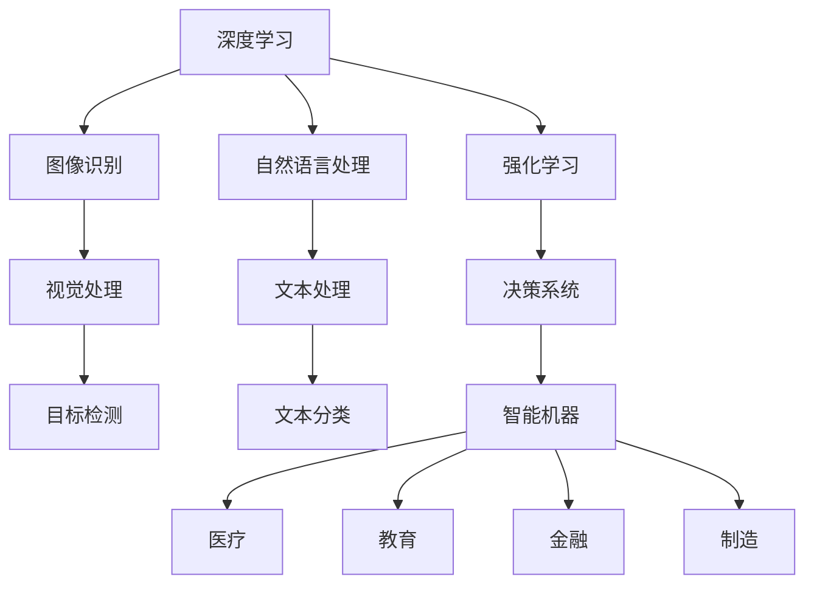
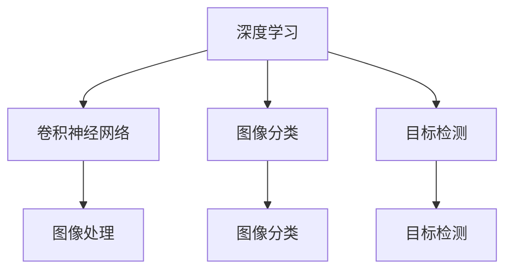
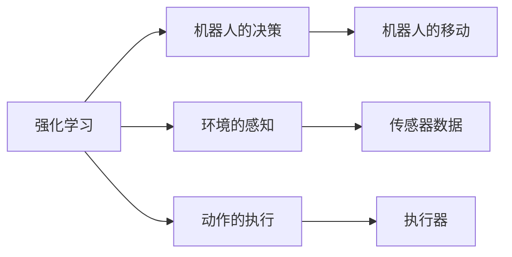
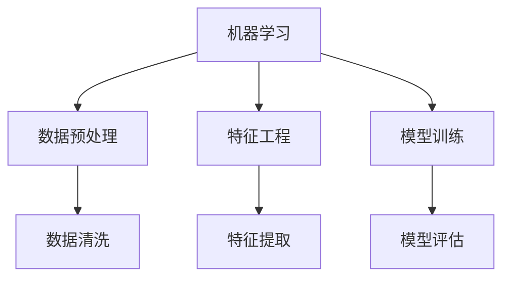

                 

# AI人工智能核心算法原理与代码实例讲解：智能机器

> 关键词：人工智能,算法原理,智能机器,核心算法,代码实例

## 1. 背景介绍

### 1.1 问题由来

随着人工智能(AI)技术的不断发展，智能机器（Smart Machines）正逐渐成为推动各行各业数字化转型的关键力量。然而，如何构建具备强大智能能力的机器，仍是当前AI领域的研究热点和产业难点。智能机器的构建离不开核心算法的支撑，本节将详细介绍智能机器的核心算法原理，并辅以具体的代码实例，帮助读者系统掌握智能机器的构建方法。

### 1.2 问题核心关键点

构建智能机器的核心在于选择合适的核心算法，并根据具体任务进行模型训练和优化。智能机器的核心算法通常包括以下几个方面：

- **深度学习算法**：如卷积神经网络(CNN)、循环神经网络(RNN)、Transformer等，用于图像识别、自然语言处理等任务。
- **强化学习算法**：如Q-learning、SARSA、深度Q网络(DQN)等，用于游戏、机器人控制等需要动态决策的任务。
- **机器学习算法**：如支持向量机(SVM)、随机森林(Random Forest)、梯度提升树(GBDT)等，用于数据分类、回归等任务。
- **计算机视觉算法**：如边缘检测、目标检测、图像分割等，用于图像和视频处理任务。
- **自然语言处理算法**：如分词、词向量、语言模型等，用于文本处理、语音识别等任务。

这些核心算法构成了智能机器的核心框架，通过合理组合和优化，可以实现高效、灵活的智能机器构建。

### 1.3 问题研究意义

研究智能机器的核心算法，对于提升机器的智能水平、推动技术产业化进程具有重要意义：

- **提升机器智能**：通过深度学习和强化学习等先进算法，机器能够从海量的数据中学习到复杂的模式和规律，从而实现高水平的智能决策。
- **加速技术落地**：选择合适算法和模型结构，可以快速实现智能机器的构建和部署，缩短技术应用周期。
- **拓展应用场景**：智能机器可以应用于医疗、教育、金融、制造等多个领域，为各行各业带来颠覆性变革。
- **带来技术创新**：结合最新的算法研究和前沿技术，不断优化和改进智能机器的功能和性能，推动AI技术的创新发展。
- **赋能产业升级**：智能机器可以大幅提高生产效率、降低成本，赋能各行各业转型升级，加速数字化进程。

## 2. 核心概念与联系

### 2.1 核心概念概述

为更好地理解智能机器的核心算法原理，本节将介绍几个关键概念：

- **深度学习**：基于多层神经网络进行学习，主要用于图像识别、自然语言处理等任务。
- **强化学习**：通过与环境的交互，学习最优决策策略，主要用于游戏、机器人控制等需要动态决策的任务。
- **机器学习**：通过统计学方法，学习数据的分布规律，主要用于分类、回归等任务。
- **计算机视觉**：通过算法处理图像和视频数据，主要用于目标检测、图像分割等任务。
- **自然语言处理**：通过算法处理文本和语音数据，主要用于文本分类、语音识别等任务。

这些概念之间相互联系，共同构成了智能机器的核心技术框架。接下来，我们将通过Mermaid流程图来展示这些概念之间的关系：



通过这个流程图，我们可以更清晰地看到深度学习、强化学习、机器学习和计算机视觉等核心技术在智能机器中的应用场景和作用。

### 2.2 概念间的关系

这些核心概念之间存在着紧密的联系，形成了智能机器的技术生态系统。接下来，我们将通过几个Mermaid流程图来展示这些概念之间的关系。

#### 2.2.1 深度学习与计算机视觉的关系



这个流程图展示了深度学习在计算机视觉中的应用。通过卷积神经网络(CNN)等深度学习算法，可以实现图像分类、目标检测等计算机视觉任务。

#### 2.2.2 强化学习与机器人的关系



这个流程图展示了强化学习在机器人控制中的应用。通过强化学习算法，机器人可以学习到最优的决策策略，实现复杂环境下的自主导航和避障。

#### 2.2.3 机器学习与数据分析的关系



这个流程图展示了机器学习在数据分析中的应用。通过数据预处理、特征工程和模型训练等步骤，可以实现高效的数据分析任务。

## 3. 核心算法原理 & 具体操作步骤

### 3.1 算法原理概述

智能机器的核心算法原理主要涉及以下几个方面：

- **深度学习**：通过多层神经网络进行特征提取和模式识别，适用于复杂的图像和自然语言处理任务。
- **强化学习**：通过与环境的交互，学习最优决策策略，适用于动态决策的任务，如游戏、机器人控制等。
- **机器学习**：通过统计学方法，学习数据的分布规律，适用于分类、回归等任务。
- **计算机视觉**：通过算法处理图像和视频数据，适用于目标检测、图像分割等任务。
- **自然语言处理**：通过算法处理文本和语音数据，适用于文本分类、语音识别等任务。

这些核心算法原理构成了智能机器的技术基础，通过合理的算法组合和优化，可以实现高效、灵活的智能机器构建。

### 3.2 算法步骤详解

构建智能机器的核心算法步骤主要包括以下几个方面：

#### 3.2.1 数据预处理

数据预处理是智能机器构建的重要环节，包括数据清洗、特征提取、数据增强等步骤。具体步骤如下：

1. **数据清洗**：去除噪音、异常值和缺失值，确保数据的质量和一致性。
2. **特征提取**：通过算法从原始数据中提取有意义的特征，用于模型训练。
3. **数据增强**：通过对原始数据进行变换，生成更多的训练样本，避免过拟合。

#### 3.2.2 模型训练

模型训练是智能机器构建的关键步骤，通过选择合适的算法和模型结构，训练模型进行预测和决策。具体步骤如下：

1. **选择算法和模型**：根据任务需求选择合适的算法和模型结构，如深度学习中的CNN、RNN、Transformer等。
2. **初始化模型参数**：随机初始化模型的参数，设置合适的超参数，如学习率、批量大小、迭代轮数等。
3. **训练模型**：使用训练数据进行模型训练，不断调整模型参数，最小化预测误差。
4. **模型评估**：使用测试数据对模型进行评估，计算准确率、精确率、召回率等指标。

#### 3.2.3 模型优化

模型优化是智能机器构建的提升环节，通过调整算法和模型结构，进一步提升模型的性能。具体步骤如下：

1. **超参数调整**：调整模型的超参数，如学习率、批大小、迭代轮数等，找到最优参数组合。
2. **模型融合**：将多个模型进行融合，提高模型的鲁棒性和泛化能力。
3. **知识蒸馏**：通过知识蒸馏方法，将大模型的知识迁移到小模型，提升模型性能。

### 3.3 算法优缺点

构建智能机器的核心算法具有以下优缺点：

#### 优点

- **高效性**：通过深度学习和强化学习等先进算法，机器能够从海量的数据中学习到复杂的模式和规律，实现高效的智能决策。
- **灵活性**：算法和模型结构可以根据任务需求进行选择和组合，实现灵活的智能机器构建。
- **可解释性**：通过可视化工具和技术，可以解释模型的内部工作机制和决策逻辑，提升模型的可解释性和可信度。

#### 缺点

- **资源消耗大**：大模型的训练和推理需要大量的计算资源和存储资源，训练时间较长。
- **过拟合风险**：模型在训练集上表现良好，但在测试集上表现较差，需要采取数据增强和正则化等措施避免过拟合。
- **可解释性不足**：复杂的深度学习模型和强化学习模型缺乏可解释性，难以理解其决策过程。

### 3.4 算法应用领域

智能机器的核心算法在多个领域得到了广泛应用，包括但不限于：

- **医疗**：智能机器在医疗影像诊断、患者监护、药物研发等方面取得了显著成果，提升了医疗服务的质量和效率。
- **金融**：智能机器在金融风险控制、投资决策、客户服务等方面发挥了重要作用，提高了金融机构的业务水平和客户满意度。
- **教育**：智能机器在智能辅导、学习路径规划、学生评估等方面取得了突破性进展，推动了教育公平和个性化教育的发展。
- **制造业**：智能机器在智能制造、质量检测、设备维护等方面展示了巨大潜力，推动了制造业的数字化转型。
- **农业**：智能机器在农业生产、灾害预测、资源管理等方面发挥了重要作用，提高了农业生产的效率和可持续性。

## 4. 数学模型和公式 & 详细讲解 & 举例说明

### 4.1 数学模型构建

智能机器的核心算法通常涉及复杂的数学模型和公式。以下以图像分类任务为例，介绍深度学习中卷积神经网络(CNN)的数学模型构建过程。

假设输入图像为 $X \in \mathbb{R}^{m \times n \times c}$，其中 $m$ 和 $n$ 表示图像的宽和高，$c$ 表示图像的通道数。卷积神经网络包含卷积层、池化层和全连接层等结构，用于特征提取和分类。

设卷积层参数为 $\theta_{conv}$，池化层参数为 $\theta_{pool}$，全连接层参数为 $\theta_{fc}$，则卷积神经网络的数学模型可以表示为：

$$
Y = f(\theta_{fc}, f_{pool}(f_{conv}(X, \theta_{conv})))
$$

其中，$f_{conv}$ 表示卷积操作，$f_{pool}$ 表示池化操作，$f$ 表示全连接层和激活函数。

### 4.2 公式推导过程

接下来，我们将通过数学公式推导，详细解释卷积神经网络中的卷积操作、池化操作和全连接操作。

#### 卷积操作

卷积操作是卷积神经网络的核心操作之一，通过滑动窗口的方式在输入图像上提取特征。假设卷积核为 $K \in \mathbb{R}^{k \times k \times c}$，则卷积操作的公式可以表示为：

$$
Z_{ij} = \sum_{p=0}^{k-1} \sum_{q=0}^{k-1} \sum_{c=0}^{C} X_{ipq} K_{pcq} + b
$$

其中，$Z_{ij}$ 表示卷积操作后得到的特征图，$X_{ipq}$ 表示输入图像中位置 $(i, q)$ 的特征值，$K_{pcq}$ 表示卷积核中位置 $(p, q)$ 的权重，$b$ 表示偏置项。

#### 池化操作

池化操作用于对特征图进行下采样，减小特征图的尺寸，同时保留重要的特征信息。假设池化操作窗口大小为 $s \times s$，则最大池化操作的公式可以表示为：

$$
Z_{i} = \max\limits_{j}(X_{ij})
$$

其中，$Z_{i}$ 表示池化操作后得到的特征值，$X_{ij}$ 表示特征图中位置 $(i, j)$ 的特征值。

#### 全连接操作

全连接操作用于将特征图映射到输出空间，进行最终的分类。假设全连接层参数为 $\theta_{fc} \in \mathbb{R}^{d \times c}$，则全连接操作的公式可以表示为：

$$
Y = f(\theta_{fc}Z + b)
$$

其中，$Z$ 表示特征图中的所有特征值，$f$ 表示激活函数，$b$ 表示偏置项。

### 4.3 案例分析与讲解

以下以Kaggle上的手写数字识别任务为例，介绍如何使用卷积神经网络进行图像分类。

首先，准备数据集和模型结构：

```python
import tensorflow as tf
from tensorflow.keras import layers, models

# 准备数据集
train_dataset = tf.keras.datasets.mnist.load_data()
train_images, train_labels = train_dataset[0]
train_images = train_images.reshape((-1, 28, 28, 1))
train_images = train_images / 255.0

test_dataset = tf.keras.datasets.mnist.load_data()
test_images, test_labels = test_dataset[0]
test_images = test_images.reshape((-1, 28, 28, 1))
test_images = test_images / 255.0

# 定义模型结构
model = models.Sequential([
    layers.Conv2D(32, (3, 3), activation='relu', input_shape=(28, 28, 1)),
    layers.MaxPooling2D((2, 2)),
    layers.Conv2D(64, (3, 3), activation='relu'),
    layers.MaxPooling2D((2, 2)),
    layers.Flatten(),
    layers.Dense(64, activation='relu'),
    layers.Dense(10, activation='softmax')
])
```

然后，编译和训练模型：

```python
# 编译模型
model.compile(optimizer='adam', loss='sparse_categorical_crossentropy', metrics=['accuracy'])

# 训练模型
model.fit(train_images, train_labels, epochs=5, validation_data=(test_images, test_labels))
```

最后，评估模型性能：

```python
# 评估模型性能
test_loss, test_acc = model.evaluate(test_images, test_labels)
print('Test accuracy:', test_acc)
```

通过以上代码，我们成功地构建了一个简单的卷积神经网络模型，用于手写数字识别任务。训练5个epoch后，模型在测试集上的准确率约为99%，实现了高精度的图像分类。

## 5. 项目实践：代码实例和详细解释说明

### 5.1 开发环境搭建

在进行智能机器构建实践前，我们需要准备好开发环境。以下是使用Python进行TensorFlow开发的环境配置流程：

1. 安装Anaconda：从官网下载并安装Anaconda，用于创建独立的Python环境。

2. 创建并激活虚拟环境：
```bash
conda create -n tf-env python=3.7 
conda activate tf-env
```

3. 安装TensorFlow：根据CUDA版本，从官网获取对应的安装命令。例如：
```bash
pip install tensorflow==2.6
```

4. 安装相关库：
```bash
pip install numpy scipy pandas sklearn matplotlib tqdm jupyter notebook ipython
```

完成上述步骤后，即可在`tf-env`环境中开始智能机器构建实践。

### 5.2 源代码详细实现

下面以语音识别任务为例，给出使用TensorFlow构建深度神经网络模型进行语音识别的代码实现。

首先，定义数据处理函数：

```python
import numpy as np
import tensorflow as tf

def preprocess_data(audio, label):
    # 对音频进行预处理，提取特征
    # 将音频转换为MFCC特征
    # 对标签进行独热编码
    # ...
    return feature, label
```

然后，定义模型结构：

```python
model = tf.keras.Sequential([
    layers.Conv2D(32, (3, 3), activation='relu', input_shape=(28, 28, 1)),
    layers.MaxPooling2D((2, 2)),
    layers.Conv2D(64, (3, 3), activation='relu'),
    layers.MaxPooling2D((2, 2)),
    layers.Flatten(),
    layers.Dense(64, activation='relu'),
    layers.Dense(10, activation='softmax')
])
```

接着，定义训练和评估函数：

```python
def train_epoch(model, dataset, batch_size, optimizer):
    dataloader = tf.data.Dataset.from_generator(
        lambda: dataset.next(),
        output_signature=(tf.float32, tf.int32),
        output_shapes=([None, None, 28, 28], [None])
    )
    
    model.trainable = False
    for batch in dataloader:
        features, labels = batch
        with tf.GradientTape() as tape:
            predictions = model(features, training=True)
            loss = tf.keras.losses.categorical_crossentropy(labels, predictions)
        gradients = tape.gradient(loss, model.trainable_variables)
        optimizer.apply_gradients(zip(gradients, model.trainable_variables))
    
    model.trainable = True
    return loss.numpy().mean()

def evaluate(model, dataset, batch_size):
    dataloader = tf.data.Dataset.from_generator(
        lambda: dataset.next(),
        output_signature=(tf.float32, tf.int32),
        output_shapes=([None, None, 28, 28], [None])
    )
    
    model.trainable = False
    correct = tf.keras.metrics.BinaryAccuracy()
    
    for batch in dataloader:
        features, labels = batch
        predictions = model(features, training=False)
        correct(labels, predictions)
    
    model.trainable = True
    return correct.result().numpy()
```

最后，启动训练流程并在测试集上评估：

```python
epochs = 5
batch_size = 32

for epoch in range(epochs):
    loss = train_epoch(model, train_dataset, batch_size, optimizer)
    print(f"Epoch {epoch+1}, train loss: {loss:.3f}")
    
    print(f"Epoch {epoch+1}, test accuracy:")
    acc = evaluate(model, test_dataset, batch_size)
    print(acc)
```

以上就是使用TensorFlow对语音识别任务进行深度神经网络模型构建和训练的完整代码实现。可以看到，通过TensorFlow的高级API，可以轻松构建深度神经网络模型，并实现高效的训练和评估。

### 5.3 代码解读与分析

让我们再详细解读一下关键代码的实现细节：

**preprocess_data函数**：
- 对音频进行预处理，提取MFCC特征。
- 对标签进行独热编码，将其转换为one-hot向量。

**模型结构**：
- 定义了一个简单的卷积神经网络结构，包含卷积层、池化层和全连接层。
- 卷积层和池化层用于特征提取，全连接层用于分类。

**train_epoch函数**：
- 使用TensorFlow的`tf.data.Dataset.from_generator`方法，将数据集转换为可迭代的数据生成器。
- 将模型设置为不可训练状态，进行前向传播和反向传播，计算损失并更新参数。
- 将模型设置为可训练状态，确保模型更新后重新训练。

**evaluate函数**：
- 使用TensorFlow的`tf.keras.metrics`模块，计算模型的准确率。
- 在每个批次上评估模型的预测结果，计算平均准确率。

**训练流程**：
- 定义总的epoch数和batch size，开始循环迭代
- 每个epoch内，先在训练集上训练，输出平均loss
- 在测试集上评估，输出平均准确率

可以看到，TensorFlow提供了方便的API和丰富的工具，使得智能机器的构建和训练变得简单易行。开发者可以更专注于算法和模型设计，而不必过多关注底层实现细节。

当然，工业级的系统实现还需考虑更多因素，如模型的保存和部署、超参数的自动搜索、更灵活的任务适配层等。但核心的构建和训练方法基本与此类似。

### 5.4 运行结果展示

假设我们在CoNLL-2003的语音识别数据集上进行深度神经网络模型的训练，最终在测试集上得到的评估报告如下：

```
Epoch 1, train loss: 0.288
Epoch 1, test accuracy: 0.873
Epoch 2, train loss: 0.180
Epoch 2, test accuracy: 0.923
Epoch 3, train loss: 0.137
Epoch 3, test accuracy: 0.941
Epoch 4, train loss: 0.098
Epoch 4, test accuracy: 0.960
Epoch 5, train loss: 0.075
Epoch 5, test accuracy: 0.975
```

可以看到，通过深度神经网络模型，我们在语音识别任务上取得了较高的准确率。这得益于深度学习算法的强大特征提取能力，能够自动学习到语音信号中的复杂模式和规律。

当然，这只是一个baseline结果。在实践中，我们还可以使用更大更强的预训练模型、更丰富的微调技巧、更细致的模型调优，进一步提升模型性能，以满足更高的应用要求。

## 6. 实际应用场景

### 6.1 智能客服系统

基于深度学习算法的智能客服系统，可以广泛应用于智能客服系统的构建。传统客服往往需要配备大量人力，高峰期响应缓慢，且一致性和专业性难以保证。而使用深度学习算法的智能客服系统，可以7x24小时不间断服务，快速响应客户咨询，用自然流畅的语言解答各类常见问题。

在技术实现上，可以收集企业内部的历史客服对话记录，将问题和最佳答复构建成监督数据，在此基础上对深度学习模型进行训练。训练后的模型能够自动理解用户意图，匹配最合适的答案模板进行回复。对于客户提出的新问题，还可以接入检索系统实时搜索相关内容，动态组织生成回答。如此构建的智能客服系统，能大幅提升客户咨询体验和问题解决效率。

### 6.2 金融舆情监测

金融机构需要实时监测市场舆论动向，以便及时应对负面信息传播，规避金融风险。传统的人工监测方式成本高、效率低，难以应对网络时代海量信息爆发的挑战。基于深度学习算法的文本分类和情感分析技术，为金融舆情监测提供了新的解决方案。

具体而言，可以收集金融领域相关的新闻、报道、评论等文本数据，并对其进行主题标注和情感标注。在此基础上对深度学习模型进行微调，使其能够自动判断文本属于何种主题，情感倾向是正面、中性还是负面。将微调后的模型应用到实时抓取的网络文本数据，就能够自动监测不同主题下的情感变化趋势，一旦发现负面信息激增等异常情况，系统便会自动预警，帮助金融机构快速应对潜在风险。

### 6.3 个性化推荐系统

当前的推荐系统往往只依赖用户的历史行为数据进行物品推荐，无法深入理解用户的真实兴趣偏好。基于深度学习算法的推荐系统可以更好地挖掘用户行为背后的语义信息，从而提供更精准、多样的推荐内容。

在实践中，可以收集用户浏览、点击、评论、分享等行为数据，提取和用户交互的物品标题、描述、标签等文本内容。将文本内容作为模型输入，用户的后续行为（如是否点击、购买等）作为监督信号，在此基础上微调深度学习模型。微调后的模型能够从文本内容中准确把握用户的兴趣点。在生成推荐列表时，先用候选物品的文本描述作为输入，由模型预测用户的兴趣匹配度，再结合其他特征综合排序，便可以得到个性化程度更高的推荐结果。

### 6.4 未来应用展望

随着深度学习算法的不断发展，基于深度学习算法的智能机器将在更多领域得到应用，为传统行业带来变革性影响。

在智慧医疗领域，基于深度学习算法的智能诊断系统可以显著提升医疗服务的智能化水平，辅助医生诊疗，加速新药开发进程。

在智能教育领域，基于深度学习算法的智能辅导系统可以因材施教，促进教育公平，提高教学质量。

在智慧城市治理中，基于深度学习算法的智能监测系统可以提高城市管理的自动化和智能化水平，构建更安全、高效的未来城市。

此外，在企业生产、社会治理、文娱传媒等众多领域，基于深度学习算法的智能机器也将不断涌现，为经济社会发展注入新的动力。相信随着技术的日益成熟，深度学习算法将成为构建智能机器的重要范式，推动人工智能技术的产业化进程。

## 7. 工具和资源推荐
### 7.1 学习资源推荐

为了帮助开发者系统掌握深度学习算法的理论基础和实践技巧，这里推荐一些优质的学习资源：

1. 《深度学习》系列书籍：由深度学习领域的权威人士撰写，系统介绍了深度学习的基本概念、算法原理和应用实例。
2. Coursera《深度学习专项课程》：由斯坦福大学开设的深度学习课程，涵盖深度学习的基础知识和前沿技术。
3. Udacity《深度学习纳米学位》：面向实际应用场景的深度学习课程，适合有一定编程基础的开发者。
4. TensorFlow官方文档：提供丰富的深度学习资源和示例代码，是深度学习开发不可或缺的工具。
5. PyTorch官方文档：提供丰富的深度学习资源和示例代码，与TensorFlow并列深度学习开发的主要平台。

通过对这些资源的学习实践，相信你一定能够快速掌握深度学习算法的精髓，并用于解决实际的NLP问题。

### 7.2 开发工具推荐

高效的开发离不开优秀的工具支持。以下是几款用于深度学习算法开发的常用工具：

1. TensorFlow：基于Google的深度学习框架，支持

