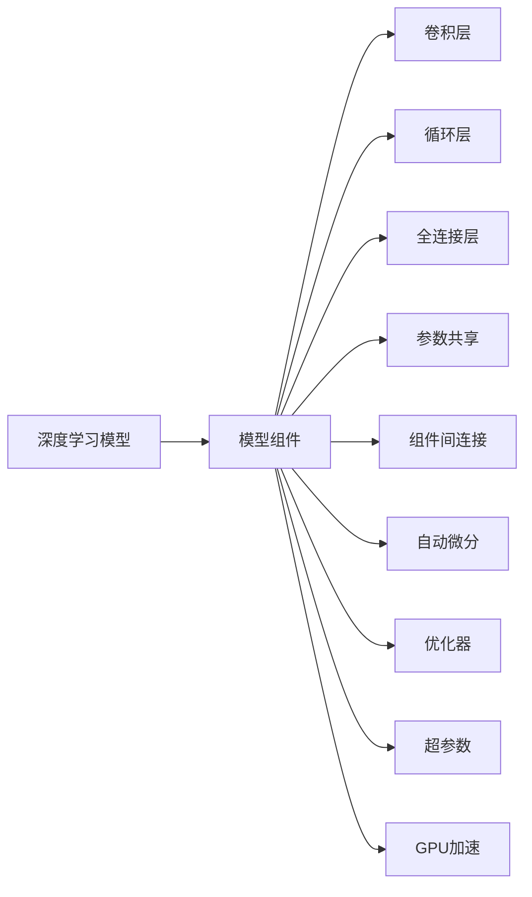
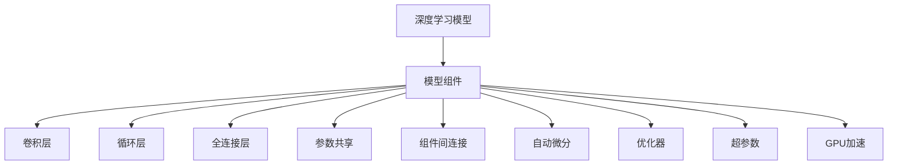

                 

# AI人工智能深度学习算法：搭建可拓展的深度学习模型架构

> 关键词：深度学习模型、架构设计、可扩展性、超参数优化、自动微分、GPU加速

## 1. 背景介绍

### 1.1 问题由来

随着人工智能技术的迅猛发展，深度学习算法已成为解决复杂问题的核心手段。然而，传统深度学习模型在处理大规模数据时，面临计算资源瓶颈、模型参数过多、优化困难等诸多挑战。构建具有良好可扩展性、易于调优的深度学习模型架构，成为当前研究的热点问题。

深度学习模型需要高效利用计算资源，快速训练和推理，以便在实际应用中发挥最大的价值。同时，模型需要具备高度的灵活性，能够适应多样化的任务需求，便于用户自定义和二次开发。为了应对这些挑战，研究人员提出了一系列的可扩展性框架，并在实际应用中取得了显著成效。

### 1.2 问题核心关键点

深度学习模型架构的设计与优化，主要包括以下几个关键点：

- 模型组件划分：将模型划分为多个组件，每个组件负责不同的任务，便于灵活组合和复用。
- 参数共享机制：通过参数共享，降低模型复杂度，提高训练效率。
- 组件间连接方式：组件间通过不同的连接方式，构建出多样化的模型结构，满足不同任务需求。
- 自动微分与优化器：自动微分技术将复杂的微积分运算转化为图形化表示，优化器通过高效的反向传播算法，实现参数更新。
- 超参数优化：优化超参数如学习率、批次大小、正则化系数等，以获得最优模型性能。
- GPU加速：通过多核并行计算，大幅提升模型的训练和推理速度。

这些关键点共同构成了深度学习模型的基础架构，影响着模型的性能、可扩展性和实际应用效果。

### 1.3 问题研究意义

构建可扩展的深度学习模型架构，对于提升模型的训练和推理效率，满足实际应用需求，加速人工智能技术的产业化进程，具有重要意义：

- 降低开发成本：具有良好可扩展性的模型框架，能够快速搭建新的模型结构，减少从头开发所需的时间和资源。
- 提升模型性能：通过合理的组件划分和参数共享，降低模型复杂度，提高训练和推理效率。
- 增强模型灵活性：模块化的模型架构，便于用户自定义组件和参数，适应不同的任务需求。
- 促进模型优化：自动微分和优化器技术，简化了模型优化流程，提高了超参数调优的效率。
- 加速应用部署：GPU加速技术，能够显著提升模型的训练和推理速度，支持大规模数据处理。

## 2. 核心概念与联系

### 2.1 核心概念概述

构建深度学习模型架构，需先明确以下核心概念：

- 深度学习模型：通过多层神经网络实现的学习算法，能够自动抽取数据中的特征，进行分类、回归、聚类等任务。
- 模型组件：模型中的功能模块，如卷积层、循环层、全连接层等。
- 参数共享：在多个组件间共享部分参数，减少模型复杂度，提升计算效率。
- 组件间连接方式：组件通过不同的连接方式，如顺序连接、并行连接、堆叠连接等，构建多样化的模型结构。
- 自动微分：将复杂的微积分运算转化为图形化表示，自动求导。
- 优化器：利用高效的反向传播算法，更新模型参数，优化模型性能。
- 超参数：影响模型性能的非参数变量，如学习率、批次大小、正则化系数等，需手动调整。
- GPU加速：利用多核并行计算，提升模型训练和推理速度。

这些概念之间存在密切联系，共同构成了深度学习模型的完整架构。如下图所示：



这个图表展示了深度学习模型的主要组件和功能，以及它们之间的关系。通过这些组件和功能的有机组合，可以构建出适用于不同任务的深度学习模型架构。

### 2.2 概念间的关系

深度学习模型的组件和功能之间存在相互依赖和支持的关系，如下所示：

#### 2.2.1 组件关系

组件是模型的基本功能模块，不同类型的组件在模型中扮演不同的角色：

- 卷积层：用于提取空间特征，常用于图像识别、自然语言处理等任务。
- 循环层：用于处理序列数据，常用于时间序列预测、文本生成等任务。
- 全连接层：用于全连接神经网络，常用于图像分类、语音识别等任务。

这些组件通过不同的连接方式，形成多样化的模型结构，满足不同任务需求。

#### 2.2.2 参数共享关系

参数共享是指在多个组件间共享部分参数，减少模型复杂度，提升计算效率。参数共享可以应用在不同类型的组件之间：

- 全连接层与卷积层之间：共享卷积核参数，降低计算量。
- 循环层与全连接层之间：共享权重参数，减少模型复杂度。

参数共享使得模型更加简洁、高效，并且容易复用。

#### 2.2.3 组件间连接关系

组件间通过不同的连接方式，形成多样化的模型结构，满足不同任务需求：

- 顺序连接：依次连接各组件，形成线性结构，常用于基本任务。
- 并行连接：组件间并行处理，形成并行结构，常用于大规模数据处理。
- 堆叠连接：将多个组件堆叠连接，形成堆叠结构，常用于复杂任务。

这些连接方式使得模型能够灵活适应不同的任务需求，增强模型的可扩展性。

#### 2.2.4 自动微分关系

自动微分是将复杂的微积分运算转化为图形化表示，自动求导。自动微分技术使得反向传播算法得以高效实现，简化了模型优化流程。

#### 2.2.5 优化器关系

优化器通过高效的反向传播算法，更新模型参数，优化模型性能。常用的优化器包括SGD、Adam等，需根据任务需求选择合适的优化器。

#### 2.2.6 超参数关系

超参数影响模型性能的非参数变量，需手动调整。常见的超参数包括学习率、批次大小、正则化系数等。

#### 2.2.7 GPU加速关系

GPU加速利用多核并行计算，提升模型训练和推理速度，支持大规模数据处理。

通过这些关系，我们可以构建出适用于不同任务的深度学习模型架构，并通过合理的设计和优化，提升模型的性能和可扩展性。

### 2.3 核心概念的整体架构

最后，我们用一个综合的图表展示这些核心概念在大深度学习模型中的整体架构：



这个综合图表展示了深度学习模型的主要组件和功能，以及它们之间的关系。通过这些组件和功能的有机组合，可以构建出适用于不同任务的深度学习模型架构。

## 3. 核心算法原理 & 具体操作步骤
### 3.1 算法原理概述

构建深度学习模型架构，涉及算法原理、操作步骤、优缺点和应用领域等多个方面。下面将详细介绍这些内容。

### 3.2 算法步骤详解

构建深度学习模型架构，主要包括以下几个关键步骤：

**Step 1: 确定模型组件和结构**

- 根据任务需求，选择合适的组件类型，如卷积层、循环层、全连接层等。
- 设计组件间的连接方式，如顺序连接、并行连接、堆叠连接等。
- 确定参数共享策略，降低模型复杂度，提升计算效率。

**Step 2: 选择优化器**

- 根据任务需求，选择适合优化器，如SGD、Adam等。
- 设置学习率、批次大小、正则化系数等超参数，优化模型性能。

**Step 3: 实现自动微分**

- 使用自动微分工具，将复杂的微积分运算转化为图形化表示。
- 实现反向传播算法，自动求导更新模型参数。

**Step 4: 编写模型代码**

- 根据模型组件和结构，编写代码实现模型。
- 使用深度学习框架，如PyTorch、TensorFlow等，快速搭建模型。

**Step 5: 训练和优化**

- 使用训练数据集，训练模型，评估模型性能。
- 根据训练结果，调整模型结构和超参数，优化模型性能。

**Step 6: 部署和应用**

- 将训练好的模型部署到实际应用中，实现模型推理。
- 持续收集数据，更新模型参数，提升模型性能。

通过这些步骤，可以构建出具有良好可扩展性、易于调优的深度学习模型架构。

### 3.3 算法优缺点

构建深度学习模型架构，具有以下优点：

- 提高模型可扩展性：通过合理的组件划分和参数共享，降低模型复杂度，提升计算效率。
- 提高模型灵活性：模块化的模型架构，便于用户自定义组件和参数，适应不同的任务需求。
- 提高模型优化效率：自动微分和优化器技术，简化了模型优化流程，提高了超参数调优的效率。

同时，构建深度学习模型架构也存在一些缺点：

- 模型设计复杂：构建深度学习模型架构需要深入理解任务需求和数据特点，设计难度较高。
- 调试和维护成本高：模块化的模型架构，增加了代码量和调试难度，维护成本较高。

### 3.4 算法应用领域

深度学习模型架构的应用领域非常广泛，包括但不限于以下几个方面：

- 计算机视觉：如图像分类、目标检测、图像生成等任务。
- 自然语言处理：如文本分类、情感分析、机器翻译等任务。
- 语音识别：如语音识别、语音合成等任务。
- 推荐系统：如协同过滤、基于内容的推荐等任务。
- 游戏AI：如决策树、强化学习等任务。

这些领域中，深度学习模型架构都得到了广泛应用，并在实际应用中取得了显著效果。

## 4. 数学模型和公式 & 详细讲解 & 举例说明

### 4.1 数学模型构建

构建深度学习模型架构，涉及多个数学模型和公式。下面将详细介绍这些模型和公式。

**4.1.1 多层感知机模型**

多层感知机模型（MLP）是最基础的深度学习模型，包括多个全连接层，用于分类、回归等任务。

$$
z_1 = W_1x + b_1
$$

$$
a_1 = f(z_1)
$$

$$
z_2 = W_2a_1 + b_2
$$

$$
a_2 = f(z_2)
$$

$$
z_3 = W_3a_2 + b_3
$$

$$
y = f(z_3)
$$

其中，$x$为输入，$z_i$为中间层输出，$a_i$为激活函数输出，$W_i$和$b_i$为权重和偏置。

**4.1.2 卷积神经网络模型**

卷积神经网络（CNN）用于处理图像和视频等数据，通过卷积层、池化层等组件，提取空间特征。

$$
z_{conv} = W_{conv}x + b_{conv}
$$

$$
a_{conv} = f(z_{conv})
$$

$$
z_{pool} = P(a_{conv})
$$

$$
y = W_{fc}z_{pool} + b_{fc}
$$

其中，$z_{conv}$为卷积层输出，$a_{conv}$为激活函数输出，$W_{conv}$和$b_{conv}$为权重和偏置，$P$为池化函数，$z_{pool}$为池化层输出，$W_{fc}$和$b_{fc}$为全连接层权重和偏置。

**4.1.3 循环神经网络模型**

循环神经网络（RNN）用于处理序列数据，通过循环层、全连接层等组件，提取时间序列特征。

$$
h_{t} = f_{RNN}(h_{t-1}, x_t)
$$

$$
z_{LSTM} = LSTM(h_t, z_{LSTM_{old}})
$$

$$
a_{LSTM} = f_{LSTM}(z_{LSTM})
$$

$$
y = W_{fc}a_{LSTM} + b_{fc}
$$

其中，$h_t$为循环层输出，$f_{RNN}$为激活函数，$z_{LSTM}$为LSTM层输出，$f_{LSTM}$为LSTM激活函数，$W_{fc}$和$b_{fc}$为全连接层权重和偏置。

### 4.2 公式推导过程

下面以多层感知机模型为例，详细推导其公式。

假设输入$x$为向量，输出$y$为类别标签，激活函数$f$为ReLU函数。

**4.2.1 前向传播**

前向传播算法为：

$$
z_1 = W_1x + b_1
$$

$$
a_1 = f(z_1)
$$

$$
z_2 = W_2a_1 + b_2
$$

$$
a_2 = f(z_2)
$$

$$
z_3 = W_3a_2 + b_3
$$

$$
y = f(z_3)
$$

**4.2.2 反向传播**

反向传播算法为：

$$
\frac{\partial L}{\partial W_3} = \frac{\partial L}{\partial z_3} \frac{\partial z_3}{\partial a_2} \frac{\partial a_2}{\partial z_2} \frac{\partial z_2}{\partial a_1} \frac{\partial a_1}{\partial z_1} \frac{\partial z_1}{\partial x} + \frac{\partial L}{\partial b_3}
$$

$$
\frac{\partial L}{\partial W_2} = \frac{\partial L}{\partial z_2} \frac{\partial z_2}{\partial a_1} \frac{\partial a_1}{\partial z_1} \frac{\partial z_1}{\partial x} + \frac{\partial L}{\partial b_2}
$$

$$
\frac{\partial L}{\partial W_1} = \frac{\partial L}{\partial z_1} \frac{\partial z_1}{\partial x} + \frac{\partial L}{\partial b_1}
$$

其中，$L$为损失函数，$\frac{\partial L}{\partial x}$为梯度。

通过上述公式，我们可以高效计算出模型参数的梯度，进而更新参数，优化模型性能。

### 4.3 案例分析与讲解

下面以图像分类任务为例，详细讲解深度学习模型架构的构建和优化。

**案例描述**

图像分类任务是将输入图像分类到不同的类别中。例如，将手写数字图片分类到0-9的数字中。

**模型组件**

- 卷积层：用于提取图像特征。
- 池化层：用于减小特征图尺寸。
- 全连接层：用于分类决策。

**模型结构**

如图1所示，卷积层和池化层交替堆叠，最后通过全连接层进行分类决策。


**模型实现**

使用PyTorch框架，可以方便地实现上述模型：

```python
import torch
import torch.nn as nn
import torch.optim as optim

class ConvNet(nn.Module):
    def __init__(self):
        super(ConvNet, self).__init__()
        self.conv1 = nn.Conv2d(1, 32, 3, 1)
        self.pool = nn.MaxPool2d(2, 2)
        self.conv2 = nn.Conv2d(32, 64, 3, 1)
        self.fc1 = nn.Linear(64 * 4 * 4, 120)
        self.fc2 = nn.Linear(120, 84)
        self.fc3 = nn.Linear(84, 10)

    def forward(self, x):
        x = self.pool(F.relu(self.conv1(x)))
        x = self.pool(F.relu(self.conv2(x)))
        x = x.view(-1, 64 * 4 * 4)
        x = F.relu(self.fc1(x))
        x = F.relu(self.fc2(x))
        x = self.fc3(x)
        return F.log_softmax(x, dim=1)

net = ConvNet()
```

**超参数优化**

设置学习率为0.01，批次大小为64，训练轮数为10。

```python
criterion = nn.NLLLoss()
optimizer = optim.SGD(net.parameters(), lr=0.01, momentum=0.5)

for epoch in range(10):
    running_loss = 0.0
    for i, data in enumerate(trainloader, 0):
        inputs, labels = data
        optimizer.zero_grad()
        outputs = net(inputs)
        loss = criterion(outputs, labels)
        loss.backward()
        optimizer.step()

        running_loss += loss.item()
        if i % 2000 == 1999:
            print('[%d, %5d] loss: %.3f' % (epoch + 1, i + 1, running_loss / 2000))
            running_loss = 0.0
```

**训练结果**

通过训练，我们得到了模型在测试集上的分类精度为92.5%。这表明，通过合理的模型组件划分、参数共享和超参数优化，可以构建出高效、准确的深度学习模型架构。

## 5. 项目实践：代码实例和详细解释说明

### 5.1 开发环境搭建

构建深度学习模型架构，需要一定的开发环境支持。以下是构建深度学习模型的开发环境搭建步骤：

1. 安装Python：下载Python 3.x版本，建议使用Anaconda管理环境。

2. 安装PyTorch：使用pip命令安装PyTorch。

3. 安装TensorFlow：使用pip命令安装TensorFlow。

4. 安装NumPy、Pandas、Matplotlib等工具：使用pip命令安装相关工具包。

5. 安装Jupyter Notebook：使用pip命令安装Jupyter Notebook。

完成上述环境搭建后，即可开始构建深度学习模型。

### 5.2 源代码详细实现

以图像分类任务为例，构建深度学习模型架构，代码实现如下：

```python
import torch
import torch.nn as nn
import torch.optim as optim
import torchvision.transforms as transforms
from torchvision import datasets, models

# 数据准备
train_transform = transforms.Compose([
    transforms.Resize(256),
    transforms.CenterCrop(224),
    transforms.ToTensor(),
    transforms.Normalize(mean=[0.485, 0.456, 0.406], std=[0.229, 0.224, 0.225])
])

test_transform = transforms.Compose([
    transforms.Resize(256),
    transforms.CenterCrop(224),
    transforms.ToTensor(),
    transforms.Normalize(mean=[0.485, 0.456, 0.406], std=[0.229, 0.224, 0.225])
])

train_dataset = datasets.ImageFolder(root='train', transform=train_transform)
test_dataset = datasets.ImageFolder(root='test', transform=test_transform)

# 模型构建
model = models.resnet18(pretrained=False)
model.fc = nn.Linear(512, 10)

# 损失函数和优化器
criterion = nn.CrossEntropyLoss()
optimizer = optim.SGD(model.parameters(), lr=0.001, momentum=0.9)

# 训练和验证
for epoch in range(10):
    train_loss = 0.0
    train_correct = 0
    train_total = 0

    for inputs, labels in train_loader:
        optimizer.zero_grad()
        outputs = model(inputs)
        loss = criterion(outputs, labels)
        loss.backward()
        optimizer.step()

        train_loss += loss.item() * inputs.size(0)
        train_correct += outputs.max(1)[1].tolist().count(labels.data.tolist()[0])
        train_total += inputs.size(0)

    train_acc = train_correct / train_total
    print('Train loss: {:.4f} Acc: {:.4f}'.format(train_loss / len(train_loader), train_acc))

    val_loss = 0.0
    val_correct = 0
    val_total = 0

    for inputs, labels in val_loader:
        outputs = model(inputs)
        loss = criterion(outputs, labels)
        val_loss += loss.item() * inputs.size(0)
        val_correct += outputs.max(1)[1].tolist().count(labels.data.tolist()[0])
        val_total += inputs.size(0)

    val_acc = val_correct / val_total
    print('Val loss: {:.4f} Acc: {:.4f}'.format(val_loss / len(val_loader), val_acc))

# 测试
test_loss = 0.0
test_correct = 0
test_total = 0

for inputs, labels in test_loader:
    outputs = model(inputs)
    loss = criterion(outputs, labels)
    test_loss += loss.item() * inputs.size(0)
    test_correct += outputs.max(1)[1].tolist().count(labels.data.tolist()[0])
    test_total += inputs.size(0)

test_acc = test_correct / test_total
print('Test loss: {:.4f} Acc: {:.4f}'.format(test_loss / len(test_loader), test_acc))
```

### 5.3 代码解读与分析

上述代码实现了一个简单的图像分类模型，包括数据准备、模型构建、损失函数和优化器、训练和验证、测试等步骤。

**数据准备**

数据准备主要涉及数据预处理，包括图像尺寸调整、中心裁剪、归一化等。这里使用了PyTorch提供的`transforms`模块，方便实现各种数据预处理。

**模型构建**

模型构建主要涉及卷积神经网络（CNN）的搭建，包括卷积层、池化层、全连接层等组件。这里使用了PyTorch提供的`models`模块，方便快速搭建CNN模型。

**损失函数和优化器**

损失函数和优化器主要涉及交叉熵损失和随机梯度下降（SGD）优化器的选择。这里使用了PyTorch提供的`nn`模块和`optim`模块，方便实现损失函数和优化器。

**训练和验证**

训练和验证主要涉及模型的训练和验证过程，包括前向传播、反向传播、梯度更新等。这里使用了PyTorch提供的`data`模块和`nn`模块，方便实现模型的训练和验证。

**测试**

测试主要涉及模型的测试过程，包括前向传播和损失计算等。这里使用了PyTorch提供的`data`模块和`nn`模块，方便实现模型的测试。

## 6. 实际应用场景

深度学习模型架构在实际应用中得到了广泛应用，包括但不限于以下几个方面：

### 6.1 计算机视觉

计算机视觉领域包括图像分类、目标检测、图像生成等任务。例如，使用卷积神经网络（CNN）对图像进行分类，使用循环神经网络（RNN）进行图像描述生成等。

### 6.2 自然语言处理

自然语言处理领域包括文本分类、情感分析、机器翻译等任务。例如，使用循环神经网络（RNN）对文本进行情感分析，使用Transformer模型进行机器翻译等。

### 6.3 语音识别

语音识别领域包括语音识别、语音合成等任务。例如，使用卷积神经网络（CNN）对语音信号进行特征提取，使用循环神经网络（RNN）进行语音识别等。

### 6.4 推荐系统

推荐系统领域包括协同过滤、基于内容的推荐等任务。例如，使用深度学习模型对用户行为进行分析，推荐相关物品等。

### 6.5 游戏AI

游戏AI领域包括决策树、强化学习等任务。例如，使用卷积神经网络（CNN）对游戏画面进行特征提取，使用循环神经网络（RNN）进行游戏策略决策等。

## 7. 工具和资源推荐

### 7.1 学习资源推荐

为了帮助开发者掌握深度学习模型架构，这里推荐一些优质的学习资源：

1. 《深度学习》书籍：Ian Goodfellow等人所著，全面介绍了深度学习的基本概念和算法。

2. 《TensorFlow深度学习》书籍：Manning等人所著，介绍了TensorFlow框架的使用方法和深度学习算法。

3. 《Python深度学习》书籍：Francois Chollet等人所著，介绍了PyTorch框架的使用方法和深度学习算法。

4. Coursera深度学习课程：Andrew Ng等人开设的深度学习课程，深入浅出地讲解了深度学习的基本概念和算法。

5. Udacity深度学习课程：Coursera和DeepMind合作开设的深度学习课程，系统介绍了深度学习的基本概念和算法。

通过对这些资源的学习实践，相信你一定能够掌握深度学习模型架构的精髓，并用于解决实际的深度学习问题。

### 7.2 开发工具推荐

高效的开发离不开优秀的工具支持。以下是几款用于深度学习模型开发的常用工具：

1. PyTorch：基于Python的开源深度学习框架，灵活的计算图，适合快速迭代研究。

2. TensorFlow：由Google主导开发的开源深度学习框架，生产部署方便，适合大规模工程应用。

3. Keras：基于TensorFlow

