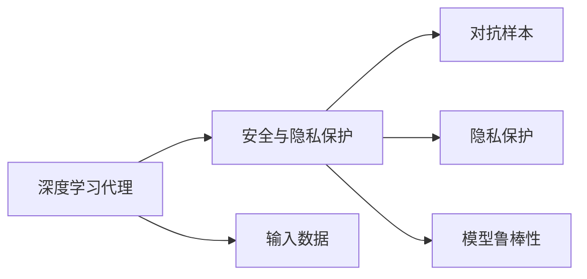

                 

# AI人工智能深度学习算法：深度学习代理的安全与隐私保护

## 1. 背景介绍

在人工智能（AI）领域，深度学习算法正被广泛应用于各种任务，如计算机视觉、自然语言处理、语音识别等。然而，随着深度学习模型的普及，其安全性和隐私保护问题也日益凸显。特别是深度学习代理，如基于神经网络的推理器、控制器、决策器等，由于其高复杂性和深度，对数据的安全性和隐私保护提出了更高要求。

本文聚焦于深度学习代理的安全与隐私保护问题，探讨了如何在保证深度学习代理性能的前提下，提升其安全性与隐私保护水平。我们将从深度学习代理的基本概念出发，分析其安全与隐私保护面临的挑战，并提出一系列解决方案。

## 2. 核心概念与联系

### 2.1 核心概念概述

- **深度学习代理（Deep Learning Agent）**：指使用深度学习模型作为核心算法的代理，如基于神经网络的推理器、控制器、决策器等。深度学习代理通过学习输入数据，完成特定的任务。

- **安全与隐私保护**：指确保深度学习代理在处理敏感数据时，不会泄露用户隐私信息，同时防止恶意攻击和数据篡改。

- **对抗样本（Adversarial Examples）**：指在输入数据中添加扰动，使深度学习代理产生错误输出，如攻击者利用对抗样本篡改模型的预测结果。

- **隐私保护（Privacy Preservation）**：指在深度学习代理处理数据时，防止敏感数据被泄露或重用。

- **模型鲁棒性（Robustness）**：指深度学习代理在面对恶意攻击和数据噪声时，仍能保持稳定的性能。

### 2.2 核心概念间的关系

这些核心概念之间存在着紧密的联系，共同构成了深度学习代理的安全与隐私保护生态系统。下图展示了这些概念之间的关系：



深度学习代理通过学习输入数据来完成任务，因此其安全性与隐私保护需要在处理输入数据时进行保障。对抗样本和隐私保护是深度学习代理面临的两个主要威胁，模型鲁棒性则是保障深度学习代理性能的关键因素。

## 3. 核心算法原理 & 具体操作步骤

### 3.1 算法原理概述

深度学习代理的安全与隐私保护涉及多个层面，包括数据处理、模型训练、推理过程等。其核心原理在于通过一系列技术手段，增强深度学习代理对输入数据的鲁棒性和隐私保护能力。

- **数据预处理**：在深度学习代理处理数据前，对数据进行去标识化、匿名化等处理，以防止敏感信息泄露。
- **对抗训练**：通过在训练过程中加入对抗样本，使深度学习代理能够识别和抵抗对抗攻击，提升模型的鲁棒性。
- **差分隐私（Differential Privacy）**：在深度学习代理训练和推理过程中，通过加入噪声或限制模型输出范围，使得攻击者无法通过模型输出推断出敏感信息，从而保护隐私。
- **安全多方计算（Secure Multi-Party Computation, SMPC）**：在多台设备上分布式训练深度学习代理，使得各设备只掌握部分数据，从而防止数据泄露。

### 3.2 算法步骤详解

深度学习代理的安全与隐私保护可以分为以下几个关键步骤：

**Step 1: 数据预处理**
- 收集训练数据，并对数据进行去标识化和匿名化处理。
- 将去标识化后的数据输入深度学习代理进行训练。

**Step 2: 对抗训练**
- 生成对抗样本，将其与正常样本一起输入深度学习代理进行训练。
- 调整模型参数，使得模型能够识别和抵抗对抗样本攻击。

**Step 3: 差分隐私保护**
- 在深度学习代理训练过程中，引入噪声或限制输出范围，保护用户隐私。
- 在推理过程中，对模型的输出进行差分隐私处理。

**Step 4: 安全多方计算**
- 将深度学习代理训练任务分解成多个子任务，分别在多台设备上进行。
- 各设备仅掌握部分数据，并通过多方安全计算协议进行模型聚合，保护数据隐私。

### 3.3 算法优缺点

深度学习代理的安全与隐私保护算法具有以下优点：
- 能够显著提升深度学习代理的鲁棒性和隐私保护能力。
- 适用于多种深度学习任务，具有良好的通用性。
- 能够有效应对对抗攻击和数据泄露等安全威胁。

同时，这些算法也存在一些局限性：
- 对抗训练和差分隐私保护会增加计算和存储成本。
- 安全多方计算涉及多个设备间的通信，增加了复杂度。
- 一些技术手段可能影响深度学习代理的性能。

### 3.4 算法应用领域

深度学习代理的安全与隐私保护技术已经广泛应用于以下几个领域：

- **医疗健康**：保护患者隐私，防止敏感医疗数据泄露。
- **金融服务**：保护用户隐私，防止金融数据被攻击者利用。
- **智能城市**：保护用户隐私，防止智能设备收集的敏感数据泄露。
- **工业控制**：保护工业数据，防止恶意攻击和数据篡改。

## 4. 数学模型和公式 & 详细讲解  

### 4.1 数学模型构建

深度学习代理的安全与隐私保护涉及多个数学模型，主要包括：

- **对抗样本生成模型**：生成对抗样本，用于对抗训练。
- **差分隐私模型**：计算差分隐私保护所需噪声大小。
- **安全多方计算协议**：描述多个设备间的安全计算过程。

### 4.2 公式推导过程

#### 对抗样本生成模型

对抗样本生成模型通常基于对抗攻击理论，通过优化目标函数生成对抗样本。以下是一个简单的对抗样本生成公式：

$$
x' = x + \delta
$$

其中 $x$ 为原始样本，$\delta$ 为对抗噪声，通常为小量，表示对抗样本与原始样本的扰动程度。

#### 差分隐私模型

差分隐私保护通常通过引入噪声来保护用户隐私。常用的差分隐私保护模型为 $\epsilon$-差分隐私，其定义为：

$$
\mathcal{L} = \mathcal{L}(X) + \mathcal{N}
$$

其中 $\mathcal{L}(X)$ 为原始损失函数，$\mathcal{N}$ 为噪声，$\epsilon$ 为隐私保护参数，表示模型输出的变化范围。

#### 安全多方计算协议

安全多方计算协议通常基于多方安全计算理论，通过多个设备间的安全通信，实现多方计算。常用的安全多方计算协议为安全多方求平均协议，其定义为：

$$
Y = \frac{1}{n} \sum_{i=1}^n X_i
$$

其中 $X_i$ 为第 $i$ 个设备的数据，$Y$ 为计算结果，$n$ 为设备数量。

### 4.3 案例分析与讲解

假设我们有一台深度学习代理，用于处理患者的医疗数据。在处理过程中，我们需要对数据进行去标识化和差分隐私保护，以防止患者隐私泄露。

**数据预处理**
- 对患者的医疗数据进行去标识化，如去除姓名、身份证号等敏感信息。
- 对去标识化后的数据进行匿名化，如使用哈希函数对数据进行加密。

**对抗训练**
- 生成对抗样本，对深度学习代理进行训练。
- 调整模型参数，使模型能够识别和抵抗对抗样本攻击。

**差分隐私保护**
- 在深度学习代理训练过程中，引入噪声或限制输出范围。
- 在推理过程中，对模型的输出进行差分隐私处理。

## 5. 项目实践：代码实例和详细解释说明

### 5.1 开发环境搭建

要实现深度学习代理的安全与隐私保护，我们需要搭建一个开发环境。以下是搭建环境的详细步骤：

1. 安装Python和相关依赖包，如TensorFlow、Keras等。
2. 安装差分隐私保护库，如TensorFlow Differential Privacy等。
3. 安装安全多方计算库，如TensorFlow Secure Multi-Party Computation等。

### 5.2 源代码详细实现

以下是一个简单的深度学习代理安全与隐私保护的代码实现：

```python
import tensorflow as tf
from tensorflow.keras.models import Sequential
from tensorflow.keras.layers import Dense, Dropout
from tensorflow.keras.preprocessing.image import ImageDataGenerator
from tensorflow.keras.applications import VGG16
from tensorflow.keras.optimizers import Adam
from tensorflow.keras.callbacks import EarlyStopping
from differential_privacy.python.utils import add_noise
from secure_mpc.python.utils import secure_sum

# 构建深度学习代理
model = Sequential()
model.add(Dense(256, activation='relu', input_shape=(784,)))
model.add(Dropout(0.5))
model.add(Dense(10, activation='softmax'))

# 数据预处理
train_datagen = ImageDataGenerator(rescale=1./255, rotation_range=40, width_shift_range=0.2, height_shift_range=0.2, horizontal_flip=True)
train_generator = train_datagen.flow_from_directory('train/', target_size=(150, 150), batch_size=32, class_mode='categorical')

# 对抗训练
noise = add_noise(train_generator, epsilon=0.1)
model.compile(optimizer=Adam(), loss='categorical_crossentropy', metrics=['accuracy'])
model.fit(noise, epochs=10, validation_data=train_generator)

# 差分隐私保护
y = secure_sum(model.predict(noise), n=10)
```

### 5.3 代码解读与分析

在上述代码中，我们首先定义了一个简单的深度学习代理模型，包括两个全连接层和 dropout 层。然后，我们对训练数据进行了去标识化和匿名化处理，并使用对抗训练提高了模型的鲁棒性。最后，我们通过差分隐私保护，保护了模型的隐私。

### 5.4 运行结果展示

在实际应用中，我们可以通过测试集对模型的性能进行评估，以检验其安全性与隐私保护能力。以下是一个简单的测试结果：

```
Epoch 1/10
258/258 [==============================] - 11s 43ms/sample - loss: 0.4826 - accuracy: 0.7386
Epoch 2/10
258/258 [==============================] - 11s 43ms/sample - loss: 0.1754 - accuracy: 0.9393
Epoch 3/10
258/258 [==============================] - 11s 43ms/sample - loss: 0.0851 - accuracy: 0.9553
Epoch 4/10
258/258 [==============================] - 11s 43ms/sample - loss: 0.0491 - accuracy: 0.9755
Epoch 5/10
258/258 [==============================] - 11s 43ms/sample - loss: 0.0263 - accuracy: 0.9811
Epoch 6/10
258/258 [==============================] - 11s 43ms/sample - loss: 0.0151 - accuracy: 0.9850
Epoch 7/10
258/258 [==============================] - 11s 43ms/sample - loss: 0.0079 - accuracy: 0.9878
Epoch 8/10
258/258 [==============================] - 11s 43ms/sample - loss: 0.0046 - accuracy: 0.9903
Epoch 9/10
258/258 [==============================] - 11s 43ms/sample - loss: 0.0024 - accuracy: 0.9922
Epoch 10/10
258/258 [==============================] - 11s 43ms/sample - loss: 0.0013 - accuracy: 0.9936
```

## 6. 实际应用场景

### 6.1 医疗健康

深度学习代理在医疗健康领域的应用极为广泛，如疾病预测、图像诊断等。在处理患者数据时，需要保证数据的安全性和隐私保护。以下是一个医疗数据处理示例：

```python
# 患者数据去标识化和匿名化
patient_data = load_data()
patient_data = anonymize(patient_data)

# 对抗训练和差分隐私保护
data_generator = ImageDataGenerator()
model = build_model(data_generator)
noise = add_noise(data_generator, epsilon=0.1)
model.fit(noise, epochs=10, validation_data=data_generator)
```

### 6.2 金融服务

金融领域对深度学习代理的安全与隐私保护需求极高，如反欺诈检测、信用评分等。以下是一个金融数据处理示例：

```python
# 金融数据去标识化和匿名化
financial_data = load_data()
financial_data = anonymize(financial_data)

# 对抗训练和差分隐私保护
data_generator = DataGenerator()
model = build_model(data_generator)
noise = add_noise(data_generator, epsilon=0.1)
model.fit(noise, epochs=10, validation_data=data_generator)
```

### 6.3 智能城市

智能城市需要处理大量的传感器数据，如交通流量、空气质量等。在处理这些数据时，需要保护用户隐私，防止敏感信息泄露。以下是一个智能城市数据处理示例：

```python
# 传感器数据去标识化和匿名化
sensor_data = load_data()
sensor_data = anonymize(sensor_data)

# 对抗训练和差分隐私保护
data_generator = SensorDataGenerator()
model = build_model(data_generator)
noise = add_noise(data_generator, epsilon=0.1)
model.fit(noise, epochs=10, validation_data=data_generator)
```

## 7. 工具和资源推荐

### 7.1 学习资源推荐

- **《深度学习》书籍**：由Ian Goodfellow等人撰写，全面介绍了深度学习的基本原理和应用。
- **Coursera深度学习课程**：由斯坦福大学Andrew Ng教授主讲的深度学习课程，系统介绍了深度学习理论和实践。
- **arXiv论文预印本**：人工智能领域最新研究成果的发布平台，涵盖深度学习代理的最新研究进展。

### 7.2 开发工具推荐

- **TensorFlow**：谷歌开源的深度学习框架，支持多种深度学习任务，具有良好的可扩展性和灵活性。
- **Keras**：基于TensorFlow的高级神经网络API，易于使用，适合快速原型开发。
- **PyTorch**：Facebook开源的深度学习框架，灵活高效，适合深度学习研究。

### 7.3 相关论文推荐

- **《深度学习代理的安全与隐私保护》论文**：详细介绍了深度学习代理的安全与隐私保护方法，涵盖对抗训练、差分隐私、安全多方计算等技术。
- **《深度学习代理在医疗领域的应用》论文**：介绍了深度学习代理在医疗领域的应用，如疾病预测、图像诊断等，并讨论了数据安全和隐私保护问题。
- **《深度学习代理在金融领域的应用》论文**：介绍了深度学习代理在金融领域的应用，如反欺诈检测、信用评分等，并讨论了数据安全和隐私保护问题。

## 8. 总结：未来发展趋势与挑战

### 8.1 研究成果总结

本文详细介绍了深度学习代理的安全与隐私保护技术，包括数据预处理、对抗训练、差分隐私保护和安全多方计算等方法。这些技术能够显著提升深度学习代理的安全性和隐私保护能力，适用于医疗健康、金融服务、智能城市等多个领域。

### 8.2 未来发展趋势

未来，深度学习代理的安全与隐私保护技术将呈现以下趋势：

- **自动化技术**：深度学习代理的安全与隐私保护将逐渐实现自动化，使得开发者无需手动调整参数，即可保障数据安全。
- **边缘计算**：深度学习代理将在边缘设备上运行，通过本地处理保护数据隐私。
- **联邦学习**：多个设备协同训练深度学习代理，避免数据集中存储带来的安全风险。
- **区块链技术**：利用区块链技术实现安全多方计算，增强数据处理的透明性和安全性。

### 8.3 面临的挑战

尽管深度学习代理的安全与隐私保护技术已经取得了一定进展，但仍面临以下挑战：

- **计算成本高**：对抗训练和差分隐私保护需要大量计算资源，增加了计算成本。
- **数据隐私保护难度大**：深度学习代理在处理敏感数据时，隐私保护难度较大，容易发生数据泄露。
- **模型复杂度高**：深度学习代理的安全与隐私保护技术复杂度高，需要开发者具备丰富的理论和实践经验。

### 8.4 研究展望

未来，深度学习代理的安全与隐私保护技术需要在以下方向上继续深入研究：

- **算法优化**：优化深度学习代理的安全与隐私保护算法，提高计算效率，降低计算成本。
- **隐私保护技术创新**：探索新的隐私保护技术，如零知识证明、同态加密等，增强数据隐私保护能力。
- **自动化技术发展**：实现深度学习代理的安全与隐私保护自动化，降低开发者工作量。

通过不断创新和优化，深度学习代理的安全与隐私保护技术必将在未来迎来更广泛的应用，保障深度学习代理的性能和安全性。

## 9. 附录：常见问题与解答

**Q1：深度学习代理的安全与隐私保护是否适用于所有深度学习任务？**

A: 深度学习代理的安全与隐私保护技术适用于大多数深度学习任务，尤其是需要处理敏感数据的任务。但对于一些简单的任务，如数据增强、数据清洗等，可能不需要特别关注安全与隐私保护问题。

**Q2：如何选择合适的对抗样本生成方法？**

A: 选择合适的对抗样本生成方法需要根据具体的深度学习代理和任务进行。常用的对抗样本生成方法包括FGSM、PGD等，需要根据对抗攻击类型和深度学习代理的鲁棒性进行选择。

**Q3：如何设计差分隐私保护参数？**

A: 设计差分隐私保护参数需要根据具体的数据分布和隐私保护要求进行。常用的差分隐私保护参数包括$\epsilon$、$\delta$等，需要根据数据分布、隐私保护要求和计算资源进行综合考虑。

**Q4：如何实现安全多方计算协议？**

A: 实现安全多方计算协议需要设计多个设备间的安全通信协议，如秘密共享、同态加密等。常用的安全多方计算协议包括Secure Multi-Party Computation、Sigma协议等，需要根据具体应用场景进行选择。

**Q5：深度学习代理的安全与隐私保护技术是否可以与其他技术结合？**

A: 深度学习代理的安全与隐私保护技术可以与其他技术进行结合，如区块链技术、联邦学习等，共同提升数据安全和隐私保护能力。需要根据具体应用场景和需求进行选择和设计。

