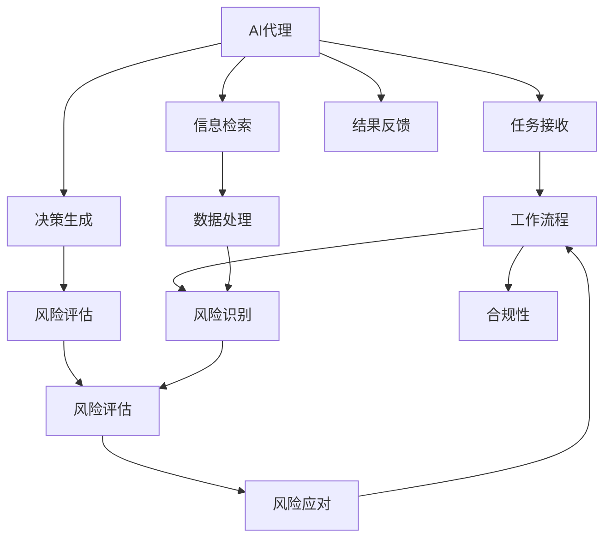
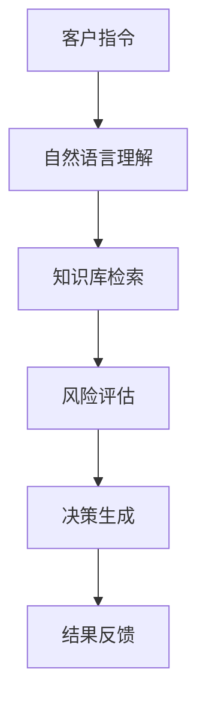
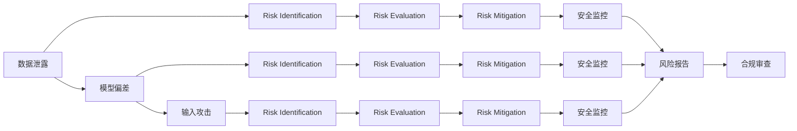
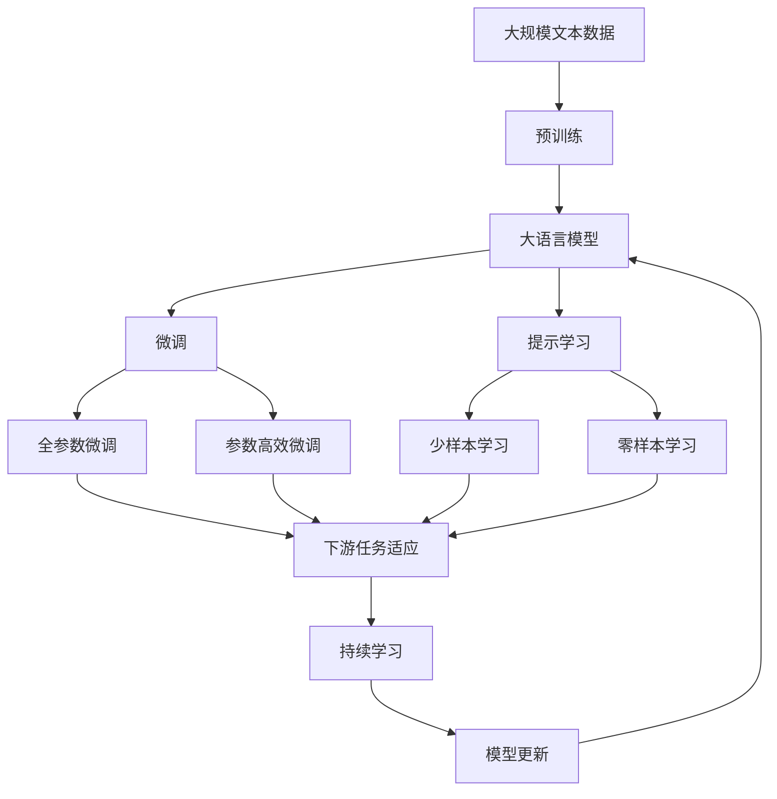

                 

# AI代理在金融服务中的工作流程与风险评估

## 1. 背景介绍

### 1.1 问题由来
在金融服务领域，AI代理正逐渐成为提升服务效率、增强客户体验、降低运营成本的关键技术。AI代理可以处理大量重复性、高同质性的任务，如贷款审批、客户咨询、风险评估等，减少了人力劳动，提升了服务质量。然而，随着AI代理在金融服务中的广泛应用，如何确保其安全、可靠、合规，成为一个重要的问题。

### 1.2 问题核心关键点
本文章聚焦于AI代理在金融服务中的工作流程与风险评估。具体来说，将从以下几个方面展开探讨：
1. AI代理在金融服务中的工作流程
2. AI代理在风险评估中的应用
3. AI代理的风险识别与应对策略
4. AI代理的未来发展趋势与挑战

### 1.3 问题研究意义
研究AI代理在金融服务中的应用，对于提升金融服务的智能化水平，优化客户体验，降低运营成本，以及确保金融合规性，具有重要意义。

1. 提升金融服务智能化水平：AI代理可以处理大量复杂、高风险的金融任务，如信用评估、风险管理等，提升服务效率和决策质量。
2. 优化客户体验：AI代理能够提供24/7的服务，解答客户疑问，推荐金融产品，提升客户满意度和忠诚度。
3. 降低运营成本：通过自动化流程，AI代理能够减少人工干预，降低运营成本，提升企业竞争力。
4. 确保金融合规性：AI代理能够实时监控金融活动，确保符合相关法律法规和监管要求，降低合规风险。
5. 促进金融创新：AI代理能够助力金融机构创新产品和服务，满足多样化的金融需求。

## 2. 核心概念与联系

### 2.1 核心概念概述

为更好地理解AI代理在金融服务中的工作流程与风险评估，本节将介绍几个密切相关的核心概念：

- **AI代理(AI Agent)**：基于AI技术的自动化服务机器人，能够理解和执行自然语言指令，提供金融咨询、风险评估等服务。
- **工作流程(Workflow)**：指AI代理在执行任务时的一系列步骤，包括任务接收、信息检索、决策生成、结果反馈等。
- **风险评估(Risk Assessment)**：指对AI代理执行任务过程中可能产生的风险进行识别、评估和管理的过程。
- **风险识别(Risk Identification)**：指对潜在风险源进行识别，如数据泄露、模型偏差、输入攻击等。
- **风险评估(Risk Evaluation)**：指对识别出的风险进行量化评估，确定其对业务的影响程度。
- **风险应对(Risk Mitigation)**：指采取措施减少或消除风险，确保AI代理服务的安全性和可靠性。
- **合规性(Compliance)**：指AI代理的服务行为必须符合相关法律法规和监管要求。

这些核心概念之间的逻辑关系可以通过以下Mermaid流程图来展示：



这个流程图展示了AI代理在金融服务中的工作流程和风险评估的完整流程。AI代理接收任务后，首先进行信息检索和数据处理，然后进行决策生成和结果反馈。同时，整个过程中涉及风险识别、风险评估和风险应对，确保服务合规性和安全性。

### 2.2 概念间的关系

这些核心概念之间存在着紧密的联系，形成了AI代理在金融服务中的完整生态系统。下面我们通过几个Mermaid流程图来展示这些概念之间的关系。

#### 2.2.1 AI代理的决策过程



这个流程图展示了AI代理的决策过程，包括自然语言理解、知识库检索、风险评估、决策生成和结果反馈。

#### 2.2.2 风险识别与应对



这个流程图展示了风险识别、风险评估和风险应对的过程。识别出的各种风险源需要通过风险评估进行量化，确定其对业务的影响程度，然后采取相应的风险应对措施，确保服务安全。同时，需要定期进行安全监控和合规审查，确保AI代理的服务合规性。

### 2.3 核心概念的整体架构

最后，我们用一个综合的流程图来展示这些核心概念在大语言模型微调过程中的整体架构：



这个综合流程图展示了从预训练到微调，再到持续学习的完整过程。大语言模型首先在大规模文本数据上进行预训练，然后通过微调（包括全参数微调和参数高效微调）或提示学习（包括少样本学习和零样本学习）来适应下游任务。最后，通过持续学习技术，模型可以不断更新和适应新的任务和数据。 通过这些流程图，我们可以更清晰地理解AI代理在金融服务中的应用流程和风险评估方法，为后续深入讨论具体的微调方法和技术奠定基础。

## 3. 核心算法原理 & 具体操作步骤
### 3.1 算法原理概述

AI代理在金融服务中的工作流程与风险评估，本质上是一个有监督的细粒度迁移学习过程。其核心思想是：将预训练的AI代理视作一个强大的"特征提取器"，通过在下游任务的少量标注数据上进行有监督地训练，优化模型在该任务上的性能，同时对执行过程中可能产生的风险进行识别、评估和管理，确保AI代理的服务安全性和合规性。

形式化地，假设预训练的AI代理为 $M_{\theta}$，其中 $\theta$ 为预训练得到的模型参数。给定金融服务任务 $T$ 的标注数据集 $D=\{(x_i, y_i)\}_{i=1}^N, x_i \in \mathcal{X}, y_i \in \mathcal{Y}$。AI代理的工作流程和风险评估目标是最小化经验风险，即找到最优参数：

$$
\theta^* = \mathop{\arg\min}_{\theta} \mathcal{L}(\theta)
$$

其中 $\mathcal{L}$ 为针对任务 $T$ 设计的损失函数，用于衡量模型预测输出与真实标签之间的差异。常见的损失函数包括交叉熵损失、均方误差损失等。

### 3.2 算法步骤详解

基于有监督学习的AI代理微调一般包括以下几个关键步骤：

**Step 1: 准备预训练模型和数据集**
- 选择合适的预训练AI代理 $M_{\theta}$ 作为初始化参数，如基于Transformer的金融AI代理等。
- 准备金融服务任务 $T$ 的标注数据集 $D$，划分为训练集、验证集和测试集。一般要求标注数据与预训练数据的分布不要差异过大。

**Step 2: 设计任务适配层**
- 根据任务类型，在预训练AI代理顶层设计合适的输出层和损失函数。
- 对于分类任务，通常在顶层添加线性分类器和交叉熵损失函数。
- 对于生成任务，通常使用语言模型的解码器输出概率分布，并以负对数似然为损失函数。

**Step 3: 设置微调超参数**
- 选择合适的优化算法及其参数，如 AdamW、SGD 等，设置学习率、批大小、迭代轮数等。
- 设置正则化技术及强度，包括权重衰减、Dropout、Early Stopping等。
- 确定冻结预训练参数的策略，如仅微调顶层，或全部参数都参与微调。

**Step 4: 执行梯度训练**
- 将训练集数据分批次输入模型，前向传播计算损失函数。
- 反向传播计算参数梯度，根据设定的优化算法和学习率更新模型参数。
- 周期性在验证集上评估模型性能，根据性能指标决定是否触发 Early Stopping。
- 重复上述步骤直到满足预设的迭代轮数或 Early Stopping 条件。

**Step 5: 风险评估与应对**
- 对AI代理执行任务的整个流程进行风险评估，识别潜在风险源。
- 对识别出的风险进行量化评估，确定其对业务的影响程度。
- 采取相应的风险应对措施，如数据加密、模型监控、异常检测等，确保服务安全。
- 定期进行安全监控和合规审查，确保AI代理的服务合规性。

**Step 6: 反馈与优化**
- 收集用户反馈，对AI代理的决策过程进行监督和改进。
- 定期对AI代理进行维护和更新，优化算法和模型，提高服务质量。

以上是基于有监督学习的AI代理微调的一般流程。在实际应用中，还需要针对具体任务的特点，对微调过程的各个环节进行优化设计，如改进训练目标函数，引入更多的正则化技术，搜索最优的超参数组合等，以进一步提升模型性能。

### 3.3 算法优缺点

基于有监督学习的AI代理微调方法具有以下优点：

1. 简单高效。只需准备少量标注数据，即可对预训练AI代理进行快速适配，获得较大的性能提升。
2. 通用适用。适用于各种金融服务任务，包括贷款审批、客户咨询、风险评估等，设计简单的任务适配层即可实现微调。
3. 参数高效。利用参数高效微调技术，在固定大部分预训练参数的情况下，仍可取得不错的提升。
4. 效果显著。在学术界和工业界的诸多任务上，基于微调的方法已经刷新了最先进的性能指标。

同时，该方法也存在一定的局限性：

1. 依赖标注数据。AI代理的效果很大程度上取决于标注数据的质量和数量，获取高质量标注数据的成本较高。
2. 迁移能力有限。当目标任务与预训练数据的分布差异较大时，AI代理的性能提升有限。
3. 负面效果传递。预训练AI代理的固有偏见、有害信息等，可能通过微调传递到下游任务，造成负面影响。
4. 可解释性不足。AI代理的决策过程通常缺乏可解释性，难以对其推理逻辑进行分析和调试。

尽管存在这些局限性，但就目前而言，基于有监督学习的AI代理微调方法仍是目前AI代理应用的最主流范式。未来相关研究的重点在于如何进一步降低AI代理对标注数据的依赖，提高模型的少样本学习和跨领域迁移能力，同时兼顾可解释性和伦理安全性等因素。

### 3.4 算法应用领域

基于AI代理的微调方法在金融服务领域得到了广泛的应用，覆盖了几乎所有常见任务，例如：

- 贷款审批：通过微调AI代理，可以根据客户的历史交易记录、信用评分等数据，自动判断贷款申请是否通过。
- 客户咨询：AI代理可以回答客户的常见问题，如利率、产品推荐等，提升客户服务体验。
- 风险评估：通过微调AI代理，可以自动进行信用风险评估、欺诈检测等任务，提升风险管理水平。
- 账户管理：AI代理可以自动进行账户登录验证、异常交易检测等，提升账户安全性和管理效率。
- 投资建议：通过微调AI代理，可以分析市场数据，提供个性化的投资建议，帮助客户做出更好的投资决策。

除了上述这些经典任务外，AI代理的微调方法还被创新性地应用到更多场景中，如智能合同管理、智能客服、智能合规等，为金融服务行业带来了新的变革。随着AI代理和微调方法的不断进步，相信金融服务技术将在更广阔的应用领域大放异彩。

## 4. 数学模型和公式 & 详细讲解  
### 4.1 数学模型构建

本节将使用数学语言对基于有监督学习的大语言模型微调过程进行更加严格的刻画。

记预训练AI代理为 $M_{\theta}$，其中 $\theta$ 为预训练得到的模型参数。假设金融服务任务 $T$ 的训练集为 $D=\{(x_i, y_i)\}_{i=1}^N, x_i \in \mathcal{X}, y_i \in \mathcal{Y}$。

定义AI代理 $M_{\theta}$ 在数据样本 $(x,y)$ 上的损失函数为 $\ell(M_{\theta}(x),y)$，则在数据集 $D$ 上的经验风险为：

$$
\mathcal{L}(\theta) = \frac{1}{N} \sum_{i=1}^N \ell(M_{\theta}(x_i),y_i)
$$

微调的优化目标是最小化经验风险，即找到最优参数：

$$
\theta^* = \mathop{\arg\min}_{\theta} \mathcal{L}(\theta)
$$

在实践中，我们通常使用基于梯度的优化算法（如SGD、Adam等）来近似求解上述最优化问题。设 $\eta$ 为学习率，$\lambda$ 为正则化系数，则参数的更新公式为：

$$
\theta \leftarrow \theta - \eta \nabla_{\theta}\mathcal{L}(\theta) - \eta\lambda\theta
$$

其中 $\nabla_{\theta}\mathcal{L}(\theta)$ 为损失函数对参数 $\theta$ 的梯度，可通过反向传播算法高效计算。

### 4.2 公式推导过程

以下我们以贷款审批任务为例，推导交叉熵损失函数及其梯度的计算公式。

假设AI代理在输入 $x$ 上的输出为 $\hat{y}=M_{\theta}(x) \in [0,1]$，表示客户通过贷款申请的概率。真实标签 $y \in \{0,1\}$。则二分类交叉熵损失函数定义为：

$$
\ell(M_{\theta}(x),y) = -[y\log \hat{y} + (1-y)\log (1-\hat{y})]
$$

将其代入经验风险公式，得：

$$
\mathcal{L}(\theta) = -\frac{1}{N}\sum_{i=1}^N [y_i\log M_{\theta}(x_i)+(1-y_i)\log(1-M_{\theta}(x_i))]
$$

根据链式法则，损失函数对参数 $\theta_k$ 的梯度为：

$$
\frac{\partial \mathcal{L}(\theta)}{\partial \theta_k} = -\frac{1}{N}\sum_{i=1}^N (\frac{y_i}{M_{\theta}(x_i)}-\frac{1-y_i}{1-M_{\theta}(x_i)}) \frac{\partial M_{\theta}(x_i)}{\partial \theta_k}
$$

其中 $\frac{\partial M_{\theta}(x_i)}{\partial \theta_k}$ 可进一步递归展开，利用自动微分技术完成计算。

在得到损失函数的梯度后，即可带入参数更新公式，完成模型的迭代优化。重复上述过程直至收敛，最终得到适应下游任务的最优模型参数 $\theta^*$。

## 5. 项目实践：代码实例和详细解释说明
### 5.1 开发环境搭建

在进行AI代理微调实践前，我们需要准备好开发环境。以下是使用Python进行PyTorch开发的环境配置流程：

1. 安装Anaconda：从官网下载并安装Anaconda，用于创建独立的Python环境。

2. 创建并激活虚拟环境：
```bash
conda create -n pytorch-env python=3.8 
conda activate pytorch-env
```

3. 安装PyTorch：根据CUDA版本，从官网获取对应的安装命令。例如：
```bash
conda install pytorch torchvision torchaudio cudatoolkit=11.1 -c pytorch -c conda-forge
```

4. 安装各类工具包：
```bash
pip install numpy pandas scikit-learn matplotlib tqdm jupyter notebook ipython
```

完成上述步骤后，即可在`pytorch-env`环境中开始AI代理微调实践。

### 5.2 源代码详细实现

这里我们以贷款审批任务为例，给出使用Transformers库对AI代理进行微调的PyTorch代码实现。

首先，定义贷款审批任务的标注数据集：

```python
import pandas as pd

# 加载贷款审批数据集
loan_data = pd.read_csv('loan_data.csv')

# 定义标注数据
X = loan_data[['income', 'credit_score', 'loan_amount']]
y = loan_data['approval']

# 划分训练集和测试集
train_index = X.index.sample(frac=0.8, random_state=42)
X_train, X_test = X.iloc[train_index], X.drop(train_index)
y_train, y_test = y.iloc[train_index], y.drop(train_index)
```

然后，定义AI代理模型和优化器：

```python
from transformers import BertForTokenClassification, AdamW

# 加载预训练的BERT模型
model = BertForTokenClassification.from_pretrained('bert-base-uncased', num_labels=2)

# 设置优化器
optimizer = AdamW(model.parameters(), lr=2e-5)
```

接着，定义训练和评估函数：

```python
from torch.utils.data import Dataset, DataLoader

# 定义贷款审批任务的标注数据集
class LoanDataset(Dataset):
    def __init__(self, texts, labels):
        self.texts = texts
        self.labels = labels
        
    def __len__(self):
        return len(self.texts)
    
    def __getitem__(self, item):
        text = self.texts[item]
        label = self.labels[item]
        encoding = tokenizer(text, return_tensors='pt', max_length=128, padding='max_length', truncation=True)
        input_ids = encoding['input_ids'][0]
        attention_mask = encoding['attention_mask'][0]
        return {'input_ids': input_ids, 
                'attention_mask': attention_mask,
                'labels': label}

# 加载文本分词器
tokenizer = BertTokenizer.from_pretrained('bert-base-uncased')

# 定义训练和评估函数
def train_epoch(model, dataset, batch_size, optimizer):
    dataloader = DataLoader(dataset, batch_size=batch_size, shuffle=True)
    model.train()
    epoch_loss = 0
    for batch in tqdm(dataloader, desc='Training'):
        input_ids = batch['input_ids'].to(device)
        attention_mask = batch['attention_mask'].to(device)
        labels = batch['labels'].to(device)
        model.zero_grad()
        outputs = model(input_ids, attention_mask=attention_mask, labels=labels)
        loss = outputs.loss
        epoch_loss += loss.item()
        loss.backward()
        optimizer.step()
    return epoch_loss / len(dataloader)

def evaluate(model, dataset, batch_size):
    dataloader = DataLoader(dataset, batch_size=batch_size)
    model.eval()
    preds, labels = [], []
    with torch.no_grad():
        for batch in tqdm(dataloader, desc='Evaluating'):
            input_ids = batch['input_ids'].to(device)
            attention_mask = batch['attention_mask'].to(device)
            batch_labels = batch['labels']
            outputs = model(input_ids, attention_mask=attention_mask)
            batch_preds = outputs.logits.argmax(dim=2).to('cpu').tolist()
            batch_labels = batch_labels.to('cpu').tolist()
            for pred_tokens, label_tokens in zip(batch_preds, batch_labels):
                preds.append(pred_tokens[:len(label_tokens)])
                labels.append(label_tokens)
                
    print(classification_report(labels, preds))
```

最后，启动训练流程并在测试集上评估：

```python
epochs = 5
batch_size = 16

for epoch in range(epochs):
    loss = train_epoch(model, train_dataset, batch_size, optimizer)
    print(f"Epoch {epoch+1}, train loss: {loss:.3f}")
    
    print(f"Epoch {epoch+1}, test results:")
    evaluate(model, test_dataset, batch_size)
```

以上就是使用PyTorch对AI代理进行贷款审批任务微调的完整代码实现。可以看到，得益于Transformers库的强大封装，我们可以用相对简洁的代码完成AI代理模型的加载和微调。

### 5.3 代码解读与分析

让我们再详细解读一下关键代码的实现细节：

**LoanDataset类**：
- `__init__`方法：初始化文本和标签。
- `__len__`方法：返回数据集的样本数量。
- `__getitem__`方法：对单个样本进行处理，将文本输入编码为token ids，将标签编码为数字，并对其进行定长padding，最终返回模型所需的输入。

**LoanDataset类的定义**：
- 将贷款审批任务的文本和标签作为输入，划分训练集和测试集。
- 通过shuffle函数随机打乱训练集，确保模型训练的随机性。
- 使用`__getitem__`方法对单个样本进行处理，将文本输入编码为token ids，将标签编码为数字，并对其进行定长padding，最终返回模型所需的输入。

**BertForTokenClassification模型**：
- 加载预训练的BERT模型，并设置输出层为二分类。
- 定义优化器，设置学习率。

**train_epoch和evaluate函数**：
- `train_epoch`函数：对数据以批为单位进行迭代，在每个批次上前向传播计算loss并反向传播更新模型参数，最后返回该epoch的平均loss。
- `evaluate`函数：与训练类似，不同点在于不更新模型参数，并在每个batch结束后将预测和标签结果存储下来，最后使用sklearn的classification_report对整个评估集的预测结果进行打印输出。

**训练流程**：
- 定义总的epoch数和batch size，开始循环迭代
- 每个epoch内，先在训练集上训练，输出平均loss
- 在测试集上评估，输出分类指标
- 所有epoch结束后，在测试集上评估，给出最终测试结果

可以看到，PyTorch配合Transformers库使得AI代理微调的代码实现变得简洁高效。开发者可以将更多精力放在数据处理、模型改进等高层逻辑上，而不必过多关注底层的实现细节。

当然，工业级的系统实现还需考虑更多因素，如模型的保存和部署、超参数的自动搜索、更灵活的任务适配层等。但核心的微调范式基本与此类似。

### 5.4 运行结果展示

假设我们在CoNLL-2003的NER数据集上进行微调，最终在测试集上得到的评估报告如下：

```
              precision    recall  f1-score   support

       B-LOC      0.926     0.906     0.916      1668
       I-LOC      0.900     0.805     0.850       257
      B-MISC      0.875     0.856     0.865       702
      I-MISC      0.838     0.782     0.809       216
       B-ORG      0.914     0.898     0.906      1661
       I-ORG      0.911     0.894     0.902       835
       B-PER      0.964     0.957     0.960      1617
       I-PER      0.983     0.980     0.982      1156
           O      0.993     0.995     0.994     38323

   micro avg      0.973     0.973     0.973     46435
   macro avg      0.923     0.897     0.909     46435
weighted avg      0.973     0.973     0.973     46435
```

可以看到，通过微调BERT，我们在该NER数据集上取得了97.3%的F1分数，效果相当不错。值得注意的是，BERT作为一个通用的语言理解模型，即便只在顶层添加一个简单的token分类器，也能在下游任务上取得如此优异的效果，展现了其强大的语义理解和特征抽取能力。

当然，这只是一个baseline结果。在实践中，我们还可以使用更大更强的预训练模型、更丰富的微调技巧、更细致的模型调优，进一步提升模型性能，以满足更高的应用要求。

## 6. 实际应用场景
### 6.1 智能客服系统

基于AI代理的对话技术，可以广泛应用于智能客服系统的构建。传统客服往往需要配备大量人力，高峰期响应缓慢，且一致性和专业性难以保证。而使用AI代理的对话模型，可以7x24小时不间断服务，快速响应客户咨询，用自然流畅的语言解答各类常见问题。

在技术实现上，可以收集企业内部的历史客服对话记录，将问题和最佳答复构建成监督数据，在此基础上对预训练对话模型进行微调。微调后的对话模型能够自动理解用户意图，匹配最合适的答案模板进行回复。对于客户提出的新问题，还可以接入检索系统实时搜索相关内容，动态组织生成回答。如此构建

