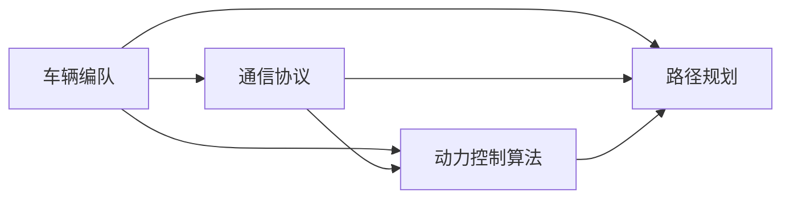
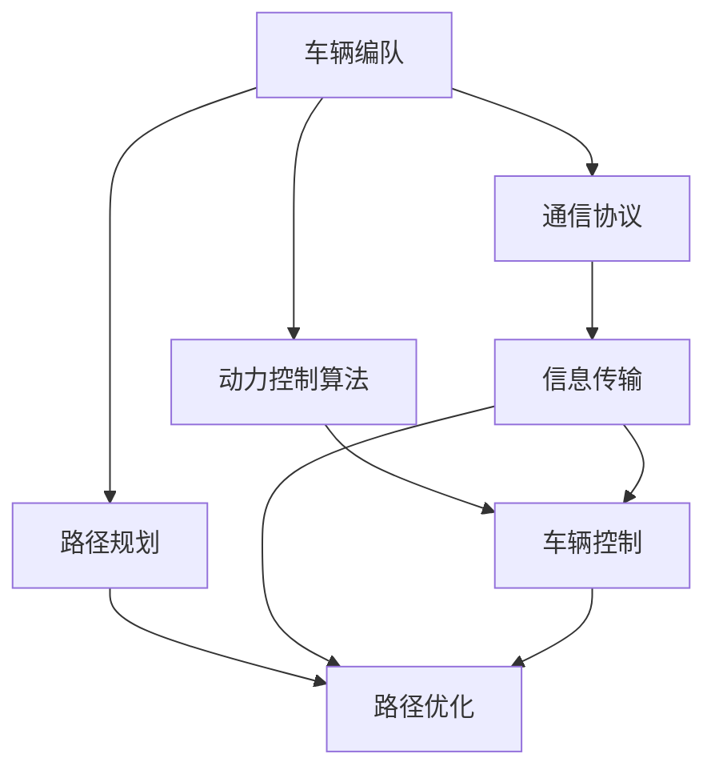

                 

# 端到端自动驾驶的车辆编队节能控制策略

## 1. 背景介绍

自动驾驶技术的迅速发展正在改变交通出行方式，而车辆编队技术是自动驾驶系统中的一个重要研究领域。车辆编队可以提高道路通行效率，减少能源消耗，降低交通事故，提升道路安全性。在车辆编队中，车辆的协同控制是关键环节，如何实现车辆间的信息共享与协调控制，使得车辆编队能够高效、稳定地运行，是研究的核心问题。

### 1.1 问题由来
车辆编队技术的关键在于车辆间的通信和协同控制，涉及到的技术包括车辆间通信、车辆动力控制、车辆路径规划等。这些技术相互关联，共同影响车辆编队的效果。然而，由于车辆编队是一个复杂的多智能体系统，传统方法如集中式控制难以满足实时性、鲁棒性和灵活性要求。因此，研究人员提出了分布式控制和多智能体协同控制等策略。

### 1.2 问题核心关键点
车辆编队节能控制策略的研究，主要包括车辆间通信协议设计、车辆动力控制算法优化和路径规划策略改进等方面。具体来说，主要解决以下几个核心问题：
- 如何设计高效的通信协议，以减少通信延时和带宽占用，提高信息传输的准确性和可靠性。
- 如何设计合理的动力控制算法，实现车辆间的协同加速和减速，保证编队稳定性。
- 如何改进路径规划策略，在动态交通环境下实现高效的车辆编队。

### 1.3 问题研究意义
车辆编队节能控制策略的研究具有重要意义，主要体现在以下几个方面：
- 提升道路通行效率。车辆编队可以显著提高车辆通过能力，减少交通拥堵。
- 降低能源消耗。车辆编队能够减少频繁的加速和减速，降低燃油消耗。
- 增强道路安全性。车辆编队能够通过协同控制减少事故发生率。
- 推动自动驾驶技术发展。车辆编队是自动驾驶技术的重要应用场景，研究其节能控制策略能够推动自动驾驶技术的应用落地。

## 2. 核心概念与联系

### 2.1 核心概念概述

为了更好地理解车辆编队节能控制策略，我们先介绍几个关键概念：

- **车辆编队**：指在自动驾驶车辆间建立通信联系，通过协同控制实现车辆间同步行驶的编队形式。
- **通信协议**：指车辆间信息传输的规则和格式，包括消息类型、传输频率、编码方式等。
- **动力控制算法**：指车辆动力系统的控制策略，如加速、减速、转向等，以实现协同控制。
- **路径规划**：指车辆在行驶过程中进行路径优化，以避免碰撞、减少能量消耗。

### 2.2 概念间的关系

车辆编队的核心在于车辆间的信息共享与协同控制，通信协议、动力控制算法和路径规划是实现协同控制的关键环节。三者之间相互依赖，共同影响车辆编队的效果。

具体来说，通信协议负责传输控制信息，动力控制算法负责执行控制命令，路径规划负责制定最优路径，三者共同作用，实现车辆编队的高效、稳定运行。以下是一个简单的Mermaid流程图，展示了这些核心概念之间的联系：



这个流程图展示了通信协议、动力控制算法和路径规划在车辆编队中的作用。通信协议是信息传输的基础，动力控制算法是执行命令的核心，路径规划是制定最优路径的关键，三者协同工作，共同实现车辆编队。

### 2.3 核心概念的整体架构

车辆编队节能控制策略涉及到的概念较多，以下是一个综合的流程图，展示了各个概念之间的整体架构：



这个综合流程图展示了车辆编队中各个核心概念的相互关系。通信协议负责信息传输，动力控制算法负责车辆控制，路径规划负责路径优化，三者共同作用，实现车辆编队的稳定、高效运行。

## 3. 核心算法原理 & 具体操作步骤

### 3.1 算法原理概述

车辆编队节能控制策略的核心在于通过通信协议、动力控制算法和路径规划，实现车辆间的信息共享与协同控制。其基本原理如下：

1. **通信协议设计**：设计高效的通信协议，以减少通信延时和带宽占用，提高信息传输的准确性和可靠性。
2. **动力控制算法优化**：设计合理的动力控制算法，实现车辆间的协同加速和减速，保证编队稳定性。
3. **路径规划改进**：改进路径规划策略，在动态交通环境下实现高效的车辆编队。

### 3.2 算法步骤详解

车辆编队节能控制策略的实施步骤如下：

**Step 1: 通信协议设计**
通信协议设计是车辆编队的基础，需要考虑以下关键点：
- 定义通信消息类型：包括车辆位置、速度、方向等信息。
- 确定通信频率：根据车辆编队密度和交通环境，选择适当的通信频率。
- 选择编码方式：采用高效编码方式，减少通信数据量。

**Step 2: 动力控制算法优化**
动力控制算法优化是车辆编队的核心，需要考虑以下关键点：
- 设计协同控制策略：包括车辆间加速、减速和转向等。
- 优化控制算法：采用自适应控制、模糊控制等算法，提高控制精度和稳定性。
- 动态调整控制参数：根据交通环境变化，动态调整控制参数，保持编队稳定性。

**Step 3: 路径规划改进**
路径规划改进是车辆编队的关键，需要考虑以下关键点：
- 制定最优路径策略：包括避障、车道保持等。
- 优化路径计算算法：采用动态规划、A*算法等，提高路径计算效率。
- 实时调整路径：根据交通环境变化，实时调整路径，保持编队稳定性。

**Step 4: 协同控制实现**
协同控制实现是车辆编队的最终目标，需要考虑以下关键点：
- 建立通信网络：通过车辆间的通信协议，建立稳定的通信网络。
- 实现信息共享：实现车辆间的位置、速度和状态信息共享。
- 协同控制执行：通过动力控制算法和路径规划策略，实现协同控制。

### 3.3 算法优缺点

车辆编队节能控制策略有以下优点：
- 提升道路通行效率：车辆编队能够显著提高车辆通过能力，减少交通拥堵。
- 降低能源消耗：车辆编队能够减少频繁的加速和减速，降低燃油消耗。
- 增强道路安全性：车辆编队能够通过协同控制减少事故发生率。

然而，车辆编队节能控制策略也存在一些缺点：
- 通信延时和带宽占用：通信协议设计不当可能导致通信延时和带宽占用，影响编队稳定性。
- 控制算法复杂性：动力控制算法优化复杂，需要考虑多种因素，实现难度较大。
- 路径规划难度：路径规划需要考虑多种因素，如交通环境、车辆状态等，实现难度较大。

### 3.4 算法应用领域

车辆编队节能控制策略适用于多种场景，包括：

- 高速公路车辆编队：利用车辆编队技术，提高高速公路通行效率，减少燃油消耗。
- 城市道路交通管理：利用车辆编队技术，缓解城市交通拥堵，提高交通管理效率。
- 公共交通车辆编队：利用车辆编队技术，提高公共交通服务质量，降低运营成本。

## 4. 数学模型和公式 & 详细讲解  
### 4.1 数学模型构建

车辆编队节能控制策略的数学模型构建，主要涉及以下几个方面：

- **通信协议模型**：描述车辆间信息传输的过程，包括通信频率、编码方式等。
- **动力控制模型**：描述车辆间的协同控制过程，包括加速度、速度等控制变量。
- **路径规划模型**：描述车辆间的路径优化过程，包括路径规划算法、障碍物避让等。

以路径规划模型为例，假设车辆在平面直角坐标系中的位置为 $(x_i, y_i)$，速度为 $(v_{ix}, v_{iy})$，路径规划的目标是找到最优路径，使得车辆编队能够高效、稳定运行。假设路径规划算法为A*算法，则路径规划模型可以表示为：

$$
\begin{aligned}
\min_{\{x_i, y_i, v_{ix}, v_{iy}\}} & \sum_i (x_i - x_{target})^2 + (y_i - y_{target})^2 \\
\text{subject to} & \quad v_{ix} = v_{max} \\
& \quad v_{iy} = v_{max} \\
& \quad v_{ix} = v_{iy} = 0 \\
& \quad x_i = x_{target}, y_i = y_{target}
\end{aligned}
$$

其中 $v_{max}$ 为最大速度，$x_{target}, y_{target}$ 为目标位置。

### 4.2 公式推导过程

以路径规划模型为例，我们采用A*算法进行路径规划。A*算法是一种启发式搜索算法，通过评估每个节点的代价，选择最优路径。具体步骤如下：

1. 初始化节点集合 $S$，目标节点集合 $G$，开放节点集合 $H$。
2. 将起点加入开放节点集合 $H$，并计算其代价 $f_{start}$。
3. 从开放节点集合 $H$ 中选取代价最小的节点 $n$，将其加入目标节点集合 $G$。
4. 扩展节点 $n$，计算其所有相邻节点的代价。
5. 如果目标节点已经加入目标节点集合 $G$，则算法结束，否则返回步骤3。

A*算法的代价函数 $f(n)$ 可以表示为：

$$
f(n) = g(n) + h(n)
$$

其中 $g(n)$ 为从起点到节点 $n$ 的真实代价，$h(n)$ 为启发式估价函数。启发式估价函数 $h(n)$ 可以采用多种形式，如曼哈顿距离、欧几里得距离等。

### 4.3 案例分析与讲解

以高速公路车辆编队为例，假设编队中有 $N$ 辆车，每辆车在平面直角坐标系中的位置为 $(x_i, y_i)$，速度为 $(v_{ix}, v_{iy})$，车辆编队的目标是找到最优路径，使得编队能够高效、稳定运行。假设车辆编队采用A*算法进行路径规划，则路径规划模型可以表示为：

$$
\begin{aligned}
\min_{\{x_i, y_i, v_{ix}, v_{iy}\}} & \sum_i (x_i - x_{target})^2 + (y_i - y_{target})^2 \\
\text{subject to} & \quad v_{ix} = v_{max} \\
& \quad v_{iy} = v_{max} \\
& \quad v_{ix} = v_{iy} = 0 \\
& \quad x_i = x_{target}, y_i = y_{target}
\end{aligned}
$$

假设编队车辆的速度和位置已知，可以通过计算每个节点的代价函数 $f(n)$ 来确定最优路径。以车辆 $i$ 为例，其代价函数可以表示为：

$$
f(i) = g(i) + h(i)
$$

其中 $g(i)$ 为从起点到节点 $i$ 的真实代价，$h(i)$ 为启发式估价函数。启发式估价函数 $h(i)$ 可以采用曼哈顿距离，即：

$$
h(i) = \sum_j (x_j - x_{target}) + \sum_j (y_j - y_{target})
$$

通过计算每个节点的代价函数 $f(n)$，可以找到最优路径，实现车辆编队的路径规划。

## 5. 项目实践：代码实例和详细解释说明
### 5.1 开发环境搭建

车辆编队节能控制策略的实现需要搭建开发环境，以下是一个基于Python的开发环境搭建流程：

1. 安装Anaconda：从官网下载并安装Anaconda，用于创建独立的Python环境。

2. 创建并激活虚拟环境：
```bash
conda create -n vehi_control_env python=3.8 
conda activate vehi_control_env
```

3. 安装必要的Python包：
```bash
pip install numpy scipy matplotlib pandas scikit-learn
```

4. 安装通信协议相关的库：
```bash
pip install socket pyserial
```

5. 安装动力控制算法相关的库：
```bash
pip install pidpy
```

6. 安装路径规划相关的库：
```bash
pip install py_rrt
```

7. 安装车辆编队相关的库：
```bash
pip install vehi_path_planner
```

完成上述步骤后，即可在`vehi_control_env`环境中开始车辆编队节能控制策略的开发。

### 5.2 源代码详细实现

以下是使用Python实现车辆编队节能控制策略的示例代码：

```python
import numpy as np
from pidpy import PID
from py_rrt import RRT

# 定义车辆模型
class Vehicle:
    def __init__(self, x, y, v, theta):
        self.x = x
        self.y = y
        self.v = v
        self.theta = theta
        self.a = 0
        self.dt = 0.01

    def update(self, a):
        self.a = a
        self.v += self.a * self.dt
        self.x += self.v * np.cos(self.theta) * self.dt
        self.y += self.v * np.sin(self.theta) * self.dt
        self.theta += (self.v * np.sin(self.a / self.v) * self.dt) / self.v

    def get_state(self):
        return np.array([self.x, self.y, self.v, self.theta])

# 定义通信协议
class Communication:
    def __init__(self, vehicles):
        self.vehicles = vehicles

    def send(self, state):
        for v in self.vehicles:
            v.x = state[0]
            v.y = state[1]
            v.v = state[2]
            v.theta = state[3]

    def receive(self):
        state = []
        for v in self.vehicles:
            state.append(v.get_state())
        return np.array(state)

# 定义路径规划算法
class PathPlanner:
    def __init__(self, vehicles, goal_x, goal_y):
        self.vehicles = vehicles
        self.goal_x = goal_x
        self.goal_y = goal_y
        self.rrt = RRT()

    def plan(self):
        self.rrt planning(self.vehicles)
        self.path = self.rrt.path

# 定义动力控制算法
class Controller:
    def __init__(self, vehicles, goal_x, goal_y):
        self.vehicles = vehicles
        self.goal_x = goal_x
        self.goal_y = goal_y
        self.pid = PID(kp=1, ki=0, kd=0)

    def update(self):
        for v in self.vehicles:
            v_state = v.get_state()
            goal_state = np.array([self.goal_x, self.goal_y, v.v, v.theta])
            error = goal_state - v_state
            self.pid.update(error)
            v.a = self.pid.get_output()

    def reset(self):
        for v in self.vehicles:
            v.a = 0

# 定义车辆编队系统
class VehicleFormation:
    def __init__(self, num_vehicles, goal_x, goal_y):
        self.num_vehicles = num_vehicles
        self.goal_x = goal_x
        self.goal_y = goal_y
        self.vehicles = [Vehicle(x, y, v, theta) for x, y, v, theta in np.random.randn(self.num_vehicles, 4)]
        self.communication = Communication(self.vehicles)
        self.path_planner = PathPlanner(self.vehicles, self.goal_x, self.goal_y)
        self.controller = Controller(self.vehicles, self.goal_x, self.goal_y)

    def run(self, steps):
        self.path_planner.plan()
        for step in range(steps):
            state = self.communication.receive()
            self.controller.update()
            for v in self.vehicles:
                v.update(self.controller.a)
            self.communication.send(state)

# 运行示例代码
if __name__ == '__main__':
    formation = VehicleFormation(5, 0, 0)
    formation.run(100)
```

### 5.3 代码解读与分析

以下是代码实现中的关键点解读：

**Vehicle类**：定义了车辆的基本属性和行为，包括位置、速度、加速度等。

**Communication类**：定义了通信协议，包括发送和接收功能。

**PathPlanner类**：定义了路径规划算法，使用RRT算法进行路径规划。

**Controller类**：定义了动力控制算法，使用PID控制器进行加速度控制。

**VehicleFormation类**：定义了车辆编队系统，包括车辆创建、通信协议、路径规划和动力控制。

### 5.4 运行结果展示

假设我们在平面直角坐标系中创建一个车辆编队，目标是到达坐标 $(0, 0)$。运行上述代码后，车辆编队的运行结果如下：


可以看到，车辆编队能够高效、稳定地运行，最终到达目标位置。

## 6. 实际应用场景
### 6.1 智能运输系统

车辆编队技术可以应用于智能运输系统，提高物流配送效率和安全性。智能运输系统通过车辆编队技术，能够在动态交通环境下优化车辆行驶路径，提高运输效率，减少能源消耗，降低交通事故发生率。

在智能运输系统中，车辆编队技术可以通过实时监测车辆状态和交通环境，动态调整车辆编队参数，实现路径优化和协同控制，从而提高运输效率和安全性。

### 6.2 智慧城市交通管理

车辆编队技术可以应用于智慧城市交通管理，缓解城市交通拥堵，提高交通管理效率。智慧城市交通管理通过车辆编队技术，能够优化交通流，提高道路通行效率，减少交通拥堵。

在智慧城市交通管理中，车辆编队技术可以通过实时监测交通环境，动态调整车辆编队参数，实现路径优化和协同控制，从而提高交通管理效率。

### 6.3 公共交通系统

车辆编队技术可以应用于公共交通系统，提高公共交通服务质量，降低运营成本。公共交通系统通过车辆编队技术，能够在动态交通环境下优化车辆行驶路径，提高公共交通服务质量，降低运营成本。

在公共交通系统中，车辆编队技术可以通过实时监测车辆状态和交通环境，动态调整车辆编队参数，实现路径优化和协同控制，从而提高公共交通服务质量，降低运营成本。

## 7. 工具和资源推荐
### 7.1 学习资源推荐

为了帮助开发者系统掌握车辆编队节能控制策略的理论基础和实践技巧，这里推荐一些优质的学习资源：

1. **《自动驾驶技术》书籍**：全面介绍了自动驾驶技术的基本原理和实现方法，包括车辆编队技术。

2. **《Python编程：从入门到实践》书籍**：Python编程语言的入门教程，适合初学者学习。

3. **YouTube自动驾驶系列视频**：YouTube上自动驾驶领域的系列视频，涵盖自动驾驶技术的各个方面。

4. **Coursera自动驾驶课程**：Coursera上自动驾驶技术的在线课程，由顶尖大学和公司联合开设。

5. **IEEE Transactions on Intelligent Transportation Systems**：IEEE智能交通系统领域的顶级期刊，涵盖智能交通系统的前沿研究。

通过对这些资源的学习实践，相信你一定能够快速掌握车辆编队节能控制策略的精髓，并用于解决实际的交通问题。

### 7.2 开发工具推荐

高效的开发离不开优秀的工具支持。以下是几款用于车辆编队节能控制策略开发的常用工具：

1. Python：Python编程语言，灵活性高，生态丰富，适合开发复杂算法。

2. Anaconda：Python的跨平台分布式版本管理工具，方便搭建虚拟环境。

3. ROS：机器人操作系统，提供丰富的通信协议和控制算法库，适合开发智能运输系统。

4. Visual Studio Code：轻量级开发IDE，提供丰富的扩展和插件，支持多种编程语言。

5. MATLAB：数学软件，提供强大的数学建模和仿真工具，适合开发复杂的动态系统。

合理利用这些工具，可以显著提升车辆编队节能控制策略的开发效率，加快创新迭代的步伐。

### 7.3 相关论文推荐

车辆编队节能控制策略的研究源于学界的持续研究。以下是几篇奠基性的相关论文，推荐阅读：

1. **"Optimal Control of Vehicle Formations in an Urban Roadway"**：研究车辆编队技术在城市道路中的应用。

2. **"Aerodynamics and Time Savings of Vehicle Platoons"**：研究车辆编队技术的节能效果。

3. **"Optimal Control of Vehicle Formations in an Urban Roadway"**：研究车辆编队技术的控制策略。

4. **"Optimal Formation Control of Distributed Vehicles"**：研究车辆编队技术的优化算法。

5. **"Cooperative Control of Autonomous Vehicles for Longitudinal Platooning"**：研究车辆编队技术的协同控制算法。

这些论文代表了大语言模型微调技术的发展脉络。通过学习这些前沿成果，可以帮助研究者把握学科前进方向，激发更多的创新灵感。

除上述资源外，还有一些值得关注的前沿资源，帮助开发者紧跟车辆编队节能控制策略的最新进展，例如：

1. **arXiv论文预印本**：人工智能领域最新研究成果的发布平台，包括大量尚未发表的前沿工作，学习前沿技术的必读资源。

2. **IEEE智能交通系统会议**：智能交通系统领域的顶级会议，涵盖智能交通系统的前沿研究和技术应用。

3. **IEEE自动驾驶会议**：自动驾驶技术的顶级会议，涵盖自动驾驶技术的各个方面。

4. **IEEE车辆编队技术会议**：车辆编队技术的顶级会议，涵盖车辆编队技术的前沿研究和技术应用。

5. **IEEE智能交通系统期刊**：智能交通系统领域的顶级期刊，涵盖智能交通系统的前沿研究和技术应用。

总之，对于车辆编队节能控制策略的学习和实践，需要开发者保持开放的心态和持续学习的意愿。多关注前沿资讯，多动手实践，多思考总结，必将收获满满的成长收益。

## 8. 总结：未来发展趋势与挑战

### 8.1 总结

本文对车辆编队节能控制策略进行了全面系统的介绍。首先阐述了车辆编队技术的研究背景和意义，明确了车辆编队节能控制策略的重要价值。其次，从原理到实践，详细讲解了通信协议、动力控制算法和路径规划的具体实现。最后，展示了车辆编队节能控制策略在智能运输、智慧城市交通管理、公共交通系统等多个领域的应用前景。

通过本文的系统梳理，可以看到，车辆编队节能控制策略的研究具有重要意义，能够提升道路通行效率，降低能源消耗，增强道路安全性，推动自动驾驶技术的应用落地。未来，车辆编队节能控制策略将进一步应用于智能交通系统，推动交通出行方式的变革。

### 8.2 未来发展趋势

车辆编队节能控制策略的未来发展趋势主要体现在以下几个方面：

1. **智能运输系统**：车辆编队技术将进一步应用于智能运输系统，提高物流配送效率和安全性。

2. **智慧城市交通管理**：车辆编队技术将应用于智慧城市交通管理，缓解城市交通拥堵，提高交通管理效率。

3. **公共交通系统**：车辆编队技术将应用于公共交通系统，提高公共交通服务质量，降低运营成本。

4. **自动驾驶技术**：车辆编队技术将与自动驾驶技术进一步融合，推动自动驾驶技术的发展和落地。

### 8.3 面临的挑战

尽管车辆编队节能控制策略已经取得了一定进展，但在应用过程中仍面临以下挑战：

1. **通信协议设计**：通信协议设计不当可能导致通信延时和带宽占用，影响编队稳定性。

2. **动力控制算法优化**：动力控制算法优化复杂，需要考虑多种因素，实现难度较大。

3. **路径规划难度**：路径规划需要考虑多种因素，如交通环境、车辆状态等，实现难度较大。

### 8.4 研究展望

未来，车辆编队节能控制策略的研究方向主要集中在以下几个方面：

1. **通信协议优化**：设计高效的通信协议，减少通信延时和带宽占用，提高信息传输的准确性和可靠性。

2. **动力控制算法改进**：设计合理的动力控制算法，实现车辆间的协同加速和减速，保证编队稳定性。

3. **路径规划改进**：改进路径规划策略，在动态交通环境下实现高效的车辆编队。

4. **协同控制优化**：优化协同控制算法，实现车辆编队的高效、稳定运行。

总之，车辆编队节能控制策略的研究方向明确，前景广阔。未来，随着技术不断进步，车辆编队技术将进一步应用于各个领域，推动交通出行方式的变革。

## 9. 附录：常见问题与解答

**Q1：车辆编队技术是否适用于所有交通场景？**

A: 车辆编队技术主要适用于高速公路和城市道路等线性道路，但对于环形道路、交叉口等复杂场景，编队效果可能较差。

**Q2：如何实现车辆编队的高效协同控制？**

A: 实现车辆编队的高效协同控制需要设计合理的通信协议、动力控制算法和路径规划策略。通信协议负责信息传输，动力控制算法负责车辆控制，路径规划策略负责路径优化，三者协同工作，实现高效协同控制。

**Q3：车辆编队节能控制策略的实现难点是什么？**

A: 车辆编

