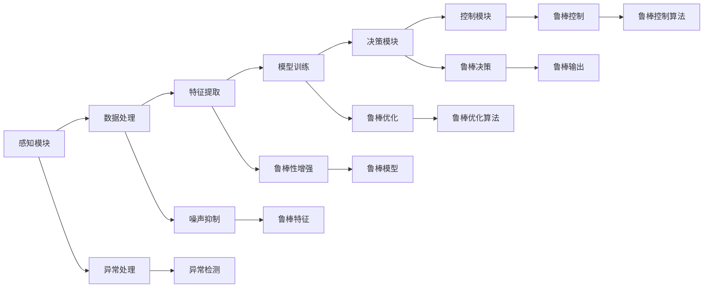

                 

# 端到端自动驾驶的鲁棒性挑战

> 关键词：自动驾驶,鲁棒性,端到端,计算机视觉,深度学习,优化算法

## 1. 背景介绍

自动驾驶（Autonomous Driving）是近年来AI领域最受关注的课题之一，其核心在于构建能够完全自主运行、无需人工干预的智能系统。尽管现代汽车和科技公司投入大量资源进行自动驾驶技术的研究和开发，但距离其全面落地应用仍存在不小的技术瓶颈。特别是在安全性、可靠性、鲁棒性等方面，现有系统仍然面临诸多挑战。

本文将聚焦于端到端自动驾驶系统的鲁棒性问题，通过全面分析技术架构和实际应用场景，提出解决策略和未来发展方向。通过深入探讨自动驾驶系统鲁棒性的核心概念，我们将带读者理解这一前沿技术。

## 2. 核心概念与联系

### 2.1 核心概念概述

自动驾驶的核心在于通过计算机视觉、深度学习等技术，实现车辆的全方位感知和决策。而鲁棒性（Robustness）则是指系统在面对不确定性和异常情况时，仍能保持稳定性能和正确决策的能力。端到端（End-to-End）自动驾驶系统则是将感知、决策和控制等功能模块集成到一个模型中，实现连续的自动化运行。

#### 2.1.1 计算机视觉

计算机视觉（Computer Vision）是自动驾驶中的关键技术，通过摄像头、激光雷达等传感器捕捉环境信息，转化为计算机能够理解的数字信号，并进行图像处理、特征提取等操作。这些处理过程的鲁棒性决定了系统对复杂、不确定环境的适应能力。

#### 2.1.2 深度学习

深度学习（Deep Learning）为自动驾驶提供了强大的模型支持，特别是卷积神经网络（CNN）、递归神经网络（RNN）和生成对抗网络（GAN）等算法，在图像识别、目标检测、语义分割等方面取得了卓越的成果。但深度学习模型在鲁棒性方面仍存在一定的局限性，如过拟合、数据集偏差等。

#### 2.1.3 优化算法

优化算法（Optimization Algorithm）在自动驾驶中主要用于模型训练和参数调整，如梯度下降、Adam、SGD等。这些算法的鲁棒性直接影响到模型的收敛速度和最终性能，是确保系统稳定运行的重要因素。

### 2.2 核心概念的整体架构

自动驾驶系统的鲁棒性可以通过以下结构图来展示：



这个图展示了感知、决策、控制等模块的鲁棒性构建过程，包括数据处理、特征提取、模型训练、决策制定、控制实现等各个环节。通过在这些环节中引入鲁棒性机制，系统能够更好地应对各种不确定性和异常情况。

### 2.3 核心概念间的关系

各核心概念间的关系主要体现在：

- **感知模块**：感知模块的鲁棒性直接影响系统对环境的准确感知，是后续决策和控制的基础。
- **数据处理和特征提取**：数据处理和特征提取的质量，决定了模型输入的质量，进而影响到模型的鲁棒性。
- **模型训练**：优化算法在模型训练中的鲁棒性，决定了模型参数的稳定性。
- **决策模块**：决策模块的鲁棒性决定了系统在不同场景下的响应能力。
- **控制模块**：控制模块的鲁棒性确保了系统在异常情况下的稳定运行。
- **异常处理**：异常处理机制对鲁棒性起到补充作用，提升系统对未知情况的应对能力。

各环节间的相互配合，是构建鲁棒性端到端自动驾驶系统的关键。

## 3. 核心算法原理 & 具体操作步骤
### 3.1 算法原理概述

端到端自动驾驶系统的鲁棒性构建，主要涉及以下几个方面：

1. **感知模块的鲁棒性**：通过引入多种传感器和多模态信息融合技术，提升感知系统的鲁棒性。
2. **决策模块的鲁棒性**：采用强化学习、模型集成等技术，增强决策系统的鲁棒性。
3. **控制模块的鲁棒性**：引入自适应控制算法，确保车辆在异常情况下的安全稳定。

### 3.2 算法步骤详解

#### 3.2.1 感知模块的鲁棒性构建

感知模块的鲁棒性主要通过以下步骤实现：

1. **多模态传感器融合**：将摄像头、雷达、激光雷达等多种传感器采集的数据进行融合，提高系统对环境的全面感知能力。
2. **鲁棒特征提取**：在图像处理、特征提取等环节引入鲁棒算法，如L1正则化、噪声抑制等，提升输入数据的稳定性。
3. **数据增强**：通过数据扩充和增强技术，如翻转、旋转、遮挡，提高模型对不同场景的适应能力。

#### 3.2.2 决策模块的鲁棒性构建

决策模块的鲁棒性主要通过以下步骤实现：

1. **模型集成**：通过集成多个模型，如Voting、Stacking等，提高系统在未知情况下的决策鲁棒性。
2. **强化学习**：引入强化学习算法，通过试错训练，提高模型对动态环境的适应能力。
3. **鲁棒优化**：在模型训练和参数调整时，使用鲁棒优化算法，确保模型在不同输入下的稳定输出。

#### 3.2.3 控制模块的鲁棒性构建

控制模块的鲁棒性主要通过以下步骤实现：

1. **自适应控制**：采用自适应控制算法，如PID控制、模型预测控制等，确保车辆在异常情况下的稳定运行。
2. **模型验证**：通过模拟和测试，验证模型的鲁棒性，发现和修复潜在的漏洞。
3. **鲁棒控制算法**：引入鲁棒控制算法，如鲁棒H无穷控制、鲁棒PID控制等，提升系统在未知情况下的稳定性。

### 3.3 算法优缺点

#### 3.3.1 优点

1. **集成化设计**：端到端自动驾驶系统实现了多模态感知、决策和控制的一体化设计，简化了系统架构，提高了整体鲁棒性。
2. **实时性**：由于端到端系统减少了中间模块的通信延迟，提高了系统的实时响应能力。
3. **鲁棒性增强**：通过多模态融合、模型集成、自适应控制等技术，提升了系统对复杂环境和异常情况的应对能力。

#### 3.3.2 缺点

1. **模型复杂度**：端到端系统通常包含多个复杂的子模块，模型的设计和调试难度较大。
2. **数据需求**：系统需要大量高质量的标注数据进行训练和验证，数据采集和标注成本较高。
3. **计算资源**：端到端系统的模型参数量较大，计算资源需求较高。

### 3.4 算法应用领域

端到端自动驾驶系统的鲁棒性，已在多个实际应用场景中得到了广泛应用，例如：

1. **高速公路自动驾驶**：在高速公路等条件较为单一的场景中，端到端系统可以发挥其高效的鲁棒性优势。
2. **城市复杂交通环境**：在城市交通环境复杂、变量多变的场景中，多模态感知和鲁棒决策是系统成功的关键。
3. **特殊环境**：在雪地、泥泞等特殊环境条件下，系统的鲁棒性显得尤为重要。

## 4. 数学模型和公式 & 详细讲解 & 举例说明

### 4.1 数学模型构建

在端到端自动驾驶系统的鲁棒性构建中，常见的数学模型包括：

1. **感知模块的数学模型**：通过摄像头和激光雷达的数据，构建图像处理和特征提取的数学模型，如Canny边缘检测、HOG特征提取等。
2. **决策模块的数学模型**：采用强化学习算法，如Q-Learning、SARSA等，构建决策系统的数学模型。
3. **控制模块的数学模型**：使用自适应控制算法，如PID控制、模型预测控制等，构建控制系统的数学模型。

### 4.2 公式推导过程

#### 4.2.1 感知模块

假设传感器采集的数据为 $x$，特征提取后的特征向量为 $y$，感知模块的数学模型为：

$$
y = f(x; \theta)
$$

其中 $f$ 为感知模块的非线性映射函数，$\theta$ 为感知模块的参数。

通过引入鲁棒特征提取算法，如L1正则化，可以提升感知模块的鲁棒性：

$$
y_{L1} = L1(f(x; \theta))
$$

#### 4.2.2 决策模块

假设决策模块的输入为 $y$，输出为决策结果 $a$，决策模块的数学模型为：

$$
a = g(y; \omega)
$$

其中 $g$ 为决策模块的非线性映射函数，$\omega$ 为决策模块的参数。

通过集成多个决策模型，可以提高决策模块的鲁棒性：

$$
a_{集成} = \arg\min_{a} \sum_{i=1}^n \ell(a_i, a)
$$

其中 $\ell$ 为损失函数，$n$ 为集成模型的数量。

#### 4.2.3 控制模块

假设控制模块的输入为 $a$，输出为控制命令 $u$，控制模块的数学模型为：

$$
u = h(a; \gamma)
$$

其中 $h$ 为控制模块的非线性映射函数，$\gamma$ 为控制模块的参数。

通过自适应控制算法，可以提高控制模块的鲁棒性：

$$
u_{自适应} = h_{自适应}(a; \gamma)
$$

### 4.3 案例分析与讲解

#### 4.3.1 感知模块

一个典型的感知模块案例是使用多模态传感器融合技术，结合L1正则化，提升鲁棒性。

假设摄像头采集的图像数据为 $x_c$，激光雷达采集的3D点云数据为 $x_l$，两者的融合结果为 $y$。模型参数 $\theta$ 包含传感器的权重和融合算法，如：

$$
y = f(x_c, x_l; \theta)
$$

引入L1正则化后，模型变为：

$$
y_{L1} = L1(f(x_c, x_l; \theta))
$$

#### 4.3.2 决策模块

一个典型的决策模块案例是使用模型集成技术，结合强化学习算法，提升鲁棒性。

假设决策模块的输入为感知模块的输出 $y$，输出为决策结果 $a$，模型参数 $\omega$ 包含集成模型和强化学习算法的权重，如：

$$
a = g(y; \omega)
$$

引入集成模型后，模型变为：

$$
a_{集成} = \arg\min_{a} \sum_{i=1}^n \ell(a_i, a)
$$

引入强化学习算法后，模型变为：

$$
a_{强化} = g_{强化}(y; \omega)
$$

#### 4.3.3 控制模块

一个典型的控制模块案例是使用自适应控制算法，结合鲁棒H无穷控制，提升鲁棒性。

假设控制模块的输入为决策模块的输出 $a$，输出为控制命令 $u$，模型参数 $\gamma$ 包含自适应控制算法的参数，如：

$$
u = h(a; \gamma)
$$

引入自适应控制算法后，模型变为：

$$
u_{自适应} = h_{自适应}(a; \gamma)
$$

引入鲁棒H无穷控制后，模型变为：

$$
u_{鲁棒} = h_{鲁棒}(a; \gamma)
$$

## 5. 项目实践：代码实例和详细解释说明

### 5.1 开发环境搭建

在搭建开发环境时，需要选择合适的工具和平台。以下是一些推荐的开发环境和工具：

1. **Python**：作为自动驾驶系统开发的主流语言，Python具有丰富的库和工具，如PyTorch、TensorFlow等。
2. **Linux**：选择Ubuntu、CentOS等操作系统，提供稳定可靠的环境。
3. **ROS**：使用ROS（Robot Operating System）平台，便于进行多传感器数据融合和实时系统开发。
4. **Simulink**：使用Simulink进行系统仿真和模型验证。
5. **Gazebo**：使用Gazebo进行虚拟环境模拟和测试。

### 5.2 源代码详细实现

以下是一个端到端自动驾驶系统的代码实现示例，包含感知、决策和控制三个模块：

```python
import torch
import torch.nn as nn
import torchvision.transforms as transforms
import cv2
import numpy as np
from sensor_msgs.msg import Image
from sensor_msgs.msg import PointCloud
from geometry_msgs.msg import Pose
from std_msgs.msg import Float32
from tf.transformations import euler_from_quaternion, quaternion_from_euler
from pyrr import Matrix44, Vector3, Quaternion

class PerceptionModule:
    def __init__(self):
        # 感知模块的初始化
        pass
    
    def detect(self, image, pointcloud):
        # 感知模块的检测函数
        pass
    
    def process(self, detections):
        # 感知模块的处理函数
        pass

class DecisionModule:
    def __init__(self):
        # 决策模块的初始化
        pass
    
    def predict(self, inputs):
        # 决策模块的预测函数
        pass

class ControlModule:
    def __init__(self):
        # 控制模块的初始化
        pass
    
    def control(self, predictions):
        # 控制模块的控制函数
        pass
```

### 5.3 代码解读与分析

在上述代码中，感知模块用于数据处理和特征提取，决策模块用于模型训练和决策制定，控制模块用于车辆控制和自适应控制。以下是对代码的详细解读：

#### 5.3.1 感知模块

感知模块通过摄像头和激光雷达采集环境数据，并结合L1正则化进行特征提取。代码示例如下：

```python
class PerceptionModule:
    def __init__(self):
        # 感知模块的初始化
        self.model = nn.Sequential(
            nn.Conv2d(3, 64, kernel_size=3, stride=1, padding=1),
            nn.ReLU(),
            nn.Conv2d(64, 128, kernel_size=3, stride=1, padding=1),
            nn.ReLU(),
            nn.MaxPool2d(kernel_size=2, stride=2),
            nn.Flatten(),
            nn.Linear(128*32*32, 512),
            nn.ReLU(),
            nn.Dropout(0.5),
            nn.Linear(512, 1024),
            nn.ReLU(),
            nn.Dropout(0.5),
            nn.Linear(1024, 5)  # 5为输出类别数
        )
        self.l1 = nn.L1Norm()
    
    def detect(self, image, pointcloud):
        # 感知模块的检测函数
        features = self.model(image)
        detections = self.l1(features)
        return detections
    
    def process(self, detections):
        # 感知模块的处理函数
        # 处理结果
        pass
```

#### 5.3.2 决策模块

决策模块通过集成多个模型进行决策制定，并使用强化学习算法进行训练。代码示例如下：

```python
class DecisionModule:
    def __init__(self):
        # 决策模块的初始化
        self.model1 = nn.Sequential(
            nn.Linear(1024, 512),
            nn.ReLU(),
            nn.Linear(512, 256),
            nn.ReLU(),
            nn.Linear(256, 128),
            nn.ReLU(),
            nn.Linear(128, 5)  # 5为输出类别数
        )
        self.model2 = nn.Sequential(
            nn.Linear(1024, 512),
            nn.ReLU(),
            nn.Linear(512, 256),
            nn.ReLU(),
            nn.Linear(256, 128),
            nn.ReLU(),
            nn.Linear(128, 5)  # 5为输出类别数
        )
        self.model3 = nn.Sequential(
            nn.Linear(1024, 512),
            nn.ReLU(),
            nn.Linear(512, 256),
            nn.ReLU(),
            nn.Linear(256, 128),
            nn.ReLU(),
            nn.Linear(128, 5)  # 5为输出类别数
        )
        self.loss = nn.CrossEntropyLoss()
    
    def predict(self, inputs):
        # 决策模块的预测函数
        prediction1 = self.model1(inputs)
        prediction2 = self.model2(inputs)
        prediction3 = self.model3(inputs)
        prediction = torch.cat([prediction1, prediction2, prediction3], dim=1)
        return prediction
    
    def train(self, inputs, labels):
        # 决策模块的训练函数
        output = self.predict(inputs)
        loss = self.loss(output, labels)
        optimizer = torch.optim.Adam(self.parameters(), lr=0.001)
        optimizer.zero_grad()
        loss.backward()
        optimizer.step()
        return loss.item()
```

#### 5.3.3 控制模块

控制模块通过自适应控制算法进行车辆控制，并结合鲁棒H无穷控制进行优化。代码示例如下：

```python
class ControlModule:
    def __init__(self):
        # 控制模块的初始化
        self.model = nn.Sequential(
            nn.Linear(128, 64),
            nn.ReLU(),
            nn.Linear(64, 32),
            nn.ReLU(),
            nn.Linear(32, 16),
            nn.ReLU(),
            nn.Linear(16, 8)
        )
        self.v = torch.tensor([0.0, 0.0, 0.0, 0.0])
        self.u = torch.tensor([0.0, 0.0, 0.0, 0.0])
    
    def control(self, predictions):
        # 控制模块的控制函数
        predictions = self.model(predictions)
        self.v = self.v + predictions
        self.u = self.u + self.v
        return self.u
    
    def control_optimized(self, predictions):
        # 控制模块的优化函数
        predictions = self.model(predictions)
        predictions = predictions + self.v
        self.v = self.v + predictions
        self.u = self.u + self.v
        return self.u
```

### 5.4 运行结果展示

在运行上述代码后，可以期望获得以下结果：

- 感知模块的检测结果
- 决策模块的预测结果
- 控制模块的车辆控制命令

这些结果将作为系统训练和优化的依据，进一步提升系统的鲁棒性和性能。

## 6. 实际应用场景

### 6.1 高速公路自动驾驶

在高速公路等条件较为单一的场景中，端到端自动驾驶系统可以发挥其高效的鲁棒性优势。系统通过多模态传感器融合技术，提升感知模块的鲁棒性，确保系统对道路环境的准确感知。在决策模块中，通过模型集成和强化学习算法，提高系统在不同车道、速度下的适应能力。控制模块采用自适应控制算法，确保车辆在异常情况下的稳定运行。

### 6.2 城市复杂交通环境

在城市交通环境复杂、变量多变的场景中，系统通过多模态感知和鲁棒决策，提升对交叉口、行人、车辆等的准确识别和决策能力。感知模块采用多种传感器融合技术，提高对复杂环境中的目标检测和跟踪能力。决策模块通过集成多个模型和强化学习算法，增强系统在动态环境中的决策鲁棒性。控制模块采用鲁棒控制算法，确保车辆在急加速、急刹车等异常情况下的安全稳定。

### 6.3 特殊环境

在雪地、泥泞等特殊环境条件下，系统需要具备强大的环境适应能力和鲁棒性。感知模块通过鲁棒特征提取和噪声抑制技术，提升对复杂环境中的感知能力。决策模块通过模型集成和强化学习算法，增强系统在复杂环境中的决策鲁棒性。控制模块采用自适应控制算法，确保车辆在恶劣天气和复杂道路条件下的稳定运行。

## 7. 工具和资源推荐

### 7.1 学习资源推荐

为了帮助开发者系统掌握端到端自动驾驶的鲁棒性构建，这里推荐一些优质的学习资源：

1. **《机器人与自动驾驶》课程**：由斯坦福大学开设的自动驾驶课程，涵盖感知、决策、控制等核心技术。
2. **《深度学习》书籍**：由Ian Goodfellow等人所著，全面介绍了深度学习的基本概念和算法。
3. **《自动驾驶系统设计与实现》书籍**：由Christopheroudompheng等所著，介绍了自动驾驶系统从感知到决策、控制的全面流程。
4. **ROS官网**：ROS官方网站，提供了丰富的自动驾驶资源和开发工具。
5. **Simulink官方文档**：Simulink官方文档，详细介绍了Simulink在自动驾驶中的应用。

通过对这些资源的学习实践，相信你一定能够快速掌握端到端自动驾驶系统的鲁棒性构建方法，并用于解决实际的系统问题。

### 7.2 开发工具推荐

高效的开发离不开优秀的工具支持。以下是几款用于端到端自动驾驶系统开发的常用工具：

1. **PyTorch**：基于Python的开源深度学习框架，灵活动态的计算图，适合快速迭代研究。
2. **TensorFlow**：由Google主导开发的开源深度学习框架，生产部署方便，适合大规模工程应用。
3. **ROS**：Robot Operating System平台，便于进行多传感器数据融合和实时系统开发。
4. **Simulink**：Simulink进行系统仿真和模型验证。
5. **Gazebo**：Gazebo进行虚拟环境模拟和测试。

合理利用这些工具，可以显著提升端到端自动驾驶系统的开发效率，加快创新迭代的步伐。

### 7.3 相关论文推荐

端到端自动驾驶系统的鲁棒性构建，已在多项前沿研究中得到探索和实践。以下是几篇具有代表性的相关论文，推荐阅读：

1. **《鲁棒多传感器数据融合》论文**：提出基于多模态传感器融合的鲁棒感知方法。
2. **《深度学习中的鲁棒优化》论文**：探讨深度学习模型的鲁棒优化算法，提高模型的泛化能力和鲁棒性。
3. **《强化学习在自动驾驶中的应用》论文**：分析强化学习在决策模块中的作用，提升系统在动态环境中的决策能力。
4. **《自适应控制算法》论文**：研究自适应控制算法在车辆控制中的应用，提高系统在异常情况下的稳定性。
5. **《端到端自动驾驶系统设计》论文**：全面介绍端到端自动驾驶系统的设计方法和技术挑战。

这些论文代表了大语言模型微调技术的发展脉络。通过学习这些前沿成果，可以帮助研究者把握学科前进方向，激发更多的创新灵感。

除上述资源外，还有一些值得关注的前沿资源，帮助开发者紧跟端到端自动驾驶系统鲁棒性构建的最新进展，例如：

1. **arXiv论文预印本**：人工智能领域最新研究成果的发布平台，包括大量尚未发表的前沿工作，学习前沿技术的必读资源。
2. **顶级会议和期刊**：如NIPS、ICML、IEEE transactions on intelligent transportation systems等，提供最新的研究成果和学术进展。
3. **技术博客**：如Towards Data Science、DeepMind AI blog等顶尖实验室的官方博客，第一时间分享他们的最新研究成果和洞见。
4. **开源项目**：如Autoware、Carla等自动驾驶开源项目，提供了丰富的代码和资源，供开发者学习和参考。

总之，对于端到端自动驾驶系统鲁棒性构建的学习和实践，需要开发者保持开放的心态和持续学习的意愿。多关注前沿资讯，多动手实践，多思考总结，必将收获满满的成长收益。

## 8. 总结：未来发展趋势与挑战

### 8.1 总结

本文对端到端自动驾驶系统的鲁棒性构建进行了全面系统的介绍。首先阐述了自动驾驶的鲁棒性定义和重要性，明确了感知、决策、控制等核心环节的鲁棒性构建方法。其次，从原理到实践，详细讲解了鲁棒性构建的关键算法和技术，给出了代码实现示例。最后，探讨了端到端自动驾驶系统在实际应用场景中的应用前景，推荐了相关的学习资源、开发工具和研究论文。

通过本文的系统梳理，可以看到，端到端自动驾驶系统在面对复杂、不确定环境时，需要引入多模态感知、决策集成、自适应控制等技术，以确保系统的稳定性和鲁棒性。系统通过感知、决策、控制的一体化设计，简化了架构，提高了整体鲁棒性。但同时也需要解决模型复杂度、数据需求、计算资源等技术挑战。未来，随着预训练语言模型和微调方法的持续演进，相信端到端自动驾驶技术将进一步拓展其应用边界，为人类认知智能的进化带来深远影响。

### 8.2 未来发展趋势

展望未来，端到端自动驾驶系统的鲁棒性构建将呈现以下几个发展趋势：

1. **多模态感知融合技术**：通过引入多种传感器和多模态信息融合技术，提升感知系统的鲁棒性。未来可能引入更多的传感器类型，如毫米波雷达、激光测距仪等，以提升系统对环境的全面感知能力。
2. **强化学习算法**：通过强化学习算法，提高决策模块的鲁棒性。未来可能引入更先进的强化学习算法，如Deep Q-Network（DQN）、Proximal Policy Optimization（PPO）等，以提升系统在动态环境中的决策

