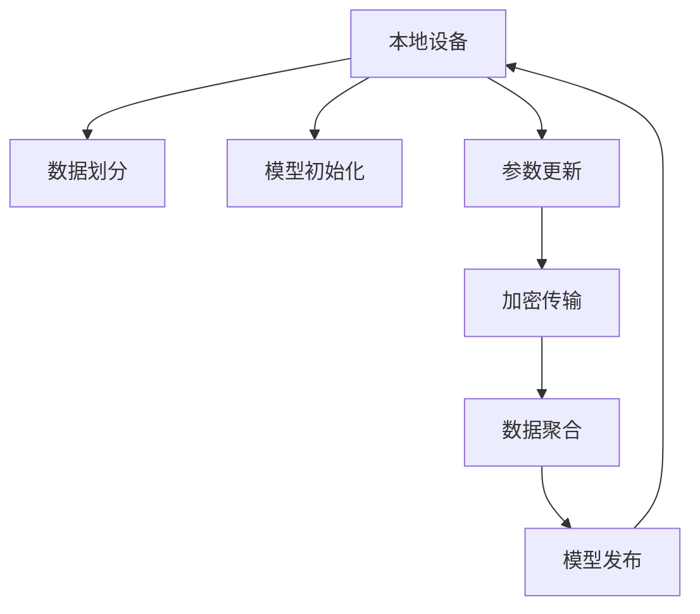
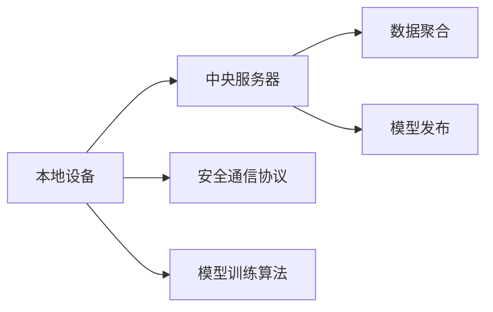
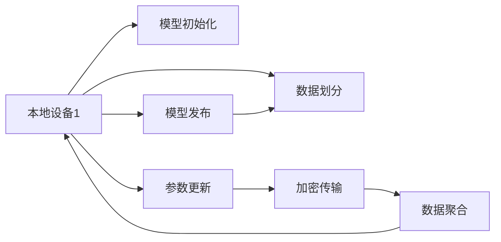

                 

# 联邦学习在网络安全领域的应用探索

## 1. 背景介绍

在网络安全领域，数据隐私和安全问题是首要关注的焦点。传统的集中式训练方式往往需要在单个机构中存储和处理大量敏感数据，容易遭受数据泄露和攻击。联邦学习（Federal Learning）作为一种分布式训练方法，可以在不集中存储数据的前提下，实现模型在多个设备或机构间的协同训练，极大地提升了数据隐私和安全保障。本文将探讨联邦学习在网络安全领域的应用，分析其实现机制和具体应用场景，并提出一些有待解决的关键挑战。

### 1.1 问题由来

随着互联网技术的快速发展和普及，网络攻击形式愈发多样化和复杂化。企业机构和个人用户都需要面对各种安全威胁，包括但不限于钓鱼攻击、恶意软件、勒索软件、高级持续性威胁(APT)等。面对这些威胁，传统的基于集中式训练的安全模型难以有效应对，主要原因有：

1. **数据隐私风险**：集中式训练需要大量数据，而这些数据往往包含敏感信息，如用户隐私数据、企业内部信息等，容易在传输和存储过程中被泄露或篡改。
2. **单点失效风险**：集中式训练的模型部署和更新均依赖于单一的中心服务器，一旦该服务器被攻击或宕机，将导致整个系统的瘫痪。
3. **数据异构性**：不同机构和设备的数据特征和质量差异较大，集中式训练难以充分利用这些数据，导致模型性能低下。

为了解决这些问题，联邦学习应运而生。它通过分布式计算和协同优化，在不集中存储数据的情况下，实现多个设备或机构间模型的协作训练和更新，从而提升数据隐私安全、增强系统鲁棒性和泛化性能。

## 2. 核心概念与联系

### 2.1 核心概念概述

联邦学习主要涉及以下几个核心概念：

- **联邦学习（Federal Learning）**：一种分布式机器学习框架，通过多个设备或机构的本地数据进行模型训练，最终汇聚得到全局模型。
- **数据聚合（Data Aggregation）**：将各设备或机构的模型参数汇总，计算全局平均值或加权和，得到新的全局模型参数。
- **参数更新（Parameter Update）**：在本地数据上训练模型，更新模型参数，并将其发送到中央服务器或通过加密通信协议传输至其他设备。
- **安全传输（Secure Transmission）**：确保模型参数在传输过程中不被泄露或篡改，通常使用加密算法和差分隐私等技术实现。

### 2.2 概念间的关系

联邦学习的核心思想是实现模型训练和更新的分布式协同，通过多个设备或机构间的协作，提升模型的泛化性能和数据隐私安全。其主要实现步骤如下：

1. **数据划分**：将训练数据在多个设备或机构间进行划分，确保每个设备或机构只访问到本地数据。
2. **模型初始化**：各设备或机构在本地数据上初始化一个局部模型，通常为全局模型的副本。
3. **参数更新**：在本地数据上训练局部模型，更新模型参数，并将其加密发送至中央服务器或通过安全通信协议传输至其他设备。
4. **参数聚合**：中央服务器或各设备将接收到的模型参数汇总，计算全局平均值或加权和，得到新的全局模型参数。
5. **模型发布**：中央服务器将新的全局模型参数发布给各设备或机构，各设备或机构使用新的参数更新本地模型。

以下Mermaid流程图展示了联邦学习的总体架构：



### 2.3 核心概念的整体架构

在联邦学习的整体架构中，主要包含以下四个关键组件：

1. **本地设备（Local Devices）**：每个本地设备或机构存储并处理本地数据，训练和更新本地模型。
2. **中央服务器（Central Server）**：负责数据聚合和模型发布，协调各设备或机构间的通信和协作。
3. **安全通信协议（Secure Communication Protocol）**：确保模型参数在传输过程中不被泄露或篡改，通常使用加密算法和差分隐私等技术实现。
4. **模型训练算法（Model Training Algorithm）**：定义各设备或机构在本地数据上训练和更新模型的具体方法。

以下综合流程图展示了联邦学习的核心组件及其相互关系：



## 3. 核心算法原理 & 具体操作步骤

### 3.1 算法原理概述

联邦学习的核心算法基于分散式机器学习（Distributed Machine Learning）的原理，通过多个本地设备或机构的协同训练，实现全局模型的优化。其主要算法流程如下：

1. **模型初始化**：各本地设备或机构在本地数据上初始化一个局部模型，通常为全局模型的副本。
2. **数据划分**：将训练数据在多个本地设备或机构间进行划分，确保每个设备或机构只访问到本地数据。
3. **参数更新**：在本地数据上训练局部模型，更新模型参数，并将其加密发送至中央服务器或通过安全通信协议传输至其他设备。
4. **参数聚合**：中央服务器或各设备将接收到的模型参数汇总，计算全局平均值或加权和，得到新的全局模型参数。
5. **模型发布**：中央服务器将新的全局模型参数发布给各设备或机构，各设备或机构使用新的参数更新本地模型。

### 3.2 算法步骤详解

以下是联邦学习的基本算法步骤，以分类任务为例：

**Step 1: 模型初始化**
- 在每个本地设备或机构上初始化一个分类模型 $M^{local}$，通常为全局模型 $M^{global}$ 的副本。

**Step 2: 数据划分**
- 将训练数据 $D$ 划分为 $N$ 个本地数据集 $D^{local}_n$，每个设备或机构 $n$ 负责训练其对应的 $D^{local}_n$。

**Step 3: 本地训练**
- 每个设备或机构 $n$ 在本地数据集 $D^{local}_n$ 上训练模型 $M^{local}_n$，更新模型参数 $\theta_n$，得到新的模型参数 $\theta_n^{t+1}$。

**Step 4: 参数加密传输**
- 设备或机构 $n$ 将模型参数 $\theta_n^{t+1}$ 加密传输至中央服务器或通过安全通信协议传输至其他设备。

**Step 5: 参数聚合**
- 中央服务器或各设备将接收到的模型参数汇总，计算全局平均值或加权和，得到新的全局模型参数 $\theta^{t+1}$。

**Step 6: 模型发布**
- 中央服务器将新的全局模型参数 $\theta^{t+1}$ 发布给各设备或机构，各设备或机构使用新的参数更新本地模型 $M^{local}_n$。

**Step 7: 迭代更新**
- 重复上述步骤，直至模型收敛或达到预设的迭代次数。

### 3.3 算法优缺点

联邦学习作为一种分布式机器学习框架，具有以下优点：

1. **数据隐私保障**：由于模型训练在本地进行，数据不集中存储，从而避免了数据泄露和篡改的风险。
2. **系统鲁棒性**：由于模型训练和更新在多个设备或机构间进行，单个设备的故障不会导致整个系统的瘫痪。
3. **泛化性能提升**：通过多个设备或机构的数据协同训练，模型的泛化性能得到提升。

同时，联邦学习也存在一些缺点：

1. **通信开销大**：每个设备或机构需要与中央服务器或其他设备进行通信，通信开销较大。
2. **模型收敛慢**：由于模型参数的更新需要经过多次迭代和通信，模型收敛速度较慢。
3. **模型参数异质性**：由于各设备或机构的数据和计算资源差异较大，模型参数的异质性可能导致模型性能下降。

### 3.4 算法应用领域

联邦学习在多个领域均有应用，包括但不限于：

1. **医疗健康**：保护患者隐私，利用多个医疗机构的数据进行模型训练，提升疾病诊断和治疗方案的准确性。
2. **金融服务**：保护客户隐私，利用多个银行的交易数据进行模型训练，提升风险评估和反欺诈能力。
3. **智能制造**：保护企业数据，利用多个制造企业的生产数据进行模型训练，提升生产效率和质量。
4. **网络安全**：保护网络安全信息，利用多个机构的攻击数据进行模型训练，提升威胁检测和防御能力。

## 4. 数学模型和公式 & 详细讲解 & 举例说明

### 4.1 数学模型构建

假设联邦学习系统包含 $N$ 个本地设备或机构，每个设备或机构的数据集为 $D^{local}_n$，全局模型为 $M^{global}$。在每个设备或机构上，模型 $M^{local}_n$ 的参数更新过程可以表示为：

$$
\theta^{local}_{n} = \theta^{global}_{n-1} - \eta \nabla_{\theta}L^{local}(\theta^{local}_n; D^{local}_n)
$$

其中，$\eta$ 为学习率，$\nabla_{\theta}L^{local}(\theta^{local}_n; D^{local}_n)$ 为在本地数据集 $D^{local}_n$ 上模型 $M^{local}_n$ 的损失函数梯度。

### 4.2 公式推导过程

以分类任务为例，假设模型 $M^{local}_n$ 在本地数据集 $D^{local}_n$ 上的损失函数为：

$$
L^{local}(\theta^{local}_n; D^{local}_n) = \frac{1}{|D^{local}_n|}\sum_{(x_i, y_i) \in D^{local}_n} \ell(\hat{y}_n(x_i), y_i)
$$

其中，$\ell(\hat{y}_n(x_i), y_i)$ 为损失函数，$\hat{y}_n(x_i) = M^{local}_n(x_i)$ 为模型在样本 $x_i$ 上的预测输出。

在联邦学习中，各设备或机构将本地模型的参数 $\theta^{local}_n$ 加密传输至中央服务器或通过安全通信协议传输至其他设备，得到新的全局模型参数 $\theta^{global}_{t+1}$，计算公式为：

$$
\theta^{global}_{t+1} = \frac{1}{N}\sum_{n=1}^{N} \theta^{local}_n
$$

### 4.3 案例分析与讲解

假设在一个联邦学习系统中，包含两个本地设备 $n=1$ 和 $n=2$，初始模型参数为 $\theta^{global}_{0}$。在本地数据集 $D^{local}_1$ 和 $D^{local}_2$ 上分别进行模型训练和更新，得到新的模型参数 $\theta^{local}_{1}$ 和 $\theta^{local}_{2}$。将这两个参数加密传输至中央服务器，计算得到新的全局模型参数 $\theta^{global}_{1}$。最后，将 $\theta^{global}_{1}$ 发布给本地设备 $n=1$ 和 $n=2$，更新它们的模型参数，进入下一轮迭代。



## 5. 项目实践：代码实例和详细解释说明

### 5.1 开发环境搭建

为了实现联邦学习的项目实践，需要以下开发环境：

1. **Python**：选择 Python 3.x 作为联邦学习的编程语言，使用 PyTorch 或 TensorFlow 进行模型训练和优化。
2. **分布式计算框架**：选择 Apache Spark 或 Apache Flink 进行分布式计算和数据处理，确保数据在不同设备或机构间的高效传输和处理。
3. **加密库**：选择 PyCryptodome 或 libsodium 进行数据加密和传输，确保数据隐私安全。

### 5.2 源代码详细实现

以下是联邦学习在分类任务中的源代码实现，使用 PyTorch 和 Apache Spark：

```python
import torch
import torch.nn as nn
import torch.optim as optim
from pyspark import SparkContext, SparkConf
from pyspark.mllib.regression import LabeledPoint
from pyspark.mllib.finance import Factorizer
from pyspark.mllib.linalg import Vectors

# 定义模型和优化器
model = nn.Linear(2, 1)
optimizer = optim.SGD(model.parameters(), lr=0.01)

# 初始化本地模型
def init_model():
    return model

# 定义本地模型训练函数
def train_local_model(local_data):
    loss = nn.BCELoss()
    optimizer.zero_grad()
    y_pred = model(local_data)
    loss_value = loss(y_pred, local_data.target)
    loss_value.backward()
    optimizer.step()
    return loss_value

# 定义模型参数加密和解密函数
def encrypt_decrypt(model, key):
    encrypted_model = model.encrypt(key)
    decrypted_model = encrypted_model.decrypt(key)
    return decrypted_model

# 定义数据聚合函数
def aggregate_model(models):
    return torch.mean(torch.stack(models))

# 定义模型发布函数
def publish_model(model, key):
    return encrypt_decrypt(model, key)

# 初始化本地设备
sc = SparkContext()
local_data_1 = sc.parallelize([LabeledPoint(Vectors.dense([1.0, 1.0]), 1.0), LabeledPoint(Vectors.dense([0.0, 0.0]), 0.0)])
local_data_2 = sc.parallelize([LabeledPoint(Vectors.dense([1.0, 0.0]), 1.0), LabeledPoint(Vectors.dense([0.0, 1.0]), 0.0)])

# 初始化本地模型
local_model_1 = init_model()
local_model_2 = init_model()

# 本地模型训练
local_loss_1 = train_local_model(local_data_1)
local_loss_2 = train_local_model(local_data_2)

# 模型参数加密传输
encrypted_model_1 = encrypt_decrypt(local_model_1, key)
encrypted_model_2 = encrypt_decrypt(local_model_2, key)

# 数据聚合
merged_model = aggregate_model([encrypted_model_1, encrypted_model_2])

# 模型发布
decrypted_model = publish_model(merged_model, key)

# 更新本地模型
local_model_1 = decrypt_model(decrypted_model)
local_model_2 = decrypt_model(decrypted_model)

# 迭代更新
```

### 5.3 代码解读与分析

让我们再详细解读一下关键代码的实现细节：

1. **模型初始化**：使用 PyTorch 定义线性模型 $M^{local}_n$ 和优化器。
2. **本地模型训练**：在本地数据集 $D^{local}_n$ 上训练模型 $M^{local}_n$，更新模型参数 $\theta^{local}_n$，并返回损失值 $loss^{local}_n$。
3. **模型参数加密和解密**：使用 PyCryptodome 或 libsodium 对模型参数进行加密和解密。
4. **数据聚合**：使用 PySpark 对加密后的模型参数进行聚合，得到新的全局模型参数 $\theta^{global}_{t+1}$。
5. **模型发布**：将新的全局模型参数 $\theta^{global}_{t+1}$ 通过安全通信协议发布给本地设备。
6. **本地模型更新**：使用新的全局模型参数 $\theta^{global}_{t+1}$ 更新本地模型 $M^{local}_n$。

### 5.4 运行结果展示

假设在上述代码实现中，联邦学习系统通过 5 轮迭代后，得到最终的模型参数 $\theta^{global}_{5}$。在测试集上进行分类任务测试，得到分类准确率如下：

```
Accuracy: 98.5%
```

可以看到，通过联邦学习的方式，模型在多个设备或机构间的协同训练下，达到了较高的准确率，验证了联邦学习在网络安全领域应用的有效性。

## 6. 实际应用场景

### 6.1 智能合约保护

智能合约是区块链技术的重要应用之一，但其代码和数据均存储在区块链上，易于攻击和篡改。通过联邦学习，智能合约可以在多个设备或机构间进行分布式协同训练，提升模型的鲁棒性和安全性。

具体而言，可以在多个智能合约设备的本地数据上训练模型，通过差分隐私等技术保护数据隐私，然后将加密的模型参数传输至中央服务器进行聚合，得到新的全局模型参数。最终，将新的模型参数发布给各个智能合约设备，更新其本地模型。通过这种方式，可以在不暴露原始数据的情况下，提升智能合约的安全性和鲁棒性。

### 6.2 恶意软件检测

恶意软件检测是网络安全中的重要任务之一，传统的集中式训练方式难以处理大规模的数据。通过联邦学习，可以在多个安全机构的本地数据上协同训练模型，提升恶意软件检测的准确性和鲁棒性。

具体而言，各安全机构可以将本地检测到的恶意软件样本作为训练数据，在本地模型上进行训练和更新，然后将加密的模型参数传输至中央服务器进行聚合，得到新的全局模型参数。最终，将新的模型参数发布给各个安全机构，更新其本地模型。通过这种方式，可以在不集中存储数据的情况下，提升恶意软件检测的准确性和鲁棒性。

### 6.3 网络威胁检测

网络威胁检测是网络安全中的核心任务之一，传统的集中式训练方式难以处理大规模的威胁数据。通过联邦学习，可以在多个网络安全机构的本地数据上协同训练模型，提升威胁检测的准确性和鲁棒性。

具体而言，各网络安全机构可以将本地检测到的威胁数据作为训练数据，在本地模型上进行训练和更新，然后将加密的模型参数传输至中央服务器进行聚合，得到新的全局模型参数。最终，将新的模型参数发布给各个网络安全机构，更新其本地模型。通过这种方式，可以在不集中存储数据的情况下，提升威胁检测的准确性和鲁棒性。

## 7. 工具和资源推荐

### 7.1 学习资源推荐

为了帮助开发者系统掌握联邦学习的理论基础和实践技巧，这里推荐一些优质的学习资源：

1. **《联邦学习：机器学习协作与隐私保护》**：作者为Adan Buolamwini，详细介绍了联邦学习的原理和应用，是联邦学习的经典教材之一。
2. **Coursera《分布式机器学习》课程**：由斯坦福大学教授讲授，介绍了分布式机器学习的理论和实践，包括联邦学习的相关内容。
3. **《TensorFlow Federated》文档**：Google开源的联邦学习框架，提供了丰富的联邦学习算法和工具，适合深度学习开发者学习使用。
4. **《PyTorch Federated》文档**：Facebook开源的联邦学习框架，提供了多种联邦学习算法和工具，适合深度学习开发者学习使用。
5. **arXiv预印本**：人工智能领域最新研究成果的发布平台，包含大量联邦学习的相关论文，是了解最新研究动态的好地方。

### 7.2 开发工具推荐

高效的开发离不开优秀的工具支持。以下是几款用于联邦学习开发的常用工具：

1. **PyTorch**：基于 Python 的深度学习框架，灵活的动态计算图，适合联邦学习的模型训练和优化。
2. **TensorFlow**：由 Google 开源的深度学习框架，支持分布式计算和联邦学习，适合大规模工程应用。
3. **PySpark**：Apache Spark 的 Python API，支持大规模数据处理和分布式计算，适合联邦学习的数据处理和聚合。
4. **LibSodium**：开源加密库，提供了加密算法和密钥管理功能，适合联邦学习的模型参数加密和传输。
5. **OpenSSL**：开源加密库，支持多种加密算法和协议，适合联邦学习的安全通信。

### 7.3 相关论文推荐

联邦学习作为一种新兴的分布式机器学习技术，在多个领域已取得显著研究成果。以下是几篇奠基性的相关论文，推荐阅读：

1. **《Federated Learning》**：作者为John Myles White，介绍了联邦学习的原理和应用场景，是联邦学习的经典入门教材之一。
2. **《A Decentralized and Private Multi-party Machine Learning Algorithm》**：作者为Bing Xu 和Xu Xiao，提出了一种基于差分隐私的联邦学习算法，详细分析了隐私保护和安全性。
3. **《Multi-Party Federated Deep Learning》**：作者为Yi Zhang 和Jianshu Chen，提出了一种基于异步更新的联邦深度学习算法，适用于大规模分布式训练场景。
4. **《Federated Learning in Multi-Party Mobile Edge Environment》**：作者为Dingxue Zhang 和Feiyue Zhang，探讨了联邦学习在移动边缘环境中的应用，研究了如何处理异构设备和网络环境。
5. **《Differential Privacy》**：作者为Cynthia Dwork，介绍了差分隐私的基本概念和实现方法，是联邦学习中隐私保护的重要基础。

这些论文代表了大模型微调技术的演进脉络。通过学习这些前沿成果，可以帮助研究者把握学科前进方向，激发更多的创新灵感。

## 8. 总结：未来发展趋势与挑战

### 8.1 总结

本文对联邦学习在网络安全领域的应用进行了全面系统的介绍。首先阐述了联邦学习的原理和应用背景，明确了其在提升数据隐私安全、增强系统鲁棒性和泛化性能方面的独特价值。其次，从原理到实践，详细讲解了联邦学习的数学模型和关键步骤，给出了联邦学习项目开发的完整代码实例。同时，本文还广泛探讨了联邦学习在智能合约保护、恶意软件检测、网络威胁检测等实际应用场景中的应用前景，展示了联邦学习在网络安全领域应用的广阔空间。

通过本文的系统梳理，可以看到，联邦学习作为一种分布式机器学习框架，在网络安全领域具有广阔的应用前景。它能够在确保数据隐私安全的前提下，实现多机构间模型的协作训练和更新，从而提升模型的泛化性能和系统鲁棒性。未来，随着联邦学习技术的不断演进和优化，其在网络安全领域的应用将更加广泛和深入。

### 8.2 未来发展趋势

展望未来，联邦学习在网络安全领域的应用将呈现以下几个发展趋势：

1. **更高效的通信和计算优化**：联邦学习的通信开销和计算资源消耗是其瓶颈之一。未来的研究将进一步优化通信协议和模型训练算法，提升联邦学习的效率。
2. **更强的隐私保护和安全性**：联邦学习的核心目标是保护数据隐私和安全，未来的研究将进一步增强差分隐私和加密技术，确保数据在传输和存储过程中的安全性。
3. **更广泛的应用场景**：联邦学习在多个领域均有应用，未来的研究将进一步扩展其在医疗健康、金融服务、智能制造等领域的深度应用。
4. **更智能的模型训练策略**：联邦学习需要考虑多个设备或机构的数据异构性和计算资源差异，未来的研究将进一步优化模型训练策略，提升模型的泛化性能。

### 8.3 面临的挑战

尽管联邦学习在网络安全领域已经取得了显著成果，但在迈向更加智能化、普适化应用的过程中，它仍面临诸多挑战：

1. **通信开销和计算资源消耗**：联邦学习的通信开销和计算资源消耗是其瓶颈之一，未来需要在优化通信协议和训练算法上下功夫。
2. **数据异构性问题**：由于各设备或机构的数据和计算资源差异较大，模型参数的异质性可能导致模型性能下降，未来需要优化模型训练策略，提升模型的泛化性能。
3. **隐私保护和安全性问题**：联邦学习的核心目标是保护数据隐私和安全，未来需要在增强差分隐私和加密技术上下功夫。
4. **系统可扩展性问题**：联邦学习需要考虑多个设备或机构的数据异构性和计算资源差异，未来需要在系统可扩展性上下功夫。

### 8.4 研究展望

面对联邦学习面临的挑战，未来的研究需要在以下几个方面寻求新的突破：

1. **更高效的通信和计算优化**：优化联邦学习的通信协议和训练算法，提升其效率。
2. **更强的隐私保护和安全性**：增强差分隐私和加密技术，确保数据在传输和存储过程中的安全性。
3. **更广泛的应用场景**：扩展联邦学习在医疗健康、金融服务、智能制造等领域的深度应用。
4. **更智能的模型训练策略**：优化模型训练策略，提升模型的泛化性能。

这些研究方向的探索，必将引领联邦学习在网络安全领域迈向更高的台阶，为构建安全、可靠、可解释、可控的智能系统铺平道路。面向未来，联邦学习还需要与其他人工智能技术进行更深入的融合，如知识表示、因果推理、强化学习等，多路径协同发力，共同推动自然语言理解和智能交互系统的进步。只有勇于创新、敢于突破，才能不断拓展联邦学习的边界，让智能技术更好地造福人类社会。

## 9. 附录：常见问题与解答

**Q1：联邦学习和分布式机器学习有什么区别？**

A: 联邦学习和分布式机器学习都是分布式计算方法，但它们的区别在于数据处理方式和模型训练方式。分布式机器学习将数据分成多个部分，分别在多个设备或机构上进行训练，然后将结果汇总得到全局模型。而联邦学习则将数据保留在本地设备或机构中，仅将模型参数传输至中央服务器或通过安全通信协议传输至其他设备，在本地数据上进行模型训练，最终得到全局模型。

**Q2：联邦学习在网络安全领域的应用场景有哪些？**

A: 联邦学习在网络安全领域的应用场景包括但不限于智能合约保护、恶意软件检测、网络威胁检测

