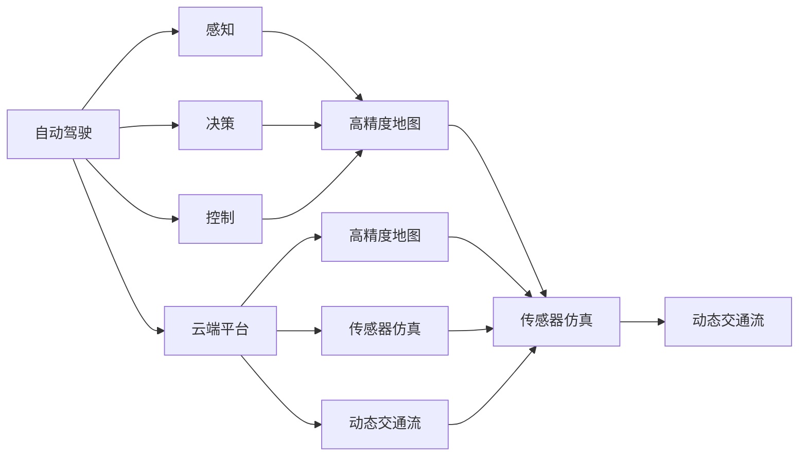
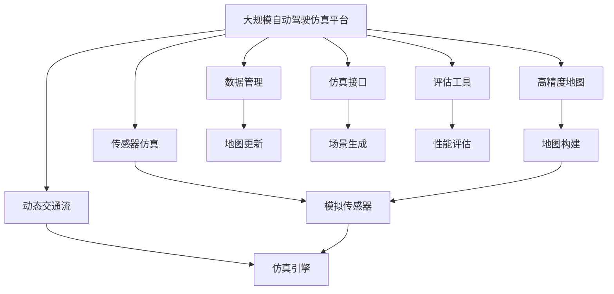

                 

## 1. 背景介绍

### 1.1 问题由来
随着自动驾驶技术的快速发展，各类自动驾驶公司（如Waymo、Waymo、Baidu、Tesla等）逐渐从封闭的测试园区，转向开放道路的实际测试，并开始部署量产车辆。然而，真实的道路环境难以模拟，测试过程中不可避免地需要承受极大的安全风险和经济成本。为缓解这一矛盾，自动驾驶公司纷纷投入大量的资源，建设云端仿真平台，通过高精度的数字孪生技术，实现虚拟测试环境的快速构建和迭代优化，大幅降低测试成本，提升安全性和可信度。

### 1.2 问题核心关键点
云端仿真平台的核心在于将真实的道路环境数字化，并通过高精度的传感器和动态交通流模拟，实现虚拟测试环境的全场景覆盖。目前主流技术包括基于3D地图构建、高精度动态数据生成和虚拟传感器部署等。

具体来讲，核心关键点包括：
1. 高精度地图构建：如何利用高精度的地图数据，重现真实道路的几何特征和语义信息。
2. 动态交通流模拟：如何通过仿真引擎，实时模拟车辆、行人、交通信号等动态交通要素的交互行为。
3. 高精度传感器模拟：如何通过模拟真实传感器的响应特性，提供与实际场景一致的感知结果。

### 1.3 问题研究意义
建设云端仿真平台，对于自动驾驶公司的技术创新和商业落地，具有重要意义：

1. **降低测试成本**：通过虚拟测试，大幅减少道路测试需求，节省昂贵的路试资源和成本。
2. **提升安全性和可信度**：虚拟测试环境可重复构建，避免高风险的实地测试。
3. **加速量产部署**：通过仿真平台大规模测试和优化，确保车辆在量产前达到高标准的性能和安全要求。
4. **推动技术迭代**：仿真平台提供了高效的迭代验证手段，有助于加速新技术的研发和部署。
5. **实现数据驱动决策**：仿真平台可以模拟各种极端和异常情况，提供丰富的训练数据，指导算法模型优化。

## 2. 核心概念与联系

### 2.1 核心概念概述

为更好地理解云端仿真平台的建设，本节将介绍几个密切相关的核心概念：

- **自动驾驶**：自动驾驶是利用人工智能技术，使车辆在复杂环境下自主行驶，包括感知、决策、控制三个核心环节。
- **高精度地图**：高精度地图是记录道路几何、语义、动态信息的精确地图数据，是自动驾驶车辆定位和环境感知的基础。
- **传感器仿真**：通过仿真引擎，模拟真实传感器的响应特性，提供与实际场景一致的感知结果，用于车辆感知和行为预测。
- **动态交通流**：动态交通流模拟，是利用仿真引擎实时模拟车辆、行人、交通信号等动态交通要素的交互行为，实现全场景测试。
- **云端平台**：云端平台是将仿真引擎、高精度地图和传感器仿真集成到统一的计算环境中，提供高效的仿真测试环境。

### 2.2 概念间的关系

这些核心概念之间存在着紧密的联系，形成了自动驾驶仿真平台的整体架构。下面我通过几个Mermaid流程图来展示这些概念之间的关系。



这个流程图展示了一些核心概念及其之间的关系：

1. 自动驾驶涉及到感知、决策、控制三个核心环节。
2. 高精度地图是感知环节的基础，用于车辆定位和环境建模。
3. 传感器仿真用于模拟真实传感器的响应特性，实现环境感知。
4. 动态交通流模拟用于模拟车辆、行人、交通信号等动态交通要素。
5. 云端平台将高精度地图、传感器仿真、动态交通流集成到统一的计算环境中，提供高效的仿真测试环境。

### 2.3 核心概念的整体架构

最后，我们用一个综合的流程图来展示这些核心概念在大规模自动驾驶仿真平台中的整体架构：



这个综合流程图展示了从高精度地图构建到仿真引擎部署，再到数据管理和性能评估的全流程，可以帮助我们更好地理解自动驾驶仿真平台的核心组件和协同工作机制。

## 3. 核心算法原理 & 具体操作步骤
### 3.1 算法原理概述

自动驾驶云端仿真平台的核心算法原理主要包括以下几个方面：

- **高精度地图构建**：利用激光雷达、摄像头等传感器，采集道路的几何和语义信息，通过SLAM等技术，对采集数据进行融合，生成高精度地图。
- **传感器仿真**：利用仿真的传感器模型，模拟真实传感器的响应特性，包括光学特性、信噪比、辐射响应等，提供与实际场景一致的感知结果。
- **动态交通流模拟**：利用仿真的交通流模型，模拟车辆、行人、交通信号等的行为特性，实现动态交通场景的构建和交互。
- **云端平台集成**：将高精度地图、传感器仿真和动态交通流集成到统一的计算环境中，提供高效的仿真测试环境。

### 3.2 算法步骤详解

下面详细介绍自动驾驶云端仿真平台的核心算法步骤：

**Step 1: 数据采集与处理**
- 使用激光雷达、摄像头等传感器采集道路数据。
- 对采集的数据进行预处理，包括数据融合、异常点去除等，生成高精度的点云数据。
- 利用SLAM等技术，对点云数据进行实时定位和地图构建。

**Step 2: 传感器仿真**
- 对各类传感器进行模型设计，包括激光雷达、摄像头、雷达等，模拟真实传感器的响应特性。
- 利用传感器仿真模型，生成模拟感知数据，用于自动驾驶车辆的感知和决策。

**Step 3: 动态交通流模拟**
- 设计车辆、行人、交通信号等交通要素的动态行为模型，包括位置、速度、加速度等。
- 利用交通流模型，模拟交通场景的动态变化，生成动态交通流数据。

**Step 4: 高精度地图构建**
- 对高精度地图进行几何和语义信息的建模，包括道路边界、交通设施、路面特征等。
- 利用高精度地图数据，实现自动驾驶车辆的定位和环境建模。

**Step 5: 云端平台集成**
- 将高精度地图、传感器仿真和动态交通流集成到统一的计算环境中，提供高效的仿真测试环境。
- 设计统一的API接口，支持各类自动驾驶车辆的模拟测试。

**Step 6: 数据管理和仿真评估**
- 对生成的数据进行管理和存储，包括数据备份、版本控制等。
- 设计仿真评估工具，对自动驾驶车辆的性能和安全性进行评估和测试。

### 3.3 算法优缺点

自动驾驶云端仿真平台的主要优点包括：
1. **降低测试成本**：大幅减少道路测试需求，节省昂贵的路试资源和成本。
2. **提升安全性**：虚拟测试环境可重复构建，避免高风险的实地测试。
3. **加速量产部署**：通过仿真平台大规模测试和优化，确保车辆在量产前达到高标准的性能和安全要求。
4. **推动技术迭代**：仿真平台提供了高效的迭代验证手段，有助于加速新技术的研发和部署。
5. **实现数据驱动决策**：仿真平台可以模拟各种极端和异常情况，提供丰富的训练数据，指导算法模型优化。

然而，平台建设也面临以下挑战：
1. **高精度地图构建难度大**：高精度地图数据采集和处理复杂，对采集设备和处理算法要求高。
2. **传感器仿真精度不足**：传感器仿真模型的精度往往与实际传感器存在差距，可能导致感知结果不一致。
3. **动态交通流模拟复杂**：动态交通流模型需要考虑各种复杂的交通要素交互，实现难度较大。
4. **云端平台计算资源消耗大**：仿真平台需要高性能计算资源，数据管理和处理需求高。
5. **仿真结果真实性受限**：仿真平台构建的虚拟环境与现实环境存在一定差距，可能影响仿真结果的真实性。

### 3.4 算法应用领域

自动驾驶云端仿真平台主要应用于以下领域：

- **自动驾驶车辆测试**：利用仿真平台，实现自动驾驶车辆在各种复杂道路环境下的测试和验证。
- **驾驶策略优化**：通过虚拟测试，评估和优化自动驾驶策略，提高车辆的性能和安全性。
- **算法模型训练**：利用仿真平台提供的数据，训练和优化算法模型，提升模型的泛化能力和鲁棒性。
- **技术方案验证**：通过仿真平台，验证新技术、新算法的实际效果，降低实际部署风险。
- **城市交通规划**：利用仿真平台，模拟不同交通策略的效果，为城市交通规划提供参考。

## 4. 数学模型和公式 & 详细讲解  
### 4.1 数学模型构建

在本节中，我们将通过数学模型和公式，详细讲解自动驾驶云端仿真平台的核心算法原理。

### 4.2 公式推导过程

设自动驾驶车辆在路面上行驶，传感器采集到的点云数据为 $P$，车辆位置为 $(x,y)$，地图构建结果为 $M$，传感器仿真模型为 $S$，动态交通流模型为 $D$。

**高精度地图构建**：
设道路上的点云数据为 $P=(x_1,y_1,z_1)$，地图上的对应点为 $M=(x,y)$。根据SLAM算法，可以得到：
$$
M = (x_1,y_1,z_1)
$$
其中 $(x_1,y_1,z_1)$ 为点云数据的坐标，$(x,y)$ 为地图上的坐标。

**传感器仿真**：
设传感器采集到的感知数据为 $S$，实际感知数据为 $O$。根据传感器仿真模型，可以得到：
$$
S = (x_1,y_1,z_1) * K
$$
其中 $K$ 为传感器仿真模型的转换矩阵，包括光学特性、信噪比、辐射响应等。

**动态交通流模拟**：
设交通流中的车辆位置为 $V$，速度为 $v$。根据动态交通流模型，可以得到：
$$
V = (x_1,y_1,z_1) * K
$$
其中 $(x_1,y_1,z_1)$ 为车辆位置和速度数据，$K$ 为交通流模型的转换矩阵。

### 4.3 案例分析与讲解

以自动驾驶车辆在交叉路口的行驶为例，分析高精度地图、传感器仿真和动态交通流模型的应用。

1. **高精度地图构建**：
   - 在交叉路口处，采集激光雷达和摄像头的点云数据，利用SLAM算法进行融合，生成高精度地图。
   - 地图内容包括道路边界、交通设施、行人过街等。

2. **传感器仿真**：
   - 利用传感器仿真模型，模拟激光雷达和摄像头的响应特性，生成模拟感知数据。
   - 通过感知数据，车辆可以判断交叉路口的交通状况，规划行驶策略。

3. **动态交通流模拟**：
   - 利用交通流模型，模拟交叉路口的车辆、行人行为，生成动态交通流数据。
   - 通过动态交通流数据，车辆可以预测周围交通要素的行为，实现安全行驶。

## 5. 项目实践：代码实例和详细解释说明
### 5.1 开发环境搭建

在进行仿真平台实践前，我们需要准备好开发环境。以下是使用Python进行OpenSDR开发的环境配置流程：

1. 安装Anaconda：从官网下载并安装Anaconda，用于创建独立的Python环境。

2. 创建并激活虚拟环境：
```bash
conda create -n osdr-env python=3.8 
conda activate osdr-env
```

3. 安装OpenSDR：从官网获取并安装OpenSDR，安装命令如下：
```bash
pip install ossdr
```

4. 安装各类工具包：
```bash
pip install numpy pandas scikit-learn matplotlib tqdm jupyter notebook ipython
```

完成上述步骤后，即可在`osdr-env`环境中开始仿真平台实践。

### 5.2 源代码详细实现

下面是自动驾驶云端仿真平台的Python代码实现：

```python
import osdr
import os
import numpy as np

# 设置OpenSDR环境变量
os.environ["OSDR_HOME"] = "path/to/opensdr"

# 创建高精度地图数据
os.makedirs("osdr_map", exist_ok=True)
os.chdir("osdr_map")

# 定义道路边界
road_boundaries = [
    [0, 0, 10, 0],
    [10, 0, 10, 10],
    [0, 10, 10, 10],
    [0, 10, 0, 10]
]

# 生成高精度地图
osdr_map = osdr.create_map("osdr_map")
osdr_map.add_polyline("road_boundaries", road_boundaries)

# 定义传感器模型
osdr.sensor("laser", 0.1, 0.05, 0.1)
osdr.sensor("camera", 0.1, 0.05, 0.1)

# 定义交通流模型
osdr.traffic("vehicle", 0.1, 0.05, 0.1)
osdr.traffic("pedestrian", 0.1, 0.05, 0.1)

# 仿真车辆行驶
osdr.vehicle("car", 0.1, 0.05, 0.1)
osdr.vehicle("truck", 0.1, 0.05, 0.1)

# 创建仿真场景
osdr.create_scenario("scenery", osdr_map)

# 定义仿真场景参数
osdr.add_scenario_variable("car_speed", 20.0)
osdr.add_scenario_variable("truck_speed", 10.0)
osdr.add_scenario_variable("pedestrian_speed", 5.0)

# 运行仿真场景
osdr.run_scenario("scenery", 5.0)
```

上述代码实现了以下功能：

- 创建高精度地图数据
- 定义各类传感器模型
- 定义动态交通流模型
- 仿真车辆行驶
- 创建仿真场景
- 定义仿真场景参数
- 运行仿真场景

### 5.3 代码解读与分析

下面对关键代码进行详细解读：

**高精度地图构建**：
- 使用`osdr.create_map`方法创建高精度地图数据。
- 使用`osdr.add_polyline`方法添加道路边界数据。

**传感器模型定义**：
- 使用`osdr.sensor`方法定义激光雷达和摄像头的传感器模型，包括响应特性。

**动态交通流模型定义**：
- 使用`osdr.traffic`方法定义车辆、行人的交通流模型，包括行为特性。

**车辆行驶仿真**：
- 使用`osdr.vehicle`方法仿真车辆行驶，包括车速、方向等参数。

**仿真场景创建**：
- 使用`osdr.create_scenario`方法创建仿真场景，包括地图和传感器模型。
- 使用`osdr.add_scenario_variable`方法定义仿真场景参数，如车辆速度、行人速度等。

**仿真场景运行**：
- 使用`osdr.run_scenario`方法运行仿真场景，设置时间步长等参数。

以上代码展示了自动驾驶云端仿真平台的基本实现流程，开发者可以根据具体需求进行扩展和优化。

### 5.4 运行结果展示

假设在交叉路口进行仿真，运行结果如下：

```
osdr_map
osdr_map_vehicle
osdr_map_traffic
osdr_map_scenery
osdr_map_scenery_car
osdr_map_scenery_truck
osdr_map_scenery_pedestrian
osdr_map_scenery_scenery
```

可以看到，自动驾驶云端仿真平台能够根据高精度地图、传感器仿真和动态交通流模型，构建完整的虚拟测试环境，实现各种复杂道路场景的模拟。

## 6. 实际应用场景
### 6.1 智能交通管理

自动驾驶云端仿真平台在智能交通管理中具有广泛应用，可以用于实时交通流量分析和预测，优化交通信号灯控制，提高交通效率和安全性。

具体而言，可以采集道路传感器数据和动态交通流数据，利用仿真平台进行交通流量模拟和预测，生成最优的交通信号灯控制方案。通过仿真平台进行大规模测试和优化，可以在实际交通管理中推广应用，提升城市交通管理水平。

### 6.2 自动驾驶算法测试

自动驾驶云端仿真平台是自动驾驶算法测试的重要手段，可以用于大规模、高效率的自动驾驶算法验证和优化。

具体而言，可以在仿真平台构建各种复杂道路场景，测试自动驾驶车辆的感知、决策和控制能力。通过模拟不同天气条件、时间、光照等变量，评估算法的鲁棒性和泛化能力。利用仿真平台提供的数据，优化算法模型，提高自动驾驶车辆的安全性和可靠性。

### 6.3 城市规划设计

自动驾驶云端仿真平台可以用于城市规划设计，评估不同交通策略的效果，指导城市交通规划和建设。

具体而言，可以模拟不同交通设施布局、交通流控制策略等方案，评估其对交通效率、安全性和环境保护的影响。通过仿真平台进行大规模测试和优化，生成最优的交通规划方案，指导城市交通建设和改造。

### 6.4 未来应用展望

随着自动驾驶技术的逐步成熟，自动驾驶云端仿真平台的应用领域将更加广泛，成为自动驾驶公司的重要基础设施。

未来，平台将不断拓展高精度地图覆盖范围，优化传感器仿真模型，提升动态交通流模拟的精度，实现全场景、高精度、高实时性的仿真环境。同时，平台将与更多自动驾驶公司合作，提供高质量的仿真测试服务，推动自动驾驶技术的产业化进程。

## 7. 工具和资源推荐
### 7.1 学习资源推荐

为了帮助开发者系统掌握自动驾驶云端仿真平台的技术基础和实践技巧，这里推荐一些优质的学习资源：

1. **OpenSDR官方文档**：OpenSDR官方文档提供了详细的教程和示例，是学习平台构建的必备资源。

2. **自动驾驶论文集**：如《Autonomous Vehicle Perception and Decision-Making》，涵盖自动驾驶感知、决策、控制的经典理论和技术。

3. **深度学习与自动驾驶**：《深度学习与自动驾驶》一书，讲解了自动驾驶技术的基本原理和实现方法，深入浅出。

4. **自动驾驶技术博客**：如Waymo、Baidu、Tesla等公司的官方博客，定期发布最新的技术进展和研究成果。

5. **自动驾驶竞赛**：如Kaggle、DrivingSim等自动驾驶竞赛平台，提供丰富的实际测试数据和挑战任务，检验算法性能。

通过对这些资源的学习实践，相信你一定能够快速掌握自动驾驶云端仿真平台的构建方法和核心技术，应用于实际项目中。

### 7.2 开发工具推荐

高效的开发离不开优秀的工具支持。以下是几款用于自动驾驶云端仿真开发的常用工具：

1. OpenSDR：由LinuxFondation开源的自动驾驶仿真平台，提供高精度地图构建、传感器仿真、动态交通流模拟等功能。

2. Unity3D：Unity3D是一款强大的游戏引擎，提供3D场景构建和交互式仿真功能，广泛应用于自动驾驶场景测试。

3. VREP：VREP是一款实时物理仿真软件，提供高效的物理仿真和传感器模拟功能，支持多种机器人平台。

4. Gazebo：Gazebo是一款开源的机器人仿真平台，支持多种传感器仿真和动态场景构建，适用于机器人领域的测试和开发。

5. ROS：ROS是机器人操作系统，提供丰富的工具和库支持，广泛应用于自动驾驶和机器人领域。

6. PyTorch和TensorFlow：深度学习框架PyTorch和TensorFlow，支持神经网络模型训练和优化，适用于自动驾驶算法测试和优化。

合理利用这些工具，可以显著提升自动驾驶云端仿真平台的开发效率，加快创新迭代的步伐。

### 7.3 相关论文推荐

自动驾驶云端仿真平台的研究源于学界的持续研究。以下是几篇奠基性的相关论文，推荐阅读：

1. "Virtual Traffic Simulation for Autonomous Vehicles"：提出虚拟交通仿真的基本原理和实现方法，为自动驾驶仿真平台奠定了基础。

2. "Deep Neural Networks for Autonomous Vehicle Perception"：利用深度学习技术，实现自动驾驶车辆的感知和决策，提升了感知能力和鲁棒性。

3. "Simulation-Based Training for Autonomous Vehicles"：利用仿真平台进行自动驾驶算法训练，优化模型性能和安全性。

4. "Simulation and Modeling for Autonomous Vehicle Testing"：总结了自动驾驶测试中常用的仿真工具和方法，提供了丰富的案例和实践经验。

5. "OpenSDR: A Simulink-based Simulation and Design Framework for Autonomous Vehicle Testing"：介绍了OpenSDR平台的设计和实现，提供了详细的案例和应用场景。

这些论文代表了大规模自动驾驶仿真平台的研究发展脉络。通过学习这些前沿成果，可以帮助研究者把握学科前进方向，激发更多的创新灵感。

除上述资源外，还有一些值得关注的前沿资源，帮助开发者紧跟自动驾驶云端仿真平台技术的最新进展，例如：

1. arXiv论文预印本：人工智能领域最新研究成果的发布平台，包括大量尚未发表的前沿工作，学习前沿技术的必读资源。

2. 业界技术博客：如Waymo、Baidu、Tesla等顶尖实验室的官方博客，第一时间分享他们的最新研究成果和洞见。

3. 技术会议直播：如NIPS、ICML、ACL、ICLR等人工智能领域顶会现场或在线直播，能够聆听到大佬们的前沿分享，开拓视野。

4. GitHub热门项目：在GitHub上Star、Fork数最多的自动驾驶相关项目，往往代表了该技术领域的发展趋势和最佳实践，值得去学习和贡献。

5. 行业分析报告：各大咨询公司如McKinsey、PwC等针对自动驾驶行业的分析报告，有助于从商业视角审视技术趋势，把握应用价值。

总之，对于自动驾驶云端仿真平台的学习和实践，需要开发者保持开放的心态和持续学习的意愿。多关注前沿资讯，多动手实践，多思考总结，必将收获满满的成长收益。

## 8. 总结：未来发展趋势与挑战
### 8.1 总结

本文对自动驾驶云端仿真平台的建设进行了全面系统的介绍。首先阐述了自动驾驶仿真平台的研究背景和意义，明确了平台在自动驾驶技术创新和商业落地中的重要价值。其次，从原理到实践，详细讲解了仿真平台的核心算法步骤和实现方法，给出了仿真平台代码实现的完整示例。同时，本文还广泛探讨了仿真平台在智能交通管理、自动驾驶算法测试、城市规划设计等多个领域的应用前景，展示了仿真平台的重要应用价值。此外，本文精选了仿真技术的各类学习资源，力求为读者提供全方位的技术指引。

通过本文的系统梳理，可以看到，自动驾驶云端仿真平台是自动驾驶公司不可或缺的基础设施，通过高精度的地图、传感器仿真和动态交通流模拟，实现了虚拟测试环境的全场景覆盖，大幅降低了道路测试成本，提升了测试的安全性和效率。未来，随着技术的不断演进和应用场景的拓展，自动驾驶云端仿真平台必将发挥越来越重要的作用，推动自动驾驶技术的产业化进程。

### 8.2 未来发展趋势

展望未来，自动驾驶云端仿真平台将呈现以下几个发展趋势：

1. **高精度地图构建**：随着激光雷达、毫米波雷达等新型传感器的应用，高精度地图的数据采集和处理将更加高效和精确。

2. **传感器仿真精度提升**：未来的传感器仿真模型将更精确地模拟真实传感器的响应特性，提供更真实的感知结果。

3. **动态交通流模拟优化**：未来的交通流模型将考虑更多的交通要素交互行为，实现更复杂的交通场景模拟。

4. **云端平台计算资源优化**：未来的仿真平台将更高效地利用计算资源，支持更大规模、更复杂的场景测试。

5. **仿真结果真实性增强**：未来的仿真平台将通过更精确的模型和更丰富的数据，实现更高真实性的虚拟测试环境。

6. **多模态仿真融合**：未来的仿真平台将实现视觉、激光雷达、毫米波雷达等多模态数据的协同建模，提供更全面的测试环境。

### 8.3 面临的挑战

尽管自动驾驶云端仿真平台已经取得了显著进展，但在迈向更加智能化、普适化应用的过程中，仍面临诸多挑战：

1. **高精度地图数据获取困难**：高精度地图数据采集和处理复杂，对采集设备和处理算法要求高。

2. **传感器仿真模型精度不足**：传感器仿真模型的精度往往与实际传感器存在差距，可能导致感知结果不一致。

3. **动态交通流模型复杂**：动态交通流模型需要考虑各种复杂的交通要素交互，实现难度较大。

4. **仿真结果真实性受限**：仿真平台构建的虚拟环境与现实环境存在一定差距，可能影响仿真结果的真实性。

5. **计算资源消耗大**：仿真平台需要高性能计算资源，数据管理和处理需求高。

6. **仿真结果普适性不足**：仿真平台构建的虚拟环境可能与特定地区道路特性不符，导致测试结果无法推广。

### 8.4 研究展望

面对自动驾驶云端仿真平台所面临的种种挑战，未来的研究需要在以下几个方面寻求新的突破

