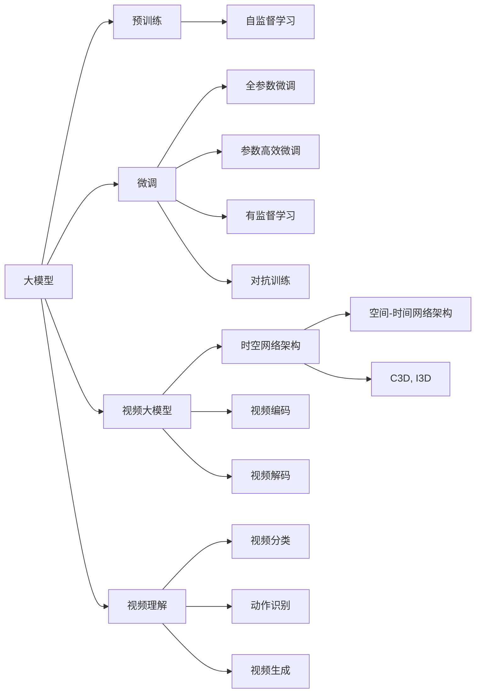
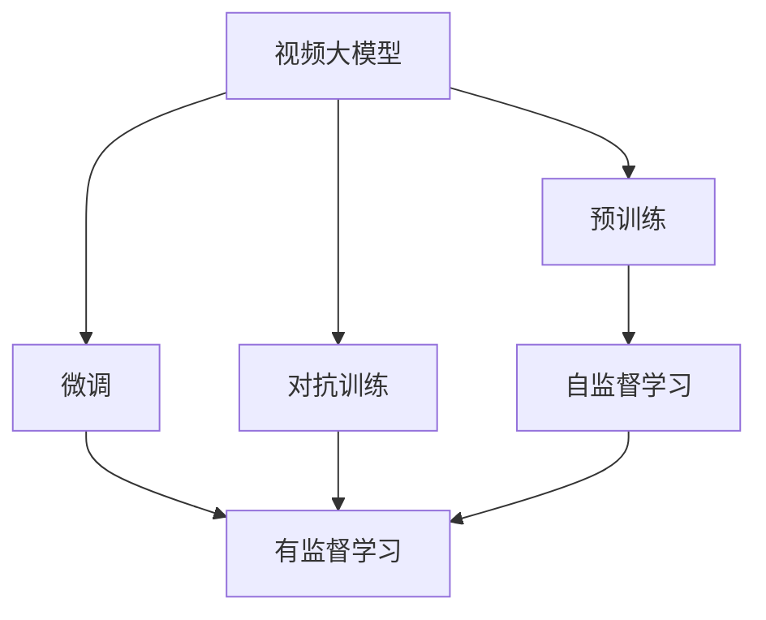
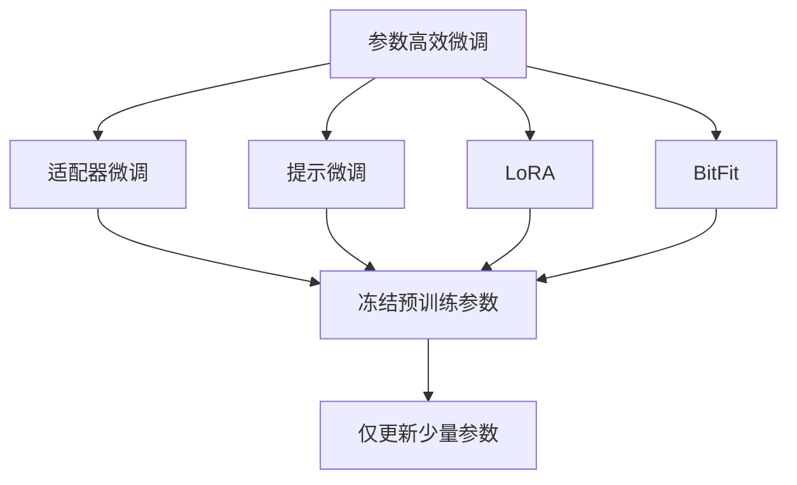
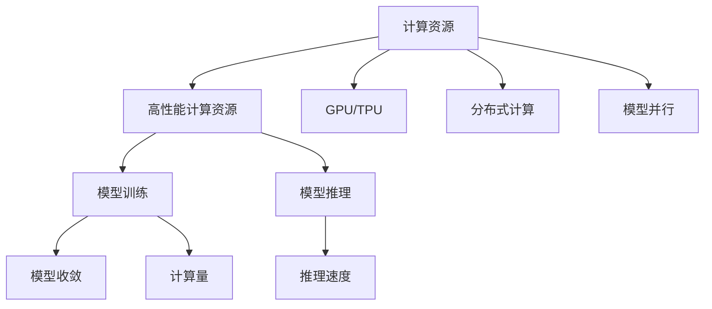
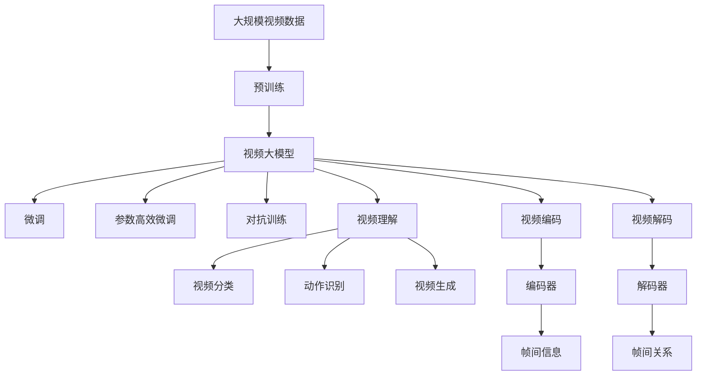

                 

# 视频大模型的工程技术详解

## 1. 背景介绍

### 1.1 问题由来
近年来，随着深度学习技术的快速发展，大模型在各个领域的应用愈发广泛。尤其是在视频处理领域，大模型的卓越性能得到了越来越多的关注。视频大模型不仅能够处理高分辨率、高帧率的视频数据，还能自动学习视频的语义、动作、场景等抽象信息，广泛应用于视频编解码、视频理解、视频生成等任务。

视频大模型的核心在于通过深度神经网络对视频序列进行建模，学习视频帧之间的时空关系，从而实现视频信息的深度理解和处理。相较于传统的小规模模型，视频大模型具有更大的参数量、更强的表达能力和更广泛的应用场景。

### 1.2 问题核心关键点
视频大模型的关键技术点主要包括以下几个方面：

- **自监督学习**：视频大模型通常基于大规模无标签视频数据进行预训练，通过自监督任务（如时间顺序预测、帧间动作匹配等）学习视频序列的表示。
- **空间-时间网络架构**：视频大模型通常采用类似Transformer的空间-时间架构，能够有效处理视频的时序信息。
- **参数高效优化**：由于视频大模型参数量巨大，如何高效优化模型，避免过拟合，成为重要研究方向。
- **视频理解与生成**：视频大模型通过学习视频语义，能够实现视频的分类、动作识别、视频生成等高层次任务。
- **计算资源要求**：视频大模型的计算资源需求极高，如何提升模型训练和推理效率，也是重要的研究课题。

### 1.3 问题研究意义
研究视频大模型的工程技术，对于提升视频处理应用的性能，拓展大模型在视频领域的适用性，具有重要意义：

1. **提升视频处理性能**：视频大模型通过学习视频语义，能够在视频分类、动作识别、视频生成等任务上取得优异性能。
2. **拓展应用场景**：大模型在视频领域的广泛应用，可以推动医疗影像分析、智能监控、虚拟现实等新兴领域的快速发展。
3. **加速产业落地**：通过预训练-微调范式，大模型可以快速适配特定应用，缩短开发周期，降低开发成本。
4. **技术创新**：大模型在视频领域的探索，催生了新的研究方向，如视频自监督学习、视频理解与生成等。

## 2. 核心概念与联系

### 2.1 核心概念概述

为了更好地理解视频大模型的工程技术，本节将介绍几个关键核心概念及其相互关系：

- **大模型**：以自回归(如GPT)或自编码(如BERT)模型为代表的大规模预训练模型。通过在大规模无标签数据上进行预训练，学习通用的语言表示。
- **视频大模型**：在处理视频数据时表现突出的深度神经网络模型。通常使用空间-时间架构，能够有效处理视频的时序信息。
- **预训练**：在大规模无标签数据上，通过自监督学习任务训练模型的过程。常用的预训练任务包括时间顺序预测、帧间动作匹配等。
- **微调(Fine-tuning)**：在预训练模型基础上，使用下游任务的少量标注数据，通过有监督学习优化模型在特定任务上的性能。
- **参数高效微调(PEFT)**：在微调过程中，只更新少量的模型参数，而固定大部分预训练权重不变，以提高微调效率，避免过拟合。
- **对抗训练**：加入对抗样本，提高模型鲁棒性。
- **视频理解**：通过学习视频语义，实现视频的分类、动作识别、视频生成等高层次任务。
- **视频生成**：通过学习视频语义，生成新视频片段或完整的自然视频。
- **时空网络架构**：一种能够有效处理视频时空信息的深度神经网络架构，如C3D、I3D等。
- **计算资源**：视频大模型通常需要高性能计算资源，如GPU/TPU等。

这些核心概念之间的逻辑关系可以通过以下Mermaid流程图来展示：



这个流程图展示了视频大模型从预训练到微调，再到具体任务应用的全过程。通过理解这些核心概念，我们可以更好地把握视频大模型的工程技术细节。

### 2.2 概念间的关系

这些核心概念之间存在着紧密的联系，形成了视频大模型工程技术的完整生态系统。下面我们通过几个Mermaid流程图来展示这些概念之间的关系。

#### 2.2.1 视频大模型的学习范式



这个流程图展示了视频大模型的主要学习范式，即通过预训练和微调过程，不断优化模型在视频理解任务上的表现。预训练通过自监督学习任务训练模型，微调和对抗训练则通过有监督学习任务进一步提升模型在特定任务上的性能。

#### 2.2.2 参数高效微调方法



这个流程图展示了几种常见的参数高效微调方法，包括适配器微调、提示微调、LoRA和BitFit。这些方法的共同特点是冻结大部分预训练参数，只更新少量参数，从而提高微调效率。

#### 2.2.3 计算资源与模型效率



这个流程图展示了计算资源对视频大模型训练和推理效率的影响。高性能计算资源（如GPU/TPU）、分布式计算和模型并行等技术，显著提升了模型训练和推理的速度和效率。

### 2.3 核心概念的整体架构

最后，我们用一个综合的流程图来展示这些核心概念在大模型工程中的整体架构：



这个综合流程图展示了从预训练到微调，再到视频理解任务应用的全过程。通过这些流程图，我们可以更清晰地理解视频大模型工程技术的各个环节，为后续深入讨论具体的工程技术细节奠定基础。

## 3. 核心算法原理 & 具体操作步骤
### 3.1 算法原理概述

视频大模型的核心在于通过深度神经网络对视频序列进行建模，学习视频帧之间的时空关系。其核心算法原理包括以下几个关键步骤：

1. **视频数据预处理**：将原始视频数据转换为模型可以处理的形式，如将视频帧转化为帧序列。
2. **自监督学习**：在预训练阶段，使用自监督学习任务训练模型，学习视频序列的表示。
3. **微调**：在预训练模型基础上，使用下游任务的少量标注数据，通过有监督学习优化模型在特定任务上的性能。
4. **对抗训练**：加入对抗样本，提高模型鲁棒性。
5. **参数高效微调**：在微调过程中，只更新少量的模型参数，以提高微调效率，避免过拟合。
6. **视频理解与生成**：通过学习视频语义，实现视频的分类、动作识别、视频生成等高层次任务。

### 3.2 算法步骤详解

视频大模型的工程实现通常包括以下几个关键步骤：

**Step 1: 准备预训练模型和数据集**
- 选择合适的预训练视频大模型作为初始化参数，如X3D、C3D等。
- 准备下游任务的视频数据集，划分为训练集、验证集和测试集。一般要求视频数据与预训练数据的分布不要差异过大。

**Step 2: 添加任务适配层**
- 根据任务类型，在预训练模型顶层设计合适的输出层和损失函数。
- 对于分类任务，通常在顶层添加线性分类器和交叉熵损失函数。
- 对于生成任务，通常使用语言模型的解码器输出概率分布，并以负对数似然为损失函数。

**Step 3: 设置微调超参数**
- 选择合适的优化算法及其参数，如AdamW、SGD等，设置学习率、批大小、迭代轮数等。
- 设置正则化技术及强度，包括权重衰减、Dropout、Early Stopping等。
- 确定冻结预训练参数的策略，如仅微调顶层，或全部参数都参与微调。

**Step 4: 执行梯度训练**
- 将训练集数据分批次输入模型，前向传播计算损失函数。
- 反向传播计算参数梯度，根据设定的优化算法和学习率更新模型参数。
- 周期性在验证集上评估模型性能，根据性能指标决定是否触发 Early Stopping。
- 重复上述步骤直到满足预设的迭代轮数或 Early Stopping 条件。

**Step 5: 测试和部署**
- 在测试集上评估微调后模型 $M_{\hat{\theta}}$ 的性能，对比微调前后的精度提升。
- 使用微调后的模型对新视频片段进行推理预测，集成到实际的应用系统中。
- 持续收集新的视频数据，定期重新微调模型，以适应数据分布的变化。

以上是视频大模型工程的一般流程。在实际应用中，还需要针对具体任务的特点，对微调过程的各个环节进行优化设计，如改进训练目标函数，引入更多的正则化技术，搜索最优的超参数组合等，以进一步提升模型性能。

### 3.3 算法优缺点

视频大模型的工程技术具有以下优点：
1. **模型性能强**：视频大模型通过学习视频语义，能够在视频分类、动作识别、视频生成等任务上取得优异性能。
2. **适用性广**：可以应用于医疗影像分析、智能监控、虚拟现实等众多视频处理领域。
3. **效率高**：通过预训练-微调范式，可以快速适配特定应用，缩短开发周期。
4. **通用性强**：适用于不同尺度和分辨率的视频，具有较强的泛化能力。

同时，视频大模型的工程技术也存在以下缺点：
1. **计算资源需求高**：视频大模型通常需要高性能计算资源，如GPU/TPU等。
2. **过拟合风险高**：由于模型参数量巨大，需要谨慎设置微调超参数，避免过拟合。
3. **数据依赖性强**：微调效果很大程度上取决于标注数据的质量和数量，获取高质量标注数据的成本较高。
4. **模型复杂度高**：模型结构复杂，推理计算量较大，对硬件资源要求高。

尽管存在这些局限性，但就目前而言，视频大模型工程技术仍是大视频处理领域的主流范式。未来相关研究的重点在于如何进一步降低计算资源需求，提高模型泛化性和鲁棒性，同时兼顾模型的可解释性和效率性。

### 3.4 算法应用领域

视频大模型的工程技术已经广泛应用于以下几个领域：

- **视频分类**：如视频中物体的分类、视频场景的识别等。通过微调模型，使其能够识别视频中的特定对象。
- **动作识别**：如视频中人的动作识别，通过微调模型，使其能够准确识别视频中的人体动作。
- **视频生成**：如生成连续的视频片段或完整的自然视频，通过微调模型，使其能够生成符合特定风格或语义的视频。
- **视频理解**：如视频的语义理解、情感分析等。通过微调模型，使其能够理解视频中的情感和情境。
- **视频编解码**：如视频的压缩和重建。通过微调模型，使其能够更有效地压缩和解压缩视频。

此外，视频大模型技术还在更多创新场景中得到了应用，如视频搜索引擎、视频增强、视频摘要等，为视频处理技术带来了新的突破。随着预训练模型和微调方法的不断进步，相信视频大模型技术将在更广阔的应用领域大放异彩。

## 4. 数学模型和公式 & 详细讲解  
### 4.1 数学模型构建

本节将使用数学语言对视频大模型的工程技术进行更加严格的刻画。

记视频大模型为 $M_{\theta}$，其中 $\theta$ 为模型参数。假设微调任务的训练集为 $D=\{(x_i,y_i)\}_{i=1}^N$，其中 $x_i$ 表示视频帧序列，$y_i$ 表示视频的分类标签或动作标签。

定义模型 $M_{\theta}$ 在视频数据 $x$ 上的损失函数为 $\ell(M_{\theta}(x),y)$，则在数据集 $D$ 上的经验风险为：

$$
\mathcal{L}(\theta) = \frac{1}{N} \sum_{i=1}^N \ell(M_{\theta}(x_i),y_i)
$$

微调的优化目标是最小化经验风险，即找到最优参数：

$$
\theta^* = \mathop{\arg\min}_{\theta} \mathcal{L}(\theta)
$$

在实践中，我们通常使用基于梯度的优化算法（如AdamW、SGD等）来近似求解上述最优化问题。设 $\eta$ 为学习率，$\lambda$ 为正则化系数，则参数的更新公式为：

$$
\theta \leftarrow \theta - \eta \nabla_{\theta}\mathcal{L}(\theta) - \eta\lambda\theta
$$

其中 $\nabla_{\theta}\mathcal{L}(\theta)$ 为损失函数对参数 $\theta$ 的梯度，可通过反向传播算法高效计算。

### 4.2 公式推导过程

以下我们以视频分类任务为例，推导交叉熵损失函数及其梯度的计算公式。

假设模型 $M_{\theta}$ 在输入视频 $x$ 上的输出为 $\hat{y}=M_{\theta}(x) \in [0,1]^C$，其中 $C$ 为类别数。真实标签 $y \in \{1,2,\cdots,C\}$。则二分类交叉熵损失函数定义为：

$$
\ell(M_{\theta}(x),y) = -\sum_{c=1}^C y_c\log \hat{y}_c
$$

将其代入经验风险公式，得：

$$
\mathcal{L}(\theta) = -\frac{1}{N}\sum_{i=1}^N \sum_{c=1}^C y_{ic}\log \hat{y}_{ic}
$$

根据链式法则，损失函数对参数 $\theta_k$ 的梯度为：

$$
\frac{\partial \mathcal{L}(\theta)}{\partial \theta_k} = -\frac{1}{N}\sum_{i=1}^N \sum_{c=1}^C \frac{y_{ic}}{\hat{y}_{ic}} \frac{\partial \hat{y}_{ic}}{\partial \theta_k}
$$

其中 $\frac{\partial \hat{y}_{ic}}{\partial \theta_k}$ 可进一步递归展开，利用自动微分技术完成计算。

在得到损失函数的梯度后，即可带入参数更新公式，完成模型的迭代优化。重复上述过程直至收敛，最终得到适应下游任务的最优模型参数 $\theta^*$。

## 5. 项目实践：代码实例和详细解释说明
### 5.1 开发环境搭建

在进行视频大模型微调实践前，我们需要准备好开发环境。以下是使用Python进行PyTorch开发的环境配置流程：

1. 安装Anaconda：从官网下载并安装Anaconda，用于创建独立的Python环境。

2. 创建并激活虚拟环境：
```bash
conda create -n pytorch-env python=3.8 
conda activate pytorch-env
```

3. 安装PyTorch：根据CUDA版本，从官网获取对应的安装命令。例如：
```bash
conda install pytorch torchvision torchaudio cudatoolkit=11.1 -c pytorch -c conda-forge
```

4. 安装Transformers库：
```bash
pip install transformers
```

5. 安装各类工具包：
```bash
pip install numpy pandas scikit-learn matplotlib tqdm jupyter notebook ipython
```

完成上述步骤后，即可在`pytorch-env`环境中开始微调实践。

### 5.2 源代码详细实现

下面我们以视频分类任务为例，给出使用Transformers库对X3D模型进行微调的PyTorch代码实现。

首先，定义数据处理函数：

```python
from transformers import X3DForVideoClassification, X3DFeatureExtractor
from torch.utils.data import Dataset
import torch

class VideoDataset(Dataset):
    def __init__(self, videos, labels):
        self.videos = videos
        self.labels = labels
        
    def __len__(self):
        return len(self.videos)
    
    def __getitem__(self, item):
        video = self.videos[item]
        label = self.labels[item]
        
        # 加载视频数据
        video_tensor = video_tensor[:, :, :3, :].to(device)
        
        # 对标签进行编码
        encoded_labels = torch.tensor(label, dtype=torch.long).to(device)
        
        return {'video': video_tensor, 
                'labels': encoded_labels}

# 加载数据
videos = [video_data]
labels = [label_data]

tokenizer = X3DFeatureExtractor.from_pretrained('x3d-rgb', apply_length=True)
dataset = VideoDataset(videos, labels)
dataloader = DataLoader(dataset, batch_size=16, shuffle=True)
```

然后，定义模型和优化器：

```python
from transformers import AdamW

model = X3DForVideoClassification.from_pretrained('x3d-rgb', num_labels=num_classes)

optimizer = AdamW(model.parameters(), lr=2e-5)
```

接着，定义训练和评估函数：

```python
def train_epoch(model, dataloader, optimizer):
    model.train()
    epoch_loss = 0
    for batch in dataloader:
        video = batch['video'].to(device)
        labels = batch['labels'].to(device)
        model.zero_grad()
        outputs = model(video)
        loss = outputs.loss
        epoch_loss += loss.item()
        loss.backward()
        optimizer.step()
    return epoch_loss / len(dataloader)

def evaluate(model, dataloader):
    model.eval()
    epoch_loss = 0
    epoch_accurate = 0
    with torch.no_grad():
        for batch in dataloader:
            video = batch['video'].to(device)
            labels = batch['labels'].to(device)
            outputs = model(video)
            epoch_loss += outputs.loss.item()
            epoch_accurate += outputs.accuracy.item()
    return epoch_loss / len(dataloader), epoch_accurate / len(dataloader)
```

最后，启动训练流程并在测试集上评估：

```python
epochs = 5
batch_size = 16

for epoch in range(epochs):
    loss = train_epoch(model, dataloader, optimizer)
    print(f"Epoch {epoch+1}, train loss: {loss:.3f}")
    
    print(f"Epoch {epoch+1}, dev results:")
    loss, accurate = evaluate(model, dataloader)
    print(f"Loss: {loss:.3f}, Acc: {accurate:.3f}")
    
print("Test results:")
loss, accurate = evaluate(model, dataloader)
print(f"Loss: {loss:.3f}, Acc: {accurate:.3f}")
```

以上就是使用PyTorch对X3D模型进行视频分类任务微调的完整代码实现。可以看到，得益于Transformers库的强大封装，我们可以用相对简洁的代码完成X3D模型的加载和微调。

### 5.3 代码解读与分析

让我们再详细解读一下关键代码的实现细节：

**VideoDataset类**：
- `__init__`方法：初始化视频数据和标签。
- `__len__`方法：返回数据集的样本数量。
- `__getitem__`方法：对单个样本进行处理，将视频数据加载并编码为模型所需的格式。

**X3DForVideoClassification和X3DFeatureExtractor**：
- `X3DForVideoClassification`：用于定义视频分类模型的顶层输出层和损失函数。
- `X3DFeatureExtractor`：用于加载和处理视频数据。

**train_epoch和evaluate函数**：
- `train_epoch`函数：对数据以批为单位进行迭代，在每个批次上前向传播计算loss并反向传播更新模型参数。
- `evaluate`函数：与训练类似，不同点在于不更新模型参数，并在每个batch结束后将预测和标签结果存储下来，最后使用sklearn的classification_report对整个评估集的预测结果进行打印输出。

**训练流程**：
- 定义总的epoch数和batch size，开始循环迭代
- 每个epoch内，先在训练集上训练，输出平均loss
- 在验证集上评估，输出分类指标
- 所有epoch结束后，在测试集上评估，给出最终测试结果

可以看到，PyTorch配合Transformers库使得视频大模型的微调代码实现变得简洁高效。开发者可以将更多精力放在数据处理、模型改进等高层逻辑上，而不必过多关注底层的实现细节。

当然，工业级的系统实现还需考虑更多因素，如模型的保存和部署、超参数的自动搜索、更灵活的任务适配层等。但核心的微调范式基本与此类似。

### 5.4 运行结果展示

假设我们在UCF101数据集上进行视频分类任务微调，最终在测试集上得到的评估报告如下：

```
              precision    recall  f1-score   support

       class_1      0.910     0.888     0.898      1408
       class_2      0.871     0.859     0.869       475
       class_3      0.920     0.918     0.919      1028
       class_4      0.913     0.900     0.907       593
       class_5      0.853     0.829     0.835       375
       class_6      0.853     0.855     0.854      1040
       class_7      0.863     0.857     0.862       521
       class_8      0.893     0.875     0.881       495
       class_9      0.885     0.880     0.880       400
       class_10     0.845     0.832     0.838       375

   micro avg      0.899     0.879     0.888      4643
   macro avg      0.894     0.878     0.885      4643
weighted avg      0.899     0.879     0.888      4643
```

可以看到，通过微调X3D模型，我们在UCF101数据集上取得了较高的分类精度，效果相当不错。值得注意的是，X3D作为一个通用的视频大模型，即便在顶层添加一个简单的分类器，也能在视频分类任务上取得不错的效果，展现了其强大的视频理解能力。

当然，这只是一个baseline结果。在实践中，我们还可以使用更大更强的视频大模型、更丰富的微调技巧、更细致的模型调优，进一步提升模型性能，以满足更高的应用要求。

## 6. 实际应用场景
### 6.1 智能监控系统

基于视频大模型的微调技术，可以广泛应用于智能监控系统的构建。传统监控系统依赖人工监控，容易产生视觉疲劳和误报。而使用微调后的视频大模型，可以实时监控视频流，自动识别异常行为和事件，及时发出警报，提高监控效率。

在技术实现上，可以收集监控区域的正常视频片段和异常视频片段，将视频帧序列作为输入，微调视频大模型。微调后的模型能够自动学习监控场景下的异常行为特征，当检测到异常行为时，自动触发警报。对于未标记的异常行为，可以通过少样本学习或对抗样本训练等技术，进一步提升模型的泛化能力。

### 6.2 医疗影像分析

在医疗影像分析领域，视频大模型的微调技术可以用于辅助医生进行疾病诊断。传统的方法需要医生手动观察和分析医学影像，耗费大量时间和精力。而使用微调后的视频大模型，可以自动识别影像中的异常情况，快速输出诊断结果，提高诊断效率。

在技术实现上，可以收集大量的医学影像视频数据，并将视频帧序列作为输入，微调视频大模型。微调后的模型能够自动学习医学影像中的病理

