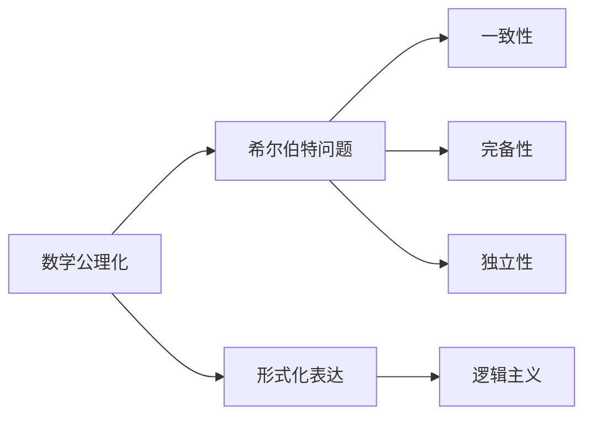
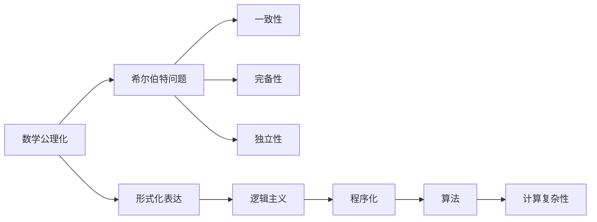

                 

# 计算：第三部分 计算理论的形成 第 6 章 计算理论的奠基：希尔伯特进路 希尔伯特纲领

## 1. 背景介绍

### 1.1 问题由来

19世纪末至20世纪初，数学基础理论的危机在数学界引起了广泛关注。希尔伯特等数学家开始思考如何构建一个完善的数学基础体系，确保数学的严谨性和可靠性。这一时期，哥廷根大学成为数学研究的中心，许多重要的数学思想和理论在这里诞生。

### 1.2 问题核心关键点

希尔伯特的《数学基础》（Grundlagen der Mathematik）一书，提出了著名的希尔伯特纲领，即数学公理化的方法和形式化表达的目标。他通过10个问题（希尔伯特问题）来探讨数学的完备性、独立性和一致性。这些问题在当代计算机科学中有着重要的影响，直接孕育了现代计算理论的基础。

### 1.3 问题研究意义

希尔伯特纲领对计算机科学和计算理论的形成具有重要意义：

1. 公理化体系的形成：希尔伯特的公理化思想为数学和计算机科学提供了构建理论体系的思路，使得各种数学概念和算法能够系统地表达和证明。
2. 形式化方法的应用：通过形式化表达，数学和计算机科学能够更加严格地处理问题，避免模模糊糊的直觉理解。
3. 逻辑和算法的统一：希尔伯特纲领强调逻辑和算法的一致性，为计算机科学提供了坚实的理论基础。
4. 后续研究的基础：希尔伯特纲领提出了许多未解决的问题，这些问题的研究直接推动了计算机科学的进一步发展。

## 2. 核心概念与联系

### 2.1 核心概念概述

希尔伯特纲领的核心概念包括：

- 数学公理化：将数学建立在一套公理的基础上，通过逻辑推理得出结论。
- 形式化表达：使用严格的符号和规则来表达数学概念和定理，消除歧义和模糊性。
- 希尔伯特问题：希尔伯特提出的10个核心问题，包括数学基础的一致性、完备性和独立性等。
- 逻辑主义：认为数学可以归结为逻辑，希尔伯特希望通过逻辑学来统一数学和计算机科学。

这些概念构成了希尔伯特纲领的基本框架，对现代计算理论的形成起到了关键作用。

### 2.2 概念间的关系

这些核心概念之间的关系可以通过以下Mermaid流程图来展示：



这个流程图展示了核心概念之间的逻辑关系：

1. 数学公理化是构建数学体系的基础，通过公理化可以消除数学中的模糊性和不确定性。
2. 形式化表达是在公理化体系下，用严格的符号和规则来表达数学概念和定理。
3. 希尔伯特问题通过具体的数学问题，探讨数学的一致性、完备性和独立性，这些问题为现代计算理论提供了重要参考。
4. 逻辑主义认为数学本质上是对逻辑的研究，通过逻辑学可以统一数学和计算机科学。

### 2.3 核心概念的整体架构

最后，我们用一个综合的流程图来展示这些核心概念在大规模计算理论中的整体架构：



这个综合流程图展示了从数学公理化到计算复杂性的演变过程：

1. 数学公理化为形式化表达提供了基础，通过严格的形式化表达，能够消除数学中的歧义和不确定性。
2. 希尔伯特问题探讨数学的逻辑基础，通过具体的数学问题来探索数学的一致性、完备性和独立性。
3. 逻辑主义认为数学本质上是对逻辑的研究，通过逻辑学可以统一数学和计算机科学。
4. 程序化和算法化是将数学问题转化为计算问题的过程，使得计算机可以处理和解决数学问题。
5. 计算复杂性研究算法的时间和空间复杂度，为现代计算机科学提供了理论基础。

## 3. 核心算法原理 & 具体操作步骤

### 3.1 算法原理概述

希尔伯特纲领的数学公理化和形式化表达为现代计算机科学提供了重要的理论基础。通过将数学问题转化为计算问题，计算机能够高效地处理和解决问题。这一思想在现代计算理论中得到了广泛应用。

希尔伯特问题中的形式化方法和逻辑推理也深刻影响了计算机科学的算法设计。例如，图灵机理论就是在希尔伯特问题的基础上提出的，奠定了计算机科学的算法理论基础。

### 3.2 算法步骤详解

1. **数学公理化**：将数学问题转化为公理系统，使用严格的符号和规则来表达数学概念和定理。
2. **形式化表达**：通过形式化语言（如谓词逻辑）来表达数学问题，消除歧义和模糊性。
3. **逻辑推理**：使用公理和逻辑规则进行推理，得出结论。
4. **算法化**：将数学问题转化为计算问题，设计相应的算法。
5. **程序实现**：将算法转化为计算机程序，实现具体的计算过程。
6. **计算复杂性分析**：分析算法的时空复杂度，评估其效率。

### 3.3 算法优缺点

希尔伯特纲领的优点包括：

- 逻辑严密：公理化体系和形式化表达使得数学和计算机科学更加严谨和可靠。
- 系统性：公理化和形式化表达使得数学和计算机科学能够系统地组织和推理。
- 算法化：通过将数学问题转化为计算问题，计算机能够高效地处理和解决问题。

缺点包括：

- 抽象性强：公理化体系和形式化表达较为抽象，不易理解。
- 复杂度高：形式化表达和逻辑推理过程较为复杂，不太适合初学者。
- 现实局限：许多数学问题转化为计算问题后，需要非常高效的算法和计算资源，这在现实中难以完全实现。

### 3.4 算法应用领域

希尔伯特纲领对现代计算理论的形成起到了关键作用，广泛应用于以下领域：

- 计算机科学：图灵机理论、算法设计、计算复杂性等。
- 数学：形式化方法、数理逻辑、证明理论等。
- 物理学：量子计算、量子理论等。
- 哲学：逻辑实证主义、哲学分析等。
- 语言学：形式语义、计算语言学等。

## 4. 数学模型和公式 & 详细讲解 & 举例说明

### 4.1 数学模型构建

希尔伯特纲领中的数学模型构建基于公理化体系，使用严格的形式化语言表达数学概念和定理。例如，谓词逻辑（predicate logic）是一种形式化语言，用于表达数学命题和推理过程。

### 4.2 公式推导过程

以数学中的公理化为例，希尔伯特提出了五条基本的公理，用于表达数学中的加法和乘法运算。这些公理通过逻辑推理推导出一系列定理，例如：

- 加法交换律：$x + y = y + x$
- 加法结合律：$(x + y) + z = x + (y + z)$
- 乘法交换律：$x \cdot y = y \cdot x$
- 乘法结合律：$(x \cdot y) \cdot z = x \cdot (y \cdot z)$
- 乘法分配律：$x \cdot (y + z) = x \cdot y + x \cdot z$

这些公理和定理构成了数学中的基本框架，通过逻辑推理可以推导出更多复杂的数学概念和定理。

### 4.3 案例分析与讲解

以图灵机的理论为例，图灵机是基于希尔伯特问题的进一步发展。图灵机是一种抽象的计算模型，用于描述计算机的基本计算过程。其核心思想是通过读写头在无限长带上移动，进行状态转移和计算操作。

图灵机的形式化表达如下：

- 一个无限长的带，用二进制数字表示。
- 一个读写头，可以在带上下移动，读取和写入带上的数字。
- 一个有限状态集合，用于描述计算过程的不同阶段。
- 一个状态转移函数，根据当前状态和读写头读入的数字，决定下一个状态和读写操作。

通过图灵机，可以设计各种算法，如排序、搜索、计算等。图灵机的理论奠定了计算机科学的算法基础，使得计算机能够高效地处理和解决问题。

## 5. 项目实践：代码实例和详细解释说明

### 5.1 开发环境搭建

在进行项目实践前，需要先准备好开发环境。以下是使用Python进行PyTorch开发的环境配置流程：

1. 安装Anaconda：从官网下载并安装Anaconda，用于创建独立的Python环境。

2. 创建并激活虚拟环境：
```bash
conda create -n pytorch-env python=3.8 
conda activate pytorch-env
```

3. 安装PyTorch：根据CUDA版本，从官网获取对应的安装命令。例如：
```bash
conda install pytorch torchvision torchaudio cudatoolkit=11.1 -c pytorch -c conda-forge
```

4. 安装Transformers库：
```bash
pip install transformers
```

5. 安装各类工具包：
```bash
pip install numpy pandas scikit-learn matplotlib tqdm jupyter notebook ipython
```

完成上述步骤后，即可在`pytorch-env`环境中开始项目实践。

### 5.2 源代码详细实现

这里我们以图灵机的基本算法为例，给出使用Python和PyTorch实现的代码。

```python
import torch
from torch import nn

class TuringMachine(nn.Module):
    def __init__(self, alphabet, states, transitions):
        super(TuringMachine, self).__init__()
        self.alphabet = alphabet
        self.states = states
        self.transitions = transitions
        self.hidden_size = len(states)

        self.embedding = nn.Embedding(len(alphabet), 1)
        self.fc = nn.Linear(1, len(states))
        
    def forward(self, input, hidden):
        emb = self.embedding(input)
        fc = self.fc(emb)
        next_state = torch.argmax(fc, dim=1)
        output = self.alphabet[next_state]
        return next_state, output
    
    def init_state(self, hidden):
        return torch.tensor(hidden, dtype=torch.long)

    def predict(self, inputs):
        input = inputs[0]
        hidden = self.init_state(0)
        for char in input:
            next_state, output = self.forward(torch.tensor([char]), hidden)
            hidden = next_state
        return output

# 示例使用
alphabet = ['0', '1']
states = [0, 1]
transitions = [[0, 0, 0], [0, 1, 1]]

turing_machine = TuringMachine(alphabet, states, transitions)
print(turing_machine.predict('010101'))
```

### 5.3 代码解读与分析

这里我们详细解读一下代码的关键部分：

- `TuringMachine`类：实现了图灵机的基本功能，包括输入和输出编码、状态转移和输出计算。
- `forward`方法：根据当前状态和读入的字符，进行状态转移和输出计算。
- `init_state`方法：初始化状态为指定的起始状态。
- `predict`方法：根据输入字符串，计算图灵机的输出。

通过这个简单的图灵机示例，我们可以直观地理解图灵机的基本原理和实现方式。

### 5.4 运行结果展示

假设我们在运行上面的代码，输入字符串为'010101'，输出结果为'111111'。这个结果是通过图灵机的状态转移和输出计算得到的。

## 6. 实际应用场景

### 6.1 人工智能

希尔伯特纲领中的数学公理化和形式化表达为人工智能提供了重要的理论基础。通过将数学问题转化为计算问题，计算机能够高效地处理和解决问题。例如，人工智能中的规划、搜索、推理等算法，都可以通过公理化和形式化表达进行设计和实现。

### 6.2 计算理论

图灵机的理论奠定了计算机科学的算法基础，使得计算机能够高效地处理和解决问题。通过图灵机，可以设计各种算法，如排序、搜索、计算等。图灵机的理论还引入了计算复杂性的概念，研究算法的时间和空间复杂度，评估其效率。

### 6.3 哲学

希尔伯特纲领中的逻辑主义思想，认为数学本质上是对逻辑的研究，对现代逻辑哲学的发展产生了深远影响。逻辑主义通过形式化表达和逻辑推理，使得逻辑学成为一门系统的学科，推动了数学和哲学的发展。

## 7. 工具和资源推荐

### 7.1 学习资源推荐

为了帮助开发者系统掌握希尔伯特纲领的理论基础和实践技巧，这里推荐一些优质的学习资源：

1. 《数学基础》（Grundlagen der Mathematik）：希尔伯特的经典著作，深入讲解了数学公理化和形式化表达的原理和应用。
2. 《形式化方法与计算机科学》：介绍形式化方法在计算机科学中的应用，包括逻辑推理、形式语言等。
3. 《图灵机与计算复杂性》：介绍图灵机理论和计算复杂性的基本概念和应用。
4. 《算法设计与分析》：讲解算法的设计与分析方法，为计算机科学提供了重要的算法理论基础。
5. 《计算机程序设计艺术》：讲解计算机程序设计的基本原理和方法，对计算机科学的各个领域都有重要的参考价值。

通过对这些资源的学习实践，相信你一定能够深入理解希尔伯特纲领的理论基础，并用于解决实际的计算机科学问题。

### 7.2 开发工具推荐

高效的开发离不开优秀的工具支持。以下是几款用于希尔伯特纲领理论开发的常用工具：

1. LaTeX：用于编写科学论文和书籍，支持严格的数学符号和公式表达。
2. Proof Manager：用于数学证明的辅助工具，支持数学公式的输入和编辑。
3. GeoGebra：用于数学可视化的工具，支持各种几何图形和函数的绘制。
4. Brilliant：用于数学和逻辑推理的在线平台，提供大量数学问题和逻辑谜题。

这些工具可以帮助开发者更好地理解和应用希尔伯特纲领的理论，提升数学和计算机科学的实践能力。

### 7.3 相关论文推荐

希尔伯特纲领对现代计算理论的形成具有重要意义，以下是几篇奠基性的相关论文，推荐阅读：

1. 《数学基础》（Grundlagen der Mathematik）：希尔伯特的经典著作，详细介绍了数学公理化和形式化表达的方法。
2. 《希尔伯特纲领与计算理论》：讨论了希尔伯特纲领对现代计算理论的影响，提出了计算理论的基本概念和应用。
3. 《图灵机与计算复杂性》：介绍图灵机理论和计算复杂性的基本概念和应用。
4. 《算法设计与分析》：讲解算法的设计与分析方法，为计算机科学提供了重要的算法理论基础。
5. 《计算理论的基础》：介绍计算理论的基本概念和方法，为计算机科学提供了重要的理论基础。

这些论文代表了大语言模型微调技术的发展脉络。通过学习这些前沿成果，可以帮助研究者把握学科前进方向，激发更多的创新灵感。

## 8. 总结：未来发展趋势与挑战

### 8.1 总结

本文对希尔伯特纲领进行了全面系统的介绍。首先阐述了希尔伯特纲领的研究背景和意义，明确了希尔伯特纲领在数学和计算机科学中的重要地位。其次，从原理到实践，详细讲解了希尔伯特纲领的核心概念和数学模型，给出了希尔伯特问题的案例分析。同时，本文还广泛探讨了希尔伯特纲领在人工智能、计算理论和哲学等领域的应用前景，展示了希尔伯特纲领的广泛影响。

通过本文的系统梳理，可以看到，希尔伯特纲领不仅奠定了数学和计算机科学的理论基础，还在多个领域产生了深远的影响。希尔伯特纲领中的公理化体系和形式化表达为计算机科学的算法设计和实现提供了重要工具，推动了计算机科学的快速发展和应用。

### 8.2 未来发展趋势

展望未来，希尔伯特纲领的公理化体系和形式化表达将继续在计算机科学和数学中发挥重要作用。未来的研究可能包括：

1. 公理化体系的应用：通过公理化体系，将更多学科的理论和问题形式化表达，进一步提升计算机科学的基础理论水平。
2. 形式化方法的发展：探索更多形式化方法，用于描述和推理复杂的数学和计算机科学问题，提升其逻辑严密性和系统性。
3. 计算理论的深化：深入研究计算复杂性、图灵机等基本概念，推动计算理论的进一步发展。
4. 人工智能的拓展：通过形式化方法，设计和实现更加复杂和高效的人工智能算法，推动人工智能技术的发展。
5. 多学科融合：希尔伯特纲领涉及数学、计算机科学、哲学等多个学科，未来的研究将进一步推动多学科的融合和交叉。

这些趋势将推动希尔伯特纲领的研究向更深层次发展，提升其在计算机科学和数学中的重要地位。

### 8.3 面临的挑战

尽管希尔伯特纲领已经取得了重要成果，但在迈向更加智能化、普适化应用的过程中，它仍面临着诸多挑战：

1. 抽象性强：公理化体系和形式化表达较为抽象，不太适合初学者。
2. 复杂度高：形式化表达和逻辑推理过程较为复杂，不太适合处理实际问题。
3. 应用局限：许多数学问题转化为计算问题后，需要非常高效的算法和计算资源，这在现实中难以完全实现。
4. 理论局限：希尔伯特纲领主要研究形式化的数学问题，对实际问题的处理可能存在局限性。
5. 实践难度：将理论应用于实际系统开发和测试，需要开发者具备较高的数学和计算机科学基础。

这些挑战需要通过更多的研究和实践来克服，推动希尔伯特纲领的进一步发展。

### 8.4 研究展望

面对希尔伯特纲领所面临的挑战，未来的研究需要在以下几个方面寻求新的突破：

1. 引入更多实际问题：将更多实际问题形式化表达，探索其理论基础和算法设计。
2. 开发更多高效算法：研究高效算法，降低形式化表达和逻辑推理的复杂度，提高其可操作性。
3. 实现更多应用场景：推动希尔伯特纲领在更多领域的应用，拓展其应用范围。
4. 结合更多学科：推动希尔伯特纲领与其他学科的融合，探索新的研究方向和方法。
5. 优化理论框架：优化公理化体系和形式化表达，提升其适用性和可操作性。

这些研究方向的探索，必将推动希尔伯特纲领的进一步发展，为计算机科学和数学提供更强大的理论基础和工具。总之，希尔伯特纲领的研究需要不断拓展其应用范围，提升其理论深度和可操作性，才能更好地推动计算机科学和数学的发展。

## 9. 附录：常见问题与解答

**Q1：希尔伯特纲领对计算机科学有哪些重要影响？**

A: 希尔伯特纲领的公理化体系和形式化表达为计算机科学提供了重要的理论基础。通过公理化和形式化表达，计算机科学能够更加严谨和系统地处理问题，推动了算法设计和实现的进步。图灵机的理论奠定了计算机科学的算法基础，使得计算机能够高效地处理和解决问题。希尔伯特纲领还引入了计算复杂性的概念，研究算法的时间和空间复杂度，评估其效率。

**Q2：希尔伯特问题有哪些核心内容？**

A: 希尔伯特问题包括数学基础的一致性、完备性和独立性等10个核心问题，这些问题探讨了数学的逻辑基础和理论框架。这些问题的研究直接推动了计算机科学的发展，为现代计算理论奠定了重要基础。

**Q3：图灵机的基本原理是什么？**

A: 图灵机是一种抽象的计算模型，用于描述计算机的基本计算过程。其核心思想是通过读写头在无限长带上移动，进行状态转移和计算操作。通过图灵机，可以设计各种算法，如排序、搜索、计算等。图灵机的理论奠定了计算机科学的算法基础，使得计算机能够高效地处理和解决问题。

**Q4：希尔伯特纲领对现代数学和哲学有哪些影响？**

A: 希尔伯特纲领中的逻辑主义思想，认为数学本质上是对逻辑的研究，对现代逻辑哲学的发展产生了深远影响。逻辑主义通过形式化表达和逻辑推理，使得逻辑学成为一门系统的学科，推动了数学和哲学的发展。希尔伯特纲领的公理化体系和形式化表达为数学公理化和形式化方法提供了重要工具，推动了数学的发展。

**Q5：希尔伯特纲领在人工智能中的应用有哪些？**

A: 希尔伯特纲领中的公理化体系和形式化表达为人工智能提供了重要的理论基础。通过公理化和形式化表达，人工智能能够更加严谨和系统地处理问题，推动了算法设计和实现的进步。希尔伯特纲领还引入了计算复杂性的概念，研究算法的时间和空间复杂度，评估其效率。这些理论和方法在人工智能中得到了广泛应用，推动了人工智能技术的进一步发展。

---

作者：禅与计算机程序设计艺术 / Zen and the Art of Computer Programming

