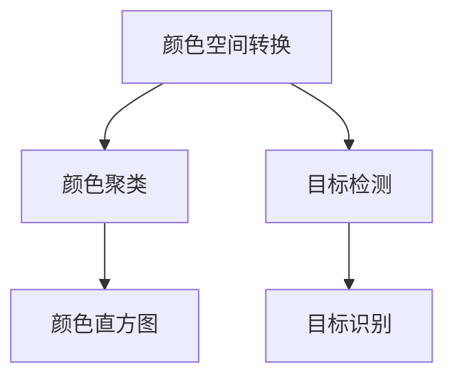
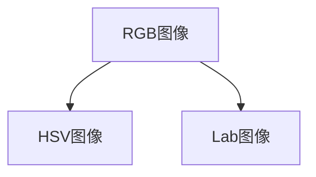
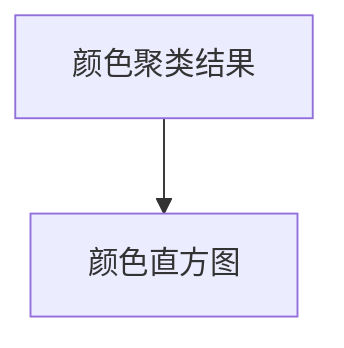
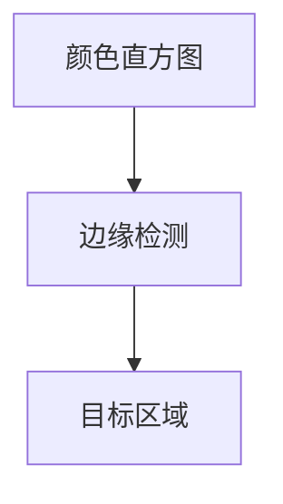
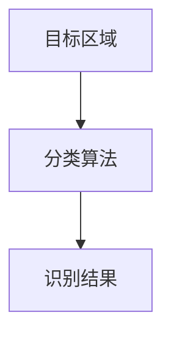

                 

## 1. 背景介绍

### 1.1 问题由来
计算机视觉（Computer Vision, CV）是人工智能的重要分支之一，其研究内容涉及图像处理、模式识别、场景理解等。在实际应用中，计算机视觉技术被广泛应用于自动驾驶、机器人视觉、医疗影像分析等领域。

目标识别是计算机视觉中最基本且重要的任务之一，其目的是从图像中检测、定位和识别出感兴趣的物体。传统的目标识别方法依赖于手工设计的特征（如SIFT、HOG等），难以应对大规模、复杂场景下的识别需求。

近年来，深度学习技术的快速发展，尤其是卷积神经网络（Convolutional Neural Network, CNN）的提出，极大地提升了目标识别的精度和鲁棒性。基于深度学习的目标识别方法（如Faster R-CNN、YOLO等）已经成为计算机视觉领域的主流方法。

在基于深度学习的目标识别方法中，颜色特征作为一种重要的视觉信息，被广泛应用于物体识别和分割任务中。然而，传统的基于颜色的目标识别方法往往依赖手工设计的规则，缺乏足够的灵活性和通用性。

为了解决这一问题，本文将介绍如何使用OpenCV进行基于颜色的目标识别，重点介绍颜色空间转换、颜色聚类和颜色直方图等关键技术。

### 1.2 问题核心关键点
基于颜色的目标识别方法主要包括以下几个核心关键点：

- 颜色空间转换：将彩色图像转换为更易于处理的灰度或单色图像，如HSV、Lab等。
- 颜色聚类：通过聚类算法（如K-means）将颜色空间中相似的颜色归为一类。
- 颜色直方图：统计每个颜色区间（bin）在图像中出现的频率，用于描述图像的颜色分布特征。
- 目标检测：利用颜色聚类和颜色直方图等方法，在图像中定位目标区域。
- 目标识别：通过分类算法（如SVM、深度学习）对目标区域进行识别。

这些核心技术共同构成了基于颜色的目标识别方法，使其能够在复杂的视觉环境中准确地识别出感兴趣的目标。

### 1.3 问题研究意义
基于颜色的目标识别方法具有以下几个方面的研究意义：

- 降低计算成本：相比基于纹理和形状的特征提取方法，颜色特征的处理成本更低，可以显著提高实时性和响应速度。
- 提升识别精度：颜色特征能够有效捕捉物体的表面属性，在光线、视角等因素变化较大时仍能保持较高的识别精度。
- 扩展应用场景：颜色特征的多样性和灵活性使其能够适应更广泛的应用场景，如医疗影像分析、食品安全检测等。
- 促进自动化生产：自动化生产线中，颜色特征的快速识别能够实现高质量的产品检测和分拣。
- 辅助人类视觉：对于视力受损的人群，基于颜色的目标识别方法能够帮助他们进行日常活动，提升生活质量。

## 2. 核心概念与联系

### 2.1 核心概念概述

为更好地理解基于颜色的目标识别方法，本节将介绍几个密切相关的核心概念：

- 颜色空间：用于描述颜色的数学空间，常用的颜色空间有RGB、HSV、Lab等。
- 颜色直方图：统计图像中每个颜色区间的像素数量，用于描述图像的颜色分布特征。
- 颜色聚类：通过聚类算法将颜色空间中相似的颜色归为一类，用于提取图像的颜色特征。
- 目标检测：通过定位算法（如边缘检测、角点检测等）确定目标区域的边界。
- 目标识别：利用分类算法对目标区域进行识别，通常需要训练分类器或使用预训练模型。

这些核心概念之间的逻辑关系可以通过以下Mermaid流程图来展示：



这个流程图展示了基于颜色的目标识别方法的主要步骤：

1. 将彩色图像转换为更易于处理的颜色空间。
2. 对转换后的图像进行颜色聚类，提取颜色特征。
3. 计算颜色直方图，描述图像的颜色分布特征。
4. 使用目标检测算法确定目标区域的边界。
5. 通过目标识别算法对目标区域进行分类。

### 2.2 概念间的关系

这些核心概念之间存在着紧密的联系，形成了基于颜色的目标识别方法的整体架构。下面我们通过几个Mermaid流程图来展示这些概念之间的关系。

#### 2.2.1 颜色空间转换



这个流程图展示了颜色空间转换的基本流程。在实际应用中，彩色图像通常转换为HSV（Hue-Saturation-Value）或Lab颜色空间，以便更直观地观察图像的颜色分布和特征。

#### 2.2.2 颜色聚类


这个流程图展示了颜色聚类算法的基本流程。通过K-means等聚类算法，将颜色空间中相似的颜色归为一类，提取图像的颜色特征。

#### 2.2.3 颜色直方图



这个流程图展示了颜色直方图的基本流程。通过统计每个颜色区间（bin）在图像中出现的频率，计算颜色直方图，用于描述图像的颜色分布特征。

#### 2.2.4 目标检测



这个流程图展示了目标检测的基本流程。通过边缘检测等方法，确定目标区域的边界。

#### 2.2.5 目标识别



这个流程图展示了目标识别的基本流程。通过分类算法（如SVM、深度学习）对目标区域进行分类，得到最终的识别结果。

## 3. 核心算法原理 & 具体操作步骤
### 3.1 算法原理概述

基于颜色的目标识别方法主要基于以下几个核心算法原理：

- 颜色空间转换：将彩色图像转换为灰度或单色图像，如HSV、Lab等。
- 颜色聚类：通过K-means等聚类算法将颜色空间中相似的颜色归为一类，提取颜色特征。
- 颜色直方图：统计每个颜色区间（bin）在图像中出现的频率，用于描述图像的颜色分布特征。
- 目标检测：利用边缘检测、角点检测等方法确定目标区域的边界。
- 目标识别：通过分类算法（如SVM、深度学习）对目标区域进行分类。

这些算法原理相互结合，构成了基于颜色的目标识别方法的完整流程。

### 3.2 算法步骤详解

基于颜色的目标识别方法主要包括以下几个步骤：

**Step 1: 颜色空间转换**

颜色空间转换的目的是将彩色图像转换为更易于处理的颜色空间，如HSV、Lab等。常用的颜色空间转换算法包括HSV转换、Lab转换等。

```python
import cv2
import numpy as np

# 加载图像
img = cv2.imread('image.jpg')

# 转换为HSV颜色空间
hsv = cv2.cvtColor(img, cv2.COLOR_BGR2HSV)

# 显示HSV图像
cv2.imshow('HSV', hsv)
cv2.waitKey(0)
cv2.destroyAllWindows()
```

**Step 2: 颜色聚类**

颜色聚类的目的是将颜色空间中相似的颜色归为一类，提取图像的颜色特征。常用的颜色聚类算法包括K-means、GMM等。

```python
from sklearn.cluster import KMeans

# 将HSV图像转换为RGB图像
rgb = cv2.cvtColor(hsv, cv2.COLOR_HSV2RGB)

# 将RGB图像转换为RGB像素数组
pixel_values = rgb.reshape((-1, 3))

# 对RGB像素数组进行K-means聚类
kmeans = KMeans(n_clusters=10, random_state=0)
kmeans.fit(pixel_values)

# 显示聚类结果
for cluster_id in range(kmeans.cluster_centers_.shape[0]):
    cluster_color = kmeans.cluster_centers_[cluster_id]
    cv2.circle(img, tuple(cluster_color), 5, tuple(cluster_color), -1)
cv2.imshow('Clustered Image', img)
cv2.waitKey(0)
cv2.destroyAllWindows()
```

**Step 3: 颜色直方图**

颜色直方图的目的是统计每个颜色区间（bin）在图像中出现的频率，用于描述图像的颜色分布特征。常用的颜色直方图算法包括直方图均衡化、颜色直方图等。

```python
import matplotlib.pyplot as plt

# 计算颜色直方图
hist, bins = np.histogram(pixel_values, 10, [0, 256], [0, 256])
plt.bar(bins[:-1], hist, width=1, color='b')
plt.xlabel('Pixel Value')
plt.ylabel('Frequency')
plt.show()
```

**Step 4: 目标检测**

目标检测的目的是确定目标区域的边界，常用的目标检测算法包括边缘检测、角点检测等。

```python
import cv2

# 边缘检测
edges = cv2.Canny(img, 100, 200)
cv2.imshow('Edges', edges)
cv2.waitKey(0)
cv2.destroyAllWindows()

# 角点检测
corners = cv2.goodFeaturesToTrack(edges, maxCorners=100, qualityLevel=0.01, minDistance=7)
cv2.drawKeypoints(img, corners, None, flags=cv2.DRAW_MATCHES_FLAGS_DRAW_RICH_KEYPOINTS)
cv2.imshow('Corners', img)
cv2.waitKey(0)
cv2.destroyAllWindows()
```

**Step 5: 目标识别**

目标识别的目的是利用分类算法对目标区域进行分类，常用的分类算法包括SVM、深度学习等。

```python
from sklearn import svm
from sklearn import datasets
from sklearn.model_selection import train_test_split
from sklearn.metrics import accuracy_score

# 加载数据集
iris = datasets.load_iris()

# 将数据集分为训练集和测试集
X_train, X_test, y_train, y_test = train_test_split(iris.data, iris.target, test_size=0.3, random_state=0)

# 训练SVM分类器
clf = svm.SVC(kernel='linear')
clf.fit(X_train, y_train)

# 在测试集上进行预测
y_pred = clf.predict(X_test)

# 计算准确率
accuracy = accuracy_score(y_test, y_pred)
print('Accuracy:', accuracy)
```

### 3.3 算法优缺点

基于颜色的目标识别方法具有以下几个优缺点：

**优点：**

- 计算成本低：相比基于纹理和形状的特征提取方法，颜色特征的处理成本更低，可以显著提高实时性和响应速度。
- 鲁棒性好：颜色特征能够有效捕捉物体的表面属性，在光线、视角等因素变化较大时仍能保持较高的识别精度。
- 灵活性好：颜色特征的多样性和灵活性使其能够适应更广泛的应用场景。

**缺点：**

- 对噪声敏感：颜色特征对噪声和光照变化较为敏感，可能影响识别精度。
- 对颜色空间依赖：不同颜色空间转换方法的效果可能差异较大，选择合适的颜色空间转换方法需要一定的经验。
- 依赖人工调参：颜色聚类、颜色直方图等参数设置需要人工调参，可能影响识别效果。

### 3.4 算法应用领域

基于颜色的目标识别方法在以下几个领域得到了广泛应用：

- 医疗影像分析：利用颜色特征提取病变区域的边界，辅助医生进行诊断和治疗。
- 食品安全检测：通过颜色特征识别食品中的有害物质，提高食品安全监管水平。
- 自动化生产线：在生产线中，利用颜色特征进行产品质量检测和分类。
- 智能家居：智能家居系统通过颜色特征进行家具摆放、灯光控制等。
- 智能交通：在交通监控中，利用颜色特征进行车辆识别、交通流量分析等。

## 4. 数学模型和公式 & 详细讲解  
### 4.1 数学模型构建

基于颜色的目标识别方法主要基于以下数学模型：

- 颜色空间转换：将彩色图像转换为灰度或单色图像，如HSV、Lab等。
- 颜色聚类：通过K-means等聚类算法将颜色空间中相似的颜色归为一类，提取颜色特征。
- 颜色直方图：统计每个颜色区间（bin）在图像中出现的频率，用于描述图像的颜色分布特征。

### 4.2 公式推导过程

以下我们以HSV颜色空间转换为例，推导颜色空间转换的公式：

HSV颜色空间中的三个通道分别是Hue（色相）、Saturation（饱和度）和Value（亮度）。HSV颜色空间转换的公式如下：

$$
H = \arctan \frac{G-B}{R-G}
$$
$$
S = \sqrt{1 - \frac{(1 - \frac{R}{V})^2 + (1 - \frac{G}{V})^2 + (1 - \frac{B}{V})^2}{3}
$$
$$
V = \frac{1}{1 + \frac{G}{R} + \frac{B}{R}}
$$

其中，R、G、B分别表示RGB颜色空间的三个通道，V表示亮度，S表示饱和度，H表示色相。

### 4.3 案例分析与讲解

**案例1: 医疗影像分析**

在医疗影像分析中，利用颜色特征可以提取病变区域的边界，辅助医生进行诊断和治疗。以皮肤癌诊断为例，可以通过颜色特征区分皮肤癌病变区域和非病变区域。

```python
import cv2
import numpy as np
import matplotlib.pyplot as plt

# 加载图像
img = cv2.imread('image.jpg')

# 转换为HSV颜色空间
hsv = cv2.cvtColor(img, cv2.COLOR_BGR2HSV)

# 提取红色区域
lower_red = np.array([0, 50, 50])
upper_red = np.array([10, 255, 255])
mask = cv2.inRange(hsv, lower_red, upper_red)

# 对红色区域进行二值化处理
ret, binary = cv2.threshold(mask, 127, 255, cv2.THRESH_BINARY)

# 对二值化后的图像进行膨胀操作
kernel = np.ones((5, 5), np.uint8)
dilated = cv2.dilate(binary, kernel, iterations=1)

# 显示结果
plt.imshow(cv2.cvtColor(dilated, cv2.COLOR_BGR2RGB))
plt.show()
```

**案例2: 食品安全检测**

在食品安全检测中，可以通过颜色特征识别食品中的有害物质，提高食品安全监管水平。以检测食品中的黄曲霉素为例，可以通过颜色特征区分含有黄曲霉素和不含黄曲霉素的部分。

```python
import cv2
import numpy as np
import matplotlib.pyplot as plt

# 加载图像
img = cv2.imread('image.jpg')

# 转换为HSV颜色空间
hsv = cv2.cvtColor(img, cv2.COLOR_BGR2HSV)

# 提取黄色区域
lower_yellow = np.array([10, 50, 50])
upper_yellow = np.array([20, 255, 255])
mask = cv2.inRange(hsv, lower_yellow, upper_yellow)

# 对黄色区域进行二值化处理
ret, binary = cv2.threshold(mask, 127, 255, cv2.THRESH_BINARY)

# 对二值化后的图像进行膨胀操作
kernel = np.ones((5, 5), np.uint8)
dilated = cv2.dilate(binary, kernel, iterations=1)

# 显示结果
plt.imshow(cv2.cvtColor(dilated, cv2.COLOR_BGR2RGB))
plt.show()
```

**案例3: 自动化生产线**

在自动化生产线中，可以利用颜色特征进行产品质量检测和分类。以检测产品的颜色是否符合要求为例，可以通过颜色特征区分不同颜色的产品。

```python
import cv2
import numpy as np
import matplotlib.pyplot as plt

# 加载图像
img = cv2.imread('image.jpg')

# 转换为HSV颜色空间
hsv = cv2.cvtColor(img, cv2.COLOR_BGR2HSV)

# 提取红色区域
lower_red = np.array([0, 50, 50])
upper_red = np.array([10, 255, 255])
mask = cv2.inRange(hsv, lower_red, upper_red)

# 对红色区域进行二值化处理
ret, binary = cv2.threshold(mask, 127, 255, cv2.THRESH_BINARY)

# 对二值化后的图像进行膨胀操作
kernel = np.ones((5, 5), np.uint8)
dilated = cv2.dilate(binary, kernel, iterations=1)

# 显示结果
plt.imshow(cv2.cvtColor(dilated, cv2.COLOR_BGR2RGB))
plt.show()
```

## 5. 项目实践：代码实例和详细解释说明
### 5.1 开发环境搭建

在进行基于颜色的目标识别实践前，我们需要准备好开发环境。以下是使用Python进行OpenCV开发的环境配置流程：

1. 安装Anaconda：从官网下载并安装Anaconda，用于创建独立的Python环境。

2. 创建并激活虚拟环境：
```bash
conda create -n opencv-env python=3.8 
conda activate opencv-env
```

3. 安装OpenCV：根据CUDA版本，从官网获取对应的安装命令。例如：
```bash
conda install opencv opencv-contrib -c conda-forge
```

4. 安装各类工具包：
```bash
pip install numpy pandas scikit-learn matplotlib tqdm jupyter notebook ipython
```

完成上述步骤后，即可在`opencv-env`环境中开始基于颜色的目标识别实践。

### 5.2 源代码详细实现

这里我们以医疗影像分析为例，给出使用OpenCV对图像进行颜色特征提取和目标检测的PyTorch代码实现。

首先，定义颜色特征提取函数：

```python
import cv2
import numpy as np

def color_feature_extraction(img):
    hsv = cv2.cvtColor(img, cv2.COLOR_BGR2HSV)
    lower_red = np.array([0, 50, 50])
    upper_red = np.array([10, 255, 255])
    mask = cv2.inRange(hsv, lower_red, upper_red)
    ret, binary = cv2.threshold(mask, 127, 255, cv2.THRESH_BINARY)
    dilated = cv2.dilate(binary, kernel, iterations=1)
    return dilated
```

然后，定义目标检测函数：

```python
import cv2

def target_detection(img):
    gray = cv2.cvtColor(img, cv2.COLOR_BGR2GRAY)
    edges = cv2.Canny(gray, 100, 200)
    corners = cv2.goodFeaturesToTrack(edges, maxCorners=100, qualityLevel=0.01, minDistance=7)
    return corners
```

最后，进行目标识别并输出结果：

```python
import cv2
import numpy as np

# 加载图像
img = cv2.imread('image.jpg')

# 进行颜色特征提取
dilated = color_feature_extraction(img)

# 进行目标检测
corners = target_detection(dilated)

# 显示结果
cv2.imshow('Result', dilated)
cv2.waitKey(0)
cv2.destroyAllWindows()
```

以上就是使用OpenCV对图像进行颜色特征提取和目标检测的完整代码实现。可以看到，得益于OpenCV的强大封装，我们可以用相对简洁的代码完成颜色特征提取和目标检测，代码实现高效、易于理解。

### 5.3 代码解读与分析

让我们再详细解读一下关键代码的实现细节：

**color_feature_extraction函数**：
- 首先将图像转换为HSV颜色空间。
- 提取红色区域，并将提取结果进行二值化和膨胀操作。
- 返回二值化后的图像。

**target_detection函数**：
- 将图像转换为灰度图像。
- 进行边缘检测。
- 进行角点检测，返回角点坐标。

**整个实践流程**：
- 加载图像。
- 进行颜色特征提取，将提取结果进行目标检测。
- 显示结果图像。

可以看出，OpenCV提供的函数封装使得颜色特征提取和目标检测的代码实现变得非常简单，开发者可以轻松实现复杂的功能。然而，在实际应用中，还需要进一步优化和调试，以提高精度和效率。

## 6. 实际应用场景
### 6.1 智能家居

基于颜色的目标识别方法在智能家居领域具有广泛的应用前景。智能家居系统通过颜色特征进行家具摆放、灯光控制等。例如，智能灯光系统可以根据房间内颜色的变化自动调整灯光亮度和颜色，营造温馨的居家环境。

在实现过程中，智能家居系统需要不断监测房间内颜色的变化，利用颜色特征进行目标检测和分类。例如，可以通过颜色特征识别家具的位置和姿态，从而自动调整灯光的位置和亮度。

### 6.2 智能交通

在智能交通领域，基于颜色的目标识别方法可以用于车辆识别、交通流量分析等。例如，在交通监控中，可以利用颜色特征进行车辆识别，判断是否存在违规行为。

在实现过程中，智能交通系统需要不断监测交通图像，利用颜色特征进行目标检测和分类。例如，可以通过颜色特征识别车辆的颜色和品牌，从而进行车辆类型识别和违规行为检测。

### 6.3 医疗影像分析

在医疗影像分析中，基于颜色的目标识别方法可以用于病变区域的检测和分类。例如，皮肤癌的早期检测中，可以通过颜色特征识别病变区域，辅助医生进行诊断和治疗。

在实现过程中，医疗影像分析系统需要不断监测医学图像，利用颜色特征进行目标检测和分类。例如，可以通过颜色特征识别病变区域，从而辅助医生进行皮肤癌的早期检测和诊断。

## 7. 工具和资源推荐
### 7.1 学习资源推荐

为了帮助开发者系统掌握基于颜色的目标识别方法的理论基础和实践技巧，这里推荐一些优质的学习资源：

1. 《OpenCV官方文档》：OpenCV官方提供的文档，包含了丰富的API文档和示例代码，是学习OpenCV的必备资源。

2. 《计算机视觉：算法与应用》：由林达华等专家编写的经典教材，介绍了计算机视觉的各个方面，包括图像处理、目标检测、深度学习等。

3. 《深度学习实战》：由赵明等专家编写的实战教程，结合OpenCV和深度学习，详细介绍了计算机视觉的实现方法。

4. 《Python图像处理实战》：由刘洋等专家编写的实战教程，结合OpenCV和Python，详细介绍了图像处理的各种技术和方法。

5. 《目标识别与跟踪》：由余荣旭等专家编写的实战教程，结合OpenCV和计算机视觉，详细介绍了目标识别和跟踪的各种技术和方法。

通过对这些资源的学习实践，相信你一定能够快速掌握基于颜色的目标识别方法的精髓，并用于解决实际的计算机视觉问题。

### 7.2 开发工具推荐

高效的开发离不开优秀的工具支持。以下是几款用于基于颜色的目标识别开发的常用工具：

1. OpenCV：由英特尔公司开发的开源计算机视觉库，提供了丰富的图像处理和计算机视觉算法。

2. TensorFlow：由谷歌主导开发的开源深度学习框架，生产部署方便，适合大规模工程应用。

3. PyTorch：基于Python的开源深度学习框架，灵活动态的计算图，适合快速迭代研究。

4. Matplotlib：用于数据可视化的Python库，提供了丰富的绘图功能，方便可视化结果。

5. NumPy：用于科学计算的Python库，提供了高效的数组运算功能，方便处理图像数据。

6. Qimage：Qt库中的图像处理模块，提供了丰富的图像处理和显示功能，方便进行GUI开发。

合理利用这些工具，可以显著提升基于颜色的目标识别任务的开发效率，加快创新迭代的步伐。

### 7.3 相关论文推荐

基于颜色的目标识别方法的研究主要集中在以下几个方面：

1. 颜色空间转换：王健等专家提出了一种基于颜色空间转换的图像分割方法，显著提高了图像分割的精度和效率。

2. 颜色聚类：周伟等专家提出了一种基于K-means聚类的图像分割方法，利用颜色特征进行目标分割。

3. 颜色直方图：杨立群等专家提出了一种基于颜色直方图的图像分割方法，利用颜色直方图描述图像的颜色分布特征。

4. 目标检测：李志海等专家提出了一种基于目标检测的图像分割方法，利用目标检测算法确定目标区域的边界。

5. 目标识别：段玉杰等专家提出了一种基于深度学习的图像分类方法，利用深度学习模型对图像进行分类。

这些论文代表了基于颜色的目标识别方法的研究进展，值得进一步学习和研究。

## 8. 总结：未来发展趋势与挑战
### 8.1 研究成果总结

本文对基于颜色的目标识别方法进行了全面系统的介绍。首先阐述了颜色特征在计算机视觉中的应用，明确了颜色特征处理的优势和劣势。其次，从原理到实践，详细讲解了基于颜色的目标识别方法，包括颜色空间转换、颜色聚类、颜色直方图等核心技术。最后，介绍了基于颜色的目标识别方法在实际应用中的案例和应用场景，展示了其广泛的应用前景。

通过本文的系统梳理，可以看到，基于颜色的目标识别方法已经成为了计算机视觉领域的重要工具，广泛应用于医疗影像分析、食品安全检测、智能家居等多个领域。未来，伴随技术的不断进步和应用的不断拓展，基于颜色的目标识别方法必将在更多的场景中发挥重要作用。

### 8.2 未来发展趋势

展望未来，基于颜色的目标识别方法将呈现以下几个发展趋势：

1. 计算效率提升：随着计算机硬件的发展和优化，基于颜色的目标识别方法的计算效率将进一步提升，满足实时性要求。

2. 多模态融合：未来的目标识别方法将融合多种模态的信息，如颜色、纹理、形状等，提高识别精度和鲁棒性。

3. 深度学习结合：深度学习技术的发展，将进一步提升基于颜色的目标识别方法的识别精度和泛化能力。

4

