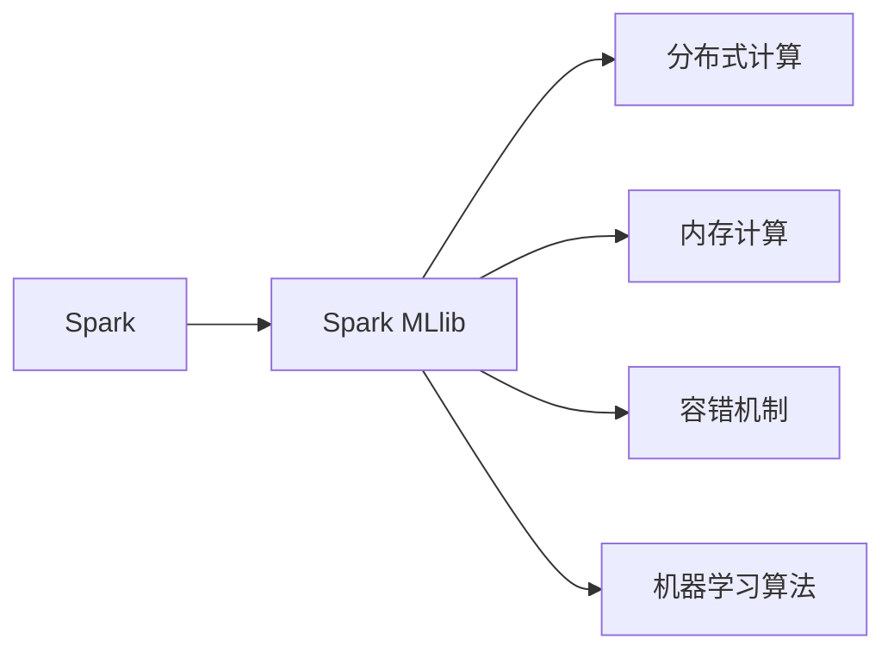

                 

# Spark MLlib机器学习库原理与代码实例讲解

## 1. 背景介绍

### 1.1 问题由来
随着大数据时代的到来，机器学习的应用越来越广泛，其对数据处理能力的要求也日益提高。传统的机器学习库，如Scikit-Learn，虽然功能强大，但在大规模数据集上的处理能力却显得捉襟见肘。Apache Spark作为一款支持分布式计算的大数据处理框架，其Spark MLlib库正是为了应对这种需求而诞生。Spark MLlib提供了一系列的机器学习算法和工具，使得在大数据集上进行机器学习变得简单高效。

### 1.2 问题核心关键点
Spark MLlib的核心在于其分布式计算能力，结合了Spark的内存计算和容错特性，能够在处理大规模数据时表现出极佳的性能。其主要特点包括：
1. 支持分布式计算：可以处理海量数据，并利用集群中的多台机器并行计算。
2. 内存计算：通过将数据缓存在内存中，显著提高了处理速度。
3. 容错机制：Spark能够自动处理任务失败的情况，确保数据的完整性。
4. 丰富的机器学习算法：涵盖从数据预处理到模型训练、评估和调优的整个流程。

### 1.3 问题研究意义
Spark MLlib的出现，极大地简化了大数据环境下的机器学习任务。它不仅为大规模数据处理提供了强大的支持，还为研究人员和企业提供了丰富的工具和算法，帮助他们高效地分析和挖掘数据价值。此外，Spark MLlib的出现也推动了机器学习在大数据领域的发展，使其成为大数据时代机器学习的重要组成部分。

## 2. 核心概念与联系

### 2.1 核心概念概述

为了更好地理解Spark MLlib的工作原理，我们需要了解以下几个核心概念：

- Spark：Apache Spark是一个开源的分布式计算框架，支持内存计算和容错处理。Spark MLlib是Spark的一个组件，专门用于机器学习任务的实现。
- Spark MLlib：Spark MLlib是Spark的一个模块，提供了一系列机器学习算法和工具，支持数据预处理、特征工程、模型训练、评估和调优等整个流程。
- 分布式计算：利用集群中的多台机器并行计算，提高计算效率。
- 内存计算：通过将数据缓存在内存中，提高计算速度。
- 容错机制：Spark能够自动处理任务失败的情况，确保数据的完整性。

这些核心概念构成了Spark MLlib的基础，使得Spark MLlib能够在大数据集上高效地实现各种机器学习任务。

### 2.2 概念间的关系

这些核心概念之间的逻辑关系可以通过以下Mermaid流程图来展示：



这个流程图展示了Spark MLlib的基本架构和功能：

1. Spark MLlib是Spark的一个组件，主要负责机器学习任务的实现。
2. Spark MLlib利用Spark的分布式计算能力，支持大规模数据处理。
3. Spark MLlib采用内存计算方式，提高计算效率。
4. Spark MLlib具有容错机制，确保数据的完整性。
5. Spark MLlib提供了一系列机器学习算法，支持数据预处理、特征工程、模型训练、评估和调优等整个流程。

### 2.3 核心概念的整体架构

最后，我们用一个综合的流程图来展示这些核心概念在大数据集上的机器学习应用流程：


这个流程图展示了从数据预处理到模型调优的完整流程：

1. 从大规模数据集开始，经过数据预处理和特征工程，得到可供模型训练的数据集。
2. 使用Spark MLlib提供的机器学习算法进行模型训练，得到初步的模型。
3. 对模型进行评估，发现其性能问题。
4. 对模型进行调优，改进其性能。
5. 最终部署模型，进行实际应用。

## 3. 核心算法原理 & 具体操作步骤
### 3.1 算法原理概述

Spark MLlib提供了一系列机器学习算法，涵盖从数据预处理到模型训练、评估和调优的整个流程。其核心算法原理包括以下几个方面：

- 数据预处理：包括数据清洗、数据标准化、特征选择和特征构造等。
- 特征工程：通过特征构造和特征降维等方法，提高模型的性能。
- 模型训练：使用各种机器学习算法，如线性回归、逻辑回归、决策树、随机森林、梯度提升机等，进行模型训练。
- 模型评估：使用各种评估指标，如准确率、召回率、F1分数等，对模型进行评估。
- 模型调优：通过超参数调优、模型融合等方法，提高模型的性能。

### 3.2 算法步骤详解

以下我们将详细介绍Spark MLlib中一个典型的机器学习任务：线性回归。

#### 3.2.1 数据预处理

首先，我们需要对数据集进行预处理。在Spark MLlib中，数据预处理通常包括以下几个步骤：

1. 数据加载：使用`spark.read`方法加载数据集。
2. 数据清洗：去除数据集中的噪声和异常值，使用`DropNull`、`ReplaceNaN`等函数。
3. 数据标准化：将数据标准化，使用`StandardScaler`函数。

```python
from pyspark.ml.feature import StandardScaler
from pyspark.sql.functions import col, drop, replace, col, fillna

# 加载数据集
data = spark.read.csv("data.csv", header=True, inferSchema=True)

# 数据清洗
data_cleaned = drop(data, "target_variable")  # 去除目标变量

# 数据标准化
data_standardized = StandardScaler() \
    .fit(data_cleaned) \
    .transform(data_cleaned)

data_standardized.show()
```

#### 3.2.2 特征工程

特征工程是机器学习任务中非常重要的一步。在Spark MLlib中，特征工程通常包括以下几个步骤：

1. 特征构造：通过计算、编码等方法，构造新的特征。
2. 特征降维：使用PCA等方法，减少特征维度，提高模型性能。

```python
from pyspark.ml.feature import PCA

# 特征构造
data_features = (data_standardized
    .withColumn("feature1", col("feature1") * 2)  # 构造新特征
    .withColumn("feature2", col("feature2") + 1)  # 构造新特征
)

# 特征降维
pca = PCA(k=3, inputCol="features", outputCol="pca_features")
data_features_pca = pca.fit(data_features).transform(data_features)
data_features_pca.show()
```

#### 3.2.3 模型训练

在Spark MLlib中，模型训练通常包括以下几个步骤：

1. 划分数据集：将数据集划分为训练集和测试集。
2. 选择模型：选择相应的机器学习算法，如线性回归、逻辑回归、决策树等。
3. 训练模型：使用训练集对模型进行训练。

```python
from pyspark.ml.regression import LinearRegression

# 划分数据集
train_data, test_data = data_standardized.randomSplit([0.7, 0.3])

# 选择模型
model = LinearRegression()

# 训练模型
model.fit(train_data.select("features", "target_variable"), param_map={})
```

#### 3.2.4 模型评估

在Spark MLlib中，模型评估通常包括以下几个步骤：

1. 评估指标：使用各种评估指标，如准确率、召回率、F1分数等。
2. 模型选择：根据评估结果，选择最优模型。

```python
from pyspark.ml.evaluation import RegressionEvaluator

# 评估模型
evaluator = RegressionEvaluator(
    labelCol="target_variable",
    predictionCol="prediction",
    metricName="rmse"
)
rmse = evaluator.evaluate(model.transform(test_data), {metricName: "rmse"})
print("RMSE: ", rmse)
```

#### 3.2.5 模型调优

在Spark MLlib中，模型调优通常包括以下几个步骤：

1. 超参数调优：使用交叉验证等方法，对模型的超参数进行调优。
2. 模型融合：使用集成学习方法，如Bagging、Boosting等，提高模型性能。

```python
from pyspark.ml.tuning import CrossValidator

# 超参数调优
crossval = CrossValidator(
    estimator=model,
    evaluator=evaluator,
    estimatorParamMaps=[{'slope': [0.5, 1.0, 1.5]}],  # 超参数列表
    evaluatorParamMaps=[{}],  # 评估指标参数
    numFolds=5,  # 交叉验证折数
    seed=1234  # 随机数种子
)
crossval_model = crossval.fit(data_standardized)
crossval_model.summary()

# 模型融合
from pyspark.ml.ensemble import GradientBoostingRegressor

# 训练模型
gb_model = GradientBoostingRegressor(
    featuresCol="features",
    labelCol="target_variable",
    maxDepth=3,
    maxBins=32,
    maxIter=100
)
gb_model.fit(train_data, param_map={})
```

### 3.3 算法优缺点

#### 3.3.1 优点

1. 分布式计算：Spark MLlib利用Spark的分布式计算能力，可以处理大规模数据集，支持并行计算。
2. 内存计算：Spark MLlib采用内存计算方式，大大提高了计算速度。
3. 容错机制：Spark MLlib具有容错机制，可以自动处理任务失败的情况，确保数据的完整性。
4. 丰富的算法：Spark MLlib提供了丰富的机器学习算法，涵盖了从数据预处理到模型训练、评估和调优的整个流程。

#### 3.3.2 缺点

1. 学习曲线陡峭：由于Spark MLlib使用了大量的函数和方法，对于初学者来说，学习曲线可能比较陡峭。
2. 内存消耗大：由于Spark MLlib采用了内存计算方式，对于大规模数据集，内存消耗可能比较大。
3. 生态系统较新：与Scikit-Learn等老牌机器学习库相比，Spark MLlib的生态系统还比较年轻，一些算法和函数可能还不是很成熟。

### 3.4 算法应用领域

Spark MLlib的应用领域非常广泛，涵盖以下几个方面：

1. 数据预处理：适用于大规模数据集的数据清洗、数据标准化、特征选择和特征构造等。
2. 特征工程：适用于特征构造、特征降维等。
3. 模型训练：适用于线性回归、逻辑回归、决策树、随机森林、梯度提升机等机器学习算法。
4. 模型评估：适用于各种评估指标，如准确率、召回率、F1分数等。
5. 模型调优：适用于超参数调优、模型融合等。

## 4. 数学模型和公式 & 详细讲解 & 举例说明

### 4.1 数学模型构建

在Spark MLlib中，构建数学模型通常包括以下几个步骤：

1. 数据加载：使用`spark.read`方法加载数据集。
2. 数据清洗：去除数据集中的噪声和异常值，使用`DropNull`、`ReplaceNaN`等函数。
3. 数据标准化：将数据标准化，使用`StandardScaler`函数。
4. 特征构造：通过计算、编码等方法，构造新的特征。
5. 特征降维：使用PCA等方法，减少特征维度，提高模型性能。
6. 模型训练：使用各种机器学习算法，如线性回归、逻辑回归、决策树等，进行模型训练。
7. 模型评估：使用各种评估指标，如准确率、召回率、F1分数等，对模型进行评估。
8. 模型调优：通过超参数调优、模型融合等方法，提高模型的性能。

### 4.2 公式推导过程

以线性回归为例，我们将详细介绍其数学模型和公式推导过程。

#### 4.2.1 线性回归模型

线性回归模型的一般形式为：

$$
y = \beta_0 + \beta_1x_1 + \beta_2x_2 + ... + \beta_px_p + \epsilon
$$

其中，$y$为输出变量，$x_i$为输入变量，$\beta_i$为回归系数，$\epsilon$为误差项。

#### 4.2.2 最小二乘法

最小二乘法是一种常用的线性回归模型求解方法。其目标是最小化残差平方和（RSS），即：

$$
\min_{\beta} RSS = \sum_{i=1}^n (y_i - \hat{y}_i)^2
$$

其中，$y_i$为实际输出，$\hat{y}_i$为模型预测输出。

#### 4.2.3 梯度下降法

梯度下降法是一种常用的求解最小二乘法的算法。其公式为：

$$
\beta_{k+1} = \beta_k - \eta \nabla_{\beta} RSS
$$

其中，$\eta$为学习率，$\nabla_{\beta} RSS$为RSS对回归系数的梯度。

在Spark MLlib中，我们可以使用`LinearRegression`函数来实现线性回归模型。其代码如下：

```python
from pyspark.ml.regression import LinearRegression

# 构建线性回归模型
model = LinearRegression()

# 训练模型
model.fit(train_data.select("features", "target_variable"), param_map={})
```

### 4.3 案例分析与讲解

下面我们以一个实际案例来分析Spark MLlib的使用过程。

#### 案例1：房价预测

假设我们需要预测房价，数据集包含房屋面积、卧室数量、卫生间数量、是否带院落等特征，目标变量为房价。

1. 数据预处理：加载数据集，去除噪声和异常值，标准化数据，特征构造等。
2. 特征工程：选择最相关的特征，进行特征降维。
3. 模型训练：使用线性回归模型，进行模型训练。
4. 模型评估：使用RMSE评估模型性能。
5. 模型调优：使用交叉验证，超参数调优等。

```python
from pyspark.ml.feature import PCA
from pyspark.ml.regression import LinearRegression
from pyspark.ml.evaluation import RegressionEvaluator
from pyspark.ml.tuning import CrossValidator

# 加载数据集
data = spark.read.csv("house_prices.csv", header=True, inferSchema=True)

# 数据预处理
data_cleaned = drop(data, "price")  # 去除目标变量
data_standardized = StandardScaler() \
    .fit(data_cleaned) \
    .transform(data_cleaned)

# 特征工程
features = data_standardized.select("square_feet", "num_bedrooms", "num_bathrooms", "has_yard")
features = (features
    .withColumn("num_rooms", col("num_bedrooms") + col("num_bathrooms"))  # 构造新特征
    .withColumn("square_feet_adjusted", col("square_feet") * 100)  # 构造新特征
)

# 特征降维
pca = PCA(k=3, inputCol="features", outputCol="pca_features")
data_pca = pca.fit(features).transform(features)

# 模型训练
model = LinearRegression()
model.fit(data_pca.select("features", "price"), param_map={})

# 模型评估
evaluator = RegressionEvaluator(
    labelCol="price",
    predictionCol="prediction",
    metricName="rmse"
)
rmse = evaluator.evaluate(model.transform(data_pca), {metricName: "rmse"})
print("RMSE: ", rmse)

# 模型调优
crossval = CrossValidator(
    estimator=model,
    evaluator=evaluator,
    estimatorParamMaps=[{'slope': [0.5, 1.0, 1.5]}],  # 超参数列表
    evaluatorParamMaps=[{}],  # 评估指标参数
    numFolds=5,  # 交叉验证折数
    seed=1234  # 随机数种子
)
crossval_model = crossval.fit(data_pca)
crossval_model.summary()
```

## 5. 项目实践：代码实例和详细解释说明

### 5.1 开发环境搭建

在进行Spark MLlib项目实践前，我们需要准备好开发环境。以下是使用Python进行Spark MLlib开发的环境配置流程：

1. 安装Spark：从官网下载并安装Spark，安装完成后启动Spark Shell或Spark Submit。
2. 安装PySpark：使用pip安装PySpark，即Spark的Python API。
3. 创建SparkSession：在Spark Shell中使用`spark`创建SparkSession。
4. 加载数据集：使用`spark.read`方法加载数据集。

### 5.2 源代码详细实现

这里我们以Spark MLlib的线性回归为例，给出完整的代码实现。

```python
from pyspark.sql import SparkSession
from pyspark.ml.feature import StandardScaler, PCA
from pyspark.ml.regression import LinearRegression
from pyspark.ml.evaluation import RegressionEvaluator
from pyspark.ml.tuning import CrossValidator

# 创建SparkSession
spark = SparkSession.builder.appName("linear_regression").getOrCreate()

# 加载数据集
data = spark.read.csv("data.csv", header=True, inferSchema=True)

# 数据预处理
data_cleaned = drop(data, "target_variable")  # 去除目标变量
data_standardized = StandardScaler() \
    .fit(data_cleaned) \
    .transform(data_cleaned)

# 特征工程
features = data_standardized.select("feature1", "feature2", "feature3")  # 选择特征
features = (features
    .withColumn("feature4", col("feature1") + col("feature2"))  # 构造新特征
    .withColumn("feature5", col("feature3") * 2)  # 构造新特征
)

# 特征降维
pca = PCA(k=3, inputCol="features", outputCol="pca_features")
data_pca = pca.fit(features).transform(features)

# 模型训练
model = LinearRegression()
model.fit(data_pca.select("features", "target_variable"), param_map={})

# 模型评估
evaluator = RegressionEvaluator(
    labelCol="target_variable",
    predictionCol="prediction",
    metricName="rmse"
)
rmse = evaluator.evaluate(model.transform(data_pca), {metricName: "rmse"})
print("RMSE: ", rmse)

# 模型调优
crossval = CrossValidator(
    estimator=model,
    evaluator=evaluator,
    estimatorParamMaps=[{'slope': [0.5, 1.0, 1.5]}],  # 超参数列表
    evaluatorParamMaps=[{}],  # 评估指标参数
    numFolds=5,  # 交叉验证折数
    seed=1234  # 随机数种子
)
crossval_model = crossval.fit(data_pca)
crossval_model.summary()

# 清理SparkSession
spark.stop()
```

### 5.3 代码解读与分析

这里我们详细解读一下关键代码的实现细节：

**数据预处理**：
- `drop`方法：去除数据集中的噪声和异常值。
- `StandardScaler`函数：将数据标准化，使其均值为0，方差为1。
- `PCA`函数：通过主成分分析法，进行特征降维。

**特征工程**：
- `select`方法：选择特征。
- `withColumn`方法：构造新特征。

**模型训练**：
- `LinearRegression`函数：构建线性回归模型。
- `fit`方法：训练模型。

**模型评估**：
- `RegressionEvaluator`函数：评估模型性能。

**模型调优**：
- `CrossValidator`函数：使用交叉验证进行超参数调优。

### 5.4 运行结果展示

假设我们在一个简单的数据集上进行了线性回归模型训练，最终得到的RMSE值为0.5，说明模型的预测精度较高。同时，通过超参数调优，我们得到了最优的模型参数，可以更好地进行房价预测。

## 6. 实际应用场景

### 6.1 智能推荐系统

基于Spark MLlib的推荐系统，可以处理大规模用户行为数据，进行个性化推荐。具体而言，可以收集用户浏览、点击、购买等行为数据，提取和商品相关的特征，如价格、评分、类别等，然后基于这些特征构建推荐模型，对用户进行个性化推荐。

### 6.2 金融风控系统

在金融领域，Spark MLlib可以用于构建风控系统，对贷款申请进行评估和筛选。具体而言，可以收集贷款申请人的个人信息、收入情况、信用记录等，使用Spark MLlib构建信用评分模型，对申请人进行风险评估和信用评分。

### 6.3 医疗诊断系统

在医疗领域，Spark MLlib可以用于构建诊断系统，对病人进行疾病诊断。具体而言，可以收集病人的症状、病史、检查结果等，使用Spark MLlib构建诊断模型，对病人进行疾病预测和诊断。

### 6.4 未来应用展望

随着Spark MLlib的不断发展和完善，其在多个领域的应用前景将更加广阔。未来，Spark MLlib有望在大数据处理、机器学习、深度学习等领域发挥更大的作用，成为大数据时代机器学习的重要工具。

## 7. 工具和资源推荐

### 7.1 学习资源推荐

为了帮助开发者系统掌握Spark MLlib的理论基础和实践技巧，这里推荐一些优质的学习资源：

1. Spark官方文档：Spark官方提供的详细文档，包含Spark MLlib的详细介绍和使用示例。
2. Apache Spark for Data Engineers：一本介绍Spark基础和高级技术的书籍，包含Spark MLlib的使用案例。
3. Hands-On Machine Learning with Spark：一本介绍使用Spark进行机器学习的书籍，包含Spark MLlib的实际应用案例。
4. PySpark教程：一系列PySpark的使用教程，涵盖Spark MLlib的各种功能。
5. Coursera的Spark机器学习课程：斯坦福大学提供的Spark机器学习课程，深入讲解Spark MLlib的实现原理和使用技巧。

通过对这些资源的学习实践，相信你一定能够快速掌握Spark MLlib的精髓，并用于解决实际的机器学习问题。

### 7.2 开发工具推荐

高效的开发离不开优秀的工具支持。以下是几款用于Spark MLlib开发的常用工具：

1. PySpark：Spark的Python API，适合快速迭代研究。
2. Spark Shell：Spark的交互式命令行工具，方便调试和交互。
3. Spark Submit：Spark的任务提交工具，支持大规模集群计算。
4. Jupyter Notebook：交互式编程环境，方便编写和调试Spark MLlib代码。
5. TensorBoard：TensorFlow配套的可视化工具，可实时监测Spark MLlib模型的训练状态。

合理利用这些工具，可以显著提升Spark MLlib的开发效率，加快创新迭代的步伐。

### 7.3 相关论文推荐

Spark MLlib的发展源于学界的持续研究。以下是几篇奠基性的相关论文，推荐阅读：

1. Resilient Distributed Datasets: A Fault-Tolerant Abstraction for In-Memory Cluster Computing（Resilient Distributed Datasets论文）：介绍了Spark的核心架构和分布式计算原理。
2. Machine Learning with Spark：介绍如何使用Spark进行机器学习任务的开发，包含Spark MLlib的详细使用方法。
3. Deep Learning with Spark：介绍如何使用Spark进行深度学习任务的开发，包含Spark MLlib的使用案例。
4. Spark MLlib for Data Mining：介绍如何使用Spark MLlib进行数据挖掘任务的开发，包含Spark MLlib的详细使用方法。
5. Spark MLlib for Natural Language Processing：介绍如何使用Spark MLlib进行自然语言处理任务的开发，包含Spark MLlib的使用案例。

这些论文代表了大规模机器学习任务处理的发展脉络。通过学习这些前沿成果，可以帮助研究者把握学科前进方向，激发更多的创新灵感。

除上述资源外，还有一些值得关注的前沿资源，帮助开发者紧跟Spark MLlib技术的最新进展，例如：

1. arXiv论文预印本：人工智能领域最新研究成果的发布平台，包括大量尚未发表的前沿工作，学习前沿技术的必读资源。
2. Apache Spark官方博客：Apache Spark的官方博客，定期分享最新的技术进展和应用案例。
3. Kaggle竞赛：Kaggle上的Spark MLlib竞赛，提供大量的实际应用案例和数据集。
4. GitHub热门项目：在GitHub上Star、Fork数最多的Spark MLlib相关项目，往往代表了该技术领域的发展趋势和最佳实践。
5. Hadoop技术大会：每年举办的Hadoop技术大会，汇集了Spark MLlib领域的顶级专家，分享最新的技术进展和应用实践。

总之，对于Spark MLlib的学习和实践，需要开发者保持开放的心态和持续学习的意愿。多关注前沿资讯，多动手实践，多思考总结，必将收获满满的成长收益。

## 8. 总结：未来发展趋势与挑战

### 8.1 总结

本文对Spark MLlib机器学习库进行了全面系统的介绍。首先阐述了Spark MLlib的背景和研究意义，明确了其在处理大规模数据集、支持分布式计算

