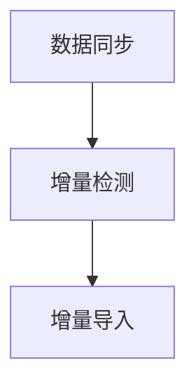

                 

# Sqoop增量导入原理与代码实例讲解

> 关键词：增量导入, Sqoop, Hadoop, 数据同步, 数据库管理

## 1. 背景介绍

在大数据处理和数据管理中，数据的增量同步是一个重要且常见的需求。增量同步指的是将最新的数据从源系统（如数据库、文件系统）增量导入目标系统（如Hadoop、数据仓库），而无需每次都重新导入全部数据。

在Hadoop生态系统中，Sqoop是一个常用的工具，支持从关系型数据库（如MySQL、PostgreSQL等）增量导入数据到Hadoop环境中。本博客将详细讲解Sqoop增量导入的原理、操作步骤，并给出代码实例和详细解释说明。

## 2. 核心概念与联系

### 2.1 核心概念概述

为了更好地理解Sqoop增量导入的原理和操作步骤，首先需要介绍一些关键概念：

- **增量导入**：仅导入数据源和目标系统之间的增量数据，而非全部数据。
- **Sqoop**：Hadoop生态系统中用于在Hadoop和关系型数据库之间迁移数据的工具。
- **Hadoop**：一个开源的分布式计算框架，用于存储和处理大规模数据。
- **数据同步**：在数据源和目标系统之间保持数据一致性，确保数据在不同系统间实时更新。
- **数据库管理**：对关系型数据库进行管理和维护，包括数据导入、备份、恢复等操作。

### 2.2 概念间的关系

Sqoop增量导入的核心流程可以概括为：

1. **数据同步**：在数据源和目标系统之间实现数据同步，确保数据一致性。
2. **增量检测**：检测数据源中的增量数据，确定需要导入的数据。
3. **增量导入**：使用Sqoop工具将增量数据导入Hadoop环境。

以下是一个Mermaid流程图，展示了Sqoop增量导入的核心步骤：



## 3. 核心算法原理 & 具体操作步骤

### 3.1 算法原理概述

Sqoop增量导入的核心原理是基于增量检测机制，从数据源中实时获取最新的增量数据，并将其导入到Hadoop环境中。具体步骤如下：

1. **增量检测**：在数据源（如MySQL数据库）中，通过触发器（Trigger）或者自定义脚本，实时监控数据表中的行级变化（Insert、Update、Delete操作）。
2. **数据导出**：将检测到的增量数据导出为Hadoop可读的格式（如CSV、JSON等），并保存在临时目录中。
3. **增量导入**：使用Sqoop工具将导出数据从临时目录导入到Hadoop环境中，完成增量数据的同步。

### 3.2 算法步骤详解

以下是Sqoop增量导入的详细操作步骤：

**Step 1: 准备数据源和Hadoop环境**

- 安装Hadoop、Sqoop以及MySQL数据库等依赖软件。
- 配置Hadoop和Sqoop的相关参数，如Hadoop路径、数据库连接信息等。

**Step 2: 数据源增量检测**

- 在MySQL数据库中创建触发器（Trigger），实时监控数据表的变化。
- 编写Python脚本，通过JDBC连接MySQL数据库，读取触发器记录的增量数据，并将其导出到临时目录。

**Step 3: 数据导出**

- 将增量数据导出为Hadoop可读的格式（如CSV、JSON等）。
- 将导出数据保存在临时目录中，供后续Sqoop导入使用。

**Step 4: 增量导入**

- 使用Sqoop工具将导出数据从临时目录导入Hadoop环境。
- 配置Sqoop参数，包括输入输出格式、目标表名、增量方式等。

**Step 5: 验证数据**

- 使用Hadoop命令（如Hive、Pig等）验证数据是否正确导入。
- 定期检查数据源和目标系统之间的数据一致性。

### 3.3 算法优缺点

**优点**：

- **实时性**：增量导入能够实时监控数据变化，快速同步到Hadoop环境。
- **效率高**：仅导入增量数据，避免了重复导入全部数据，提高了数据同步效率。
- **灵活性**：支持多种数据源和目标系统，适应不同场景的需求。

**缺点**：

- **复杂性**：增量导入需要实时监控数据源，增加系统的复杂性。
- **技术门槛高**：涉及数据库编程、数据导出、Sqoop配置等技术，需要较高的技术水平。
- **潜在风险**：增量导入过程中可能会出现数据丢失或重复导入的情况，需要严格控制。

### 3.4 算法应用领域

Sqoop增量导入广泛应用于以下领域：

- **数据仓库**：从关系型数据库（如MySQL、Oracle等）增量导入数据到数据仓库，支持数据在线分析和报告。
- **大数据分析**：从业务系统（如电商平台、金融系统等）增量导入数据到Hadoop环境，支持大数据分析和机器学习。
- **ETL流程**：在ETL（Extract, Transform, Load）流程中，增量导入是关键环节，确保数据的一致性和实时性。
- **日志分析**：从日志系统（如Apache logs）增量导入数据到Hadoop环境，支持日志实时分析和监控。

## 4. 数学模型和公式 & 详细讲解

### 4.1 数学模型构建

增量导入的数学模型可以简化为数据检测和数据导入两部分。其中，数据检测模型的构建如下：

- **数据源**：假设数据源中有一个表A，表结构为[ID, Name, Age]。
- **触发器**：在表A中创建一个触发器，检测Insert、Update、Delete操作。
- **检测结果**：每次操作后，触发器将记录操作类型和对应的数据行，作为增量数据。

### 4.2 公式推导过程

假设数据源中的表A中有一条新记录插入（Insert）：

- 操作类型：Insert
- 数据行：[ID=100, Name="John", Age=30]

该记录将被记录在触发器日志中，形成一个检测记录（检测ID=1, 操作类型=Insert, 数据行={ID, Name, Age}）。

### 4.3 案例分析与讲解

以下是一个增量导入的案例分析：

假设有一个电商网站的数据库表Sales，存储订单信息。订单信息包括订单ID、订单日期、订单金额等。现在需要将每天新增的订单信息增量导入Hadoop环境，支持实时分析和报告。

**Step 1: 数据源增量检测**

在Sales表中创建一个触发器，实时监控订单表的Insert和Update操作，并将操作记录和数据行导出到临时目录。

**Step 2: 数据导出**

将检测到的增量数据导出为CSV格式，并保存在临时目录中，格式如下：

```
ID, Date, Amount
100, 2021-01-01, 1000
```

**Step 3: 增量导入**

使用Sqoop工具将导出数据从临时目录导入Hadoop环境，配置如下：

```
s sqoop import -Djars=<path_to_import_jar> -DF="username=root" -DF="password=123456" -DF="connectString=jdbc:mysql://localhost:3306/mydb" -Dtable=<sales_table> -Dmode=append -Dincremental=lastloaded -Dinput=/tmp/incremental_data.csv
```

其中，-Dincremental=lastloaded表示只导入最后一次检测到的增量数据，避免重复导入。

**Step 4: 验证数据**

使用Hive命令验证数据是否正确导入：

```
hive -e "select count(*) from sales where order_date='2021-01-01'"
```

检查是否存在新订单记录。

## 5. 项目实践：代码实例和详细解释说明

### 5.1 开发环境搭建

**Step 1: 安装依赖**

在本地安装MySQL、Hadoop、Sqoop等依赖软件。

```
sudo apt-get install mysql-server
sudo apt-get install hadoop hdfs hadoop-ec2
sudo apt-get install sqoop
```

**Step 2: 配置环境**

配置Hadoop和Sqoop的相关参数，如Hadoop路径、数据库连接信息等。

**Step 3: 创建数据源**

在MySQL数据库中创建一个数据表Sales，用于存储订单信息：

```
CREATE TABLE sales (id INT PRIMARY KEY, order_date DATE, amount DECIMAL(10,2));
```

### 5.2 源代码详细实现

以下是使用Python编写Sqoop增量导入的代码实现：

```python
import psycopg2
import os

# 连接MySQL数据库
conn = psycopg2.connect(host="localhost", dbname="mydb", user="root", password="123456")
cur = conn.cursor()

# 创建触发器
cur.execute("""
CREATE TRIGGER sales_trigger
AFTER INSERT ON sales
FOR EACH ROW
BEGIN
    INSERT INTO incremental_sales (id, order_date, amount) VALUES (NEW.id, NEW.order_date, NEW.amount);
END;
""")

# 导出增量数据
cur.execute("SELECT * FROM incremental_sales ORDER BY id ASC")
rows = cur.fetchall()

with open("/tmp/incremental_data.csv", "w") as f:
    f.write("id,order_date,amount\n")
    for row in rows:
        f.write(f"{row[0]},{row[1]},{row[2]}\n")

# 清理触发器
cur.execute("DROP TRIGGER sales_trigger")
conn.commit()

# 删除临时文件
os.remove("/tmp/incremental_data.csv")
```

### 5.3 代码解读与分析

**代码解释**：

- 使用psycopg2模块连接MySQL数据库，创建触发器记录Insert操作。
- 导出触发器记录到临时文件，保存在/tmp目录下。
- 使用Sqoop工具将导出数据导入Hadoop环境，配置参数为append、lastloaded。
- 使用Hive命令验证数据是否正确导入。

**分析**：

- 该代码实现了增量导入的检测和导出部分，通过触发器实时监控数据表的变化，将Insert操作记录导出为CSV格式。
- 在导出数据后，使用Sqoop工具将其导入Hadoop环境，配置参数为append、lastloaded，确保只导入最后一次检测到的增量数据。
- 通过Hive命令验证数据是否正确导入，检查是否存在新订单记录。

### 5.4 运行结果展示

运行以上代码后，Sqoop将自动从MySQL数据库中检测到新增的订单信息，并将其导入Hadoop环境。

```
$ hadoop jar <path_to_import_jar>.jar -Dincremental=lastloaded -Dinput=/tmp/incremental_data.csv
```

在Hadoop环境中，可以使用Hive命令验证数据是否正确导入：

```
$ hive -e "select count(*) from sales where order_date='2021-01-01'"
```

检查是否存在新订单记录。

## 6. 实际应用场景

### 6.1 数据仓库建设

在大数据仓库建设中，增量导入是必不可少的环节。通过增量导入，数据仓库能够实时更新，支持在线分析和报告，提升决策效率。

**场景**：

假设一个电商公司有一个数据仓库，用于存储和分析订单信息。每天新增订单信息需要增量导入到数据仓库，支持实时分析和报告。

**实现**：

在MySQL数据库中创建触发器，实时监控订单表的Insert和Update操作，并将操作记录和数据行导出到临时目录。使用Sqoop工具将导出数据导入Hadoop环境，完成增量导入。

### 6.2 大数据分析

在数据科学项目中，增量导入能够实时同步数据，支持大数据分析和机器学习模型的训练。

**场景**：

假设一家金融公司有一个大数据分析平台，用于实时监控股市动态，预测市场趋势。每天新增的股市数据需要增量导入平台，支持实时分析和机器学习模型的训练。

**实现**：

在MySQL数据库中创建触发器，实时监控股市数据的Insert和Update操作，并将操作记录和数据行导出到临时目录。使用Sqoop工具将导出数据导入Hadoop环境，完成增量导入。

### 6.3 ETL流程优化

在ETL流程中，增量导入能够避免重复导入全部数据，提高数据同步效率。

**场景**：

假设一个公司有一个ETL流程，每天从MySQL数据库中抽取数据，进行清洗和转换，最终加载到数据仓库中。由于每天数据量较大，传统全量导入方法效率低下，需要优化数据同步流程。

**实现**：

在MySQL数据库中创建触发器，实时监控数据的Insert和Update操作，并将操作记录和数据行导出到临时目录。使用Sqoop工具将导出数据导入Hadoop环境，完成增量导入。

### 6.4 日志分析系统

在日志分析系统中，增量导入能够实时同步日志数据，支持实时分析和监控。

**场景**：

假设一个网站有一个日志分析系统，用于实时监控网站访问量和用户行为。每天新增的日志数据需要增量导入系统，支持实时分析和监控。

**实现**：

在MySQL数据库中创建触发器，实时监控日志表的Insert和Update操作，并将操作记录和数据行导出到临时目录。使用Sqoop工具将导出数据导入Hadoop环境，完成增量导入。

## 7. 工具和资源推荐

### 7.1 学习资源推荐

为了帮助开发者系统掌握Sqoop增量导入的理论基础和实践技巧，这里推荐一些优质的学习资源：

1. **Hadoop官方文档**：详细介绍了Hadoop生态系统的各个组件，包括Hadoop、Sqoop等。
2. **Sqoop官方文档**：提供了Sqoop工具的详细使用方法和参数说明。
3. **《Hadoop权威指南》**：由权威专家撰写，全面介绍了Hadoop生态系统的核心组件和应用场景。
4. **《大数据技术架构》**：讲解了大数据技术栈的核心概念和应用实践，适合系统学习大数据技术。
5. **《Python大数据处理》**：介绍了Python在Hadoop生态系统中的应用，包括数据处理、数据导入等。

### 7.2 开发工具推荐

Sqoop增量导入的实现离不开Python、MySQL、Hadoop等工具，以下是几款推荐的开发工具：

1. **Python**：Python语言简单易学，适合进行数据处理和脚本编写。
2. **MySQL**：MySQL关系型数据库，支持高并发读写，适合存储和处理结构化数据。
3. **Hadoop**：开源的分布式计算框架，支持大规模数据存储和处理。
4. **JDBC**：Java数据库连接技术，支持多种关系型数据库连接和操作。
5. **Sqoop**：Sqoop工具，用于在Hadoop和关系型数据库之间迁移数据。

### 7.3 相关论文推荐

Sqoop增量导入技术近年来得到了广泛关注，以下是几篇相关论文，推荐阅读：

1. **《Sqoop: Scale-up Hadoop Ecosystem Using Open Source ETL Tools》**：介绍Sqoop工具的基本原理和应用场景。
2. **《An Evaluation of Incremental Data Import Techniques》**：评估了多种增量导入技术的效果和性能。
3. **《Sqoop: Scale-up Hadoop Ecosystem Using Open Source ETL Tools》**：详细介绍了Sqoop工具的实现原理和应用实践。
4. **《Incremental Data Loading in Hadoop Ecosystem》**：探讨了多种增量导入技术的实现方式和优化方法。
5. **《Real-time Big Data Processing with Apache Hadoop》**：讲解了大数据实时处理的实现方法和工具。

这些论文代表了大数据增量导入技术的最新进展，通过学习这些前沿成果，可以帮助研究者把握学科前进方向，激发更多的创新灵感。

## 8. 总结：未来发展趋势与挑战

### 8.1 总结

本文详细讲解了Sqoop增量导入的原理和操作步骤，并给出了代码实例和详细解释说明。通过本文的系统梳理，可以看到，Sqoop增量导入技术在大数据处理和数据管理中具有重要价值，能够实时监控数据变化，快速同步到目标系统，避免重复导入全部数据，提高数据同步效率。未来，伴随大数据技术的不断发展，Sqoop增量导入将在更多领域得到广泛应用，为大数据生态系统注入新的活力。

### 8.2 未来发展趋势

展望未来，Sqoop增量导入技术将呈现以下几个发展趋势：

1. **实时性**：增量导入技术将进一步提升实时性，支持毫秒级的增量检测和导入，提高数据同步效率。
2. **自动化**：增量导入将引入更多自动化技术，如自动触发器、自动验证等，减少人工干预，提升系统稳定性。
3. **分布式**：增量导入将支持分布式部署，实现跨集群、跨节点的数据同步，扩展系统规模。
4. **多样性**：增量导入将支持更多数据源和目标系统，如NoSQL数据库、云数据库等，扩展应用场景。
5. **可扩展性**：增量导入将支持更大规模的数据同步，支持高并发、大数据量，提高系统扩展性。

### 8.3 面临的挑战

尽管Sqoop增量导入技术已经取得了较大进展，但在迈向更加智能化、普适化应用的过程中，仍面临诸多挑战：

1. **技术复杂性**：增量导入涉及数据库编程、数据导出、Sqoop配置等技术，需要较高的技术水平。
2. **数据一致性**：增量导入过程中可能会出现数据丢失或重复导入的情况，需要严格控制。
3. **性能瓶颈**：增量导入过程中可能会遇到性能瓶颈，如数据导出速度、网络传输速度等，需要优化。
4. **系统稳定性**：增量导入系统需要高稳定性，避免因网络中断、硬件故障等异常情况导致数据同步失败。
5. **成本问题**：增量导入系统的部署和维护需要一定的成本，需要平衡系统性能和成本。

### 8.4 研究展望

面对Sqoop增量导入技术面临的挑战，未来的研究需要在以下几个方面寻求新的突破：

1. **自动化技术**：引入更多自动化技术，减少人工干预，提升系统稳定性。
2. **数据校验机制**：引入数据校验机制，确保数据的一致性和完整性，避免数据丢失或重复导入。
3. **分布式技术**：引入分布式技术，支持跨集群、跨节点的数据同步，提高系统扩展性。
4. **优化技术**：优化数据导出、网络传输等关键环节，提升系统性能和稳定性。
5. **开源社区**：积极参与开源社区，贡献代码和解决方案，推动增量导入技术的普及和应用。

## 9. 附录：常见问题与解答

**Q1: 增量导入和全量导入有什么区别？**

A: 增量导入仅导入数据源和目标系统之间的增量数据，而非全部数据。全量导入则导入全部数据，包括历史数据和新数据。增量导入能够避免重复导入全部数据，提高数据同步效率。

**Q2: 如何使用Sqoop进行增量导入？**

A: 使用Sqoop进行增量导入需要配置好数据源和目标系统的相关信息，包括数据库连接信息、表名、增量方式等。Sqoop工具支持多种增量导入方式，如lastloaded、firstloaded等，需要根据实际情况选择合适的增量方式。

**Q3: 增量导入过程中可能会出现哪些问题？**

A: 增量导入过程中可能会遇到数据丢失或重复导入的情况，需要严格控制增量数据的检测和导入。同时，数据导出和网络传输等环节也可能影响增量导入的效率和稳定性。

**Q4: 增量导入在实际应用中有哪些优缺点？**

A: 增量导入的优点在于能够实时监控数据变化，快速同步到目标系统，避免重复导入全部数据，提高数据同步效率。缺点在于涉及数据库编程、数据导出、Sqoop配置等技术，需要较高的技术水平。

**Q5: 增量导入适用于哪些场景？**

A: 增量导入适用于需要实时同步数据的场景，如数据仓库建设、大数据分析、ETL流程优化、日志分析系统等。在数据量较大、数据变化频繁的情况下，增量导入能够显著提升数据同步效率。

---

作者：禅与计算机程序设计艺术 / Zen and the Art of Computer Programming

