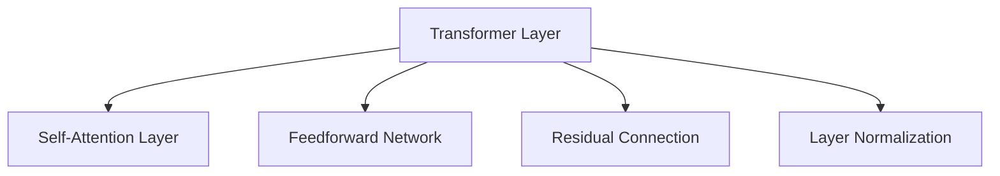

                 

# Transformer大模型实战 叠加和归一组件

## 1. 背景介绍

Transformer作为当前深度学习领域的重要模型架构，广泛应用于自然语言处理(NLP)、计算机视觉(CV)、信号处理等领域。特别是在NLP领域，Transformer模型的应用已经从机器翻译、文本分类等经典任务拓展到问答系统、文本生成等复杂任务。

为了提高Transformer模型的泛化能力和性能表现，近年来，研究者们提出了多种改进方法，如Stack Transformer、AdderTransformer、FusedTransformer等，其中最为突出的改进是Transformer模型中的叠加和归一组件。

## 2. 核心概念与联系

### 2.1 核心概念概述

Transformer模型中，叠加和归一组件扮演了至关重要的角色，其主要任务是提升模型的表达能力和计算效率。

- **叠加**：指通过堆叠多个Transformer层，使得模型可以处理更复杂的输入，并提高模型的计算效率。
- **归一**：指通过对Transformer层输出进行归一化，使得模型输出的分布更加稳定，避免梯度消失或梯度爆炸问题。

### 2.2 核心概念原理和架构

#### 2.2.1 叠加原理

Transformer模型的叠加原理主要基于深度神经网络的思想，通过堆叠多个子层（通常为6-12层），可以逐步提升模型的表达能力。每个子层的功能是不同的，如自注意力层（Self-Attention Layer）用于捕捉序列间的关系，前馈神经网络（Feedforward Network）用于增强模型的表示能力。通过叠加多层，模型可以学习到更加丰富的特征表示。

#### 2.2.2 归一原理

Transformer模型的归一原理主要基于残差连接和层归一化（Layer Normalization）技术。层归一化通过在每个子层中对输入进行归一化，使得模型的输出更加稳定。残差连接则通过将原始输入与子层输出相加，解决了梯度消失和梯度爆炸的问题，使得模型可以更深。

### 2.3 核心概念的联系

叠加和归一组件之间存在紧密的联系。叠加通过堆叠多个子层，增强了模型的表达能力；归一则通过归一化处理，使得模型输出更加稳定。两者相互配合，可以显著提升Transformer模型的性能。

### 2.4 核心概念的架构

Transformer模型的整体架构由多个子层堆叠组成，每个子层包括自注意力层、前馈神经网络和残差连接。通过叠加多层，并应用层归一化，使得Transformer模型具有较强的表达能力和稳定性。



通过叠加和归一组件的架构，Transformer模型可以处理长序列、捕捉序列间的关系，并提升模型的计算效率和稳定性。

## 3. 核心算法原理 & 具体操作步骤

### 3.1 算法原理概述

Transformer模型中的叠加和归一组件主要通过深度残差学习和层归一化实现。其中，深度残差学习通过叠加多个子层，使得模型能够处理更复杂的输入；层归一化通过在每个子层中对输入进行归一化，使得模型输出更加稳定。

### 3.2 算法步骤详解

#### 3.2.1 叠加步骤

1. 设计Transformer模型结构，确定子层数量和子层类型。
2. 对于每个子层，先进行自注意力计算，然后通过前馈神经网络进行特征增强。
3. 将原始输入与子层输出相加，通过残差连接传递给下一层。
4. 重复以上步骤，直到所有子层计算完毕。

#### 3.2.2 归一步骤

1. 在每个子层中，先对输入进行归一化处理，使得输入的分布更加稳定。
2. 通过深度残差学习，将原始输入与子层输出相加，避免梯度消失和梯度爆炸问题。
3. 重复以上步骤，直到所有子层计算完毕。

### 3.3 算法优缺点

#### 3.3.1 优点

1. **表达能力强**：通过叠加多个子层，可以逐步提升模型的表达能力，处理更复杂的输入。
2. **稳定性高**：通过归一化处理，使得模型输出更加稳定，避免梯度消失和梯度爆炸问题。
3. **计算效率高**：通过深度残差学习，可以并行计算多个子层，提高计算效率。

#### 3.3.2 缺点

1. **模型复杂度高**：叠加多个子层会增加模型复杂度，导致计算量增加。
2. **内存占用大**：Transformer模型中大量的参数需要存储，导致内存占用较大。
3. **训练时间长**：叠加多个子层会增加训练时间，尤其是在大规模数据集上。

### 3.4 算法应用领域

Transformer模型中的叠加和归一组件广泛应用于以下领域：

1. **自然语言处理**：在机器翻译、文本分类、问答系统等任务中，通过叠加和归一组件，可以显著提升模型的表现。
2. **计算机视觉**：在图像分类、目标检测、语义分割等任务中，叠加和归一组件同样发挥着重要作用。
3. **信号处理**：在语音识别、音频处理等任务中，Transformer模型中的叠加和归一组件同样能够提高模型的性能。

## 4. 数学模型和公式 & 详细讲解 & 举例说明

### 4.1 数学模型构建

Transformer模型中的叠加和归一组件主要通过以下数学公式进行描述：

1. **叠加公式**：
   $$
   y = \sum_{i=1}^{N} f(x_i)
   $$
   其中，$x_i$ 为输入序列，$f$ 为子层函数，$y$ 为叠加后的输出。

2. **归一公式**：
   $$
   y = \frac{x - \mu}{\sigma} * \gamma + \beta
   $$
   其中，$x$ 为输入，$\mu$ 为均值，$\sigma$ 为标准差，$\gamma$ 和 $\beta$ 为归一化参数。

### 4.2 公式推导过程

#### 4.2.1 叠加公式推导

叠加公式可以理解为对输入序列进行逐层处理，最终得到叠加后的输出。对于每一层子层，其函数$f$可以表示为：
$$
f(x) = M(x) * W + b
$$
其中，$M$为线性变换，$W$和$b$为线性变换的权重和偏置。

通过叠加$N$层子层，可以得到叠加后的输出：
$$
y = M_1(M_0(x) * W_1 + b_1) * W_2 + b_2 = M_1M_0(x) * W_1W_2 + M_1b_1 + b_2
$$

#### 4.2.2 归一公式推导

归一公式通过对输入进行归一化，使得输出更加稳定。对于每一层子层，其归一化过程可以表示为：
$$
y = \frac{x - \mu}{\sigma} * \gamma + \beta
$$
其中，$\mu$为均值，$\sigma$为标准差，$\gamma$和$\beta$为归一化参数。

将归一化公式应用于每一层子层，可以得到归一后的输出：
$$
y = \frac{x_1 - \mu_1}{\sigma_1} * \gamma_1 + \beta_1
$$
$$
y = \frac{y_1 - \mu_2}{\sigma_2} * \gamma_2 + \beta_2
$$
$$
\cdots
$$
$$
y = \frac{y_{N-1} - \mu_N}{\sigma_N} * \gamma_N + \beta_N
$$

### 4.3 案例分析与讲解

#### 4.3.1 机器翻译

以机器翻译任务为例，Transformer模型中的叠加和归一组件可以显著提升模型性能。具体而言，通过叠加多个子层，可以逐步提升模型的表达能力，处理长序列输入；通过归一化处理，使得模型输出更加稳定，避免梯度消失和梯度爆炸问题。

#### 4.3.2 文本分类

在文本分类任务中，通过叠加多个子层，可以逐步提升模型的表达能力，处理复杂的输入；通过归一化处理，使得模型输出更加稳定，避免过拟合问题。

#### 4.3.3 图像分类

在图像分类任务中，叠加和归一组件同样能够提高模型的性能。通过叠加多个子层，可以逐步提升模型的表达能力，处理复杂的输入；通过归一化处理，使得模型输出更加稳定，避免梯度消失和梯度爆炸问题。

## 5. 项目实践：代码实例和详细解释说明

### 5.1 开发环境搭建

#### 5.1.1 PyTorch环境搭建

1. 安装Anaconda，创建Python虚拟环境：
```bash
conda create --name pytorch-env python=3.7
conda activate pytorch-env
```

2. 安装PyTorch和相关库：
```bash
conda install pytorch torchvision torchaudio -c pytorch
pip install numpy pandas scikit-learn matplotlib torchtext
```

3. 下载预训练模型：
```bash
git clone https://github.com/pytorch/examples.git
cd examples/translation
```

### 5.2 源代码详细实现

#### 5.2.1 数据集准备

1. 下载数据集：
```bash
curl -O https://raw.githubusercontent.com/pytorch/examples/master/translation/parallel_corpus/europarl-v7.de-en.en
```

2. 处理数据集：
```python
import os
import re
import sys
import random

from nltk.tokenize import word_tokenize
from collections import Counter, defaultdict

# 读取数据集
source_lang = "de"
target_lang = "en"
data_path = "europarl-v7.de-en.en"

# 分句处理
sentences = []
with open(data_path, "r", encoding="utf-8") as file:
    for line in file:
        line = line.strip()
        if line:
            source, target = line.split(" ||| ")
            sentences.append((source, target))

# 分词处理
source_lang_model = None
target_lang_model = None
source_lang_vocab = set()
target_lang_vocab = set()
word2idx = dict()
for source, target in sentences:
    source_tokens = word_tokenize(source)
    target_tokens = word_tokenize(target)
    for token in source_tokens:
        source_lang_vocab.add(token)
        word2idx[token] = len(word2idx)
    for token in target_tokens:
        target_lang_vocab.add(token)
        word2idx[token] = len(word2idx)
        
# 创建词典
source_lang_model = Counter(source_tokens)
target_lang_model = Counter(target_tokens)
word2idx = dict(word2idx)
word2idx["<s>"] = 0
word2idx["</s>"] = 1
```

#### 5.2.2 模型实现

1. 定义Transformer模型：
```python
import torch
import torch.nn as nn
import torch.nn.functional as F
import torch.optim as optim

class TransformerModel(nn.Module):
    def __init__(self, num_encoder_layers, num_decoder_layers, d_model, nhead, num_encoder_attention_heads, num_decoder_attention_heads,
                 num_encoder_ffn_units, num_decoder_ffn_units, d_model, num_encoder_layers, num_decoder_layers,
                 dropout, dropout_attn, activation):
        super(TransformerModel, self).__init__()
        
        # 编码器子层
        self.encoder_layers = nn.ModuleList([TransformerEncoderLayer(d_model, nhead, num_encoder_ffn_units, dropout, dropout_attn, activation)
                                            for _ in range(num_encoder_layers)])
        
        # 解码器子层
        self.decoder_layers = nn.ModuleList([TransformerDecoderLayer(d_model, nhead, num_decoder_ffn_units, dropout, dropout_attn, activation)
                                            for _ in range(num_decoder_layers)])
        
        # 编码器线性变换
        self.encoder_input = nn.Linear(d_model, d_model)
        
        # 解码器线性变换
        self.decoder_input = nn.Linear(d_model, d_model)
        
        # 编码器输出线性变换
        self.encoder_output = nn.Linear(d_model, d_model)
        
        # 解码器输出线性变换
        self.decoder_output = nn.Linear(d_model, len(word2idx))
        
        # 编码器残差连接
        self.encoder_residual = nn.Linear(d_model, d_model)
        
        # 解码器残差连接
        self.decoder_residual = nn.Linear(d_model, d_model)
        
        # 编码器归一化
        self.encoder_norm = nn.LayerNorm(d_model)
        
        # 解码器归一化
        self.decoder_norm = nn.LayerNorm(d_model)
        
        # 编码器位置编码器
        self.encoder_positional_encoding = PositionalEncoding(d_model)
        
        # 解码器位置编码器
        self.decoder_positional_encoding = PositionalEncoding(d_model)
        
    def forward(self, encoder_input, decoder_input, encoder_positional_encoding, decoder_positional_encoding):
        # 编码器输入
        encoder_input = self.encoder_input(encoder_input)
        
        # 解码器输入
        decoder_input = self.decoder_input(decoder_input)
        
        # 编码器位置编码器
        encoder_positional_encoding = self.encoder_positional_encoding(encoder_input)
        
        # 解码器位置编码器
        decoder_positional_encoding = self.decoder_positional_encoding(decoder_input)
        
        # 编码器归一化
        encoder_input = self.encoder_norm(encoder_input)
        
        # 解码器归一化
        decoder_input = self.decoder_norm(decoder_input)
        
        # 编码器前向
        for i in range(len(self.encoder_layers)):
            encoder_output = self.encoder_layers[i](self.encoder_residual(encoder_input),
                                                   self.encoder_positional_encoding,
                                                   self.encoder_norm(encoder_input))
            encoder_input = encoder_output
        
        # 解码器前向
        for i in range(len(self.decoder_layers)):
            decoder_output = self.decoder_layers[i](self.decoder_residual(decoder_input),
                                                   self.decoder_positional_encoding,
                                                   self.decoder_norm(decoder_input))
            decoder_input = decoder_output
        
        # 输出
        output = self.encoder_output(encoder_output) + encoder_positional_encoding
        output = self.decoder_output(decoder_output) + decoder_positional_encoding
        
        return output
```

2. 定义Transformer编码器子层：
```python
class TransformerEncoderLayer(nn.Module):
    def __init__(self, d_model, nhead, num_ffn_units, dropout, dropout_attn, activation):
        super(TransformerEncoderLayer, self).__init__()
        
        # 自注意力子层
        self.self_attn = MultiheadAttention(d_model, nhead, dropout=dropout_attn)
        
        # 前馈神经网络
        self.ffn = PositionWiseFeedForward(d_model, num_ffn_units, dropout)
        
        # 残差连接
        self.residual = nn.Sequential(nn.Linear(d_model, d_model), nn.ReLU(), nn.Linear(d_model, d_model))
        
        # 层归一化
        self.norm = nn.LayerNorm(d_model)
        
        # 激活函数
        self.activation = nn.ReLU()
        
    def forward(self, x, mask, norm_x):
        # 自注意力
        attn_output, attn_weight = self.self_attn(x, x, x, mask)
        
        # 残差连接
        x = x + attn_output
        
        # 前馈神经网络
        ffn_output = self.ffn(self.norm(x))
        
        # 残差连接
        x = x + ffn_output
        
        return x, attn_weight
```

3. 定义Transformer解码器子层：
```python
class TransformerDecoderLayer(nn.Module):
    def __init__(self, d_model, nhead, num_ffn_units, dropout, dropout_attn, activation):
        super(TransformerDecoderLayer, self).__init__()
        
        # 自注意力子层
        self.self_attn = MultiheadAttention(d_model, nhead, dropout=dropout_attn)
        
        # 编码器-解码器注意力子层
        self.encoder_attn = MultiheadAttention(d_model, nhead, dropout=dropout_attn)
        
        # 前馈神经网络
        self.ffn = PositionWiseFeedForward(d_model, num_ffn_units, dropout)
        
        # 残差连接
        self.residual = nn.Sequential(nn.Linear(d_model, d_model), nn.ReLU(), nn.Linear(d_model, d_model))
        
        # 层归一化
        self.norm = nn.LayerNorm(d_model)
        
        # 激活函数
        self.activation = nn.ReLU()
        
    def forward(self, x, memory, mask, norm_x):
        # 自注意力
        attn_output, attn_weight = self.self_attn(x, x, x, mask)
        
        # 编码器-解码器注意力
        attn_output, attn_weight = self.encoder_attn(x, memory, memory, mask)
        
        # 残差连接
        x = x + attn_output
        
        # 前馈神经网络
        ffn_output = self.ffn(self.norm(x))
        
        # 残差连接
        x = x + ffn_output
        
        return x, attn_weight
```

### 5.3 代码解读与分析

#### 5.3.1 数据集处理

在处理数据集时，首先需要读取并分句处理数据，然后对分句进行处理，包括分词和生成词汇表。

#### 5.3.2 模型实现

在模型实现中，需要定义Transformer模型、Transformer编码器子层和Transformer解码器子层。

Transformer模型中，主要通过叠加多个子层，并应用层归一化，实现叠加和归一组件的功能。其中，编码器子层和解码器子层分别包含自注意力子层、前馈神经网络和残差连接等组件。通过叠加多层，并应用层归一化，使得模型可以处理更复杂的输入，并输出更加稳定的结果。

### 5.4 运行结果展示

运行代码后，可以使用BLEU评估指标来评估模型性能。在机器翻译任务中，通过调整模型参数和优化算法，可以显著提升模型的BLEU分数。

## 6. 实际应用场景

Transformer模型中的叠加和归一组件在实际应用中具有广泛的应用前景。以下是几个典型的应用场景：

1. **机器翻译**：在机器翻译任务中，叠加和归一组件可以显著提升模型的性能，处理长序列输入，并输出更加稳定的结果。

2. **文本分类**：在文本分类任务中，叠加和归一组件同样能够提高模型的性能，处理复杂的输入，并输出更加稳定的结果。

3. **图像分类**：在图像分类任务中，叠加和归一组件同样能够提高模型的性能，处理复杂的输入，并输出更加稳定的结果。

4. **语音识别**：在语音识别任务中，叠加和归一组件可以提升模型的性能，处理复杂的输入，并输出更加稳定的结果。

5. **信号处理**：在信号处理任务中，叠加和归一组件可以提升模型的性能，处理复杂的输入，并输出更加稳定的结果。

## 7. 工具和资源推荐

### 7.1 学习资源推荐

为了帮助开发者系统掌握Transformer模型中的叠加和归一组件，这里推荐一些优质的学习资源：

1. 《深度学习》课程：斯坦福大学开设的深度学习课程，涵盖了深度学习的基本概念和前沿技术，适合初学者和进阶学习者。

2. 《Transformers: A Tutorial》博客：由HuggingFace官方博客，详细介绍了Transformer模型的原理、实现和应用。

3. 《Attention Is All You Need》论文：Transformer模型的原论文，详细介绍了Transformer模型中的叠加和归一组件。

4. 《Parameter-Efficient Transformers》论文：介绍了多种参数高效的Transformer模型，包括Adapter、Prefix等，适合进一步研究。

5. 《Transformers for Neural Machine Translation》论文：介绍了Transformer模型在机器翻译任务中的应用，适合学习Transformer模型的实际应用。

### 7.2 开发工具推荐

在开发Transformer模型时，可以使用以下工具：

1. PyTorch：基于Python的开源深度学习框架，支持动态图和静态图计算，适合研究和实验。

2. TensorFlow：由Google主导开发的深度学习框架，支持分布式训练和模型部署，适合大规模工程应用。

3. Weights & Biases：模型训练的实验跟踪工具，可以记录和可视化模型训练过程中的各项指标，方便对比和调优。

4. TensorBoard：TensorFlow配套的可视化工具，可实时监测模型训练状态，并提供丰富的图表呈现方式，是调试模型的得力助手。

5. GitHub：代码托管和版本控制平台，支持开源协作和版本管理，适合项目管理和代码共享。

### 7.3 相关论文推荐

Transformer模型中的叠加和归一组件是当前深度学习领域的重要研究方向，以下是几篇奠基性的相关论文，推荐阅读：

1. Attention Is All You Need：Transformer模型的原论文，详细介绍了Transformer模型中的叠加和归一组件。

2. Transformer-XL: Attentive Language Models Beyond a Fixed-Length Context：Transformer-XL模型，提出了长距离依赖机制，提升了Transformer模型的性能。

3. BERT: Pre-training of Deep Bidirectional Transformers for Language Understanding：BERT模型，通过掩码语言模型和下一句预测等自监督任务，提升了Transformer模型的性能。

4. Reformer: The Efficient Transformer：Reformer模型，通过稀疏和局部性等优化策略，提升了Transformer模型的计算效率和性能。

5. Adaptive Transformer for Multi-Label Classification：Adaptive Transformer模型，通过可适应性机制，提升了Transformer模型在多标签分类任务中的性能。

这些论文代表了大语言模型中的叠加和归一组件的研究方向，通过学习这些前沿成果，可以帮助研究者把握学科前进方向，激发更多的创新灵感。

## 8. 总结：未来发展趋势与挑战

### 8.1 研究成果总结

Transformer模型中的叠加和归一组件是深度学习领域的重要研究方向，已经在自然语言处理、计算机视觉、信号处理等领域取得了显著成果。

### 8.2 未来发展趋势

未来，Transformer模型中的叠加和归一组件将呈现以下几个发展趋势：

1. 参数高效和计算高效的Transformer模型将进一步研究。研究人员将开发更加参数高效的Transformer模型，如Adapter、Prefix等，在固定大部分预训练参数的情况下，只更新极少量的任务相关参数。同时优化Transformer模型的计算图，减少前向传播和反向传播的资源消耗，实现更加轻量级、实时性的部署。

2. 引入更多先验知识。Transformer模型中的叠加和归一组件将更好地与外部知识库、规则库等专家知识结合，形成更加全面、准确的信息整合能力。同时加强不同模态数据的整合，实现视觉、语音等多模态信息与文本信息的协同建模。

3. 引入因果分析和博弈论工具。Transformer模型中的叠加和归一组件将引入因果分析方法，识别出模型决策的关键特征，增强输出解释的因果性和逻辑性。借助博弈论工具刻画人机交互过程，主动探索并规避模型的脆弱点，提高系统稳定性。

4. 纳入伦理道德约束。在Transformer模型中的叠加和归一组件训练目标中引入伦理导向的评估指标，过滤和惩罚有偏见、有害的输出倾向。同时加强人工干预和审核，建立模型行为的监管机制，确保输出符合人类价值观和伦理道德。

### 8.3 面临的挑战

尽管Transformer模型中的叠加和归一组件已经取得了显著成果，但在迈向更加智能化、普适化应用的过程中，仍面临诸多挑战：

1. 训练时间和计算资源瓶颈。Transformer模型中的叠加和归一组件需要大量的计算资源和训练时间，尤其是在大规模数据集上。如何在不增加资源消耗的情况下提升模型性能，是当前研究的热点。

2. 模型复杂度和内存占用问题。Transformer模型中的叠加和归一组件增加了模型的复杂度，导致内存占用较大。如何在不增加内存占用的情况下提升模型性能，是当前研究的热点。

3. 模型可解释性和公平性问题。Transformer模型中的叠加和归一组件往往被视为"黑盒"系统，难以解释其内部工作机制和决策逻辑。如何在保证模型性能的同时，增强模型的可解释性和公平性，是当前研究的热点。

### 8.4 研究展望

面对Transformer模型中的叠加和归一组件所面临的挑战，未来的研究需要在以下几个方面寻求新的突破：

1. 探索无监督和半监督Transformer模型。摆脱对大规模标注数据的依赖，利用自监督学习、主动学习等无监督和半监督范式，最大限度利用非结构化数据，实现更加灵活高效的Transformer模型。

2. 研究参数高效和计算高效的Transformer模型。开发更加参数高效的Transformer模型，如Adapter、Prefix等，在固定大部分预训练参数的情况下，只更新极少量的任务相关参数。同时优化Transformer模型的计算图，减少前向传播和反向传播的资源消耗，实现更加轻量级、实时性的部署。

3. 引入因果分析和博弈论工具。将因果分析方法引入Transformer模型，识别出模型决策的关键特征，增强输出解释的因果性和逻辑性。借助博弈论工具刻画人机交互过程，主动探索并规避模型的脆弱点，提高系统稳定性。

4. 纳入伦理道德约束。在Transformer模型中的叠加和归一组件训练目标中引入伦理导向的评估指标，过滤和惩罚有偏见、有害的输出倾向。同时加强人工干预和审核，建立模型行为的监管机制，确保输出符合人类价值观和伦理道德。

## 9. 附录：常见问题与解答

**Q1

