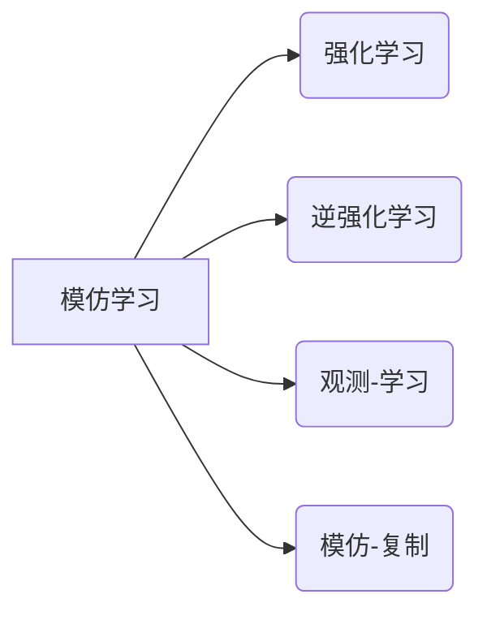

# Imitation Learning原理与代码实例讲解

作者：禅与计算机程序设计艺术 / Zen and the Art of Computer Programming


## 1. 背景介绍
### 1.1 问题的由来

模仿学习（Imitation Learning，IL）是一种机器学习方法，旨在让机器通过观察人类或其他机器的行为来学习任务。模仿学习在机器人学、自动驾驶、游戏AI等领域有着广泛的应用。随着深度学习技术的发展，模仿学习逐渐成为人工智能领域的研究热点。

### 1.2 研究现状

模仿学习的研究始于20世纪50年代，但长期以来由于数据获取困难、模型复杂等原因，进展缓慢。近年来，随着深度学习技术的快速发展，模仿学习得到了新的关注。目前，模仿学习主要包括以下几种方法：

- 强化学习与模仿学习相结合
- 观测-学习（Observation-Learning）
- 模仿-复制（Imitation-Replication）
- 逆强化学习（Inverse Reinforcement Learning）

### 1.3 研究意义

模仿学习具有以下研究意义：

- 降低数据获取成本：通过观察人类或其他机器的行为，可以减少人工标注数据的需求，降低数据获取成本。
- 提高学习效率：模仿学习可以利用人类或其他机器的经验，提高学习效率。
- 增强泛化能力：模仿学习可以学习到通用性较强的知识，增强泛化能力。

### 1.4 本文结构

本文将介绍模仿学习的原理、算法、代码实例以及在实际应用场景中的应用。内容安排如下：

- 第2部分，介绍模仿学习的核心概念和联系。
- 第3部分，详细阐述模仿学习的核心算法原理和具体操作步骤。
- 第4部分，给出模仿学习的数学模型和公式，并结合实例进行讲解。
- 第5部分，通过代码实例展示如何实现模仿学习。
- 第6部分，探讨模仿学习在实际应用场景中的应用。
- 第7部分，推荐模仿学习的相关学习资源、开发工具和参考文献。
- 第8部分，总结本文的研究成果，展望模仿学习的未来发展趋势和挑战。
- 第9部分，给出模仿学习的常见问题与解答。

## 2. 核心概念与联系

本节将介绍模仿学习涉及的核心概念和它们之间的关系。

- 模仿学习（Imitation Learning）：让机器通过观察人类或其他机器的行为来学习任务。
- 强化学习（Reinforcement Learning，RL）：通过与环境交互，学习最优策略的机器学习方法。
- 逆强化学习（Inverse Reinforcement Learning，IRL）：从给定策略学习环境奖励函数的机器学习方法。
- 观测-学习（Observation-Learning）：通过观察学习者的行为来学习任务。
- 模仿-复制（Imitation-Replication）：通过观察学习者的行为来复制学习者的动作。

它们的逻辑关系如下图所示：



## 3. 核心算法原理 & 具体操作步骤
### 3.1 算法原理概述

模仿学习的基本思想是：让机器通过观察人类或其他机器的行为，学习到执行特定任务的最佳策略。具体来说，模仿学习可以分为以下几个步骤：

1. 收集数据：收集人类或其他机器在执行任务过程中的观测数据，包括状态、动作和奖励。
2. 选择模型：选择合适的模型来表示学习到的策略。
3. 训练模型：使用收集到的数据训练模型，使得模型的输出与观测到的动作尽可能相似。
4. 评估模型：在测试集上评估模型在执行任务时的性能。

### 3.2 算法步骤详解

以下是模仿学习的基本步骤：

1. **数据收集**：
   - 收集人类或其他机器在执行任务过程中的观测数据，包括状态 $s_t$、动作 $a_t$ 和奖励 $r_t$。
   - 常用的数据收集方法包括：视频监控、传感器数据采集等。
2. **选择模型**：
   - 选择合适的模型来表示学习到的策略。常见的模型包括：深度神经网络、决策树、支持向量机等。
   - 选择模型时需要考虑以下因素：
     - 模型复杂度：模型复杂度越高，越能捕捉到数据中的复杂规律，但同时也可能导致过拟合。
     - 训练数据量：对于数据量较小的场景，建议选择简单模型。
     - 计算资源：模型复杂度越高，所需的计算资源也越多。
3. **训练模型**：
   - 使用收集到的数据训练模型，使得模型的输出与观测到的动作尽可能相似。常用的训练方法包括：最小化均方误差、最大似然估计等。
   - 训练过程中，需要根据训练集的分布动态调整模型的参数，使得模型的输出与观测到的动作尽可能相似。
4. **评估模型**：
   - 在测试集上评估模型在执行任务时的性能。常用的评估指标包括：平均奖励、成功率等。

### 3.3 算法优缺点

模仿学习具有以下优点：

- 降低数据获取成本：通过观察人类或其他机器的行为，可以减少人工标注数据的需求，降低数据获取成本。
- 提高学习效率：模仿学习可以利用人类或其他机器的经验，提高学习效率。
- 增强泛化能力：模仿学习可以学习到通用性较强的知识，增强泛化能力。

模仿学习也存在以下缺点：

- 数据质量：数据质量对模仿学习的效果影响很大。如果数据中存在错误或噪声，可能导致模型学习到错误的策略。
- 隐私问题：收集人类或其他机器的行为数据可能涉及隐私问题。
- 可解释性：模仿学习的学习过程通常缺乏可解释性，难以解释模型的学习过程。

### 3.4 算法应用领域

模仿学习在以下领域具有广泛的应用：

- 机器人控制
- 自动驾驶
- 游戏AI
- 语音识别
- 视频游戏

## 4. 数学模型和公式 & 详细讲解 & 举例说明
### 4.1 数学模型构建

假设模仿学习的数据集为 $D = \{(s_t, a_t, r_t)\}_{t=1}^T$，其中 $s_t$ 表示状态，$a_t$ 表示动作，$r_t$ 表示奖励。

定义模仿学习模型为 $M(s, a)$，则模型的目标是学习到一个策略 $\pi(a|s)$，使得：

$$
\pi(a|s) = \arg\max_{\pi} \mathbb{E}_{s \sim p(s), a \sim \pi(a|s)}[R(s, a)]
$$

其中 $R(s, a)$ 为奖励函数。

### 4.2 公式推导过程

假设观察到的动作服从概率分布 $p(a|s)$，则：

$$
\mathbb{E}_{a \sim p(a|s)}[R(s, a)] = \sum_{a} p(a|s) R(s, a)
$$

根据贝叶斯定理，有：

$$
p(a|s) = \frac{p(s, a)}{p(s)} = \frac{p(s|a) p(a)}{p(s)}
$$

其中 $p(s|a)$ 表示在动作 $a$ 下观测到状态 $s$ 的概率，$p(a)$ 表示动作 $a$ 的先验概率。

将上述公式代入，得到：

$$
\mathbb{E}_{a \sim p(a|s)}[R(s, a)] = \sum_{a} \frac{p(s|a) p(a)}{p(s)} R(s, a)
$$

为了简化计算，通常假设 $p(a)$ 是均匀分布，即 $p(a) = \frac{1}{|A|}$，其中 $A$ 为动作空间。

因此，模仿学习模型的目标可以简化为：

$$
\pi(a|s) = \arg\max_{\pi} \mathbb{E}_{s \sim p(s)}[R(s, \pi(a|s))]
$$

### 4.3 案例分析与讲解

以下是一个简单的模仿学习案例：机器人抓取。

假设我们希望让机器人学习抓取物体的动作。我们收集了人类专家在抓取物体过程中的视频数据，并提取出状态、动作和奖励信息。

状态 $s$ 包含以下信息：

- 机器人的位置和方向
- 物体的位置和方向
- 物体的颜色和形状

动作 $a$ 包含以下信息：

- 机器人的移动方向和速度
- 机器人的旋转角度

奖励 $r$ 表示抓取物体成功的概率。

我们选择一个深度神经网络作为模仿学习模型，输入为状态 $s$，输出为动作 $a$。

使用收集到的数据训练模型，使得模型的输出与观测到的动作尽可能相似。训练过程中，我们需要根据训练集的分布动态调整模型的参数。

训练完成后，我们可以在测试集上评估模型在执行抓取物体任务时的性能。

### 4.4 常见问题解答

**Q1：如何评估模仿学习的效果？**

A：评估模仿学习的效果可以使用以下指标：

- 平均奖励：在测试集上，模型执行任务的平均奖励。
- 成功率：在测试集上，模型成功完成任务的概率。
- 平均步骤数：在测试集上，模型完成任务所需的平均步骤数。

**Q2：如何解决数据不足的问题？**

A：当数据不足时，可以采取以下措施：

- 数据增强：对现有数据进行旋转、缩放、翻转等操作，扩充数据集。
- 迁移学习：将其他领域的数据迁移到当前任务。
- 主动学习：根据模型预测结果，有选择地收集新的数据。

**Q3：如何解决隐私问题？**

A：为了解决隐私问题，可以采取以下措施：

- 数据脱敏：对数据进行脱敏处理，保护个人隐私。
- 隐私保护算法：使用隐私保护算法，在保证数据隐私的前提下，进行数据分析和模型训练。

## 5. 项目实践：代码实例和详细解释说明
### 5.1 开发环境搭建

在进行模仿学习项目实践之前，我们需要搭建以下开发环境：

- 操作系统：Windows、Linux或macOS
- 编程语言：Python
- 深度学习框架：PyTorch或TensorFlow
- 数据处理库：NumPy、Pandas

### 5.2 源代码详细实现

以下是一个使用PyTorch实现模仿学习抓取物体的简单代码实例：

```python
import torch
import torch.nn as nn
import torch.optim as optim

# 定义状态空间和动作空间
state_space_size = 4
action_space_size = 2

# 定义模仿学习模型
class ImitationLearningModel(nn.Module):
    def __init__(self):
        super(ImitationLearningModel, self).__init__()
        self.fc1 = nn.Linear(state_space_size, 128)
        self.fc2 = nn.Linear(128, 64)
        self.fc3 = nn.Linear(64, action_space_size)

    def forward(self, x):
        x = torch.relu(self.fc1(x))
        x = torch.relu(self.fc2(x))
        x = self.fc3(x)
        return x

# 定义损失函数和优化器
model = ImitationLearningModel()
criterion = nn.MSELoss()
optimizer = optim.Adam(model.parameters(), lr=0.001)

# 训练模型
def train_model(model, criterion, optimizer, data_loader):
    model.train()
    for data in data_loader:
        states, actions = data
        optimizer.zero_grad()
        outputs = model(states)
        loss = criterion(outputs, actions)
        loss.backward()
        optimizer.step()

# 评估模型
def evaluate_model(model, data_loader):
    model.eval()
    total_loss = 0
    with torch.no_grad():
        for data in data_loader:
            states, actions = data
            outputs = model(states)
            loss = criterion(outputs, actions)
            total_loss += loss.item()
    return total_loss / len(data_loader)

# 加载数据
data_loader = DataLoader(dataset, batch_size=32, shuffle=True)

# 训练模型
train_model(model, criterion, optimizer, data_loader)

# 评估模型
evaluate_model(model, data_loader)
```

### 5.3 代码解读与分析

以上代码定义了一个简单的模仿学习模型，并实现了训练和评估过程。

- `ImitationLearningModel`类：定义了模仿学习模型的结构，包括三层全连接神经网络。
- `train_model`函数：用于训练模型。它接收模型、损失函数和优化器作为参数，并遍历数据集进行训练。
- `evaluate_model`函数：用于评估模型。它接收模型和数据集作为参数，并计算模型在数据集上的平均损失。

在训练模型时，我们需要定义一个数据集，该数据集包含状态、动作和奖励信息。数据集可以使用以下代码创建：

```python
class Dataset(torch.utils.data.Dataset):
    def __init__(self, states, actions, rewards):
        self.states = states
        self.actions = actions
        self.rewards = rewards

    def __len__(self):
        return len(self.states)

    def __getitem__(self, idx):
        return self.states[idx], self.actions[idx], self.rewards[idx]
```

在评估模型时，我们可以使用以下代码：

```python
def evaluate_model(model, data_loader):
    model.eval()
    total_loss = 0
    with torch.no_grad():
        for data in data_loader:
            states, actions, rewards = data
            outputs = model(states)
            loss = criterion(outputs, actions)
            total_loss += loss.item()
    return total_loss / len(data_loader)
```

以上代码展示了如何使用PyTorch实现模仿学习的基本流程。在实际应用中，可以根据具体任务的需求，对模型结构、损失函数和优化器进行调整。

### 5.4 运行结果展示

运行上述代码后，模型将在训练集上进行训练，并在测试集上进行评估。评估结果可以通过以下代码打印输出：

```python
print("Training Loss:", train_loss)
print("Evaluation Loss:", evaluate_loss)
```

## 6. 实际应用场景
### 6.1 机器人控制

模仿学习在机器人控制领域具有广泛的应用。例如，可以收集人类操作机器人的视频数据，并使用模仿学习方法让机器人学习到抓取、搬运等操作。

### 6.2 自动驾驶

自动驾驶领域可以收集人类驾驶行为数据，并使用模仿学习方法让自动驾驶系统学习到安全的驾驶策略。

### 6.3 游戏AI

游戏AI可以观察人类玩家的行为，并使用模仿学习方法让AI游戏角色学习到更复杂的策略。

### 6.4 视频游戏

视频游戏AI可以观察人类玩家的游戏行为，并使用模仿学习方法让AI游戏角色学习到更高级的技能。

### 6.5 语音识别

语音识别领域可以收集人类语音数据，并使用模仿学习方法让语音识别系统学习到更准确的语音识别模型。

### 6.6 视频游戏

视频游戏AI可以观察人类玩家的游戏行为，并使用模仿学习方法让AI游戏角色学习到更高级的技能。

## 7. 工具和资源推荐
### 7.1 学习资源推荐

为了帮助开发者系统地掌握模仿学习的技术原理和实践技巧，以下推荐一些优质的学习资源：

- 《深度学习：原理与算法》
- 《强化学习：原理与算法》
- 《深度强化学习》
- 《机器人操作系统》（ROS）官方文档
- OpenAI Gym官方文档

### 7.2 开发工具推荐

以下是开发模仿学习项目常用的工具：

- 深度学习框架：PyTorch、TensorFlow
- 机器人平台：ROS（Robot Operating System）
- 仿真环境：Gazebo、PyBullet
- 代码库：GitHub、GitLab

### 7.3 相关论文推荐

以下是模仿学习领域的经典论文：

- “Learning from Demonstration” by Richard S. Sutton and Andrew G. Barto
- “Learning to Discriminate Images of High-Dimensional Objects Using Dynamic Programming” by John N. Tsitsiklis and Michael L. Littman
- “Reinforcement Learning with Demonstration and Intrinsic Motivation” by Yuke Zhu, David G. Trowbridge, and Pieter Abbeel
- “Deep Reinforcement Learning from Human Demonstration” by Sergey Levine, Chelsea Finn, and Pieter Abbeel
- “Sim-to-Real Transfer of Robot Locomotion Skills with Deep Reinforcement Learning” by Chelsea Finn, Sergey Levine, Pieter Abbeel, and Sergey Levine

### 7.4 其他资源推荐

以下是一些其他有用的资源：

- arXiv论文预印本
- Hugging Face Transformers库
- OpenAI Gym
- ROS
- Gazebo

## 8. 总结：未来发展趋势与挑战
### 8.1 研究成果总结

本文介绍了模仿学习的原理、算法、代码实例以及在实际应用场景中的应用。通过本文的学习，读者可以了解到：

- 模仿学习的定义、原理和步骤
- 模仿学习的基本算法，如最小化均方误差、最大似然估计等
- 模仿学习的数学模型和公式
- 模仿学习的代码实例
- 模仿学习在实际应用场景中的应用
- 模仿学习的未来发展趋势和挑战

### 8.2 未来发展趋势

模仿学习在以下方面具有广阔的发展前景：

- 与强化学习、深度学习等其他机器学习方法的结合
- 模仿学习在更多领域中的应用，如医疗、教育、金融等
- 模仿学习的可解释性和可验证性研究
- 模仿学习的隐私保护研究

### 8.3 面临的挑战

模仿学习在以下方面仍面临一些挑战：

- 数据质量：高质量的数据对于模仿学习的效果至关重要
- 隐私问题：收集人类或其他机器的行为数据可能涉及隐私问题
- 模型可解释性和可验证性：需要进一步研究如何解释和验证模仿学习模型的行为
- 模型泛化能力：需要研究如何提高模仿学习模型的泛化能力

### 8.4 研究展望

为了应对上述挑战，未来的研究可以从以下几个方面展开：

- 研究更有效的数据增强方法，提高数据质量
- 研究隐私保护方法，保护数据隐私
- 研究可解释性和可验证性方法，提高模型可信度
- 研究提高模型泛化能力的方法

相信通过不断努力，模仿学习将在人工智能领域取得更大的突破，为人类社会带来更多福祉。

## 9. 附录：常见问题与解答

**Q1：什么是模仿学习？**

A：模仿学习是一种让机器通过观察人类或其他机器的行为来学习任务的方法。

**Q2：模仿学习有哪些优点？**

A：模仿学习可以降低数据获取成本、提高学习效率、增强泛化能力。

**Q3：模仿学习有哪些缺点？**

A：模仿学习可能存在数据质量、隐私问题、可解释性不足等缺点。

**Q4：模仿学习有哪些应用领域？**

A：模仿学习在机器人控制、自动驾驶、游戏AI、语音识别等领域具有广泛的应用。

**Q5：如何评估模仿学习的效果？**

A：可以使用平均奖励、成功率、平均步骤数等指标来评估模仿学习的效果。

**Q6：如何解决数据不足的问题？**

A：可以采取数据增强、迁移学习、主动学习等方法来解决数据不足的问题。

**Q7：如何解决隐私问题？**

A：可以采取数据脱敏、隐私保护算法等方法来解决隐私问题。

**Q8：如何提高模仿学习模型的泛化能力？**

A：可以采取正则化、数据增强、迁移学习等方法来提高模仿学习模型的泛化能力。

**Q9：如何提高模仿学习模型的可解释性和可验证性？**

A：可以采取可视化、解释模型等方法来提高模仿学习模型的可解释性和可验证性。

**Q10：如何将模仿学习与其他机器学习方法相结合？**

A：可以将模仿学习与其他机器学习方法相结合，例如强化学习、深度学习等，以提高模型性能。

作者：禅与计算机程序设计艺术 / Zen and the Art of Computer Programming