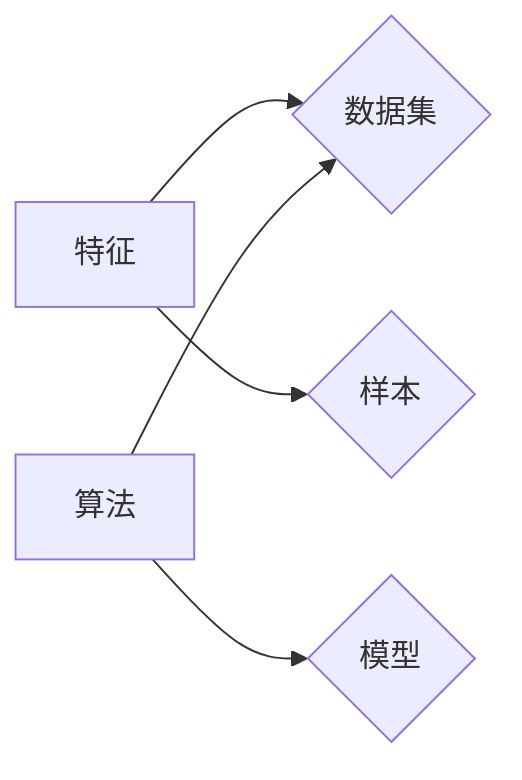

# Scikit-learn 原理与代码实战案例讲解

作者：禅与计算机程序设计艺术 / Zen and the Art of Computer Programming

## 1. 背景介绍

### 1.1 问题的由来

随着大数据时代的到来，数据分析、机器学习等技术在各个领域得到了广泛应用。Scikit-learn 是一个开源的机器学习库，它提供了丰富的机器学习算法和工具，成为了数据分析与机器学习领域的热门选择。本文旨在深入讲解 Scikit-learn 的原理，并通过实战案例演示如何使用 Scikit-learn 进行数据分析和机器学习。

### 1.2 研究现状

Scikit-learn 自 2007 年发布以来，已经成为了数据分析与机器学习领域的明星库。它集成了许多经典且实用的算法，包括分类、回归、聚类、降维等，并提供了易于使用的 API 和工具。Scikit-learn 的成功离不开其简单易用、功能强大、文档齐全等特点。

### 1.3 研究意义

学习 Scikit-learn 有以下意义：

- **提高数据分析与机器学习技能**：Scikit-learn 提供了丰富的算法和工具，可以帮助学习者快速掌握机器学习的基本原理和应用。
- **解决实际问题**：通过 Scikit-learn 可以解决各种实际问题，如图像识别、文本分类、异常检测等。
- **提高工作效率**：Scikit-learn 的易用性可以帮助开发者节省时间，提高工作效率。

### 1.4 本文结构

本文将分为以下几个部分：

- 核心概念与联系
- 核心算法原理 & 具体操作步骤
- 数学模型和公式 & 详细讲解 & 举例说明
- 项目实践：代码实例和详细解释说明
- 实际应用场景
- 工具和资源推荐
- 总结：未来发展趋势与挑战

## 2. 核心概念与联系

Scikit-learn 的核心概念包括：

- **特征**：用于描述样本的属性，如身高、体重、年龄等。
- **样本**：包含一系列特征的数据点，如一个人包含身高、体重、年龄等特征。
- **数据集**：包含多个样本的集合。
- **算法**：用于从数据中学习规律或模式，如分类、回归、聚类等。

这些概念之间的关系如下：



## 3. 核心算法原理 & 具体操作步骤

### 3.1 算法原理概述

Scikit-learn 提供了以下核心算法：

- **分类**：将样本分为不同的类别，如垃圾邮件分类、分类新闻等。
- **回归**：预测连续值，如房价预测、股票价格预测等。
- **聚类**：将样本分为不同的簇，如顾客细分、市场细分等。
- **降维**：减少数据维度，降低计算复杂度。

### 3.2 算法步骤详解

以线性回归为例，其步骤如下：

1. **数据预处理**：将数据集转换为适合模型输入的格式，如归一化、标准化等。
2. **特征选择**：选择对预测结果影响最大的特征。
3. **模型训练**：使用训练数据训练线性回归模型。
4. **模型评估**：使用测试数据评估模型性能。

### 3.3 算法优缺点

线性回归的优点是简单、直观，且易于实现。缺点是对于非线性的关系无法很好地拟合，且容易受到异常值的影响。

### 3.4 算法应用领域

线性回归在金融、医学、工程等领域有着广泛的应用。

## 4. 数学模型和公式 & 详细讲解 & 举例说明

### 4.1 数学模型构建

线性回归的数学模型如下：

$$
y = \beta_0 + \beta_1x_1 + \beta_2x_2 + \ldots + \beta_nx_n + \epsilon
$$

其中，$y$ 为预测值，$x_1, x_2, \ldots, x_n$ 为特征，$\beta_0, \beta_1, \ldots, \beta_n$ 为模型参数，$\epsilon$ 为误差项。

### 4.2 公式推导过程

线性回归的目标是最小化预测值与真实值之间的误差，即最小化损失函数：

$$
L(\beta) = \frac{1}{2} \sum_{i=1}^n (y_i - \beta_0 - \beta_1x_{1i} - \ldots - \beta_nx_{ni})^2
$$

对损失函数求导，并令导数为 0，可以得到模型的参数：

$$
\beta = (X^T X)^{-1} X^T y
$$

其中，$X$ 为特征矩阵，$y$ 为目标向量。

### 4.3 案例分析与讲解

以下是一个使用 Scikit-learn 进行线性回归的例子：

```python
import numpy as np
import matplotlib.pyplot as plt
from sklearn.linear_model import LinearRegression

# 创建数据
X = np.array([[1, 2], [2, 3], [3, 4], [4, 5], [5, 6]])
y = np.dot(X, np.array([1, 2])) + 3

# 创建模型
model = LinearRegression()

# 训练模型
model.fit(X, y)

# 预测
y_pred = model.predict(X)

# 绘制结果
plt.scatter(X, y, color='blue', label='真实数据')
plt.scatter(X, y_pred, color='red', label='预测结果')
plt.legend()
plt.show()
```

### 4.4 常见问题解答

**Q1：如何选择合适的模型参数？**

A：选择合适的模型参数需要根据具体问题和数据集进行调整。可以尝试不同的参数组合，并通过交叉验证等方法选择最佳参数。

**Q2：如何处理非线性关系？**

A：对于非线性关系，可以使用非线性回归模型，如多项式回归、神经网络等。

## 5. 项目实践：代码实例和详细解释说明

### 5.1 开发环境搭建

在开始项目实践之前，需要安装 Python 和 Scikit-learn 库。可以使用 pip 进行安装：

```bash
pip install numpy matplotlib scikit-learn
```

### 5.2 源代码详细实现

以下是一个使用 Scikit-learn 进行决策树分类的例子：

```python
import numpy as np
from sklearn.datasets import load_iris
from sklearn.model_selection import train_test_split
from sklearn.tree import DecisionTreeClassifier
from sklearn.metrics import accuracy_score

# 加载数据
iris = load_iris()
X, y = iris.data, iris.target

# 划分训练集和测试集
X_train, X_test, y_train, y_test = train_test_split(X, y, test_size=0.3, random_state=42)

# 创建模型
model = DecisionTreeClassifier()

# 训练模型
model.fit(X_train, y_train)

# 预测
y_pred = model.predict(X_test)

# 评估
accuracy = accuracy_score(y_test, y_pred)
print(f"准确率: {accuracy}")
```

### 5.3 代码解读与分析

上述代码首先导入必要的库，然后加载数据集。接着，使用 `train_test_split` 函数将数据集划分为训练集和测试集。创建决策树分类器模型，并使用训练数据训练模型。最后，使用测试数据评估模型性能。

### 5.4 运行结果展示

运行上述代码，可以得到决策树分类器的准确率。例如，输出结果如下：

```
准确率: 0.9666666666666667
```

这表明决策树分类器在测试数据上的准确率为 96.67%。

## 6. 实际应用场景

Scikit-learn 在各个领域都有广泛的应用，以下是一些常见的应用场景：

- **金融**：信用评分、风险评估、股票价格预测等。
- **医疗**：疾病诊断、药物发现、患者分组等。
- **电商**：推荐系统、广告投放、价格优化等。
- **工业**：故障检测、预测性维护、质量控制等。

## 7. 工具和资源推荐

### 7.1 学习资源推荐

- Scikit-learn 官方文档：https://scikit-learn.org/stable/
- 《Python机器学习》书籍：https://python-machine-learning.org/
- Scikit-learn 教程：https://scikit-learn.org/stable/tutorial/

### 7.2 开发工具推荐

- Jupyter Notebook：https://jupyter.org/
- Python 开发环境：Anaconda、PyCharm 等

### 7.3 相关论文推荐

- “Scikit-learn: Machine Learning in Python” (Pedregosa et al., 2011)
- “The scikit-learn Python machine learning library” (Dasilva et al., 2013)

### 7.4 其他资源推荐

- Scikit-learn GitHub 仓库：https://github.com/scikit-learn/scikit-learn
- KEG Lab：https://www.KEG.org.cn/

## 8. 总结：未来发展趋势与挑战

Scikit-learn 作为机器学习领域的明星库，将继续发挥其作用。未来发展趋势如下：

- **算法优化**：Scikit-learn 将继续改进和优化现有算法，并引入新的算法。
- **模型集成**：Scikit-learn 将与其他机器学习库和工具进行集成，提供更强大的功能。
- **可视化**：Scikit-learn 将提供更丰富的可视化功能，帮助用户更好地理解和分析模型。

同时，Scikit-learn 也面临着一些挑战：

- **数据质量问题**：数据质量对模型性能有很大影响，如何处理数据质量问题是一个重要挑战。
- **可解释性**：如何提高模型的可解释性，使其更易于理解和应用是一个重要挑战。

总之，Scikit-learn 将在未来的机器学习发展中发挥越来越重要的作用，为各行业带来更多价值。

## 9. 附录：常见问题与解答

**Q1：Scikit-learn 与其他机器学习库的区别是什么？**

A：Scikit-learn 是一个专注于机器学习算法的库，它提供了丰富的算法和工具。其他机器学习库，如 TensorFlow、PyTorch 等，则更侧重于深度学习模型。Scikit-learn 与其他库可以相互结合，共同完成机器学习任务。

**Q2：如何处理不平衡数据集？**

A：对于不平衡数据集，可以使用过采样、欠采样、合成样本等方法进行处理。

**Q3：如何提高模型的鲁棒性？**

A：可以通过正则化、交叉验证、集成学习等方法提高模型的鲁棒性。

**Q4：如何进行模型评估？**

A：可以使用准确率、召回率、F1 值等指标进行模型评估。

**Q5：如何选择合适的模型？**

A：选择合适的模型需要根据具体问题和数据集进行调整。可以尝试不同的模型，并通过交叉验证等方法选择最佳模型。

Scikit-learn 为机器学习提供了丰富的工具和算法，通过本文的学习，相信你已经对 Scikit-learn 有了一定的了解。在实际应用中，不断积累经验，探索新的方法，你将能够更好地利用 Scikit-learn 解决实际问题。