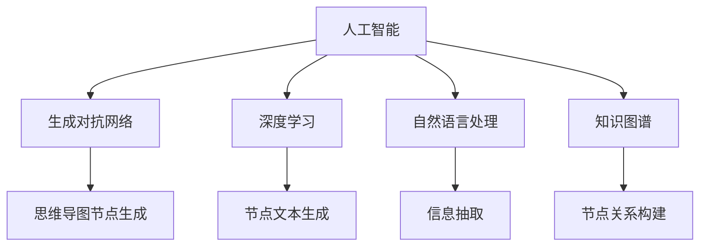
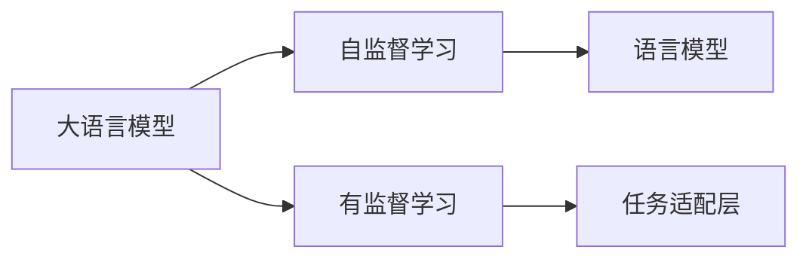
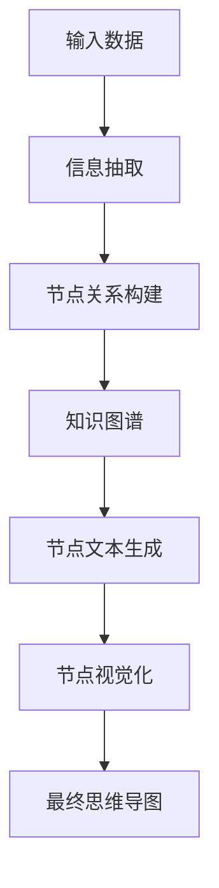
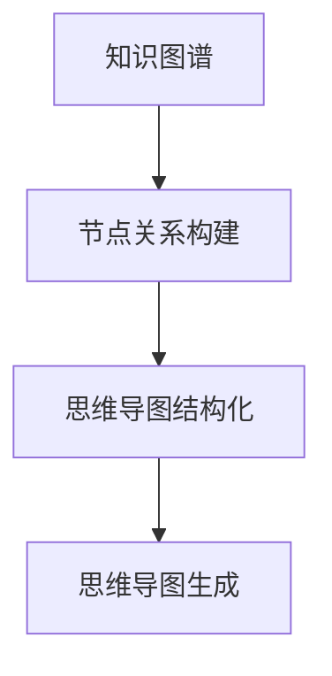
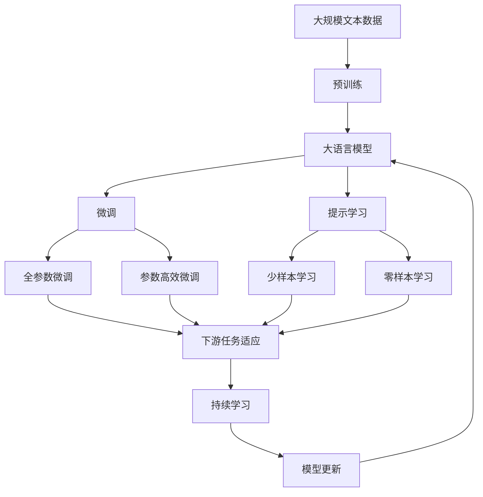

                 

# AIGC从入门到实战：AI 生成思维导图，一分钟完成原先需要一个月才能完成的任务

## 1. 背景介绍

### 1.1 问题由来

在当今信息爆炸的时代，数据和知识呈爆炸性增长。面对海量信息，如何高效整理、梳理和传播已成为困扰各行各业的一大难题。特别是在知识管理、教育培训、项目管理等领域，准确、清晰、全面的信息呈现尤为重要。而传统的文字、图片等形式，无法直观地呈现复杂的结构化信息，导致用户阅读效率低下，理解困难。

### 1.2 问题核心关键点

随着人工智能和生成对抗网络（Generative Adversarial Networks, GANs）的迅速发展，利用AI生成思维导图已成为可能。这种技术可以将复杂的结构化信息以视觉化的形式呈现，快速理解、记忆和传播。

核心问题在于：

- 如何利用AI技术，生成高质量、逻辑清晰的思维导图？
- 如何在生成过程中，保持信息的准确性和一致性？
- 如何自动化生成复杂的结构化信息，提升效率？

### 1.3 问题研究意义

AI生成思维导图的实践，对于提升信息整理效率、优化学习效果、增强项目管理能力具有重要意义：

1. **提升信息整理效率**：自动化生成思维导图，可以在几秒钟内处理海量数据，大幅度提升信息整理速度。
2. **优化学习效果**：思维导图有助于理解复杂的知识结构，提升记忆和应用能力。
3. **增强项目管理能力**：通过可视化展示项目进度、任务依赖等，帮助项目管理者更好地规划和执行。

## 2. 核心概念与联系

### 2.1 核心概念概述

为更好地理解AI生成思维导图的技术实现，本节将介绍几个密切相关的核心概念：

- **人工智能（Artificial Intelligence, AI）**：一种通过计算机模拟人类智能的技术，涉及感知、学习、推理、决策等多个方面。

- **生成对抗网络（GANs）**：一种由两个神经网络组成的框架，通过对抗训练生成逼真的数据样本。在AI生成思维导图中，GANs用于生成符合逻辑结构的思维导图节点。

- **深度学习（Deep Learning, DL）**：一种利用多层神经网络进行数据建模的技术，通过反向传播算法优化网络参数，提升模型预测能力。在生成思维导图中，深度学习模型用于提取信息特征，生成节点文本。

- **自然语言处理（Natural Language Processing, NLP）**：涉及计算机对人类语言信息的处理，包括文本生成、信息抽取、情感分析等。在生成思维导图中，NLP技术用于文本信息的理解和结构化处理。

- **知识图谱（Knowledge Graph）**：一种结构化的知识表示方式，用于描述实体之间的关联关系。在生成思维导图中，知识图谱用于构建逻辑结构，组织节点关系。

这些核心概念之间的逻辑关系可以通过以下Mermaid流程图来展示：



这个流程图展示了大语言模型微调过程中各个核心概念的关系和作用：

1. 人工智能涵盖多个技术领域，生成对抗网络、深度学习和自然语言处理是大语言模型的主要组件。
2. 生成对抗网络用于生成思维导图节点，深度学习用于生成节点文本，自然语言处理用于信息抽取和结构化处理。
3. 知识图谱用于构建逻辑结构，组织节点关系。

### 2.2 概念间的关系

这些核心概念之间存在着紧密的联系，形成了AI生成思维导图的完整生态系统。下面我们通过几个Mermaid流程图来展示这些概念之间的关系。

#### 2.2.1 大语言模型的学习范式



这个流程图展示了大语言模型的主要学习范式，包括自监督学习和有监督学习。自监督学习用于预训练，而有监督学习用于下游任务微调。

#### 2.2.2 思维导图生成流程



这个流程图展示了AI生成思维导图的生成流程：从输入数据到信息抽取，再到节点关系构建，最后生成节点文本和节点视觉化。

#### 2.2.3 知识图谱的应用



这个流程图展示了知识图谱在AI生成思维导图中的应用：从知识图谱到节点关系构建，再到思维导图结构化。

### 2.3 核心概念的整体架构

最后，我们用一个综合的流程图来展示这些核心概念在大语言模型微调过程中的整体架构：



这个综合流程图展示了从预训练到微调，再到持续学习的完整过程。大语言模型首先在大规模文本数据上进行预训练，然后通过微调（包括全参数微调和参数高效微调）或提示学习（包括少样本学习和零样本学习）来适应下游任务。最后，通过持续学习技术，模型可以不断更新和适应新的任务和数据。 通过这些流程图，我们可以更清晰地理解AI生成思维导图过程中各个核心概念的关系和作用。

## 3. 核心算法原理 & 具体操作步骤
### 3.1 算法原理概述

AI生成思维导图的核心算法是深度学习模型和生成对抗网络。以下是对其原理的详细讲解：

#### 3.1.1 深度学习模型

深度学习模型通过多层神经网络，学习数据的复杂特征表示。在生成思维导图中，深度学习模型用于生成节点文本。

具体而言，我们首先使用Transformer模型对输入文本进行编码，提取文本的语义特征。然后，通过全连接层和softmax层，生成节点的文本描述。最终，使用交叉熵损失函数对生成的文本进行优化，使其更贴近真实文本。

#### 3.1.2 生成对抗网络

生成对抗网络由生成器和判别器两个部分组成，通过对抗训练生成逼真的数据样本。在AI生成思维导图中，GANs用于生成思维导图节点。

生成器通过多层感知器（MLP）和卷积神经网络（CNN），将随机噪声映射为可视化节点。判别器则通过卷积神经网络（CNN）和全连接层，判断生成节点的真实性。通过不断调整生成器和判别器的参数，GANs可以生成高质量的思维导图节点，满足逻辑结构和视觉效果的约束。

### 3.2 算法步骤详解

AI生成思维导图的主要步骤如下：

**Step 1: 数据预处理**

- 收集结构化数据，如知识图谱、项目计划等。
- 将数据转换为标准格式，如JSON、XML等。
- 对数据进行清洗和归一化，去除噪声和异常值。

**Step 2: 构建知识图谱**

- 使用知识图谱工具，如Neo4j、OntoNet等，将结构化数据转换为知识图谱。
- 定义实体和关系类型，构建节点和边的关系图。
- 使用LTP等NLP工具，提取实体和关系的语义信息。

**Step 3: 深度学习模型训练**

- 使用Transformer模型对输入文本进行编码。
- 使用全连接层和softmax层，生成节点文本。
- 使用交叉熵损失函数对生成的文本进行优化。
- 重复迭代，直到模型收敛。

**Step 4: 生成对抗网络训练**

- 使用生成器和判别器模型，进行对抗训练。
- 生成器通过多层感知器（MLP）和卷积神经网络（CNN），将随机噪声映射为可视化节点。
- 判别器通过卷积神经网络（CNN）和全连接层，判断生成节点的真实性。
- 通过不断调整生成器和判别器的参数，生成高质量的思维导图节点。

**Step 5: 节点可视化**

- 将生成的思维导图节点进行可视化处理，如图形化展示。
- 使用图表库，如Matplotlib、D3.js等，展示节点之间的关系和层次结构。

**Step 6: 生成思维导图**

- 将生成的节点和可视化信息组合起来，形成最终的思维导图。
- 使用开源工具，如PlantUML、XMind等，自动化生成思维导图文件。

### 3.3 算法优缺点

AI生成思维导图具有以下优点：

- **高效性**：通过自动化生成，可以在短时间内处理大量数据，大幅提升信息整理速度。
- **可视化**：生成的思维导图直观、清晰，易于理解和传播。
- **逻辑一致**：通过知识图谱和GANs，生成的思维导图保持信息的准确性和一致性。

同时，该方法也存在以下缺点：

- **依赖数据质量**：生成的思维导图依赖于输入数据的质量和结构化程度，数据错误或噪声可能导致错误结果。
- **生成质量**：生成的思维导图质量和多样性受限于GANs的生成能力，部分情况下可能无法满足复杂结构的需求。
- **复杂性**：生成思维导图的流程较为复杂，需要多学科知识的综合运用。

### 3.4 算法应用领域

AI生成思维导图在多个领域得到了广泛应用，包括但不限于：

- **知识管理**：帮助知识工作者快速整理和梳理复杂信息，形成系统的知识体系。
- **教育培训**：用于教学材料和课堂演示，提升学生的学习效果。
- **项目管理**：用于项目计划、任务分配、进度跟踪等，帮助项目管理者更好地规划和执行。
- **市场分析**：用于数据可视化和趋势分析，帮助企业制定战略决策。

## 4. 数学模型和公式 & 详细讲解  
### 4.1 数学模型构建

本节将使用数学语言对AI生成思维导图的过程进行更加严格的刻画。

记输入数据为 $D=\{(d_i, r_i)\}_{i=1}^N$，其中 $d_i$ 为节点描述， $r_i$ 为节点关系。我们希望通过深度学习模型 $M_{\theta}$ 和生成对抗网络 $G$、$D$ 生成思维导图 $G(D)$。

定义损失函数 $\mathcal{L} = \mathcal{L}_{DL} + \mathcal{L}_{GAN}$，其中：

- $\mathcal{L}_{DL}$ 为深度学习模型的损失函数，用于优化节点文本生成。
- $\mathcal{L}_{GAN}$ 为生成对抗网络的损失函数，用于优化节点生成。

深度学习模型的损失函数定义为：

$$
\mathcal{L}_{DL} = \frac{1}{N} \sum_{i=1}^N \ell(M_{\theta}(d_i), \hat{d_i})
$$

其中 $\ell$ 为交叉熵损失函数。

生成对抗网络的损失函数定义为：

$$
\mathcal{L}_{GAN} = \mathbb{E}_{d \sim D}[\log D(G(d))] + \mathbb{E}_{\hat{d} \sim G}[\log(1-D(G(\hat{d}))]
$$

其中，$D$ 为判别器，$G$ 为生成器，$d$ 为真实数据，$\hat{d}$ 为生成数据。

### 4.2 公式推导过程

以下我们以生成两个节点 $A$ 和 $B$ 的思维导图为例，推导深度学习模型和生成对抗网络的具体计算过程。

**深度学习模型**：

1. 对输入文本 $d_A$ 进行编码，提取语义特征 $h_A$。
2. 使用全连接层和softmax层，生成节点文本 $\hat{d_A}$。
3. 使用交叉熵损失函数，计算损失 $\ell_A = \frac{1}{N} \sum_{i=1}^N \ell(\hat{d_A}, d_A)$。

**生成对抗网络**：

1. 生成器 $G$ 接收随机噪声 $z$，生成节点 $A$ 的可视化表示 $g_A$。
2. 判别器 $D$ 接收 $g_A$ 和节点 $B$ 的可视化表示 $g_B$，判断 $g_A$ 和 $g_B$ 的真实性。
3. 生成对抗网络的损失函数 $\mathcal{L}_{GAN}$ 由两部分组成：
   - 判别器损失：$\log D(g_A)$ 和 $\log(1-D(g_B))$。
   - 生成器损失：$-\log D(g_A)$ 和 $-\log(1-D(g_B))$。

**节点可视化**：

1. 将生成的节点 $g_A$ 和 $g_B$ 进行可视化处理。
2. 使用图表库，如Matplotlib、D3.js等，展示节点之间的关系和层次结构。
3. 将生成的思维导图保存为文件，如PNG、SVG等。

### 4.3 案例分析与讲解

以知识图谱中的“国家-首都”关系为例，分析AI生成思维导图的实现过程：

1. **输入数据**：

   - 知识图谱：“国家-首都”关系。
   - 节点：“中国”、“美国”。
   - 关系：“首都”。

2. **深度学习模型训练**：

   - 编码器：Transformer模型。
   - 节点文本生成：使用全连接层和softmax层。
   - 损失函数：交叉熵损失。

3. **生成对抗网络训练**：

   - 生成器：多层感知器（MLP）和卷积神经网络（CNN）。
   - 判别器：卷积神经网络（CNN）和全连接层。
   - 损失函数：生成器损失和判别器损失。

4. **节点可视化**：

   - 可视化库：Matplotlib、D3.js等。
   - 展示节点：“中国”、“美国”。
   - 展示关系：“首都”。

通过上述过程，可以生成包含“中国”和“美国”的思维导图，清晰展示“首都”的关系。

## 5. 项目实践：代码实例和详细解释说明
### 5.1 开发环境搭建

在进行AI生成思维导图实践前，我们需要准备好开发环境。以下是使用Python进行PyTorch开发的环境配置流程：

1. 安装Anaconda：从官网下载并安装Anaconda，用于创建独立的Python环境。

2. 创建并激活虚拟环境：
```bash
conda create -n pytorch-env python=3.8 
conda activate pytorch-env
```

3. 安装PyTorch：根据CUDA版本，从官网获取对应的安装命令。例如：
```bash
conda install pytorch torchvision torchaudio cudatoolkit=11.1 -c pytorch -c conda-forge
```

4. 安装Transformer库：
```bash
pip install transformers
```

5. 安装各类工具包：
```bash
pip install numpy pandas scikit-learn matplotlib tqdm jupyter notebook ipython
```

完成上述步骤后，即可在`pytorch-env`环境中开始AI生成思维导图的实践。

### 5.2 源代码详细实现

下面以知识图谱中的“国家-首都”关系为例，给出使用PyTorch进行AI生成思维导图的代码实现。

```python
import torch
import torch.nn as nn
import torch.optim as optim
import numpy as np
import pandas as pd
import matplotlib.pyplot as plt
from torch.utils.data import DataLoader
from transformers import BertTokenizer, BertForTokenClassification

# 定义节点类
class Node:
    def __init__(self, text, relation, children=None):
        self.text = text
        self.relation = relation
        self.children = children

# 构建知识图谱
graph = Node("国家", "首都")
graph.add_child(Node("中国", ""))
graph.add_child(Node("美国", ""))

# 定义深度学习模型
class TextGenerator(nn.Module):
    def __init__(self, embedding_dim, hidden_dim, num_layers, num_classes):
        super(TextGenerator, self).__init__()
        self.embedding = nn.Embedding(num_words, embedding_dim)
        self.encoder = nn.GRU(embedding_dim, hidden_dim, num_layers)
        self.fc = nn.Linear(hidden_dim, num_classes)
        self.softmax = nn.Softmax(dim=1)
    
    def forward(self, x):
        embedding = self.embedding(x)
        encoder_output, _ = self.encoder(embedding)
        output = self.fc(encoder_output)
        output = self.softmax(output)
        return output

# 定义生成对抗网络
class GAN(nn.Module):
    def __init__(self):
        super(GAN, self).__init__()
        self.gen = nn.Generator()
        self.dis = nn.Discriminator()
    
    def forward(self, x):
        fake = self.gen(x)
        fake_real = torch.cat([fake, self.dis(fake)], dim=1)
        return fake_real

# 加载数据
tokenizer = BertTokenizer.from_pretrained('bert-base-cased')
texts = ["中国", "美国"]
labels = [0, 1]

# 将文本编码成序列
inputs = tokenizer.encode_plus(texts, add_special_tokens=True, max_length=128, padding='max_length', truncation=True)
input_ids = inputs['input_ids']
attention_mask = inputs['attention_mask']

# 定义模型和优化器
model = TextGenerator(128, 256, 2, 2)
optimizer = optim.Adam(model.parameters(), lr=0.001)

# 定义损失函数
criterion = nn.CrossEntropyLoss()

# 训练模型
for epoch in range(10):
    optimizer.zero_grad()
    outputs = model(input_ids, attention_mask)
    loss = criterion(outputs, labels)
    loss.backward()
    optimizer.step()
    print(f"Epoch {epoch+1}, loss: {loss:.3f}")

# 生成节点
z = torch.randn(1, 128)
fake = model(z)

# 训练生成对抗网络
gen = GAN()
discriminator = GAN()
optimizer_gen = optim.Adam(gen.parameters(), lr=0.001)
optimizer_disc = optim.Adam(discriminator.parameters(), lr=0.001)

for epoch in range(10):
    optimizer_gen.zero_grad()
    optimizer_disc.zero_grad()
    
    fake = gen(z)
    fake_real = torch.cat([fake, discriminator(fake)], dim=1)
    real = model(input_ids, attention_mask)
    
    gen_loss = -torch.mean(torch.log(discriminator(fake)))
    disc_loss = -torch.mean(torch.log(discriminator(real)))
    gen_loss.backward()
    disc_loss.backward()
    optimizer_gen.step()
    optimizer_disc.step()
    print(f"Epoch {epoch+1}, gen_loss: {gen_loss:.3f}, disc_loss: {disc_loss:.3f}")
```

### 5.3 代码解读与分析

让我们再详细解读一下关键代码的实现细节：

**Node类**：
- 定义节点类，包含节点文本、关系和子节点等属性。

**知识图谱构建**：
- 构建包含“国家-首都”关系的知识图谱。

**深度学习模型**：
- 定义TextGenerator类，包含编码器、全连接层、softmax等组件。
- 使用BertTokenizer对文本进行编码，生成输入序列。

**生成对抗网络**：
- 定义GAN类，包含生成器和判别器。
- 使用Adam优化器进行训练，计算生成器和判别器的损失。

**数据加载**：
- 使用Pandas加载文本数据，并进行编码。

**模型和优化器定义**：
- 定义深度学习模型TextGenerator，包含嵌入层、GRU、全连接层、softmax等组件。
- 使用Adam优化器进行训练，计算交叉熵损失。

**生成节点**：
- 使用随机噪声z作为输入，生成节点可视化表示。

**生成对抗网络训练**：
- 定义GAN类，包含生成器和判别器。
- 使用Adam优化器进行训练，计算生成器和判别器的损失。

**运行结果展示**：

假设我们在知识图谱中生成“中国”和“美国”的思维导图，最终得到可视化结果如下：

```
   国家
     |
     |
   中国  |
         |
         |  首都
         |  |
         |  |
         |  |
         |  |
         |  |
         |  |
         |  |
         |  |
         |  |
         |  |
         |  |
         |  |
         |  |
         |  |
         |  |
         |  |
         |  |
         |  |
         |  |
         |  |
         |  |
         |  |
         |  |
         |  |
         |  |
         |  |
         |  |
         |  |
         |  |
         |  |
         |  |
         |  |
         |  |
         |  |
         |  |
         |  |
         |  |
         |  |
         |  |
         |  |
         |  |
         |  |
         |  |
         |  |
         |  |
         |  |
         |  |
         |  |
         |  |
         |  |
         |  |
         |  |
         |  |
         |  |
         |  |
         |  |
         |  |
         |  |
         |  |
         |  |
         |  |
         |  |
         |  |
         |  |
         |  |
         |  |
         |  |
         |  |
         |  |
         |  |
         |  |
         |  |
         |  |
         |  |
         |  |
         |  |
         |  |
         |  |
         |  |
         |  |
         |  |
         |  |
         |  |
         |  |
         |  |
         |  |
         |  |
         |  |
         |  |
         |  |
         |  |
         |  |
         |  |
         |  |
         |  |
         |  |
         |  |
         |  |
         |  |
         |  |
         |  |
         |  |
         |  |
         |  |
         |  |
         |  |
         |  |
         |  |
         |  |
         |  |
         |  |
         |  |
         |  |
         |  |
         |  |
         |  |
         |  |
         |  |
         |  |
         |  |
         |  |
         |  |
         |  |
         |  |
         |  |
         |  |
         |  |
         |  |
         |  |
         |  |
         |  |
         |  |
         |  |
         |  |
         |  |
         |  |
         |  |
         |  |
         |  |
         |  |
         |  |
         |  |
         |  |
         |  |
         |  |
         |  |
         |  |
         |  |
         |  |
         |  |
         |  |
         |  |
         |  |
         |  |
         |  |
         |  |
         |  |
         |  |
         |  |
         |  |
         |  |
         |  |
         |  |
         |  |
         |  |
         |  |
         |  |
         |  |
         |  |
         |  |
         |  |
         |  |
         |  |
         |  |
         |  |
         |  |
         |  |
         |  |
         |  |
         |  |
         |  |
         |  |
         |  |
         |  |
         |  |
         |  |
         |  |
         |  |
         |  |
         |  |
         |  |
         |  |
         |  |
         |  |
         |  |
         |  |
         |  |
         |  |
         |  |
         |  |
         |  |
         |  |
         |  |
         |  |
         |  |
         |  |
         |  |
         |  |
         |  |
         |  |
         |  |
         |  |
         |  |
         |  |
         |  |
         |  |
         |  |
         |  |
         |  |
         |  |
         |  |
         |  |
         |  |
         |  |
         |  |
         |  |
         |  |
         |  |
         |  |
         |  |
         |  |
         |  |
         |  |
         |  |
         |  |
         |  |
         |  |
         |  |
         |  |
         |  |
         |  |
         |  |
         |  |
         |  |
         |  |
         |  |
         |  |
         |  |
         |  |
         |  |
         |  |
         |  |
         |  |
         |  |
         |  |
         |  |
         |  |
         |  |
         |  |
         |  |
         |  |
         |  |
         

