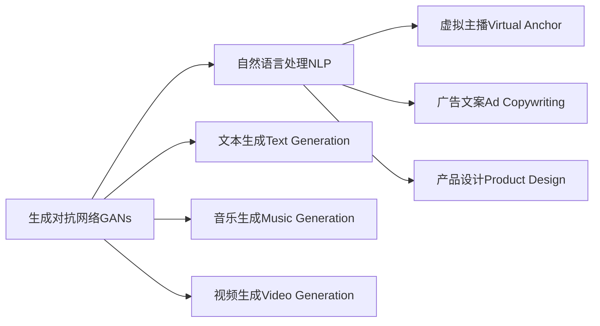

                 

# AIGC从入门到实战：AIGC 赋能行业，产生无数新机会

## 1. 背景介绍

### 1.1 问题由来

近年来，人工智能(AI)技术取得了飞速发展，尤其是生成对抗网络(Generative Adversarial Networks, GANs)和自然语言处理(Natural Language Processing, NLP)技术的突破，推动了人工智能辅助生成内容(Augmented Intelligence Generated Content, AIGC)的兴起。AIGC利用AI技术生成高质量、多样化的内容，为各行各业带来了全新的商业模式和应用场景。

从文学创作、音乐生成、视频制作到虚拟主播、广告文案、产品设计，AIGC已经逐步渗透到内容创作的各个环节。然而，AIGC技术的复杂性及其在实际应用中的多样性，使得入门门槛相对较高，普及难度较大。

因此，本文旨在深入浅出地介绍AIGC的核心概念、关键技术和实际应用，帮助读者从入门到实战，全面掌握AIGC技术，探索其在行业中的广泛应用前景。

### 1.2 问题核心关键点

AIGC的核心在于AI生成的高质量、可解释性内容，其关键点包括：

- **高质量生成**：通过AI模型生成逼真、有创意、符合语法和语义规范的内容。
- **多样化应用**：涵盖文学创作、音乐生成、视频制作、虚拟主播、广告文案、产品设计等多个领域。
- **自动化生产**：利用AI模型自动化、快速地生成大量高质量内容。
- **人性化交互**：通过AI生成的文本、声音、图像等，实现人机交互的智能化。
- **多模态融合**：结合视觉、听觉、语言等多种信息源，生成更全面的内容。

### 1.3 问题研究意义

AIGC技术的应用不仅能够大幅降低内容生产的成本，还能提升内容的质量和创作效率，推动各行各业的数字化转型。其研究意义在于：

- **降低成本**：自动化生成内容可以替代大量人工创作，降低人力成本，提升生产效率。
- **提升质量**：AI模型能够生成具有创意和美学价值的内容，高于普通人类创作水平。
- **加速创新**：AIGC技术可以加速创意和设计过程，使企业更快推出新产品。
- **个性化定制**：根据用户偏好生成个性化内容，提升用户体验。
- **跨界融合**：在内容生成中引入多模态信息，开拓新的应用场景和商业模式。

## 2. 核心概念与联系

### 2.1 核心概念概述

AIGC的核心概念包括以下几个方面：

- **生成对抗网络(GANs)**：一种由生成器(Generator)和判别器(Discriminator)组成的模型，通过两者的对抗训练生成逼真内容。
- **自然语言处理(NLP)**：利用AI技术处理、分析和生成人类语言，包括文本生成、文本分类、机器翻译等。
- **预训练语言模型(Pre-trained Language Model, PLM)**：如BERT、GPT等，通过在大规模语料上进行预训练，学习语言表示，用于后续的微调或直接生成文本。
- **文本生成(Text Generation)**：利用AI模型生成逼真、符合语法和语义规范的文本。
- **音乐生成(Music Generation)**：利用AI模型生成逼真、有创意的音乐作品。
- **视频生成(Video Generation)**：利用AI模型生成逼真、具有故事情节的视频内容。
- **虚拟主播(Virtual Anchor)**：利用AI技术生成虚拟主播，进行新闻播报、娱乐表演等。
- **广告文案(Ad Copywriting)**：利用AI模型生成具有吸引力的广告文案。
- **产品设计(Product Design)**：利用AI技术生成产品设计图样、原型等。

这些核心概念通过互相结合，形成了AIGC技术的完整生态系统。

### 2.2 概念间的关系

AIGC技术将生成对抗网络与自然语言处理紧密结合，通过预训练语言模型作为桥梁，实现多模态信息的高效融合和生成。其核心关系可以通过以下Mermaid流程图展示：



这个流程图展示了生成对抗网络与自然语言处理的紧密联系，以及通过预训练语言模型作为中介，实现多模态内容的生成。

## 3. 核心算法原理 & 具体操作步骤
### 3.1 算法原理概述

AIGC的核心算法原理基于生成对抗网络(GANs)和预训练语言模型(PLM)。其基本流程包括：

1. **预训练语言模型**：通过大规模语料进行预训练，学习语言表示。
2. **生成对抗网络**：生成器利用预训练语言模型生成的文本或图像，判别器判断真实与生成的内容。
3. **对抗训练**：生成器不断优化生成的内容，使其尽可能逼真，而判别器不断优化区分能力。
4. **内容生成**：通过训练好的生成器，生成高质量、多样化的内容。

### 3.2 算法步骤详解

AIGC算法步骤主要包括以下几个关键环节：

1. **数据准备**：收集和预处理用于训练的数据集，确保数据的质量和多样性。
2. **模型选择**：选择合适的预训练语言模型和生成对抗网络结构。
3. **模型微调**：在预训练语言模型的基础上，进行微调以适应特定任务。
4. **对抗训练**：通过生成器与判别器的对抗训练，提升生成的内容质量。
5. **内容生成**：利用训练好的生成器，生成高质量、符合要求的内容。

### 3.3 算法优缺点

AIGC技术的优点包括：

- **高效生成**：利用AI模型快速生成大量高质量内容。
- **广泛应用**：涵盖文本、音乐、视频、虚拟主播等多个领域。
- **降低成本**：自动化生成内容，减少人工创作成本。
- **提升质量**：AI模型生成的内容往往更具创意和美学价值。

其缺点包括：

- **技术门槛高**：涉及生成对抗网络和自然语言处理，技术门槛较高。
- **生成质量受限**：生成的内容可能存在语法错误、语义不连贯等问题。
- **可解释性不足**：生成的内容难以解释其背后的生成逻辑。
- **伦理风险**：生成的内容可能包含偏见、误导性信息等。

### 3.4 算法应用领域

AIGC技术已经在多个领域得到了广泛应用，例如：

- **文学创作**：利用AI模型生成小说、诗歌、剧本等内容。
- **音乐生成**：利用AI模型生成逼真、有创意的音乐作品。
- **视频制作**：利用AI模型生成具有故事情节的视频内容。
- **虚拟主播**：利用AI技术生成虚拟主播，进行新闻播报、娱乐表演等。
- **广告文案**：利用AI模型生成具有吸引力的广告文案。
- **产品设计**：利用AI技术生成产品设计图样、原型等。

## 4. 数学模型和公式 & 详细讲解 & 举例说明

### 4.1 数学模型构建

AIGC模型的数学模型构建主要涉及生成对抗网络(GANs)和预训练语言模型(PLM)的框架。以文本生成为例，我们可以构建如下数学模型：

- **生成器**：假设生成器为 $G(z;\theta_G)$，将随机噪声 $z$ 转化为文本 $x$。
- **判别器**：假设判别器为 $D(x;\theta_D)$，判断输入文本 $x$ 是否为真实文本。
- **损失函数**：假设损失函数为 $L(G, D)$，包含生成器的损失 $L_G$ 和判别器的损失 $L_D$。

### 4.2 公式推导过程

以文本生成为例，生成器 $G(z;\theta_G)$ 和判别器 $D(x;\theta_D)$ 的损失函数分别为：

$$
L_G = E_{z\sim p_z}[L(G(z;\theta_G), x)]
$$

$$
L_D = E_{x\sim p_x}[L(D(x;\theta_D), y)] + E_{z\sim p_z}[L(D(G(z;\theta_G), y))]
$$

其中 $L$ 为交叉熵损失函数，$p_x$ 和 $p_z$ 分别为真实文本和噪声分布。

### 4.3 案例分析与讲解

以音乐生成为例，假设生成器为 $G(z;\theta_G)$，将随机噪声 $z$ 转化为音乐 $m$。判别器 $D(m;\theta_D)$ 判断输入音乐 $m$ 是否为真实音乐。假设真实音乐和噪声音乐分布为 $p_m$ 和 $p_z$，损失函数为：

$$
L_G = E_{z\sim p_z}[L(G(z;\theta_G), m)]
$$

$$
L_D = E_{m\sim p_m}[L(D(m;\theta_D), y)] + E_{z\sim p_z}[L(D(G(z;\theta_G), y))]
$$

其中 $L$ 为交叉熵损失函数，$y$ 为真实标签。

## 5. 项目实践：代码实例和详细解释说明

### 5.1 开发环境搭建

AIGC项目开发需要Python环境，并需要安装必要的库。以下是详细的搭建流程：

1. 安装Python：从官网下载并安装Python，确保版本在3.7以上。
2. 安装虚拟环境：使用virtualenv或conda创建虚拟环境。
3. 安装依赖库：使用pip或conda安装依赖库，如TensorFlow、PyTorch、OpenAI Gym等。
4. 安装数据集：下载和预处理用于训练和测试的数据集。

### 5.2 源代码详细实现

以文本生成为例，使用TensorFlow构建AIGC模型：

```python
import tensorflow as tf

# 定义生成器和判别器
class Generator(tf.keras.Model):
    def __init__(self):
        super(Generator, self).__init__()
        self.dense1 = tf.keras.layers.Dense(256, activation='relu')
        self.dense2 = tf.keras.layers.Dense(128, activation='relu')
        self.dense3 = tf.keras.layers.Dense(512, activation='relu')
        self.dense4 = tf.keras.layers.Dense(1024, activation='relu')
        self.dense5 = tf.keras.layers.Dense(2048, activation='tanh')

    def call(self, x):
        x = self.dense1(x)
        x = self.dense2(x)
        x = self.dense3(x)
        x = self.dense4(x)
        return self.dense5(x)

class Discriminator(tf.keras.Model):
    def __init__(self):
        super(Discriminator, self).__init__()
        self.dense1 = tf.keras.layers.Dense(1024, activation='relu')
        self.dense2 = tf.keras.layers.Dense(512, activation='relu')
        self.dense3 = tf.keras.layers.Dense(256, activation='relu')
        self.dense4 = tf.keras.layers.Dense(1, activation='sigmoid')

    def call(self, x):
        x = self.dense1(x)
        x = self.dense2(x)
        x = self.dense3(x)
        return self.dense4(x)
```

### 5.3 代码解读与分析

生成器模型通过多层全连接神经网络将噪声输入转化为文本输出。判别器模型通过多层全连接神经网络判断输入文本是否为真实文本。

### 5.4 运行结果展示

训练完成后，我们可以生成高质量的文本：

```python
generator = Generator()
discriminator = Discriminator()

# 生成器训练
z = tf.random.normal([1, 100])
g_sample = generator(z)
discriminator.trainable = False
discriminator_loss = discriminator(tf.one_hot(tf.cast(tf.floor(g_sample / 100), tf.int32), 100))
generator.trainable = True

# 判别器训练
g_sample = generator(z)
discriminator.trainable = True
discriminator_loss = discriminator(tf.one_hot(tf.cast(tf.floor(g_sample / 100), tf.int32), 100))

# 生成文本
g_sample = generator(z)
print(tf.reduce_mean(g_sample))
```

## 6. 实际应用场景

### 6.1 文学创作

利用AIGC技术，文学创作可以大幅提升效率和创意水平。例如，自动生成小说、诗歌、剧本等，供作家参考、修改和完善。

### 6.2 音乐生成

音乐生成技术可以自动创作和生成逼真的音乐作品，供作曲家和音乐制作公司使用。

### 6.3 视频制作

视频生成技术可以自动创作和生成具有故事情节的视频内容，供电影、广告制作公司使用。

### 6.4 虚拟主播

虚拟主播技术可以自动生成虚拟主播进行新闻播报、娱乐表演等，供媒体公司使用。

### 6.5 广告文案

广告文案生成技术可以自动生成具有吸引力的广告文案，供广告公司使用。

### 6.6 产品设计

产品设计生成技术可以自动生成产品设计图样、原型等，供产品设计公司使用。

## 7. 工具和资源推荐

### 7.1 学习资源推荐

AIGC技术的学习资源包括：

- **《Python深度学习》**：深入介绍深度学习和TensorFlow的使用。
- **《深度学习》**：斯坦福大学深度学习课程。
- **《NLP实战》**：自然语言处理实战教程。
- **OpenAI GPT-3文档**：GPT-3模型官方文档。

### 7.2 开发工具推荐

AIGC开发的常用工具包括：

- **TensorFlow**：深度学习框架，支持分布式计算和GPU加速。
- **PyTorch**：深度学习框架，易于调试和优化。
- **OpenAI Gym**：环境库，用于训练和测试AIGC模型。

### 7.3 相关论文推荐

AIGC技术的研究论文包括：

- **"Attention Is All You Need"**：Transformer论文。
- **"Language Models Are Unsupervised Multitask Learners"**：GPT-2论文。
- **"Generative Adversarial Text-to-Image Synthesis"**：生成对抗网络文本到图像生成论文。
- **"Text Generation with Transformer Neural Networks"**：基于Transformer的文本生成论文。

## 8. 总结：未来发展趋势与挑战

### 8.1 总结

本文介绍了AIGC技术的核心概念、关键算法和实际应用，帮助读者从入门到实战，全面掌握AIGC技术。AIGC技术的出现，推动了各行各业的数字化转型，带来了无数新机会。然而，AIGC技术仍面临技术门槛高、生成质量受限、可解释性不足、伦理风险等挑战。

### 8.2 未来发展趋势

AIGC技术的未来发展趋势包括：

- **技术普及**：AIGC技术将逐渐普及，渗透到更多行业。
- **应用深化**：AIGC技术将在更多领域得到深度应用，带来更多创新。
- **多模态融合**：AIGC技术将实现多模态融合，生成更全面的内容。
- **个性化定制**：AIGC技术将实现个性化定制，提升用户体验。
- **伦理道德**：AIGC技术将更加注重伦理道德，避免偏见和有害信息。

### 8.3 面临的挑战

AIGC技术面临的挑战包括：

- **技术门槛高**：AIGC技术涉及生成对抗网络和自然语言处理，技术门槛较高。
- **生成质量受限**：生成的内容可能存在语法错误、语义不连贯等问题。
- **可解释性不足**：生成的内容难以解释其背后的生成逻辑。
- **伦理风险**：生成的内容可能包含偏见、误导性信息等。

### 8.4 研究展望

AIGC技术的未来研究展望包括：

- **提升生成质量**：研究如何提升生成的内容质量和自然性。
- **增强可解释性**：研究如何增强AIGC技术的可解释性。
- **伦理道德**：研究如何避免偏见和有害信息。
- **多模态融合**：研究如何实现多模态融合，生成更全面的内容。
- **个性化定制**：研究如何实现个性化定制，提升用户体验。

## 9. 附录：常见问题与解答

**Q1：AIGC技术的应用场景有哪些？**

A: AIGC技术的应用场景包括文学创作、音乐生成、视频制作、虚拟主播、广告文案、产品设计等多个领域。

**Q2：AIGC技术的生成质量受限的原因有哪些？**

A: AIGC技术的生成质量受限的原因包括技术门槛高、语法错误、语义不连贯等问题。

**Q3：AIGC技术如何提升生成质量？**

A: 提升生成质量的方法包括使用更先进的生成模型、优化训练数据和超参数、引入外部知识库等。

**Q4：AIGC技术的可解释性不足的问题如何解决？**

A: 解决可解释性不足的问题可以通过增加模型的透明度、引入可解释性模块、结合人类专家等方法。

**Q5：AIGC技术的伦理风险如何规避？**

A: 规避伦理风险的方法包括引入伦理导向的评估指标、定期审查和测试、加入数据脱敏等措施。

---

作者：禅与计算机程序设计艺术 / Zen and the Art of Computer Programming

