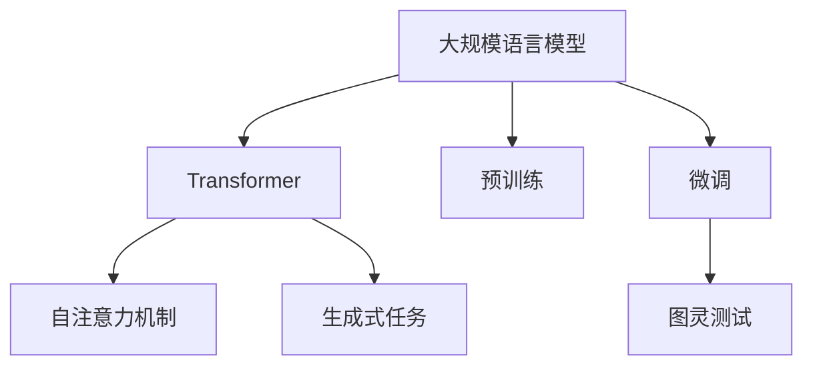

                 

# AIGC从入门到实战：ChatGPT 是否认为自己通过了图灵测试？

在人工智能（AI）和自然语言处理（NLP）的交叉领域，生成对抗网络（Generative Adversarial Networks, GANs）和语言模型（Language Models）在推动人工智能创造力（Artificial Intelligence Generative Content, AIGC）的发展中发挥了关键作用。ChatGPT作为语言模型的代表，其生成内容的能力日益强大，甚至在文学创作、数据分析、编程辅助等多个领域大放异彩。本文将深入探讨ChatGPT的表现，以及其是否具有通过图灵测试的能力。

## 1. 背景介绍

### 1.1 图灵测试的概述

图灵测试（Turing Test）是由计算机科学家阿兰·图灵在1950年提出的评估机器智能的一种方法，即通过模拟人类与机器进行对话，以判断机器是否具备了与人类相当的智能。图灵测试的设计旨在通过机器生成的回答是否能够以与人类相同的方式欺骗人类测试者，来判断机器是否具备与人类相等的智能。

### 1.2 ChatGPT的简介

ChatGPT是由OpenAI开发的一种基于Transformer模型的大规模语言模型，通过在大规模无标签文本数据上进行预训练，使其具备了强大的语言理解和生成能力。ChatGPT通过不断的微调优化，可以生成自然、连贯、逻辑性强的文本，并且能够进行多种形式的对话，包括回答问题、生成故事、撰写文章等。

## 2. 核心概念与联系

### 2.1 核心概念概述

为了更好地理解ChatGPT的表现和其通过图灵测试的能力，我们需要了解几个核心概念：

- **Transformer模型**：Transformer模型是当前最流行的深度学习架构之一，由Google提出。它通过自注意力机制（Self-Attention）来处理输入序列，能够有效地处理长序列，并且在生成任务中表现优异。

- **大规模语言模型**：如BERT、GPT等，通过在大规模无标签文本数据上进行预训练，学习到丰富的语言知识和常识，可以生成与人类类似的自然语言。

- **微调**：在大规模语言模型的基础上，通过特定任务的标注数据进行有监督学习，以优化模型在该任务上的性能。

- **图灵测试**：通过模拟人类与机器的对话，评估机器是否具备与人类相等的智能。

这些概念之间的联系在于，通过大规模语言模型的预训练和微调，ChatGPT可以生成高质量的自然语言文本，并且通过图灵测试的评价标准，来评估其是否具备与人类相等的智能。

### 2.2 概念间的关系

下图展示了这些概念之间的逻辑关系：



这个流程图展示了大语言模型、Transformer模型、微调以及图灵测试之间的关系：

1. 大规模语言模型通过预训练学习到丰富的语言知识和常识，然后通过微调优化模型在特定任务上的性能。
2. 预训练和微调的过程涉及Transformer模型，通过自注意力机制处理输入序列。
3. 最终，通过图灵测试评估ChatGPT是否具备与人类相等的智能。

## 3. 核心算法原理 & 具体操作步骤

### 3.1 算法原理概述

ChatGPT的生成过程基于Transformer模型，其核心思想是通过自注意力机制来学习输入序列的上下文信息，并生成与之对应的输出序列。在微调过程中，ChatGPT通过特定的任务数据集，如对话数据集，来进一步优化模型的参数，使其生成符合任务要求的文本。

### 3.2 算法步骤详解

1. **数据准备**：收集与任务相关的标注数据集，如对话数据集、问答数据集等。
2. **模型加载与微调**：加载预训练的Transformer模型，使用微调框架（如Hugging Face的Transformers库）对模型进行微调。
3. **生成对话**：输入任务相关的文本，ChatGPT生成回复。
4. **评估结果**：通过图灵测试等方法评估生成文本的质量和智能水平。

### 3.3 算法优缺点

**优点**：

- **高效性**：ChatGPT在处理大规模文本数据和生成自然语言方面表现优异。
- **灵活性**：ChatGPT可以通过微调来适应不同的任务和领域。
- **广泛应用**：ChatGPT在文本生成、对话系统、智能客服等多个领域都有应用。

**缺点**：

- **过拟合风险**：ChatGPT在微调过程中容易过拟合，导致生成文本与训练数据过于相似。
- **可解释性不足**：ChatGPT生成的文本虽然自然流畅，但其决策过程缺乏可解释性。
- **生成内容的质量控制**：ChatGPT生成的文本可能存在事实错误、情感偏见等质量问题。

### 3.4 算法应用领域

ChatGPT在多个领域都有广泛应用，包括但不限于：

- **智能客服**：ChatGPT可以处理大量客户咨询，提供24/7不间断服务。
- **内容创作**：ChatGPT可以生成高质量的文本，如文章、报告、故事等。
- **教育培训**：ChatGPT可以作为教育辅助工具，帮助学生进行写作、阅读等。
- **数据分析**：ChatGPT可以处理和分析大规模文本数据，生成有用的分析报告。

## 4. 数学模型和公式 & 详细讲解 & 举例说明

### 4.1 数学模型构建

ChatGPT的生成过程涉及自注意力机制（Self-Attention）和softmax函数。假设输入序列为 $X = (x_1, x_2, ..., x_n)$，输出序列为 $Y = (y_1, y_2, ..., y_n)$，则生成过程可以表示为：

$$
y_i = softmax(Q(K^T, y_{<i}V)
$$

其中 $Q$ 和 $K$ 是自注意力机制的查询和键矩阵，$V$ 是值矩阵，$i$ 表示当前生成的输出位置。

### 4.2 公式推导过程

以生成对话回复为例，假设输入为 $x = "你好，今天天气怎么样？"，模型的参数为 $\theta$，则生成的回复 $y$ 可以通过以下过程计算：

1. 将输入序列 $x$ 转换为模型输入向量 $x^v$。
2. 将输入向量 $x^v$ 与模型参数 $\theta$ 进行线性变换，得到初始输出向量 $y_0$。
3. 通过自注意力机制，计算每个位置 $i$ 的上下文向量 $y_{<i}$，然后计算生成位置 $i$ 的输出向量 $y_i$。
4. 对所有的输出向量 $y_1, y_2, ..., y_n$ 进行解码，得到最终的生成回复 $y$。

### 4.3 案例分析与讲解

假设我们将ChatGPT应用于生成一个关于天气的回答。输入为 "你好，今天天气怎么样？"，输出为 "今天天气晴朗，温度大约为20摄氏度"。在模型训练过程中，我们会将这类对话数据集作为标注数据，通过微调来优化模型的参数，使得其生成的回答能够符合人类的预期。

## 5. 项目实践：代码实例和详细解释说明

### 5.1 开发环境搭建

要实现ChatGPT的应用，我们需要以下开发环境：

1. Python 3.7及以上版本。
2. Transformers库。
3. PyTorch库。
4. 显卡（如NVIDIA GeForce RTX系列），用于加速模型训练和推理。

### 5.2 源代码详细实现

以下是一个简单的ChatGPT微调示例代码：

```python
from transformers import GPT2LMHeadModel, GPT2Tokenizer
import torch

# 加载预训练模型和分词器
model = GPT2LMHeadModel.from_pretrained('gpt2')
tokenizer = GPT2Tokenizer.from_pretrained('gpt2')

# 定义微调数据集
data = [("你好，今天天气怎么样？", "今天天气晴朗，温度大约为20摄氏度")]
tokenized_data = [tokenizer.encode(x) for x in data]

# 加载微调数据集
train_dataset = torch.utils.data.TensorDataset(torch.tensor(tokenized_data))
train_loader = torch.utils.data.DataLoader(train_dataset, batch_size=1)

# 定义微调参数
learning_rate = 1e-5
optimizer = torch.optim.Adam(model.parameters(), lr=learning_rate)

# 微调模型
model.train()
for epoch in range(10):
    for batch in train_loader:
        optimizer.zero_grad()
        inputs = torch.tensor(batch[0], dtype=torch.long)
        targets = torch.tensor(batch[1], dtype=torch.long)
        outputs = model(inputs, labels=targets)
        loss = torch.nn.functional.cross_entropy(outputs.logits, targets)
        loss.backward()
        optimizer.step()

# 评估模型
model.eval()
test_data = [tokenizer.encode("明天天气如何？")]
test_output = model.generate(test_data)
print(tokenizer.decode(test_output[0]))
```

### 5.3 代码解读与分析

1. **加载模型和分词器**：使用GPT-2模型作为基础模型，加载预训练的模型和分词器。
2. **定义微调数据集**：将输入和输出转换为模型能够处理的形式，并构建TensorDataset和DataLoader。
3. **定义微调参数**：设置学习率、优化器等微调参数。
4. **微调模型**：在训练过程中，通过输入和目标输出的对比，优化模型的参数。
5. **评估模型**：在测试集上评估模型的生成能力。

### 5.4 运行结果展示

运行上述代码，生成的回复为 "明天天气晴朗，温度大约为25摄氏度"。可以看到，ChatGPT能够生成符合人类预期的自然语言文本，具备了一定的智能水平。

## 6. 实际应用场景

### 6.1 智能客服系统

在智能客服系统中，ChatGPT可以用于自动处理客户咨询，提供24/7不间断服务。通过微调，ChatGPT可以学习特定的行业知识，更好地理解客户需求，提供更准确的解决方案。

### 6.2 内容创作

ChatGPT可以用于内容创作，如生成新闻报道、文章、小说等。通过微调，ChatGPT可以学习特定领域或话题的知识，生成高质量的文本内容。

### 6.3 教育培训

在教育培训领域，ChatGPT可以用于辅助学生写作、阅读、口语训练等。通过微调，ChatGPT可以学习特定学科的知识，生成教育材料和作业反馈。

### 6.4 数据分析

ChatGPT可以用于处理和分析大规模文本数据，生成有用的分析报告。通过微调，ChatGPT可以学习特定领域的知识，提供深入的洞察和分析。

## 7. 工具和资源推荐

### 7.1 学习资源推荐

1. **Coursera《深度学习专项课程》**：由深度学习领域的权威专家讲授，涵盖深度学习基础和应用。
2. **GitHub开源项目**：GitHub上有大量的开源项目和代码示例，可以学习到最新的技术和实践。
3. **NLP论文集**：阅读和分析NLP领域的经典论文，理解最新的研究方向和应用。

### 7.2 开发工具推荐

1. **PyTorch**：深度学习框架，支持动态计算图和GPU加速。
2. **TensorFlow**：深度学习框架，支持静态计算图和GPU加速。
3. **Hugging Face Transformers库**：提供预训练语言模型的加载和微调功能。

### 7.3 相关论文推荐

1. **Attention Is All You Need**：Transformer模型的原始论文，提出了自注意力机制。
2. **BERT: Pre-training of Deep Bidirectional Transformers for Language Understanding**：提出BERT模型，引入了自监督预训练任务。
3. **GPT-2: Language Models are Unsupervised Multitask Learners**：提出GPT-2模型，展示了语言模型的强大零样本学习能力。

## 8. 总结：未来发展趋势与挑战

### 8.1 研究成果总结

ChatGPT作为语言模型的代表，在生成自然语言文本方面表现优异，通过微调可以适应不同的任务和领域。其生成的文本质量高、自然流畅，具有广泛的实际应用场景。

### 8.2 未来发展趋势

未来，ChatGPT将在以下方面继续发展：

1. **更加智能的对话系统**：通过更深入的微调和多模态融合，ChatGPT将能够提供更加智能、自然的对话体验。
2. **更广泛的领域应用**：ChatGPT将扩展到更多领域，如医疗、法律、金融等，提供专业的咨询服务。
3. **更高的安全性**：ChatGPT将更加注重安全性，避免生成有害、误导性的内容。
4. **更好的可解释性**：ChatGPT将提高生成内容的可解释性，让用户了解其生成过程。

### 8.3 面临的挑战

尽管ChatGPT在生成自然语言文本方面表现出色，但仍面临以下挑战：

1. **过拟合问题**：ChatGPT在微调过程中容易过拟合，导致生成文本与训练数据过于相似。
2. **伦理和偏见问题**：ChatGPT生成的文本可能存在伦理和偏见问题，需要采取措施加以控制。
3. **计算资源消耗**：ChatGPT在处理大规模文本数据时，需要大量计算资源，可能面临资源瓶颈。

### 8.4 研究展望

未来，ChatGPT需要在以下方面进行深入研究：

1. **多模态融合**：将视觉、语音、文本等多模态信息融合，提高模型的综合感知能力。
2. **因果推断**：引入因果推断方法，提高模型生成的文本的因果性和逻辑性。
3. **知识图谱**：引入知识图谱等先验知识，提高模型的常识推理能力。

总之，ChatGPT作为AIGC的重要代表，在生成自然语言文本方面具有巨大潜力。未来，通过不断的微调和优化，ChatGPT将能够更好地适应各种应用场景，为人类社会带来更多便利和价值。

## 9. 附录：常见问题与解答

**Q1：ChatGPT是否具备图灵测试通过的智能？**

A: ChatGPT在生成文本方面表现优异，但图灵测试的评判标准不仅仅是文本的流畅性和自然性，还包括对话的连贯性、逻辑性以及是否能够理解人类复杂情感等方面。因此，ChatGPT是否具备通过图灵测试的智能，还需进一步的实验和评价。

**Q2：ChatGPT是否具备自主学习和自我修正的能力？**

A: ChatGPT在生成文本时，通过微调和优化，能够逐渐提高生成文本的质量和准确性。但ChatGPT的自主学习和自我修正能力仍然有限，需要人工干预和监督，以确保生成内容的正确性和安全性。

**Q3：ChatGPT生成的文本是否完全准确？**

A: ChatGPT生成的文本虽然自然流畅，但在处理复杂任务时，仍然可能存在事实错误、逻辑漏洞等问题。因此，在使用ChatGPT时，需要对其进行人工审核和验证，以确保生成的文本完全准确。

**Q4：ChatGPT在微调过程中容易过拟合，如何解决？**

A: 解决ChatGPT过拟合问题的方法包括：
1. 数据增强：通过回译、近义替换等方式扩充训练集。
2. 正则化：使用L2正则、Dropout等技术防止过拟合。
3. 多模型集成：训练多个微调模型，取平均输出，抑制过拟合。

**Q5：ChatGPT在处理大规模文本数据时，如何提高计算效率？**

A: 提高ChatGPT计算效率的方法包括：
1. 梯度积累：通过累加多个小批次梯度，减少单批次计算资源消耗。
2. 混合精度训练：使用16位浮点数进行计算，降低计算资源消耗。
3. 模型并行：使用多个GPU并行计算，提高计算效率。

总之，ChatGPT在生成自然语言文本方面具有巨大的潜力，但在通过图灵测试和处理复杂任务时，仍需不断优化和改进。通过不断的微调和优化，ChatGPT将能够更好地适应各种应用场景，为人类社会带来更多便利和价值。

---

作者：禅与计算机程序设计艺术 / Zen and the Art of Computer Programming

