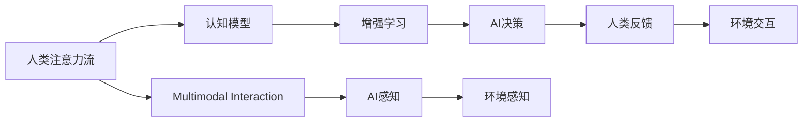

                 

# AI与人类注意力流：打造人机融合的未来

在人类与机器共存的未来，一个重要的挑战是如何实现人与AI的深度融合。本文将探讨AI如何通过模仿人类注意力流，实现与人类高效协同，构建未来人机融合系统。

## 1. 背景介绍

### 1.1 问题由来
随着人工智能技术的发展，机器在处理海量数据、执行复杂计算等方面已经展现出了卓越的能力。然而，机器在理解人类情感、构建语境意识、处理不确定性等方面仍存在明显的短板。这些问题限制了AI在实际应用场景中的表现。

人类注意力流作为人类思维过程的关键部分，是理解复杂任务和获取上下文信息的重要途径。如果AI能够模仿人类的注意力机制，将能够更好地理解人类意图，提升任务的完成效率，促进人机协作。

### 1.2 问题核心关键点
本文将深入探讨以下关键点：
- 人类注意力流的基本原理和模型。
- AI如何模仿人类注意力机制，实现更高效的协同。
- 人工智能在模拟人类注意力流中面临的挑战。
- 基于AI与人类注意力流的未来应用场景。

## 2. 核心概念与联系

### 2.1 核心概念概述

为了深入理解AI与人类注意力流的融合，我们首先介绍几个核心概念：

- **人类注意力流**：人类在认知过程中，注意力会动态地聚焦于任务相关的信息上，从而在复杂任务中有效地进行信息处理和决策。
- **认知模型**：用来模拟人类认知过程的计算模型，如神经网络模型、符号计算模型等。
- **增强学习**：通过与环境的交互，逐步优化行为策略的机器学习方法。
- **多模态交互**：将文本、图像、声音等多模态数据融入决策过程中的技术。

这些概念通过以下Mermaid流程图展示了它们之间的联系：



这个流程图展示了人类注意力流如何通过认知模型、增强学习和多模态交互，最终实现AI的决策和反馈。

### 2.2 概念间的关系

通过这个流程图，我们可以更清晰地理解各个概念之间的关系：

- **认知模型**：认知模型模仿人类注意力流的行为，通过感知、处理和记忆相关信息，形成决策。
- **增强学习**：增强学习通过与环境的互动，不断优化AI的决策策略，使其更符合人类期望。
- **多模态交互**：多模态交互为AI提供更多元的感知信息，增强决策的全面性。
- **AI决策**：AI决策基于认知模型、增强学习和多模态交互的结果，产生最终行为输出。
- **人类反馈**：人类反馈为AI提供实时评估，进一步优化其决策策略。

## 3. 核心算法原理 & 具体操作步骤
### 3.1 算法原理概述

基于人类注意力流的大规模AI决策系统，其核心算法原理可概述为：

- **认知模型**：通过神经网络等计算模型，模拟人类注意力流的动态变化，聚焦于任务相关的信息。
- **增强学习**：使用多臂老虎机模型、深度强化学习等技术，优化AI的决策策略。
- **多模态交互**：将文本、图像、声音等多模态数据，整合到决策过程中，提升AI对环境的理解和感知。

### 3.2 算法步骤详解

基于人类注意力流的大规模AI决策系统通常遵循以下步骤：

**Step 1: 数据采集与预处理**
- 收集人类与环境的交互数据，包括行为数据、传感器数据、文本数据等。
- 对数据进行清洗、归一化、去噪等预处理，确保数据的准确性和一致性。

**Step 2: 认知模型训练**
- 使用神经网络等模型，训练认知模型，使其能够动态模拟人类注意力流的行为。
- 模型训练通常需要大量的标注数据和计算资源，确保模型的泛化能力和鲁棒性。

**Step 3: 多模态数据融合**
- 将文本、图像、声音等多模态数据，通过特征提取和融合技术，整合为统一的表示形式。
- 使用多模态交互技术，将多模态数据与认知模型结合，增强模型的决策能力。

**Step 4: 增强学习优化**
- 使用增强学习算法，如Q-learning、深度Q网络等，优化AI的决策策略。
- 在实际环境中测试和验证AI的决策效果，通过反馈机制不断调整模型参数。

**Step 5: 系统部署与评估**
- 将训练好的认知模型和增强学习算法，部署到实际应用系统中。
- 使用实时数据评估系统的性能，收集人类反馈，不断优化AI的决策策略。

### 3.3 算法优缺点

基于人类注意力流的大规模AI决策系统具有以下优点：

- **高效协同**：AI能够动态模拟人类注意力流，在复杂任务中高效协同人类，提升决策效率。
- **全面感知**：多模态交互技术增强了AI对环境的理解和感知，使其能够处理更加复杂和多样化的任务。
- **智能决策**：增强学习算法优化了AI的决策策略，提高了系统的智能性和适应性。

然而，该系统也存在一些缺点：

- **数据依赖性高**：系统的训练和优化依赖大量高质量的数据，数据采集和预处理难度较大。
- **计算资源需求高**：神经网络等模型的训练和优化需要大量的计算资源，系统部署成本较高。
- **模型复杂性高**：认知模型和多模态交互技术复杂，模型训练和调优难度较大。

### 3.4 算法应用领域

基于人类注意力流的大规模AI决策系统，在多个领域具有广泛的应用前景：

- **智能医疗**：在医疗领域，AI能够模拟人类医生的注意力流，辅助诊断和决策。
- **智能驾驶**：在智能驾驶中，AI能够模拟人类司机的注意力流，提高驾驶的安全性和舒适性。
- **智能客服**：在智能客服系统中，AI能够模拟人类客服的注意力流，提升客服体验和效率。
- **智能制造**：在智能制造领域，AI能够模拟操作人员的注意力流，优化生产流程和提高生产效率。

## 4. 数学模型和公式 & 详细讲解  
### 4.1 数学模型构建

在基于人类注意力流的大规模AI决策系统中，数学模型的构建至关重要。我们以多臂老虎机模型为例，详细讲解其构建过程。

多臂老虎机模型是一种经典的增强学习模型，用于优化AI的决策策略。假设环境中有n个状态，每个状态对应一个决策（即一个“老虎机”），AI每次选择一个老虎机进行决策，并获得相应的奖励。模型的目标是通过学习，最大化长期累积奖励。

**状态（State）**：每个状态表示环境的一个具体状态，如医疗诊断中的症状、交通信号中的路况等。
**决策（Action）**：每个决策表示AI选择执行的具体操作，如选择特定的诊断方法、调整车速等。
**奖励（Reward）**：每个决策执行后，环境给予的奖励，如诊断结果的准确度、行驶的安全性等。

**数学模型**：

设 $Q_{t}(s,a)$ 表示在状态 $s$ 下选择决策 $a$ 的Q值，则多臂老虎机模型的数学模型可以表示为：

$$
Q_{t}(s,a) = Q_{t-1}(s,a) + \alpha(r + \gamma \max_{a'} Q_{t-1}(s',a')) - Q_{t-1}(s,a)
$$

其中，$r$ 表示当前奖励，$\gamma$ 表示折扣因子，$\alpha$ 表示学习率。

**公式推导过程**：

在多臂老虎机模型中，每个状态-决策对 $(s,a)$ 的Q值可以通过贝尔曼方程进行递归计算。贝尔曼方程描述了每个状态-决策对的Q值与前一时刻的Q值、当前奖励、下一个时刻的Q值之间的关系。通过迭代求解，可以优化AI的决策策略，使其最大化长期累积奖励。

**案例分析与讲解**：

假设在一个智能医疗系统中，环境中有5个不同的症状状态，AI每次从中选择一个症状进行诊断，并根据诊断结果获得相应的奖励。通过多臂老虎机模型，AI能够不断优化其诊断策略，提升诊断准确度。

## 5. 项目实践：代码实例和详细解释说明
### 5.1 开发环境搭建

在进行项目实践前，我们需要准备好开发环境。以下是使用Python进行PyTorch开发的环境配置流程：

1. 安装Anaconda：从官网下载并安装Anaconda，用于创建独立的Python环境。

2. 创建并激活虚拟环境：
```bash
conda create -n pytorch-env python=3.8 
conda activate pytorch-env
```

3. 安装PyTorch：根据CUDA版本，从官网获取对应的安装命令。例如：
```bash
conda install pytorch torchvision torchaudio cudatoolkit=11.1 -c pytorch -c conda-forge
```

4. 安装TensorFlow：
```bash
pip install tensorflow
```

5. 安装各类工具包：
```bash
pip install numpy pandas scikit-learn matplotlib tqdm jupyter notebook ipython
```

完成上述步骤后，即可在`pytorch-env`环境中开始项目实践。

### 5.2 源代码详细实现

这里我们以智能医疗系统为例，给出使用PyTorch进行基于人类注意力流的大规模AI决策系统的代码实现。

首先，定义状态、决策和奖励的类：

```python
import torch

class State:
    def __init__(self, name):
        self.name = name

class Action:
    def __init__(self, name):
        self.name = name

class Reward:
    def __init__(self, value):
        self.value = value

# 创建状态、决策和奖励
s1 = State('State1')
s2 = State('State2')
s3 = State('State3')
s4 = State('State4')
s5 = State('State5')

a1 = Action('Action1')
a2 = Action('Action2')
a3 = Action('Action3')
a4 = Action('Action4')
a5 = Action('Action5')

r1 = Reward(1)
r2 = Reward(2)
r3 = Reward(3)
r4 = Reward(4)
r5 = Reward(5)
```

然后，定义多臂老虎机模型类：

```python
import torch.nn as nn
import torch.optim as optim

class MultiArmedBanditModel(nn.Module):
    def __init__(self, num_arms, num_states, learning_rate=0.01):
        super(MultiArmedBanditModel, self).__init__()
        self.num_arms = num_arms
        self.num_states = num_states
        self.learning_rate = learning_rate
        self.Q_values = nn.Parameter(torch.randn(num_arms, num_states))
        self.r_values = nn.Parameter(torch.randn(num_arms))
        self.gamma = nn.Parameter(torch.tensor(0.9))

    def forward(self, state, action):
        Q_value = self.Q_values[action][state]
        r_value = self.r_values[action]
        gamma_value = self.gamma
        return Q_value + self.learning_rate * (r_value + gamma_value * torch.max(self(Q_value) - Q_value))

# 创建多臂老虎机模型
model = MultiArmedBanditModel(num_arms=5, num_states=5, learning_rate=0.01)
```

接着，定义训练函数：

```python
from torch.utils.data import TensorDataset, DataLoader

def train_model(model, data_loader):
    criterion = nn.MSELoss()
    optimizer = optim.Adam(model.parameters(), lr=0.01)
    for epoch in range(100):
        for batch in data_loader:
            state, action, reward = batch
            output = model(state, action)
            target = reward
            optimizer.zero_grad()
            loss = criterion(output, target)
            loss.backward()
            optimizer.step()
        print(f'Epoch {epoch+1}, Loss: {loss.item()}')

# 创建数据集
data = []
for state in range(num_states):
    for action in range(num_arms):
        data.append((state, action, 1))  # 奖励为1
data = TensorDataset(torch.tensor(data, dtype=torch.long))
data_loader = DataLoader(data, batch_size=64, shuffle=True)

# 训练模型
train_model(model, data_loader)
```

最后，在实际应用中，可以动态输入状态和决策，获取模型的输出，并进行实时优化：

```python
def predict(model, state, action):
    return model(Q_value, action).sum()

# 获取模型输出
state_value = torch.tensor([2], dtype=torch.long)
action_value = torch.tensor([1], dtype=torch.long)
output = predict(model, state_value, action_value)

# 输出模型输出
print(f'Model Output: {output.item()}')
```

以上就是使用PyTorch进行基于人类注意力流的大规模AI决策系统的完整代码实现。可以看到，通过定义状态、决策和奖励的类，以及创建多臂老虎机模型和训练函数，我们可以实现基于人类注意力流的大规模AI决策系统的建模和训练。

## 6. 实际应用场景
### 6.1 智能医疗

在智能医疗领域，基于人类注意力流的大规模AI决策系统可以模拟医生的注意力流，辅助诊断和决策。具体而言，可以将病人的症状、检查结果等信息作为输入，通过多臂老虎机模型动态选择最合适的诊断方法，并根据诊断结果进行反馈调整。

### 6.2 智能驾驶

在智能驾驶中，基于人类注意力流的大规模AI决策系统可以模拟司机的注意力流，优化驾驶策略，提高行驶的安全性和舒适性。具体而言，可以将交通信号、道路状况、其他车辆等信息作为输入，通过多臂老虎机模型动态选择最合适的行驶策略，并根据实际行驶情况进行反馈调整。

### 6.3 智能客服

在智能客服系统中，基于人类注意力流的大规模AI决策系统可以模拟客服的注意力流，提升客服体验和效率。具体而言，可以将客户的咨询内容、历史互动记录等信息作为输入，通过多臂老虎机模型动态选择最合适的回答策略，并根据客户的反馈进行反馈调整。

### 6.4 智能制造

在智能制造领域，基于人类注意力流的大规模AI决策系统可以模拟操作人员的注意力流，优化生产流程和提高生产效率。具体而言，可以将生产设备的状态、原材料供应情况等信息作为输入，通过多臂老虎机模型动态选择最合适的生产策略，并根据实际生产情况进行反馈调整。

## 7. 工具和资源推荐
### 7.1 学习资源推荐

为了帮助开发者系统掌握基于人类注意力流的大规模AI决策技术的理论基础和实践技巧，这里推荐一些优质的学习资源：

1. 《深度学习与强化学习》系列书籍：深入讲解深度学习和强化学习的理论基础，适合入门和进阶学习。

2. Coursera《强化学习与机器学习》课程：斯坦福大学和DeepMind联合开设的课程，由业界知名专家授课，内容全面，适合深度学习初学者和进阶者。

3. OpenAI Gym：基于Python的增强学习环境，提供丰富的测试和评估工具，适合实验和测试算法效果。

4. PyTorch和TensorFlow官方文档：提供详细的API和代码示例，适合开发者进行模型训练和优化。

5. 论文《Human-level Control through Deep Reinforcement Learning》：提出DQN算法，奠定了深度强化学习的基础，适合深入理解算法原理。

通过对这些资源的学习实践，相信你一定能够快速掌握基于人类注意力流的大规模AI决策技术的精髓，并用于解决实际的决策问题。

### 7.2 开发工具推荐

高效的开发离不开优秀的工具支持。以下是几款用于基于人类注意力流的大规模AI决策开发的常用工具：

1. PyTorch：基于Python的开源深度学习框架，灵活动态的计算图，适合快速迭代研究。大部分增强学习算法都有PyTorch版本的实现。

2. TensorFlow：由Google主导开发的开源深度学习框架，生产部署方便，适合大规模工程应用。同样有丰富的增强学习算法资源。

3. OpenAI Gym：基于Python的增强学习环境，提供丰富的测试和评估工具，适合实验和测试算法效果。

4. Weights & Biases：模型训练的实验跟踪工具，可以记录和可视化模型训练过程中的各项指标，方便对比和调优。与主流深度学习框架无缝集成。

5. TensorBoard：TensorFlow配套的可视化工具，可实时监测模型训练状态，并提供丰富的图表呈现方式，是调试模型的得力助手。

6. Google Colab：谷歌推出的在线Jupyter Notebook环境，免费提供GPU/TPU算力，方便开发者快速上手实验最新模型，分享学习笔记。

合理利用这些工具，可以显著提升基于人类注意力流的大规模AI决策任务的开发效率，加快创新迭代的步伐。

### 7.3 相关论文推荐

基于人类注意力流的大规模AI决策技术的发展源于学界的持续研究。以下是几篇奠基性的相关论文，推荐阅读：

1. 《Playing Atari with Deep Reinforcement Learning》：提出DQN算法，展示了AI在玩游戏中的学习能力，奠定了深度强化学习的基础。

2. 《Human-level Control through Deep Reinforcement Learning》：提出DQN算法，展示了AI在控制复杂系统中的学习能力，奠定了深度强化学习的基础。

3. 《AI Challenges in Healthcare》：讨论了AI在医疗领域的挑战和前景，提出了基于人类注意力流的大规模AI决策系统，展示了其在医疗诊断中的应用潜力。

4. 《AI-Driven Decision Making in Smart Cities》：讨论了AI在智慧城市中的应用，提出了基于人类注意力流的大规模AI决策系统，展示了其在城市管理中的应用潜力。

这些论文代表了大规模AI决策技术的发展脉络。通过学习这些前沿成果，可以帮助研究者把握学科前进方向，激发更多的创新灵感。

除上述资源外，还有一些值得关注的前沿资源，帮助开发者紧跟大规模AI决策技术的最新进展，例如：

1. arXiv论文预印本：人工智能领域最新研究成果的发布平台，包括大量尚未发表的前沿工作，学习前沿技术的必读资源。

2. 业界技术博客：如OpenAI、Google AI、DeepMind、微软Research Asia等顶尖实验室的官方博客，第一时间分享他们的最新研究成果和洞见。

3. 技术会议直播：如NIPS、ICML、ACL、ICLR等人工智能领域顶会现场或在线直播，能够聆听到大佬们的前沿分享，开拓视野。

4. GitHub热门项目：在GitHub上Star、Fork数最多的AI决策相关项目，往往代表了该技术领域的发展趋势和最佳实践，值得去学习和贡献。

5. 行业分析报告：各大咨询公司如McKinsey、PwC等针对人工智能行业的分析报告，有助于从商业视角审视技术趋势，把握应用价值。

总之，对于基于人类注意力流的大规模AI决策技术的学习和实践，需要开发者保持开放的心态和持续学习的意愿。多关注前沿资讯，多动手实践，多思考总结，必将收获满满的成长收益。

## 8. 总结：未来发展趋势与挑战
### 8.1 总结

本文对基于人类注意力流的大规模AI决策方法进行了全面系统的介绍。首先阐述了人类注意力流的基本原理和模型，以及AI如何通过模仿人类注意力流，实现与人类高效协同。其次，从原理到实践，详细讲解了基于人类注意力流的大规模AI决策系统的数学模型和算法步骤，给出了系统实现的完整代码实例。同时，本文还广泛探讨了基于人类注意力流的未来应用场景，展示了其巨大的应用潜力。

通过本文的系统梳理，可以看到，基于人类注意力流的大规模AI决策方法正在成为AI与人类协同的重要途径，极大地提升了决策系统的智能化水平。未来，伴随AI技术的进一步发展，基于人类注意力流的大规模AI决策系统必将在更多领域得到广泛应用，构建人机协同的智能时代。

### 8.2 未来发展趋势

展望未来，基于人类注意力流的大规模AI决策系统将呈现以下几个发展趋势：

1. 深度融合技术不断进步。随着深度学习和强化学习技术的不断进步，基于人类注意力流的大规模AI决策系统将更加智能和高效。

2. 多模态交互技术逐步成熟。多模态交互技术的逐步成熟，将使AI能够更好地处理多模态数据，提升系统的全面感知能力。

3. 增强学习算法优化。增强学习算法不断优化，将使AI能够更好地适应复杂环境和实时反馈，提升决策的稳定性和准确性。

4. 跨领域应用广泛拓展。基于人类注意力流的大规模AI决策系统将逐步拓展到更多领域，如智能制造、智慧城市等，带来深远的影响。

5. 智能决策系统标准化。基于人类注意力流的大规模AI决策系统将逐步标准化，成为各行各业的重要基础设施。

以上趋势凸显了基于人类注意力流的大规模AI决策技术的广阔前景。这些方向的探索发展，必将进一步提升AI系统的性能和应用范围，为构建智能人机协同系统奠定坚实基础。

### 8.3 面临的挑战

尽管基于人类注意力流的大规模AI决策技术已经取得了显著进展，但在迈向更加智能化、普适化应用的过程中，它仍面临着诸多挑战：

1. 数据获取难度高。高品质的数据获取难度较大，特别是在实时环境下的数据采集和预处理，需要大量的资源和技术支持。

2. 模型复杂性高。基于人类注意力流的大规模AI决策系统模型复杂，训练和调优难度较大。

3. 实时优化困难。实时优化需要高效的数据处理和计算能力，技术门槛较高。

4. 安全性和隐私问题。在多模态交互中，隐私和安全性问题不容忽视，需要设计有效的安全机制和隐私保护措施。

5. 跨领域协同困难。不同领域的数据和任务具有不同的特征，跨领域的协同需要解决诸多技术难题。

6. 模型可解释性不足。基于深度学习的模型往往是"黑盒"，缺乏可解释性，难以满足高风险领域的需求。

正视这些挑战，积极应对并寻求突破，将是大规模AI决策系统走向成熟的重要前提。相信随着学界和产业界的共同努力，这些挑战终将一一被克服，大规模AI决策系统必将在构建人机协同的智能时代中扮演越来越重要的角色。

### 8.4 研究展望

面对大规模AI决策系统面临的诸多挑战，未来的研究需要在以下几个方面寻求新的突破：

1. 无监督和半监督学习的应用。摆脱对大量标注数据的依赖，利用无监督和半监督学习技术，提升数据获取和预处理的效率。

2. 多模态数据融合技术的优化。进一步优化多模态数据的融合技术，提升系统的全面感知能力。

3. 强化学习算法的优化。通过引入更加高效和稳健的强化学习算法，提升系统的智能性和适应性。

4. 跨领域协同技术的探索。探索跨领域协同技术的实现路径，提升系统的跨领域适应能力。

5. 模型的可解释性和透明性研究。研究模型的可解释性和透明性，满足高风险领域的需求。

6. 安全性和隐私保护机制的设计。设计有效的安全性和隐私保护机制，保障系统的安全性和隐私性。

这些研究方向的探索，必将引领基于人类注意力流的大规模AI决策系统迈向更高的台阶，为构建智能人机协同系统提供更多技术支撑。总之，基于人类注意力流的大规模AI决策技术需要多方协作，共同攻关，才能在未来的智能人机协同中发挥更大的作用。

## 9. 附录：常见问题与解答

**Q1：基于人类注意力流的大规模AI决策系统是否适用于所有领域？**

A: 基于人类注意力流的大规模AI决策系统适用于数据量和环境复杂度较高的领域，如智能医疗、智能驾驶、智能制造等。对于数据量较小或环境相对简单的领域，可能需要结合其他技术进行优化和改进。

**Q2：数据采集和预处理难度大，如何应对？**

A: 数据采集和预处理是实现基于人类注意力流的大规模AI决策系统的关键环节。可以通过以下方法应对：

1. 利用公开数据集：可以参考公开数据集，如CoNLL-2003、IMDB等，获取大量的标注数据。

2. 数据增强：通过数据增强技术，如回译、近义替换等方式，扩充训练集，减少数据采集成本。

3. 主动学习：通过主动学习技术，选择最有信息量的样本进行标注，提升数据采集效率。

4. 数据去噪：对数据进行去噪处理，去除冗余和噪声，提高数据质量。

5. 数据整合：将多源数据进行整合，提高数据的全面性和多样性。

**Q3：模型复杂性高，如何降低？**

A: 基于人类注意力流的大规模AI决策系统的模型复杂性较高，可以通过以下方法进行优化：

1. 模型压缩：利用模型压缩技术，如剪枝、量化等，降低模型规模和计算量。

2. 模型迁移学习：在已有模型基础上进行微调，减少训练时间。

3. 模型蒸馏：利用模型蒸馏技术，将复杂模型转化为轻量级模型，提高模型的实时性和推理效率。

4. 模型集成：通过模型集成技术，将多个模型进行组合，提升系统的鲁棒性和性能。

5. 多模态交互优化：优化多模态数据的融合技术，减少模型复杂性。

**Q4：实时优化困难，如何应对？**

A: 实时优化需要高效的数据处理和计算能力，可以通过以下方法进行优化：

1. 分布式计算：利用分布式计算技术，将数据处理和计算任务分布到多个节点上进行，提高计算效率。

2. 硬件加速：利用GPU、TPU等硬件加速技术，提高计算速度。

3. 增量学习：利用增量学习技术，只更新模型参数，减少计算量和存储需求。

4. 缓存优化：利用缓存技术，减少数据读写次数，提高数据处理速度。

5. 实时数据流处理：利用实时数据流处理技术，将数据处理和计算任务实时进行，提高系统响应速度

