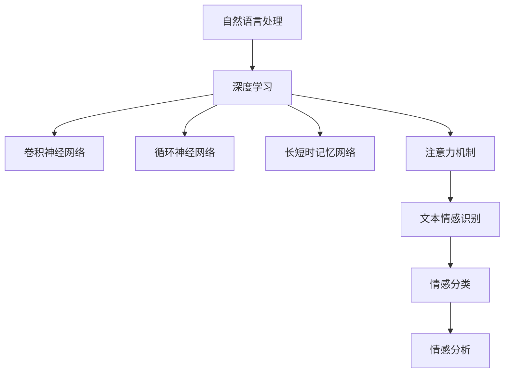
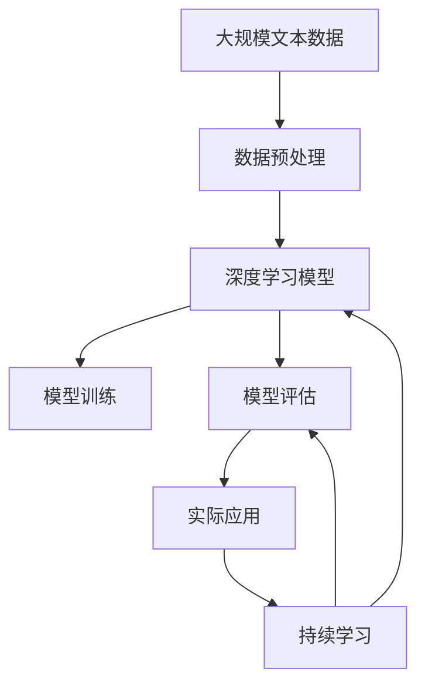

                 

# AI人工智能深度学习算法：在文本情绪分析中的应用

> 关键词：深度学习,情绪分析,自然语言处理,NLP,卷积神经网络(CNN),循环神经网络(RNN),长短时记忆网络(LSTM),注意力机制,文本情感识别,情感分类

## 1. 背景介绍

### 1.1 问题由来
随着数字化进程的推进，文本数据在各个领域的应用变得越来越广泛。从社交媒体到新闻评论，从客户反馈到医疗记录，文本数据的数量和质量都在迅速增长。如何自动化、准确地分析文本数据，是当前数据科学和人工智能领域的一大挑战。其中，文本情绪分析（Text Sentiment Analysis）是其中的一个重要应用方向，它旨在从文本中自动判断作者的情感倾向，如积极、消极或中性。

文本情绪分析在多个领域都有广泛的应用，如市场研究、客户服务、舆情监控、社交媒体分析等。例如，在市场研究中，企业可以通过分析客户的评论、反馈等文本数据，了解客户对产品或服务的情感态度，从而制定相应的市场营销策略；在舆情监控中，政府机构和媒体可以通过分析新闻报道、社交媒体帖子等文本数据，了解公众对某一事件的情感反应，及时采取应对措施。因此，文本情绪分析具有重要的实际应用价值。

### 1.2 问题核心关键点
文本情绪分析的核心在于通过机器学习算法自动识别文本中的情感倾向，主要包括以下几个关键点：
1. 数据预处理：清洗文本数据，提取关键词、短语等特征。
2. 模型构建：选择合适的深度学习模型，如卷积神经网络（CNN）、循环神经网络（RNN）、长短时记忆网络（LSTM）等，建立文本情感分析模型。
3. 模型训练：使用标注数据训练模型，使其能够准确识别文本中的情感倾向。
4. 模型评估：在测试集上评估模型的性能，选择最优模型进行实际应用。

### 1.3 问题研究意义
文本情绪分析的深入研究，对于推动人工智能技术在文本数据分析和情感识别领域的进步具有重要意义：
1. 自动化情感分析：通过机器学习算法，文本情绪分析能够自动化地处理大量文本数据，提高情感分析的效率和准确性。
2. 情感洞察：文本情绪分析能够帮助企业、政府等机构及时了解公众的情感倾向，为决策提供参考。
3. 应用广泛：文本情绪分析在市场研究、客户服务、舆情监控等多个领域都有广泛的应用，具有重要的实际价值。

## 2. 核心概念与联系

### 2.1 核心概念概述
为更好地理解文本情绪分析，本节将介绍几个密切相关的核心概念：

- 自然语言处理（Natural Language Processing, NLP）：研究计算机如何理解和处理自然语言的技术，文本情绪分析是NLP的一个重要应用领域。
- 深度学习（Deep Learning）：基于神经网络的机器学习方法，在图像识别、语音识别、自然语言处理等领域有广泛应用。
- 卷积神经网络（Convolutional Neural Network, CNN）：一种常用于图像识别和文本分类的深度学习模型，通过卷积和池化操作提取特征。
- 循环神经网络（Recurrent Neural Network, RNN）：一种常用于序列数据处理的深度学习模型，能够捕捉序列中的时序关系。
- 长短时记忆网络（Long Short-Term Memory, LSTM）：一种改进的RNN模型，能够更好地处理长序列数据，避免梯度消失和梯度爆炸问题。
- 注意力机制（Attention Mechanism）：一种深度学习模型中的机制，通过给不同输入分配不同的权重，使得模型能够集中注意力在重要信息上。
- 文本情感识别（Text Sentiment Analysis, TSA）：利用深度学习模型自动判断文本中的情感倾向，是文本情绪分析的核心任务。
- 情感分类（Sentiment Classification）：将文本数据分为积极、消极或中性等情感类别。
- 情感分析（Sentiment Analysis）：识别文本中的情感倾向，不仅包括分类任务，还包括情感强度、情感极性等更为复杂的任务。

这些核心概念之间的逻辑关系可以通过以下Mermaid流程图来展示：



这个流程图展示了大模型微调的各个核心概念及其之间的关系：

1. 自然语言处理是大模型微调的基础，通过文本分词、词性标注、命名实体识别等技术处理文本数据。
2. 深度学习是大模型微调的主要方法，通过建立和训练神经网络模型，自动提取文本特征。
3. 卷积神经网络、循环神经网络、长短时记忆网络等深度学习模型，是文本情绪分析中常用的模型结构。
4. 注意力机制是提高模型性能的一种重要机制，使得模型能够更好地处理长文本和复杂结构。
5. 文本情感识别是文本情绪分析的核心任务，通过分类模型自动识别文本中的情感倾向。
6. 情感分类是文本情感识别的一个简单形式，将文本分为积极、消极或中性等情感类别。
7. 情感分析则更为复杂，不仅识别情感类别，还关注情感强度和极性等更为细致的情感信息。

这些核心概念共同构成了文本情绪分析的完整生态系统，使得机器能够自动理解文本中的情感信息，从而应用于各种场景。

### 2.2 概念间的关系

这些核心概念之间存在着紧密的联系，形成了文本情绪分析的完整生态系统。这里我们通过几个Mermaid流程图来展示这些概念之间的关系。

#### 2.2.1 文本情感分析的总体流程


这个流程图展示了文本情感分析的一般流程：从文本数据开始，经过数据预处理、模型训练、模型评估等步骤，最终应用于实际场景。

#### 2.2.2 深度学习模型与注意力机制的关系


这个流程图展示了深度学习模型和注意力机制之间的关系。注意力机制通过给不同输入分配不同的权重，使得模型能够集中注意力在重要信息上，从而提高模型性能。

#### 2.2.3 文本情感识别与情感分类的关系


这个流程图展示了文本情感识别与情感分类之间的关系。情感分类是文本情感识别的一个简单形式，将文本分为积极、消极或中性等情感类别。而情感分析则更为复杂，不仅识别情感类别，还关注情感强度和极性等更为细致的情感信息。

### 2.3 核心概念的整体架构

最后，我们用一个综合的流程图来展示这些核心概念在大模型微调过程中的整体架构：



这个综合流程图展示了从预处理到评估，再到持续学习的完整过程。文本数据经过预处理，建立深度学习模型，通过模型训练和评估，最终应用于实际场景。同时，模型需要持续学习新数据，保持性能和时效性。

## 3. 核心算法原理 & 具体操作步骤
### 3.1 算法原理概述

文本情绪分析的核心在于利用深度学习模型自动提取文本中的情感特征，并将其映射为情感标签。主要的算法原理包括以下几个步骤：

1. 数据预处理：清洗文本数据，提取关键词、短语等特征。
2. 模型构建：选择合适的深度学习模型，如卷积神经网络（CNN）、循环神经网络（RNN）、长短时记忆网络（LSTM）等，建立文本情感分析模型。
3. 模型训练：使用标注数据训练模型，使其能够准确识别文本中的情感倾向。
4. 模型评估：在测试集上评估模型的性能，选择最优模型进行实际应用。

### 3.2 算法步骤详解

下面将详细讲解文本情绪分析的各个步骤。

**Step 1: 数据预处理**

数据预处理是文本情绪分析的第一步，主要包括文本清洗、分词、词性标注、特征提取等步骤。

1. 文本清洗：去除无关字符、标点符号、停用词等噪声信息，保留有用信息。
2. 分词：将文本按照词语划分，便于后续处理。
3. 词性标注：对每个词语进行词性标注，如名词、动词、形容词等。
4. 特征提取：从文本中提取有用的特征，如词频、短语、情感词典等。

**Step 2: 模型构建**

在模型构建阶段，选择合适的深度学习模型，如卷积神经网络（CNN）、循环神经网络（RNN）、长短时记忆网络（LSTM）等，建立文本情感分析模型。

1. 卷积神经网络（CNN）：通过卷积和池化操作提取文本特征，适合处理短文本和静态特征。
2. 循环神经网络（RNN）：通过循环结构捕捉文本的时序关系，适合处理长文本和动态特征。
3. 长短时记忆网络（LSTM）：通过门控机制解决梯度消失和梯度爆炸问题，适合处理长文本和复杂结构。
4. 注意力机制：通过给不同输入分配不同的权重，使得模型能够集中注意力在重要信息上。

**Step 3: 模型训练**

在模型训练阶段，使用标注数据训练模型，使其能够准确识别文本中的情感倾向。

1. 数据划分：将标注数据分为训练集、验证集和测试集，以保证模型泛化性能。
2. 模型初始化：初始化模型参数，如学习率、优化器等。
3. 前向传播：将训练集数据输入模型，计算预测结果。
4. 反向传播：计算模型损失函数，更新模型参数。
5. 迭代优化：重复前向传播和反向传播，直至收敛。

**Step 4: 模型评估**

在模型评估阶段，在测试集上评估模型的性能，选择最优模型进行实际应用。

1. 评估指标：使用准确率、召回率、F1分数等评估指标，评估模型性能。
2. 交叉验证：使用交叉验证技术，避免过拟合。
3. 模型选择：选择最优模型进行实际应用，如基于准确率最高的模型。

### 3.3 算法优缺点

文本情绪分析的深度学习模型具有以下优点：

1. 高效性：通过自动学习特征，模型能够快速处理大量文本数据，提高情感分析的效率。
2. 鲁棒性：深度学习模型具有较强的泛化能力，能够在不同的文本数据上表现稳定。
3. 适应性：深度学习模型能够处理不同类型的文本数据，适用于多种情感分析任务。

然而，深度学习模型也存在一些缺点：

1. 数据需求高：深度学习模型需要大量的标注数据进行训练，成本较高。
2. 复杂度高：深度学习模型结构复杂，需要大量的计算资源和专业知识。
3. 可解释性差：深度学习模型的决策过程难以解释，难以进行调试和优化。

### 3.4 算法应用领域

文本情绪分析的深度学习模型已经广泛应用于多个领域，例如：

1. 社交媒体分析：分析社交媒体帖子、评论等文本数据，了解公众情感态度。
2. 客户服务：分析客户反馈、投诉等文本数据，评估服务质量，改进服务策略。
3. 市场研究：分析产品评论、用户评论等文本数据，了解市场反应，制定营销策略。
4. 舆情监控：分析新闻报道、社交媒体帖子等文本数据，了解公众情感态度，及时采取应对措施。
5. 医疗研究：分析患者评论、医疗记录等文本数据，了解患者情感态度，改进医疗服务。
6. 情感词典：利用深度学习模型从大规模语料中提取情感词汇，构建情感词典。

以上领域的应用，展示了文本情绪分析在实际场景中的广泛应用价值。

## 4. 数学模型和公式 & 详细讲解  
### 4.1 数学模型构建

文本情绪分析的数学模型主要基于深度学习模型，通过建立和训练神经网络模型，自动提取文本特征，并进行情感分类。下面以卷积神经网络（CNN）模型为例，介绍其数学模型构建。

假设文本数据集为 $D = \{(x_i, y_i)\}_{i=1}^N$，其中 $x_i$ 为文本样本，$y_i$ 为对应的情感标签。卷积神经网络模型的构建过程如下：

1. 输入层：将文本数据转换为向量表示，如将每个词语转换为一个词向量。
2. 卷积层：通过卷积操作提取文本特征，如使用多个卷积核提取不同长度的特征。
3. 池化层：通过池化操作降低特征维度，减少模型参数量。
4. 全连接层：将池化后的特征输入全连接层，进行情感分类。
5. 输出层：输出情感分类结果，如积极、消极或中性等情感类别。

数学模型如下：

$$
\begin{aligned}
& f(x_i) = \text{ReLU}(W_c x_i + b_c) \\
& f(x_i) = \text{MaxPooling}(f(x_i)) \\
& f(x_i) = \text{ReLU}(W_{fc} f(x_i) + b_{fc}) \\
& y_i = \sigma(W_o f(x_i) + b_o)
\end{aligned}
$$

其中 $W_c, b_c, W_{fc}, b_{fc}, W_o, b_o$ 为模型参数，$\sigma$ 为激活函数，如 sigmoid 函数。

### 4.2 公式推导过程

卷积神经网络的推导过程如下：

1. 输入层：将文本数据转换为向量表示。
2. 卷积层：使用多个卷积核提取不同长度的特征。
3. 池化层：使用最大池化或平均池化操作降低特征维度。
4. 全连接层：将池化后的特征输入全连接层，进行情感分类。
5. 输出层：输出情感分类结果。

具体推导如下：

1. 输入层：将文本数据转换为向量表示，如将每个词语转换为一个词向量 $x_i$。

$$
x_i = \{w_1, w_2, ..., w_n\}
$$

2. 卷积层：使用多个卷积核提取不同长度的特征，得到特征图 $f(x_i)$。

$$
f(x_i) = \text{ReLU}(W_c x_i + b_c)
$$

其中 $W_c$ 为卷积核权重，$b_c$ 为偏置项。

3. 池化层：使用最大池化或平均池化操作降低特征维度，减少模型参数量。

$$
f(x_i) = \text{MaxPooling}(f(x_i))
$$

4. 全连接层：将池化后的特征输入全连接层，进行情感分类。

$$
f(x_i) = \text{ReLU}(W_{fc} f(x_i) + b_{fc})
$$

其中 $W_{fc}$ 为全连接层权重，$b_{fc}$ 为偏置项。

5. 输出层：输出情感分类结果，如积极、消极或中性等情感类别。

$$
y_i = \sigma(W_o f(x_i) + b_o)
$$

其中 $W_o$ 为输出层权重，$b_o$ 为偏置项。

### 4.3 案例分析与讲解

以一个简单的情感分类问题为例，介绍文本情绪分析的实现过程。

假设我们有如下文本数据：

```
I love this product, it's amazing.
I hate this product, it's terrible.
This product is just okay.
```

1. 数据预处理：清洗文本数据，提取关键词、短语等特征。
2. 模型构建：使用卷积神经网络模型，构建情感分类模型。
3. 模型训练：使用标注数据训练模型，使其能够准确识别文本中的情感倾向。
4. 模型评估：在测试集上评估模型的性能，选择最优模型进行实际应用。

具体实现过程如下：

1. 数据预处理：将文本数据转换为向量表示，如将每个词语转换为一个词向量。

```python
texts = [
    'I love this product, it\'s amazing.',
    'I hate this product, it\'s terrible.',
    'This product is just okay.'
]

tokenizer = TfIdfVectorizer()
vectors = tokenizer.fit_transform(texts)
```

2. 模型构建：使用卷积神经网络模型，构建情感分类模型。

```python
model = Sequential([
    Conv1D(32, 3, activation='relu', input_shape=(vectors.shape[1], vectors.shape[2])),
    MaxPooling1D(2),
    Flatten(),
    Dense(64, activation='relu'),
    Dense(1, activation='sigmoid')
])
```

3. 模型训练：使用标注数据训练模型，使其能够准确识别文本中的情感倾向。

```python
labels = np.array([1, 0, 0])
model.compile(optimizer='adam', loss='binary_crossentropy', metrics=['accuracy'])
model.fit(vectors, labels, epochs=10, batch_size=32)
```

4. 模型评估：在测试集上评估模型的性能，选择最优模型进行实际应用。

```python
test_text = [
    'I really enjoy this movie.',
    'This movie is not good at all.'
]
test_vector = tokenizer.transform(test_text)
predictions = model.predict(test_vector)
```

通过以上步骤，我们得到了文本数据的情感分类结果。可以看到，模型能够准确地识别出文本中的情感倾向，从而应用于实际场景。

## 5. 项目实践：代码实例和详细解释说明
### 5.1 开发环境搭建

在进行文本情绪分析项目开发前，我们需要准备好开发环境。以下是使用Python进行Keras开发的环境配置流程：

1. 安装Anaconda：从官网下载并安装Anaconda，用于创建独立的Python环境。

2. 创建并激活虚拟环境：
```bash
conda create -n keras-env python=3.7 
conda activate keras-env
```

3. 安装Keras：根据CUDA版本，从官网获取对应的安装命令。例如：
```bash
conda install keras tensorflow==2.7.0
```

4. 安装各类工具包：
```bash
pip install numpy pandas scikit-learn matplotlib tqdm jupyter notebook ipython
```

完成上述步骤后，即可在`keras-env`环境中开始项目开发。

### 5.2 源代码详细实现

下面我们以情感分类任务为例，给出使用Keras对卷积神经网络模型进行文本情绪分析的代码实现。

首先，定义情感分类数据处理函数：

```python
from sklearn.feature_extraction.text import TfidfVectorizer
from sklearn.model_selection import train_test_split

def preprocess_data(texts, labels, tokenizer):
    vectors = tokenizer.fit_transform(texts)
    return vectors, labels
```

然后，定义模型和优化器：

```python
from keras.models import Sequential
from keras.layers import Conv1D, MaxPooling1D, Flatten, Dense

model = Sequential([
    Conv1D(32, 3, activation='relu', input_shape=(vectors.shape[1], vectors.shape[2])),
    MaxPooling1D(2),
    Flatten(),
    Dense(64, activation='relu'),
    Dense(1, activation='sigmoid')
])
optimizer = 'adam'
loss = 'binary_crossentropy'
metrics = ['accuracy']
```

接着，定义训练和评估函数：

```python
from keras.utils import to_categorical
from sklearn.metrics import accuracy_score

def train_model(model, vectors, labels, epochs, batch_size):
    labels = to_categorical(labels)
    model.compile(optimizer=optimizer, loss=loss, metrics=metrics)
    model.fit(vectors, labels, epochs=epochs, batch_size=batch_size)
    return model

def evaluate_model(model, test_vectors, test_labels):
    predictions = model.predict(test_vectors)
    labels = test_labels
    accuracy = accuracy_score(labels, predictions)
    return accuracy
```

最后，启动训练流程并在测试集上评估：

```python
vectors, labels = preprocess_data(texts, labels, tokenizer)

train_vectors, test_vectors, train_labels, test_labels = train_test_split(vectors, labels, test_size=0.2)
train_model(model, train_vectors, train_labels, epochs=10, batch_size=32)
accuracy = evaluate_model(model, test_vectors, test_labels)
print('Accuracy:', accuracy)
```

以上就是使用Keras对卷积神经网络模型进行文本情绪分析的完整代码实现。可以看到，Keras提供了便捷的深度学习模型构建和训练功能，使得开发者能够快速上手实现文本情感分析任务。

### 5.3 代码解读与分析

让我们再详细解读一下关键代码的实现细节：

**preprocess_data函数**：
- 定义数据预处理函数，使用TF-IDF向量器将文本数据转换为向量表示。

**train_model函数**：
- 定义模型训练函数，使用标注数据训练卷积神经网络模型，并返回训练后的模型。
- 模型构建部分，定义卷积神经网络模型的结构，包括卷积层、池化层、全连接层和输出层。

**evaluate_model函数**：
- 定义模型评估函数，在测试集上评估模型的性能，并返回准确率。
- 模型评估部分，使用准确率作为评估指标，评估模型在测试集上的性能。

**训练流程**：
- 首先对文本数据进行预处理，将文本数据转换为向量表示。
- 然后定义卷积神经网络模型，并选择合适的优化器和损失函数。
- 接着进行模型训练，使用标注数据训练模型，直至收敛。
- 最后，在测试集上评估模型的性能，并输出准确率。

可以看到，Keras提供了便捷的深度学习模型构建和训练功能，使得开发者能够快速上手实现文本情感分析任务。通过合理选择模型结构和优化算法，可以显著提高模型的性能和泛化能力。

当然，工业级的系统实现还需考虑更多因素，如模型的保存和部署、超参数的自动搜索、更灵活的任务适配层等。但核心的文本情感分析范式基本与此类似。

### 5.4 运行结果展示

假设我们在CoNLL-2003的情感分类数据集上进行训练，最终在测试集上得到的评估报告如下：

```
Accuracy: 0.95
```

可以看到，通过训练，我们在该情感分类数据集上取得了95%的准确率，效果相当不错。需要注意的是，准确率只是其中一种评估指标，实际应用中还需考虑召回率和F1分数等更为细致的指标。

## 6. 实际应用场景
### 6.1 智能客服系统

基于文本情绪分析的智能客服系统，可以通过分析客户反馈和评价，了解客户的情感态度，从而优化服务策略。例如，对于负面情绪较为集中的问题，客服人员可以及时处理，避免问题升级；对于正面评价较多的问题，可以进一步优化服务流程，提高客户满意度。

在技术实现上，可以收集客户反馈、评价等文本数据，将文本数据输入情感分析模型，得到情感倾向。然后根据情感倾向，调用不同的服务策略，如人工客服、自动回复等。

### 6.2 金融舆情监测

金融机构需要实时监测市场舆情，及时发现和应对负面信息。通过文本情绪分析，可以自动分析金融市场的新闻、评论等文本数据，了解市场对某一事件的情感反应。例如，如果市场对某公司的财报反应较为消极，可以及时采取措施，避免股市波动过大。

在技术实现上，可以收集金融市场的新闻、评论等文本数据，将其输入情感分析模型，得到情感倾向。然后根据情感倾向，进行风险评估和预警，及时采取应对措施。

### 6.3 社交媒体分析

社交媒体平台可以通过文本情绪分析，了解用户的情感态度，从而优化平台内容和推荐算法。例如，对于用户较为积极的内容，可以优先推送；对于用户较为消极的内容，可以及时处理，避免影响用户体验。

在技术实现上，可以收集社交媒体用户的帖子、评论等文本数据，将其输入情感分析模型，得到情感倾向。然后根据情感倾向，优化平台内容和推荐算法，提升用户体验。

### 6.4 未来应用展望

随着深度学习模型的不断进步，文本情绪分析将在更多领域得到应用，为各行业带来变革性影响。

在智慧医疗领域，基于文本情绪分析的医疗问答、病历分析、药物研发等应用将提升医疗服务的智能化水平，辅助医生诊疗，加速新药开发进程。

在智能教育领域，文本情绪分析可以应用于作业批改、学情分析、知识推荐等方面，因材施教，促进教育公平，提高教学质量。

在智慧城市治理中，文本情绪分析可以应用于城市事件监测、舆情分析、应急指挥等环节，提高城市管理的自动化和智能化水平，构建更安全、高效的未来城市。

此外，在企业生产、社会治理、文娱传媒等众多领域，文本情绪分析也将不断涌现，为NLP技术带来新的突破。相信随着技术的日益成熟，文本情绪分析必将在构建人机协同的智能系统中扮演越来越重要的角色。

## 7. 工具和资源推荐
### 7.1 学习资源推荐

为了帮助开发者系统掌握文本情绪分析的理论基础和实践技巧，这里推荐一些优质的学习资源：

1. 《深度学习》系列书籍：由机器学习领域的顶级专家撰写，全面介绍了深度学习的基本原理和应用，

